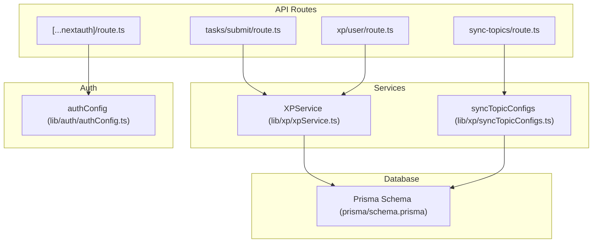
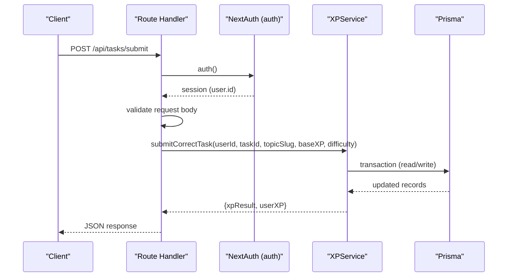
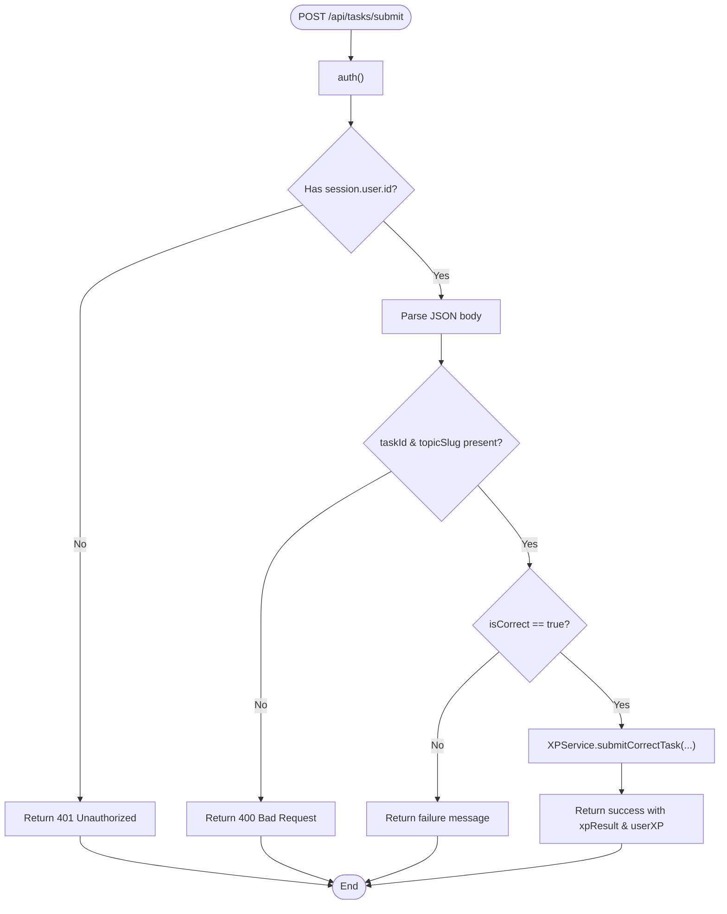
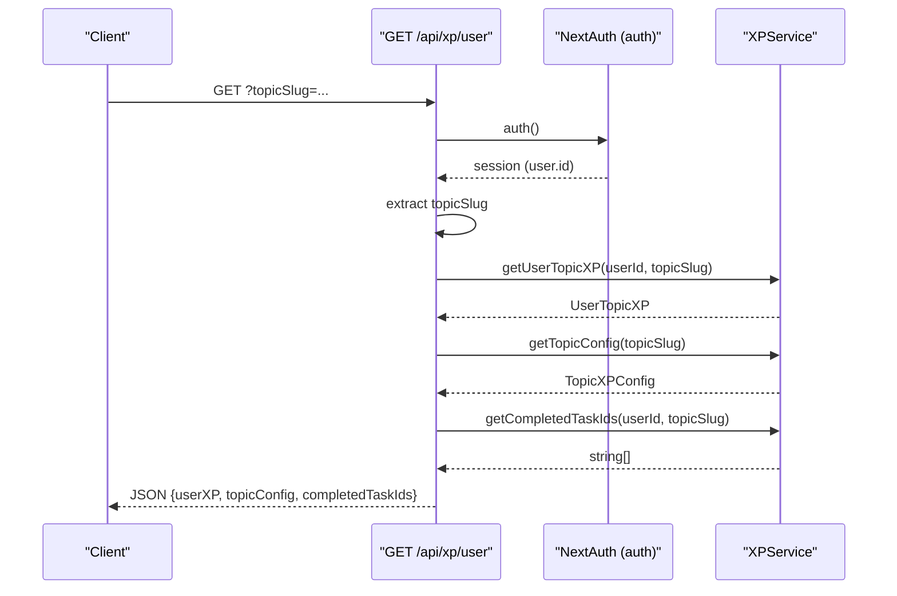
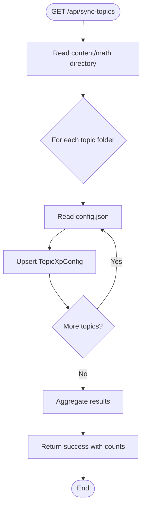
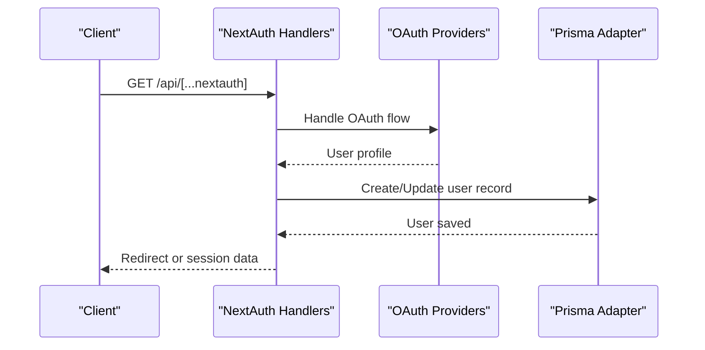
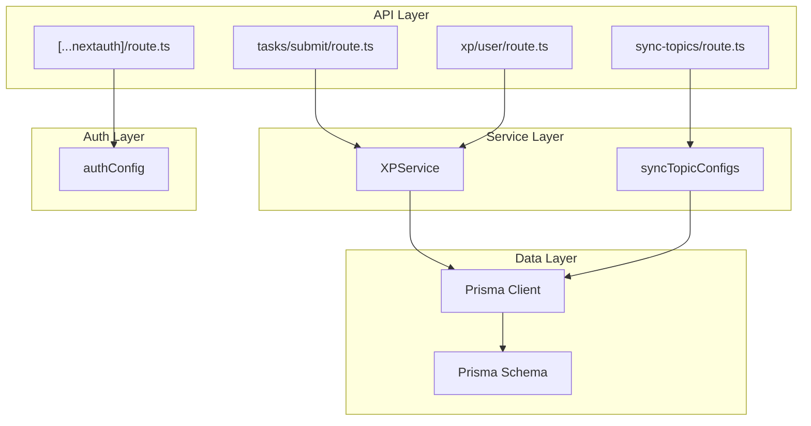

# API Reference

<cite>
**Referenced Files in This Document**
- [tasks-submit-route.ts](file://app/api/tasks/submit/route.ts)
- [xp-user-route.ts](file://app/api/xp/user/route.ts)
- [sync-topics-route.ts](file://app/api/sync-topics/route.ts)
- [nextauth-route.ts](file://app/api/[...nextauth]/route.ts)
- [xp-service.ts](file://lib/xp/xpService.ts)
- [auth-config.ts](file://lib/auth/authConfig.ts)
- [sync-topic-configs.ts](file://lib/xp/syncTopicConfigs.ts)
- [types-xp.ts](file://types/xp.ts)
- [prisma-schema.prisma](file://prisma/schema.prisma)
- [instrumentation.ts](file://instrumentation.ts)
</cite>

## Table of Contents
1. [Introduction](#introduction)
2. [Project Structure](#project-structure)
3. [Core Components](#core-components)
4. [Architecture Overview](#architecture-overview)
5. [Detailed Component Analysis](#detailed-component-analysis)
6. [Dependency Analysis](#dependency-analysis)
7. [Performance Considerations](#performance-considerations)
8. [Troubleshooting Guide](#troubleshooting-guide)
9. [Conclusion](#conclusion)

## Introduction
This document provides comprehensive API documentation for the REST endpoints in the mathematics learning application. It covers:
- Task submission endpoint with XP calculation logic
- XP retrieval endpoint for user progress tracking
- Topic synchronization endpoint for content management
- NextAuth authentication endpoints

Each endpoint includes HTTP methods, URL patterns, request/response formats, authentication requirements, error handling, and practical integration guidelines.

## Project Structure
The API endpoints are located under the Next.js app router at app/api. Authentication is handled by NextAuth, while XP calculations and database operations are encapsulated in service classes.

**Diagram sources**
- [tasks-submit-route.ts](file://app/api/tasks/submit/route.ts#L1-L59)
- [xp-user-route.ts](file://app/api/xp/user/route.ts#L1-L41)
- [sync-topics-route.ts](file://app/api/sync-topics/route.ts#L1-L19)
- [nextauth-route.ts](file://app/api/[...nextauth]/route.ts#L1-L4)
- [xp-service.ts](file://lib/xp/xpService.ts#L1-L795)
- [sync-topic-configs.ts](file://lib/xp/syncTopicConfigs.ts#L1-L174)
- [auth-config.ts](file://lib/auth/authConfig.ts#L1-L83)
- [prisma-schema.prisma](file://prisma/schema.prisma#L1-L143)

**Section sources**
- [tasks-submit-route.ts](file://app/api/tasks/submit/route.ts#L1-L59)
- [xp-user-route.ts](file://app/api/xp/user/route.ts#L1-L41)
- [sync-topics-route.ts](file://app/api/sync-topics/route.ts#L1-L19)
- [nextauth-route.ts](file://app/api/[...nextauth]/route.ts#L1-L4)

## Core Components
This section outlines the primary components that handle API requests and business logic.

- Task Submission Endpoint: Validates session, processes task correctness, calculates XP using XPService, and returns structured results.
- XP Retrieval Endpoint: Authenticates users, retrieves user topic XP, topic configuration, and completed task IDs.
- Topic Synchronization Endpoint: Reads topic configuration files and synchronizes them with the database.
- NextAuth Authentication Endpoints: Exposes NextAuth handlers for GET/POST requests.

Key integration points:
- All endpoints use NextAuth for authentication via the auth() helper.
- XP calculations leverage Prisma ORM for database transactions.
- Topic synchronization reads from the content filesystem and writes to the database.

**Section sources**
- [tasks-submit-route.ts](file://app/api/tasks/submit/route.ts#L6-L58)
- [xp-user-route.ts](file://app/api/xp/user/route.ts#L5-L40)
- [sync-topics-route.ts](file://app/api/sync-topics/route.ts#L8-L18)
- [nextauth-route.ts](file://app/api/[...nextauth]/route.ts#L1-L4)

## Architecture Overview
The API follows a layered architecture:
- Route handlers validate requests and delegate to service classes.
- Services encapsulate XP calculation logic and database operations.
- NextAuth manages authentication and session retrieval.
- Prisma provides type-safe database access.

**Diagram sources**
- [tasks-submit-route.ts](file://app/api/tasks/submit/route.ts#L6-L58)
- [xp-service.ts](file://lib/xp/xpService.ts#L118-L293)
- [auth-config.ts](file://lib/auth/authConfig.ts#L64-L82)

## Detailed Component Analysis

### Task Submission API
- Method: POST
- URL: /api/tasks/submit
- Authentication: Required (NextAuth session)
- Purpose: Submit a correct task and calculate XP with SRS and anti-grind mechanics.

Request Body (JSON):
- taskId: string (required)
- topicSlug: string (required)
- isCorrect: boolean (required; must be true)
- userAnswer: any (optional)
- baseXP: number (optional)
- difficulty: string (optional; accepts "easy", "medium"/"moderate", "hard")

Response (JSON):
- success: boolean
- xpResult: XPCalculationResult (when successful)
- userXP: UserTopicXP (when successful)
- message: string (when successful)
- error: string (when unsuccessful)

XPCalculationResult fields:
- xpEarned: number
- nextReviewDate: Date | null
- masteryLevel: number
- reviewCount: number
- message: string
- isScheduledReview: boolean
- multiplier: number
- dailyTaskIndex: number
- isTooEarly: boolean
- isHotTopic: boolean

UserTopicXP fields:
- id: number
- userId: string
- topicSlug: string
- currentXp: number
- totalXpEarned: number
- level: number
- lastActivity: Date
- dailyTasksCount: number
- dailyTasksDate: string | Date
- srsStage: number
- nextReviewDate: string | Date | null
- lastPracticedDate: string | Date | null
- createdAt: Date
- computed fields: currentLevelMinXp?, nextLevelXp?

Error Responses:
- 401 Unauthorized: No active session
- 400 Bad Request: Missing required fields
- 500 Internal Server Error: Unexpected errors

Integration Guidelines:
- Ensure the client sends a valid NextAuth session cookie.
- For incorrect answers, do not call this endpoint; handle UI feedback separately.
- Use baseXP or difficulty to override default XP values when needed.

**Section sources**
- [tasks-submit-route.ts](file://app/api/tasks/submit/route.ts#L6-L58)
- [types-xp.ts](file://types/xp.ts#L83-L113)
- [types-xp.ts](file://types/xp.ts#L50-L68)
- [auth-config.ts](file://lib/auth/authConfig.ts#L64-L82)

#### Task Submission Flow

**Diagram sources**
- [tasks-submit-route.ts](file://app/api/tasks/submit/route.ts#L6-L58)
- [xp-service.ts](file://lib/xp/xpService.ts#L118-L293)

### XP Retrieval API
- Method: GET
- URL: /api/xp/user?topicSlug={slug}
- Authentication: Required (NextAuth session)
- Purpose: Retrieve user XP, topic configuration, and completed task IDs for a given topic.

Query Parameters:
- topicSlug: string (required)

Response (JSON):
- userXP: UserTopicXP
- topicConfig: TopicXPConfig
- completedTaskIds: string[]

Error Responses:
- 401 Unauthorized: No active session
- 400 Bad Request: Missing topicSlug
- 500 Internal Server Error: Unexpected errors

Integration Guidelines:
- Always pass topicSlug to target a specific topic.
- Use completedTaskIds to determine which tasks are eligible for review.

**Section sources**
- [xp-user-route.ts](file://app/api/xp/user/route.ts#L5-L40)
- [types-xp.ts](file://types/xp.ts#L26-L48)
- [types-xp.ts](file://types/xp.ts#L50-L68)
- [types-xp.ts](file://types/xp.ts#L126-L130)

#### XP Retrieval Sequence

**Diagram sources**
- [xp-user-route.ts](file://app/api/xp/user/route.ts#L5-L40)
- [xp-service.ts](file://lib/xp/xpService.ts#L325-L350)
- [xp-service.ts](file://lib/xp/xpService.ts#L313-L320)
- [xp-service.ts](file://lib/xp/xpService.ts#L759-L793)

### Topic Synchronization API
- Method: GET
- URL: /api/sync-topics
- Authentication: Not required
- Purpose: Synchronize topic configurations from content files to the database.

Behavior:
- Scans content/math directory for topic folders.
- Reads config.json for each topic.
- Upserts TopicXpConfig records in the database.
- Supports optional environment flag to skip on startup.

Response (JSON):
- success: boolean
- synced: number
- total: number
- results: array of { topicSlug, success, result|error }

Error Responses:
- 500 Internal Server Error: Unexpected errors during sync.

Integration Guidelines:
- Call this endpoint after adding new topics or updating config.json files.
- Can be triggered manually or via deployment scripts.

**Section sources**
- [sync-topics-route.ts](file://app/api/sync-topics/route.ts#L8-L18)
- [sync-topic-configs.ts](file://lib/xp/syncTopicConfigs.ts#L10-L49)
- [instrumentation.ts](file://instrumentation.ts#L21-L34)

#### Topic Synchronization Flow

**Diagram sources**
- [sync-topics-route.ts](file://app/api/sync-topics/route.ts#L8-L18)
- [sync-topic-configs.ts](file://lib/xp/syncTopicConfigs.ts#L10-L49)

### NextAuth Authentication Endpoints
- Methods: GET, POST
- URL: /api/[...nextauth]
- Authentication: Not required (handled by NextAuth)
- Providers: Google, GitHub, Facebook, Resend, Google One Tap (Credentials)

Behavior:
- Exposes NextAuth handlers for sign-in, sign-out, and session management.
- Uses Prisma adapter for database-backed sessions.
- Session strategy: JWT with 24-day max age.

Integration Guidelines:
- Use NextAuth client-side hooks for login/logout.
- Configure environment variables for provider credentials.
- Redirects to /auth/signin-popup for sign-in page.

**Section sources**
- [nextauth-route.ts](file://app/api/[...nextauth]/route.ts#L1-L4)
- [auth-config.ts](file://lib/auth/authConfig.ts#L16-L82)

#### NextAuth Authentication Sequence

**Diagram sources**
- [nextauth-route.ts](file://app/api/[...nextauth]/route.ts#L1-L4)
- [auth-config.ts](file://lib/auth/authConfig.ts#L16-L82)

## Dependency Analysis
The API relies on several key dependencies and their relationships.

**Diagram sources**
- [tasks-submit-route.ts](file://app/api/tasks/submit/route.ts#L1-L59)
- [xp-user-route.ts](file://app/api/xp/user/route.ts#L1-L41)
- [sync-topics-route.ts](file://app/api/sync-topics/route.ts#L1-L19)
- [nextauth-route.ts](file://app/api/[...nextauth]/route.ts#L1-L4)
- [xp-service.ts](file://lib/xp/xpService.ts#L1-L795)
- [sync-topic-configs.ts](file://lib/xp/syncTopicConfigs.ts#L1-L174)
- [auth-config.ts](file://lib/auth/authConfig.ts#L1-L83)
- [prisma-schema.prisma](file://prisma/schema.prisma#L1-L143)

**Section sources**
- [prisma-schema.prisma](file://prisma/schema.prisma#L70-L142)
- [auth-config.ts](file://lib/auth/authConfig.ts#L1-L83)

## Performance Considerations
- Transaction Safety: XP calculations use Prisma transactions to ensure atomicity for XP updates, SRS stage progression, and task attempts.
- Indexes: Database schema includes indexes on frequently queried fields (e.g., user/topic combinations, next review dates) to optimize lookups.
- Daily Multipliers: Anti-grind mechanism caps XP growth after a configurable number of daily tasks, preventing excessive XP accumulation.
- Startup Sync: Topic synchronization runs on server startup with graceful failure handling to avoid blocking application boot.

[No sources needed since this section provides general guidance]

## Troubleshooting Guide
Common issues and resolutions:
- Authentication Failures: Ensure the client includes a valid NextAuth session cookie. Verify auth() resolves a session with user.id.
- Missing Required Fields: For task submission, confirm taskId and topicSlug are present in the request body.
- Topic Config Not Found: For XP retrieval, ensure the topicSlug exists in TopicXpConfig; otherwise, the service throws an error.
- Database Connectivity: If database is unavailable during startup, instrumentation logs warnings and continues without crashing.

**Section sources**
- [tasks-submit-route.ts](file://app/api/tasks/submit/route.ts#L8-L15)
- [tasks-submit-route.ts](file://app/api/tasks/submit/route.ts#L20-L25)
- [xp-user-route.ts](file://app/api/xp/user/route.ts#L9-L21)
- [instrumentation.ts](file://instrumentation.ts#L35-L42)

## Conclusion
The API provides robust endpoints for task submission with sophisticated XP calculation, user progress retrieval, topic synchronization, and NextAuth integration. The design emphasizes transaction safety, anti-grind mechanisms, and SRS-driven review scheduling. Integrators should ensure proper authentication, validate request parameters, and handle error responses appropriately.