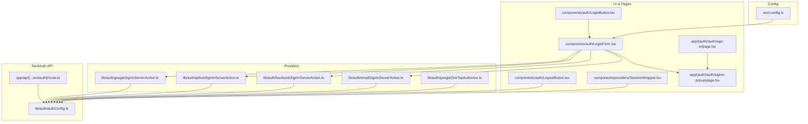
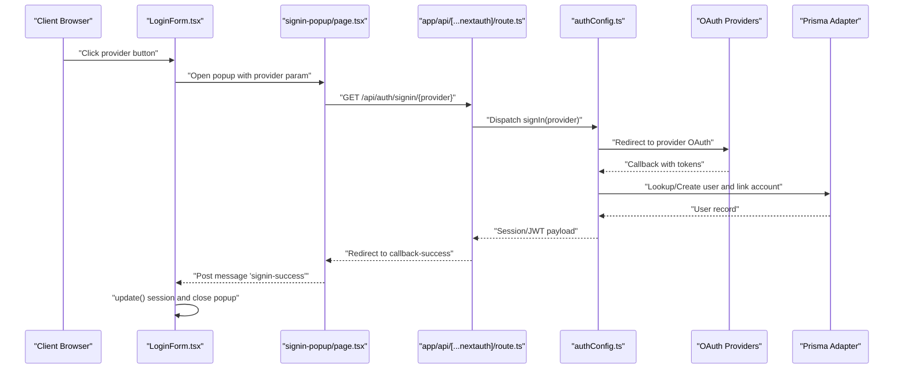
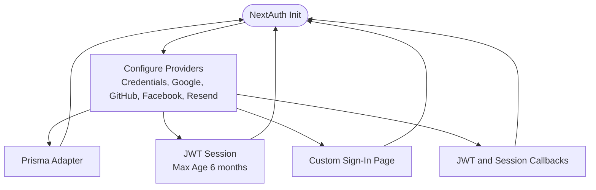
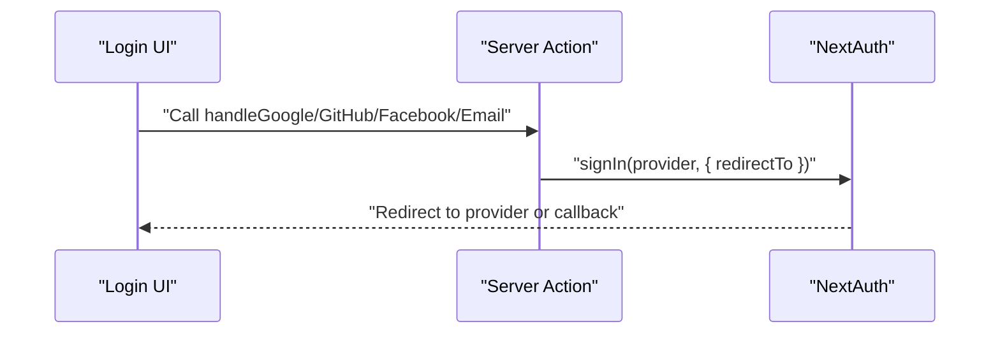
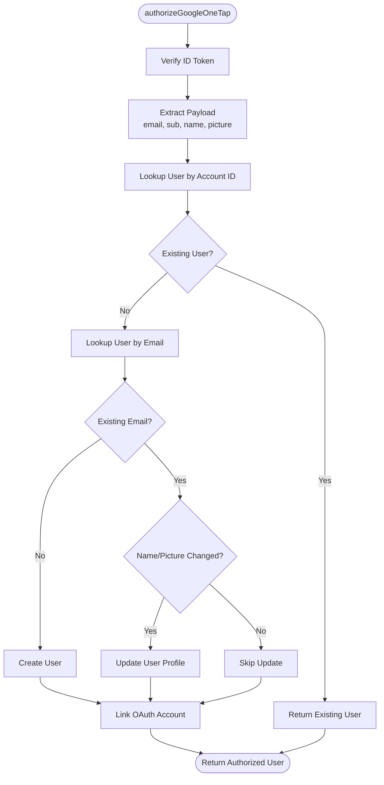
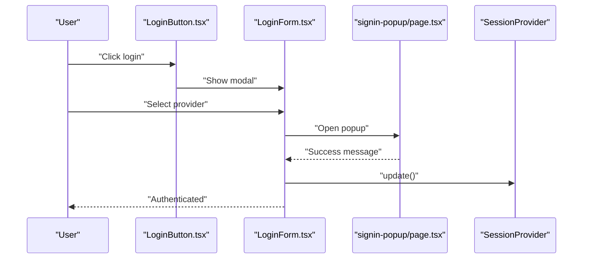
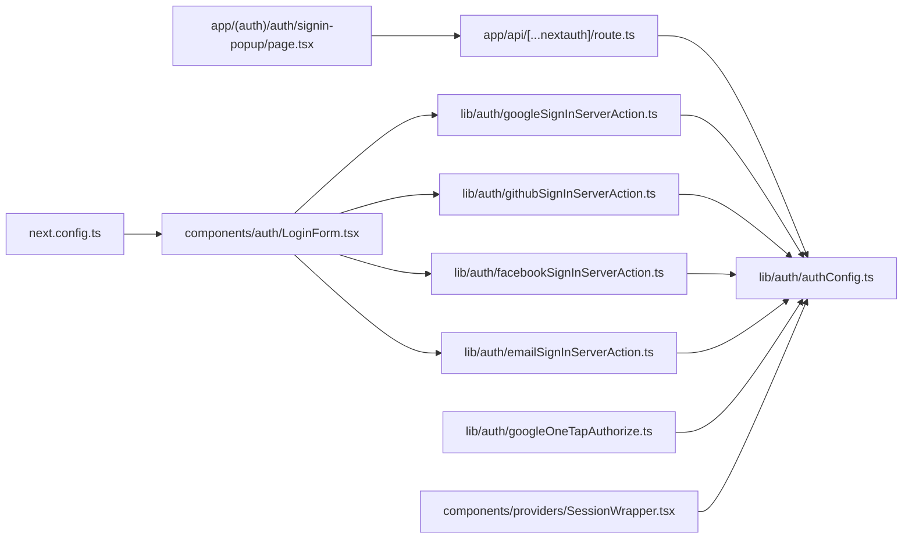

# Authentication Endpoints

<cite>
**Referenced Files in This Document**
- [authConfig.ts](file://lib/auth/authConfig.ts)
- [route.ts](file://app/api/[...nextauth]/route.ts)
- [googleSignInServerAction.ts](file://lib/auth/googleSignInServerAction.ts)
- [githubSignInServerAction.ts](file://lib/auth/githubSignInServerAction.ts)
- [facebookSignInServerAction.ts](file://lib/auth/facebookSignInServerAction.ts)
- [emailSignInServerAction.ts](file://lib/auth/emailSignInServerServerAction.ts)
- [googleOneTapAuthorize.ts](file://lib/auth/googleOneTapAuthorize.ts)
- [LoginButton.tsx](file://components/auth/LoginButton.tsx)
- [LoginForm.tsx](file://components/auth/LoginForm.tsx)
- [LogoutButton.tsx](file://components/auth/LogoutButton.tsx)
- [SessionWrapper.tsx](file://components/providers/SessionWrapper.tsx)
- [page.tsx](file://app/(auth)/auth/sign-in/page.tsx)
- [page.tsx](file://app/(auth)/auth/signin-popup/page.tsx)
- [next.config.ts](file://next.config.ts)
</cite>

## Table of Contents
1. [Introduction](#introduction)
2. [Project Structure](#project-structure)
3. [Core Components](#core-components)
4. [Architecture Overview](#architecture-overview)
5. [Detailed Component Analysis](#detailed-component-analysis)
6. [Dependency Analysis](#dependency-analysis)
7. [Performance Considerations](#performance-considerations)
8. [Troubleshooting Guide](#troubleshooting-guide)
9. [Conclusion](#conclusion)

## Introduction
This document provides comprehensive API documentation for the NextAuth authentication endpoints used in the application. It covers the authentication flow for OAuth providers (Google, GitHub, Facebook), email-based authentication via Resend, session management with JWT strategy, token handling, user registration and linking, callback handling, session persistence, authentication middleware, protected routes, and integration with the user management system. It also includes examples of authentication flows, session responses, and error handling for failed authentications.

## Project Structure
The authentication system is organized around:
- NextAuth configuration and provider adapters
- API routes that expose NextAuth handlers
- Server actions for initiating provider sign-ins
- Client components for login UI and session management
- Pages for sign-in and popup redirection
- Environment-specific configuration for image domains

**Diagram sources**
- [route.ts](file://app/api/[...nextauth]/route.ts#L1-L4)
- [authConfig.ts](file://lib/auth/authConfig.ts#L1-L83)
- [googleSignInServerAction.ts](file://lib/auth/googleSignInServerAction.ts#L1-L12)
- [githubSignInServerAction.ts](file://lib/auth/githubSignInServerAction.ts#L1-L11)
- [facebookSignInServerAction.ts](file://lib/auth/facebookSignInServerAction.ts#L1-L11)
- [emailSignInServerAction.ts](file://lib/auth/emailSignInServerAction.ts#L1-L12)
- [googleOneTapAuthorize.ts](file://lib/auth/googleOneTapAuthorize.ts#L1-L100)
- [LoginButton.tsx](file://components/auth/LoginButton.tsx#L1-L38)
- [LoginForm.tsx](file://components/auth/LoginForm.tsx#L1-L139)
- [LogoutButton.tsx](file://components/auth/LogoutButton.tsx#L1-L31)
- [SessionWrapper.tsx](file://components/providers/SessionWrapper.tsx#L1-L11)
- [page.tsx](file://app/(auth)/auth/sign-in/page.tsx#L1-L14)
- [page.tsx](file://app/(auth)/auth/signin-popup/page.tsx#L1-L28)
- [next.config.ts](file://next.config.ts#L1-L10)

**Section sources**
- [route.ts](file://app/api/[...nextauth]/route.ts#L1-L4)
- [authConfig.ts](file://lib/auth/authConfig.ts#L1-L83)
- [next.config.ts](file://next.config.ts#L1-L10)

## Core Components
- NextAuth configuration and handlers:
  - Exposes GET/POST handlers for NextAuth endpoints
  - Configures Prisma adapter, JWT session strategy, provider callbacks, and pages
- Provider sign-in server actions:
  - Google, GitHub, Facebook, and email (Resend) sign-in initiators
- Google One Tap authorization:
  - Validates ID tokens, manages user creation/linking, and account linking
- Client-side authentication UI:
  - Login modal and buttons, popup-based OAuth initiation, logout button
- Session management:
  - SessionProvider wrapper and session updates after successful sign-in
- Pages:
  - Sign-in page and popup redirector for OAuth flows

**Section sources**
- [authConfig.ts](file://lib/auth/authConfig.ts#L16-L83)
- [route.ts](file://app/api/[...nextauth]/route.ts#L1-L4)
- [googleSignInServerAction.ts](file://lib/auth/googleSignInServerAction.ts#L1-L12)
- [githubSignInServerAction.ts](file://lib/auth/githubSignInServerAction.ts#L1-L11)
- [facebookSignInServerAction.ts](file://lib/auth/facebookSignInServerAction.ts#L1-L11)
- [emailSignInServerAction.ts](file://lib/auth/emailSignInServerAction.ts#L1-L12)
- [googleOneTapAuthorize.ts](file://lib/auth/googleOneTapAuthorize.ts#L18-L99)
- [LoginForm.tsx](file://components/auth/LoginForm.tsx#L11-L50)
- [SessionWrapper.tsx](file://components/providers/SessionWrapper.tsx#L8-L10)
- [page.tsx](file://app/(auth)/auth/signin-popup/page.tsx#L10-L18)

## Architecture Overview
The authentication architecture integrates NextAuth with server actions and client components. Providers are configured in NextAuth, while server actions trigger provider sign-in flows. The popup page handles OAuth redirects and posts success messages back to the parent window. Session state is managed via JWT and exposed to the client through SessionProvider.

**Diagram sources**
- [LoginForm.tsx](file://components/auth/LoginForm.tsx#L18-L50)
- [page.tsx](file://app/(auth)/auth/signin-popup/page.tsx#L10-L18)
- [route.ts](file://app/api/[...nextauth]/route.ts#L1-L4)
- [authConfig.ts](file://lib/auth/authConfig.ts#L16-L83)

## Detailed Component Analysis

### NextAuth Configuration and Handlers
- Configuration highlights:
  - Prisma adapter for database-backed user/session storage
  - JWT session strategy with 6-month max age
  - Custom sign-in page mapped to a popup route
  - Providers:
    - Credentials provider for Google One Tap
    - Google, GitHub, Facebook with email account linking enabled
    - Resend provider for email magic links
- Callbacks:
  - JWT callback attaches user id to token
  - Session callback enriches session with user id from token

**Diagram sources**
- [authConfig.ts](file://lib/auth/authConfig.ts#L16-L83)

**Section sources**
- [authConfig.ts](file://lib/auth/authConfig.ts#L16-L83)

### NextAuth API Route
- Exposes NextAuth handlers for GET/POST requests
- Delegates all routing to NextAuth configuration

**Section sources**
- [route.ts](file://app/api/[...nextauth]/route.ts#L1-L4)

### Provider Sign-In Server Actions
- Google, GitHub, Facebook:
  - Trigger NextAuth sign-in with redirect to home
  - Wrapped in try/catch to propagate errors
- Email (Resend):
  - Initiates magic-link sign-in via Resend provider

**Diagram sources**
- [googleSignInServerAction.ts](file://lib/auth/googleSignInServerAction.ts#L5-L11)
- [githubSignInServerAction.ts](file://lib/auth/githubSignInServerAction.ts#L4-L10)
- [facebookSignInServerAction.ts](file://lib/auth/facebookSignInServerAction.ts#L4-L10)
- [emailSignInServerAction.ts](file://lib/auth/emailSignInServerAction.ts#L5-L11)

**Section sources**
- [googleSignInServerAction.ts](file://lib/auth/googleSignInServerAction.ts#L1-L12)
- [githubSignInServerAction.ts](file://lib/auth/githubSignInServerAction.ts#L1-L11)
- [facebookSignInServerAction.ts](file://lib/auth/facebookSignInServerAction.ts#L1-L11)
- [emailSignInServerAction.ts](file://lib/auth/emailSignInServerAction.ts#L1-L12)

### Google One Tap Authorization
- Validates ID token against Google client
- Retrieves user info (email, name, picture)
- Links existing user by provider account id or creates user if missing
- Updates user profile if name/picture changed
- Links OAuth account with id_token and token_type

**Diagram sources**
- [googleOneTapAuthorize.ts](file://lib/auth/googleOneTapAuthorize.ts#L18-L99)

**Section sources**
- [googleOneTapAuthorize.ts](file://lib/auth/googleOneTapAuthorize.ts#L18-L99)

### Client-Side Authentication UI and Session Management
- LoginButton:
  - Opens login modal via URL search param toggle
- LoginForm:
  - Opens provider sign-in in a popup with fallback to redirect
  - Listens for success message, updates session, and closes popup
- LogoutButton:
  - Clears login param and triggers sign-out action
- SessionWrapper:
  - Wraps app with SessionProvider for client-side session access

**Diagram sources**
- [LoginButton.tsx](file://components/auth/LoginButton.tsx#L10-L37)
- [LoginForm.tsx](file://components/auth/LoginForm.tsx#L18-L50)
- [page.tsx](file://app/(auth)/auth/signin-popup/page.tsx#L10-L18)
- [SessionWrapper.tsx](file://components/providers/SessionWrapper.tsx#L8-L10)

**Section sources**
- [LoginButton.tsx](file://components/auth/LoginButton.tsx#L1-L38)
- [LoginForm.tsx](file://components/auth/LoginForm.tsx#L1-L139)
- [LogoutButton.tsx](file://components/auth/LogoutButton.tsx#L1-L31)
- [SessionWrapper.tsx](file://components/providers/SessionWrapper.tsx#L1-L11)

### Pages and Routing
- Sign-in page:
  - Conditional redirect based on authentication state
- Sign-in popup:
  - Reads provider from query param and triggers NextAuth sign-in
  - Redirects to a success page after callback

**Section sources**
- [page.tsx](file://app/(auth)/auth/sign-in/page.tsx#L1-L14)
- [page.tsx](file://app/(auth)/auth/signin-popup/page.tsx#L1-L28)

### Session Persistence and JWT Handling
- Session strategy:
  - JWT-based sessions with 6-month max age
- Token augmentation:
  - User id attached to JWT token during initial login
- Session enrichment:
  - Session user object enriched with id from token
- Client session updates:
  - LoginForm listens for success and calls session update to refresh client state

**Section sources**
- [authConfig.ts](file://lib/auth/authConfig.ts#L19-L22)
- [authConfig.ts](file://lib/auth/authConfig.ts#L64-L81)
- [LoginForm.tsx](file://components/auth/LoginForm.tsx#L37-L46)

### Protected Routes and Middleware
- Current implementation does not include explicit middleware for protected routes
- Authentication state can be checked via client-side session hooks
- Suggestion: Implement middleware to protect routes by verifying session presence and role

[No sources needed since this section provides general guidance]

### Integration with User Management System
- Prisma adapter:
  - Provides getUser, getUserByEmail, getUserByAccount, createUser, updateUser, linkAccount
- Google One Tap:
  - Uses adapter to manage user lifecycle and account linking
- Provider callbacks:
  - Enrich session with user id for downstream route protection and UI

**Section sources**
- [authConfig.ts](file://lib/auth/authConfig.ts#L14)
- [googleOneTapAuthorize.ts](file://lib/auth/googleOneTapAuthorize.ts#L40-L87)

## Dependency Analysis

**Diagram sources**
- [route.ts](file://app/api/[...nextauth]/route.ts#L1-L4)
- [authConfig.ts](file://lib/auth/authConfig.ts#L1-L83)
- [googleSignInServerAction.ts](file://lib/auth/googleSignInServerAction.ts#L1-L12)
- [githubSignInServerAction.ts](file://lib/auth/githubSignInServerAction.ts#L1-L11)
- [facebookSignInServerAction.ts](file://lib/auth/facebookSignInServerAction.ts#L1-L11)
- [emailSignInServerAction.ts](file://lib/auth/emailSignInServerAction.ts#L1-L12)
- [googleOneTapAuthorize.ts](file://lib/auth/googleOneTapAuthorize.ts#L1-L100)
- [LoginForm.tsx](file://components/auth/LoginForm.tsx#L1-L139)
- [page.tsx](file://app/(auth)/auth/signin-popup/page.tsx#L1-L28)
- [SessionWrapper.tsx](file://components/providers/SessionWrapper.tsx#L1-L11)
- [next.config.ts](file://next.config.ts#L1-L10)

**Section sources**
- [route.ts](file://app/api/[...nextauth]/route.ts#L1-L4)
- [authConfig.ts](file://lib/auth/authConfig.ts#L1-L83)

## Performance Considerations
- Session strategy:
  - JWT sessions reduce database queries for authenticated requests
  - Max age set to 6 months balances security and UX
- Popup-based OAuth:
  - Minimizes full-page reloads and improves perceived performance
- Image optimization:
  - Remote pattern configured for Google avatar images to leverage optimized image delivery

**Section sources**
- [authConfig.ts](file://lib/auth/authConfig.ts#L19-L22)
- [next.config.ts](file://next.config.ts#L4-L6)

## Troubleshooting Guide
- Common issues and resolutions:
  - Popup blocked:
    - LoginForm falls back to redirect sign-in when popup fails
  - Invalid email address:
    - LoginForm validates email input and prevents submission until valid
  - Provider sign-in failures:
    - Server actions wrap signIn calls in try/catch; errors are re-thrown for handling
  - Google One Tap validation errors:
    - authorizeGoogleOneTap logs and returns null on failure; ensure client id audience matches
  - Session not updating:
    - LoginForm listens for success message and calls session update to refresh client state

**Section sources**
- [LoginForm.tsx](file://components/auth/LoginForm.tsx#L30-L35)
- [LoginForm.tsx](file://components/auth/LoginForm.tsx#L52-L59)
- [googleSignInServerAction.ts](file://lib/auth/googleSignInServerAction.ts#L7-L10)
- [googleOneTapAuthorize.ts](file://lib/auth/googleOneTapAuthorize.ts#L95-L98)
- [LoginForm.tsx](file://components/auth/LoginForm.tsx#L37-L46)

## Conclusion
The authentication system leverages NextAuth with a robust provider configuration, JWT-based session management, and seamless client-side integration. OAuth flows are initiated via server actions and handled through a popup-based redirect, ensuring a smooth user experience. The Prisma adapter enables efficient user and account management, while provider callbacks and session enrichment provide consistent user identity across the application. For production, consider implementing middleware for route protection and enhancing error handling and logging.