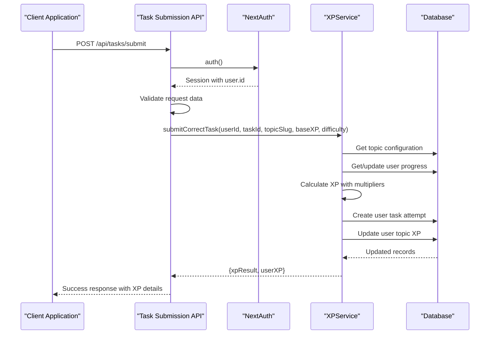
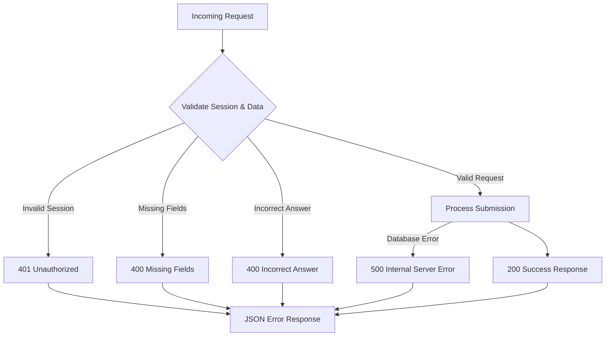

# Task Submission API

<cite>
**Referenced Files in This Document**
- [route.ts](file://app/api/tasks/submit/route.ts)
- [xpService.ts](file://lib/xp/xpService.ts)
- [xp.ts](file://types/xp.ts)
- [authConfig.ts](file://lib/auth/authConfig.ts)
- [route.ts](file://app/api/xp/user/route.ts)
- [Tasks.tsx](file://components/tasks/Tasks.tsx)
- [schema.prisma](file://prisma/schema.prisma)
</cite>

## Table of Contents
1. [Introduction](#introduction)
2. [Endpoint Definition](#endpoint-definition)
3. [Request Schema](#request-schema)
4. [Response Schema](#response-schema)
5. [Authentication Requirements](#authentication-requirements)
6. [XP Calculation Logic](#xp-calculation-logic)
7. [Success Workflow](#success-workflow)
8. [Error Handling](#error-handling)
9. [Integration with Gamification System](#integration-with-gamification-system)
10. [Practical Examples](#practical-examples)
11. [API Usage Patterns](#api-usage-patterns)
12. [Troubleshooting Guide](#troubleshooting-guide)
13. [Conclusion](#conclusion)

## Introduction

The Task Submission API enables users to submit answers to mathematical tasks and receive immediate feedback with XP rewards. This endpoint integrates with a sophisticated gamification system that includes spaced repetition scheduling, daily XP multipliers, and level progression mechanics.

The API validates user sessions, checks task correctness, calculates XP rewards based on multiple factors, and updates the user's learning progress in real-time. It serves as the core mechanism for user engagement and skill development within the mathematics learning platform.

## Endpoint Definition

### POST /api/tasks/submit

This endpoint accepts task submission requests and processes them through the XP calculation system. It requires authentication and performs validation on the incoming request data.

**Method**: POST  
**Content-Type**: application/json  
**Authentication**: Required (JWT session)  
**Response**: JSON object containing submission results and XP calculations

## Request Schema

The TaskSubmissionRequest interface defines the structure for task submission payloads:

| Field | Type | Required | Description |
|-------|------|----------|-------------|
| taskId | string | Yes | Unique identifier of the task being submitted |
| topicSlug | string | Yes | Topic identifier for XP tracking (e.g., "addition_and_subtraction_of_fractions") |
| isCorrect | boolean | Yes | Boolean indicating if the user's answer was correct |
| userAnswer | any | No | User's actual answer (for logging and analytics) |
| baseXP | number | No | Override for base XP value (if provided) |
| difficulty | string | No | Task difficulty level ("easy", "medium", "hard") |

**Section sources**
- [route.ts](file://app/api/tasks/submit/route.ts#L17-L18)
- [xp.ts](file://types/xp.ts#L98-L105)

## Response Schema

The API returns a structured response containing submission results and XP calculations:

| Field | Type | Description |
|-------|------|-------------|
| success | boolean | Indicates if the submission was processed successfully |
| xpResult | XPCalculationResult | Detailed XP calculation breakdown |
| userXP | UserTopicXP | Updated user XP statistics for the topic |
| message | string | Human-readable feedback message |
| error | string | Error message (only present on failure) |

### XPCalculationResult Fields

| Field | Type | Description |
|-------|------|-------------|
| xpEarned | number | Actual XP earned for this submission |
| nextReviewDate | Date | Next scheduled review date |
| masteryLevel | number | Current mastery level (0-5) |
| reviewCount | number | Total number of reviews completed |
| message | string | Combined feedback message |
| isScheduledReview | boolean | Whether this is a scheduled review |
| multiplier | number | Daily XP multiplier applied |
| dailyTaskIndex | number | Position in today's practice routine |
| isTooEarly | boolean | Whether practice occurs too early |
| isHotTopic | boolean | Whether it's time for scheduled review |

### UserTopicXP Fields

| Field | Type | Description |
|-------|------|-------------|
| currentXp | number | Current XP in this topic |
| totalXpEarned | number | Total XP earned across all topics |
| level | number | Current level (0-5) |
| dailyTasksCount | number | Number of tasks completed today |
| srsStage | number | Spaced repetition stage |
| nextReviewDate | Date | Next scheduled review date |
| lastPracticedDate | Date | Date of last practice session |
| nextLevelXp | number | XP needed for next level |
| currentLevelMinXp | number | Minimum XP for current level |

**Section sources**
- [xp.ts](file://types/xp.ts#L83-L113)
- [xp.ts](file://types/xp.ts#L50-L68)

## Authentication Requirements

The endpoint requires a valid user session using NextAuth.js JWT authentication:

### Authentication Flow

1. **Session Validation**: The API calls the `auth()` function from NextAuth
2. **User ID Extraction**: Extracts `session.user.id` for database operations
3. **Authorization Check**: Rejects requests without valid session
4. **Provider Support**: Supports multiple authentication providers (Google, GitHub, Facebook, Email)

### Session Structure

The authenticated session provides:
- `session.user.id`: Unique user identifier
- `session.user.email`: User's email address
- `session.user.name`: User's display name

**Section sources**
- [route.ts](file://app/api/tasks/submit/route.ts#L8-L15)
- [authConfig.ts](file://lib/auth/authConfig.ts#L16-L82)

## XP Calculation Logic

The XPService.submitCorrectTask method implements a sophisticated XP calculation system with multiple layers:

### Base XP Determination

The system determines base XP through several mechanisms:

1. **Task Override**: Uses `task.baseXP` if provided in the request
2. **Difficulty-Based**: Applies predefined values based on difficulty:
   - Easy: 100 XP
   - Medium/Moderate: 250 XP
   - Hard: 500 XP
3. **Configuration Default**: Falls back to topic configuration base XP

### Daily XP Multiplier System

The system applies multipliers based on daily practice patterns:

| Multiplier Type | Value | Conditions |
|----------------|-------|------------|
| Full Multiplier | 1.0 | First 10 tasks of the day |
| Half Multiplier | 0.5 | Tasks 11-20 of the day |
| Low Multiplier | 0.1 | Tasks beyond 20 of the day |
| Early Practice | 0.1 | Practicing before scheduled review |

### Spaced Repetition Integration

The system integrates with spaced repetition scheduling:

1. **Hot Topic Detection**: Determines if it's time for scheduled review
2. **Stage Progression**: Advances SRS stage for hot topics
3. **Review Date Calculation**: Updates next review schedule based on intervals
4. **Anti-Grind Protection**: Prevents excessive XP farming through daily limits

### Level Progression

Levels are calculated using configurable thresholds:
- Level 0: 0 XP
- Level 1: 1000 XP
- Level 2: 2500 XP
- Level 3: 4500 XP
- Level 4: 7000 XP
- Level 5: 10000 XP

**Section sources**
- [xpService.ts](file://lib/xp/xpService.ts#L118-L293)

## Success Workflow

The successful submission workflow follows this sequence:



**Diagram sources**
- [route.ts](file://app/api/tasks/submit/route.ts#L34-L47)
- [xpService.ts](file://lib/xp/xpService.ts#L118-L293)

**Section sources**
- [route.ts](file://app/api/tasks/submit/route.ts#L6-L58)
- [xpService.ts](file://lib/xp/xpService.ts#L118-L293)

## Error Handling

The API implements comprehensive error handling across multiple failure scenarios:

### Authentication Errors
- **401 Unauthorized**: Missing or invalid session
- **400 Bad Request**: Missing required fields (taskId, topicSlug)

### Business Logic Errors
- **400 Bad Request**: Incorrect answers (returns failure response)
- **500 Internal Server Error**: Database errors or unexpected exceptions

### Error Response Format



**Diagram sources**
- [route.ts](file://app/api/tasks/submit/route.ts#L10-L32)
- [route.ts](file://app/api/tasks/submit/route.ts#L48-L57)

**Section sources**
- [route.ts](file://app/api/tasks/submit/route.ts#L10-L32)
- [route.ts](file://app/api/tasks/submit/route.ts#L48-L57)

## Integration with Gamification System

The task submission system integrates deeply with the gamification framework:

### Database Schema Integration

The system operates on three core tables:

1. **topic_xp_config**: Topic-specific XP configurations
2. **user_topic_xp**: User progress per topic
3. **user_task_attempts**: Individual task submission history

### SRS Integration

The system implements spaced repetition with configurable intervals:
- Day 1: 1 day
- Day 2: 3 days
- Day 3: 7 days
- Day 4: 14 days
- Day 5: 30 days

### Daily Practice Limits

The system enforces daily practice caps:
- First 10 tasks: Full XP (100%)
- Next 10 tasks: 50% XP
- Beyond 20 tasks: 10% XP

### Progress Tracking

The system tracks:
- Total XP earned
- Current level progression
- Mastery levels per task
- Review schedules
- Daily practice streaks

**Section sources**
- [schema.prisma](file://prisma/schema.prisma#L70-L142)
- [xpService.ts](file://lib/xp/xpService.ts#L200-L240)

## Practical Examples

### Example 1: Correct Multiple Choice Submission

**Request Payload:**
```json
{
  "taskId": "mcq-001",
  "topicSlug": "addition_and_subtraction_of_fractions",
  "isCorrect": true,
  "userAnswer": 2,
  "baseXP": 250,
  "difficulty": "medium"
}
```

**Expected Response:**
```json
{
  "success": true,
  "message": "✅ Повторення за графіком · +250 XP · Рівень 1 отримано!",
  "xpResult": {
    "xpEarned": 250,
    "nextReviewDate": "2024-01-15T00:00:00Z",
    "masteryLevel": 1,
    "reviewCount": 1,
    "multiplier": 1.0,
    "dailyTaskIndex": 1,
    "isHotTopic": true,
    "isTooEarly": false
  },
  "userXP": {
    "currentXp": 250,
    "totalXpEarned": 250,
    "level": 0,
    "dailyTasksCount": 1,
    "srsStage": 1,
    "nextReviewDate": "2024-01-15T00:00:00Z"
  }
}
```

### Example 2: Incorrect Submission

**Request Payload:**
```json
{
  "taskId": "input-001",
  "topicSlug": "natural_numbers",
  "isCorrect": false,
  "userAnswer": "wrong_answer"
}
```

**Response:**
```json
{
  "success": false,
  "message": "❌ Неправильна відповідь. Спробуйте ще раз!"
}
```

### Example 3: Early Practice (Too Early)

**Request Payload:**
```json
{
  "taskId": "mcq-002",
  "topicSlug": "geometry_shapes",
  "isCorrect": true,
  "baseXP": 500,
  "difficulty": "hard"
}
```

**Response:**
```json
{
  "success": true,
  "message": "⏳ Занадто рано · +50 XP",
  "xpResult": {
    "xpEarned": 50,
    "nextReviewDate": "2024-01-15T00:00:00Z",
    "masteryLevel": 0,
    "reviewCount": 0,
    "multiplier": 0.1,
    "dailyTaskIndex": 21,
    "isHotTopic": false,
    "isTooEarly": true
  }
}
```

## API Usage Patterns

### Frontend Integration

The frontend components integrate with the API through the Tasks component:

1. **Task Completion Detection**: Validates user answers locally
2. **API Call**: Submits correct answers to `/api/tasks/submit`
3. **State Management**: Updates local state with submission results
4. **Progress Tracking**: Maintains completion status and XP updates

### Real-time Updates

The system provides immediate feedback:
- Visual indicators for correct/incorrect answers
- XP earned display
- Level progression notifications
- SRS schedule updates

### Error Recovery

The system handles various error scenarios gracefully:
- Network failures: Retries and user notification
- Authentication timeouts: Redirects to login
- Database errors: Graceful degradation
- Invalid submissions: Clear error messages

**Section sources**
- [Tasks.tsx](file://components/tasks/Tasks.tsx#L64-L122)

## Troubleshooting Guide

### Common Issues and Solutions

**Issue**: 401 Unauthorized responses
- **Cause**: Missing or expired session token
- **Solution**: Ensure user is logged in and session is valid

**Issue**: 400 Missing required fields
- **Cause**: Missing taskId or topicSlug in request
- **Solution**: Verify frontend sends complete task data

**Issue**: Incorrect answer responses
- **Cause**: User submitted wrong answer
- **Solution**: Display helpful error message and allow retry

**Issue**: XP not updating
- **Cause**: Database transaction failure
- **Solution**: Check database connectivity and retry submission

**Issue**: SRS schedule not advancing
- **Cause**: Too early practice or database synchronization issues
- **Solution**: Wait for scheduled review time or check system logs

### Debug Information

The API provides detailed logging:
- Session validation results
- XP calculation breakdown
- Database operation timestamps
- Error stack traces for debugging

**Section sources**
- [route.ts](file://app/api/tasks/submit/route.ts#L48-L57)
- [route.ts](file://app/api/tasks/submit/route.ts#L27-L32)

## Conclusion

The Task Submission API provides a robust foundation for interactive mathematics learning with comprehensive gamification features. Its sophisticated XP calculation system, integrated spaced repetition scheduling, and real-time progress tracking creates an engaging educational experience.

Key strengths include:
- **Flexible XP Calculation**: Multiple calculation methods based on task difficulty and daily practice
- **Spaced Repetition Integration**: Scientifically-backed learning reinforcement
- **Real-time Feedback**: Immediate response to user actions
- **Comprehensive Error Handling**: Graceful handling of various failure scenarios
- **Scalable Architecture**: Well-structured codebase supporting future enhancements

The API successfully balances educational effectiveness with user engagement, providing meaningful XP rewards while preventing gaming of the system through anti-grind mechanisms.