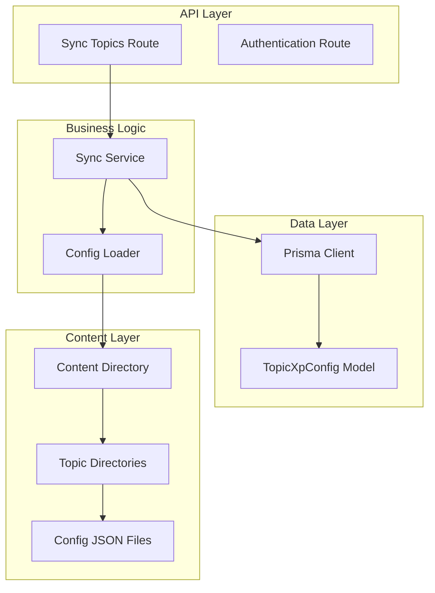
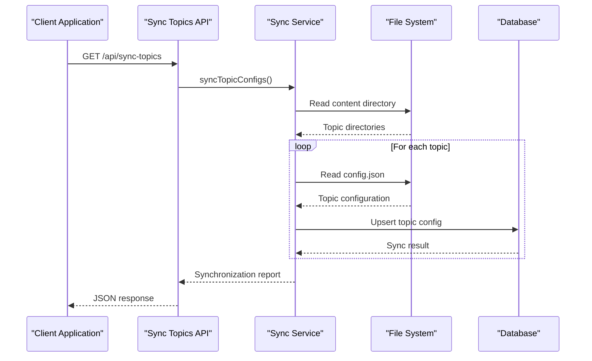
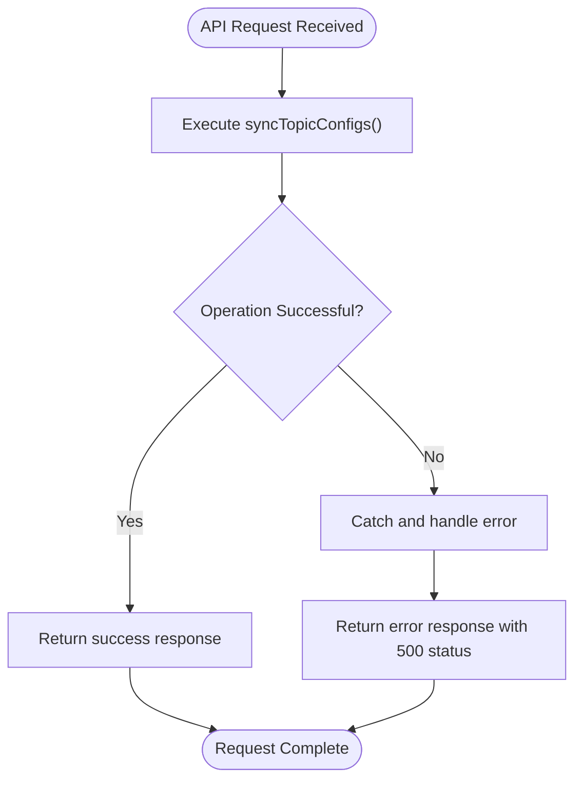
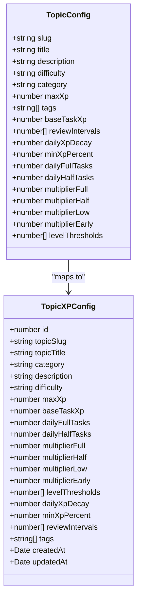
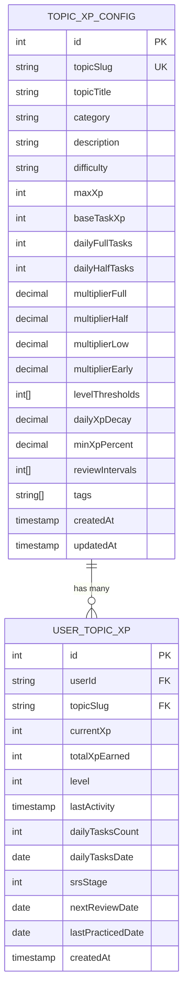
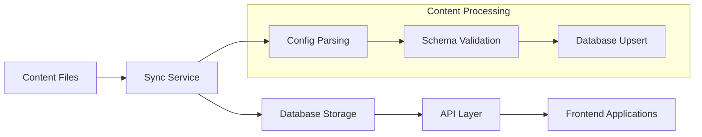

# Topic Synchronization API

<cite>
**Referenced Files in This Document**
- [route.ts](file://app/api/sync-topics/route.ts)
- [syncTopicConfigs.ts](file://lib/xp/syncTopicConfigs.ts)
- [topic-config.ts](file://types/topic-config.ts)
- [xp.ts](file://types/xp.ts)
- [schema.prisma](file://prisma/schema.prisma)
- [authConfig.ts](file://lib/auth/authConfig.ts)
- [config.json](file://content/math/addition_and_subtraction_of_fractions/config.json)
</cite>

## Table of Contents
1. [Introduction](#introduction)
2. [Project Structure](#project-structure)
3. [Core Components](#core-components)
4. [Architecture Overview](#architecture-overview)
5. [Detailed Component Analysis](#detailed-component-analysis)
6. [Authentication and Authorization](#authentication-and-authorization)
7. [Response Schema](#response-schema)
8. [Content Management Workflows](#content-management-workflows)
9. [Cache Management](#cache-management)
10. [Integration with Content Delivery System](#integration-with-content-delivery-system)
11. [Usage Examples](#usage-examples)
12. [Troubleshooting Guide](#troubleshooting-guide)
13. [Conclusion](#conclusion)

## Introduction

The Topic Synchronization API provides a mechanism to synchronize topic configuration data from the content filesystem into the database. This endpoint serves as a bridge between static content management and dynamic database storage, enabling real-time updates to topic metadata, difficulty levels, and learning parameters without manual database intervention.

The API endpoint GET /api/sync-topics performs comprehensive synchronization of all topic configurations stored in the content directory, ensuring that the database remains consistent with the latest content structure and metadata.

## Project Structure

The topic synchronization functionality is organized across several key components within the Next.js application architecture:



**Diagram sources**
- [route.ts](file://app/api/sync-topics/route.ts#L1-L19)
- [syncTopicConfigs.ts](file://lib/xp/syncTopicConfigs.ts#L1-L174)
- [schema.prisma](file://prisma/schema.prisma#L70-L97)

**Section sources**
- [route.ts](file://app/api/sync-topics/route.ts#L1-L19)
- [syncTopicConfigs.ts](file://lib/xp/syncTopicConfigs.ts#L1-L174)

## Core Components

### API Endpoint Implementation

The GET /api/sync-topics endpoint serves as the primary interface for triggering topic synchronization operations. The implementation follows Next.js App Router conventions and provides structured error handling for robust operation.

### Synchronization Service

The core synchronization logic resides in the `syncTopicConfigs` function, which orchestrates the entire synchronization process. This service handles directory traversal, file reading, JSON parsing, and database upsert operations.

### Configuration Management

The system manages topic configurations through structured JSON files located in the content directory. Each topic maintains its own configuration file containing metadata, difficulty levels, and learning parameters.

**Section sources**
- [route.ts](file://app/api/sync-topics/route.ts#L8-L18)
- [syncTopicConfigs.ts](file://lib/xp/syncTopicConfigs.ts#L10-L49)

## Architecture Overview

The topic synchronization architecture follows a layered approach with clear separation of concerns:



**Diagram sources**
- [route.ts](file://app/api/sync-topics/route.ts#L8-L18)
- [syncTopicConfigs.ts](file://lib/xp/syncTopicConfigs.ts#L10-L49)

The architecture ensures scalability through asynchronous file operations and efficient database transactions. The service handles individual topic failures gracefully while maintaining overall synchronization progress tracking.

## Detailed Component Analysis

### API Route Handler

The API route handler provides a clean interface for external systems to trigger synchronization operations. It implements proper error handling and response formatting using Next.js server responses.



**Diagram sources**
- [route.ts](file://app/api/sync-topics/route.ts#L8-L18)

### Synchronization Logic

The core synchronization process involves several key steps:

1. **Directory Enumeration**: Scans the content/math directory for topic subdirectories
2. **Configuration Loading**: Reads and parses config.json files for each topic
3. **Database Upsert**: Performs atomic upsert operations using Prisma
4. **Progress Tracking**: Maintains detailed logs of successful and failed synchronizations

### Topic Configuration Structure

Each topic configuration follows a standardized structure that supports both basic and advanced learning parameters:



**Diagram sources**
- [topic-config.ts](file://types/topic-config.ts#L3-L16)
- [xp.ts](file://types/xp.ts#L26-L48)

**Section sources**
- [syncTopicConfigs.ts](file://lib/xp/syncTopicConfigs.ts#L54-L130)
- [topic-config.ts](file://types/topic-config.ts#L3-L16)
- [xp.ts](file://types/xp.ts#L26-L48)

## Authentication and Authorization

The topic synchronization endpoint operates independently of user authentication. The API route does not implement any built-in authentication or authorization checks, allowing for flexible deployment scenarios including automated synchronization jobs and manual administrative operations.

However, the broader application utilizes NextAuth.js for user authentication across other endpoints. The authentication system supports multiple providers including Google, GitHub, Facebook, and email-based authentication, with JWT session strategy and database-backed user management.

**Section sources**
- [route.ts](file://app/api/sync-topics/route.ts#L1-L19)
- [authConfig.ts](file://lib/auth/authConfig.ts#L16-L82)

## Response Schema

The API endpoint returns structured JSON responses that provide comprehensive feedback about the synchronization operation:

### Success Response Structure

```json
{
  "success": true,
  "synced": 15,
  "total": 20,
  "results": [
    {
      "topicSlug": "addition_and_subtraction_of_fractions",
      "success": true,
      "result": {
        "id": 1,
        "topicSlug": "addition_and_subtraction_of_fractions",
        "topicTitle": "Дроби",
        "category": "math",
        "description": "Вивчення основ дробів, їх типів та операцій з ними.",
        "difficulty": "easy",
        "maxXp": 1000,
        "baseTaskXp": 100,
        "dailyFullTasks": 10,
        "dailyHalfTasks": 10,
        "multiplierFull": 1.0,
        "multiplierHalf": 0.5,
        "multiplierLow": 0.1,
        "multiplierEarly": 0.1,
        "levelThresholds": [1000, 2500, 4500, 7000, 10000],
        "dailyXpDecay": 0.5,
        "minXpPercent": 0.1,
        "reviewIntervals": [1, 3, 7, 14, 30],
        "tags": ["алгебра", "основи", "дроби"],
        "createdAt": "2024-01-01T00:00:00Z",
        "updatedAt": "2024-01-01T00:00:00Z"
      }
    }
  ]
}
```

### Error Response Structure

```json
{
  "success": false,
  "error": "Failed to read config file for topic: invalid-topic-name"
}
```

### Individual Topic Result Structure

```json
{
  "topicSlug": "addition_and_subtraction_of_fractions",
  "success": true,
  "result": {
    "id": 1,
    "topicSlug": "addition_and_subtraction_of_fractions",
    "topicTitle": "Дроби",
    "category": "math",
    "difficulty": "easy",
    "maxXp": 1000,
    "baseTaskXp": 100,
    "dailyXpDecay": 0.5,
    "minXpPercent": 0.1,
    "reviewIntervals": [1, 3, 7, 14, 30],
    "tags": ["алгебра", "основи", "дроби"]
  }
}
```

**Section sources**
- [syncTopicConfigs.ts](file://lib/xp/syncTopicConfigs.ts#L37-L48)
- [syncTopicConfigs.ts](file://lib/xp/syncTopicConfigs.ts#L25-L34)

## Content Management Workflows

The synchronization system integrates seamlessly with the content management workflow:

### Content Directory Structure

```
content/
├── math/
│   ├── addition_and_subtraction_of_fractions/
│   │   ├── config.json          # Topic configuration
│   │   ├── index.mdx           # Lesson content
│   │   └── tasks/
│   │       ├── 001-mcq.json    # Multiple choice questions
│   │       └── 002-input.json  # Input-based questions
│   └── natural_numbers/
│       ├── config.json
│       └── index.mdx
```

### Configuration File Format

Each topic configuration file contains essential metadata for learning management:

```json
{
  "slug": "addition_and_subtraction_of_fractions",
  "title": "Дроби",
  "description": "Вивчення основ дробів, їх типів та операцій з ними.",
  "difficulty": "easy",
  "category": "math",
  "list-position": 1,
  "tags": ["алгебра", "основи", "дроби"]
}
```

### Learning Parameter Configuration

Advanced topics can include sophisticated learning parameters:

- **Experience Points**: Base XP rewards and maximum XP limits
- **Daily Limits**: Task completion caps for balanced learning
- **Difficulty Multipliers**: Adaptive XP scaling based on performance
- **Review Scheduling**: Spaced repetition intervals for long-term retention
- **Level Progression**: Thresholds for skill advancement

**Section sources**
- [config.json](file://content/math/addition_and_subtraction_of_fractions/config.json#L1-L10)
- [syncTopicConfigs.ts](file://lib/xp/syncTopicConfigs.ts#L54-L130)

## Cache Management

The synchronization endpoint operates without built-in caching mechanisms. Database queries are executed directly during each request, ensuring data consistency but potentially impacting performance for large topic catalogs.

### Caching Considerations

For production deployments, consider implementing:

- **Database Query Caching**: Cache frequently accessed topic configurations
- **API Response Caching**: Cache successful synchronization results
- **Content Hash Caching**: Track content changes to avoid unnecessary sync operations
- **CDN Integration**: Cache static content files for improved delivery performance

### Performance Optimization Opportunities

- **Parallel Processing**: Execute topic synchronization concurrently
- **Incremental Updates**: Only sync changed configurations
- **Connection Pooling**: Optimize database connection management
- **Memory Management**: Implement streaming for large content files

## Integration with Content Delivery System

The synchronized topic configurations integrate with the broader content delivery infrastructure:

### Database Schema Integration

The Prisma schema defines the TopicXpConfig model that stores synchronized topic data:



**Diagram sources**
- [schema.prisma](file://prisma/schema.prisma#L70-L97)
- [schema.prisma](file://prisma/schema.prisma#L99-L122)

### Content Delivery Pipeline



**Diagram sources**
- [syncTopicConfigs.ts](file://lib/xp/syncTopicConfigs.ts#L10-L49)
- [schema.prisma](file://prisma/schema.prisma#L70-L97)

## Usage Examples

### Basic Synchronization Request

```bash
curl -X GET https://your-domain.com/api/sync-topics
```

### Expected Success Response

```json
{
  "success": true,
  "synced": 15,
  "total": 15,
  "results": [
    {
      "topicSlug": "addition_and_subtraction_of_fractions",
      "success": true,
      "result": {
        "id": 1,
        "topicSlug": "addition_and_subtraction_of_fractions",
        "topicTitle": "Дроби",
        "category": "math",
        "difficulty": "easy",
        "maxXp": 1000,
        "baseTaskXp": 100,
        "dailyXpDecay": 0.5,
        "minXpPercent": 0.1,
        "reviewIntervals": [1, 3, 7, 14, 30],
        "tags": ["алгебра", "основи", "дроби"]
      }
    }
  ]
}
```

### Partial Failure Scenario

```json
{
  "success": true,
  "synced": 14,
  "total": 15,
  "results": [
    {
      "topicSlug": "valid-topic",
      "success": true,
      "result": { /* topic data */ }
    },
    {
      "topicSlug": "invalid-topic",
      "success": false,
      "error": "ENOENT: no such file or directory"
    }
  ]
}
```

## Troubleshooting Guide

### Common Issues and Solutions

#### File System Errors
- **Symptom**: ENOENT errors indicating missing config files
- **Solution**: Verify content directory structure and file permissions
- **Prevention**: Implement directory existence checks and graceful error handling

#### Database Connection Issues
- **Symptom**: Prisma client errors during upsert operations
- **Solution**: Check database connectivity and Prisma configuration
- **Prevention**: Implement retry logic and connection pooling

#### JSON Parsing Errors
- **Symptom**: Syntax errors in config.json files
- **Solution**: Validate JSON syntax and schema compliance
- **Prevention**: Add schema validation before database operations

#### Performance Issues
- **Symptom**: Slow synchronization for large topic catalogs
- **Solution**: Implement parallel processing and incremental updates
- **Prevention**: Monitor sync duration and optimize file I/O operations

### Monitoring and Logging

The synchronization service provides detailed logging for troubleshooting:

- **Individual Topic Status**: Success/failure tracking per topic
- **Error Context**: Specific error messages with topic identifiers
- **Progress Metrics**: Counters for processed, successful, and failed operations
- **Timing Information**: Operation duration for performance analysis

**Section sources**
- [syncTopicConfigs.ts](file://lib/xp/syncTopicConfigs.ts#L25-L34)
- [syncTopicConfigs.ts](file://lib/xp/syncTopicConfigs.ts#L43-L48)

## Conclusion

The Topic Synchronization API provides a robust foundation for managing educational content configurations in the learning management system. Its architecture supports scalability, maintainability, and integration with existing content delivery infrastructure.

Key strengths of the implementation include comprehensive error handling, detailed progress reporting, and flexible configuration management. The modular design allows for easy extension and customization based on specific learning management requirements.

For production deployment, consider implementing caching strategies, performance optimizations, and monitoring capabilities to ensure reliable operation at scale. The API's clean separation of concerns and well-defined interfaces facilitate future enhancements and integration with additional content management systems.