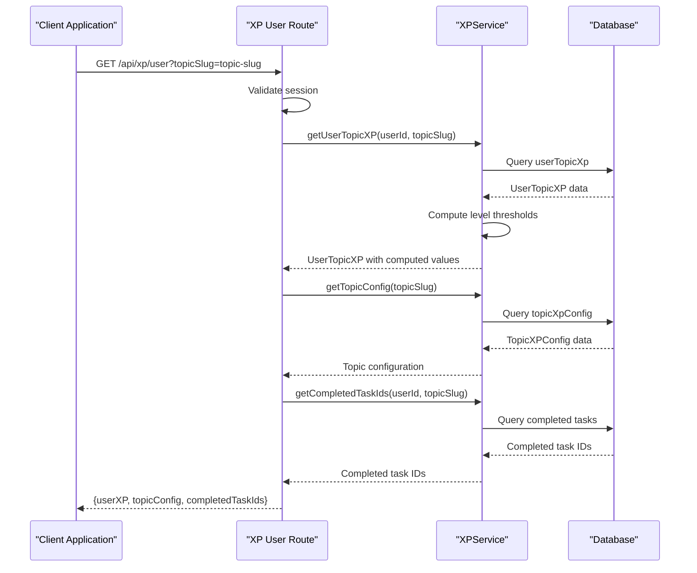
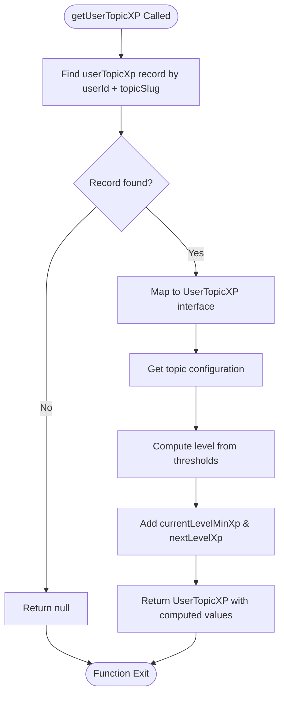
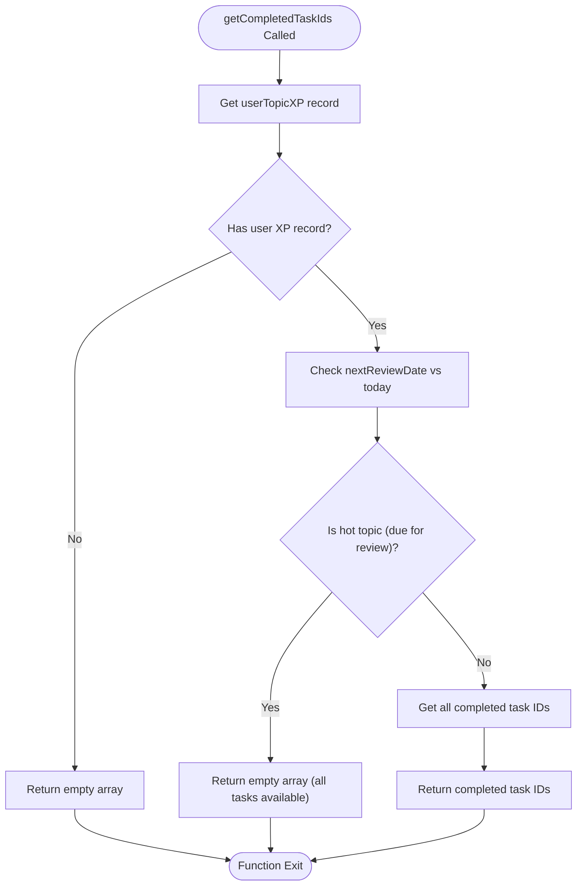
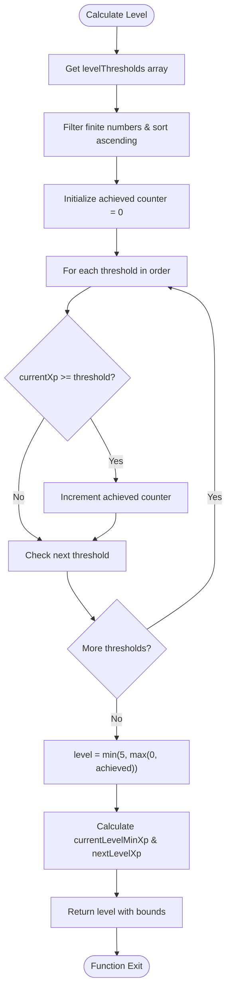
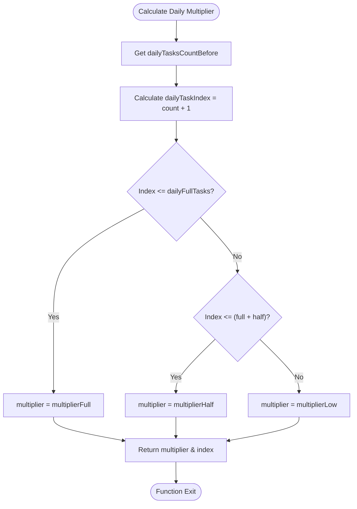
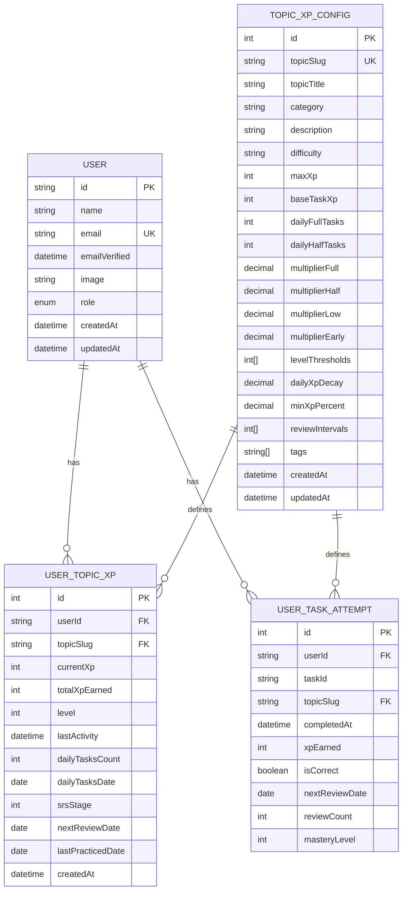

# XP Retrieval API

<cite>
**Referenced Files in This Document**
- [route.ts](file://app/api/xp/user/route.ts)
- [xpService.ts](file://lib/xp/xpService.ts)
- [authConfig.ts](file://lib/auth/authConfig.ts)
- [schema.prisma](file://prisma/schema.prisma)
- [xp.ts](file://types/xp.ts)
- [Tasks.tsx](file://components/tasks/Tasks.tsx)
</cite>

## Table of Contents
1. [Introduction](#introduction)
2. [API Endpoint Specification](#api-endpoint-specification)
3. [Authentication Requirements](#authentication-requirements)
4. [Response Schema](#response-schema)
5. [XP Calculation Methods](#xp-calculation-methods)
6. [Progress Tracking Information](#progress-tracking-information)
7. [Level Calculations](#level-calculations)
8. [Daily XP Limits](#daily-xp-limits)
9. [Frontend Integration Examples](#frontend-integration-examples)
10. [Error Handling](#error-handling)
11. [Database Schema](#database-schema)
12. [Troubleshooting Guide](#troubleshooting-guide)

## Introduction

The XP Retrieval API provides comprehensive user progress tracking for educational topics within the math learning platform. This endpoint enables clients to fetch a user's current XP status, topic mastery data, and completion tracking for individual tasks within a specific topic.

The API integrates with the XP system that implements spaced repetition scheduling (SRS), anti-grind mechanisms, and configurable daily XP limits to optimize learning effectiveness while preventing burnout.

## API Endpoint Specification

### Endpoint
```
GET /api/xp/user
```

### Request Parameters

| Parameter | Type | Required | Description |
|-----------|------|----------|-------------|
| topicSlug | string | Yes | Unique identifier for the topic (URL-friendly slug) |

### Authentication
The endpoint requires a valid NextAuth.js session with user authentication.

**Section sources**
- [route.ts](file://app/api/xp/user/route.ts#L1-L41)

## Authentication Requirements

The XP retrieval endpoint implements strict authentication requirements:

### Session Validation
- Uses NextAuth.js `auth()` middleware to validate sessions
- Requires authenticated user with valid JWT token
- Session must contain user ID in the token payload

### Session Provider Setup
The frontend uses NextAuth.js SessionProvider configured with:
- JWT strategy with 24-day session lifetime
- Custom callbacks for token and session transformation
- Support for multiple OAuth providers (Google, GitHub, Facebook, Email)

**Section sources**
- [route.ts](file://app/api/xp/user/route.ts#L7-L11)
- [authConfig.ts](file://lib/auth/authConfig.ts#L16-L82)

## Response Schema

The API returns a structured response containing three main components:



**Diagram sources**
- [route.ts](file://app/api/xp/user/route.ts#L25-L32)
- [xpService.ts](file://lib/xp/xpService.ts#L325-L350)

### Response Structure

| Field | Type | Description |
|-------|------|-------------|
| userXP | UserTopicXP | Current user progress data for the topic |
| topicConfig | TopicXPConfig | Topic configuration and XP parameters |
| completedTaskIds | string[] | Array of task IDs completed correctly |

**Section sources**
- [route.ts](file://app/api/xp/user/route.ts#L32-L32)
- [xp.ts](file://types/xp.ts#L126-L130)

## XP Calculation Methods

The XPService provides several methods for calculating and retrieving user progress data:

### getUserTopicXP Method
Retrieves a user's XP progress for a specific topic and computes derived level information:



**Diagram sources**
- [xpService.ts](file://lib/xp/xpService.ts#L325-L350)

### getTopicConfig Method
Retrieves topic configuration with decimal conversion and default value handling:

**Section sources**
- [xpService.ts](file://lib/xp/xpService.ts#L313-L320)

### getCompletedTaskIds Method
Determines which tasks are available for practice based on SRS scheduling:



**Diagram sources**
- [xpService.ts](file://lib/xp/xpService.ts#L759-L793)

**Section sources**
- [xpService.ts](file://lib/xp/xpService.ts#L759-L793)

## Progress Tracking Information

The API provides comprehensive progress tracking through multiple data points:

### UserTopicXP Fields
- **currentXp**: Total XP earned in current streak
- **totalXpEarned**: Lifetime XP across all streaks
- **level**: Current mastery level (0-5)
- **dailyTasksCount**: Number of tasks completed today
- **srsStage**: Spaced repetition stage (0-4)
- **nextReviewDate**: Date when next scheduled review is due
- **lastPracticedDate**: Date of last practice session

### TopicXPConfig Fields
- **baseTaskXp**: Base XP reward per correct answer
- **dailyFullTasks**: Number of tasks with full XP multiplier
- **dailyHalfTasks**: Number of tasks with half XP multiplier
- **multiplierFull**: XP multiplier for first tasks of day
- **multiplierHalf**: XP multiplier for subsequent tasks
- **multiplierLow**: XP multiplier for tasks beyond daily limits
- **multiplierEarly**: XP multiplier for early reviews
- **levelThresholds**: XP thresholds for level progression
- **dailyXpDecay**: XP decay factor for repeated reviews
- **minXpPercent**: Minimum XP percentage for repeated reviews

**Section sources**
- [xp.ts](file://types/xp.ts#L50-L68)
- [xp.ts](file://types/xp.ts#L26-L48)

## Level Calculations

The XP system implements a tiered leveling system with configurable thresholds:

### Level Threshold Algorithm


**Diagram sources**
- [xpService.ts](file://lib/xp/xpService.ts#L71-L89)

### Level Boundaries
- **Level 0**: 0-999 XP (no threshold reached)
- **Level 1**: 1000-2499 XP (first threshold reached)
- **Level 2**: 2500-4499 XP (second threshold reached)
- **Level 3**: 4500-6999 XP (third threshold reached)
- **Level 4**: 7000-9999 XP (fourth threshold reached)
- **Level 5**: 10000+ XP (maximum level)

**Section sources**
- [xpService.ts](file://lib/xp/xpService.ts#L71-L89)

## Daily XP Limits

The XP system implements sophisticated daily XP limiting to prevent burnout:

### Daily Multiplier System


**Diagram sources**
- [xpService.ts](file://lib/xp/xpService.ts#L91-L106)

### Multiplier Configuration
- **Full Tasks**: First N tasks of the day receive full XP multiplier
- **Half Tasks**: Next N tasks receive reduced XP multiplier
- **Low Tasks**: Additional tasks receive minimal XP multiplier
- **Early Reviews**: Special multiplier for reviewing material before schedule

**Section sources**
- [xpService.ts](file://lib/xp/xpService.ts#L91-L106)

## Frontend Integration Examples

### Successful Response Format
```typescript
// Response received by frontend
interface GETXpUserResponse {
  userXP: UserTopicXP;
  topicConfig: TopicXPConfig;
  completedTaskIds: string[];
}

// Example usage in React component
const fetchUserXP = async () => {
  try {
    const response = await fetch(`/api/xp/user?topicSlug=${topicSlug}`)
    if (response.ok) {
      const data: GETXpUserResponse = await response.json();
      setUserXP(data.userXP);
      setTopicConfig(data.topicConfig);
      setCompletedTaskIds(new Set(data.completedTaskIds));
    }
  } catch (error) {
    console.error('Failed to fetch user XP');
  }
};
```

### Available Tasks Filtering
The frontend filters available tasks based on completed task IDs:
- If `completedTaskIds` is empty, all tasks are available
- If `completedTaskIds` contains IDs, only tasks not in this set are shown
- This prevents users from repeating tasks they've already completed correctly

**Section sources**
- [Tasks.tsx](file://components/tasks/Tasks.tsx#L47-L62)
- [Tasks.tsx](file://components/tasks/Tasks.tsx#L125-L127)

## Error Handling

The API implements comprehensive error handling:

### Authentication Errors
- **401 Unauthorized**: No valid session or missing user ID
- **400 Bad Request**: Missing required `topicSlug` parameter

### Internal Errors
- **500 Internal Server Error**: Database connection issues or unexpected exceptions

### Error Response Format
```json
{
  "error": "Error message describing the issue"
}
```

**Section sources**
- [route.ts](file://app/api/xp/user/route.ts#L9-L21)
- [route.ts](file://app/api/xp/user/route.ts#L34-L38)

## Database Schema

The XP system uses a relational database schema optimized for performance:



**Diagram sources**
- [schema.prisma](file://prisma/schema.prisma#L70-L142)

### Key Indexes
- **user_topic_xp_user**: Index on userId for performance
- **user_topic_xp_topic**: Index on topicSlug for topic queries
- **user_topic_xp_next_review**: Index on nextReviewDate for SRS scheduling
- **user_task_attempts_user_topic**: Composite index for task queries
- **user_task_attempts_next_review**: Index on nextReviewDate for review scheduling

**Section sources**
- [schema.prisma](file://prisma/schema.prisma#L117-L121)
- [schema.prisma](file://prisma/schema.prisma#L139-L141)

## Troubleshooting Guide

### Common Issues and Solutions

#### Authentication Problems
- **Issue**: 401 Unauthorized responses
- **Cause**: Expired or invalid session token
- **Solution**: Re-authenticate user or refresh session

#### Missing Data
- **Issue**: Empty `completedTaskIds` array
- **Cause**: User hasn't completed any tasks yet
- **Solution**: Allow user to complete initial tasks

#### Performance Issues
- **Issue**: Slow response times
- **Cause**: Missing database indexes or large datasets
- **Solution**: Verify indexes exist and consider pagination

#### Level Calculation Errors
- **Issue**: Incorrect level display
- **Cause**: Misconfigured level thresholds
- **Solution**: Check topic configuration in database

**Section sources**
- [route.ts](file://app/api/xp/user/route.ts#L34-L38)
- [schema.prisma](file://prisma/schema.prisma#L117-L121)