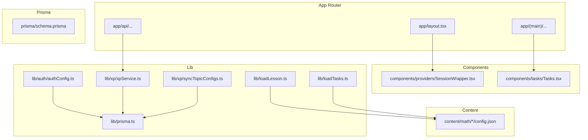
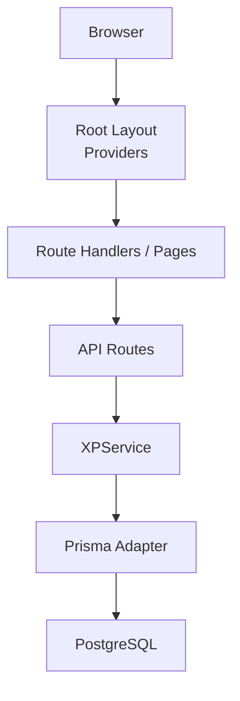
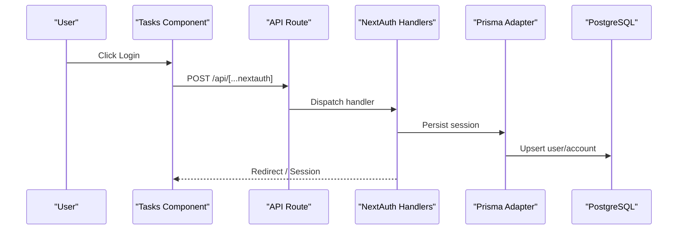
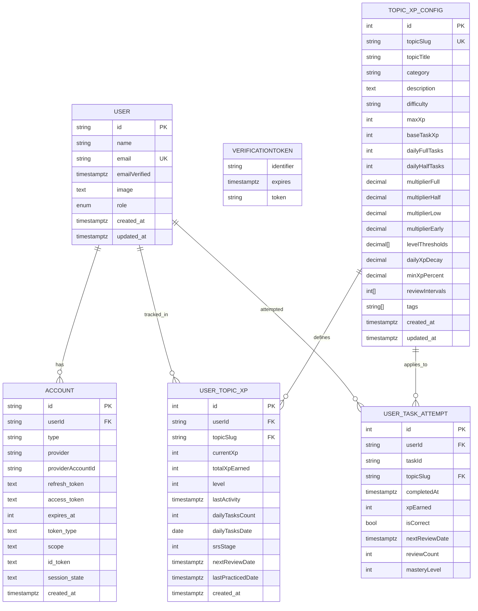
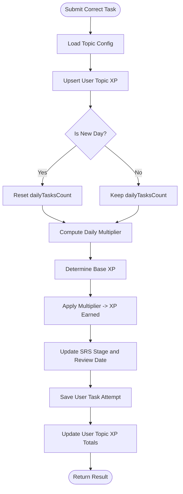
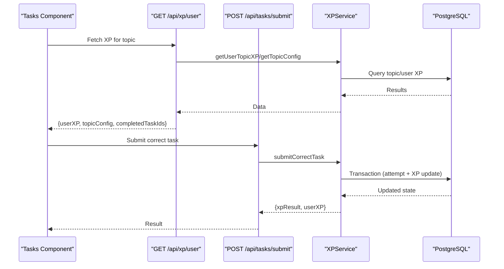
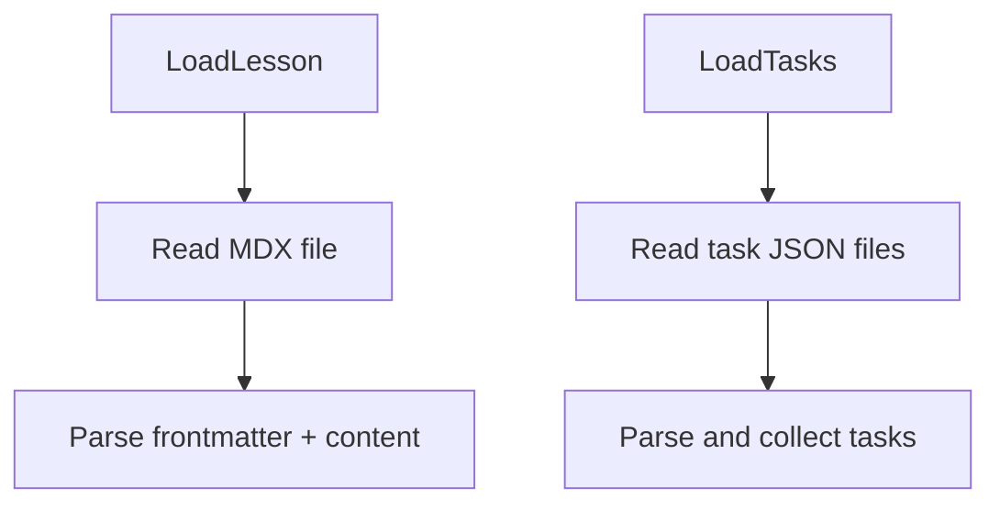
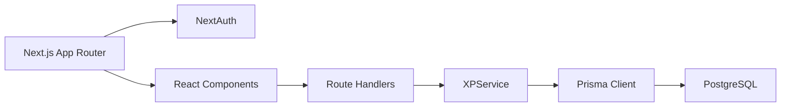

# Architecture & Design

<cite>
**Referenced Files in This Document**
- [README.md](file://README.md)
- [package.json](file://package.json)
- [next.config.ts](file://next.config.ts)
- [prisma/schema.prisma](file://prisma/schema.prisma)
- [app/layout.tsx](file://app/layout.tsx)
- [lib/prisma.ts](file://lib/prisma.ts)
- [lib/auth/authConfig.ts](file://lib/auth/authConfig.ts)
- [app/api/[...nextauth]/route.ts](file://app/api/[...nextauth]/route.ts)
- [components/providers/SessionWrapper.tsx](file://components/providers/SessionWrapper.tsx)
- [lib/xp/xpService.ts](file://lib/xp/xpService.ts)
- [lib/xp/syncTopicConfigs.ts](file://lib/xp/syncTopicConfigs.ts)
- [app/api/xp/user/route.ts](file://app/api/xp/user/route.ts)
- [app/api/tasks/submit/route.ts](file://app/api/tasks/submit/route.ts)
- [components/tasks/Tasks.tsx](file://components/tasks/Tasks.tsx)
- [lib/loadLesson.ts](file://lib/loadLesson.ts)
- [lib/loadTasks.ts](file://lib/loadTasks.ts)
- [types/xp.ts](file://types/xp.ts)
</cite>

## Table of Contents
1. [Introduction](#introduction)
2. [Project Structure](#project-structure)
3. [Core Components](#core-components)
4. [Architecture Overview](#architecture-overview)
5. [Detailed Component Analysis](#detailed-component-analysis)
6. [Dependency Analysis](#dependency-analysis)
7. [Performance Considerations](#performance-considerations)
8. [Troubleshooting Guide](#troubleshooting-guide)
9. [Conclusion](#conclusion)
10. [Appendices](#appendices)

## Introduction
This document describes the architecture and design of the math learning application. It explains the Next.js App Router-based frontend, the clean architecture principles applied, the domain-driven design of XP and SRS mechanics, and the integration patterns for authentication, database, and content loading. It also documents the real-time XP calculation system and the system boundaries between UI, business logic, and data layers.

## Project Structure
The application follows a modern Next.js App Router structure with:
- app/: Route handlers, pages, and shared layouts
- components/: UI primitives and page-specific components
- lib/: Domain services, adapters, and utilities
- prisma/: Prisma schema and client configuration
- content/: Markdown lessons and topic task configurations
- types/: Shared TypeScript interfaces for XP, tasks, and lesson metadata

**Diagram sources**
- [app/layout.tsx](file://app/layout.tsx#L1-L46)
- [components/providers/SessionWrapper.tsx](file://components/providers/SessionWrapper.tsx#L1-L11)
- [components/tasks/Tasks.tsx](file://components/tasks/Tasks.tsx#L1-L441)
- [lib/auth/authConfig.ts](file://lib/auth/authConfig.ts#L1-L83)
- [lib/prisma.ts](file://lib/prisma.ts#L1-L29)
- [lib/xp/xpService.ts](file://lib/xp/xpService.ts#L1-L795)
- [lib/xp/syncTopicConfigs.ts](file://lib/xp/syncTopicConfigs.ts#L1-L174)
- [prisma/schema.prisma](file://prisma/schema.prisma#L1-L143)
- [lib/loadLesson.ts](file://lib/loadLesson.ts#L1-L17)
- [lib/loadTasks.ts](file://lib/loadTasks.ts#L1-L31)

**Section sources**
- [README.md](file://README.md#L1-L50)
- [package.json](file://package.json#L1-L63)
- [next.config.ts](file://next.config.ts#L1-L10)

## Core Components
- Authentication: NextAuth with Prisma adapter, JWT sessions, and multiple OAuth providers.
- XP and SRS Engine: Centralized XPService encapsulating XP calculation, SRS scheduling, anti-grind mechanics, and persistence.
- Content Loading: Utilities to load MDX lessons and JSON tasks from content directories.
- Database: PostgreSQL via Prisma with a dedicated adapter and connection pooling.
- UI Layer: Tasks component orchestrating user interactions, XP display, and real-time updates.

Key responsibilities:
- UI: Renders tasks, displays XP metrics, and handles user actions.
- Business Logic: XPService encapsulates XP rules, SRS intervals, and daily multipliers.
- Data: Prisma client with a PostgreSQL adapter persists users, topic configs, user XP, and task attempts.

**Section sources**
- [lib/auth/authConfig.ts](file://lib/auth/authConfig.ts#L1-L83)
- [lib/xp/xpService.ts](file://lib/xp/xpService.ts#L1-L795)
- [lib/loadLesson.ts](file://lib/loadLesson.ts#L1-L17)
- [lib/loadTasks.ts](file://lib/loadTasks.ts#L1-L31)
- [lib/prisma.ts](file://lib/prisma.ts#L1-L29)
- [prisma/schema.prisma](file://prisma/schema.prisma#L1-L143)

## Architecture Overview
The system adheres to clean architecture with clear separation of concerns:
- Outer layers: Next.js routes, UI components, and providers
- Inner layers: Services (XPService), domain models, and data access (Prisma)

**Diagram sources**
- [app/layout.tsx](file://app/layout.tsx#L1-L46)
- [app/api/tasks/submit/route.ts](file://app/api/tasks/submit/route.ts#L1-L59)
- [lib/xp/xpService.ts](file://lib/xp/xpService.ts#L1-L795)
- [lib/prisma.ts](file://lib/prisma.ts#L1-L29)
- [prisma/schema.prisma](file://prisma/schema.prisma#L1-L143)

## Detailed Component Analysis

### Authentication Architecture (NextAuth)
- Provider configuration supports credentials, Google, GitHub, Facebook, and Resend.
- Uses Prisma adapter to persist sessions and user identities.
- JWT session strategy with a long max age.
- Custom Google One Tap provider integrated via a dedicated authorize function.

**Diagram sources**
- [components/tasks/Tasks.tsx](file://components/tasks/Tasks.tsx#L1-L441)
- [app/api/[...nextauth]/route.ts](file://app/api/[...nextauth]/route.ts#L1-L4)
- [lib/auth/authConfig.ts](file://lib/auth/authConfig.ts#L1-L83)
- [lib/prisma.ts](file://lib/prisma.ts#L1-L29)
- [prisma/schema.prisma](file://prisma/schema.prisma#L1-L143)

**Section sources**
- [lib/auth/authConfig.ts](file://lib/auth/authConfig.ts#L1-L83)
- [app/api/[...nextauth]/route.ts](file://app/api/[...nextauth]/route.ts#L1-L4)
- [components/providers/SessionWrapper.tsx](file://components/providers/SessionWrapper.tsx#L1-L11)

### Database Design (Prisma)
The schema defines core entities:
- User, Account, VerificationToken for authentication
- TopicXpConfig for topic XP configuration
- UserTopicXp for per-user topic XP and SRS state
- UserTaskAttempt for per-task attempt history

**Diagram sources**
- [prisma/schema.prisma](file://prisma/schema.prisma#L1-L143)

**Section sources**
- [prisma/schema.prisma](file://prisma/schema.prisma#L1-L143)
- [lib/prisma.ts](file://lib/prisma.ts#L1-L29)

### Real-Time XP Calculation System
The XPService encapsulates:
- Daily XP multipliers based on streak-like limits
- SRS scheduling with configurable intervals
- Anti-grind mechanics using XP decay and minimum XP percentage
- Transactional updates to user XP and task attempts
- Topic configuration synchronization from content

**Diagram sources**
- [lib/xp/xpService.ts](file://lib/xp/xpService.ts#L118-L293)

**Section sources**
- [lib/xp/xpService.ts](file://lib/xp/xpService.ts#L1-L795)
- [lib/xp/syncTopicConfigs.ts](file://lib/xp/syncTopicConfigs.ts#L1-L174)
- [types/xp.ts](file://types/xp.ts#L1-L131)

### API Workflows
- GET /api/xp/user: Returns user XP, topic config, and completed task IDs for a given topic.
- POST /api/tasks/submit: Validates session, checks correctness, and computes XP via XPService.

**Diagram sources**
- [app/api/xp/user/route.ts](file://app/api/xp/user/route.ts#L1-L41)
- [app/api/tasks/submit/route.ts](file://app/api/tasks/submit/route.ts#L1-L59)
- [lib/xp/xpService.ts](file://lib/xp/xpService.ts#L118-L293)
- [lib/prisma.ts](file://lib/prisma.ts#L1-L29)

**Section sources**
- [app/api/xp/user/route.ts](file://app/api/xp/user/route.ts#L1-L41)
- [app/api/tasks/submit/route.ts](file://app/api/tasks/submit/route.ts#L1-L59)
- [components/tasks/Tasks.tsx](file://components/tasks/Tasks.tsx#L1-L441)

### Content Loading and Rendering
- Lessons: MDX content loaded via gray-matter frontmatter extraction.
- Tasks: JSON task definitions parsed from topic directories.

**Diagram sources**
- [lib/loadLesson.ts](file://lib/loadLesson.ts#L1-L17)
- [lib/loadTasks.ts](file://lib/loadTasks.ts#L1-L31)

**Section sources**
- [lib/loadLesson.ts](file://lib/loadLesson.ts#L1-L17)
- [lib/loadTasks.ts](file://lib/loadTasks.ts#L1-L31)

## Dependency Analysis
Technology stack rationale:
- Next.js App Router: Modern routing, route handlers, and server-side rendering.
- NextAuth: Flexible authentication with multiple providers and JWT sessions.
- Prisma: Type-safe ORM with a PostgreSQL adapter and connection pooling.
- PostgreSQL: Reliable relational storage for user data, XP, and SRS.
- React: Component model with hooks for state and effects.
- Firebase: Optional integration present in dependencies; not used in core flows here.

**Diagram sources**
- [package.json](file://package.json#L16-L43)
- [lib/auth/authConfig.ts](file://lib/auth/authConfig.ts#L1-L83)
- [lib/xp/xpService.ts](file://lib/xp/xpService.ts#L1-L795)
- [lib/prisma.ts](file://lib/prisma.ts#L1-L29)
- [prisma/schema.prisma](file://prisma/schema.prisma#L1-L143)

**Section sources**
- [package.json](file://package.json#L16-L43)

## Performance Considerations
- Use transactions in XPService to maintain consistency during XP and attempt updates.
- Indexes on frequently queried fields (user/topic, nextReviewDate) improve SRS queries.
- Minimize round-trips by batching XP fetches and task submissions.
- Consider caching topic configs and user XP for hot paths.
- Use connection pooling with the Prisma adapter to reduce overhead.

## Troubleshooting Guide
Common issues and resolutions:
- Authentication failures: Verify provider credentials and NEXTAUTH_URL configuration.
- Unauthorized API responses: Ensure session exists and user ID is present.
- Missing topic config: Confirm content/config.json sync and upsert behavior.
- SRS not updating: Check review intervals and nextReviewDate computations.
- Database connectivity: Validate environment variables for PostgreSQL adapter.

**Section sources**
- [README.md](file://README.md#L1-L50)
- [app/api/tasks/submit/route.ts](file://app/api/tasks/submit/route.ts#L1-L59)
- [lib/xp/xpService.ts](file://lib/xp/xpService.ts#L1-L795)
- [lib/xp/syncTopicConfigs.ts](file://lib/xp/syncTopicConfigs.ts#L1-L174)

## Conclusion
The application employs a clean architecture with a strong separation between UI, business logic, and data. The XPService centralizes XP and SRS logic, while NextAuth and Prisma provide robust authentication and persistence. The App Router enables efficient route handlers and a scalable UI layer. The design supports future enhancements such as additional SRS stages, dynamic topic configs, and expanded content types.

## Appendices
- Environment variables and startup behaviors are documented in the repository’s README.
- Topic configuration synchronization runs on startup and can be toggled via environment flags.

**Section sources**
- [README.md](file://README.md#L41-L50)