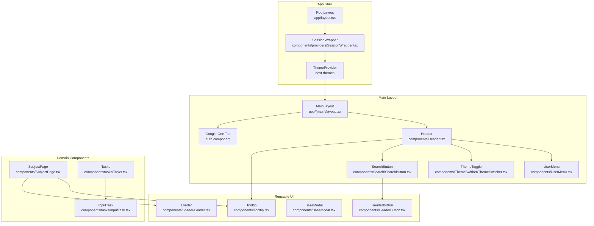
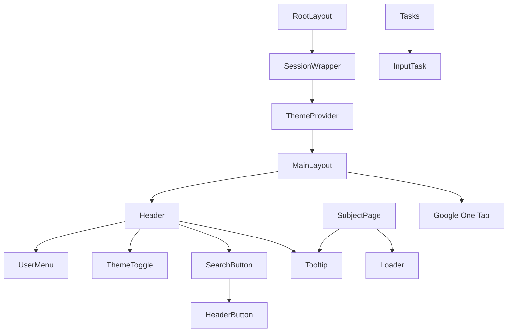
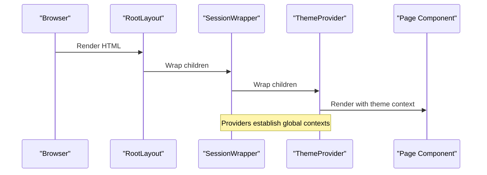
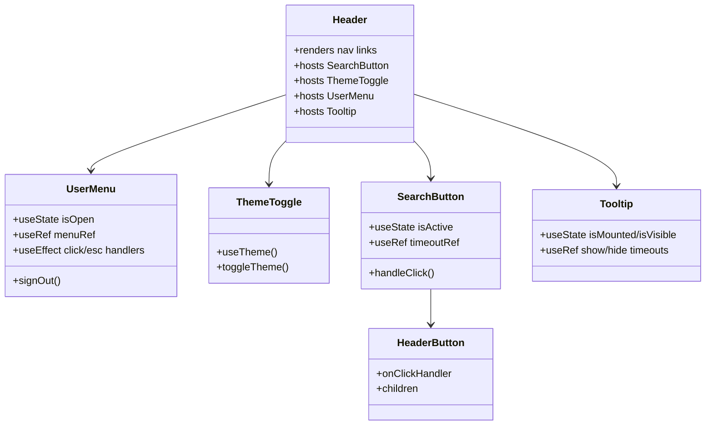
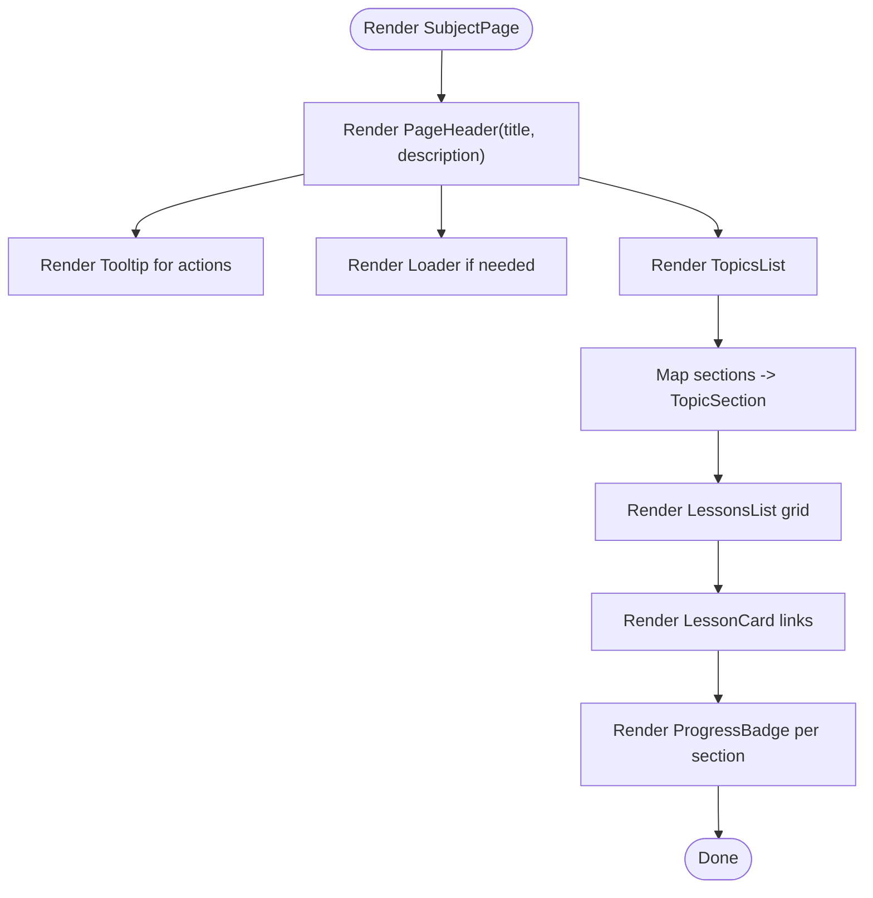
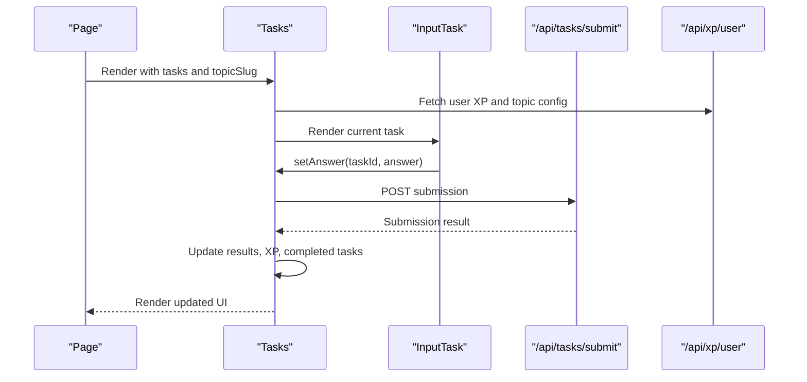
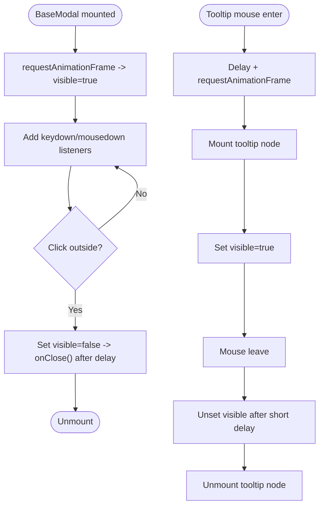
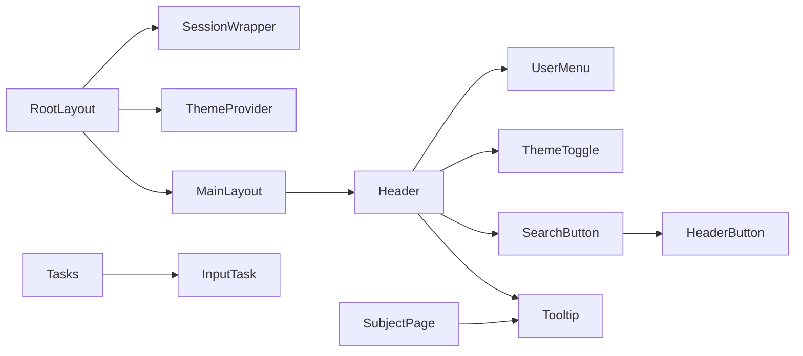

# Component Hierarchy & UI Architecture

<cite>
**Referenced Files in This Document**
- [app/layout.tsx](file://app/layout.tsx)
- [components/providers/SessionWrapper.tsx](file://components/providers/SessionWrapper.tsx)
- [app/(main)/layout.tsx](file://app/(main)/layout.tsx)
- [components/Header.tsx](file://components/Header.tsx)
- [components/UserMenu.tsx](file://components/UserMenu.tsx)
- [components/ThemeSwither/ThemeSwitcher.tsx](file://components/ThemeSwither/ThemeSwitcher.tsx)
- [components/Search/SearchButton.tsx](file://components/Search/SearchButton.tsx)
- [components/HeaderButton.tsx](file://components/HeaderButton.tsx)
- [components/Tooltip.tsx](file://components/Tooltip.tsx)
- [components/BaseModal.tsx](file://components/BaseModal.tsx)
- [components/SubjectPage.tsx](file://components/SubjectPage.tsx)
- [components/tasks/Tasks.tsx](file://components/tasks/Tasks.tsx)
- [components/tasks/InputTask.tsx](file://components/tasks/InputTask.tsx)
- [components/Loader/Loader.tsx](file://components/Loader/Loader.tsx)
</cite>

## Table of Contents
1. [Introduction](#introduction)
2. [Project Structure](#project-structure)
3. [Core Components](#core-components)
4. [Architecture Overview](#architecture-overview)
5. [Detailed Component Analysis](#detailed-component-analysis)
6. [Dependency Analysis](#dependency-analysis)
7. [Performance Considerations](#performance-considerations)
8. [Troubleshooting Guide](#troubleshooting-guide)
9. [Conclusion](#conclusion)

## Introduction
This document describes the UI component architecture of the application, focusing on the hierarchical organization from root providers down to reusable UI elements. It explains the provider pattern with SessionWrapper and ThemeProvider, component composition patterns, strategies to prevent prop drilling, state management approaches, lifecycle management, reusability patterns, and styling architecture. It also documents the relationships between layout components, page components, and reusable UI elements.

## Project Structure
The application follows a Next.js App Router structure with route groups for auth and main layouts. Providers wrap the entire application tree, while layout components define shared shell and navigation. Reusable UI elements live under components/, grouped by domain (e.g., tasks, math, auth). Pages are thin route handlers that render layout shells and pass data to domain-specific components.

**Diagram sources**
- [app/layout.tsx](file://app/layout.tsx#L29-L45)
- [components/providers/SessionWrapper.tsx](file://components/providers/SessionWrapper.tsx#L8-L10)
- [app/(main)/layout.tsx](file://app/(main)/layout.tsx#L4-L17)
- [components/Header.tsx](file://components/Header.tsx#L33-L78)
- [components/UserMenu.tsx](file://components/UserMenu.tsx#L10-L96)
- [components/ThemeSwither/ThemeSwitcher.tsx](file://components/ThemeSwither/ThemeSwitcher.tsx#L8-L68)
- [components/Search/SearchButton.tsx](file://components/Search/SearchButton.tsx#L7-L48)
- [components/HeaderButton.tsx](file://components/HeaderButton.tsx#L9-L22)
- [components/Tooltip.tsx](file://components/Tooltip.tsx#L11-L68)
- [components/BaseModal.tsx](file://components/BaseModal.tsx#L11-L69)
- [components/SubjectPage.tsx](file://components/SubjectPage.tsx#L26-L181)
- [components/tasks/Tasks.tsx](file://components/tasks/Tasks.tsx#L12-L441)
- [components/tasks/InputTask.tsx](file://components/tasks/InputTask.tsx#L11-L97)

**Section sources**
- [app/layout.tsx](file://app/layout.tsx#L29-L45)
- [app/(main)/layout.tsx](file://app/(main)/layout.tsx#L4-L17)

## Core Components
- Root providers: RootLayout composes SessionWrapper and ThemeProvider around all pages, ensuring session and theme contexts are available globally.
- Main layout: MainLayout defines the shared header, spacing, and Google One Tap integration for the main area.
- Header and navigation: Header renders subject navigation links and action buttons (search, theme toggle, user menu).
- User menu: UserMenu handles session state, click-outside detection, keyboard shortcuts, and logout.
- Theme toggle: ThemeToggle manages theme switching with audio feedback and client-side hydration awareness.
- Search button: SearchButton triggers animations and integrates with HeaderButton.
- Tooltip: Tooltip provides accessible tooltips with mount/unmount lifecycle and delays.
- Base modal: BaseModal encapsulates modal portal rendering, close-on-escape, and click-outside behavior.
- Subject page: SubjectPage organizes topic sections, lessons, and progress badges.
- Tasks: Tasks orchestrates task loading, XP state, submission, and result display; delegates to InputTask/MultipleChoiceTask.
- Input task: InputTask handles user input, normalization, correctness checks, and feedback.
- Loader: Loader provides a lightweight spinner component.

**Section sources**
- [app/layout.tsx](file://app/layout.tsx#L29-L45)
- [components/providers/SessionWrapper.tsx](file://components/providers/SessionWrapper.tsx#L8-L10)
- [app/(main)/layout.tsx](file://app/(main)/layout.tsx#L4-L17)
- [components/Header.tsx](file://components/Header.tsx#L33-L78)
- [components/UserMenu.tsx](file://components/UserMenu.tsx#L10-L96)
- [components/ThemeSwither/ThemeSwitcher.tsx](file://components/ThemeSwither/ThemeSwitcher.tsx#L8-L68)
- [components/Search/SearchButton.tsx](file://components/Search/SearchButton.tsx#L7-L48)
- [components/HeaderButton.tsx](file://components/HeaderButton.tsx#L9-L22)
- [components/Tooltip.tsx](file://components/Tooltip.tsx#L11-L68)
- [components/BaseModal.tsx](file://components/BaseModal.tsx#L11-L69)
- [components/SubjectPage.tsx](file://components/SubjectPage.tsx#L26-L181)
- [components/tasks/Tasks.tsx](file://components/tasks/Tasks.tsx#L12-L441)
- [components/tasks/InputTask.tsx](file://components/tasks/InputTask.tsx#L11-L97)
- [components/Loader/Loader.tsx](file://components/Loader/Loader.tsx#L1-L6)

## Architecture Overview
The UI architecture centers on two provider layers:
- SessionWrapper wraps the app to supply session data via next-auth’s SessionProvider.
- ThemeProvider supplies theme-awareness and system preference handling.

Layout components define the shell and navigation, while reusable UI elements encapsulate cross-cutting concerns like modals, tooltips, and buttons. Domain components (SubjectPage, Tasks) compose smaller elements and manage domain-specific state.

**Diagram sources**
- [app/layout.tsx](file://app/layout.tsx#L29-L45)
- [components/providers/SessionWrapper.tsx](file://components/providers/SessionWrapper.tsx#L8-L10)
- [app/(main)/layout.tsx](file://app/(main)/layout.tsx#L4-L17)
- [components/Header.tsx](file://components/Header.tsx#L33-L78)
- [components/UserMenu.tsx](file://components/UserMenu.tsx#L10-L96)
- [components/ThemeSwither/ThemeSwitcher.tsx](file://components/ThemeSwither/ThemeSwitcher.tsx#L8-L68)
- [components/Search/SearchButton.tsx](file://components/Search/SearchButton.tsx#L7-L48)
- [components/HeaderButton.tsx](file://components/HeaderButton.tsx#L9-L22)
- [components/Tooltip.tsx](file://components/Tooltip.tsx#L11-L68)
- [components/SubjectPage.tsx](file://components/SubjectPage.tsx#L26-L181)
- [components/tasks/Tasks.tsx](file://components/tasks/Tasks.tsx#L12-L441)
- [components/tasks/InputTask.tsx](file://components/tasks/InputTask.tsx#L11-L97)

## Detailed Component Analysis

### Provider Pattern: SessionWrapper and ThemeProvider
- SessionWrapper: Wraps children with next-auth’s SessionProvider and controls refetch behavior on window focus. This centralizes session availability across the app.
- ThemeProvider: Supplies theme context with system preference support and class-based switching, enabling consistent dark/light mode across components.

**Diagram sources**
- [app/layout.tsx](file://app/layout.tsx#L29-L45)
- [components/providers/SessionWrapper.tsx](file://components/providers/SessionWrapper.tsx#L8-L10)

**Section sources**
- [app/layout.tsx](file://app/layout.tsx#L29-L45)
- [components/providers/SessionWrapper.tsx](file://components/providers/SessionWrapper.tsx#L8-L10)

### Header and Navigation Composition
- Header composes NavigationLink entries for subjects, action buttons (SearchButton, ThemeToggle), and UserMenu. It uses Tooltip for accessible labeling and HeaderButton for consistent button styling.
- UserMenu manages session state, click-outside and escape-key closing, and displays user avatar or fallback initials.

**Diagram sources**
- [components/Header.tsx](file://components/Header.tsx#L33-L78)
- [components/UserMenu.tsx](file://components/UserMenu.tsx#L10-L96)
- [components/ThemeSwither/ThemeSwitcher.tsx](file://components/ThemeSwither/ThemeSwitcher.tsx#L8-L68)
- [components/Search/SearchButton.tsx](file://components/Search/SearchButton.tsx#L7-L48)
- [components/HeaderButton.tsx](file://components/HeaderButton.tsx#L9-L22)
- [components/Tooltip.tsx](file://components/Tooltip.tsx#L11-L68)

**Section sources**
- [components/Header.tsx](file://components/Header.tsx#L33-L78)
- [components/UserMenu.tsx](file://components/UserMenu.tsx#L10-L96)
- [components/ThemeSwither/ThemeSwitcher.tsx](file://components/ThemeSwither/ThemeSwitcher.tsx#L8-L68)
- [components/Search/SearchButton.tsx](file://components/Search/SearchButton.tsx#L7-L48)
- [components/HeaderButton.tsx](file://components/HeaderButton.tsx#L9-L22)
- [components/Tooltip.tsx](file://components/Tooltip.tsx#L11-L68)

### SubjectPage Composition and Reusability
- SubjectPage accepts structured data (SubjectPageData) and renders a page header, topic sections, lessons lists, and per-section progress badges.
- It composes reusable UI elements like Tooltip and Loader for accessibility and UX polish.

**Diagram sources**
- [components/SubjectPage.tsx](file://components/SubjectPage.tsx#L26-L181)
- [components/Tooltip.tsx](file://components/Tooltip.tsx#L11-L68)
- [components/Loader/Loader.tsx](file://components/Loader/Loader.tsx#L1-L6)

**Section sources**
- [components/SubjectPage.tsx](file://components/SubjectPage.tsx#L26-L181)
- [components/Tooltip.tsx](file://components/Tooltip.tsx#L11-L68)
- [components/Loader/Loader.tsx](file://components/Loader/Loader.tsx#L1-L6)

### Tasks Workflow and State Management
- Tasks orchestrates:
  - Loading XP and topic config when session is ready.
  - Managing current task index, answers, submission results, completed task IDs, and submission state.
  - Delegating to InputTask for user input handling and correctness checks.
  - Playing sound feedback and updating XP state upon submission.
- InputTask:
  - Normalizes answers, compares against accepted or correct values, and provides immediate feedback.
  - Supports Enter key submission and clears input.

**Diagram sources**
- [components/tasks/Tasks.tsx](file://components/tasks/Tasks.tsx#L12-L441)
- [components/tasks/InputTask.tsx](file://components/tasks/InputTask.tsx#L11-L97)

**Section sources**
- [components/tasks/Tasks.tsx](file://components/tasks/Tasks.tsx#L12-L441)
- [components/tasks/InputTask.tsx](file://components/tasks/InputTask.tsx#L11-L97)

### Modal and Tooltip Lifecycle Patterns
- BaseModal:
  - Uses createPortal to render into document.body.
  - Manages visibility with requestAnimationFrame and transitions.
  - Handles Escape key and click-outside to close.
- Tooltip:
  - Mounts/unmounts DOM nodes conditionally.
  - Uses timeouts to debounce show/hide and requestAnimationFrame for smooth transitions.

**Diagram sources**
- [components/BaseModal.tsx](file://components/BaseModal.tsx#L11-L69)
- [components/Tooltip.tsx](file://components/Tooltip.tsx#L11-L68)

**Section sources**
- [components/BaseModal.tsx](file://components/BaseModal.tsx#L11-L69)
- [components/Tooltip.tsx](file://components/Tooltip.tsx#L11-L68)

## Dependency Analysis
- Provider coupling:
  - RootLayout depends on SessionWrapper and ThemeProvider to establish global contexts.
  - MainLayout depends on Header and Google One Tap for shared UI.
- Component cohesion:
  - Header aggregates related UI actions (search, theme, user menu) and Tooltip for accessibility.
  - Tasks encapsulates domain logic for task progression and XP updates.
- External dependencies:
  - next-auth/react for session management.
  - next-themes for theme management.
  - react-icons for icons.
  - react-dom for createPortal in BaseModal.

**Diagram sources**
- [app/layout.tsx](file://app/layout.tsx#L29-L45)
- [components/providers/SessionWrapper.tsx](file://components/providers/SessionWrapper.tsx#L8-L10)
- [app/(main)/layout.tsx](file://app/(main)/layout.tsx#L4-L17)
- [components/Header.tsx](file://components/Header.tsx#L33-L78)
- [components/UserMenu.tsx](file://components/UserMenu.tsx#L10-L96)
- [components/ThemeSwither/ThemeSwitcher.tsx](file://components/ThemeSwither/ThemeSwitcher.tsx#L8-L68)
- [components/Search/SearchButton.tsx](file://components/Search/SearchButton.tsx#L7-L48)
- [components/HeaderButton.tsx](file://components/HeaderButton.tsx#L9-L22)
- [components/Tooltip.tsx](file://components/Tooltip.tsx#L11-L68)
- [components/SubjectPage.tsx](file://components/SubjectPage.tsx#L26-L181)
- [components/tasks/Tasks.tsx](file://components/tasks/Tasks.tsx#L12-L441)
- [components/tasks/InputTask.tsx](file://components/tasks/InputTask.tsx#L11-L97)

**Section sources**
- [app/layout.tsx](file://app/layout.tsx#L29-L45)
- [app/(main)/layout.tsx](file://app/(main)/layout.tsx#L4-L17)
- [components/Header.tsx](file://components/Header.tsx#L33-L78)
- [components/tasks/Tasks.tsx](file://components/tasks/Tasks.tsx#L12-L441)

## Performance Considerations
- Provider overhead: Keep provider boundaries minimal; avoid unnecessary re-renders by scoping providers to route groups where appropriate.
- Modal rendering: BaseModal uses createPortal and controlled animations; ensure cleanup of event listeners and timeouts to prevent memory leaks.
- Tooltip lifecycle: Debouncing and requestAnimationFrame improve smoothness; avoid excessive mounts/unmounts by grouping related tooltips.
- Tasks state: Memoization of available tasks reduces recomputation; ensure submission requests are not duplicated by guarding with an isSubmitting flag.
- Theme switching: ThemeProvider relies on system preferences; minimize forced reflows by batching theme-related updates.

## Troubleshooting Guide
- Hydration mismatch with theme: Ensure ThemeProvider is applied at the root and attribute is set to class. Verify system preference handling does not conflict with server-rendered classes.
- Session not available: Confirm SessionWrapper is present in RootLayout and refetch behavior aligns with intended UX.
- Tooltip not appearing: Check Tooltip’s mount/unmount logic and ensure parent container allows overflow and positioning.
- Modal not closing: Verify click-outside and Escape key handlers are attached and cleaned up; confirm onClose callback is invoked after transition completes.
- Tasks submission errors: Inspect submission flow for duplicate submissions, network failures, and correct payload construction. Validate XP API responses and handle missing data gracefully.

**Section sources**
- [app/layout.tsx](file://app/layout.tsx#L29-L45)
- [components/providers/SessionWrapper.tsx](file://components/providers/SessionWrapper.tsx#L8-L10)
- [components/Tooltip.tsx](file://components/Tooltip.tsx#L11-L68)
- [components/BaseModal.tsx](file://components/BaseModal.tsx#L11-L69)
- [components/tasks/Tasks.tsx](file://components/tasks/Tasks.tsx#L12-L441)

## Conclusion
The UI architecture employs a clear provider-first approach with SessionWrapper and ThemeProvider establishing global contexts. Layout components define shared shells and navigation, while reusable UI elements encapsulate cross-cutting concerns. Domain components like SubjectPage and Tasks compose smaller elements and manage state locally where appropriate. This structure minimizes prop drilling, improves reusability, and supports maintainable styling through Tailwind classes and shared button/icon components.