# Component Hierarchy & UI Architecture

<cite>
**Referenced Files in This Document**
- [app/layout.tsx](file://app/layout.tsx)
- [components/providers/SessionWrapper.tsx](file://components/providers/SessionWrapper.tsx)
- [app/(main)/layout.tsx](file://app/(main)/layout.tsx)
- [app/globals.css](file://app/globals.css)
- [app/typography.css](file://app/typography.css)
- [components/Header.tsx](file://components/Header.tsx)
- [components/MobileMenu.tsx](file://components/MobileMenu.tsx)
- [components/UserMenu.tsx](file://components/UserMenu.tsx)
- [components/ThemeSwither/ThemeSwitcher.tsx](file://components/ThemeSwither/ThemeSwitcher.tsx)
- [components/Search/SearchButton.tsx](file://components/Search/SearchButton.tsx)
- [components/HeaderButton.tsx](file://components/HeaderButton.tsx)
- [components/Tooltip.tsx](file://components/Tooltip.tsx)
- [components/Modal.tsx](file://components/Modal.tsx)
- [lib/hooks/useModal.ts](file://lib/hooks/useModal.ts)
- [components/Search/SearchModal.tsx](file://components/Search/SearchModal.tsx)
- [components/auth/LoginModal.tsx](file://components/auth/LoginModal.tsx)
- [components/SubjectPage.tsx](file://components/SubjectPage.tsx)
- [components/Breadcrumbs.tsx](file://components/Breadcrumbs.tsx)
- [components/tasks/Tasks.tsx](file://components/tasks/Tasks.tsx)
- [components/tasks/InputTask.tsx](file://components/tasks/InputTask.tsx)
- [components/Loader/Loader.tsx](file://components/Loader/Loader.tsx)
- [components/ChangeLanguageButton.tsx](file://components/ChangeLanguageButton.tsx)
</cite>

## Update Summary
**Changes Made**
- Added comprehensive documentation for the new Breadcrumbs component with its breadcrumb navigation implementation
- Updated component composition patterns to reflect the integration of breadcrumbs in SubjectPage
- Enhanced navigation system documentation to include the new ChangeLanguageButton component
- Expanded responsive navigation coverage to include language switching functionality
- Updated architecture diagrams to reflect the new breadcrumb and language components
- Added new section documenting the breadcrumb implementation patterns and usage

## Table of Contents
1. [Introduction](#introduction)
2. [Project Structure](#project-structure)
3. [Core Components](#core-components)
4. [Architecture Overview](#architecture-overview)
5. [Responsive Navigation System](#responsive-navigation-system)
6. [Breadcrumb Navigation System](#breadcrumb-navigation-system)
7. [CSS Styling Architecture](#css-styling-architecture)
8. [Modal System Architecture](#modal-system-architecture)
9. [Detailed Component Analysis](#detailed-component-analysis)
10. [Dependency Analysis](#dependency-analysis)
11. [Performance Considerations](#performance-considerations)
12. [Troubleshooting Guide](#troubleshooting-guide)
13. [Conclusion](#conclusion)

## Introduction
This document describes the UI component architecture of the application, focusing on the hierarchical organization from root providers down to reusable UI elements. It explains the provider pattern with SessionWrapper and ThemeProvider, component composition patterns, strategies to prevent prop drilling, state management approaches, lifecycle management, reusability patterns, and styling architecture. It also documents the relationships between layout components, page components, and reusable UI elements, including the newly integrated MobileMenu component for enhanced mobile navigation support, the comprehensive Breadcrumbs component for improved navigation context, and the completely refactored modal system with improved accessibility and animation handling.

## Project Structure
The application follows a Next.js App Router structure with route groups for auth and main layouts. Providers wrap the entire application tree, while layout components define shared shell and navigation. Reusable UI elements live under components/, grouped by domain (e.g., tasks, math, auth). Pages are thin route handlers that render layout shells and pass data to domain-specific components. The MobileMenu component provides responsive navigation specifically designed for mobile devices, the Breadcrumbs component offers contextual navigation breadcrumbs, and the Modal system offers a flexible, accessible, and animation-ready solution for dialog components.

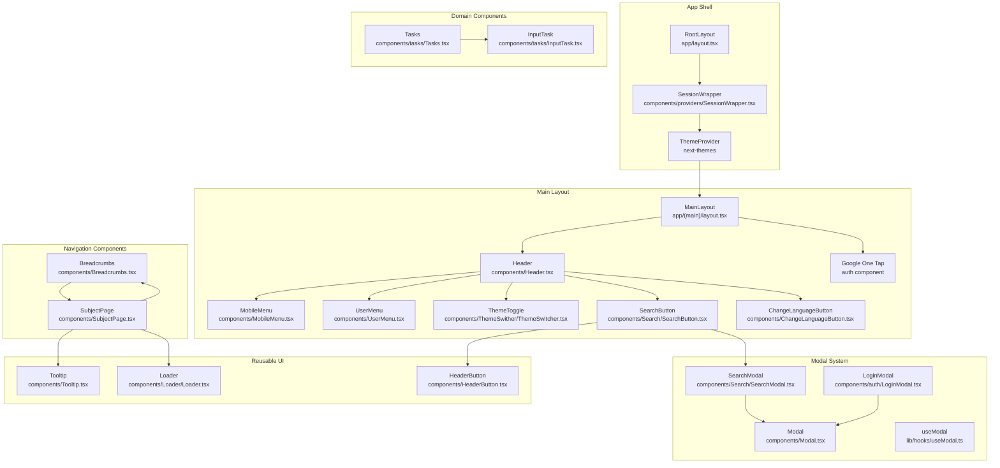
```mermaid
graph TB
subgraph "App Shell"
RootLayout["RootLayout<br/>app/layout.tsx"]
SessionWrapper["SessionWrapper<br/>components/providers/SessionWrapper.tsx"]
ThemeProvider["ThemeProvider<br/>next-themes"]
end
subgraph "Main Layout"
MainLayout["MainLayout<br/>app/(main)/layout.tsx"]
Header["Header<br/>components/Header.tsx"]
MobileMenu["MobileMenu<br/>components/MobileMenu.tsx"]
UserMenu["UserMenu<br/>components/UserMenu.tsx"]
ThemeToggle["ThemeToggle<br/>components/ThemeSwither/ThemeSwitcher.tsx"]
SearchButton["SearchButton<br/>components/Search/SearchButton.tsx"]
ChangeLanguage["ChangeLanguageButton<br/>components/ChangeLanguageButton.tsx"]
GoogleOneTap["Google One Tap<br/>auth component"]
end
subgraph "Navigation Components"
Breadcrumbs["Breadcrumbs<br/>components/Breadcrumbs.tsx"]
SubjectPage["SubjectPage<br/>components/SubjectPage.tsx"]
end
subgraph "Modal System"
Modal["Modal<br/>components/Modal.tsx"]
useModal["useModal<br/>lib/hooks/useModal.ts"]
SearchModal["SearchModal<br/>components/Search/SearchModal.tsx"]
LoginModal["LoginModal<br/>components/auth/LoginModal.tsx"]
end
subgraph "Reusable UI"
HeaderButton["HeaderButton<br/>components/HeaderButton.tsx"]
Tooltip["Tooltip<br/>components/Tooltip.tsx"]
Loader["Loader<br/>components/Loader/Loader.tsx"]
end
subgraph "Domain Components"
Tasks["Tasks<br/>components/tasks/Tasks.tsx"]
InputTask["InputTask<br/>components/tasks/InputTask.tsx"]
end
RootLayout --> SessionWrapper --> ThemeProvider --> MainLayout
MainLayout --> Header --> MobileMenu
Header --> UserMenu
Header --> ThemeToggle
Header --> SearchButton
Header --> ChangeLanguage
SearchButton --> HeaderButton
SearchButton --> SearchModal
SearchModal --> Modal
LoginModal --> Modal
Breadcrumbs --> SubjectPage
Tasks --> InputTask
SubjectPage --> Breadcrumbs
SubjectPage --> Tooltip
SubjectPage --> Loader
MainLayout --> GoogleOneTap
```

**Diagram sources**
- [app/layout.tsx](file://app/layout.tsx#L29-L45)
- [components/providers/SessionWrapper.tsx](file://components/providers/SessionWrapper.tsx#L8-L10)
- [app/(main)/layout.tsx](file://app/(main)/layout.tsx#L4-L17)
- [components/Header.tsx](file://components/Header.tsx#L33-L78)
- [components/MobileMenu.tsx](file://components/MobileMenu.tsx#L43-L94)
- [components/UserMenu.tsx](file://components/UserMenu.tsx#L10-L96)
- [components/ThemeSwither/ThemeSwitcher.tsx](file://components/ThemeSwither/ThemeSwitcher.tsx#L8-L68)
- [components/Search/SearchButton.tsx](file://components/Search/SearchButton.tsx#L7-L48)
- [components/ChangeLanguageButton.tsx](file://components/ChangeLanguageButton.tsx#L6-L49)
- [components/HeaderButton.tsx](file://components/HeaderButton.tsx#L9-L22)
- [components/Tooltip.tsx](file://components/Tooltip.tsx#L11-L68)
- [components/Modal.tsx](file://components/Modal.tsx#L1-L86)
- [lib/hooks/useModal.ts](file://lib/hooks/useModal.ts#L1-L64)
- [components/Search/SearchModal.tsx](file://components/Search/SearchModal.tsx#L1-L113)
- [components/auth/LoginModal.tsx](file://components/auth/LoginModal.tsx#L1-L17)
- [components/Breadcrumbs.tsx](file://components/Breadcrumbs.tsx#L14-L49)
- [components/SubjectPage.tsx](file://components/SubjectPage.tsx#L27-L35)
- [components/tasks/Tasks.tsx](file://components/tasks/Tasks.tsx#L12-L441)
- [components/tasks/InputTask.tsx](file://components/tasks/InputTask.tsx#L11-L97)
- [components/Loader/Loader.tsx](file://components/Loader/Loader.tsx#L1-L6)

**Section sources**
- [app/layout.tsx](file://app/layout.tsx#L29-L45)
- [app/(main)/layout.tsx](file://app/(main)/layout.tsx#L4-L17)

## Core Components
- Root providers: RootLayout composes SessionWrapper and ThemeProvider around all pages, ensuring session and theme contexts are available globally.
- Main layout: MainLayout defines the shared header, spacing, and Google One Tap integration for the main area.
- Header and navigation: Header renders subject navigation links and action buttons (search, theme toggle, user menu, language switcher). Now includes MobileMenu for responsive navigation.
- MobileMenu: New component providing hamburger menu interface with overlay and animated slide-in panel for mobile devices.
- User menu: UserMenu handles session state, click-outside detection, keyboard shortcuts, and logout.
- Theme toggle: ThemeToggle manages theme switching with audio feedback and client-side hydration awareness.
- Search button: SearchButton triggers animations and integrates with HeaderButton.
- Change language button: **New** ChangeLanguageButton provides language switching functionality with visual feedback animation.
- Tooltip: Tooltip provides accessible tooltips with mount/unmount lifecycle and delays.
- Breadcrumbs: **New** Breadcrumbs component provides contextual navigation breadcrumbs with home link and chevron separators.
- Modal system: **Updated** Modal component with comprehensive accessibility support, animation handling, and flexible configuration options. Composed with useModal hooks for state management.
- Search modal: SearchModal provides advanced search functionality with real-time filtering and result display.
- Login modal: LoginModal offers authentication interface with seamless integration into the modal system.
- Subject page: SubjectPage organizes topic sections, lessons, and progress badges, now enhanced with breadcrumb navigation.
- Tasks: Tasks orchestrates task loading, XP state, submission, and result display; delegates to InputTask/MultipleChoiceTask.
- Input task: InputTask handles user input, normalization, correctness checks, and feedback.
- Loader: Loader provides a lightweight spinner component.

**Section sources**
- [app/layout.tsx](file://app/layout.tsx#L29-L45)
- [components/providers/SessionWrapper.tsx](file://components/providers/SessionWrapper.tsx#L8-L10)
- [app/(main)/layout.tsx](file://app/(main)/layout.tsx#L4-L17)
- [components/Header.tsx](file://components/Header.tsx#L33-L78)
- [components/MobileMenu.tsx](file://components/MobileMenu.tsx#L43-L94)
- [components/UserMenu.tsx](file://components/UserMenu.tsx#L10-L96)
- [components/ThemeSwither/ThemeSwitcher.tsx](file://components/ThemeSwither/ThemeSwitcher.tsx#L8-L68)
- [components/Search/SearchButton.tsx](file://components/Search/SearchButton.tsx#L7-L48)
- [components/ChangeLanguageButton.tsx](file://components/ChangeLanguageButton.tsx#L6-L49)
- [components/Tooltip.tsx](file://components/Tooltip.tsx#L11-L68)
- [components/Breadcrumbs.tsx](file://components/Breadcrumbs.tsx#L14-L49)
- [components/Modal.tsx](file://components/Modal.tsx#L1-L86)
- [lib/hooks/useModal.ts](file://lib/hooks/useModal.ts#L1-L64)
- [components/Search/SearchModal.tsx](file://components/Search/SearchModal.tsx#L1-L113)
- [components/auth/LoginModal.tsx](file://components/auth/LoginModal.tsx#L1-L17)
- [components/SubjectPage.tsx](file://components/SubjectPage.tsx#L27-L35)
- [components/tasks/Tasks.tsx](file://components/tasks/Tasks.tsx#L12-L441)
- [components/tasks/InputTask.tsx](file://components/tasks/InputTask.tsx#L11-L97)
- [components/Loader/Loader.tsx](file://components/Loader/Loader.tsx#L1-L6)

## Architecture Overview
The UI architecture centers on two provider layers:
- SessionWrapper wraps the app to supply session data via next-auth's SessionProvider.
- ThemeProvider supplies theme-awareness and system preference handling.

Layout components define the shell and navigation, while reusable UI elements encapsulate cross-cutting concerns like modals, tooltips, breadcrumbs, and buttons. The modal system has been completely refactored to use a hook-based architecture with improved accessibility and animation handling. Domain components (SubjectPage, Tasks) compose smaller elements and manage domain-specific state. The MobileMenu component enhances the responsive navigation system by providing mobile-specific interaction patterns, while the Breadcrumbs component provides contextual navigation breadcrumbs for improved user experience.

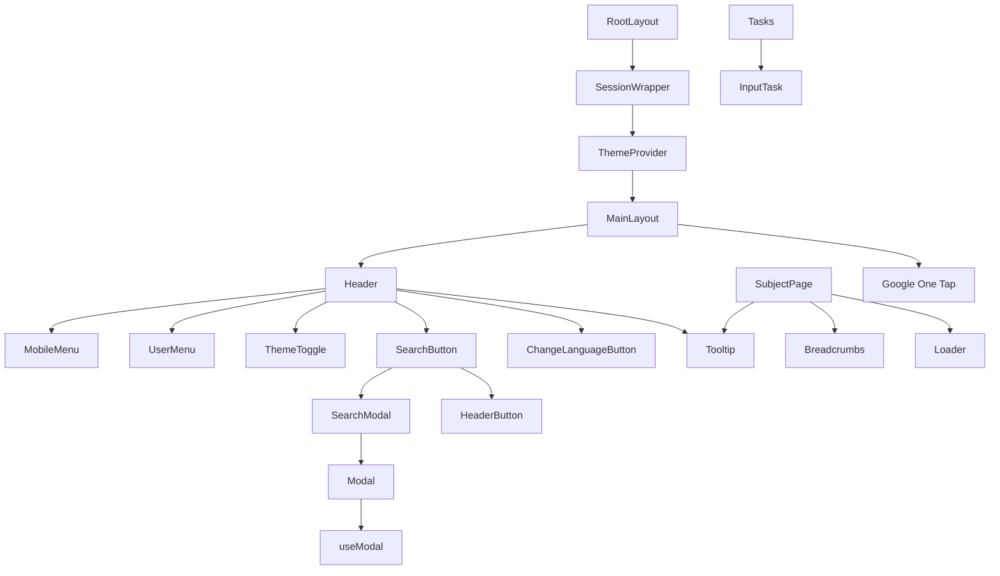
```mermaid
graph TB
Root["RootLayout"] --> SW["SessionWrapper"]
SW --> TP["ThemeProvider"]
TP --> ML["MainLayout"]
ML --> H["Header"]
H --> MM["MobileMenu"]
H --> UM["UserMenu"]
H --> TT["ThemeToggle"]
H --> SB["SearchButton"]
H --> CL["ChangeLanguageButton"]
SB --> SM["SearchModal"]
SM --> M["Modal"]
M --> UMHook["useModal"]
SB --> HB["HeaderButton"]
H --> TL["Tooltip"]
SP["SubjectPage"] --> BC["Breadcrumbs"]
SP --> TL
SP --> LD["Loader"]
TK["Tasks"] --> IT["InputTask"]
ML --> GM["Google One Tap"]
```

**Diagram sources**
- [app/layout.tsx](file://app/layout.tsx#L29-L45)
- [components/providers/SessionWrapper.tsx](file://components/providers/SessionWrapper.tsx#L8-L10)
- [app/(main)/layout.tsx](file://app/(main)/layout.tsx#L4-L17)
- [components/Header.tsx](file://components/Header.tsx#L33-L78)
- [components/MobileMenu.tsx](file://components/MobileMenu.tsx#L43-L94)
- [components/UserMenu.tsx](file://components/UserMenu.tsx#L10-L96)
- [components/ThemeSwither/ThemeSwitcher.tsx](file://components/ThemeSwither/ThemeSwitcher.tsx#L8-L68)
- [components/Search/SearchButton.tsx](file://components/Search/SearchButton.tsx#L7-L48)
- [components/ChangeLanguageButton.tsx](file://components/ChangeLanguageButton.tsx#L6-L49)
- [components/HeaderButton.tsx](file://components/HeaderButton.tsx#L9-L22)
- [components/Tooltip.tsx](file://components/Tooltip.tsx#L11-L68)
- [components/Modal.tsx](file://components/Modal.tsx#L1-L86)
- [lib/hooks/useModal.ts](file://lib/hooks/useModal.ts#L1-L64)
- [components/Search/SearchModal.tsx](file://components/Search/SearchModal.tsx#L1-L113)
- [components/tasks/Tasks.tsx](file://components/tasks/Tasks.tsx#L12-L441)
- [components/tasks/InputTask.tsx](file://components/tasks/InputTask.tsx#L11-L97)
- [components/Breadcrumbs.tsx](file://components/Breadcrumbs.tsx#L14-L49)
- [components/SubjectPage.tsx](file://components/SubjectPage.tsx#L27-L35)

## Responsive Navigation System

### MobileMenu Component Architecture
The MobileMenu component provides a comprehensive mobile navigation solution with the following key features:
- **State Management**: Uses React useState hook to control menu open/close state
- **Responsive Design**: Hidden on larger screens (lg breakpoint) and active on mobile devices
- **Overlay System**: Implements backdrop overlay with semi-transparent black background
- **Animated Transitions**: Smooth slide-down animation with translate-y transformation
- **Accessibility**: Proper ARIA labels for screen readers and keyboard navigation support
- **Icon Integration**: Uses react-icons for consistent iconography across platforms

### Mobile Navigation Flow
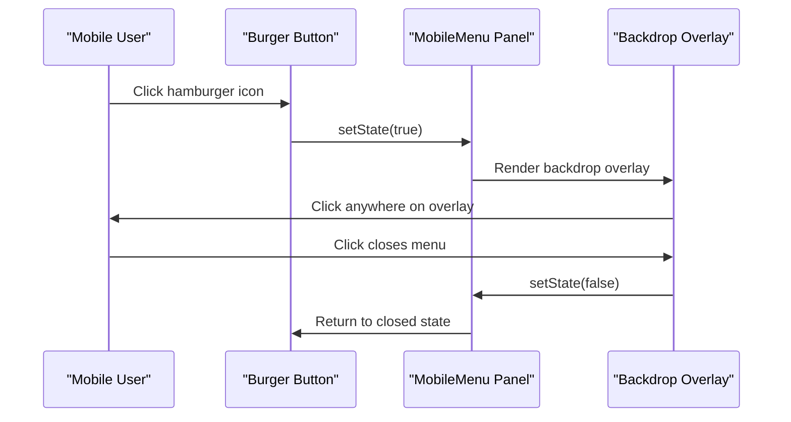
```mermaid
sequenceDiagram
participant User as "Mobile User"
participant Button as "Burger Button"
participant Menu as "MobileMenu Panel"
participant Overlay as "Backdrop Overlay"
User->>Button : Click hamburger icon
Button->>Menu : setState(true)
Menu->>Overlay : Render backdrop overlay
Overlay->>User : Click anywhere on overlay
User->>Overlay : Click closes menu
Overlay->>Menu : setState(false)
Menu->>Button : Return to closed state
```

**Diagram sources**
- [components/MobileMenu.tsx](file://components/MobileMenu.tsx#L43-L94)

### Desktop vs Mobile Navigation Strategy
The Header component implements a dual navigation strategy:
- **Desktop Navigation**: Full horizontal navigation bar with desktop-specific styling
- **Mobile Navigation**: Compact hamburger menu with vertical slide-out panel
- **Breakpoint Logic**: Uses Tailwind CSS lg breakpoint (1024px) to switch between modes
- **Shared Data**: Both navigation systems use the same navigationItems array for consistency

**Section sources**
- [components/MobileMenu.tsx](file://components/MobileMenu.tsx#L43-L94)
- [components/Header.tsx](file://components/Header.tsx#L40-L63)

## Breadcrumb Navigation System

### Breadcrumbs Component Architecture
The Breadcrumbs component provides contextual navigation breadcrumbs with the following key features:
- **Type Safety**: Strongly typed BreadcrumbItem interface with optional href property
- **Accessibility**: Proper aria-label for screen readers and semantic nav element structure
- **Responsive Design**: Truncates long labels with max-width constraints and responsive breakpoints
- **Visual Hierarchy**: Home icon as first breadcrumb with chevron separators between items
- **Interactive Elements**: Links for navigable items, static spans for current page
- **Internationalization**: Localized breadcrumb labels (e.g., "Головна" for home)

### Breadcrumb Rendering Flow
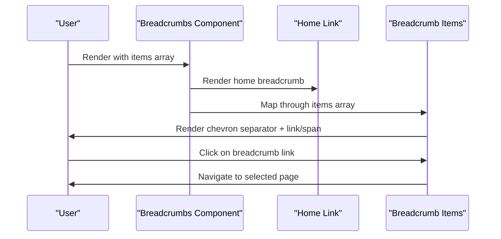
```mermaid
sequenceDiagram
participant User as "User"
participant Breadcrumbs as "Breadcrumbs Component"
participant HomeLink as "Home Link"
participant ItemLinks as "Breadcrumb Items"
User->>Breadcrumbs : Render with items array
Breadcrumbs->>HomeLink : Render home breadcrumb
Breadcrumbs->>ItemLinks : Map through items array
ItemLinks->>User : Render chevron separator + link/span
User->>ItemLinks : Click on breadcrumb link
ItemLinks->>User : Navigate to selected page
```

### Breadcrumb Usage Patterns
The Breadcrumbs component is primarily used in SubjectPage to provide contextual navigation:
- **Single Item**: SubjectPage passes the page title as a single breadcrumb item
- **Multi-level**: Can be extended to support deeper navigation hierarchies
- **Dynamic Generation**: Items array can be generated dynamically based on route parameters
- **Accessibility**: Proper ARIA labeling and keyboard navigation support

**Diagram sources**
- [components/Breadcrumbs.tsx](file://components/Breadcrumbs.tsx#L14-L49)
- [components/SubjectPage.tsx](file://components/SubjectPage.tsx#L27-L35)

**Section sources**
- [components/Breadcrumbs.tsx](file://components/Breadcrumbs.tsx#L14-L49)
- [components/SubjectPage.tsx](file://components/SubjectPage.tsx#L27-L35)

## CSS Styling Architecture

### Global Styles Foundation
The application implements a comprehensive CSS architecture built around Tailwind CSS with custom enhancements for visual stability and cross-browser compatibility.

**Enhanced Scrollbar Stability**
The CSS foundation includes critical improvements for visual stability:
- `scrollbar-gutter: stable` prevents layout shifts when scrollbars appear or disappear
- `overflow-y: scroll` ensures consistent scrollbar rendering across different browsers
- These properties work together to eliminate jank and maintain consistent page dimensions

**Responsive Breakpoints**
The styling architecture now includes enhanced mobile responsiveness:
- `lg:hidden` classes hide mobile menu on larger screens
- `lg:flex` classes show desktop navigation on larger screens
- Consistent spacing and padding adjustments for mobile-first design
- Flexible layout containers that adapt to screen size

**Typography System**
The typography system leverages Google Fonts with variable font support:
- Inter font family with CSS variables for dynamic sizing
- Custom font-sans variable mapped to Inter for consistent typography
- Optimized font-display settings for performance

**Dark Mode Integration**
The styling architecture seamlessly integrates with the theme system:
- CSS custom properties for theme-aware colors
- Dark mode selectors for background and text color customization
- Smooth transitions between light and dark themes

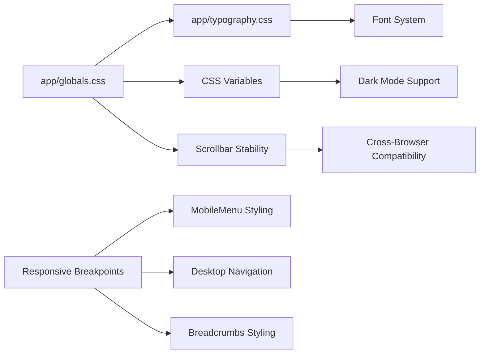
```mermaid
graph LR
Globals["app/globals.css"] --> Typography["app/typography.css"]
Globals --> ThemeVars["CSS Variables"]
Globals --> ScrollStability["Scrollbar Stability"]
Typography --> FontSystem["Font System"]
ThemeVars --> DarkMode["Dark Mode Support"]
ScrollStability --> CrossBrowser["Cross-Browser Compatibility"]
Responsive["Responsive Breakpoints"] --> MobileMenu["MobileMenu Styling"]
Responsive --> DesktopNav["Desktop Navigation"]
Responsive --> Breadcrumbs["Breadcrumbs Styling"]
```

**Diagram sources**
- [app/globals.css](file://app/globals.css#L1-L19)
- [app/typography.css](file://app/typography.css#L1-L11)
- [components/MobileMenu.tsx](file://components/MobileMenu.tsx#L50-L78)
- [components/Breadcrumbs.tsx](file://components/Breadcrumbs.tsx#L16-L47)

**Section sources**
- [app/globals.css](file://app/globals.css#L1-L19)
- [app/typography.css](file://app/typography.css#L1-L11)
- [components/MobileMenu.tsx](file://components/MobileMenu.tsx#L50-L78)
- [components/Breadcrumbs.tsx](file://components/Breadcrumbs.tsx#L16-L47)

## Modal System Architecture

### Complete Modal System Refactor
The modal system has been completely refactored to provide improved accessibility, animation handling, and flexible configuration options. The new architecture separates concerns between presentation (Modal component) and logic (useModal hooks).

### Modal Component Architecture
The Modal component serves as a presentation layer with comprehensive accessibility features:
- **Portal Rendering**: Uses createPortal to render modals outside the normal DOM hierarchy
- **Accessibility**: Implements proper ARIA attributes (aria-modal, role="dialog") for screen readers
- **Animation System**: Smooth fade and scale transitions using requestAnimationFrame
- **Configuration Options**: Flexible props for title, max width, close button visibility, alignment, and custom classes
- **Keyboard Handling**: ESC key support for easy dismissal
- **Click Outside**: Automatic closing when clicking outside modal content

### Hook-Based Architecture
The useModal hooks provide a clean separation of concerns:
- **useModalState**: Manages parent component state for modal open/close control
- **useModalLogic**: Handles internal modal logic including animations, event listeners, and cleanup

### Modal Lifecycle Management
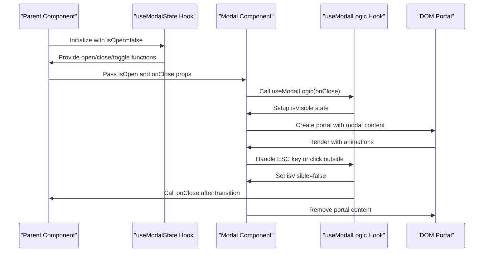
```mermaid
sequenceDiagram
participant Parent as "Parent Component"
participant useModalState as "useModalState Hook"
participant Modal as "Modal Component"
participant useModalLogic as "useModalLogic Hook"
participant Portal as "DOM Portal"
Parent->>useModalState : Initialize with isOpen=false
useModalState->>Parent : Provide open/close/toggle functions
Parent->>Modal : Pass isOpen and onClose props
Modal->>useModalLogic : Call useModalLogic(onClose)
useModalLogic->>Modal : Setup isVisible state
Modal->>Portal : Create portal with modal content
Portal->>Modal : Render with animations
Modal->>useModalLogic : Handle ESC key or click outside
useModalLogic->>Modal : Set isVisible=false
useModalLogic->>Parent : Call onClose after transition
Modal->>Portal : Remove portal content
```

**Diagram sources**
- [components/Modal.tsx](file://components/Modal.tsx#L1-L86)
- [lib/hooks/useModal.ts](file://lib/hooks/useModal.ts#L1-L64)

### Modal Usage Patterns
The modal system supports multiple usage patterns:
- **Search Modal**: Advanced search interface with real-time filtering and result display
- **Login Modal**: Authentication interface with form integration
- **Custom Modals**: Flexible configuration for any content requiring modal presentation

**Section sources**
- [components/Modal.tsx](file://components/Modal.tsx#L1-L86)
- [lib/hooks/useModal.ts](file://lib/hooks/useModal.ts#L1-L64)
- [components/Search/SearchModal.tsx](file://components/Search/SearchModal.tsx#L1-L113)
- [components/auth/LoginModal.tsx](file://components/auth/LoginModal.tsx#L1-L17)

## Detailed Component Analysis

### Provider Pattern: SessionWrapper and ThemeProvider
- SessionWrapper: Wraps children with next-auth's SessionProvider and controls refetch behavior on window focus. This centralizes session availability across the app.
- ThemeProvider: Supplies theme context with system preference support and class-based switching, enabling consistent dark/light mode across components.

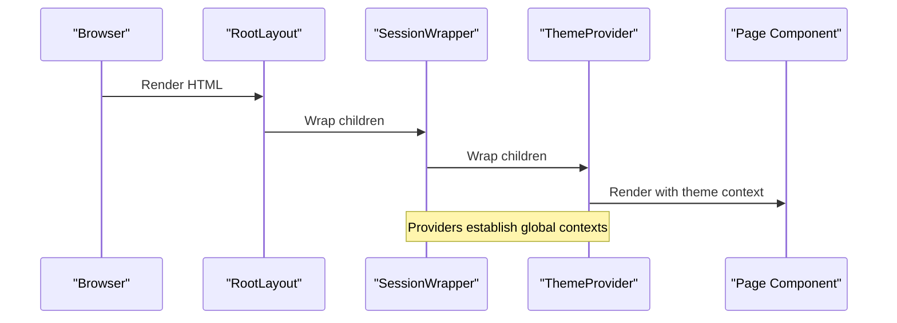
```mermaid
sequenceDiagram
participant Browser as "Browser"
participant Root as "RootLayout"
participant SW as "SessionWrapper"
participant TP as "ThemeProvider"
participant Page as "Page Component"
Browser->>Root : Render HTML
Root->>SW : Wrap children
SW->>TP : Wrap children
TP->>Page : Render with theme context
Note over SW,TP : Providers establish global contexts
```

**Diagram sources**
- [app/layout.tsx](file://app/layout.tsx#L29-L45)
- [components/providers/SessionWrapper.tsx](file://components/providers/SessionWrapper.tsx#L8-L10)

**Section sources**
- [app/layout.tsx](file://app/layout.tsx#L29-L45)
- [components/providers/SessionWrapper.tsx](file://components/providers/SessionWrapper.tsx#L8-L10)

### Enhanced Header and Navigation Composition
- Header composes NavigationLink entries for subjects, action buttons (SearchButton, ThemeToggle), UserMenu, and ChangeLanguageButton. Now includes MobileMenu for responsive navigation.
- MobileMenu provides hamburger menu interface with overlay and animated slide-in panel for mobile devices.
- UserMenu manages session state, click-outside and escape-key closing, and displays user avatar or fallback initials.
- ChangeLanguageButton: **New** Provides language switching functionality with visual feedback animation using CSS keyframes.
- The component uses conditional rendering based on screen size to provide optimal navigation experience across devices.

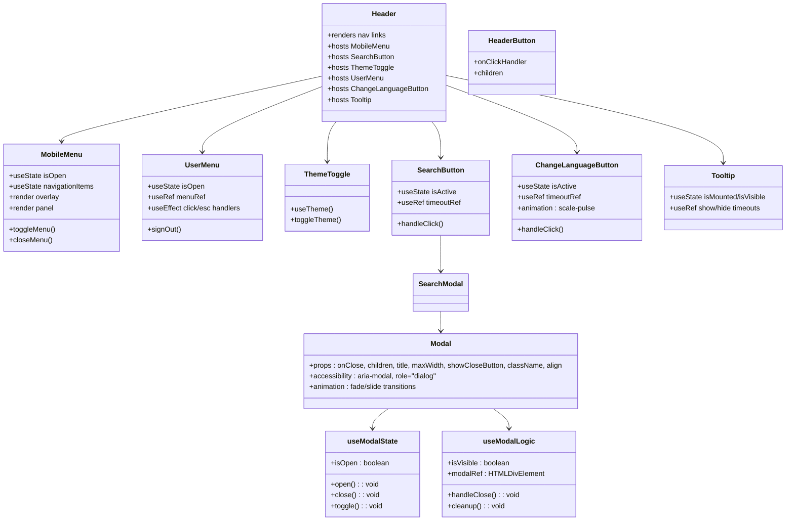
```mermaid
classDiagram
class Header {
+renders nav links
+hosts MobileMenu
+hosts SearchButton
+hosts ThemeToggle
+hosts UserMenu
+hosts ChangeLanguageButton
+hosts Tooltip
}
class MobileMenu {
+useState isOpen
+useState navigationItems
+toggleMenu()
+closeMenu()
+render overlay
+render panel
}
class UserMenu {
+useState isOpen
+useRef menuRef
+useEffect click/esc handlers
+signOut()
}
class ThemeToggle {
+useTheme()
+toggleTheme()
}
class SearchButton {
+useState isActive
+useRef timeoutRef
+handleClick()
}
class ChangeLanguageButton {
+useState isActive
+useRef timeoutRef
+handleClick()
+animation : scale-pulse
}
class HeaderButton {
+onClickHandler
+children
}
class Tooltip {
+useState isMounted/isVisible
+useRef show/hide timeouts
}
class Modal {
+props : onClose, children, title, maxWidth, showCloseButton, className, align
+accessibility : aria-modal, role="dialog"
+animation : fade/slide transitions
}
class useModalState {
+isOpen : boolean
+open() : void
+close() : void
+toggle() : void
}
class useModalLogic {
+isVisible : boolean
+modalRef : HTMLDivElement
+handleClose() : void
+cleanup() : void
}
Header --> MobileMenu
Header --> UserMenu
Header --> ThemeToggle
Header --> SearchButton
Header --> ChangeLanguageButton
Header --> Tooltip
SearchButton --> SearchModal
SearchModal --> Modal
Modal --> useModalState
Modal --> useModalLogic
```

**Diagram sources**
- [components/Header.tsx](file://components/Header.tsx#L33-L78)
- [components/MobileMenu.tsx](file://components/MobileMenu.tsx#L43-L94)
- [components/UserMenu.tsx](file://components/UserMenu.tsx#L10-L96)
- [components/ThemeSwither/ThemeSwitcher.tsx](file://components/ThemeSwither/ThemeSwitcher.tsx#L8-L68)
- [components/Search/SearchButton.tsx](file://components/Search/SearchButton.tsx#L7-L48)
- [components/ChangeLanguageButton.tsx](file://components/ChangeLanguageButton.tsx#L6-L49)
- [components/HeaderButton.tsx](file://components/HeaderButton.tsx#L9-L22)
- [components/Tooltip.tsx](file://components/Tooltip.tsx#L11-L68)
- [components/Modal.tsx](file://components/Modal.tsx#L1-L86)
- [lib/hooks/useModal.ts](file://lib/hooks/useModal.ts#L1-L64)

**Section sources**
- [components/Header.tsx](file://components/Header.tsx#L33-L78)
- [components/MobileMenu.tsx](file://components/MobileMenu.tsx#L43-L94)
- [components/UserMenu.tsx](file://components/UserMenu.tsx#L10-L96)
- [components/ThemeSwither/ThemeSwitcher.tsx](file://components/ThemeSwither/ThemeSwitcher.tsx#L8-L68)
- [components/Search/SearchButton.tsx](file://components/Search/SearchButton.tsx#L7-L48)
- [components/ChangeLanguageButton.tsx](file://components/ChangeLanguageButton.tsx#L6-L49)
- [components/HeaderButton.tsx](file://components/HeaderButton.tsx#L9-L22)
- [components/Tooltip.tsx](file://components/Tooltip.tsx#L11-L68)

### SubjectPage Composition and Reusability
- SubjectPage accepts structured data (SubjectPageData) and renders a page header, topic sections, lessons lists, and per-section progress badges.
- **Updated** Now includes Breadcrumbs component for improved navigation context, displaying the subject title as the breadcrumb item.
- It composes reusable UI elements like Tooltip and Loader for accessibility and UX polish.

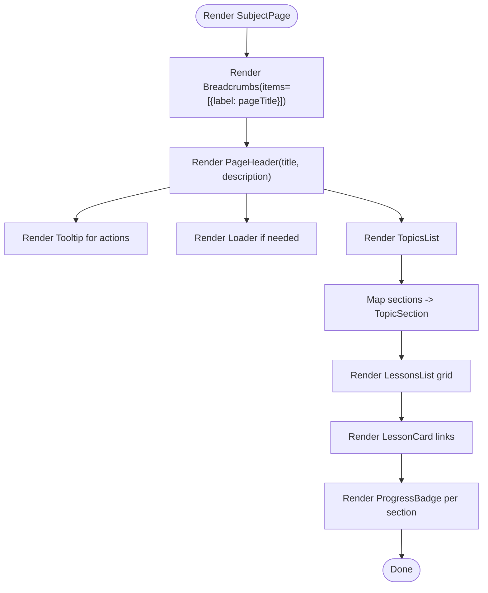
```mermaid
flowchart TD
Start(["Render SubjectPage"]) --> BC["Render Breadcrumbs(items=[{label: pageTitle}])"]
BC --> PH["Render PageHeader(title, description)"]
PH --> TL["Render Tooltip for actions"]
PH --> LD["Render Loader if needed"]
PH --> TL2["Render TopicsList"]
TL2 --> TS["Map sections -> TopicSection"]
TS --> SL["Render LessonsList grid"]
SL --> LC["Render LessonCard links"]
LC --> PB["Render ProgressBadge per section"]
PB --> End(["Done"])
```

**Diagram sources**
- [components/SubjectPage.tsx](file://components/SubjectPage.tsx#L27-L35)
- [components/Breadcrumbs.tsx](file://components/Breadcrumbs.tsx#L14-L49)
- [components/Tooltip.tsx](file://components/Tooltip.tsx#L11-L68)
- [components/Loader/Loader.tsx](file://components/Loader/Loader.tsx#L1-L6)

**Section sources**
- [components/SubjectPage.tsx](file://components/SubjectPage.tsx#L27-L35)
- [components/Breadcrumbs.tsx](file://components/Breadcrumbs.tsx#L14-L49)
- [components/Tooltip.tsx](file://components/Tooltip.tsx#L11-L68)
- [components/Loader/Loader.tsx](file://components/Loader/Loader.tsx#L1-L6)

### Tasks Workflow and State Management
- Tasks orchestrates:
  - Loading XP and topic config when session is ready.
  - Managing current task index, answers, submission results, completed task IDs, and submission state.
  - Delegating to InputTask for user input handling and correctness checks.
  - Playing sound feedback and updating XP state upon submission.
- InputTask:
  - Normalizes answers, compares against accepted or correct values, and provides immediate feedback.
  - Supports Enter key submission and clears input.

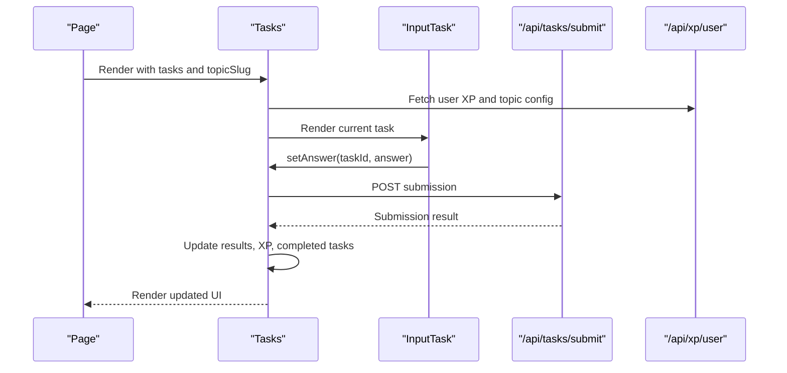
```mermaid
sequenceDiagram
participant Page as "Page"
participant Tasks as "Tasks"
participant IT as "InputTask"
participant API as "/api/tasks/submit"
participant XPAPI as "/api/xp/user"
Page->>Tasks : Render with tasks and topicSlug
Tasks->>XPAPI : Fetch user XP and topic config
Tasks->>IT : Render current task
IT->>Tasks : setAnswer(taskId, answer)
Tasks->>API : POST submission
API-->>Tasks : Submission result
Tasks->>Tasks : Update results, XP, completed tasks
Tasks-->>Page : Render updated UI
```

**Diagram sources**
- [components/tasks/Tasks.tsx](file://components/tasks/Tasks.tsx#L12-L441)
- [components/tasks/InputTask.tsx](file://components/tasks/InputTask.tsx#L11-L97)

**Section sources**
- [components/tasks/Tasks.tsx](file://components/tasks/Tasks.tsx#L12-L441)
- [components/tasks/InputTask.tsx](file://components/tasks/InputTask.tsx#L11-L97)

### Modal System Lifecycle Patterns
**Updated** The modal system now uses a sophisticated hook-based architecture:
- **useModalState**: Manages parent component state for controlling modal visibility
- **useModalLogic**: Handles internal modal logic including animations, ESC key handling, and click-outside detection
- **Accessibility**: Proper ARIA attributes and screen reader support
- **Animation**: Smooth fade and slide transitions using requestAnimationFrame
- **Cleanup**: Automatic event listener cleanup to prevent memory leaks

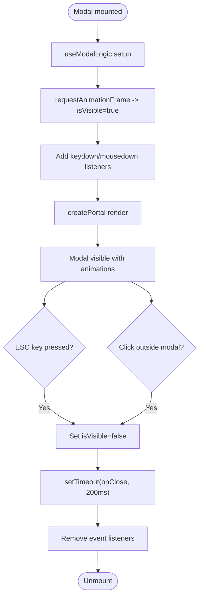
```mermaid
flowchart TD
MStart(["Modal mounted"]) --> Init["useModalLogic setup"]
Init --> RAF["requestAnimationFrame -> isVisible=true"]
RAF --> Listen["Add keydown/mousedown listeners"]
Listen --> Portal["createPortal render"]
Portal --> Visible["Modal visible with animations"]
Visible --> ESC{"ESC key pressed?"}
Visible --> ClickOutside{"Click outside modal?"}
ESC --> |Yes| Close["Set isVisible=false"]
ClickOutside --> |Yes| Close
Close --> Timeout["setTimeout(onClose, 200ms)"]
Timeout --> Cleanup["Remove event listeners"]
Cleanup --> MEnd(["Unmount"])
```

**Diagram sources**
- [components/Modal.tsx](file://components/Modal.tsx#L1-L86)
- [lib/hooks/useModal.ts](file://lib/hooks/useModal.ts#L1-L64)

**Section sources**
- [components/Modal.tsx](file://components/Modal.tsx#L1-L86)
- [lib/hooks/useModal.ts](file://lib/hooks/useModal.ts#L1-L64)

## Dependency Analysis
- Provider coupling:
  - RootLayout depends on SessionWrapper and ThemeProvider to establish global contexts.
  - MainLayout depends on Header and Google One Tap for shared UI.
- Component cohesion:
  - Header aggregates related UI actions (search, theme, user menu, mobile menu, language switcher) and Tooltip for accessibility.
  - MobileMenu provides cohesive mobile navigation experience with consistent styling and behavior.
  - Breadcrumbs provides cohesive navigation context with strong typing and accessibility.
  - Tasks encapsulates domain logic for task progression and XP updates.
  - **Updated** Modal system provides cohesive modal experience with reusable hooks and components.
- External dependencies:
  - next-auth/react for session management.
  - next-themes for theme management.
  - react-icons for icons.
  - react-dom for createPortal in Modal components.

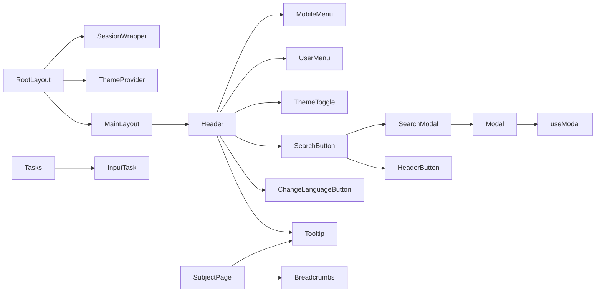
```mermaid
graph LR
Root["RootLayout"] --> SW["SessionWrapper"]
Root --> TP["ThemeProvider"]
Root --> ML["MainLayout"]
ML --> H["Header"]
H --> MM["MobileMenu"]
H --> UM["UserMenu"]
H --> TT["ThemeToggle"]
H --> SB["SearchButton"]
H --> CL["ChangeLanguageButton"]
SB --> SM["SearchModal"]
SB --> HB["HeaderButton"]
H --> TL["Tooltip"]
SM --> M["Modal"]
M --> UMHook["useModal"]
SP["SubjectPage"] --> BC["Breadcrumbs"]
SP --> TL
TK["Tasks"] --> IT["InputTask"]
```

**Diagram sources**
- [app/layout.tsx](file://app/layout.tsx#L29-L45)
- [components/providers/SessionWrapper.tsx](file://components/providers/SessionWrapper.tsx#L8-L10)
- [app/(main)/layout.tsx](file://app/(main)/layout.tsx#L4-L17)
- [components/Header.tsx](file://components/Header.tsx#L33-L78)
- [components/MobileMenu.tsx](file://components/MobileMenu.tsx#L43-L94)
- [components/UserMenu.tsx](file://components/UserMenu.tsx#L10-L96)
- [components/ThemeSwither/ThemeSwitcher.tsx](file://components/ThemeSwither/ThemeSwitcher.tsx#L8-L68)
- [components/Search/SearchButton.tsx](file://components/Search/SearchButton.tsx#L7-L48)
- [components/ChangeLanguageButton.tsx](file://components/ChangeLanguageButton.tsx#L6-L49)
- [components/HeaderButton.tsx](file://components/HeaderButton.tsx#L9-L22)
- [components/Tooltip.tsx](file://components/Tooltip.tsx#L11-L68)
- [components/Modal.tsx](file://components/Modal.tsx#L1-L86)
- [lib/hooks/useModal.ts](file://lib/hooks/useModal.ts#L1-L64)
- [components/Search/SearchModal.tsx](file://components/Search/SearchModal.tsx#L1-L113)
- [components/tasks/Tasks.tsx](file://components/tasks/Tasks.tsx#L12-L441)
- [components/tasks/InputTask.tsx](file://components/tasks/InputTask.tsx#L11-L97)
- [components/Breadcrumbs.tsx](file://components/Breadcrumbs.tsx#L14-L49)
- [components/SubjectPage.tsx](file://components/SubjectPage.tsx#L27-L35)

**Section sources**
- [app/layout.tsx](file://app/layout.tsx#L29-L45)
- [app/(main)/layout.tsx](file://app/(main)/layout.tsx#L4-L17)
- [components/Header.tsx](file://components/Header.tsx#L33-L78)
- [components/MobileMenu.tsx](file://components/MobileMenu.tsx#L43-L94)
- [components/tasks/Tasks.tsx](file://components/tasks/Tasks.tsx#L12-L441)
- [components/Breadcrumbs.tsx](file://components/Breadcrumbs.tsx#L14-L49)

## Performance Considerations
- Provider overhead: Keep provider boundaries minimal; avoid unnecessary re-renders by scoping providers to route groups where appropriate.
- MobileMenu optimization: The component uses conditional rendering and CSS transforms for smooth animations without heavy JavaScript computations.
- **Updated** Modal performance: The new hook-based modal system uses requestAnimationFrame for smooth animations and automatic cleanup of event listeners to prevent memory leaks.
- Tooltip lifecycle: Debouncing and requestAnimationFrame improve smoothness; avoid excessive mounts/unmounts by grouping related tooltips.
- Tasks state: Memoization of available tasks reduces recomputation; ensure submission requests are not duplicated by guarding with an isSubmitting flag.
- Theme switching: ThemeProvider relies on system preferences; minimize forced reflows by batching theme-related updates.
- **Updated** CSS performance: The enhanced scrollbar stability properties (`scrollbar-gutter: stable` and `overflow-y: scroll`) prevent layout thrashing during scroll events, improving overall page performance and user experience across different browsers.
- **Updated** Responsive performance: MobileMenu uses CSS media queries and transform animations for optimal mobile performance, avoiding expensive layout recalculations.
- **Updated** Modal accessibility: The new modal system provides proper ARIA attributes and keyboard navigation support, enhancing both accessibility and performance through efficient event handling.
- **Updated** Breadcrumb performance: The Breadcrumbs component uses efficient array mapping and conditional rendering, with responsive truncation preventing layout shifts during text overflow.
- **Updated** Language button performance: ChangeLanguageButton uses CSS animations instead of JavaScript animations, providing smooth visual feedback with minimal performance impact.

## Troubleshooting Guide
- Hydration mismatch with theme: Ensure ThemeProvider is applied at the root and attribute is set to class. Verify system preference handling does not conflict with server-rendered classes.
- Session not available: Confirm SessionWrapper is present in RootLayout and refetch behavior aligns with intended UX.
- Tooltip not appearing: Check Tooltip's mount/unmount logic and ensure parent container allows overflow and positioning.
- **Updated** Modal not closing: Verify click-outside and ESC key handlers are attached and cleaned up; confirm onClose callback is invoked after transition completes. Check that useModalLogic is properly cleaning up event listeners.
- **Updated** Modal accessibility issues: Ensure proper ARIA attributes are set and screen reader announcements work correctly. Verify that focus management works properly after modal closes.
- Tasks submission errors: Inspect submission flow for duplicate submissions, network failures, and correct payload construction. Validate XP API responses and handle missing data gracefully.
- **Updated** MobileMenu not responding: Verify the component is properly imported and rendered in Header. Check that the lg breakpoint is correctly configured and CSS classes are applied.
- **Updated** MobileMenu overlay issues: Ensure the overlay div has proper z-index stacking context and click handlers are functioning correctly.
- **Updated** Scrollbar layout issues: If experiencing layout shifts or inconsistent scrollbar appearance, verify that the global CSS properties `scrollbar-gutter: stable` and `overflow-y: scroll` are properly applied and not being overridden by component-specific styles.
- **Updated** Modal state management: If modals aren't opening/closing properly, check that useModalState is being used correctly in parent components and that isOpen prop is properly passed to Modal components.
- **Updated** Breadcrumb navigation issues: If breadcrumbs aren't rendering correctly, verify that the items array contains proper BreadcrumbItem objects with required label properties. Check that href properties are correctly formatted for navigation.
- **Updated** Language button animation problems: If the language button animation isn't working, verify that the CSS keyframes are properly loaded and the isActive state is toggling correctly. Check that the timeout cleanup is working properly to prevent memory leaks.

**Section sources**
- [app/layout.tsx](file://app/layout.tsx#L29-L45)
- [components/providers/SessionWrapper.tsx](file://components/providers/SessionWrapper.tsx#L8-L10)
- [components/Tooltip.tsx](file://components/Tooltip.tsx#L11-L68)
- [components/Modal.tsx](file://components/Modal.tsx#L1-L86)
- [lib/hooks/useModal.ts](file://lib/hooks/useModal.ts#L1-L64)
- [components/tasks/Tasks.tsx](file://components/tasks/Tasks.tsx#L12-L441)
- [app/globals.css](file://app/globals.css#L15-L18)
- [components/MobileMenu.tsx](file://components/MobileMenu.tsx#L43-L94)
- [components/Breadcrumbs.tsx](file://components/Breadcrumbs.tsx#L14-L49)
- [components/ChangeLanguageButton.tsx](file://components/ChangeLanguageButton.tsx#L6-L49)

## Conclusion
The UI architecture employs a clear provider-first approach with SessionWrapper and ThemeProvider establishing global contexts. Layout components define shared shells and navigation, while reusable UI elements encapsulate cross-cutting concerns. Domain components like SubjectPage and Tasks compose smaller elements and manage state locally where appropriate. The newly integrated MobileMenu component enhances the responsive navigation system, providing seamless mobile experience while maintaining consistency with desktop navigation patterns. 

**Updated** The comprehensive Breadcrumbs component significantly improves navigation context and user experience by providing clear breadcrumb trails for complex navigation hierarchies. The component is strongly typed, accessible, and responsive, with proper internationalization support.

**Updated** The completely refactored modal system represents a significant improvement in accessibility, animation handling, and flexible configuration options. The new hook-based architecture with useModalState and useModalLogic provides clean separation of concerns, improved maintainability, and better developer experience. The Modal component offers comprehensive accessibility features including proper ARIA attributes, keyboard navigation support, and smooth animations.

**Updated** The new ChangeLanguageButton component demonstrates the architecture's flexibility in adding interactive UI elements with minimal complexity, using CSS animations for smooth visual feedback without performance overhead.

The enhanced CSS styling architecture with improved scrollbar stability ensures consistent visual presentation across browsers, while the Tailwind-based styling system provides maintainable, scalable styling patterns. This structure minimizes prop drilling, improves reusability, and supports robust visual stability through carefully considered CSS properties and component composition patterns. The addition of MobileMenu, Breadcrumbs, and the refactored modal system demonstrate the architecture's flexibility in accommodating new responsive design requirements and modern UI patterns while maintaining clean separation of concerns and optimal user experience across all device sizes.