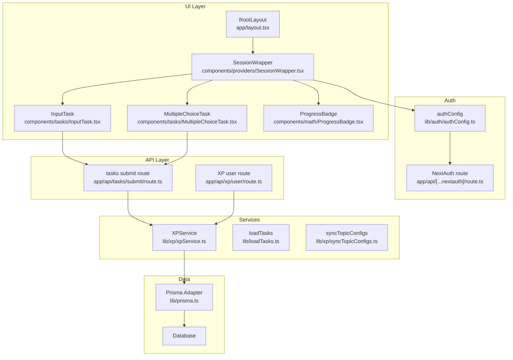
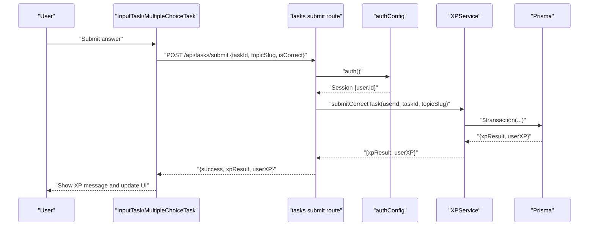
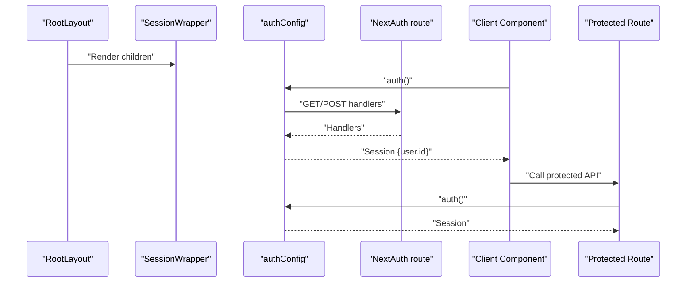
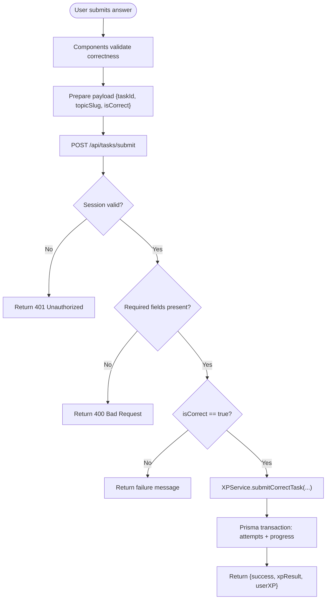
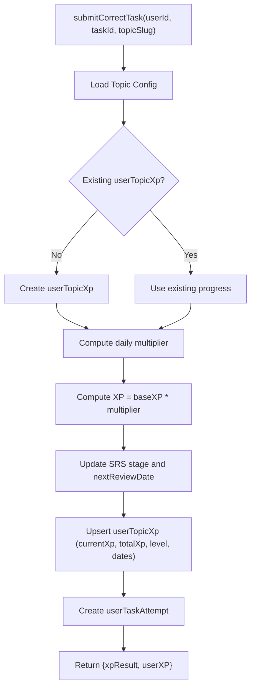
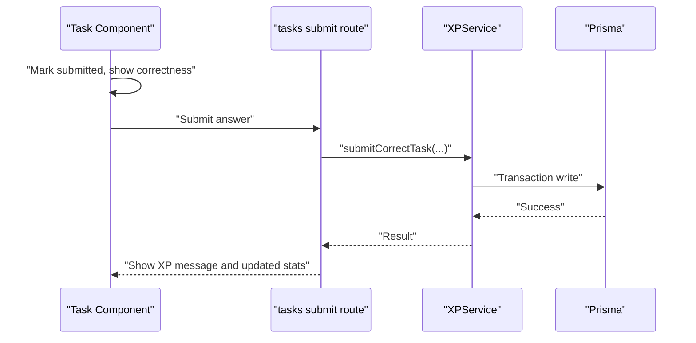
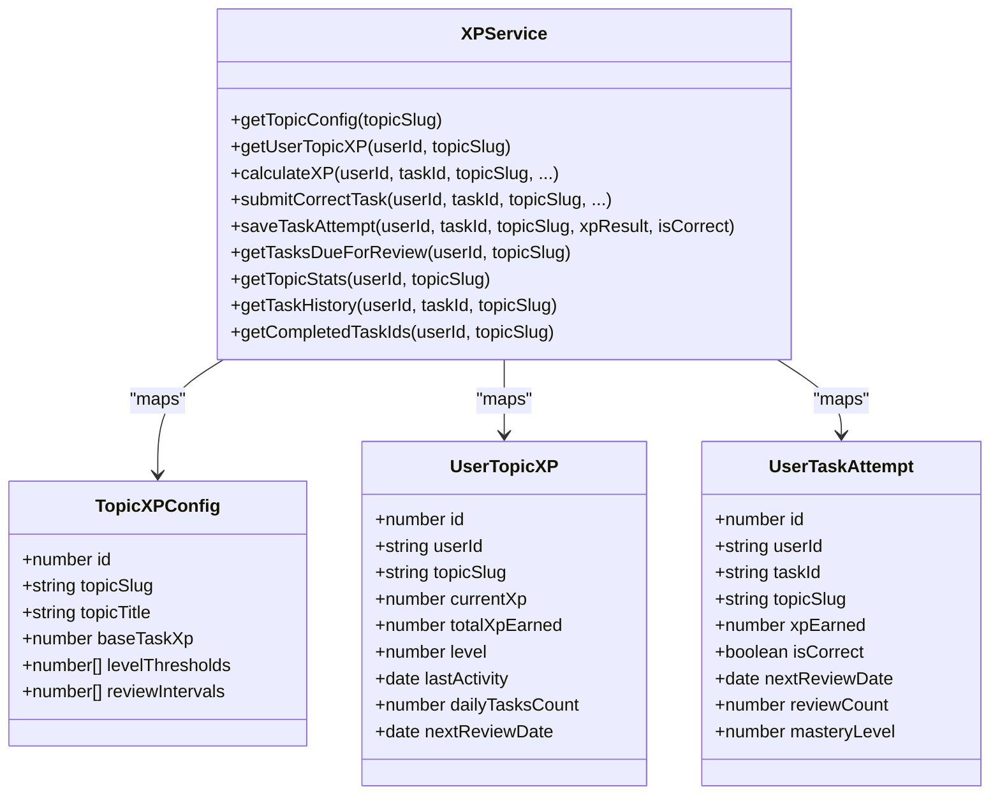
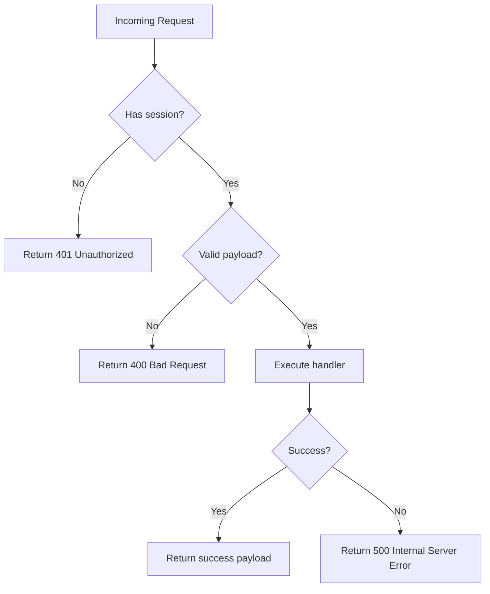
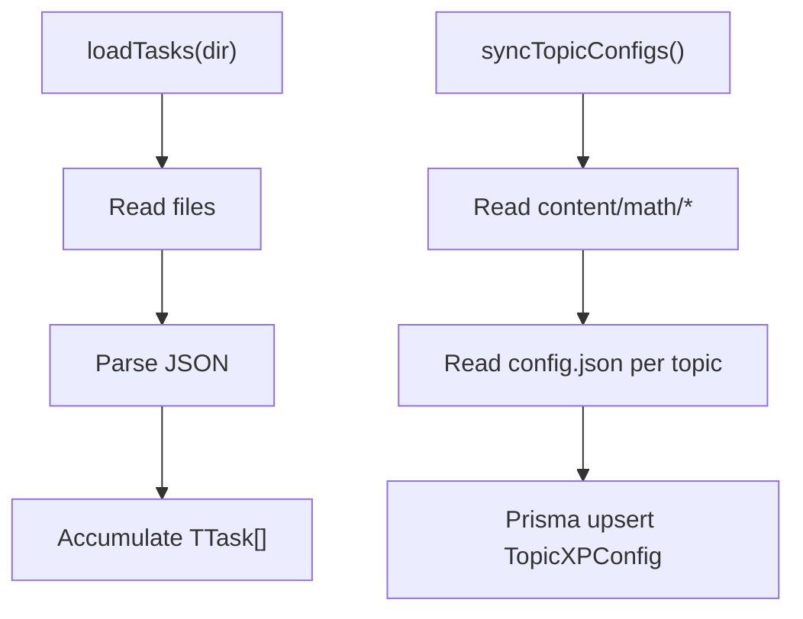
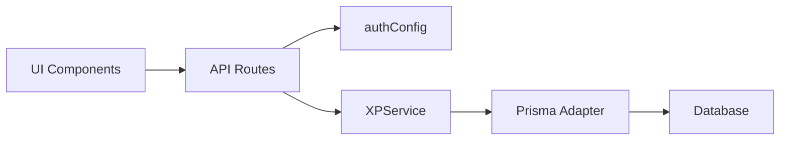

# Data Flow & State Management

<cite>
**Referenced Files in This Document**
- [RootLayout](file://app/layout.tsx)
- [SessionWrapper](file://components/providers/SessionWrapper.tsx)
- [authConfig](file://lib/auth/authConfig.ts)
- [NextAuth route](file://app/api/[...nextauth]/route.ts)
- [XPService](file://lib/xp/xpService.ts)
- [tasks submit route](file://app/api/tasks/submit/route.ts)
- [InputTask](file://components/tasks/InputTask.tsx)
- [MultipleChoiceTask](file://components/tasks/MultipleChoiceTask.tsx)
- [loadTasks](file://lib/loadTasks.ts)
- [XP user route](file://app/api/xp/user/route.ts)
- [ProgressBadge](file://components/math/ProgressBadge.tsx)
- [DashboardPage](file://app/(main)/dashboard/dashboard.tsx)
- [syncTopicConfigs](file://lib/xp/syncTopicConfigs.ts)
- [task types](file://types/task.ts)
- [xp types](file://types/xp.ts)
</cite>

## Table of Contents
1. [Introduction](#introduction)
2. [Project Structure](#project-structure)
3. [Core Components](#core-components)
4. [Architecture Overview](#architecture-overview)
5. [Detailed Component Analysis](#detailed-component-analysis)
6. [Dependency Analysis](#dependency-analysis)
7. [Performance Considerations](#performance-considerations)
8. [Troubleshooting Guide](#troubleshooting-guide)
9. [Conclusion](#conclusion)

## Introduction
This document explains the application’s state management and data handling patterns across user interactions, components, services, and database operations. It focuses on:
- The XP calculation pipeline and task submission workflow
- Real-time-like state updates and optimistic rendering
- Authentication state flow, session management, and protected routes
- Data transformation patterns, caching strategies, and error propagation
- Asynchronous data loading, optimistic updates, and conflict resolution

## Project Structure
The application is a Next.js app with a layered architecture:
- UI layer: React components under components/
- Services: Business logic under lib/
- Data access: Prisma ORM via lib/prisma.ts
- APIs: Next.js App Router API routes under app/api/
- Types: Strongly-typed models under types/

**Diagram sources**
- [RootLayout](file://app/layout.tsx#L29-L45)
- [SessionWrapper](file://components/providers/SessionWrapper.tsx#L8-L10)
- [InputTask](file://components/tasks/InputTask.tsx#L11-L34)
- [MultipleChoiceTask](file://components/tasks/MultipleChoiceTask.tsx#L11-L26)
- [ProgressBadge](file://components/math/ProgressBadge.tsx#L10-L21)
- [XPService](file://lib/xp/xpService.ts#L11-L293)
- [loadTasks](file://lib/loadTasks.ts#L5-L30)
- [syncTopicConfigs](file://lib/xp/syncTopicConfigs.ts#L10-L130)
- [authConfig](file://lib/auth/authConfig.ts#L16-L82)
- [NextAuth route](file://app/api/[...nextauth]/route.ts#L1-L4)
- [tasks submit route](file://app/api/tasks/submit/route.ts#L6-L58)
- [XP user route](file://app/api/xp/user/route.ts#L5-L40)

**Section sources**
- [RootLayout](file://app/layout.tsx#L29-L45)
- [SessionWrapper](file://components/providers/SessionWrapper.tsx#L8-L10)
- [authConfig](file://lib/auth/authConfig.ts#L16-L82)
- [NextAuth route](file://app/api/[...nextauth]/route.ts#L1-L4)

## Core Components
- Session management: Provides JWT-based sessions with NextAuth and wraps the app with SessionProvider.
- XPService: Central service orchestrating XP calculations, SRS scheduling, and persistence via Prisma transactions.
- Task components: InputTask and MultipleChoiceTask capture user answers and coordinate submission.
- API routes: Protected endpoints for task submission and XP retrieval.
- Data loaders: loadTasks reads local task JSON files; syncTopicConfigs synchronizes topic configs to the database.

Key responsibilities:
- Authentication state flow: authConfig defines providers, callbacks, and session strategy; NextAuth route exposes handlers; SessionWrapper injects session into the UI.
- State management: Components maintain local UI state (answers, submission flags) while delegating persistent state to services and database.
- Data transformations: XPService maps Prisma rows to domain types and computes derived metrics (levels, intervals).
- Error propagation: API routes return structured errors; components surface feedback to users.

**Section sources**
- [SessionWrapper](file://components/providers/SessionWrapper.tsx#L8-L10)
- [authConfig](file://lib/auth/authConfig.ts#L16-L82)
- [XPService](file://lib/xp/xpService.ts#L11-L293)
- [InputTask](file://components/tasks/InputTask.tsx#L11-L34)
- [MultipleChoiceTask](file://components/tasks/MultipleChoiceTask.tsx#L11-L26)
- [tasks submit route](file://app/api/tasks/submit/route.ts#L6-L58)
- [XP user route](file://app/api/xp/user/route.ts#L5-L40)
- [loadTasks](file://lib/loadTasks.ts#L5-L30)
- [syncTopicConfigs](file://lib/xp/syncTopicConfigs.ts#L10-L130)

## Architecture Overview
The system follows a unidirectional data flow:
- UI captures user actions (answer submission).
- Components validate inputs and prepare submission payloads.
- API routes authenticate requests, enforce authorization, and delegate to services.
- Services encapsulate business logic, compute XP and SRS updates, and persist via Prisma transactions.
- Database stores user progress, attempts, and topic configurations.
- UI reacts to responses (success/error) and updates local state accordingly.

**Diagram sources**
- [InputTask](file://components/tasks/InputTask.tsx#L24-L34)
- [MultipleChoiceTask](file://components/tasks/MultipleChoiceTask.tsx#L17-L22)
- [tasks submit route](file://app/api/tasks/submit/route.ts#L6-L58)
- [authConfig](file://lib/auth/authConfig.ts#L16-L82)
- [XPService](file://lib/xp/xpService.ts#L118-L293)

## Detailed Component Analysis

### Authentication State Flow and Protected Routes
- Session initialization: RootLayout renders SessionWrapper, which provides session context to the entire app.
- Provider configuration: authConfig sets up PrismaAdapter, JWT session strategy, providers (Google, GitHub, Credentials), and callbacks to enrich tokens/sessions with user IDs.
- Handler exposure: The NextAuth route exports GET/POST handlers for NextAuth.
- Protected endpoint: tasks submit route calls auth() to extract user ID; unauthorized requests receive 401.

**Diagram sources**
- [RootLayout](file://app/layout.tsx#L37-L41)
- [SessionWrapper](file://components/providers/SessionWrapper.tsx#L8-L10)
- [authConfig](file://lib/auth/authConfig.ts#L16-L82)
- [NextAuth route](file://app/api/[...nextauth]/route.ts#L1-L4)
- [tasks submit route](file://app/api/tasks/submit/route.ts#L8-L15)

**Section sources**
- [RootLayout](file://app/layout.tsx#L37-L41)
- [SessionWrapper](file://components/providers/SessionWrapper.tsx#L8-L10)
- [authConfig](file://lib/auth/authConfig.ts#L16-L82)
- [NextAuth route](file://app/api/[...nextauth]/route.ts#L1-L4)
- [tasks submit route](file://app/api/tasks/submit/route.ts#L8-L15)

### Task Submission Workflow
- Component-level validation: InputTask and MultipleChoiceTask compute correctness locally and notify parent via callbacks.
- Payload preparation: Components pass taskId, topicSlug, and computed isCorrect to the API.
- Endpoint enforcement: tasks submit route validates presence of required fields and rejects incorrect answers immediately.
- Service orchestration: XPService.submitCorrectTask runs inside a Prisma transaction, computing XP, SRS stage, and updating user progress and attempts.

**Diagram sources**
- [InputTask](file://components/tasks/InputTask.tsx#L24-L34)
- [MultipleChoiceTask](file://components/tasks/MultipleChoiceTask.tsx#L17-L22)
- [tasks submit route](file://app/api/tasks/submit/route.ts#L17-L47)
- [XPService](file://lib/xp/xpService.ts#L118-L293)

**Section sources**
- [InputTask](file://components/tasks/InputTask.tsx#L11-L34)
- [MultipleChoiceTask](file://components/tasks/MultipleChoiceTask.tsx#L11-L26)
- [tasks submit route](file://app/api/tasks/submit/route.ts#L6-L58)
- [XPService](file://lib/xp/xpService.ts#L118-L293)

### XP Calculation Pipeline
XPService implements two primary calculation modes:
- submitCorrectTask: Optimistic XP accrual with anti-grind daily multipliers and SRS progression within a single transaction. It also records userTaskAttempt and updates userTopicXp atomically.
- calculateXP: Alternative calculation path that considers previous attempts, scheduled reviews, and XP decay factors.

**Diagram sources**
- [XPService](file://lib/xp/xpService.ts#L118-L293)

**Section sources**
- [XPService](file://lib/xp/xpService.ts#L118-L293)

### Real-Time Data Updates and Optimistic Rendering
- Optimistic UI: Components mark submissions as submitted and show correctness feedback immediately upon user action.
- Backend reconciliation: The API returns XP results; the UI can update derived stats (e.g., level, next review date) based on returned data.
- Anti-grind safeguards: Daily multipliers prevent excessive XP farming; early reviews yield reduced XP but preserve streaks.

**Diagram sources**
- [InputTask](file://components/tasks/InputTask.tsx#L24-L34)
- [MultipleChoiceTask](file://components/tasks/MultipleChoiceTask.tsx#L17-L22)
- [tasks submit route](file://app/api/tasks/submit/route.ts#L34-L47)
- [XPService](file://lib/xp/xpService.ts#L118-L293)

**Section sources**
- [InputTask](file://components/tasks/InputTask.tsx#L11-L34)
- [MultipleChoiceTask](file://components/tasks/MultipleChoiceTask.tsx#L11-L26)
- [tasks submit route](file://app/api/tasks/submit/route.ts#L34-L47)
- [XPService](file://lib/xp/xpService.ts#L118-L293)

### Data Transformation Patterns
- Type mapping: XPService converts Prisma Decimal fields to numbers and maps rows to domain types (TopicXPConfig, UserTopicXP, UserTaskAttempt).
- Derived computations: Level computation uses sorted thresholds; SRS intervals define next review dates; daily task indices compute multipliers.
- Local-to-API payloads: Components serialize answers; API routes parse JSON and validate required fields.

**Diagram sources**
- [XPService](file://lib/xp/xpService.ts#L12-L62)
- [xp types](file://types/xp.ts#L26-L81)

**Section sources**
- [XPService](file://lib/xp/xpService.ts#L12-L62)
- [xp types](file://types/xp.ts#L26-L81)

### Caching Strategies and Asynchrony
- Local component state: Components manage transient UI state (submitted, correctness) to avoid unnecessary network calls.
- API-level caching: No explicit in-app caching is implemented; rely on client-side state and backend responses.
- Asynchronous operations: XPService uses Prisma transactions for atomicity; XP user route aggregates data concurrently using Promise.all.

Recommendations:
- Introduce lightweight in-memory caches for frequently accessed topic configs and user XP summaries.
- Debounce repeated API calls during rapid navigation or bulk operations.
- Consider SWR or React Query for standardized caching and revalidation.

**Section sources**
- [XPService](file://lib/xp/xpService.ts#L531-L603)
- [XP user route](file://app/api/xp/user/route.ts#L681-L723)

### Error Propagation Mechanisms
- Authentication: Unauthorized requests to protected endpoints return 401.
- Validation: Missing required fields return 400.
- Internal errors: Catch-all handlers return 500 with generic messages; client receives structured error payloads.
- UI feedback: Components display correctness and error messages; API responses guide success/failure messaging.

**Diagram sources**
- [tasks submit route](file://app/api/tasks/submit/route.ts#L8-L58)
- [XP user route](file://app/api/xp/user/route.ts#L7-L40)

**Section sources**
- [tasks submit route](file://app/api/tasks/submit/route.ts#L8-L58)
- [XP user route](file://app/api/xp/user/route.ts#L7-L40)

### Conflict Resolution Strategies
- Transactional writes: submitCorrectTask ensures XP and attempt records are written atomically, preventing partial state.
- Idempotency checks: The service loads existing progress and either updates or creates records, avoiding duplicates.
- SRS discipline: Early reviews do not advance SRS stages but preserve streaks; decay prevents XP inflation.

**Section sources**
- [XPService](file://lib/xp/xpService.ts#L118-L293)

### Data Loading Patterns
- Local task files: loadTasks reads JSON files from disk and parses them into TTask arrays.
- Topic configs: syncTopicConfigs synchronizes content/*/config.json files into TopicXPConfig records via Prisma upsert.
- API-driven user XP: XP user route fetches userTopicXp, topic config, and completed task IDs for the UI.

**Diagram sources**
- [loadTasks](file://lib/loadTasks.ts#L5-L30)
- [syncTopicConfigs](file://lib/xp/syncTopicConfigs.ts#L10-L130)
- [XP user route](file://app/api/xp/user/route.ts#L25-L32)

**Section sources**
- [loadTasks](file://lib/loadTasks.ts#L5-L30)
- [syncTopicConfigs](file://lib/xp/syncTopicConfigs.ts#L10-L130)
- [XP user route](file://app/api/xp/user/route.ts#L25-L32)

## Dependency Analysis
- UI depends on SessionWrapper for authentication context.
- API routes depend on authConfig for session extraction and on XPService for business logic.
- XPService depends on Prisma adapter and database for persistence.
- Task components depend on types for shape validation and on API routes for submission.

**Diagram sources**
- [SessionWrapper](file://components/providers/SessionWrapper.tsx#L8-L10)
- [authConfig](file://lib/auth/authConfig.ts#L16-L82)
- [tasks submit route](file://app/api/tasks/submit/route.ts#L4-L4)
- [XPService](file://lib/xp/xpService.ts#L1-L9)
- [RootLayout](file://app/layout.tsx#L37-L41)

**Section sources**
- [SessionWrapper](file://components/providers/SessionWrapper.tsx#L8-L10)
- [authConfig](file://lib/auth/authConfig.ts#L16-L82)
- [tasks submit route](file://app/api/tasks/submit/route.ts#L4-L4)
- [XPService](file://lib/xp/xpService.ts#L1-L9)
- [RootLayout](file://app/layout.tsx#L37-L41)

## Performance Considerations
- Prefer batch operations: Group related reads/writes to minimize round trips (e.g., XP user route aggregates stats concurrently).
- Limit payload sizes: Avoid sending unnecessary fields; the task submission route validates required fields.
- Use transactions: Keep XP updates atomic to reduce rework and improve consistency.
- Debounce rapid UI updates: Throttle frequent state changes to reduce redundant API calls.

## Troubleshooting Guide
Common issues and resolutions:
- Unauthorized access: Ensure SessionWrapper is rendered by RootLayout and that auth() is called in protected routes.
- Missing required fields: Verify components send taskId and topicSlug; API route returns 400 for missing fields.
- Incorrect answers: API route rejects non-correct submissions with a user-friendly message.
- Internal server errors: API route logs errors and returns 500; check server logs for stack traces.

**Section sources**
- [RootLayout](file://app/layout.tsx#L37-L41)
- [SessionWrapper](file://components/providers/SessionWrapper.tsx#L8-L10)
- [tasks submit route](file://app/api/tasks/submit/route.ts#L10-L32)
- [XP user route](file://app/api/xp/user/route.ts#L9-L21)

## Conclusion
The application implements a clean separation of concerns: UI components manage local state and user interactions, API routes enforce authorization and validation, and XPService encapsulates XP and SRS logic with transactional guarantees. The system supports optimistic updates, anti-grind controls, and robust error handling. Extending caching and standardized state libraries would further improve responsiveness and developer ergonomics.