# Database Design & Integration

<cite>
**Referenced Files in This Document**
- [schema.prisma](file://prisma/schema.prisma)
- [prisma.ts](file://lib/prisma.ts)
- [runMigrations.ts](file://lib/prisma/runMigrations.ts)
- [prisma.config.ts](file://prisma.config.ts)
- [instrumentation.ts](file://instrumentation.ts)
- [authConfig.ts](file://lib/auth/authConfig.ts)
- [xpService.ts](file://lib/xp/xpService.ts)
- [syncTopicConfigs.ts](file://lib/xp/syncTopicConfigs.ts)
- [route.ts (tasks submit)](file://app/api/tasks/submit/route.ts)
- [route.ts (XP user)](file://app/api/xp/user/route.ts)
- [types/xp.ts](file://types/xp.ts)
- [docker-compose.yml (Supabase)](file://database/supabase-project/docker-compose.yml)
- [docker-compose.dev.yml (Supabase Dev)](file://database/supabase-project/dev/docker-compose.dev.yml)
- [README.md](file://README.md)
- [package.json](file://package.json)
</cite>

## Update Summary
**Changes Made**
- Updated architecture overview to reflect migration from Firebase Firestore to Prisma + PostgreSQL/SUPABASE
- Added comprehensive Docker-based Supabase setup documentation with connection pooling via Supavisor
- Enhanced Prisma schema definitions with detailed table schemas and indexing strategies
- Updated migration strategies to include Supabase-specific configuration and environment variables
- Added connection pooling configuration through Supavisor proxy (port 6543)
- Expanded environment variable documentation for Supabase deployment

## Table of Contents
1. [Introduction](#introduction)
2. [Project Structure](#project-structure)
3. [Core Components](#core-components)
4. [Architecture Overview](#architecture-overview)
5. [Detailed Component Analysis](#detailed-component-analysis)
6. [Dependency Analysis](#dependency-analysis)
7. [Performance Considerations](#performance-considerations)
8. [Troubleshooting Guide](#troubleshooting-guide)
9. [Conclusion](#conclusion)
10. [Appendices](#appendices)

## Introduction
This document explains the database integration built with Prisma ORM and PostgreSQL, focusing on the entity relationship model, table schemas, data modeling decisions, and operational patterns. The system has migrated from Firebase Firestore to a modern Prisma + PostgreSQL/SUPABASE architecture with comprehensive Docker-based infrastructure. It covers how Prisma models map to TypeScript interfaces, repository-style service abstractions, transaction management, migration strategies, schema evolution, and performance considerations such as indexing and query optimization. It also outlines integration points with authentication and XP calculation APIs.

## Project Structure
The database layer centers around:
- Prisma schema defining models, enums, relations, and indexes
- A Prisma client configured with PostgreSQL adapter and connection pooling through Supavisor
- Docker-based Supabase setup with comprehensive service orchestration
- Startup hooks that run migrations and synchronize topic configurations
- Services implementing XP and task submission logic with transactions
- API routes delegating to services and returning typed responses

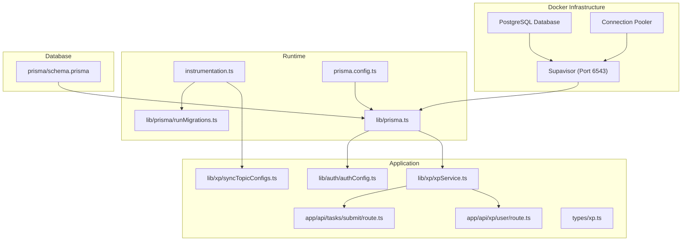

**Diagram sources**
- [docker-compose.yml (Supabase)](file://database/supabase-project/docker-compose.yml#L482-L534)
- [prisma.ts](file://lib/prisma.ts#L1-L26)
- [prisma.config.ts](file://prisma.config.ts#L1-L19)
- [runMigrations.ts](file://lib/prisma/runMigrations.ts#L1-L69)
- [schema.prisma](file://prisma/schema.prisma#L1-L143)
- [instrumentation.ts](file://instrumentation.ts#L1-L44)

**Section sources**
- [prisma.ts](file://lib/prisma.ts#L1-L26)
- [prisma.config.ts](file://prisma.config.ts#L1-L19)
- [schema.prisma](file://prisma/schema.prisma#L1-L143)
- [instrumentation.ts](file://instrumentation.ts#L1-L44)
- [docker-compose.yml (Supabase)](file://database/supabase-project/docker-compose.yml#L1-L538)

## Core Components
- Prisma client with PostgreSQL adapter and connection pooling through Supavisor proxy
- Docker-based Supabase infrastructure with comprehensive service orchestration
- Migration runner that conditionally applies migrations or pushes schema
- XP service encapsulating business logic with Prisma transactions
- Topic configuration synchronization from content to database
- API routes delegating to services and returning typed responses

Key responsibilities:
- Client initialization and lifecycle management with Supavisor connection pooling
- Schema evolution via migrations or db push
- Data consistency via transactions
- Typed interfaces bridging Prisma models and application types
- Comprehensive Docker infrastructure management

**Section sources**
- [prisma.ts](file://lib/prisma.ts#L1-L26)
- [runMigrations.ts](file://lib/prisma/runMigrations.ts#L1-L69)
- [xpService.ts](file://lib/xp/xpService.ts#L1-L902)
- [syncTopicConfigs.ts](file://lib/xp/syncTopicConfigs.ts#L1-L174)
- [types/xp.ts](file://types/xp.ts#L1-L131)
- [docker-compose.yml (Supabase)](file://database/supabase-project/docker-compose.yml#L1-L538)

## Architecture Overview
The system integrates Prisma ORM with Next.js runtime and API routes through a comprehensive Docker-based Supabase infrastructure. Authentication uses NextAuth with Prisma adapter, while XP and task submission logic is encapsulated in a service layer that performs all database operations inside transactions. The architecture leverages Supavisor for connection pooling and database proxy services.

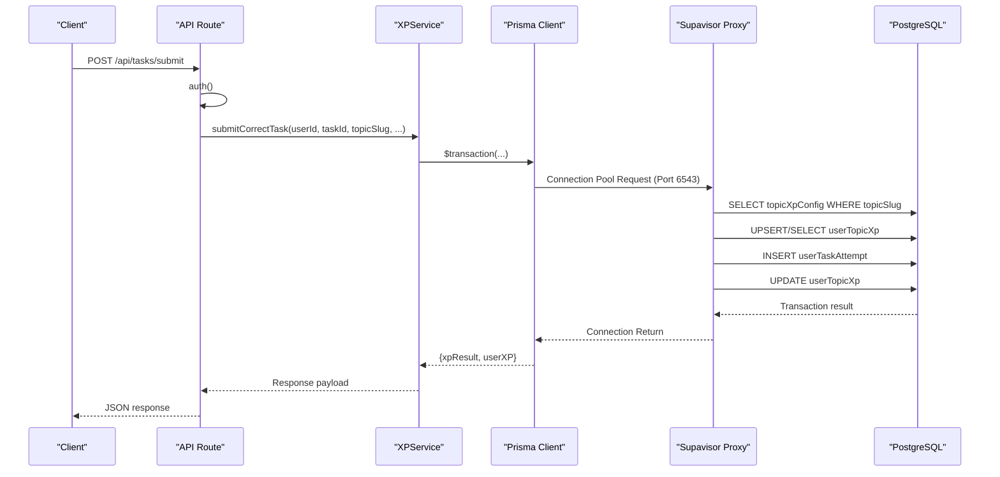

**Diagram sources**
- [route.ts (tasks submit)](file://app/api/tasks/submit/route.ts#L1-L67)
- [xpService.ts](file://lib/xp/xpService.ts#L118-L293)
- [prisma.ts](file://lib/prisma.ts#L1-L26)
- [docker-compose.yml (Supabase)](file://database/supabase-project/docker-compose.yml#L482-L534)

**Section sources**
- [authConfig.ts](file://lib/auth/authConfig.ts#L14-L14)
- [route.ts (tasks submit)](file://app/api/tasks/submit/route.ts#L1-L67)
- [xpService.ts](file://lib/xp/xpService.ts#L118-L293)
- [docker-compose.yml (Supabase)](file://database/supabase-project/docker-compose.yml#L482-L534)

## Detailed Component Analysis

### Entity Relationship Model and Table Schemas
The schema defines five core tables with explicit mappings and indexes. Relationships are declared with foreign keys and cascading deletes. The architecture supports both UUID and auto-increment primary keys with comprehensive indexing strategies.

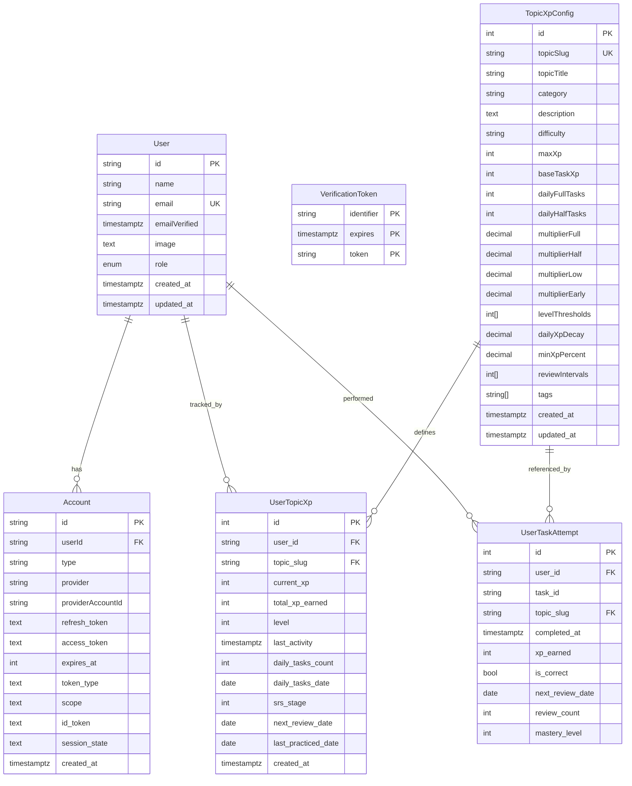

Key modeling decisions:
- UUID primary keys for User and Account for secure external references
- Unique constraints on email and (provider, providerAccountId) for identity safety
- Indexes on frequently filtered columns (user/topic combinations, next review dates)
- Decimal precision for multipliers and decay factors to avoid rounding errors
- Arrays for tags and intervals to support flexible configuration
- Comprehensive indexing strategy for performance optimization

**Diagram sources**
- [schema.prisma](file://prisma/schema.prisma#L12-L143)

**Section sources**
- [schema.prisma](file://prisma/schema.prisma#L12-L143)

### Prisma Client Initialization and Supabase Integration
The Prisma client is initialized with a PostgreSQL adapter backed by a connection pool managed through Supavisor. The system connects to Supavisor proxy (port 6543) for connection pooling, while migrations use the direct database URL (port 5432) to avoid Supavisor issues.

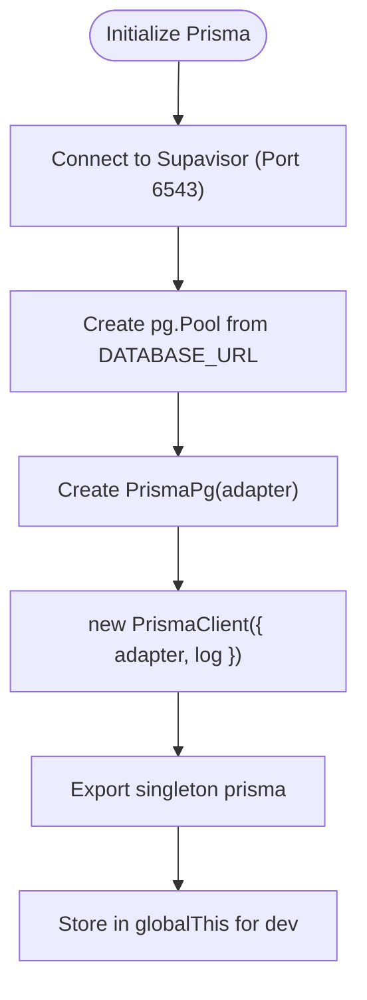

**Diagram sources**
- [prisma.ts](file://lib/prisma.ts#L1-L26)
- [docker-compose.yml (Supabase)](file://database/supabase-project/docker-compose.yml#L482-L534)

**Section sources**
- [prisma.ts](file://lib/prisma.ts#L1-L26)
- [docker-compose.yml (Supabase)](file://database/supabase-project/docker-compose.yml#L482-L534)

### Docker-Based Supabase Infrastructure
The system uses a comprehensive Docker Compose setup that orchestrates multiple Supabase services including PostgreSQL, authentication, real-time, storage, and connection pooling. The infrastructure supports development and production environments with extensive customization options.

Key infrastructure components:
- **PostgreSQL Database**: Primary database with custom configurations and extensions
- **Supavisor (Pooler)**: Connection pooling service on port 6543
- **Studio**: Web-based database administration interface
- **Auth (GoTrue)**: Authentication service with multiple provider support
- **Realtime**: Real-time database change notifications
- **Storage**: Object storage with image transformation capabilities
- **Functions**: Edge runtime for serverless functions
- **Analytics**: Log aggregation and analytics platform

**Section sources**
- [docker-compose.yml (Supabase)](file://database/supabase-project/docker-compose.yml#L1-L538)
- [docker-compose.dev.yml (Supabase Dev)](file://database/supabase-project/dev/docker-compose.dev.yml#L1-L45)

### Migration Strategies and Schema Evolution
Schema evolution is handled at startup with Supabase-specific considerations:
- Production: migrations deployed via migrate deploy using DIRECT_URL
- Development: db push used when no migrations exist
- Fallback: on failure, db push is attempted in development
- Best-effort: failures are logged but do not crash the app
- Supabase compatibility: DIRECT_URL bypasses Supavisor for migration operations

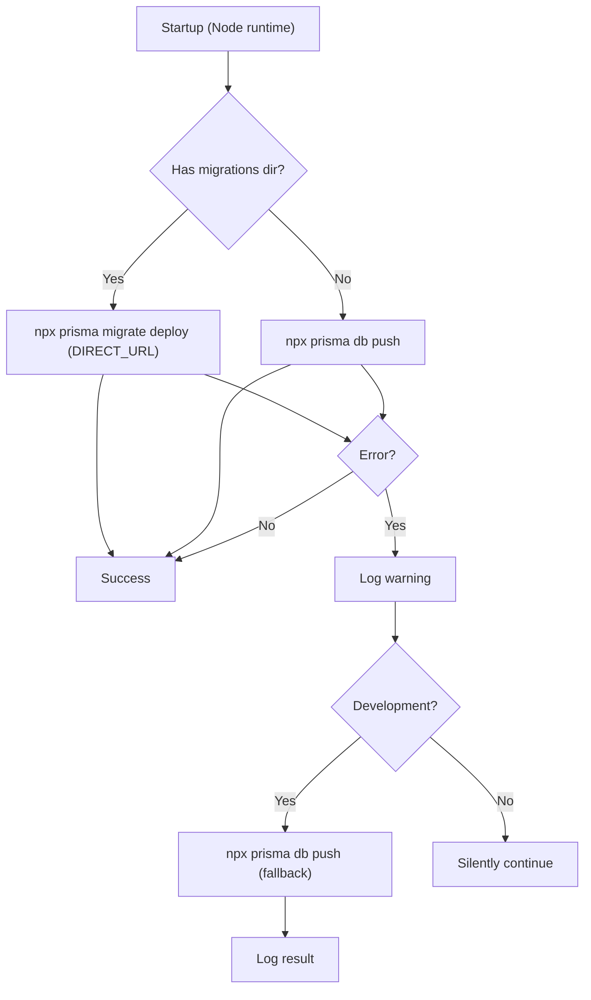

**Diagram sources**
- [runMigrations.ts](file://lib/prisma/runMigrations.ts#L1-L69)
- [instrumentation.ts](file://instrumentation.ts#L1-L44)
- [prisma.config.ts](file://prisma.config.ts#L16-L18)

**Section sources**
- [runMigrations.ts](file://lib/prisma/runMigrations.ts#L1-L69)
- [instrumentation.ts](file://instrumentation.ts#L1-L44)
- [prisma.config.ts](file://prisma.config.ts#L16-L18)

### Topic Configuration Synchronization
Topic configurations are synchronized from content files into TopicXpConfig during startup or on demand. Upserts ensure idempotent updates keyed by topicSlug with comprehensive error handling.

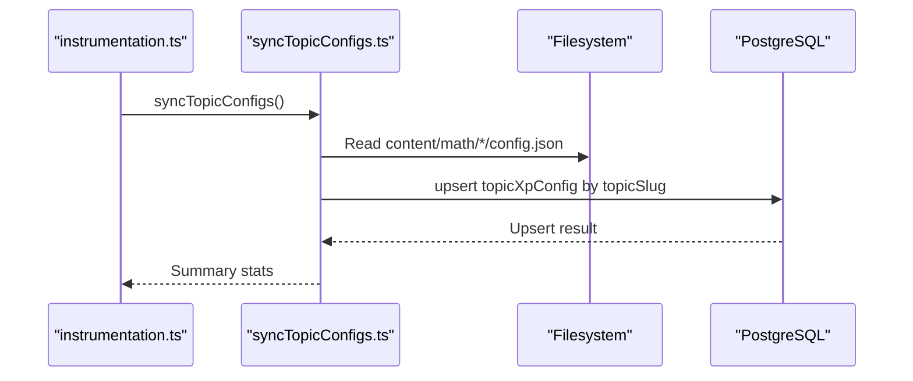

**Diagram sources**
- [instrumentation.ts](file://instrumentation.ts#L21-L42)
- [syncTopicConfigs.ts](file://lib/xp/syncTopicConfigs.ts#L1-L174)
- [schema.prisma](file://prisma/schema.prisma#L70-L97)

**Section sources**
- [README.md](file://README.md#L41-L49)
- [syncTopicConfigs.ts](file://lib/xp/syncTopicConfigs.ts#L1-L174)

### XP Service and Transaction Management
The XP service encapsulates XP calculations, SRS scheduling, and persistence. All writes are performed inside Prisma transactions to guarantee atomicity. The service handles complex XP calculations with anti-grind protection and SRS scheduling algorithms.

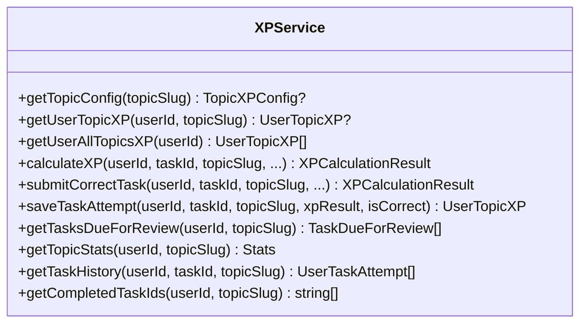

Key transactional operations:
- submitCorrectTask: reads config, ensures user topic XP exists, computes XP and SRS, persists attempt and updates user XP atomically
- saveTaskAttempt: creates or updates user XP and persists attempt in a single transaction

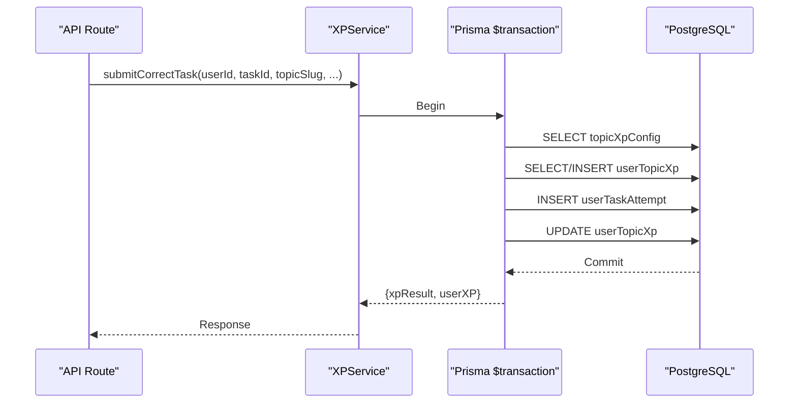

**Diagram sources**
- [xpService.ts](file://lib/xp/xpService.ts#L118-L293)
- [route.ts (tasks submit)](file://app/api/tasks/submit/route.ts#L34-L47)

**Section sources**
- [xpService.ts](file://lib/xp/xpService.ts#L118-L293)
- [route.ts (tasks submit)](file://app/api/tasks/submit/route.ts#L1-L67)

### API Routes and Typed Interfaces
API routes delegate to services and return typed responses. TypeScript interfaces define the shape of requests, responses, and domain entities with comprehensive type safety.

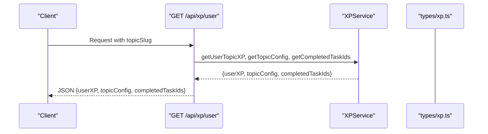

**Diagram sources**
- [route.ts (XP user)](file://app/api/xp/user/route.ts#L1-L41)
- [types/xp.ts](file://types/xp.ts#L26-L131)
- [xpService.ts](file://lib/xp/xpService.ts#L313-L371)

**Section sources**
- [route.ts (XP user)](file://app/api/xp/user/route.ts#L1-L41)
- [types/xp.ts](file://types/xp.ts#L1-L131)

### Authentication Integration
NextAuth uses PrismaAdapter to persist sessions and user identities. The adapter leverages the same Prisma client, ensuring consistent database access across the entire application stack.

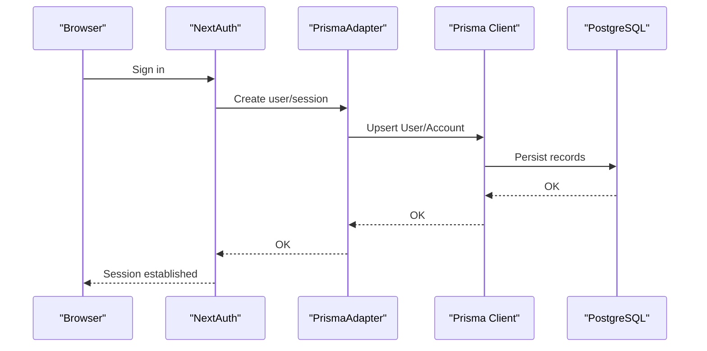

**Diagram sources**
- [authConfig.ts](file://lib/auth/authConfig.ts#L14-L14)
- [prisma.ts](file://lib/prisma.ts#L1-L26)

**Section sources**
- [authConfig.ts](file://lib/auth/authConfig.ts#L1-L83)

## Dependency Analysis
External dependencies relevant to database integration:
- @prisma/client and @prisma/adapter-pg for ORM and PostgreSQL adapter
- pg for connection pooling
- Prisma CLI for migrations and schema generation
- Supabase ecosystem for infrastructure management

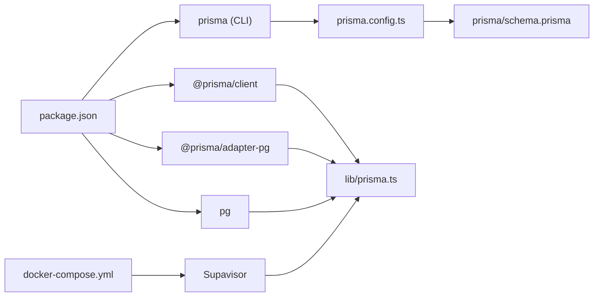

**Diagram sources**
- [package.json](file://package.json#L16-L43)
- [prisma.config.ts](file://prisma.config.ts#L1-L19)
- [schema.prisma](file://prisma/schema.prisma#L1-L143)
- [prisma.ts](file://lib/prisma.ts#L1-L26)
- [docker-compose.yml (Supabase)](file://database/supabase-project/docker-compose.yml#L1-L538)

**Section sources**
- [package.json](file://package.json#L16-L43)

## Performance Considerations
Indexing strategy:
- Composite indexes on user-topic combinations for frequent joins
- Dedicated indexes on nextReviewDate for SRS scheduling queries
- Unique constraints on identity fields to enforce referential integrity efficiently
- Supavisor connection pooling reduces connection overhead

Query optimization:
- Use of include/select to limit fetched fields
- Aggregation queries for statistics
- Distinct and grouped queries to reduce result sets
- Connection pooling through Supavisor improves concurrent query performance

Transaction management:
- Atomic updates for XP accumulation and SRS progression
- Upsert patterns to avoid race conditions
- Supabisor transaction mode configuration for optimal performance

## Troubleshooting Guide
Common issues and mitigations:
- Database unreachable at startup: migrations are skipped with warnings; verify environment variables and connectivity
- Supavisor connection issues: ensure port 6543 is accessible and connection pooling is properly configured
- Missing migrations: db push is used as a fallback in development; consider generating migrations for production
- Authentication failures: ensure PrismaAdapter is configured with the same client used elsewhere
- Slow SRS queries: confirm indexes exist on nextReviewDate and user/topic keys
- Docker infrastructure issues: verify all Supabase services are healthy and properly configured

Operational checks:
- Verify DATABASE_URL construction and environment variables
- Confirm Prisma client exports and global singleton behavior
- Validate API routes return proper status codes and error messages
- Monitor Supavisor health and connection pool metrics
- Check Docker Compose service dependencies and health checks

**Section sources**
- [runMigrations.ts](file://lib/prisma/runMigrations.ts#L45-L67)
- [authConfig.ts](file://lib/auth/authConfig.ts#L14-L14)
- [schema.prisma](file://prisma/schema.prisma#L118-L141)
- [docker-compose.yml (Supabase)](file://database/supabase-project/docker-compose.yml#L482-L534)

## Conclusion
The database integration leverages Prisma ORM with a PostgreSQL adapter, comprehensive Docker-based Supabase infrastructure, and robust startup migrations. The system utilizes Supavisor for connection pooling and provides a scalable foundation for the XP and task management system. Transactions ensure data consistency, while indexes and careful query design support performance. The system balances flexibility (db push in development) with reliability (migrations in production) and provides clear typed interfaces between models and application logic.

## Appendices

### Appendix A: Environment Variables
Required variables for database and authentication:
- Database: AUTH_DATABASE_HOST, AUTH_DATABASE_PORT, AUTH_DATABASE_NAME, AUTH_DATABASE_USER, AUTH_DATABASE_PASSWORD
- Authentication: AUTH_SECRET, provider-specific credentials
- Supavisor: POOLER_DEFAULT_POOL_SIZE, POOLER_MAX_CLIENT_CONN, POOLER_DB_POOL_SIZE
- Optional toggles: RUN_MIGRATIONS_ON_START, SYNC_TOPICS_ON_START

**Section sources**
- [README.md](file://README.md#L30-L39)
- [instrumentation.ts](file://instrumentation.ts#L12-L22)
- [docker-compose.yml (Supabase)](file://database/supabase-project/docker-compose.yml#L511-L528)

### Appendix B: Supabase Service Configuration
Key Supabase services and their purposes:
- **db**: PostgreSQL database with custom configurations and extensions
- **supavisor**: Connection pooling service on port 6543
- **studio**: Web-based database administration interface
- **auth**: Authentication service with multiple provider support
- **realtime**: Real-time database change notifications
- **storage**: Object storage with image transformation capabilities
- **functions**: Edge runtime for serverless functions
- **analytics**: Log aggregation and analytics platform

**Section sources**
- [docker-compose.yml (Supabase)](file://database/supabase-project/docker-compose.yml#L10-L538)
- [docker-compose.dev.yml (Supabase Dev)](file://database/supabase-project/dev/docker-compose.dev.yml#L1-L45)