# Database Design & Integration

<cite>
**Referenced Files in This Document**
- [schema.prisma](file://prisma/schema.prisma)
- [prisma.ts](file://lib/prisma.ts)
- [runMigrations.ts](file://lib/prisma/runMigrations.ts)
- [prisma.config.ts](file://prisma.config.ts)
- [instrumentation.ts](file://instrumentation.ts)
- [authConfig.ts](file://lib/auth/authConfig.ts)
- [xpService.ts](file://lib/xp/xpService.ts)
- [syncTopicConfigs.ts](file://lib/xp/syncTopicConfigs.ts)
- [route.ts (tasks submit)](file://app/api/tasks/submit/route.ts)
- [route.ts (XP user)](file://app/api/xp/user/route.ts)
- [types/xp.ts](file://types/xp.ts)
- [README.md](file://README.md)
- [package.json](file://package.json)
</cite>

## Table of Contents
1. [Introduction](#introduction)
2. [Project Structure](#project-structure)
3. [Core Components](#core-components)
4. [Architecture Overview](#architecture-overview)
5. [Detailed Component Analysis](#detailed-component-analysis)
6. [Dependency Analysis](#dependency-analysis)
7. [Performance Considerations](#performance-considerations)
8. [Troubleshooting Guide](#troubleshooting-guide)
9. [Conclusion](#conclusion)
10. [Appendices](#appendices)

## Introduction
This document explains the database integration built with Prisma ORM and PostgreSQL, focusing on the entity relationship model, table schemas, data modeling decisions, and operational patterns. It covers how Prisma models map to TypeScript interfaces, repository-style service abstractions, transaction management, migration strategies, schema evolution, and performance considerations such as indexing and query optimization. It also outlines integration points with authentication and XP calculation APIs.

## Project Structure
The database layer centers around:
- Prisma schema defining models, enums, relations, and indexes
- A Prisma client configured with a PostgreSQL adapter and connection pooling
- Startup hooks that run migrations and synchronize topic configurations
- Services implementing XP and task submission logic with transactions
- API routes delegating to services and returning typed responses

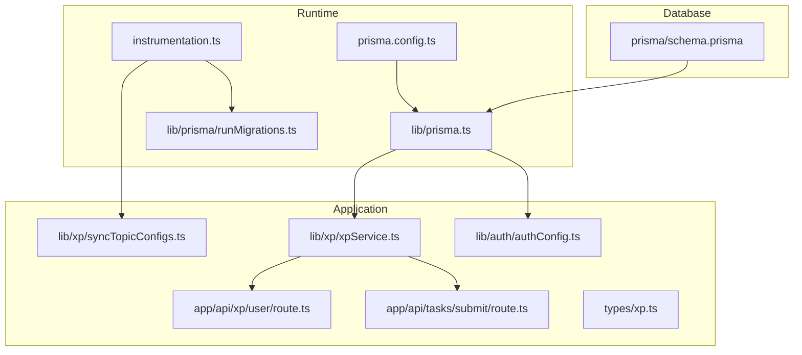

**Diagram sources**
- [instrumentation.ts](file://instrumentation.ts#L1-L43)
- [prisma.config.ts](file://prisma.config.ts#L1-L19)
- [prisma.ts](file://lib/prisma.ts#L1-L29)
- [runMigrations.ts](file://lib/prisma/runMigrations.ts#L1-L69)
- [schema.prisma](file://prisma/schema.prisma#L1-L143)
- [authConfig.ts](file://lib/auth/authConfig.ts#L1-L83)
- [syncTopicConfigs.ts](file://lib/xp/syncTopicConfigs.ts#L1-L174)
- [xpService.ts](file://lib/xp/xpService.ts#L1-L795)
- [route.ts (tasks submit)](file://app/api/tasks/submit/route.ts#L1-L59)
- [route.ts (XP user)](file://app/api/xp/user/route.ts#L1-L41)
- [types/xp.ts](file://types/xp.ts#L1-L131)

**Section sources**
- [prisma.ts](file://lib/prisma.ts#L1-L29)
- [prisma.config.ts](file://prisma.config.ts#L1-L19)
- [schema.prisma](file://prisma/schema.prisma#L1-L143)
- [instrumentation.ts](file://instrumentation.ts#L1-L43)

## Core Components
- Prisma client with PostgreSQL adapter and connection pooling
- Migration runner that conditionally applies migrations or pushes schema
- XP service encapsulating business logic with Prisma transactions
- Topic configuration synchronization from content to database
- API routes delegating to services and returning typed responses

Key responsibilities:
- Client initialization and lifecycle management
- Schema evolution via migrations or db push
- Data consistency via transactions
- Typed interfaces bridging Prisma models and application types

**Section sources**
- [prisma.ts](file://lib/prisma.ts#L1-L29)
- [runMigrations.ts](file://lib/prisma/runMigrations.ts#L1-L69)
- [xpService.ts](file://lib/xp/xpService.ts#L1-L795)
- [syncTopicConfigs.ts](file://lib/xp/syncTopicConfigs.ts#L1-L174)
- [types/xp.ts](file://types/xp.ts#L1-L131)

## Architecture Overview
The system integrates Prisma ORM with Next.js runtime and API routes. Authentication uses NextAuth with Prisma adapter, while XP and task submission logic is encapsulated in a service layer that performs all database operations inside transactions.

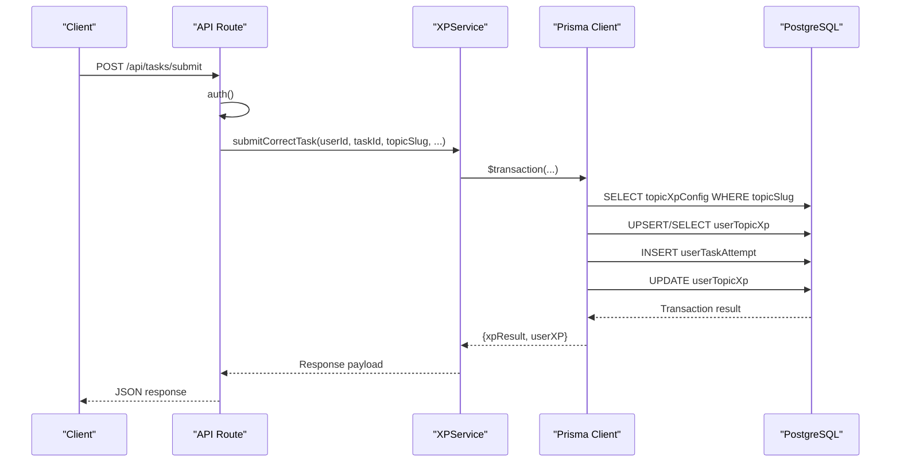

**Diagram sources**
- [route.ts (tasks submit)](file://app/api/tasks/submit/route.ts#L1-L59)
- [xpService.ts](file://lib/xp/xpService.ts#L118-L293)
- [prisma.ts](file://lib/prisma.ts#L1-L29)

**Section sources**
- [authConfig.ts](file://lib/auth/authConfig.ts#L14-L14)
- [route.ts (tasks submit)](file://app/api/tasks/submit/route.ts#L1-L59)
- [xpService.ts](file://lib/xp/xpService.ts#L118-L293)

## Detailed Component Analysis

### Entity Relationship Model and Table Schemas
The schema defines five core tables with explicit mappings and indexes. Relationships are declared with foreign keys and cascading deletes.

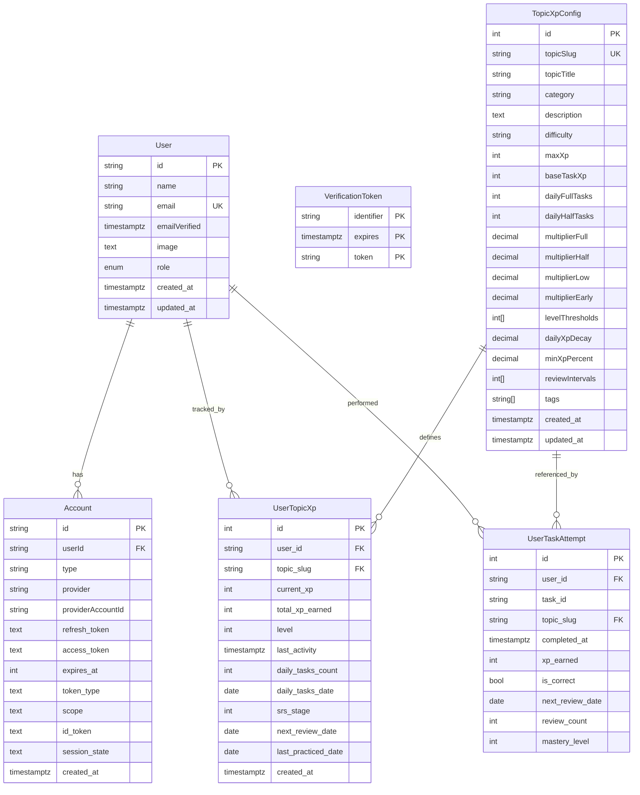

Key modeling decisions:
- UUID primary keys for User and Account for secure external references
- Unique constraints on email and (provider, providerAccountId) for identity safety
- Indexes on frequently filtered columns (user/topic combinations, next review dates)
- Decimal precision for multipliers and decay factors to avoid rounding errors
- Arrays for tags and intervals to support flexible configuration

**Diagram sources**
- [schema.prisma](file://prisma/schema.prisma#L12-L143)

**Section sources**
- [schema.prisma](file://prisma/schema.prisma#L12-L143)

### Prisma Client Initialization and Adapter
The Prisma client is initialized with a PostgreSQL adapter backed by a connection pool. Environment variables configure host, port, user, password, and database name. The client is exported globally to avoid multiple instances and is configured with minimal logging.

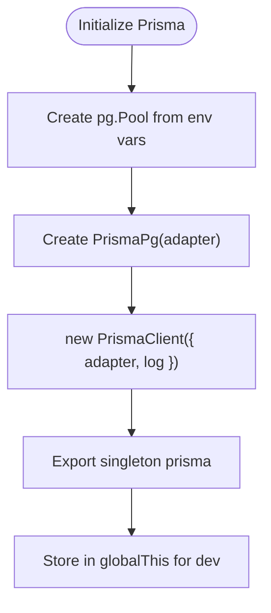

**Diagram sources**
- [prisma.ts](file://lib/prisma.ts#L1-L29)

**Section sources**
- [prisma.ts](file://lib/prisma.ts#L1-L29)

### Migration Strategies and Schema Evolution
Schema evolution is handled at startup:
- Production: migrations deployed via migrate deploy
- Development: db push used when no migrations exist
- Fallback: on failure, db push is attempted in development
- Best-effort: failures are logged but do not crash the app

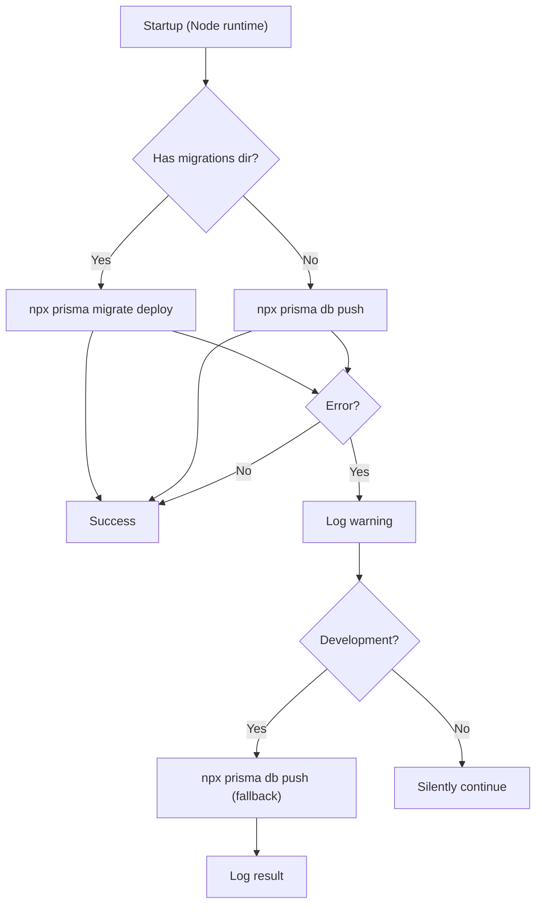

**Diagram sources**
- [runMigrations.ts](file://lib/prisma/runMigrations.ts#L1-L69)
- [instrumentation.ts](file://instrumentation.ts#L1-L43)

**Section sources**
- [runMigrations.ts](file://lib/prisma/runMigrations.ts#L1-L69)
- [instrumentation.ts](file://instrumentation.ts#L1-L43)

### Topic Configuration Synchronization
Topic configurations are synchronized from content files into TopicXpConfig during startup or on demand. Upserts ensure idempotent updates keyed by topicSlug.

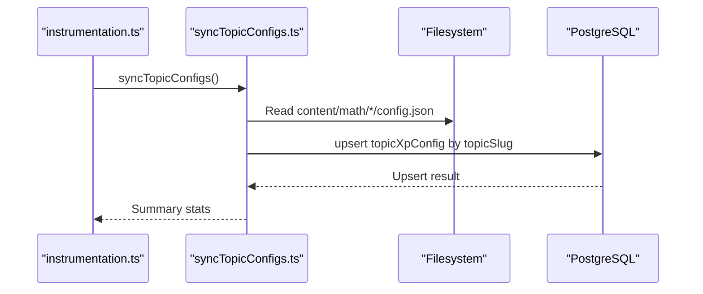

**Diagram sources**
- [instrumentation.ts](file://instrumentation.ts#L21-L42)
- [syncTopicConfigs.ts](file://lib/xp/syncTopicConfigs.ts#L1-L174)
- [schema.prisma](file://prisma/schema.prisma#L70-L97)

**Section sources**
- [README.md](file://README.md#L41-L49)
- [syncTopicConfigs.ts](file://lib/xp/syncTopicConfigs.ts#L1-L174)

### XP Service and Transaction Management
The XP service encapsulates XP calculations, SRS scheduling, and persistence. All writes are performed inside Prisma transactions to guarantee atomicity.

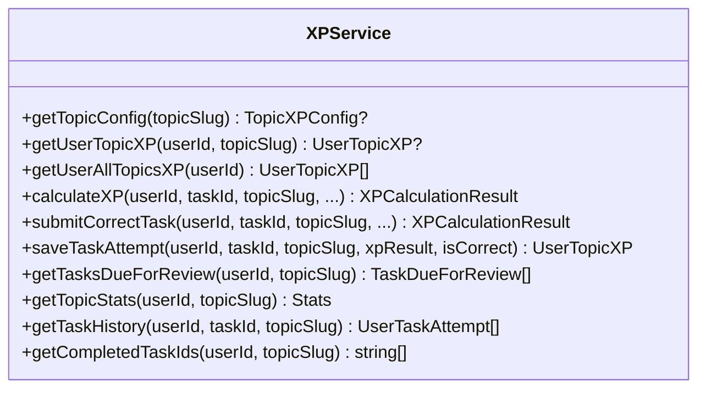

Key transactional operations:
- submitCorrectTask: reads config, ensures user topic XP exists, computes XP and SRS, persists attempt and updates user XP atomically
- saveTaskAttempt: creates or updates user XP and persists attempt in a single transaction

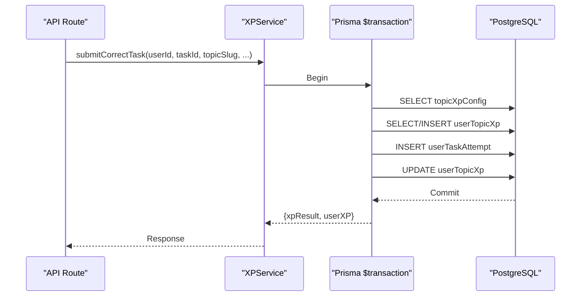

**Diagram sources**
- [xpService.ts](file://lib/xp/xpService.ts#L118-L293)
- [route.ts (tasks submit)](file://app/api/tasks/submit/route.ts#L34-L47)

**Section sources**
- [xpService.ts](file://lib/xp/xpService.ts#L118-L293)
- [route.ts (tasks submit)](file://app/api/tasks/submit/route.ts#L1-L59)

### API Routes and Typed Interfaces
API routes delegate to services and return typed responses. TypeScript interfaces define the shape of requests, responses, and domain entities.

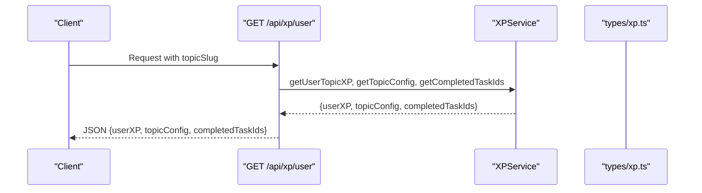

**Diagram sources**
- [route.ts (XP user)](file://app/api/xp/user/route.ts#L1-L41)
- [types/xp.ts](file://types/xp.ts#L26-L131)
- [xpService.ts](file://lib/xp/xpService.ts#L313-L371)

**Section sources**
- [route.ts (XP user)](file://app/api/xp/user/route.ts#L1-L41)
- [types/xp.ts](file://types/xp.ts#L1-L131)

### Authentication Integration
NextAuth uses PrismaAdapter to persist sessions and user identities. The adapter leverages the same Prisma client, ensuring consistent database access.

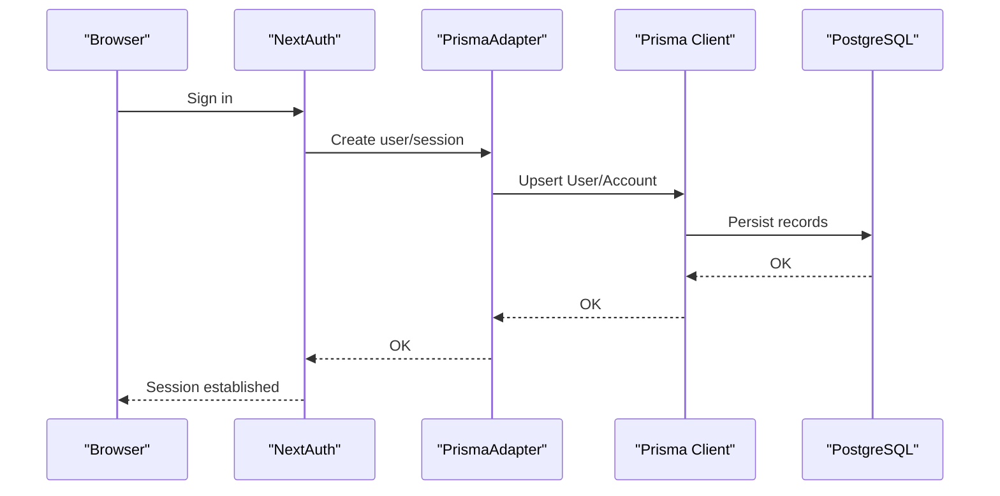

**Diagram sources**
- [authConfig.ts](file://lib/auth/authConfig.ts#L14-L14)
- [prisma.ts](file://lib/prisma.ts#L1-L29)

**Section sources**
- [authConfig.ts](file://lib/auth/authConfig.ts#L1-L83)

## Dependency Analysis
External dependencies relevant to database integration:
- @prisma/client and @prisma/adapter-pg for ORM and PostgreSQL adapter
- pg for connection pooling
- Prisma CLI for migrations and schema generation

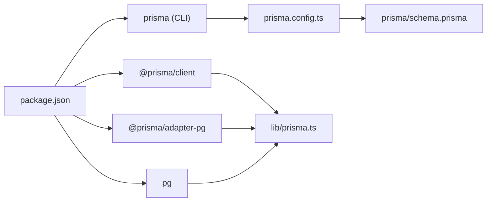

**Diagram sources**
- [package.json](file://package.json#L16-L43)
- [prisma.config.ts](file://prisma.config.ts#L1-L19)
- [schema.prisma](file://prisma/schema.prisma#L1-L143)
- [prisma.ts](file://lib/prisma.ts#L1-L29)

**Section sources**
- [package.json](file://package.json#L16-L43)

## Performance Considerations
Indexing strategy:
- Composite indexes on user-topic combinations for frequent joins
- Dedicated indexes on nextReviewDate for SRS scheduling queries
- Unique constraints on identity fields to enforce referential integrity efficiently

Query optimization:
- Use of include/select to limit fetched fields
- Aggregation queries for statistics
- Distinct and grouped queries to reduce result sets

Transaction management:
- Atomic updates for XP accumulation and SRS progression
- Upsert patterns to avoid race conditions

[No sources needed since this section provides general guidance]

## Troubleshooting Guide
Common issues and mitigations:
- Database unreachable at startup: migrations are skipped with warnings; verify environment variables and connectivity
- Missing migrations: db push is used as a fallback in development; consider generating migrations for production
- Authentication failures: ensure PrismaAdapter is configured with the same client used elsewhere
- Slow SRS queries: confirm indexes exist on nextReviewDate and user/topic keys

Operational checks:
- Verify DATABASE_URL construction and environment variables
- Confirm Prisma client exports and global singleton behavior
- Validate API routes return proper status codes and error messages

**Section sources**
- [runMigrations.ts](file://lib/prisma/runMigrations.ts#L45-L67)
- [authConfig.ts](file://lib/auth/authConfig.ts#L14-L14)
- [schema.prisma](file://prisma/schema.prisma#L118-L141)

## Conclusion
The database integration leverages Prisma ORM with a PostgreSQL adapter, robust startup migrations, and a service-layer abstraction for XP and task operations. Transactions ensure data consistency, while indexes and careful query design support performance. The system balances flexibility (db push in development) with reliability (migrations in production) and provides clear typed interfaces between models and application logic.

[No sources needed since this section summarizes without analyzing specific files]

## Appendices

### Appendix A: Environment Variables
Required variables for database and authentication:
- Database: AUTH_DATABASE_HOST, AUTH_DATABASE_PORT, AUTH_DATABASE_NAME, AUTH_DATABASE_USER, AUTH_DATABASE_PASSWORD
- Authentication: AUTH_SECRET, provider-specific credentials
- Optional toggles: RUN_MIGRATIONS_ON_START, SYNC_TOPICS_ON_START

**Section sources**
- [README.md](file://README.md#L30-L39)
- [instrumentation.ts](file://instrumentation.ts#L12-L22)