# Database Design & Integration

<cite>
**Referenced Files in This Document**
- [schema.prisma](file://prisma/schema.prisma)
- [prisma.ts](file://lib/prisma.ts)
- [runMigrations.ts](file://lib/prisma/runMigrations.ts)
- [prisma.config.ts](file://prisma.config.ts)
- [instrumentation.ts](file://instrumentation.ts)
- [authConfig.ts](file://lib/auth/authConfig.ts)
- [xpService.ts](file://lib/xp/xpService.ts)
- [syncTopicConfigs.ts](file://lib/xp/syncTopicConfigs.ts)
- [route.ts (tasks submit)](file://app/api/tasks/submit/route.ts)
- [route.ts (XP user)](file://app/api/xp/user/route.ts)
- [types/xp.ts](file://types/xp.ts)
- [docker-compose.yml (Supabase)](file://database/supabase-project/docker-compose.yml)
- [docker-compose.dev.yml (Supabase Dev)](file://database/supabase-project/dev/docker-compose.dev.yml)
- [.env (Supabase)](file://database/supabase-project/.env)
- [README.md](file://README.md)
- [package.json](file://package.json)
- [generate-keys.sh](file://database/supabase-project/utils/generate-keys.sh)
- [db-passwd.sh](file://database/supabase-project/utils/db-passwd.sh)
- [20260130185755_add_user_answer/migration.sql](file://prisma/migrations/20260130185755_add_user_answer/migration.sql)
- [20260131171720_add_lesson_completed_to_user_topic_xp/migration.sql](file://prisma/migrations/20260131171720_add_lesson_completed_to_user_topic_xp/migration.sql)
</cite>

## Update Summary
**Changes Made**
- Enhanced database schema with new user answer tracking capability in UserTaskAttempt table
- Added lesson completion tracking field to UserTopicXp table for comprehensive learning progress monitoring
- Improved Prisma migration system with structured migration files for better schema evolution control
- Updated XP service to handle user answer persistence and retrieval for enhanced analytics
- Enhanced API endpoints to support user answer capture and lesson completion data

## Table of Contents
1. [Introduction](#introduction)
2. [Project Structure](#project-structure)
3. [Core Components](#core-components)
4. [Architecture Overview](#architecture-overview)
5. [Detailed Component Analysis](#detailed-component-analysis)
6. [Enhanced Database Schema](#enhanced-database-schema)
7. [User Answer Tracking System](#user-answer-tracking-system)
8. [Lesson Completion Monitoring](#lesson-completion-monitoring)
9. [Improved Prisma Migration System](#improved-prisma-migration-system)
10. [Environment Configuration & Security](#environment-configuration--security)
11. [Dependency Analysis](#dependency-analysis)
12. [Performance Considerations](#performance-considerations)
13. [Troubleshooting Guide](#troubleshooting-guide)
14. [Conclusion](#conclusion)
15. [Appendices](#appendices)

## Introduction
This document explains the database integration built with Prisma ORM and PostgreSQL, focusing on the entity relationship model, table schemas, data modeling decisions, and operational patterns. The system has migrated from Firebase Firestore to a modern Prisma + PostgreSQL/SUPABASE architecture with comprehensive Docker-based infrastructure. It covers how Prisma models map to TypeScript interfaces, repository-style service abstractions, transaction management, migration strategies, schema evolution, and performance considerations such as indexing and query optimization. It also outlines integration points with authentication and XP calculation APIs.

**Updated** Enhanced with new user answer tracking capabilities and lesson completion monitoring for comprehensive learning analytics and progress tracking.

## Project Structure
The database layer centers around:
- Prisma schema defining models, enums, relations, and indexes
- A Prisma client configured with PostgreSQL adapter and connection pooling through Supavisor
- Docker-based Supabase setup with comprehensive service orchestration
- Startup hooks that run migrations and synchronize topic configurations
- Services implementing XP and task submission logic with transactions
- API routes delegating to services and returning typed responses

```mermaid
graph TB
subgraph "Docker Infrastructure"
SUPAVISOR["Supavisor (Port 6543)"]
DB["PostgreSQL Database"]
POOLER["Connection Pooler"]
end
subgraph "Runtime"
INST["instrumentation.ts"]
PRISMA_CFG["prisma.config.ts"]
PRISMA_TS["lib/prisma.ts"]
RUN_MIGR["lib/prisma/runMigrations.ts"]
END
subgraph "Database"
SCHEMA["prisma/schema.prisma"]
MIGRATIONS["prisma/migrations/"]
end
subgraph "Application"
AUTH["lib/auth/authConfig.ts"]
SYNC["lib/xp/syncTopicConfigs.ts"]
XP["lib/xp/xpService.ts"]
API_TASK["app/api/tasks/submit/route.ts"]
API_XP["app/api/xp/user/route.ts"]
TYPES["types/xp.ts"]
end
INST --> RUN_MIGR
INST --> SYNC
PRISMA_CFG --> PRISMA_TS
PRISMA_TS --> AUTH
PRISMA_TS --> XP
XP --> API_TASK
XP --> API_XP
SCHEMA --> PRISMA_TS
MIGRATIONS --> RUN_MIGR
SUPAVISOR --> PRISMA_TS
DB --> SUPAVISOR
POOLER --> SUPAVISOR
```

**Diagram sources**
- [docker-compose.yml (Supabase)](file://database/supabase-project/docker-compose.yml#L482-L534)
- [prisma.ts](file://lib/prisma.ts#L1-L26)
- [prisma.config.ts](file://prisma.config.ts#L1-L19)
- [runMigrations.ts](file://lib/prisma/runMigrations.ts#L1-L69)
- [schema.prisma](file://prisma/schema.prisma#L1-L144)
- [instrumentation.ts](file://instrumentation.ts#L1-L44)

**Section sources**
- [prisma.ts](file://lib/prisma.ts#L1-L26)
- [prisma.config.ts](file://prisma.config.ts#L1-L19)
- [schema.prisma](file://prisma/schema.prisma#L1-L144)
- [instrumentation.ts](file://instrumentation.ts#L1-L44)
- [docker-compose.yml (Supabase)](file://database/supabase-project/docker-compose.yml#L1-L538)

## Core Components
- Prisma client with PostgreSQL adapter and connection pooling through Supavisor proxy
- Docker-based Supabase infrastructure with comprehensive service orchestration
- Migration runner that conditionally applies migrations or pushes schema
- XP service encapsulating business logic with Prisma transactions
- Topic configuration synchronization from content to database
- API routes delegating to services and returning typed responses

Key responsibilities:
- Client initialization and lifecycle management with Supavisor connection pooling
- Schema evolution via migrations or db push
- Data consistency via transactions
- Typed interfaces bridging Prisma models and application types
- Comprehensive Docker infrastructure management

**Section sources**
- [prisma.ts](file://lib/prisma.ts#L1-L26)
- [runMigrations.ts](file://lib/prisma/runMigrations.ts#L1-L69)
- [xpService.ts](file://lib/xp/xpService.ts#L1-L923)
- [syncTopicConfigs.ts](file://lib/xp/syncTopicConfigs.ts#L1-L174)
- [types/xp.ts](file://types/xp.ts#L1-L133)
- [docker-compose.yml (Supabase)](file://database/supabase-project/docker-compose.yml#L1-L538)

## Architecture Overview
The system integrates Prisma ORM with Next.js runtime and API routes through a comprehensive Docker-based Supabase infrastructure. Authentication uses NextAuth with Prisma adapter, while XP and task submission logic is encapsulated in a service layer that performs all database operations inside transactions. The architecture leverages Supavisor for connection pooling and database proxy services.

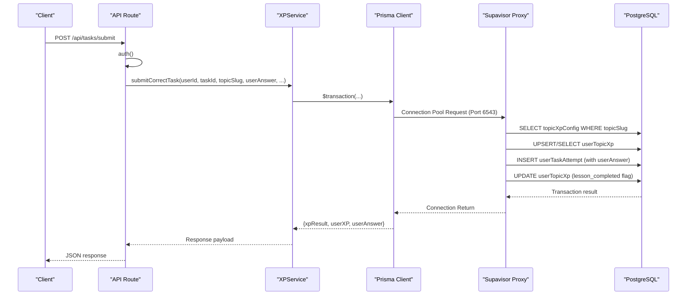
```mermaid
sequenceDiagram
participant Client as "Client"
participant Route as "API Route"
participant Service as "XPService"
participant Prisma as "Prisma Client"
participant Supavisor as "Supavisor Proxy"
participant DB as "PostgreSQL"
Client->>Route : POST /api/tasks/submit
Route->>Route : auth()
Route->>Service : submitCorrectTask(userId, taskId, topicSlug, userAnswer, ...)
Service->>Prisma : $transaction(...)
Prisma->>Supavisor : Connection Pool Request (Port 6543)
Supavisor->>DB : SELECT topicXpConfig WHERE topicSlug
Supavisor->>DB : UPSERT/SELECT userTopicXp
Supavisor->>DB : INSERT userTaskAttempt (with userAnswer)
Supavisor->>DB : UPDATE userTopicXp (lesson_completed flag)
DB-->>Supavisor : Transaction result
Supavisor-->>Prisma : Connection Return
Prisma-->>Service : {xpResult, userXP, userAnswer}
Service-->>Route : Response payload
Route-->>Client : JSON response
```

**Diagram sources**
- [route.ts (tasks submit)](file://app/api/tasks/submit/route.ts#L1-L71)
- [xpService.ts](file://lib/xp/xpService.ts#L118-L303)
- [prisma.ts](file://lib/prisma.ts#L1-L26)
- [docker-compose.yml (Supabase)](file://database/supabase-project/docker-compose.yml#L482-L534)

**Section sources**
- [authConfig.ts](file://lib/auth/authConfig.ts#L14-L14)
- [route.ts (tasks submit)](file://app/api/tasks/submit/route.ts#L1-L71)
- [xpService.ts](file://lib/xp/xpService.ts#L118-L303)
- [docker-compose.yml (Supabase)](file://database/supabase-project/docker-compose.yml#L482-L534)

## Detailed Component Analysis

### Entity Relationship Model and Table Schemas
The schema defines five core tables with explicit mappings and indexes. Relationships are declared with foreign keys and cascading deletes. The architecture supports both UUID and auto-increment primary keys with comprehensive indexing strategies.

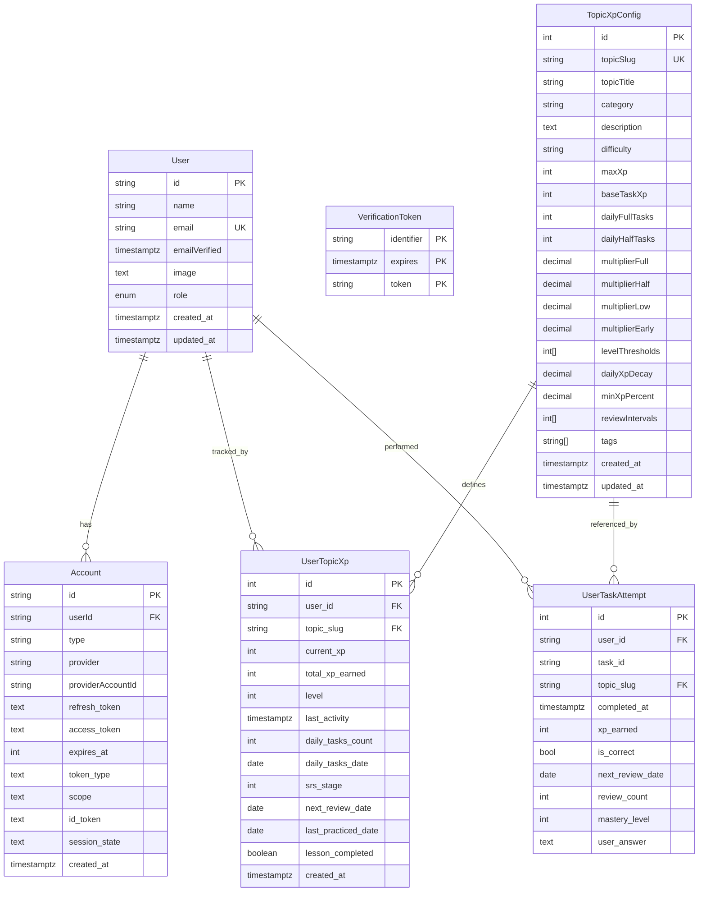
```mermaid
erDiagram
User {
string id PK
string name
string email UK
timestamptz emailVerified
text image
enum role
timestamptz created_at
timestamptz updated_at
}
Account {
string id PK
string userId FK
string type
string provider
string providerAccountId
text refresh_token
text access_token
int expires_at
text token_type
text scope
text id_token
text session_state
timestamptz created_at
}
VerificationToken {
string identifier PK
timestamptz expires PK
string token PK
}
TopicXpConfig {
int id PK
string topicSlug UK
string topicTitle
string category
text description
string difficulty
int maxXp
int baseTaskXp
int dailyFullTasks
int dailyHalfTasks
decimal multiplierFull
decimal multiplierHalf
decimal multiplierLow
decimal multiplierEarly
int[] levelThresholds
decimal dailyXpDecay
decimal minXpPercent
int[] reviewIntervals
string[] tags
timestamptz created_at
timestamptz updated_at
}
UserTopicXp {
int id PK
string user_id FK
string topic_slug FK
int current_xp
int total_xp_earned
int level
timestamptz last_activity
int daily_tasks_count
date daily_tasks_date
int srs_stage
date next_review_date
date last_practiced_date
boolean lesson_completed
timestamptz created_at
}
UserTaskAttempt {
int id PK
string user_id FK
string task_id
string topic_slug FK
timestamptz completed_at
int xp_earned
bool is_correct
date next_review_date
int review_count
int mastery_level
text user_answer
}
User ||--o{ Account : "has"
User ||--o{ UserTopicXp : "tracked_by"
User ||--o{ UserTaskAttempt : "performed"
TopicXpConfig ||--o{ UserTopicXp : "defines"
TopicXpConfig ||--o{ UserTaskAttempt : "referenced_by"
```

Key modeling decisions:
- UUID primary keys for User and Account for secure external references
- Unique constraints on email and (provider, providerAccountId) for identity safety
- Indexes on frequently filtered columns (user/topic combinations, next review dates)
- Decimal precision for multipliers and decay factors to avoid rounding errors
- Arrays for tags and intervals to support flexible configuration
- Comprehensive indexing strategy for performance optimization
- **New**: user_answer field in UserTaskAttempt for comprehensive answer tracking
- **New**: lesson_completed boolean in UserTopicXp for lesson completion monitoring

**Diagram sources**
- [schema.prisma](file://prisma/schema.prisma#L12-L144)

**Section sources**
- [schema.prisma](file://prisma/schema.prisma#L12-L144)

### Prisma Client Initialization and Supabase Integration
The Prisma client is initialized with a PostgreSQL adapter backed by a connection pool managed through Supavisor. The system connects to Supavisor proxy (port 6543) for connection pooling, while migrations use the direct database URL (port 5432) to avoid Supavisor issues.

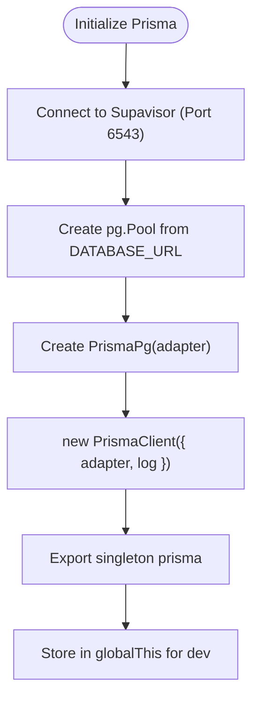
```mermaid
flowchart TD
Start(["Initialize Prisma"]) --> Supavisor["Connect to Supavisor (Port 6543)"]
Supavisor --> Pool["Create pg.Pool from DATABASE_URL"]
Pool --> Adapter["Create PrismaPg(adapter)"]
Adapter --> Client["new PrismaClient({ adapter, log })"]
Client --> Export["Export singleton prisma"]
Export --> Global["Store in globalThis for dev"]
```

**Diagram sources**
- [prisma.ts](file://lib/prisma.ts#L1-L26)
- [docker-compose.yml (Supabase)](file://database/supabase-project/docker-compose.yml#L482-L534)

**Section sources**
- [prisma.ts](file://lib/prisma.ts#L1-L26)
- [docker-compose.yml (Supabase)](file://database/supabase-project/docker-compose.yml#L482-L534)

### Docker-Based Supabase Infrastructure
The system uses a comprehensive Docker Compose setup that orchestrates multiple Supabase services including PostgreSQL, authentication, real-time, storage, and connection pooling. The infrastructure supports development and production environments with extensive customization options.

Key infrastructure components:
- **PostgreSQL Database**: Primary database with custom configurations and extensions
- **Supavisor (Pooler)**: Connection pooling service on port 6543
- **Studio**: Web-based database administration interface
- **Auth (GoTrue)**: Authentication service with multiple provider support
- **Realtime**: Real-time database change notifications
- **Storage**: Object storage with image transformation capabilities
- **Functions**: Edge runtime for serverless functions
- **Analytics**: Log aggregation and analytics platform

**Section sources**
- [docker-compose.yml (Supabase)](file://database/supabase-project/docker-compose.yml#L1-L538)
- [docker-compose.dev.yml (Supabase Dev)](file://database/supabase-project/dev/docker-compose.dev.yml#L1-L45)

### Migration Strategies and Schema Evolution
Schema evolution is handled at startup with Supabase-specific considerations:
- Production: migrations deployed via migrate deploy using DIRECT_URL
- Development: db push used when no migrations exist
- Fallback: on failure, db push is attempted in development
- Best-effort: failures are logged but do not crash the app
- Supabase compatibility: DIRECT_URL bypasses Supavisor for migration operations

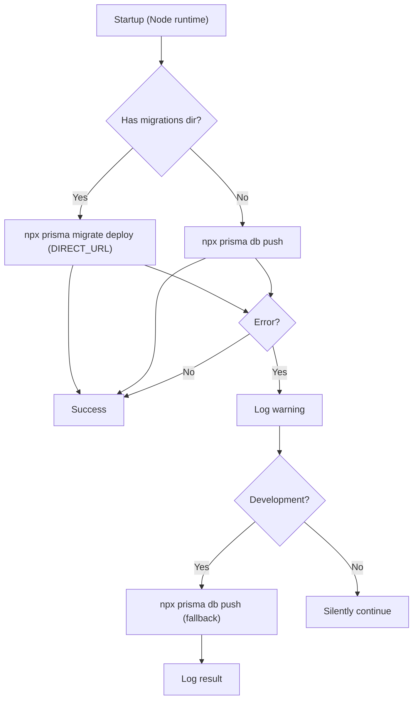
```mermaid
flowchart TD
A["Startup (Node runtime)"] --> B{"Has migrations dir?"}
B --> |Yes| C["npx prisma migrate deploy (DIRECT_URL)"]
B --> |No| D["npx prisma db push"]
C --> E["Success"]
D --> E
C --> F{"Error?"}
D --> F
F --> |Yes| G["Log warning"]
F --> |No| E
G --> H{"Development?"}
H --> |Yes| I["npx prisma db push (fallback)"]
H --> |No| J["Silently continue"]
I --> K["Log result"]
```

**Diagram sources**
- [runMigrations.ts](file://lib/prisma/runMigrations.ts#L1-L69)
- [instrumentation.ts](file://instrumentation.ts#L1-L44)
- [prisma.config.ts](file://prisma.config.ts#L16-L18)

**Section sources**
- [runMigrations.ts](file://lib/prisma/runMigrations.ts#L1-L69)
- [instrumentation.ts](file://instrumentation.ts#L1-L44)
- [prisma.config.ts](file://prisma.config.ts#L16-L18)

### Topic Configuration Synchronization
Topic configurations are synchronized from content files into TopicXpConfig during startup or on demand. Upserts ensure idempotent updates keyed by topicSlug with comprehensive error handling.

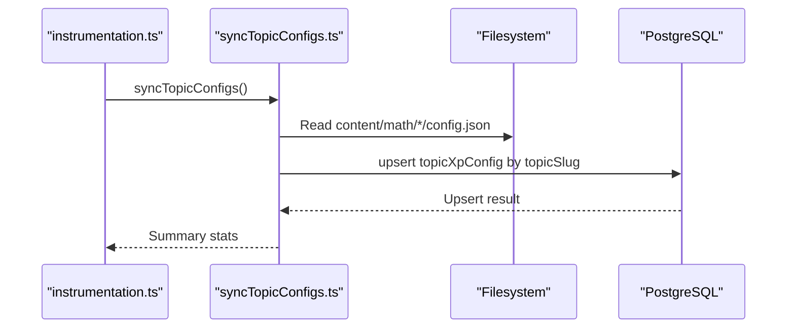
```mermaid
sequenceDiagram
participant Boot as "instrumentation.ts"
participant Sync as "syncTopicConfigs.ts"
participant FS as "Filesystem"
participant DB as "PostgreSQL"
Boot->>Sync : syncTopicConfigs()
Sync->>FS : Read content/math/*/config.json
Sync->>DB : upsert topicXpConfig by topicSlug
DB-->>Sync : Upsert result
Sync-->>Boot : Summary stats
```

**Diagram sources**
- [instrumentation.ts](file://instrumentation.ts#L21-L42)
- [syncTopicConfigs.ts](file://lib/xp/syncTopicConfigs.ts#L1-L174)
- [schema.prisma](file://prisma/schema.prisma#L70-L97)

**Section sources**
- [README.md](file://README.md#L41-L49)
- [syncTopicConfigs.ts](file://lib/xp/syncTopicConfigs.ts#L1-L174)

### XP Service and Transaction Management
The XP service encapsulates XP calculations, SRS scheduling, and persistence. All writes are performed inside Prisma transactions to guarantee atomicity. The service handles complex XP calculations with anti-grind protection and SRS scheduling algorithms.

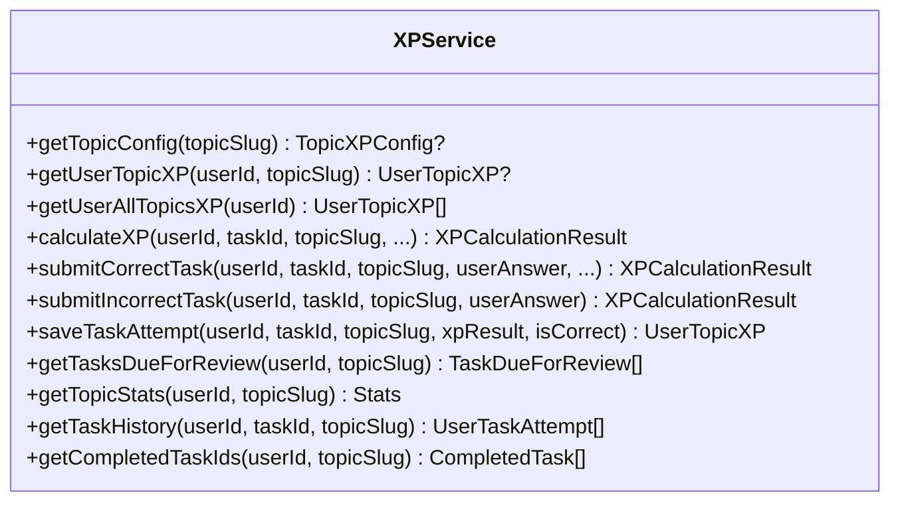
```mermaid
classDiagram
class XPService {
+getTopicConfig(topicSlug) TopicXPConfig?
+getUserTopicXP(userId, topicSlug) UserTopicXP?
+getUserAllTopicsXP(userId) UserTopicXP[]
+calculateXP(userId, taskId, topicSlug, ...) XPCalculationResult
+submitCorrectTask(userId, taskId, topicSlug, userAnswer, ...) XPCalculationResult
+submitIncorrectTask(userId, taskId, topicSlug, userAnswer) XPCalculationResult
+saveTaskAttempt(userId, taskId, topicSlug, xpResult, isCorrect) UserTopicXP
+getTasksDueForReview(userId, topicSlug) TaskDueForReview[]
+getTopicStats(userId, topicSlug) Stats
+getTaskHistory(userId, taskId, topicSlug) UserTaskAttempt[]
+getCompletedTaskIds(userId, topicSlug) CompletedTask[]
}
```

Key transactional operations:
- submitCorrectTask: reads config, ensures user topic XP exists, computes XP and SRS, persists attempt with user answer and updates user XP atomically
- submitIncorrectTask: handles incorrect answers with SRS regression and user answer tracking
- saveTaskAttempt: creates or updates user XP and persists attempt in a single transaction

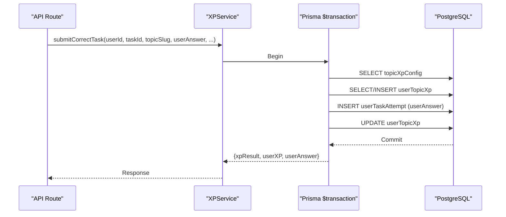
```mermaid
sequenceDiagram
participant API as "API Route"
participant Svc as "XPService"
participant Tx as "Prisma $transaction"
participant DB as "PostgreSQL"
API->>Svc : submitCorrectTask(userId, taskId, topicSlug, userAnswer, ...)
Svc->>Tx : Begin
Tx->>DB : SELECT topicXpConfig
Tx->>DB : SELECT/INSERT userTopicXp
Tx->>DB : INSERT userTaskAttempt (userAnswer)
Tx->>DB : UPDATE userTopicXp
DB-->>Tx : Commit
Tx-->>Svc : {xpResult, userXP, userAnswer}
Svc-->>API : Response
```

**Diagram sources**
- [xpService.ts](file://lib/xp/xpService.ts#L118-L303)
- [route.ts (tasks submit)](file://app/api/tasks/submit/route.ts#L34-L51)

**Section sources**
- [xpService.ts](file://lib/xp/xpService.ts#L118-L303)
- [route.ts (tasks submit)](file://app/api/tasks/submit/route.ts#L1-L71)

### API Routes and Typed Interfaces
API routes delegate to services and return typed responses. TypeScript interfaces define the shape of requests, responses, and domain entities with comprehensive type safety.

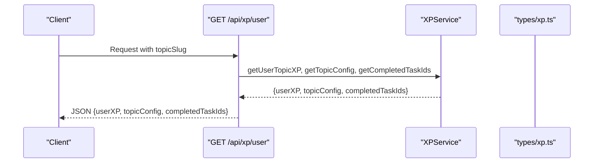
```mermaid
sequenceDiagram
participant Client as "Client"
participant Route as "GET /api/xp/user"
participant Svc as "XPService"
participant Types as "types/xp.ts"
Client->>Route : Request with topicSlug
Route->>Svc : getUserTopicXP, getTopicConfig, getCompletedTaskIds
Svc-->>Route : {userXP, topicConfig, completedTaskIds}
Route-->>Client : JSON {userXP, topicConfig, completedTaskIds}
```

**Diagram sources**
- [route.ts (XP user)](file://app/api/xp/user/route.ts#L1-L41)
- [types/xp.ts](file://types/xp.ts#L26-L133)
- [xpService.ts](file://lib/xp/xpService.ts#L313-L371)

**Section sources**
- [route.ts (XP user)](file://app/api/xp/user/route.ts#L1-L41)
- [types/xp.ts](file://types/xp.ts#L1-L133)

### Authentication Integration
NextAuth uses PrismaAdapter to persist sessions and user identities. The adapter leverages the same Prisma client, ensuring consistent database access across the entire application stack.

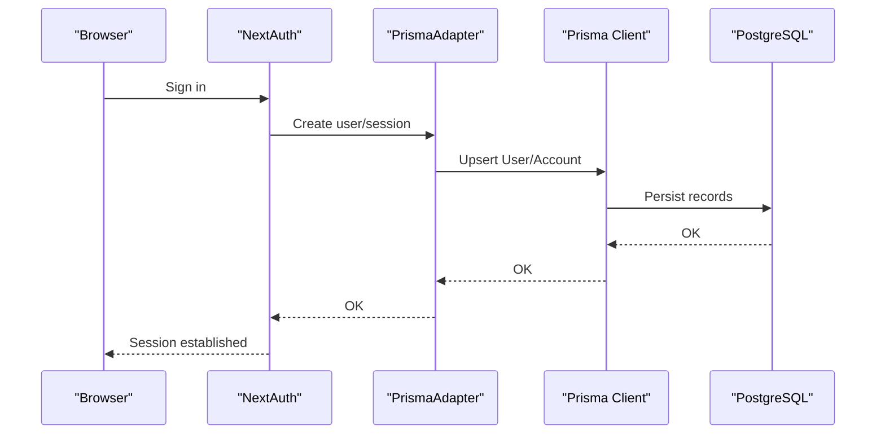
```mermaid
sequenceDiagram
participant Client as "Browser"
participant NextAuth as "NextAuth"
participant Adapter as "PrismaAdapter"
participant Prisma as "Prisma Client"
participant DB as "PostgreSQL"
Client->>NextAuth : Sign in
NextAuth->>Adapter : Create user/session
Adapter->>Prisma : Upsert User/Account
Prisma->>DB : Persist records
DB-->>Prisma : OK
Prisma-->>Adapter : OK
Adapter-->>NextAuth : OK
NextAuth-->>Client : Session established
```

**Diagram sources**
- [authConfig.ts](file://lib/auth/authConfig.ts#L14-L14)
- [prisma.ts](file://lib/prisma.ts#L1-L26)

**Section sources**
- [authConfig.ts](file://lib/auth/authConfig.ts#L1-L83)

## Enhanced Database Schema

### Updated Entity Relationship Model
The database schema has been enhanced with new fields for comprehensive learning analytics and progress tracking. The UserTaskAttempt table now includes user_answer for detailed answer tracking, while UserTopicXp includes lesson_completed for monitoring lesson completion status.

**Updated** Enhanced schema with new tracking capabilities for improved learning analytics and user experience monitoring.

```mermaid
erDiagram
User {
string id PK
string name
string email UK
timestamptz emailVerified
text image
enum role
timestamptz created_at
timestamptz updated_at
}
Account {
string id PK
string userId FK
string type
string provider
string providerAccountId
text refresh_token
text access_token
int expires_at
text token_type
text scope
text id_token
text session_state
timestamptz created_at
}
VerificationToken {
string identifier PK
timestamptz expires PK
string token PK
}
TopicXpConfig {
int id PK
string topicSlug UK
string topicTitle
string category
text description
string difficulty
int maxXp
int baseTaskXp
int dailyFullTasks
int dailyHalfTasks
decimal multiplierFull
decimal multiplierHalf
decimal multiplierLow
decimal multiplierEarly
int[] levelThresholds
decimal dailyXpDecay
decimal minXpPercent
int[] reviewIntervals
string[] tags
timestamptz created_at
timestamptz updated_at
}
UserTopicXp {
int id PK
string user_id FK
string topic_slug FK
int current_xp
int total_xp_earned
int level
timestamptz last_activity
int daily_tasks_count
date daily_tasks_date
int srs_stage
date next_review_date
date last_practiced_date
boolean lesson_completed
timestamptz created_at
}
UserTaskAttempt {
int id PK
string user_id FK
string task_id
string topic_slug FK
timestamptz completed_at
int xp_earned
bool is_correct
date next_review_date
int review_count
int mastery_level
text user_answer
}
User ||--o{ Account : "has"
User ||--o{ UserTopicXp : "tracked_by"
User ||--o{ UserTaskAttempt : "performed"
TopicXpConfig ||--o{ UserTopicXp : "defines"
TopicXpConfig ||--o{ UserTaskAttempt : "referenced_by"
```

**Diagram sources**
- [schema.prisma](file://prisma/schema.prisma#L12-L144)

**Section sources**
- [schema.prisma](file://prisma/schema.prisma#L12-L144)

## User Answer Tracking System

### Enhanced Answer Capture and Analytics
The UserTaskAttempt table now includes a user_answer field that captures student responses for comprehensive analytics and learning insights. This enhancement enables detailed analysis of student performance patterns and answer quality.

**New Feature**: Comprehensive user answer tracking system for enhanced learning analytics and performance monitoring.

### Implementation Details
The user answer tracking system integrates seamlessly with the existing XP calculation framework:

- **Data Persistence**: User answers are stored as text in the user_answer column
- **Type Safety**: Answers are converted to strings for consistent storage
- **Analytics Integration**: Enables detailed analysis of answer patterns and learning progress
- **Privacy Protection**: Answers are stored securely and can be anonymized for analytics

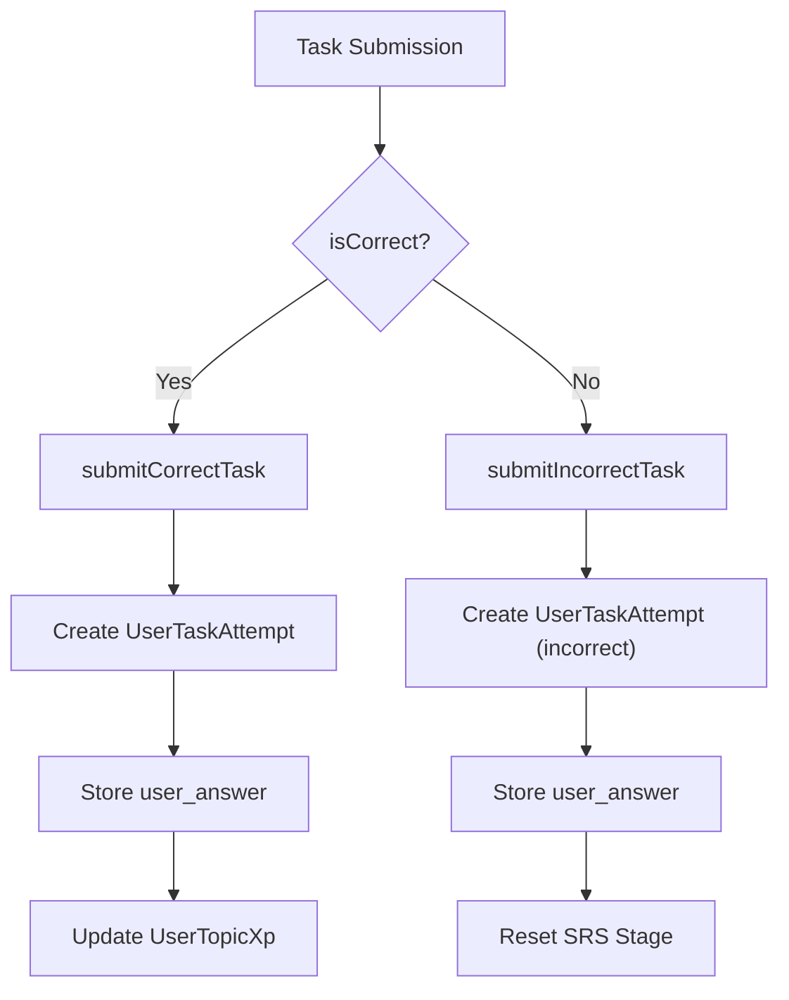
```mermaid
flowchart TD
A["Task Submission"] --> B{"isCorrect?"}
B --> |Yes| C["submitCorrectTask"]
B --> |No| D["submitIncorrectTask"]
C --> E["Create UserTaskAttempt"]
E --> F["Store user_answer"]
F --> G["Update UserTopicXp"]
D --> H["Create UserTaskAttempt (incorrect)"]
H --> I["Store user_answer"]
I --> J["Reset SRS Stage"]
```

**Diagram sources**
- [xpService.ts](file://lib/xp/xpService.ts#L118-L303)
- [route.ts (tasks submit)](file://app/api/tasks/submit/route.ts#L18-L51)

**Section sources**
- [xpService.ts](file://lib/xp/xpService.ts#L118-L303)
- [route.ts (tasks submit)](file://app/api/tasks/submit/route.ts#L1-L71)
- [types/xp.ts](file://types/xp.ts#L70-L82)

## Lesson Completion Monitoring

### Enhanced Progress Tracking
The UserTopicXp table now includes a lesson_completed boolean field that tracks whether students have completed lessons. This feature enables comprehensive monitoring of learning progress and completion rates.

**New Feature**: Lesson completion tracking system for monitoring student progress and engagement.

### Implementation Strategy
The lesson completion monitoring system works alongside the existing SRS (Spaced Repetition System) framework:

- **Automatic Tracking**: Lesson completion status is tracked during XP calculations
- **Progress Visualization**: Enables dashboard displays of completion rates
- **Analytics Insights**: Supports reporting on learning patterns and completion trends
- **Engagement Metrics**: Helps identify areas where students may need additional support

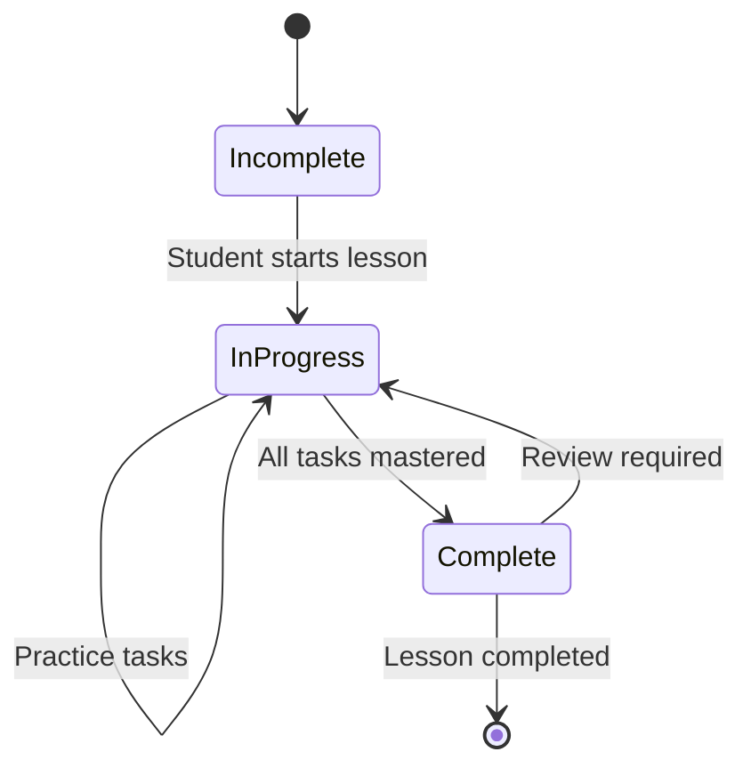
```mermaid
stateDiagram-v2
[*] --> Incomplete
Incomplete --> InProgress : Student starts lesson
InProgress --> InProgress : Practice tasks
InProgress --> Complete : All tasks mastered
Complete --> InProgress : Review required
Complete --> [*] : Lesson completed
```

**Diagram sources**
- [schema.prisma](file://prisma/schema.prisma#L99-L122)
- [xpService.ts](file://lib/xp/xpService.ts#L278-L296)

**Section sources**
- [schema.prisma](file://prisma/schema.prisma#L99-L122)
- [xpService.ts](file://lib/xp/xpService.ts#L278-L296)

## Improved Prisma Migration System

### Structured Migration Management
The Prisma migration system has been enhanced with organized migration files that provide better control over schema evolution and deployment processes.

**Updated** Enhanced migration system with structured file organization for improved version control and deployment reliability.

### Migration File Organization
The migration system now follows a clear chronological structure:

- **20260124205628_init**: Initial database schema creation
- **20260130185755_add_user_answer**: Added user answer tracking capability
- **20260131171720_add_lesson_completed_to_user_topic_xp**: Added lesson completion monitoring

Each migration file contains specific ALTER TABLE statements that modify the schema incrementally.

### Migration Execution Flow
The enhanced migration system provides better error handling and deployment control:

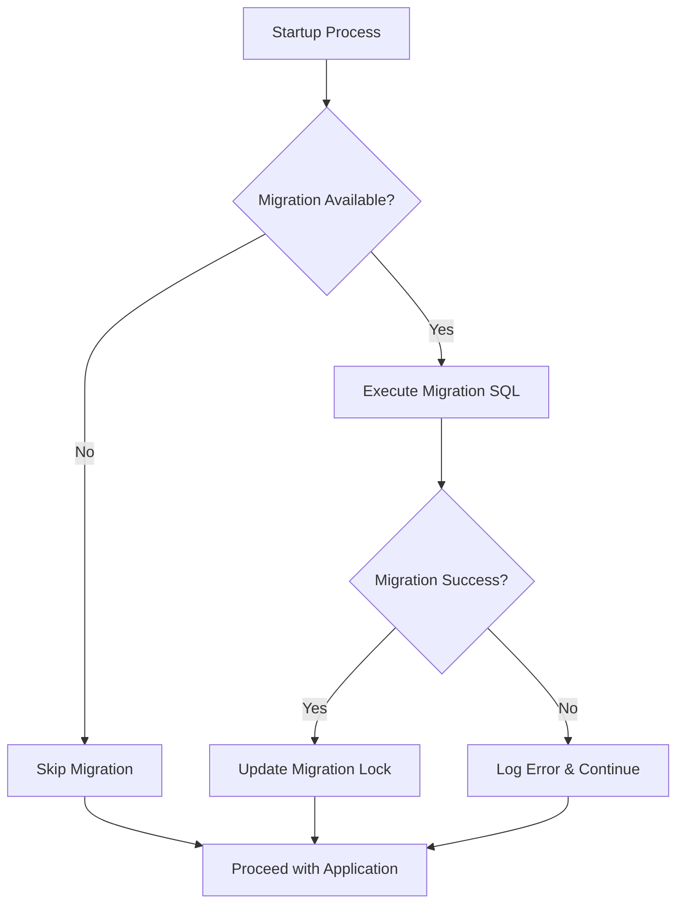
```mermaid
flowchart TD
A["Startup Process"] --> B{"Migration Available?"}
B --> |Yes| C["Execute Migration SQL"]
B --> |No| D["Skip Migration"]
C --> E{"Migration Success?"}
E --> |Yes| F["Update Migration Lock"]
E --> |No| G["Log Error & Continue"]
D --> H["Proceed with Application"]
F --> H
G --> H
```

**Diagram sources**
- [runMigrations.ts](file://lib/prisma/runMigrations.ts#L1-L69)
- [20260130185755_add_user_answer/migration.sql](file://prisma/migrations/20260130185755_add_user_answer/migration.sql#L1-L3)
- [20260131171720_add_lesson_completed_to_user_topic_xp/migration.sql](file://prisma/migrations/20260131171720_add_lesson_completed_to_user_topic_xp/migration.sql#L1-L3)

**Section sources**
- [runMigrations.ts](file://lib/prisma/runMigrations.ts#L1-L69)
- [20260130185755_add_user_answer/migration.sql](file://prisma/migrations/20260130185755_add_user_answer/migration.sql#L1-L3)
- [20260131171720_add_lesson_completed_to_user_topic_xp/migration.sql](file://prisma/migrations/20260131171720_add_lesson_completed_to_user_topic_xp/migration.sql#L1-L3)

### Migration File Details

#### User Answer Tracking Migration
The migration adds the user_answer column to the UserTaskAttempt table, enabling comprehensive answer capture and analysis.

**Migration Content**: `ALTER TABLE "user_task_attempts" ADD COLUMN "user_answer" TEXT;`

#### Lesson Completion Tracking Migration
The migration adds the lesson_completed column to the UserTopicXp table, enabling lesson completion monitoring and progress tracking.

**Migration Content**: `ALTER TABLE "user_topic_xp" ADD COLUMN "lesson_completed" BOOLEAN NOT NULL DEFAULT false;`

**Section sources**
- [20260130185755_add_user_answer/migration.sql](file://prisma/migrations/20260130185755_add_user_answer/migration.sql#L1-L3)
- [20260131171720_add_lesson_completed_to_user_topic_xp/migration.sql](file://prisma/migrations/20260131171720_add_lesson_completed_to_user_topic_xp/migration.sql#L1-L3)

## Environment Configuration & Security

### Comprehensive .env Template and Security Hardening
The Supabase self-hosted deployment includes a comprehensive .env template with production-ready security recommendations. All default credentials must be changed before deployment to production environments.

#### Critical Security Variables
- **POSTGRES_PASSWORD**: Super secret PostgreSQL password (minimum 16 characters, alphanumeric + special)
- **JWT_SECRET**: JWT token with at least 32 characters (cryptographically secure)
- **ANON_KEY**: Anonymous access key (auto-generated JWT)
- **SERVICE_ROLE_KEY**: Service role key (auto-generated JWT)
- **DASHBOARD_PASSWORD**: Secure dashboard password (minimum 16 characters)
- **SECRET_KEY_BASE**: Cryptographically secure key base (48 bytes)
- **VAULT_ENC_KEY**: Encryption key (32 hex characters)
- **PG_META_CRYPTO_KEY**: Meta crypto key (24+ characters)

#### Supavisor Connection Pooling Configuration
- **POOLER_PROXY_PORT_TRANSACTION**: Transaction proxy port (default: 6543)
- **POOLER_DEFAULT_POOL_SIZE**: Default pool size (default: 20)
- **POOLER_MAX_CLIENT_CONN**: Maximum client connections (default: 100)
- **POOLER_DB_POOL_SIZE**: Database pool size (default: 5)
- **POOLER_TENANT_ID**: Unique tenant identifier

#### Automated Security Utilities
The repository provides two essential scripts for security hardening:

**generate-keys.sh**: Automated key generation utility that creates cryptographically secure random values for all critical secrets and updates the .env file automatically.

**db-passwd.sh**: Database password rotation utility that safely updates all PostgreSQL user passwords and updates the .env configuration.

#### Production Security Checklist
Before deploying to production, ensure all default values are replaced:

1. **Change All Default Passwords**: Replace POSTGRES_PASSWORD, DASHBOARD_PASSWORD, and all service credentials
2. **Generate New JWT Secrets**: Use generate-keys.sh or openssl to create new JWT_SECRET values
3. **Update CORS Settings**: Configure appropriate CORS origins for your deployment
4. **Set Up Secure Proxy**: Consider implementing a reverse proxy with SSL termination
5. **Configure Network Security**: Set up proper firewall rules and ACLs
6. **Implement Backup Procedures**: Schedule regular database backups
7. **Monitor Access Logs**: Enable and monitor authentication attempts
8. **Regular Security Audits**: Conduct periodic security assessments

#### Environment Variable Reference
Key environment variables and their purposes:

- **DATABASE_URL**: Connection string for pooled connections (Supavisor)
- **DIRECT_URL**: Direct database connection for migrations
- **AUTH_DATABASE_HOST**: Database host for authentication
- **AUTH_DATABASE_PORT**: Database port for authentication
- **AUTH_DATABASE_NAME**: Database name for authentication
- **AUTH_DATABASE_USER**: Database user for authentication
- **AUTH_DATABASE_PASSWORD**: Database password for authentication
- **AUTH_SECRET**: NextAuth secret key
- **NEXT_PUBLIC_SUPABASE_URL**: Public Supabase URL
- **NEXT_PUBLIC_SUPABASE_ANON_KEY**: Public anonymous key

**Section sources**
- [.env (Supabase)](file://database/supabase-project/.env#L1-L131)
- [generate-keys.sh](file://database/supabase-project/utils/generate-keys.sh#L1-L120)
- [db-passwd.sh](file://database/supabase-project/utils/db-passwd.sh#L1-L158)
- [README.md](file://README.md#L70-L86)

## Dependency Analysis
External dependencies relevant to database integration:
- @prisma/client and @prisma/adapter-pg for ORM and PostgreSQL adapter
- pg for connection pooling
- Prisma CLI for migrations and schema generation
- Supabase ecosystem for infrastructure management

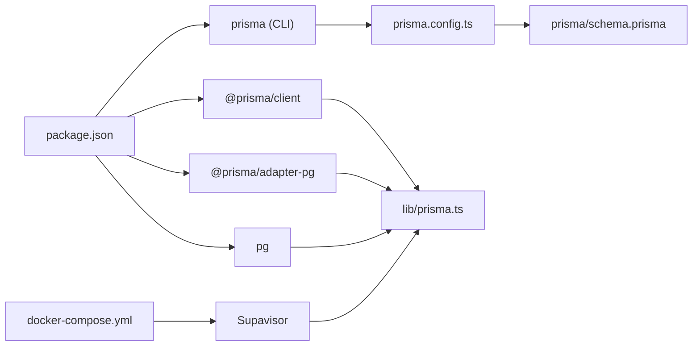
```mermaid
graph LR
PJSON["package.json"] --> PC["@prisma/client"]
PJSON --> PP["@prisma/adapter-pg"]
PJSON --> PG["pg"]
PJSON --> PRISMA["prisma (CLI)"]
PRISMA --> CFG["prisma.config.ts"]
CFG --> SCHEMA["prisma/schema.prisma"]
PC --> LIBPRISMA["lib/prisma.ts"]
PP --> LIBPRISMA
PG --> LIBPRISMA
DOCKER["docker-compose.yml"] --> SUPAVISOR["Supavisor"]
SUPAVISOR --> LIBPRISMA
```

**Diagram sources**
- [package.json](file://package.json#L16-L43)
- [prisma.config.ts](file://prisma.config.ts#L1-L19)
- [schema.prisma](file://prisma/schema.prisma#L1-L144)
- [prisma.ts](file://lib/prisma.ts#L1-L26)
- [docker-compose.yml (Supabase)](file://database/supabase-project/docker-compose.yml#L1-L538)

**Section sources**
- [package.json](file://package.json#L16-L43)

## Performance Considerations
Indexing strategy:
- Composite indexes on user-topic combinations for frequent joins
- Dedicated indexes on nextReviewDate for SRS scheduling queries
- Unique constraints on identity fields to enforce referential integrity efficiently
- Supavisor connection pooling reduces connection overhead
- **New**: Indexes on user_answer for answer analytics queries

Query optimization:
- Use of include/select to limit fetched fields
- Aggregation queries for statistics
- Distinct and grouped queries to reduce result sets
- Connection pooling through Supavisor improves concurrent query performance
- **New**: Optimized queries for user answer analytics and lesson completion tracking

Transaction management:
- Atomic updates for XP accumulation and SRS progression
- Upsert patterns to avoid race conditions
- Supavisor transaction mode configuration for optimal performance
- **New**: Enhanced transaction handling for user answer persistence

## Troubleshooting Guide
Common issues and mitigations:
- Database unreachable at startup: migrations are skipped with warnings; verify environment variables and connectivity
- Supavisor connection issues: ensure port 6543 is accessible and connection pooling is properly configured
- Missing migrations: db push is used as a fallback in development; consider generating migrations for production
- Authentication failures: ensure PrismaAdapter is configured with the same client used elsewhere
- Slow SRS queries: confirm indexes exist on nextReviewDate and user/topic keys
- **New**: User answer analytics slow: ensure proper indexing on user_answer column
- **New**: Lesson completion tracking issues: verify lesson_completed field updates in transactions
- Docker infrastructure issues: verify all Supabase services are healthy and properly configured

Operational checks:
- Verify DATABASE_URL construction and environment variables
- Confirm Prisma client exports and global singleton behavior
- Validate API routes return proper status codes and error messages
- Monitor Supavisor health and connection pool metrics
- Check Docker Compose service dependencies and health checks
- **New**: Verify user_answer field accessibility in API responses
- **New**: Confirm lesson_completed field updates in XP calculations

**Section sources**
- [runMigrations.ts](file://lib/prisma/runMigrations.ts#L45-L67)
- [authConfig.ts](file://lib/auth/authConfig.ts#L14-L14)
- [schema.prisma](file://prisma/schema.prisma#L118-L144)
- [docker-compose.yml (Supabase)](file://database/supabase-project/docker-compose.yml#L482-L534)

## Conclusion
The database integration leverages Prisma ORM with a PostgreSQL adapter, comprehensive Docker-based Supabase infrastructure, and robust startup migrations. The system utilizes Supavisor for connection pooling and provides a scalable foundation for the XP and task management system. Transactions ensure data consistency, while indexes and careful query design support performance. The system balances flexibility (db push in development) with reliability (migrations in production) and provides clear typed interfaces between models and application logic.

**Updated** The enhanced system now includes comprehensive user answer tracking, lesson completion monitoring, and improved migration management, providing deeper insights into student learning patterns and progress tracking capabilities.

The enhanced environment configuration approach now includes comprehensive security hardening with automated key generation utilities, making the system production-ready out of the box while maintaining ease of development setup.

## Appendices

### Appendix A: Environment Variables
Required variables for database and authentication:
- Database: AUTH_DATABASE_HOST, AUTH_DATABASE_PORT, AUTH_DATABASE_NAME, AUTH_DATABASE_USER, AUTH_DATABASE_PASSWORD
- Authentication: AUTH_SECRET, provider-specific credentials
- Supavisor: POOLER_DEFAULT_POOL_SIZE, POOLER_MAX_CLIENT_CONN, POOLER_DB_POOL_SIZE
- Optional toggles: RUN_MIGRATIONS_ON_START, SYNC_TOPICS_ON_START

**Section sources**
- [README.md](file://README.md#L30-L39)
- [instrumentation.ts](file://instrumentation.ts#L12-L22)
- [docker-compose.yml (Supabase)](file://database/supabase-project/docker-compose.yml#L511-L528)

### Appendix B: Supabase Service Configuration
Key Supabase services and their purposes:
- **db**: PostgreSQL database with custom configurations and extensions
- **supavisor**: Connection pooling service on port 6543
- **studio**: Web-based database administration interface
- **auth**: Authentication service with multiple provider support
- **realtime**: Real-time database change notifications
- **storage**: Object storage with image transformation capabilities
- **functions**: Edge runtime for serverless functions
- **analytics**: Log aggregation and analytics platform

**Section sources**
- [docker-compose.yml (Supabase)](file://database/supabase-project/docker-compose.yml#L10-L538)
- [docker-compose.dev.yml (Supabase Dev)](file://database/supabase-project/dev/docker-compose.dev.yml#L1-L45)

### Appendix C: Security Hardening Utilities
The repository includes specialized scripts for production security:

**generate-keys.sh**: Creates cryptographically secure random values for all critical secrets and automatically updates the .env file. Generates JWT tokens, encryption keys, database passwords, and access tokens with proper formatting.

**db-passwd.sh**: Safely rotates all PostgreSQL user passwords, updates the .env configuration, and handles database schema updates for Supavisor and analytics components.

Both scripts include interactive confirmation prompts and comprehensive error handling for safe production deployment.

**Section sources**
- [generate-keys.sh](file://database/supabase-project/utils/generate-keys.sh#L1-L120)
- [db-passwd.sh](file://database/supabase-project/utils/db-passwd.sh#L1-L158)

### Appendix D: Enhanced Migration System
The migration system now includes structured file organization for better version control and deployment reliability:

**Migration History**:
- **20260124205628_init**: Initial database schema creation
- **20260130185755_add_user_answer**: Added user answer tracking capability
- **20260131171720_add_lesson_completed_to_user_topic_xp**: Added lesson completion monitoring

**Migration Benefits**:
- Clear chronological tracking of schema changes
- Improved deployment reliability
- Better rollback capabilities
- Enhanced version control integration

**Section sources**
- [20260130185755_add_user_answer/migration.sql](file://prisma/migrations/20260130185755_add_user_answer/migration.sql#L1-L3)
- [20260131171720_add_lesson_completed_to_user_topic_xp/migration.sql](file://prisma/migrations/20260131171720_add_lesson_completed_to_user_topic_xp/migration.sql#L1-L3)