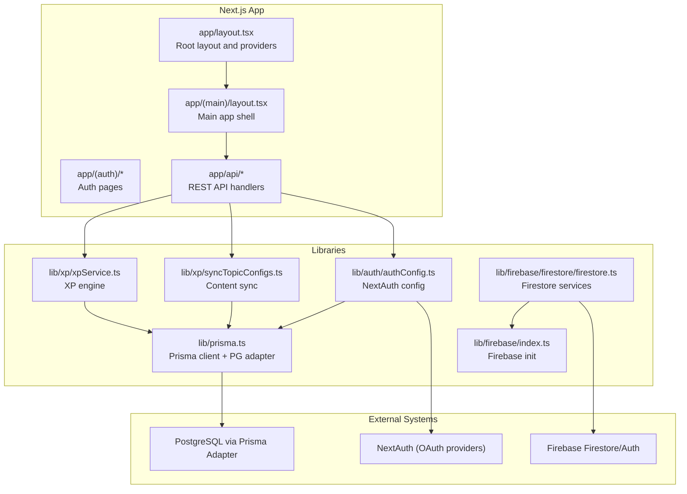
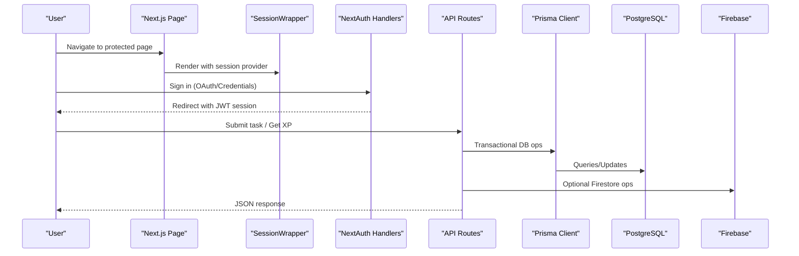
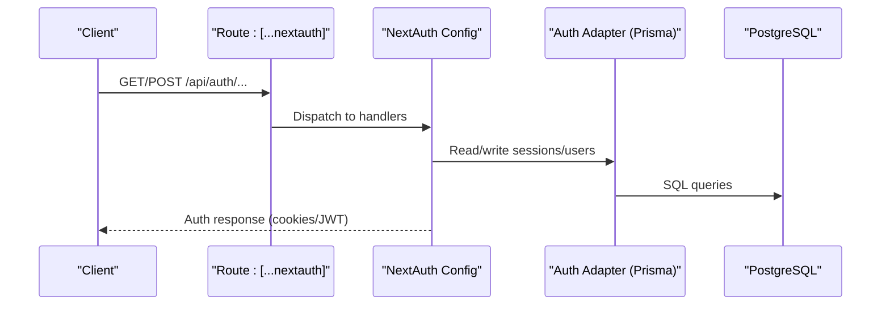
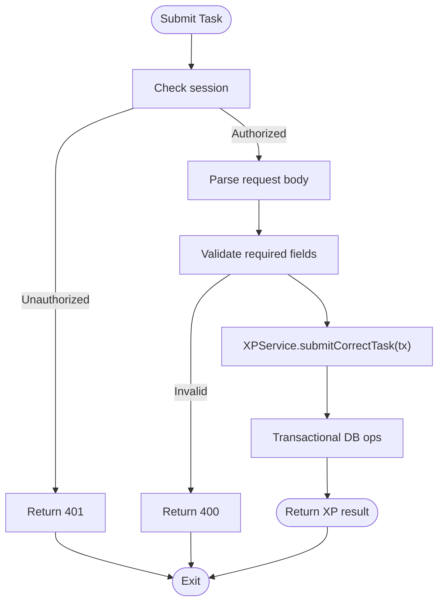
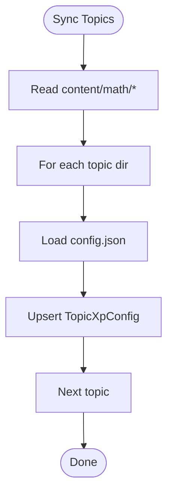
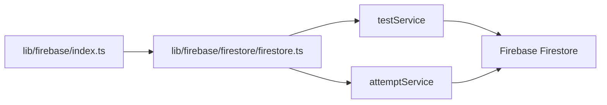
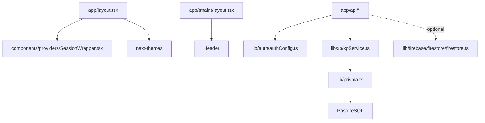
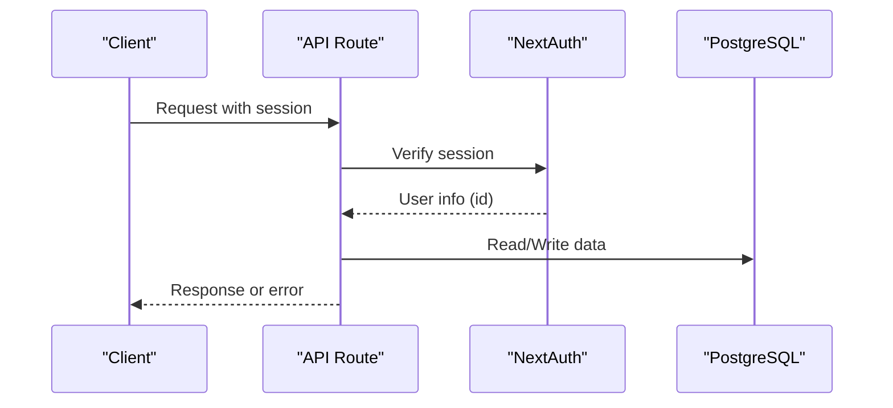

# System Design Overview

<cite>
**Referenced Files in This Document**
- [package.json](file://package.json)
- [next.config.ts](file://next.config.ts)
- [prisma/schema.prisma](file://prisma/schema.prisma)
- [lib/prisma.ts](file://lib/prisma.ts)
- [lib/auth/authConfig.ts](file://lib/auth/authConfig.ts)
- [app/api/[...nextauth]/route.ts](file://app/api/[...nextauth]/route.ts)
- [lib/firebase/index.ts](file://lib/firebase/index.ts)
- [lib/firebase/firestore/firestore.ts](file://lib/firebase/firestore/firestore.ts)
- [lib/xp/xpService.ts](file://lib/xp/xpService.ts)
- [lib/xp/syncTopicConfigs.ts](file://lib/xp/syncTopicConfigs.ts)
- [app/layout.tsx](file://app/layout.tsx)
- [app/(main)/layout.tsx](file://app/(main)/layout.tsx)
- [components/providers/SessionWrapper.tsx](file://components/providers/SessionWrapper.tsx)
- [app/api/tasks/submit/route.ts](file://app/api/tasks/submit/route.ts)
- [app/api/xp/user/route.ts](file://app/api/xp/user/route.ts)
- [app/api/sync-topics/route.ts](file://app/api/sync-topics/route.ts)
</cite>

## Table of Contents
1. [Introduction](#introduction)
2. [Project Structure](#project-structure)
3. [Core Components](#core-components)
4. [Architecture Overview](#architecture-overview)
5. [Detailed Component Analysis](#detailed-component-analysis)
6. [Dependency Analysis](#dependency-analysis)
7. [Performance Considerations](#performance-considerations)
8. [Security Architecture](#security-architecture)
9. [Scalability Considerations](#scalability-considerations)
10. [Deployment Architecture](#deployment-architecture)
11. [Troubleshooting Guide](#troubleshooting-guide)
12. [Conclusion](#conclusion)

## Introduction
This document presents a comprehensive system design overview for a math learning application built with Next.js App Router. It explains the overall architecture, technology stack choices, separation of concerns between frontend and backend, external integrations, and operational characteristics such as scalability, performance, and security.

## Project Structure
The application follows Next.js App Router conventions with a strict separation between routes, API handlers, shared libraries, and content-driven assets. Key areas:
- app/: Route groups and pages organized by feature (authentication, main content, API handlers)
- components/: Reusable UI and providers
- lib/: Shared business logic, authentication, XP engine, and Firebase integration
- content/: Markdown lessons and JSON configurations for topics
- prisma/: Database schema and Prisma client configuration

**Diagram sources**
- [app/layout.tsx](file://app/layout.tsx#L1-L46)
- [app/(main)/layout.tsx](file://app/(main)/layout.tsx#L1-L18)
- [lib/prisma.ts](file://lib/prisma.ts#L1-L29)
- [lib/auth/authConfig.ts](file://lib/auth/authConfig.ts#L1-L83)
- [lib/xp/xpService.ts](file://lib/xp/xpService.ts#L1-L795)
- [lib/xp/syncTopicConfigs.ts](file://lib/xp/syncTopicConfigs.ts#L1-L174)
- [lib/firebase/index.ts](file://lib/firebase/index.ts#L1-L28)
- [lib/firebase/firestore/firestore.ts](file://lib/firebase/firestore/firestore.ts#L1-L96)

**Section sources**
- [package.json](file://package.json#L1-L63)
- [next.config.ts](file://next.config.ts#L1-L10)
- [prisma/schema.prisma](file://prisma/schema.prisma#L1-L143)

## Core Components
- Authentication and session management powered by NextAuth with JWT sessions and multiple OAuth providers, backed by PostgreSQL via Prisma adapter.
- Content-driven math lessons and exercises stored in content directories and synchronized into the database.
- XP and spaced repetition system encapsulated in a dedicated service with transactional updates to ensure consistency.
- Firebase integration for tests and attempt tracking, separate from the core auth and XP data model.
- Global providers for theme switching and session context.

Key implementation anchors:
- NextAuth configuration and handler export
- Prisma client initialization with a PostgreSQL connection pool
- XP calculation and SRS scheduling logic
- Firebase Firestore services for assessments

**Section sources**
- [lib/auth/authConfig.ts](file://lib/auth/authConfig.ts#L1-L83)
- [app/api/[...nextauth]/route.ts](file://app/api/[...nextauth]/route.ts#L1-L4)
- [lib/prisma.ts](file://lib/prisma.ts#L1-L29)
- [lib/xp/xpService.ts](file://lib/xp/xpService.ts#L118-L293)
- [lib/firebase/firestore/firestore.ts](file://lib/firebase/firestore/firestore.ts#L18-L95)

## Architecture Overview
The system is a client-server hybrid:
- Client-side: Next.js App Router pages and components with client-side hydration via React and Next-Auth’s client provider.
- Server-side: API routes handle authentication callbacks, XP calculations, and content synchronization; they interact with PostgreSQL and Firebase.

**Diagram sources**
- [components/providers/SessionWrapper.tsx](file://components/providers/SessionWrapper.tsx#L1-L11)
- [app/api/[...nextauth]/route.ts](file://app/api/[...nextauth]/route.ts#L1-L4)
- [lib/auth/authConfig.ts](file://lib/auth/authConfig.ts#L16-L82)
- [app/api/tasks/submit/route.ts](file://app/api/tasks/submit/route.ts#L1-L59)
- [app/api/xp/user/route.ts](file://app/api/xp/user/route.ts#L1-L41)
- [lib/prisma.ts](file://lib/prisma.ts#L1-L29)
- [lib/firebase/firestore/firestore.ts](file://lib/firebase/firestore/firestore.ts#L1-L96)

## Detailed Component Analysis

### Authentication and Session Management
- NextAuth is configured with multiple providers (Google, GitHub, Facebook, Credentials) and uses JWT sessions with a 24-day max age.
- The root layout wraps children with a session provider and theme provider, ensuring consistent session state across the app.
- The API exposes NextAuth handlers under a catch-all route.

**Diagram sources**
- [app/api/[...nextauth]/route.ts](file://app/api/[...nextauth]/route.ts#L1-L4)
- [lib/auth/authConfig.ts](file://lib/auth/authConfig.ts#L16-L82)
- [lib/prisma.ts](file://lib/prisma.ts#L1-L29)

**Section sources**
- [lib/auth/authConfig.ts](file://lib/auth/authConfig.ts#L1-L83)
- [app/api/[...nextauth]/route.ts](file://app/api/[...nextauth]/route.ts#L1-L4)
- [components/providers/SessionWrapper.tsx](file://components/providers/SessionWrapper.tsx#L1-L11)
- [app/layout.tsx](file://app/layout.tsx#L1-L46)

### XP Engine and Spaced Repetition
- The XP service encapsulates:
  - Topic configuration retrieval and upsert from content
  - Daily XP multipliers and level computation
  - SRS scheduling with configurable intervals
  - Transactional updates to user progress and attempts
- API endpoints:
  - POST /api/tasks/submit validates session, checks correctness, and computes XP
  - GET /api/xp/user fetches user XP, topic config, and completed tasks

**Diagram sources**
- [app/api/tasks/submit/route.ts](file://app/api/tasks/submit/route.ts#L6-L47)
- [lib/xp/xpService.ts](file://lib/xp/xpService.ts#L118-L293)

**Section sources**
- [lib/xp/xpService.ts](file://lib/xp/xpService.ts#L118-L293)
- [app/api/tasks/submit/route.ts](file://app/api/tasks/submit/route.ts#L1-L59)
- [app/api/xp/user/route.ts](file://app/api/xp/user/route.ts#L1-L41)

### Content Synchronization
- Synchronizes topic configurations from content files into the database using Prisma upserts.
- Provides bulk sync and per-topic load helpers.

**Diagram sources**
- [lib/xp/syncTopicConfigs.ts](file://lib/xp/syncTopicConfigs.ts#L10-L49)
- [lib/xp/syncTopicConfigs.ts](file://lib/xp/syncTopicConfigs.ts#L54-L130)

**Section sources**
- [lib/xp/syncTopicConfigs.ts](file://lib/xp/syncTopicConfigs.ts#L1-L174)
- [app/api/sync-topics/route.ts](file://app/api/sync-topics/route.ts#L1-L19)

### Firebase Integration
- Initializes Firebase app and exports Firestore, Auth, Storage instances.
- Provides services for published tests, test questions, and attempt tracking.

**Diagram sources**
- [lib/firebase/index.ts](file://lib/firebase/index.ts#L1-L28)
- [lib/firebase/firestore/firestore.ts](file://lib/firebase/firestore/firestore.ts#L18-L95)

**Section sources**
- [lib/firebase/index.ts](file://lib/firebase/index.ts#L1-L28)
- [lib/firebase/firestore/firestore.ts](file://lib/firebase/firestore/firestore.ts#L1-L96)

## Dependency Analysis
- Frontend rendering and hydration:
  - Root layout composes providers for session and theme.
  - Main layout injects header and Google One Tap.
- Backend services:
  - API routes depend on NextAuth for session validation and on Prisma for data persistence.
  - XP service encapsulates all DB logic and is reused by API routes.
- External dependencies:
  - PostgreSQL via Prisma adapter
  - NextAuth with multiple OAuth providers
  - Firebase for assessment data

**Diagram sources**
- [app/layout.tsx](file://app/layout.tsx#L1-L46)
- [components/providers/SessionWrapper.tsx](file://components/providers/SessionWrapper.tsx#L1-L11)
- [app/(main)/layout.tsx](file://app/(main)/layout.tsx#L1-L18)
- [app/api/tasks/submit/route.ts](file://app/api/tasks/submit/route.ts#L1-L59)
- [lib/auth/authConfig.ts](file://lib/auth/authConfig.ts#L1-L83)
- [lib/xp/xpService.ts](file://lib/xp/xpService.ts#L1-L795)
- [lib/prisma.ts](file://lib/prisma.ts#L1-L29)
- [lib/firebase/firestore/firestore.ts](file://lib/firebase/firestore/firestore.ts#L1-L96)

**Section sources**
- [package.json](file://package.json#L16-L43)
- [prisma/schema.prisma](file://prisma/schema.prisma#L1-L143)

## Performance Considerations
- Database pooling: Prisma uses a PostgreSQL connection pool to reduce connection overhead.
- Transactional XP updates: Ensures atomicity and avoids partial state during XP calculations.
- Client hydration: Session provider configured to minimize refetches on window focus.
- Image optimization: Next.js configuration allows remote images from trusted patterns.
- Asynchronous operations: Bulk content sync leverages Promise-based reads and upserts.

Recommendations:
- Indexes: Ensure appropriate indexes exist on frequently queried fields (e.g., user-topic composite keys).
- Caching: Consider caching topic configs and user XP for hot paths.
- CDN: Serve static assets and lessons via CDN for improved latency.
- Monitoring: Add tracing and metrics around XP transactions and API endpoints.

**Section sources**
- [lib/prisma.ts](file://lib/prisma.ts#L10-L16)
- [lib/xp/xpService.ts](file://lib/xp/xpService.ts#L118-L293)
- [components/providers/SessionWrapper.tsx](file://components/providers/SessionWrapper.tsx#L6-L10)
- [next.config.ts](file://next.config.ts#L4-L6)

## Security Architecture
- Authentication:
  - JWT-based sessions with a strong secret.
  - Multiple OAuth providers with secure client credentials.
  - Session callbacks enrich session with user identity.
- Authorization:
  - API routes check session presence and user ID before processing requests.
- Data protection:
  - PostgreSQL connection parameters via environment variables.
  - Firebase initialized with environment-backed configuration.
- Input validation:
  - API routes validate required fields and respond with explicit errors.

**Diagram sources**
- [app/api/tasks/submit/route.ts](file://app/api/tasks/submit/route.ts#L8-L15)
- [app/api/xp/user/route.ts](file://app/api/xp/user/route.ts#L7-L11)
- [lib/auth/authConfig.ts](file://lib/auth/authConfig.ts#L64-L81)

**Section sources**
- [lib/auth/authConfig.ts](file://lib/auth/authConfig.ts#L16-L82)
- [app/api/tasks/submit/route.ts](file://app/api/tasks/submit/route.ts#L10-L15)
- [app/api/xp/user/route.ts](file://app/api/xp/user/route.ts#L9-L11)

## Scalability Considerations
- Horizontal scaling:
  - Stateless API routes scale horizontally behind a load balancer.
  - Session state is in JWT; no sticky sessions required.
- Database scaling:
  - Use managed PostgreSQL with read replicas for reporting queries.
  - Partition or shard by user ID if needed.
- Caching:
  - Cache topic configs and user XP in front of the database.
- Asynchronous work:
  - Offload heavy content sync to background jobs if content grows large.
- Observability:
  - Instrument API latency, DB query times, and error rates.

## Deployment Architecture
- Runtime: Next.js application server.
- Database: PostgreSQL managed instance with Prisma adapter.
- Authentication: NextAuth handles OAuth flows; sessions stored in JWT.
- Assets: Static content served by Next.js; Firebase storage for media.
- CI/CD: Use standard Next.js build and start scripts; manage secrets via environment variables.

[No sources needed since this section provides general guidance]

## Troubleshooting Guide
Common issues and diagnostics:
- Authentication failures:
  - Verify NextAuth secret and provider credentials.
  - Check session callback behavior and cookie settings.
- Database connectivity:
  - Confirm PostgreSQL host/port/user/password and network access.
  - Review Prisma logs and connection pool limits.
- XP calculation anomalies:
  - Inspect transaction boundaries and daily task counters.
  - Validate topic configuration values (multipliers, intervals).
- Firebase errors:
  - Ensure Firebase config variables are set and app initializes.
  - Check Firestore permissions and collections existence.

**Section sources**
- [lib/auth/authConfig.ts](file://lib/auth/authConfig.ts#L18-L22)
- [lib/prisma.ts](file://lib/prisma.ts#L10-L16)
- [lib/xp/xpService.ts](file://lib/xp/xpService.ts#L118-L293)
- [lib/firebase/index.ts](file://lib/firebase/index.ts#L11-L18)

## Conclusion
The math learning application employs a clean separation between the presentation layer (Next.js pages and components) and backend services (API routes, Prisma, and Firebase). Its architecture leverages NextAuth for robust authentication, a transactional XP engine for learning progression, and a scalable PostgreSQL backend. With proper indexing, caching, and observability, the system can support growth while maintaining a responsive and secure user experience.