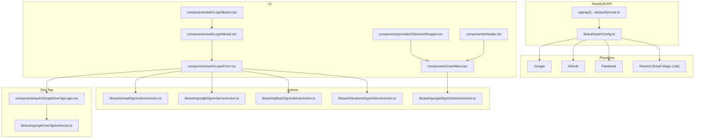
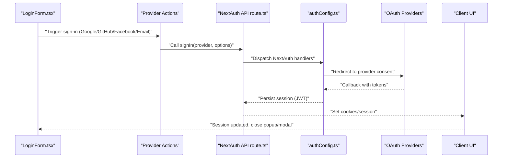
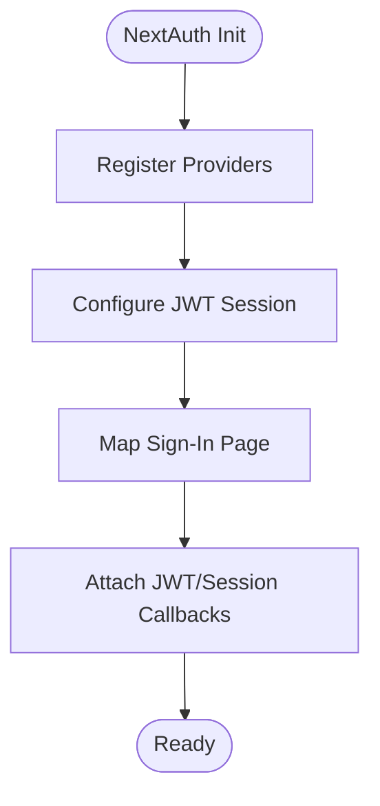
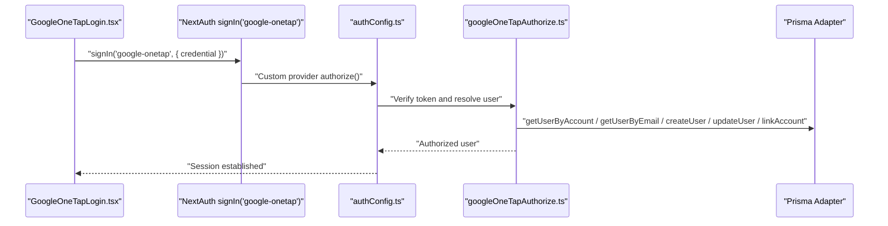
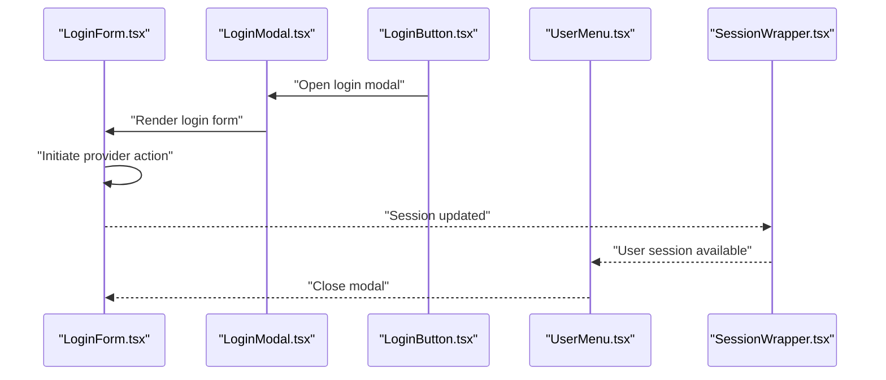
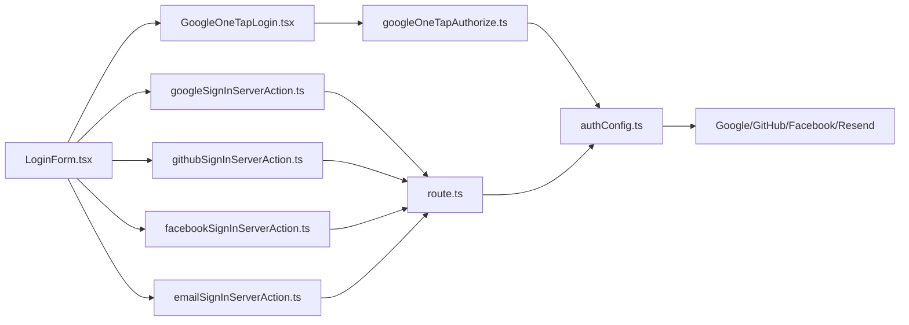

# Authentication & Authorization

<cite>
**Referenced Files in This Document**
- [authConfig.ts](file://lib/auth/authConfig.ts)
- [route.ts](file://app/api/[...nextauth]/route.ts)
- [emailSignInServerAction.ts](file://lib/auth/emailSignInServerAction.ts)
- [googleSignInServerAction.ts](file://lib/auth/googleSignInServerAction.ts)
- [githubSignInServerAction.ts](file://lib/auth/githubSignInServerAction.ts)
- [facebookSignInServerAction.ts](file://lib/auth/facebookSignInServerAction.ts)
- [googleSignOutServerAction.ts](file://lib/auth/googleSignOutServerAction.ts)
- [googleOneTapAuthorize.ts](file://lib/auth/googleOneTapAuthorize.ts)
- [LoginForm.tsx](file://components/auth/LoginForm.tsx)
- [LoginButton.tsx](file://components/auth/LoginButton.tsx)
- [LoginModal.tsx](file://components/auth/LoginModal.tsx)
- [LogoutButton.tsx](file://components/auth/LogoutButton.tsx)
- [GoogleOneTapLogin.tsx](file://components/auth/GoogleOneTapLogin.tsx)
- [SessionWrapper.tsx](file://components/providers/SessionWrapper.tsx)
- [UserMenu.tsx](file://components/UserMenu.tsx)
- [Header.tsx](file://components/Header.tsx)
</cite>

## Table of Contents
1. [Introduction](#introduction)
2. [Project Structure](#project-structure)
3. [Core Components](#core-components)
4. [Architecture Overview](#architecture-overview)
5. [Detailed Component Analysis](#detailed-component-analysis)
6. [Dependency Analysis](#dependency-analysis)
7. [Performance Considerations](#performance-considerations)
8. [Troubleshooting Guide](#troubleshooting-guide)
9. [Conclusion](#conclusion)

## Introduction
This document explains the authentication and authorization system built with NextAuth v5 in a Next.js App Router application. It covers multi-provider OAuth (Google, GitHub, Facebook), email magic-link authentication via Resend, session management with JWT strategy, and integration points across the UI. It also documents the Google One Tap flow, custom server actions, and practical troubleshooting guidance for common issues.

## Project Structure
Authentication is centered around:
- NextAuth configuration and API routes
- Provider-specific server actions for initiating sign-in/sign-out
- Frontend components for login UI, modal, and session-aware menus
- A session wrapper for client-side session management

**Diagram sources**
- [route.ts](file://app/api/[...nextauth]/route.ts#L1-L4)
- [authConfig.ts](file://lib/auth/authConfig.ts#L16-L82)
- [emailSignInServerAction.ts](file://lib/auth/emailSignInServerAction.ts#L1-L12)
- [googleSignInServerAction.ts](file://lib/auth/googleSignInServerAction.ts#L1-L12)
- [githubSignInServerAction.ts](file://lib/auth/githubSignInServerAction.ts#L1-L11)
- [facebookSignInServerAction.ts](file://lib/auth/facebookSignInServerAction.ts#L1-L11)
- [googleSignOutServerAction.ts](file://lib/auth/googleSignOutServerAction.ts#L1-L12)
- [GoogleOneTapLogin.tsx](file://components/auth/GoogleOneTapLogin.tsx#L1-L74)
- [googleOneTapAuthorize.ts](file://lib/auth/googleOneTapAuthorize.ts#L1-L100)
- [UserMenu.tsx](file://components/UserMenu.tsx#L1-L97)
- [LoginButton.tsx](file://components/auth/LoginButton.tsx#L1-L38)
- [LoginModal.tsx](file://components/auth/LoginModal.tsx#L1-L23)
- [LoginForm.tsx](file://components/auth/LoginForm.tsx#L1-L139)
- [SessionWrapper.tsx](file://components/providers/SessionWrapper.tsx#L1-L11)
- [Header.tsx](file://components/Header.tsx#L1-L79)

**Section sources**
- [authConfig.ts](file://lib/auth/authConfig.ts#L1-L83)
- [route.ts](file://app/api/[...nextauth]/route.ts#L1-L4)
- [LoginForm.tsx](file://components/auth/LoginForm.tsx#L1-L139)
- [GoogleOneTapLogin.tsx](file://components/auth/GoogleOneTapLogin.tsx#L1-L74)
- [SessionWrapper.tsx](file://components/providers/SessionWrapper.tsx#L1-L11)

## Core Components
- NextAuth configuration defines providers, session strategy, pages, and callbacks.
- API route exposes NextAuth handlers for GET/POST.
- Provider actions encapsulate sign-in/sign-out for Google, GitHub, Facebook, and email magic link.
- Frontend components render login UI, handle popups, and manage session state.
- Google One Tap integrates via a custom provider and a dedicated authorization utility.

Key responsibilities:
- Centralized provider configuration and session callbacks
- Email magic-link initiation via Resend
- OAuth initiation and fallback behavior for popups
- Client-side session updates and menu rendering
- Google One Tap token verification and user linking

**Section sources**
- [authConfig.ts](file://lib/auth/authConfig.ts#L16-L82)
- [route.ts](file://app/api/[...nextauth]/route.ts#L1-L4)
- [emailSignInServerAction.ts](file://lib/auth/emailSignInServerAction.ts#L1-L12)
- [googleSignInServerAction.ts](file://lib/auth/googleSignInServerAction.ts#L1-L12)
- [githubSignInServerAction.ts](file://lib/auth/githubSignInServerAction.ts#L1-L11)
- [facebookSignInServerAction.ts](file://lib/auth/facebookSignInServerAction.ts#L1-L11)
- [googleSignOutServerAction.ts](file://lib/auth/googleSignOutServerAction.ts#L1-L12)
- [googleOneTapAuthorize.ts](file://lib/auth/googleOneTapAuthorize.ts#L1-L100)
- [LoginForm.tsx](file://components/auth/LoginForm.tsx#L11-L50)
- [GoogleOneTapLogin.tsx](file://components/auth/GoogleOneTapLogin.tsx#L22-L56)
- [SessionWrapper.tsx](file://components/providers/SessionWrapper.tsx#L8-L10)

## Architecture Overview
The authentication flow leverages NextAuth v5 with a JWT session strategy and multiple providers. The UI triggers server actions to initiate OAuth or email magic links. The NextAuth API handles provider callbacks, persists sessions, and enriches tokens and sessions with user identifiers.

**Diagram sources**
- [LoginForm.tsx](file://components/auth/LoginForm.tsx#L18-L50)
- [googleSignInServerAction.ts](file://lib/auth/googleSignInServerAction.ts#L5-L7)
- [githubSignInServerAction.ts](file://lib/auth/githubSignInServerAction.ts#L4-L6)
- [facebookSignInServerAction.ts](file://lib/auth/facebookSignInServerAction.ts#L4-L6)
- [emailSignInServerServerAction.ts](file://lib/auth/emailSignInServerAction.ts#L5-L7)
- [route.ts](file://app/api/[...nextauth]/route.ts#L1-L4)
- [authConfig.ts](file://lib/auth/authConfig.ts#L16-L82)

## Detailed Component Analysis

### NextAuth v5 Configuration and Session Management
- Strategy: JWT with 6-month max age
- Providers: Google, GitHub, Facebook, Resend (email magic link), and a custom Google One Tap provider
- Pages: Custom sign-in page mapped to a popup route
- Callbacks: Inject user id into JWT and session user object

**Diagram sources**
- [authConfig.ts](file://lib/auth/authConfig.ts#L16-L82)

**Section sources**
- [authConfig.ts](file://lib/auth/authConfig.ts#L16-L82)

### NextAuth API Route
- Exposes NextAuth handlers for GET/POST to support OAuth flows and session management.

**Section sources**
- [route.ts](file://app/api/[...nextauth]/route.ts#L1-L4)

### Email Magic Link (Resend) Server Action
- Initiates an email-based sign-in using the Resend provider and redirects to a callback page after the user clicks the link.

**Section sources**
- [emailSignInServerAction.ts](file://lib/auth/emailSignInServerAction.ts#L5-L11)

### OAuth Provider Server Actions
- Google, GitHub, and Facebook actions wrap NextAuth’s signIn to trigger provider flows with a redirect to the home page upon success.

**Section sources**
- [googleSignInServerAction.ts](file://lib/auth/googleSignInServerAction.ts#L5-L11)
- [githubSignInServerAction.ts](file://lib/auth/githubSignInServerAction.ts#L4-L10)
- [facebookSignInServerAction.ts](file://lib/auth/facebookSignInServerAction.ts#L4-L10)

### Google One Tap Integration
- Frontend component initializes the Google Identity Services client and triggers a sign-in with the custom "google-onetap" provider.
- Backend authorization verifies the ID token, resolves or creates a user via Prisma adapter, links the OAuth account, and returns a user object for session creation.

**Diagram sources**
- [GoogleOneTapLogin.tsx](file://components/auth/GoogleOneTapLogin.tsx#L28-L33)
- [authConfig.ts](file://lib/auth/authConfig.ts#L33-L42)
- [googleOneTapAuthorize.ts](file://lib/auth/googleOneTapAuthorize.ts#L18-L99)

**Section sources**
- [GoogleOneTapLogin.tsx](file://components/auth/GoogleOneTapLogin.tsx#L22-L63)
- [authConfig.ts](file://lib/auth/authConfig.ts#L26-L43)
- [googleOneTapAuthorize.ts](file://lib/auth/googleOneTapAuthorize.ts#L18-L99)

### Frontend Login UI and Session Awareness
- Login modal and form present social providers and an email option.
- Popup fallback behavior ensures sign-in continues even if popups are blocked.
- Session updates are triggered after successful sign-in to refresh client state.

**Diagram sources**
- [LoginButton.tsx](file://components/auth/LoginButton.tsx#L10-L37)
- [LoginModal.tsx](file://components/auth/LoginModal.tsx#L11-L22)
- [LoginForm.tsx](file://components/auth/LoginForm.tsx#L11-L50)
- [SessionWrapper.tsx](file://components/providers/SessionWrapper.tsx#L8-L10)
- [UserMenu.tsx](file://components/UserMenu.tsx#L10-L48)

**Section sources**
- [LoginForm.tsx](file://components/auth/LoginForm.tsx#L11-L64)
- [LoginButton.tsx](file://components/auth/LoginButton.tsx#L10-L37)
- [LoginModal.tsx](file://components/auth/LoginModal.tsx#L11-L22)
- [UserMenu.tsx](file://components/UserMenu.tsx#L10-L48)
- [SessionWrapper.tsx](file://components/providers/SessionWrapper.tsx#L8-L10)

### Sign-Out Flow
- A dedicated server action invokes NextAuth’s signOut to terminate the session.

**Section sources**
- [googleSignOutServerAction.ts](file://lib/auth/googleSignOutServerAction.ts#L5-L11)
- [LogoutButton.tsx](file://components/auth/LogoutButton.tsx#L11-L29)

## Dependency Analysis
- UI components depend on NextAuth’s client hooks for session state and on server actions for initiating flows.
- Server actions depend on NextAuth’s signIn/signOut exported from the central configuration.
- The Google One Tap flow depends on a custom provider and a dedicated authorization utility that interacts with the Prisma adapter.
- The NextAuth API route is a thin dispatcher to the centralized configuration.

**Diagram sources**
- [LoginForm.tsx](file://components/auth/LoginForm.tsx#L3-L6)
- [emailSignInServerAction.ts](file://lib/auth/emailSignInServerAction.ts#L3)
- [googleSignInServerAction.ts](file://lib/auth/googleSignInServerAction.ts#L3)
- [githubSignInServerAction.ts](file://lib/auth/githubSignInServerAction.ts#L2)
- [facebookSignInServerAction.ts](file://lib/auth/facebookSignInServerAction.ts#L2)
- [GoogleOneTapLogin.tsx](file://components/auth/GoogleOneTapLogin.tsx#L3)
- [googleOneTapAuthorize.ts](file://lib/auth/googleOneTapAuthorize.ts#L1-L16)
- [route.ts](file://app/api/[...nextauth]/route.ts#L1)
- [authConfig.ts](file://lib/auth/authConfig.ts#L16-L82)

**Section sources**
- [LoginForm.tsx](file://components/auth/LoginForm.tsx#L3-L6)
- [googleSignInServerAction.ts](file://lib/auth/googleSignInServerAction.ts#L3)
- [githubSignInServerAction.ts](file://lib/auth/githubSignInServerAction.ts#L2)
- [facebookSignInServerAction.ts](file://lib/auth/facebookSignInServerAction.ts#L2)
- [emailSignInServerAction.ts](file://lib/auth/emailSignInServerAction.ts#L3)
- [GoogleOneTapLogin.tsx](file://components/auth/GoogleOneTapLogin.tsx#L3)
- [googleOneTapAuthorize.ts](file://lib/auth/googleOneTapAuthorize.ts#L1-L16)
- [route.ts](file://app/api/[...nextauth]/route.ts#L1)
- [authConfig.ts](file://lib/auth/authConfig.ts#L16-L82)

## Performance Considerations
- Session strategy: JWT reduces database queries for session validation but increases cookie size; ensure token payloads remain minimal.
- Refetch behavior: Disable refetch on window focus to reduce unnecessary network requests during navigation.
- Popup fallback: Prefer redirect-based fallback when popups are blocked to avoid repeated polling or message event overhead.
- Token verification: Google One Tap verification occurs server-side; cache or reuse verified claims where appropriate to minimize external calls.

[No sources needed since this section provides general guidance]

## Troubleshooting Guide
Common issues and resolutions:
- Popup blocked: The login form falls back to redirect-based sign-in when popups are disabled or blocked. Verify provider URLs and callback routing.
- Session not updating after sign-in: Ensure the client-side session is refreshed after receiving a success message from the popup.
- Google One Tap errors: Confirm client ID and audience match backend environment variables; check token verification logs and adapter user linking behavior.
- Email magic link failures: Validate Resend API key and sender configuration; confirm callback URL and sign-in page accessibility.
- Redirect loops: Review provider callback URLs and NextAuth pages.signIn configuration to prevent infinite redirects.

**Section sources**
- [LoginForm.tsx](file://components/auth/LoginForm.tsx#L30-L35)
- [GoogleOneTapLogin.tsx](file://components/auth/GoogleOneTapLogin.tsx#L36-L52)
- [authConfig.ts](file://lib/auth/authConfig.ts#L23-L25)
- [googleOneTapAuthorize.ts](file://lib/auth/googleOneTapAuthorize.ts#L95-L98)

## Conclusion
The authentication system integrates NextAuth v5 with multiple providers, email magic links, and Google One Tap in a Next.js App Router setup. It uses JWT sessions, a centralized configuration, and thin server actions to orchestrate flows while keeping the UI responsive and accessible. The modular design supports easy extension to additional providers and robust session handling across the application.