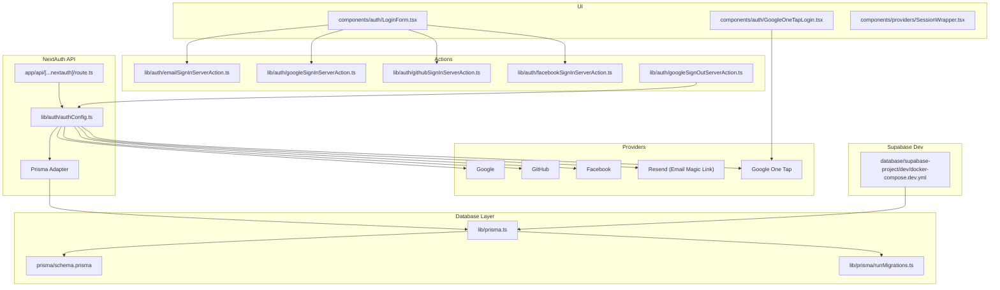
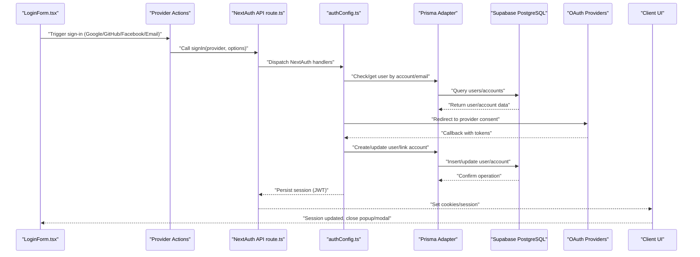
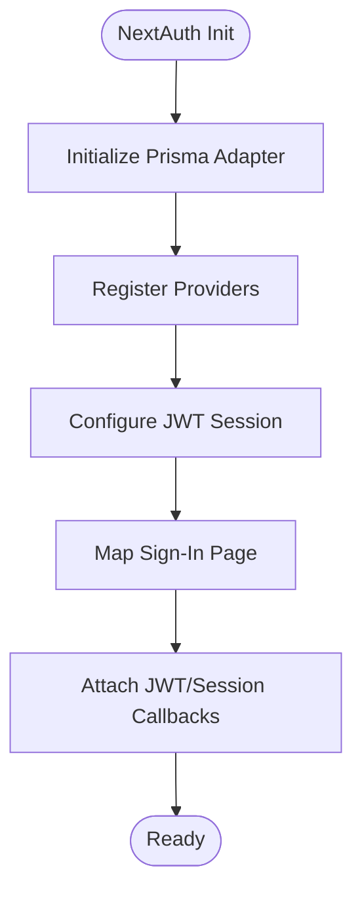
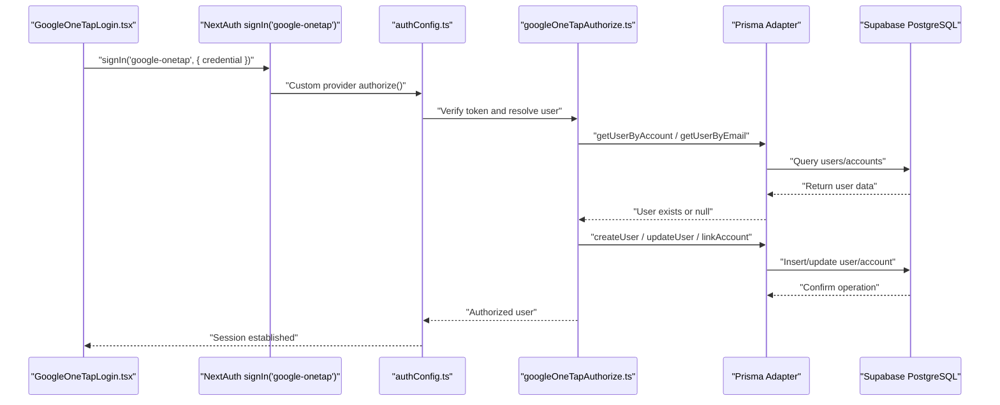
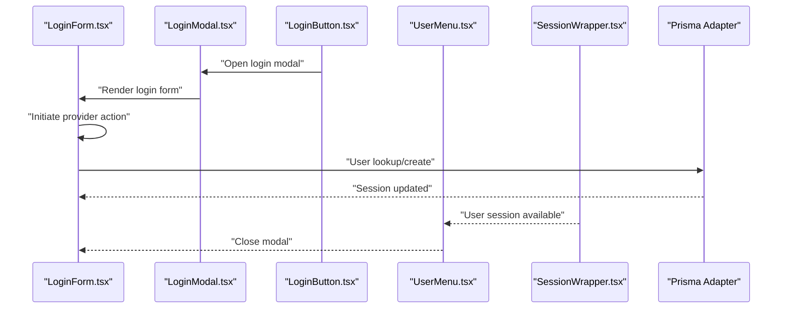
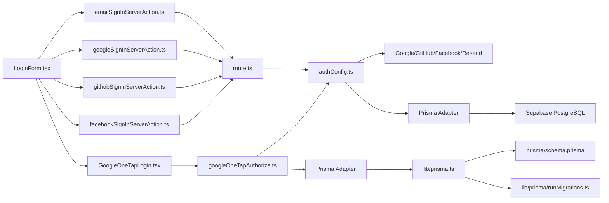

# Authentication & Authorization

<cite>
**Referenced Files in This Document**
- [authConfig.ts](file://lib/auth/authConfig.ts)
- [route.ts](file://app/api/[...nextauth]/route.ts)
- [emailSignInServerAction.ts](file://lib/auth/emailSignInServerAction.ts)
- [googleSignInServerAction.ts](file://lib/auth/googleSignInServerAction.ts)
- [githubSignInServerAction.ts](file://lib/auth/githubSignInServerAction.ts)
- [facebookSignInServerAction.ts](file://lib/auth/facebookSignInServerAction.ts)
- [googleSignOutServerAction.ts](file://lib/auth/googleSignOutServerAction.ts)
- [googleOneTapAuthorize.ts](file://lib/auth/googleOneTapAuthorize.ts)
- [LoginForm.tsx](file://components/auth/LoginForm.tsx)
- [GoogleOneTapLogin.tsx](file://components/auth/GoogleOneTapLogin.tsx)
- [SessionWrapper.tsx](file://components/providers/SessionWrapper.tsx)
- [prisma.ts](file://lib/prisma.ts)
- [schema.prisma](file://prisma/schema.prisma)
- [runMigrations.ts](file://lib/prisma/runMigrations.ts)
- [docker-compose.dev.yml](file://database/supabase-project/dev/docker-compose.dev.yml)
</cite>

## Update Summary
**Changes Made**
- Updated architecture to reflect migration from Firebase to Supabase with Prisma adapter
- Added comprehensive Prisma adapter configuration and PostgreSQL database setup
- Enhanced Google One Tap integration with Prisma adapter user management
- Updated database schema documentation with role-based access control
- Added Supabase development environment configuration
- Revised authentication flow to use Prisma adapter for user persistence

## Table of Contents
1. [Introduction](#introduction)
2. [Project Structure](#project-structure)
3. [Core Components](#core-components)
4. [Architecture Overview](#architecture-overview)
5. [Detailed Component Analysis](#detailed-component-analysis)
6. [Database Schema & Prisma Adapter](#database-schema--prisma-adapter)
7. [Supabase Integration](#supabase-integration)
8. [Dependency Analysis](#dependency-analysis)
9. [Performance Considerations](#performance-considerations)
10. [Troubleshooting Guide](#troubleshooting-guide)
11. [Conclusion](#conclusion)

## Introduction
This document explains the authentication and authorization system built with NextAuth v5 in a Next.js App Router application. The system has migrated from Firebase to Supabase with a Prisma adapter, providing robust user management with role-based access control. It covers multi-provider OAuth (Google, GitHub, Facebook), email magic-link authentication via Resend, session management with JWT strategy, and integration points across the UI. The system now includes comprehensive Google One Tap flow, custom server actions, and practical troubleshooting guidance for common issues.

## Project Structure
Authentication is centered around:
- NextAuth configuration with Prisma adapter and API routes
- Provider-specific server actions for initiating sign-in/sign-out
- Frontend components for login UI, modal, and session-aware menus
- Prisma adapter for database operations and user persistence
- Supabase development environment with PostgreSQL database

**Diagram sources**
- [route.ts](file://app/api/[...nextauth]/route.ts#L1-L4)
- [authConfig.ts](file://lib/auth/authConfig.ts#L1-L83)
- [prisma.ts](file://lib/prisma.ts#L1-L26)
- [schema.prisma](file://prisma/schema.prisma#L1-L143)
- [runMigrations.ts](file://lib/prisma/runMigrations.ts#L1-L69)
- [docker-compose.dev.yml](file://database/supabase-project/dev/docker-compose.dev.yml#L1-L45)
- [emailSignInServerAction.ts](file://lib/auth/emailSignInServerAction.ts#L1-L12)
- [googleSignInServerAction.ts](file://lib/auth/googleSignInServerAction.ts#L1-L12)
- [githubSignInServerAction.ts](file://lib/auth/githubSignInServerAction.ts#L1-L11)
- [facebookSignInServerAction.ts](file://lib/auth/facebookSignInServerAction.ts#L1-L11)
- [googleSignOutServerAction.ts](file://lib/auth/googleSignOutServerAction.ts#L1-L11)
- [LoginForm.tsx](file://components/auth/LoginForm.tsx#L1-L139)
- [GoogleOneTapLogin.tsx](file://components/auth/GoogleOneTapLogin.tsx#L1-L84)

**Section sources**
- [authConfig.ts](file://lib/auth/authConfig.ts#L1-L83)
- [route.ts](file://app/api/[...nextauth]/route.ts#L1-L4)
- [prisma.ts](file://lib/prisma.ts#L1-L26)
- [schema.prisma](file://prisma/schema.prisma#L1-L143)
- [runMigrations.ts](file://lib/prisma/runMigrations.ts#L1-L69)
- [docker-compose.dev.yml](file://database/supabase-project/dev/docker-compose.dev.yml#L1-L45)

## Core Components
- NextAuth configuration defines providers, session strategy, pages, and callbacks with Prisma adapter integration
- API route exposes NextAuth handlers for GET/POST with centralized authentication logic
- Prisma adapter manages database operations for user accounts, sessions, and OAuth linking
- Provider actions encapsulate sign-in/sign-out for Google, GitHub, Facebook, and email magic link
- Frontend components render login UI, handle popups, and manage session state with Supabase database integration
- Google One Tap integrates via a custom provider with Prisma adapter user management and account linking

Key responsibilities:
- Centralized provider configuration with Prisma adapter for user persistence
- Email magic-link initiation via Resend with database-backed token management
- OAuth initiation and fallback behavior for popups with database account linking
- Client-side session updates and menu rendering with Supabase user data
- Google One Tap token verification with automatic user creation and account linking

**Section sources**
- [authConfig.ts](file://lib/auth/authConfig.ts#L14-L83)
- [route.ts](file://app/api/[...nextauth]/route.ts#L1-L4)
- [prisma.ts](file://lib/prisma.ts#L1-L26)
- [googleOneTapAuthorize.ts](file://lib/auth/googleOneTapAuthorize.ts#L1-L100)
- [schema.prisma](file://prisma/schema.prisma#L19-L34)

## Architecture Overview
The authentication flow leverages NextAuth v5 with a JWT session strategy and Prisma adapter for database operations. The UI triggers server actions to initiate OAuth or email magic links. The NextAuth API handles provider callbacks, persists sessions through Prisma adapter, and enriches tokens and sessions with user identifiers stored in Supabase PostgreSQL database.

**Diagram sources**
- [LoginForm.tsx](file://components/auth/LoginForm.tsx#L18-L50)
- [googleSignInServerAction.ts](file://lib/auth/googleSignInServerAction.ts#L5-L11)
- [githubSignInServerAction.ts](file://lib/auth/githubSignInServerAction.ts#L4-L10)
- [facebookSignInServerAction.ts](file://lib/auth/facebookSignInServerAction.ts#L4-L10)
- [emailSignInServerAction.ts](file://lib/auth/emailSignInServerAction.ts#L5-L11)
- [route.ts](file://app/api/[...nextauth]/route.ts#L1-L4)
- [authConfig.ts](file://lib/auth/authConfig.ts#L14-L83)
- [googleOneTapAuthorize.ts](file://lib/auth/googleOneTapAuthorize.ts#L40-L87)

## Detailed Component Analysis

### NextAuth v5 Configuration with Prisma Adapter
- Strategy: JWT with 6-month max age using Prisma adapter for database operations
- Providers: Google, GitHub, Facebook, Resend (email magic link), and a custom Google One Tap provider
- Pages: Custom sign-in page mapped to a popup route
- Callbacks: Inject user id into JWT and session user object with Prisma adapter integration
- Database: PostgreSQL via Prisma adapter with Supabase connection

**Diagram sources**
- [authConfig.ts](file://lib/auth/authConfig.ts#L14-L83)

**Section sources**
- [authConfig.ts](file://lib/auth/authConfig.ts#L14-L83)

### NextAuth API Route
- Exposes NextAuth handlers for GET/POST to support OAuth flows and session management
- Routes all authentication requests through centralized NextAuth configuration

**Section sources**
- [route.ts](file://app/api/[...nextauth]/route.ts#L1-L4)

### Prisma Adapter Configuration
- PostgreSQL adapter using PrismaPg with connection pooling
- Direct database connection via Supabase URL environment variable
- Global singleton pattern for Prisma client instance management
- Connection pool optimization for production environments

**Section sources**
- [prisma.ts](file://lib/prisma.ts#L1-L26)

### Email Magic Link (Resend) Server Action
- Initiates an email-based sign-in using the Resend provider
- Integrates with Prisma adapter for user lookup and token management
- Redirects to a callback page after the user clicks the link

**Section sources**
- [emailSignInServerAction.ts](file://lib/auth/emailSignInServerAction.ts#L1-L12)

### OAuth Provider Server Actions
- Google, GitHub, and Facebook actions wrap NextAuth's signIn with Prisma adapter integration
- Trigger provider flows with redirect to home page upon success
- Handle database operations for user account linking and updates

**Section sources**
- [googleSignInServerAction.ts](file://lib/auth/googleSignInServerAction.ts#L1-L12)
- [githubSignInServerAction.ts](file://lib/auth/githubSignInServerAction.ts#L1-L11)
- [facebookSignInServerAction.ts](file://lib/auth/facebookSignInServerAction.ts#L1-L11)

### Google One Tap Integration with Prisma Adapter
- Frontend component initializes the Google Identity Services client and triggers a sign-in with the custom "google-onetap" provider
- Backend authorization verifies the ID token, resolves or creates a user via Prisma adapter
- Links OAuth account and returns a user object for session creation with database persistence

**Diagram sources**
- [GoogleOneTapLogin.tsx](file://components/auth/GoogleOneTapLogin.tsx#L28-L33)
- [authConfig.ts](file://lib/auth/authConfig.ts#L33-L42)
- [googleOneTapAuthorize.ts](file://lib/auth/googleOneTapAuthorize.ts#L18-L99)

**Section sources**
- [GoogleOneTapLogin.tsx](file://components/auth/GoogleOneTapLogin.tsx#L22-L63)
- [authConfig.ts](file://lib/auth/authConfig.ts#L26-L43)
- [googleOneTapAuthorize.ts](file://lib/auth/googleOneTapAuthorize.ts#L18-L99)

### Frontend Login UI and Session Awareness
- Login modal and form present social providers and an email option
- Popup fallback behavior ensures sign-in continues even if popups are blocked
- Session updates are triggered after successful sign-in to refresh client state
- Integrates with Prisma adapter for user data management

**Diagram sources**
- [LoginForm.tsx](file://components/auth/LoginForm.tsx#L18-L50)
- [SessionWrapper.tsx](file://components/providers/SessionWrapper.tsx#L8-L10)

**Section sources**
- [LoginForm.tsx](file://components/auth/LoginForm.tsx#L11-L64)
- [SessionWrapper.tsx](file://components/providers/SessionWrapper.tsx#L8-L10)

### Sign-Out Flow
- A dedicated server action invokes NextAuth's signOut to terminate the session
- Integrates with Prisma adapter for session cleanup and database operations

**Section sources**
- [googleSignOutServerAction.ts](file://lib/auth/googleSignOutServerAction.ts#L1-L11)

## Database Schema & Prisma Adapter

### Role-Based Access Control
The authentication system implements role-based access control through the AuthRole enum with USER and ADMIN roles. The User model includes a role field with USER as the default value, enabling fine-grained permission management across the application.

**Section sources**
- [schema.prisma](file://prisma/schema.prisma#L12-L17)
- [schema.prisma](file://prisma/schema.prisma#L25)

### Prisma Adapter User Management
The Prisma adapter provides comprehensive user management capabilities:
- Automatic user creation and updates during OAuth flows
- Account linking for multiple provider integrations
- Session management with JWT token persistence
- Verification token handling for email authentication

**Section sources**
- [googleOneTapAuthorize.ts](file://lib/auth/googleOneTapAuthorize.ts#L54-L87)
- [authConfig.ts](file://lib/auth/authConfig.ts#L64-L81)

### Database Schema Overview
The Prisma schema defines the core authentication entities:
- User model with UUID primary keys, email uniqueness, and role enumeration
- Account model for OAuth provider associations with token storage
- VerificationToken model for email magic link functionality
- Relationships between users, accounts, and XP tracking systems

**Section sources**
- [schema.prisma](file://prisma/schema.prisma#L19-L68)

## Supabase Integration

### Development Environment Setup
The system uses Supabase as the backend service with Docker Compose for local development. The development environment includes:
- PostgreSQL database with proper seeding and initialization
- Supabase Auth service with email and OAuth provider support
- Inbucket mail server for testing email functionality
- Database volume mounting for persistent data storage

**Section sources**
- [docker-compose.dev.yml](file://database/supabase-project/dev/docker-compose.dev.yml#L1-L45)

### Prisma Migration Management
The system includes automated migration management:
- Dynamic migration execution on startup
- Support for both migration-based and push-based approaches
- Graceful fallback mechanisms for development environments
- Database availability detection and error handling

**Section sources**
- [runMigrations.ts](file://lib/prisma/runMigrations.ts#L1-L69)

### Database Connection Configuration
Connection to Supabase is managed through:
- Environment variable-based connection strings
- PrismaPg adapter for PostgreSQL compatibility
- Connection pooling for optimal performance
- Global singleton pattern for client instance management

**Section sources**
- [prisma.ts](file://lib/prisma.ts#L1-L26)

## Dependency Analysis
- UI components depend on NextAuth's client hooks for session state and on server actions for initiating flows
- Server actions depend on NextAuth's signIn/signOut exported from the central configuration
- Prisma adapter provides database abstraction layer for all authentication operations
- Google One Tap flow depends on custom provider and dedicated authorization utility with Prisma adapter integration
- Supabase development environment provides PostgreSQL database infrastructure

**Diagram sources**
- [LoginForm.tsx](file://components/auth/LoginForm.tsx#L3-L6)
- [emailSignInServerAction.ts](file://lib/auth/emailSignInServerAction.ts#L3)
- [googleSignInServerAction.ts](file://lib/auth/googleSignInServerAction.ts#L3)
- [githubSignInServerAction.ts](file://lib/auth/githubSignInServerAction.ts#L2)
- [facebookSignInServerAction.ts](file://lib/auth/facebookSignInServerAction.ts#L2)
- [GoogleOneTapLogin.tsx](file://components/auth/GoogleOneTapLogin.tsx#L3)
- [googleOneTapAuthorize.ts](file://lib/auth/googleOneTapAuthorize.ts#L1-L16)
- [route.ts](file://app/api/[...nextauth]/route.ts#L1)
- [authConfig.ts](file://lib/auth/authConfig.ts#L14-L83)
- [prisma.ts](file://lib/prisma.ts#L1-L26)
- [schema.prisma](file://prisma/schema.prisma#L1-L143)
- [runMigrations.ts](file://lib/prisma/runMigrations.ts#L1-L69)

**Section sources**
- [LoginForm.tsx](file://components/auth/LoginForm.tsx#L3-L6)
- [googleSignInServerAction.ts](file://lib/auth/googleSignInServerAction.ts#L3)
- [githubSignInServerAction.ts](file://lib/auth/githubSignInServerAction.ts#L2)
- [facebookSignInServerAction.ts](file://lib/auth/facebookSignInServerAction.ts#L2)
- [emailSignInServerAction.ts](file://lib/auth/emailSignInServerAction.ts#L3)
- [GoogleOneTapLogin.tsx](file://components/auth/GoogleOneTapLogin.tsx#L3)
- [googleOneTapAuthorize.ts](file://lib/auth/googleOneTapAuthorize.ts#L1-L16)
- [route.ts](file://app/api/[...nextauth]/route.ts#L1)
- [authConfig.ts](file://lib/auth/authConfig.ts#L14-L83)
- [prisma.ts](file://lib/prisma.ts#L1-L26)
- [schema.prisma](file://prisma/schema.prisma#L1-L143)
- [runMigrations.ts](file://lib/prisma/runMigrations.ts#L1-L69)

## Performance Considerations
- Session strategy: JWT reduces database queries for session validation but increases cookie size; ensure token payloads remain minimal
- Prisma adapter optimization: Connection pooling and efficient query patterns minimize database overhead
- Refetch behavior: Disable refetch on window focus to reduce unnecessary network requests during navigation
- Popup fallback: Prefer redirect-based fallback when popups are blocked to avoid repeated polling or message event overhead
- Token verification: Google One Tap verification occurs server-side with Prisma adapter caching; optimize verified claims where appropriate
- Database connections: PrismaPg adapter provides connection pooling for better performance in production environments

## Troubleshooting Guide
Common issues and resolutions:
- Popup blocked: The login form falls back to redirect-based sign-in when popups are disabled or blocked. Verify provider URLs and callback routing.
- Session not updating after sign-in: Ensure the client-side session is refreshed after receiving a success message from the popup.
- Google One Tap errors: Confirm client ID and audience match backend environment variables; check token verification logs and Prisma adapter user linking behavior.
- Email magic link failures: Validate Resend API key and sender configuration; confirm callback URL and sign-in page accessibility.
- Database connection issues: Verify Supabase connection string and Prisma adapter configuration; check migration status and database availability.
- Prisma adapter errors: Ensure proper database schema initialization and check for concurrent account linking conflicts.
- Redirect loops: Review provider callback URLs and NextAuth pages.signIn configuration to prevent infinite redirects.
- Role-based access issues: Verify user role assignments in the database and ensure proper session callback implementation.

**Section sources**
- [LoginForm.tsx](file://components/auth/LoginForm.tsx#L30-L35)
- [GoogleOneTapLogin.tsx](file://components/auth/GoogleOneTapLogin.tsx#L36-L52)
- [authConfig.ts](file://lib/auth/authConfig.ts#L23-L25)
- [googleOneTapAuthorize.ts](file://lib/auth/googleOneTapAuthorize.ts#L95-L98)
- [runMigrations.ts](file://lib/prisma/runMigrations.ts#L47-L50)

## Conclusion
The authentication system integrates NextAuth v5 with Prisma adapter and Supabase PostgreSQL database, providing a robust foundation for multi-provider authentication with role-based access control. The migration from Firebase to Supabase with Prisma adapter enhances scalability, provides better database management, and enables advanced features like role-based permissions. The system uses JWT sessions, centralized configuration, and thin server actions to orchestrate flows while maintaining responsive UI and comprehensive session handling across the application. The modular design supports easy extension to additional providers and maintains strong security practices with proper database integration.