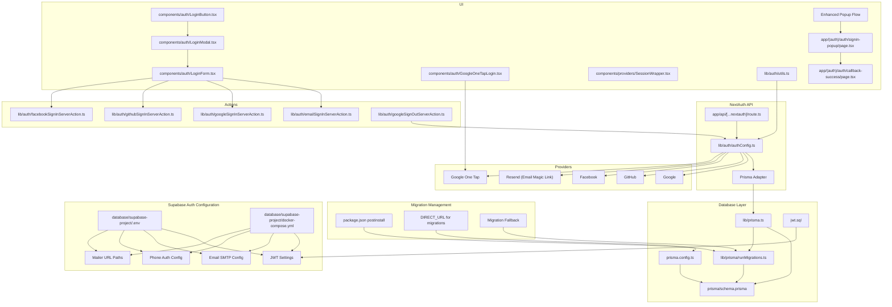
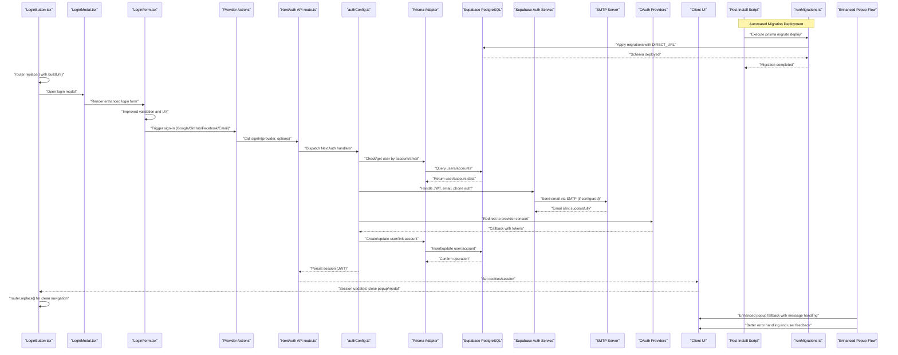
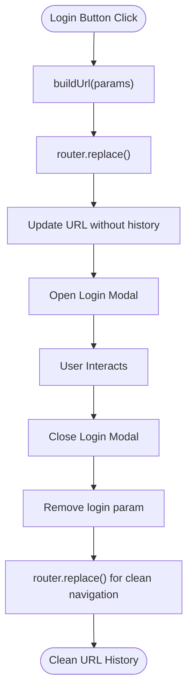
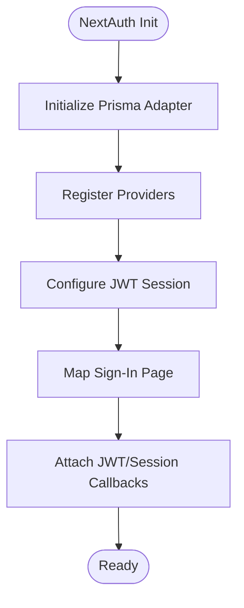
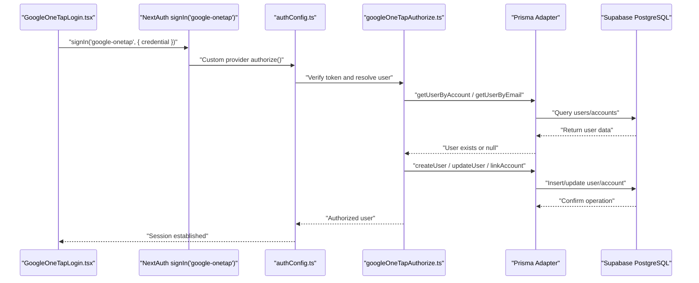
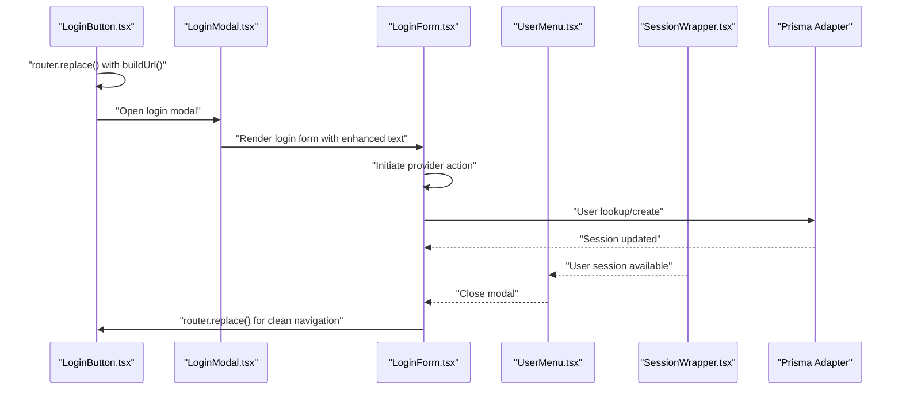
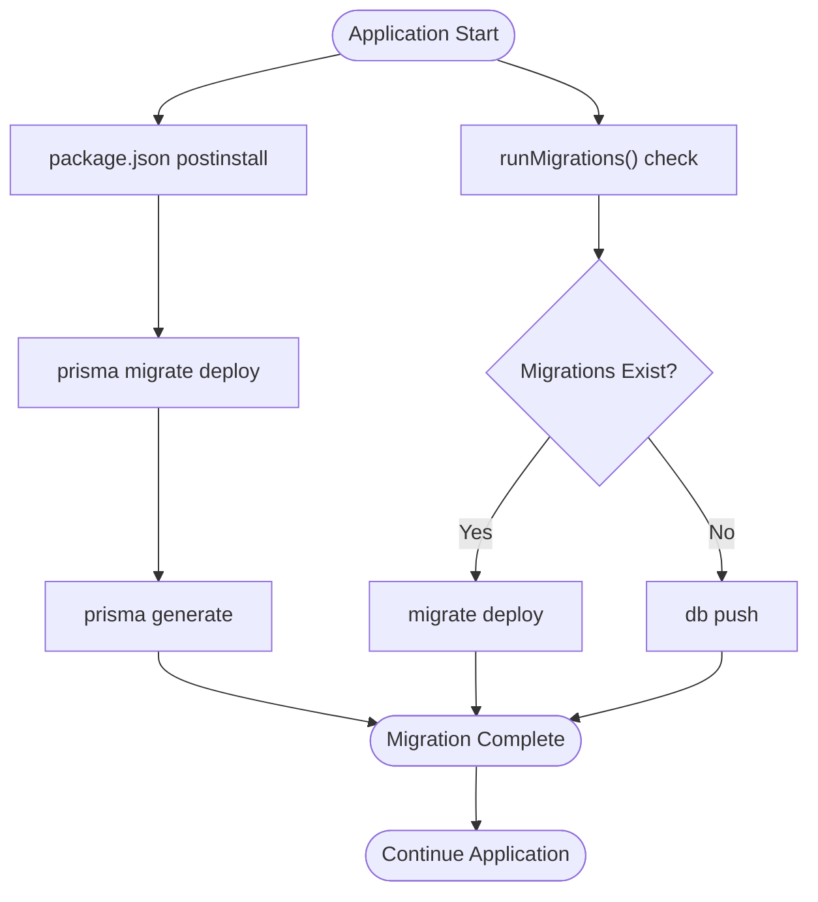
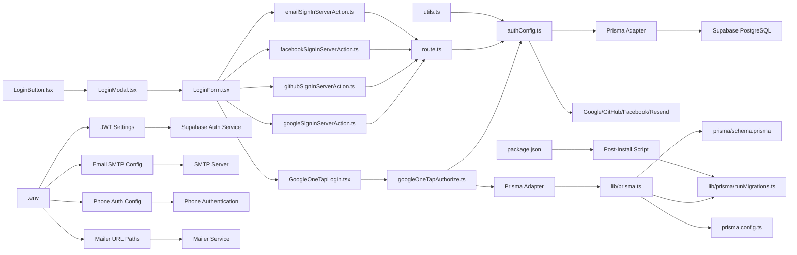

# Authentication & Authorization

<cite>
**Referenced Files in This Document**
- [authConfig.ts](file://lib/auth/authConfig.ts)
- [route.ts](file://app/api/[...nextauth]/route.ts)
- [emailSignInServerAction.ts](file://lib/auth/emailSignInServerAction.ts)
- [googleSignInServerAction.ts](file://lib/auth/googleSignInServerAction.ts)
- [githubSignInServerAction.ts](file://lib/auth/githubSignInServerAction.ts)
- [facebookSignInServerAction.ts](file://lib/auth/facebookSignInServerAction.ts)
- [googleSignOutServerAction.ts](file://lib/auth/googleSignOutServerAction.ts)
- [googleOneTapAuthorize.ts](file://lib/auth/googleOneTapAuthorize.ts)
- [LoginForm.tsx](file://components/auth/LoginForm.tsx)
- [LoginButton.tsx](file://components/auth/LoginButton.tsx)
- [GoogleOneTapLogin.tsx](file://components/auth/GoogleOneTapLogin.tsx)
- [LoginModal.tsx](file://components/auth/LoginModal.tsx)
- [SessionWrapper.tsx](file://components/providers/SessionWrapper.tsx)
- [utils.ts](file://lib/auth/utils.ts)
- [prisma.ts](file://lib/prisma.ts)
- [schema.prisma](file://prisma/schema.prisma)
- [runMigrations.ts](file://lib/prisma/runMigrations.ts)
- [prisma.config.ts](file://prisma.config.ts)
- [package.json](file://package.json)
- [docker-compose.dev.yml](file://database/supabase-project/dev/docker-compose.dev.yml)
- [.env](file://database/supabase-project/.env)
- [docker-compose.yml](file://database/supabase-project/docker-compose.yml)
- [jwt.sql](file://database/supabase-project/volumes/db/jwt.sql)
- [signin-popup page.tsx](file://app/(auth)/auth/signin-popup/page.tsx)
- [callback-success page.tsx](file://app/(auth)/auth/callback-success/page.tsx)
</cite>

## Update Summary
**Changes Made**
- Enhanced LoginForm.tsx with improved form handling, validation, and user experience patterns
- Updated LoginModal.tsx to integrate seamlessly with the enhanced LoginForm component
- Improved authentication flow with better popup fallback handling and session management
- Enhanced navigation patterns using router.replace() for cleaner URL history management
- Refined email authentication with improved magic link messaging and validation
- Strengthened security considerations with better popup handling and message-based communication

## Table of Contents
1. [Introduction](#introduction)
2. [Project Structure](#project-structure)
3. [Core Components](#core-components)
4. [Architecture Overview](#architecture-overview)
5. [Detailed Component Analysis](#detailed-component-analysis)
6. [Database Schema & Prisma Adapter](#database-schema--prisma-adapter)
7. [Supabase Integration](#supabase-integration)
8. [Comprehensive Environment Configuration](#comprehensive-environment-configuration)
9. [Dependency Analysis](#dependency-analysis)
10. [Performance Considerations](#performance-considerations)
11. [Troubleshooting Guide](#troubleshooting-guide)
12. [Conclusion](#conclusion)

## Introduction
This document explains the authentication and authorization system built with NextAuth v5 in a Next.js App Router application. The system has migrated from Firebase to Supabase with a Prisma adapter, providing robust user management with role-based access control. It covers multi-provider OAuth (Google, GitHub, Facebook), email magic-link authentication via Resend, session management with JWT strategy, and integration points across the UI. The system now includes comprehensive Google One Tap flow, custom server actions, improved navigation with `router.replace()`, cleaner URL construction, and practical troubleshooting guidance for common issues.

**Updated** Enhanced with major improvements to authentication components including improved form handling in LoginForm.tsx and LoginModal.tsx with better user experience patterns, enhanced popup fallback behavior, and refined authentication flow patterns.

## Project Structure
Authentication is centered around:
- NextAuth configuration with Prisma adapter and API routes
- Provider-specific server actions for initiating sign-in/sign-out
- Frontend components for login UI, modal, and session-aware menus with enhanced navigation
- Prisma adapter for database operations and user persistence
- Supabase development environment with PostgreSQL database and comprehensive authentication configuration
- Automated migration management with fallback mechanisms
- Enhanced JWT configuration with admin roles and custom settings
- SMTP-enabled email authentication with comprehensive mailer paths
- Phone authentication support with autoconfirmation capabilities

```mermaid
graph TB
subgraph "NextAuth API"
NA_ROUTE["app/api/[...nextauth]/route.ts"]
NA_CONFIG["lib/auth/authConfig.ts"]
PRISMA_ADAPTER["Prisma Adapter"]
end
subgraph "Database Layer"
PRISMA_CLIENT["lib/prisma.ts"]
SCHEMA["prisma/schema.prisma"]
MIGRATIONS["lib/prisma/runMigrations.ts"]
CONFIG["prisma.config.ts"]
JWT_SQL["jwt.sql"]
end
subgraph "Migration Management"
POSTINSTALL["package.json postinstall"]
DIRECTURL["DIRECT_URL for migrations"]
FALLBACK["Migration Fallback"]
end
subgraph "Supabase Auth Configuration"
ENV["database/supabase-project/.env"]
DOCKER["database/supabase-project/docker-compose.yml"]
JWT_CONFIG["JWT Settings"]
EMAIL_CONFIG["Email SMTP Config"]
PHONE_CONFIG["Phone Auth Config"]
MAILER_CONFIG["Mailer URL Paths"]
end
subgraph "Providers"
GOOGLE["Google"]
GITHUB["GitHub"]
FACEBOOK["Facebook"]
RESEND["Resend (Email Magic Link)"]
ONETAP["Google One Tap"]
end
subgraph "UI"
LOGINBUTTON["components/auth/LoginButton.tsx"]
LOGINFORM["components/auth/LoginForm.tsx"]
LOGINMODAL["components/auth/LoginModal.tsx"]
GOOGLETAP["components/auth/GoogleOneTapLogin.tsx"]
SESSIONWRAP["components/providers/SessionWrapper.tsx"]
UTILS["lib/auth/utils.ts"]
ENDOFPAGE["Enhanced Popup Flow"]
SIGNINPOPUP["app/(auth)/auth/signin-popup/page.tsx"]
CALLBACKSUCCESS["app/(auth)/auth/callback-success/page.tsx"]
end
subgraph "Actions"
EMAILACTION["lib/auth/emailSignInServerAction.ts"]
GOOGLEACTION["lib/auth/googleSignInServerAction.ts"]
GITHUBACTION["lib/auth/githubSignInServerAction.ts"]
FACEBOOKACTION["lib/auth/facebookSignInServerAction.ts"]
GOOGLEOUT["lib/auth/googleSignOutServerAction.ts"]
end
POSTINSTALL --> MIGRATIONS
DIRECTURL --> CONFIG
FALLBACK --> MIGRATIONS
NA_ROUTE --> NA_CONFIG
NA_CONFIG --> PRISMA_ADAPTER
PRISMA_ADAPTER --> PRISMA_CLIENT
PRISMA_CLIENT --> SCHEMA
PRISMA_CLIENT --> MIGRATIONS
CONFIG --> SCHEMA
MIGRATIONS --> SCHEMA
ENV --> JWT_CONFIG
ENV --> EMAIL_CONFIG
ENV --> PHONE_CONFIG
ENV --> MAILER_CONFIG
DOCKER --> JWT_CONFIG
DOCKER --> EMAIL_CONFIG
DOCKER --> PHONE_CONFIG
DOCKER --> MAILER_CONFIG
JWT_SQL --> JWT_CONFIG
NA_CONFIG --> GOOGLE
NA_CONFIG --> GITHUB
NA_CONFIG --> FACEBOOK
NA_CONFIG --> RESEND
NA_CONFIG --> ONETAP
LOGINBUTTON --> LOGINMODAL
LOGINMODAL --> LOGINFORM
LOGINFORM --> EMAILACTION
LOGINFORM --> GOOGLEACTION
LOGINFORM --> GITHUBACTION
LOGINFORM --> FACEBOOKACTION
GOOGLETAP --> ONETAP
GOOGLEOUT --> NA_CONFIG
UTILS --> NA_CONFIG
SIGNINPOPUP --> CALLBACKSUCCESS
ENDOFPAGE --> SIGNINPOPUP
```

**Diagram sources**
- [route.ts](file://app/api/[...nextauth]/route.ts#L1-L4)
- [authConfig.ts](file://lib/auth/authConfig.ts#L1-L83)
- [prisma.ts](file://lib/prisma.ts#L1-L26)
- [schema.prisma](file://prisma/schema.prisma#L1-L143)
- [runMigrations.ts](file://lib/prisma/runMigrations.ts#L1-L69)
- [prisma.config.ts](file://prisma.config.ts#L1-L19)
- [package.json](file://package.json#L5-L15)
- [docker-compose.dev.yml](file://database/supabase-project/dev/docker-compose.dev.yml#L1-L45)
- [emailSignInServerAction.ts](file://lib/auth/emailSignInServerAction.ts#L1-L12)
- [googleSignInServerAction.ts](file://lib/auth/googleSignInServerAction.ts#L1-L12)
- [githubSignInServerAction.ts](file://lib/auth/githubSignInServerAction.ts#L1-L11)
- [facebookSignInServerAction.ts](file://lib/auth/facebookSignInServerAction.ts#L1-L11)
- [googleSignOutServerAction.ts](file://lib/auth/googleSignOutServerAction.ts#L1-L11)
- [LoginForm.tsx](file://components/auth/LoginForm.tsx#L1-L147)
- [LoginButton.tsx](file://components/auth/LoginButton.tsx#L1-L42)
- [GoogleOneTapLogin.tsx](file://components/auth/GoogleOneTapLogin.tsx#L1-L84)
- [utils.ts](file://lib/auth/utils.ts#L1-L12)
- [.env](file://database/supabase-project/.env#L62-L89)
- [docker-compose.yml](file://database/supabase-project/docker-compose.yml#L126-L153)
- [jwt.sql](file://database/supabase-project/volumes/db/jwt.sql#L1-L5)
- [signin-popup page.tsx](file://app/(auth)/auth/signin-popup/page.tsx#L1-L28)
- [callback-success page.tsx](file://app/(auth)/auth/callback-success/page.tsx#L1-L18)

**Section sources**
- [authConfig.ts](file://lib/auth/authConfig.ts#L1-L83)
- [route.ts](file://app/api/[...nextauth]/route.ts#L1-L4)
- [prisma.ts](file://lib/prisma.ts#L1-L26)
- [schema.prisma](file://prisma/schema.prisma#L1-L143)
- [runMigrations.ts](file://lib/prisma/runMigrations.ts#L1-L69)
- [prisma.config.ts](file://prisma.config.ts#L1-L19)
- [package.json](file://package.json#L5-L15)
- [docker-compose.dev.yml](file://database/supabase-project/dev/docker-compose.dev.yml#L1-L45)

## Core Components
- NextAuth configuration defines providers, session strategy, pages, and callbacks with Prisma adapter integration
- API route exposes NextAuth handlers for GET/POST with centralized authentication logic
- Prisma adapter manages database operations for user accounts, sessions, and OAuth linking
- Provider actions encapsulate sign-in/sign-out for Google, GitHub, Facebook, and email magic link
- Frontend components render login UI, handle popups, manage session state with Supabase database integration, and provide enhanced navigation
- Google One Tap integrates via a custom provider with Prisma adapter user management and account linking
- Session utilities provide consistent session access across the application
- Automated migration system handles database schema deployment and fallback mechanisms
- **Updated** Enhanced LoginForm component with improved form handling, validation, and user experience patterns
- **Updated** Enhanced LoginModal component with seamless integration and better state management
- **Updated** Improved popup fallback behavior with better error handling and user feedback
- **Updated** Refined authentication flow with cleaner navigation using router.replace()

Key responsibilities:
- Centralized provider configuration with Prisma adapter for user persistence
- Email magic-link initiation via Resend with database-backed token management and improved callback URL handling
- OAuth initiation and fallback behavior for popups with database account linking and cleaner navigation
- Client-side session updates and menu rendering with Supabase user data
- Google One Tap token verification with automatic user creation and account linking
- Enhanced URL navigation using `router.replace()` for better browser history management
- Cleaner URL construction with `buildUrl` function for consistent navigation behavior
- Automated Prisma migration deployment through post-install script
- Comprehensive database connection management with DIRECT_URL for migrations
- Fallback mechanisms for migration failures with graceful degradation
- **Updated** Advanced JWT configuration with admin roles, audience, and custom expiration settings
- **Updated** SMTP-enabled email authentication with comprehensive mailer URL path configuration
- **Updated** Phone authentication support with autoconfirmation capabilities
- **Updated** Database-level JWT settings applied through jwt.sql script
- **Updated** Enhanced form validation and user experience in LoginForm component
- **Updated** Improved modal integration and state management in LoginModal component

**Section sources**
- [authConfig.ts](file://lib/auth/authConfig.ts#L14-L83)
- [route.ts](file://app/api/[...nextauth]/route.ts#L1-L4)
- [prisma.ts](file://lib/prisma.ts#L1-L26)
- [googleOneTapAuthorize.ts](file://lib/auth/googleOneTapAuthorize.ts#L1-L100)
- [schema.prisma](file://prisma/schema.prisma#L19-L34)
- [utils.ts](file://lib/auth/utils.ts#L1-L12)
- [runMigrations.ts](file://lib/prisma/runMigrations.ts#L1-L69)
- [prisma.config.ts](file://prisma.config.ts#L10-L19)
- [.env](file://database/supabase-project/.env#L62-L89)
- [docker-compose.yml](file://database/supabase-project/docker-compose.yml#L126-L153)
- [LoginForm.tsx](file://components/auth/LoginForm.tsx#L1-L147)
- [LoginModal.tsx](file://components/auth/LoginModal.tsx#L1-L17)

## Architecture Overview
The authentication flow leverages NextAuth v5 with a JWT session strategy and Prisma adapter for database operations. The UI triggers server actions to initiate OAuth or email magic links. The NextAuth API handles provider callbacks, persists sessions through Prisma adapter, and enriches tokens and sessions with user identifiers stored in Supabase PostgreSQL database. Enhanced navigation uses `router.replace()` for cleaner URL history management and improved user experience.

**Updated** The system now includes enhanced authentication components with improved form handling, better popup fallback behavior, and refined navigation patterns for superior user experience.

```mermaid
sequenceDiagram
participant UI as "LoginButton.tsx"
participant Modal as "LoginModal.tsx"
participant Form as "LoginForm.tsx"
participant Actions as "Provider Actions"
participant NA_API as "NextAuth API route.ts"
participant NA_Config as "authConfig.ts"
participant Adapter as "Prisma Adapter"
participant DB as "Supabase PostgreSQL"
participant SupabaseAuth as "Supabase Auth Service"
participant SMTP as "SMTP Server"
participant Providers as "OAuth Providers"
participant Client as "Client UI"
participant PostInstall as "Post-Install Script"
participant Migrations as "runMigrations.ts"
participant PopupFlow as "Enhanced Popup Flow"
Note over PostInstall,Migrations : Automated Migration Deployment
PostInstall->>Migrations : "Execute prisma migrate deploy"
Migrations->>DB : "Apply migrations with DIRECT_URL"
DB-->>Migrations : "Schema deployed"
Migrations-->>PostInstall : "Migration completed"
UI->>UI : "router.replace() with buildUrl()"
UI->>Modal : "Open login modal"
Modal->>Form : "Render enhanced login form"
Form->>Form : "Improved validation and UX"
Form->>Actions : "Trigger sign-in (Google/GitHub/Facebook/Email)"
Actions->>NA_API : "Call signIn(provider, options)"
NA_API->>NA_Config : "Dispatch NextAuth handlers"
NA_Config->>Adapter : "Check/get user by account/email"
Adapter->>DB : "Query users/accounts"
DB-->>Adapter : "Return user/account data"
NA_Config->>SupabaseAuth : "Handle JWT, email, phone auth"
SupabaseAuth->>SMTP : "Send email via SMTP (if configured)"
SMTP-->>SupabaseAuth : "Email sent successfully"
NA_Config->>Providers : "Redirect to provider consent"
Providers-->>NA_Config : "Callback with tokens"
NA_Config->>Adapter : "Create/update user/link account"
Adapter->>DB : "Insert/update user/account"
DB-->>Adapter : "Confirm operation"
NA_Config-->>NA_API : "Persist session (JWT)"
NA_API-->>Client : "Set cookies/session"
Client-->>UI : "Session updated, close popup/modal"
UI->>UI : "router.replace() for clean navigation"
PopupFlow->>Client : "Enhanced popup fallback with message handling"
PopupFlow->>Client : "Better error handling and user feedback"
```

**Diagram sources**
- [LoginButton.tsx](file://components/auth/LoginButton.tsx#L16-L31)
- [LoginModal.tsx](file://components/auth/LoginModal.tsx#L16-L21)
- [LoginForm.tsx](file://components/auth/LoginForm.tsx#L66-L138)
- [googleSignInServerAction.ts](file://lib/auth/googleSignInServerAction.ts#L5-L11)
- [githubSignInServerAction.ts](file://lib/auth/githubSignInServerAction.ts#L4-L10)
- [facebookSignInServerAction.ts](file://lib/auth/facebookSignInServerAction.ts#L4-L10)
- [emailSignInServerAction.ts](file://lib/auth/emailSignInServerAction.ts#L5-L11)
- [route.ts](file://app/api/[...nextauth]/route.ts#L1-L4)
- [authConfig.ts](file://lib/auth/authConfig.ts#L14-L83)
- [googleOneTapAuthorize.ts](file://lib/auth/googleOneTapAuthorize.ts#L40-L87)
- [runMigrations.ts](file://lib/prisma/runMigrations.ts#L26-L32)
- [package.json](file://package.json#L6)
- [signin-popup page.tsx](file://app/(auth)/auth/signin-popup/page.tsx#L14-L18)
- [callback-success page.tsx](file://app/(auth)/auth/callback-success/page.tsx#L5-L7)

## Detailed Component Analysis

### Enhanced Navigation with Router Replace and BuildUrl Function
The authentication system now uses improved navigation patterns for better user experience and cleaner URL history management:

- **Router Replace Usage**: `router.replace()` is used instead of `router.push()` to avoid polluting browser history
- **BuildUrl Function**: Provides consistent URL construction with cleaner query parameter handling
- **Login State Management**: Uses URL search parameters (`?login=true`) for state management without affecting navigation history

```mermaid
flowchart TD
Start(["Login Button Click"]) --> BuildURL["buildUrl(params)"]
BuildURL --> Replace["router.replace()"]
Replace --> UpdateURL["Update URL without history"]
UpdateURL --> OpenModal["Open Login Modal"]
OpenModal --> UserAction["User Interacts"]
UserAction --> CloseModal["Close Login Modal"]
CloseModal --> RemoveParam["Remove login param"]
RemoveParam --> CleanNav["router.replace() for clean navigation"]
CleanNav --> End(["Clean URL History"])
```

**Diagram sources**
- [LoginButton.tsx](file://components/auth/LoginButton.tsx#L16-L31)

**Section sources**
- [LoginButton.tsx](file://components/auth/LoginButton.tsx#L10-L41)

### Enhanced LoginForm Component with Improved Form Handling
**Updated** The LoginForm component has received major enhancements for better user experience:

- **Improved Form Validation**: Real-time email validation with clear error messages and visual feedback
- **Enhanced UX Patterns**: Better button styling with gradient overlays, hover effects, and responsive design
- **Social Provider Integration**: Unified button styling for Google, GitHub, and Facebook with brand-specific color schemes
- **Email Authentication Flow**: Toggleable email form with validation and submit button state management
- **Popup Fallback Handling**: Enhanced popup detection with better fallback behavior and user feedback
- **Message Event Communication**: Improved communication with parent window for popup-based authentication

Key improvements:
- Real-time email validation using `isValidEmail` function
- Toggleable email form with smooth transitions
- Enhanced button styling with gradient overlays and hover effects
- Better error state management for invalid email addresses
- Improved popup fallback with console warnings and redirect handling
- Streamlined authentication flow with better user feedback

**Section sources**
- [LoginForm.tsx](file://components/auth/LoginForm.tsx#L1-L147)

### Enhanced LoginModal Component Integration
**Updated** The LoginModal component now provides seamless integration with the enhanced LoginForm:

- **State Management**: Properly passes `onSuccess` callback to handle modal closure after successful authentication
- **Component Composition**: Clean integration pattern with Modal component for consistent UI behavior
- **Event Handling**: Proper event propagation and state synchronization between components

**Section sources**
- [LoginModal.tsx](file://components/auth/LoginModal.tsx#L1-L17)

### NextAuth v5 Configuration with Prisma Adapter
- Strategy: JWT with 6-month max age using Prisma adapter for database operations
- Providers: Google, GitHub, Facebook, Resend (email magic link), and a custom Google One Tap provider
- Pages: Custom sign-in page mapped to a popup route
- Callbacks: Inject user id into JWT and session user object with Prisma adapter integration
- Database: PostgreSQL via Prisma adapter with Supabase connection

```mermaid
flowchart TD
Start(["NextAuth Init"]) --> Adapter["Initialize Prisma Adapter"]
Adapter --> Providers["Register Providers"]
Providers --> Strategy["Configure JWT Session"]
Strategy --> Pages["Map Sign-In Page"]
Pages --> Callbacks["Attach JWT/Session Callbacks"]
Callbacks --> Ready(["Ready"])
```

**Diagram sources**
- [authConfig.ts](file://lib/auth/authConfig.ts#L14-L83)

**Section sources**
- [authConfig.ts](file://lib/auth/authConfig.ts#L14-L83)

### NextAuth API Route
- Exposes NextAuth handlers for GET/POST to support OAuth flows and session management
- Routes all authentication requests through centralized NextAuth configuration

**Section sources**
- [route.ts](file://app/api/[...nextauth]/route.ts#L1-L4)

### Prisma Adapter Configuration
- PostgreSQL adapter using PrismaPg with connection pooling
- Direct database connection via Supabase URL environment variable
- Global singleton pattern for Prisma client instance management
- Connection pool optimization for production environments

**Section sources**
- [prisma.ts](file://lib/prisma.ts#L1-L26)

### Enhanced Email Magic Link (Resend) Server Action
- Initiates an email-based sign-in using the Resend provider with corrected callback URL parameter
- Integrates with Prisma adapter for user lookup and token management
- Redirects to a callback page after the user clicks the link

**Updated** Fixed callback URL parameter from `callBackUrl` to `callbackUrl` for proper functionality

**Section sources**
- [emailSignInServerAction.ts](file://lib/auth/emailSignInServerAction.ts#L1-L12)

### OAuth Provider Server Actions
- Google, GitHub, and Facebook actions wrap NextAuth's signIn with Prisma adapter integration
- Trigger provider flows with redirect to home page upon success
- Handle database operations for user account linking and updates

**Section sources**
- [googleSignInServerAction.ts](file://lib/auth/googleSignInServerAction.ts#L1-L12)
- [githubSignInServerAction.ts](file://lib/auth/githubSignInServerAction.ts#L1-L11)
- [facebookSignInServerAction.ts](file://lib/auth/facebookSignInServerAction.ts#L1-L11)

### Google One Tap Integration with Prisma Adapter
- Frontend component initializes the Google Identity Services client and triggers a sign-in with the custom "google-onetap" provider
- Backend authorization verifies the ID token, resolves or creates a user via Prisma adapter
- Links OAuth account and returns a user object for session creation with database persistence

```mermaid
sequenceDiagram
participant Client as "GoogleOneTapLogin.tsx"
participant Actions as "NextAuth signIn('google-onetap')"
participant Auth as "authConfig.ts"
participant Util as "googleOneTapAuthorize.ts"
participant Adapter as "Prisma Adapter"
participant DB as "Supabase PostgreSQL"
Client->>Actions : "signIn('google-onetap', { credential })"
Actions->>Auth : "Custom provider authorize()"
Auth->>Util : "Verify token and resolve user"
Util->>Adapter : "getUserByAccount / getUserByEmail"
Adapter->>DB : "Query users/accounts"
DB-->>Adapter : "Return user data"
Adapter-->>Util : "User exists or null"
Util->>Adapter : "createUser / updateUser / linkAccount"
Adapter->>DB : "Insert/update user/account"
DB-->>Adapter : "Confirm operation"
Util-->>Auth : "Authorized user"
Auth-->>Client : "Session established"
```

**Diagram sources**
- [GoogleOneTapLogin.tsx](file://components/auth/GoogleOneTapLogin.tsx#L28-L33)
- [authConfig.ts](file://lib/auth/authConfig.ts#L33-L42)
- [googleOneTapAuthorize.ts](file://lib/auth/googleOneTapAuthorize.ts#L18-L99)

**Section sources**
- [GoogleOneTapLogin.tsx](file://components/auth/GoogleOneTapLogin.tsx#L22-L63)
- [authConfig.ts](file://lib/auth/authConfig.ts#L26-L43)
- [googleOneTapAuthorize.ts](file://lib/auth/googleOneTapAuthorize.ts#L18-L99)

### Enhanced Frontend Login UI and Session Awareness
- Login modal and form present social providers and an email option with clearer magic link messaging
- Popup fallback behavior ensures sign-in continues even if popups are blocked
- Session updates are triggered after successful sign-in to refresh client state
- Integrates with Prisma adapter for user data management
- Uses `router.replace()` for cleaner navigation and better user experience

**Updated** Enhanced login form text to clearly indicate magic link authentication usage

```mermaid
sequenceDiagram
participant Button as "LoginButton.tsx"
participant Modal as "LoginModal.tsx"
participant Form as "LoginForm.tsx"
participant Menu as "UserMenu.tsx"
participant Wrap as "SessionWrapper.tsx"
participant Adapter as "Prisma Adapter"
Button->>Button : "router.replace() with buildUrl()"
Button->>Modal : "Open login modal"
Modal->>Form : "Render login form with enhanced text"
Form->>Form : "Initiate provider action"
Form->>Adapter : "User lookup/create"
Adapter-->>Form : "Session updated"
Wrap-->>Menu : "User session available"
Menu-->>Form : "Close modal"
Form->>Button : "router.replace() for clean navigation"
```

**Diagram sources**
- [LoginButton.tsx](file://components/auth/LoginButton.tsx#L16-L31)
- [LoginModal.tsx](file://components/auth/LoginModal.tsx#L16-L21)
- [LoginForm.tsx](file://components/auth/LoginForm.tsx#L66-L138)
- [SessionWrapper.tsx](file://components/providers/SessionWrapper.tsx#L8-L10)

**Section sources**
- [LoginForm.tsx](file://components/auth/LoginForm.tsx#L11-L64)
- [LoginButton.tsx](file://components/auth/LoginButton.tsx#L10-L41)
- [SessionWrapper.tsx](file://components/providers/SessionWrapper.tsx#L8-L10)

### Sign-Out Flow
- A dedicated server action invokes NextAuth's signOut to terminate the session
- Integrates with Prisma adapter for session cleanup and database operations

**Section sources**
- [googleSignOutServerAction.ts](file://lib/auth/googleSignOutServerAction.ts#L1-L11)

### Session Utilities
- Provides consistent session access across the application
- Handles session validation and user information retrieval
- Supports server-side session management for authentication checks

**Section sources**
- [utils.ts](file://lib/auth/utils.ts#L1-L12)

### Automated Prisma Migration Management
**New** The system now includes comprehensive automated migration management through multiple layers:

- **Post-Install Script**: Executes `prisma migrate deploy && prisma generate` automatically after package installation
- **Dynamic Migration Execution**: `runMigrations.ts` provides runtime migration deployment with environment-based decision making
- **Fallback Mechanisms**: Graceful fallback from migrations to `db push` when migrations don't exist
- **Error Handling**: Robust error handling for database connectivity issues with warnings and graceful degradation
- **Development vs Production**: Different approaches based on environment - migrations for production, db push for development

```mermaid
flowchart TD
Start(["Application Start"]) --> PostInstall["package.json postinstall"]
PostInstall --> Deploy["prisma migrate deploy"]
Deploy --> Generate["prisma generate"]
Generate --> Success(["Migration Complete"])
Start --> RuntimeCheck["runMigrations() check"]
RuntimeCheck --> HasMigrations{"Migrations Exist?"}
HasMigrations --> |Yes| MigrateDeploy["migrate deploy"]
HasMigrations --> |No| DbPush["db push"]
MigrateDeploy --> Success
DbPush --> Success
Success --> Continue(["Continue Application"])
```

**Diagram sources**
- [package.json](file://package.json#L6)
- [runMigrations.ts](file://lib/prisma/runMigrations.ts#L25-L44)

**Section sources**
- [package.json](file://package.json#L6)
- [runMigrations.ts](file://lib/prisma/runMigrations.ts#L1-L69)

## Database Schema & Prisma Adapter

### Role-Based Access Control
The authentication system implements role-based access control through the AuthRole enum with USER and ADMIN roles. The User model includes a role field with USER as the default value, enabling fine-grained permission management across the application.

**Section sources**
- [schema.prisma](file://prisma/schema.prisma#L12-L17)
- [schema.prisma](file://prisma/schema.prisma#L25)

### Prisma Adapter User Management
The Prisma adapter provides comprehensive user management capabilities:
- Automatic user creation and updates during OAuth flows
- Account linking for multiple provider integrations
- Session management with JWT token persistence
- Verification token handling for email authentication

**Section sources**
- [googleOneTapAuthorize.ts](file://lib/auth/googleOneTapAuthorize.ts#L54-L87)
- [authConfig.ts](file://lib/auth/authConfig.ts#L64-L81)

### Database Schema Overview
The Prisma schema defines the core authentication entities:
- User model with UUID primary keys, email uniqueness, and role enumeration
- Account model for OAuth provider associations with token storage
- VerificationToken model for email magic link functionality
- Relationships between users, accounts, and XP tracking systems

**Section sources**
- [schema.prisma](file://prisma/schema.prisma#L19-L68)

### Enhanced Database Connection Configuration
**Updated** The system now uses a sophisticated database connection configuration:

- **Dual Connection Strategy**: Uses `DATABASE_URL` for application connections and `DIRECT_URL` for migrations to avoid Supavisor issues
- **Environment-Based Configuration**: Automatically constructs database URLs from environment variables if not explicitly set
- **Migration Optimization**: DIRECT_URL provides direct database access for migration operations without Supavisor overhead
- **Connection Pooling**: PrismaPg adapter with connection pooling for optimal performance

**Section sources**
- [prisma.config.ts](file://prisma.config.ts#L6-L19)
- [prisma.ts](file://lib/prisma.ts#L1-L26)

## Supabase Integration

### Development Environment Setup
The system uses Supabase as the backend service with Docker Compose for local development. The development environment includes:
- PostgreSQL database with proper seeding and initialization
- Supabase Auth service with email and OAuth provider support
- Inbucket mail server for testing email functionality
- Database volume mounting for persistent data storage

**Section sources**
- [docker-compose.dev.yml](file://database/supabase-project/dev/docker-compose.dev.yml#L1-L45)

### Comprehensive Migration Management System
**New** The system includes a multi-layered migration management approach:

- **Post-Install Automation**: `prisma migrate deploy && prisma generate` executed automatically after `npm install`
- **Runtime Migration Detection**: Dynamic checking of migration existence with fallback mechanisms
- **Environment-Aware Behavior**: Different strategies for development vs production environments
- **Graceful Error Handling**: Database connectivity issues handled without application crashes
- **Development Fallback**: Automatic fallback to `db push` when migrations directory is missing
- **Production Deployment**: Direct migration deployment for schema consistency in production

**Section sources**
- [package.json](file://package.json#L6)
- [runMigrations.ts](file://lib/prisma/runMigrations.ts#L1-L69)

### Database Connection Configuration
Connection to Supabase is managed through:
- Environment variable-based connection strings
- PrismaPg adapter for PostgreSQL compatibility
- Connection pooling for optimal performance
- Global singleton pattern for client instance management
- DIRECT_URL separation for migration operations

**Section sources**
- [prisma.ts](file://lib/prisma.ts#L1-L26)
- [prisma.config.ts](file://prisma.config.ts#L10-L19)

## Comprehensive Environment Configuration

### Enhanced JWT Settings
The system now includes comprehensive JWT configuration through Supabase environment variables:

- **Admin Roles**: `GOTRUE_JWT_ADMIN_ROLES` set to `service_role` for administrative privileges
- **Audience**: `GOTRUE_JWT_AUD` set to `authenticated` for authentication audience
- **Default Group**: `GOTRUE_JWT_DEFAULT_GROUP_NAME` set to `authenticated` for default user groups
- **Expiration**: `GOTRUE_JWT_EXP` set to `${JWT_EXPIRY}` for configurable token lifetime
- **Secret**: `GOTRUE_JWT_SECRET` set to `${JWT_SECRET}` for secure token signing

Additionally, database-level JWT settings are applied through the `jwt.sql` script:
- Sets `app.settings.jwt_secret` to the configured JWT secret
- Sets `app.settings.jwt_exp` to the configured expiration time

**Section sources**
- [.env](file://database/supabase-project/.env#L62-L67)
- [docker-compose.yml](file://database/supabase-project/docker-compose.yml#L126-L130)
- [jwt.sql](file://database/supabase-project/volumes/db/jwt.sql#L1-L5)

### SMTP Configuration for Email Authentication
The system supports comprehensive SMTP configuration for email-based authentication:

- **Admin Email**: `GOTRUE_SMTP_ADMIN_EMAIL` set to `${SMTP_ADMIN_EMAIL}` for administrative notifications
- **Host**: `GOTRUE_SMTP_HOST` set to `${SMTP_HOST}` for SMTP server hostname
- **Port**: `GOTRUE_SMTP_PORT` set to `${SMTP_PORT}` for SMTP server port
- **User**: `GOTRUE_SMTP_USER` set to `${SMTP_USER}` for SMTP authentication username
- **Password**: `GOTRUE_SMTP_PASS` set to `${SMTP_PASS}` for SMTP authentication password
- **Sender Name**: `GOTRUE_SMTP_SENDER_NAME` set to `${SMTP_SENDER_NAME}` for email sender identification

The `.env` file includes default SMTP configuration for development:
- Default SMTP host: `supabase-mail`
- Default SMTP port: `2500`
- Default SMTP user: `fake_mail_user`
- Default SMTP password: `fake_mail_password`
- Default SMTP sender name: `fake_sender`

**Section sources**
- [.env](file://database/supabase-project/.env#L75-L83)
- [docker-compose.yml](file://database/supabase-project/docker-compose.yml#L141-L146)

### Phone Authentication Settings
The system includes comprehensive phone authentication capabilities:

- **Phone Signup Enablement**: `GOTRUE_EXTERNAL_PHONE_ENABLED` set to `${ENABLE_PHONE_SIGNUP}` for enabling phone-based authentication
- **SMS Autoconfirmation**: `GOTRUE_SMS_AUTOCONFIRM` set to `${ENABLE_PHONE_AUTOCONFIRM}` for automatic phone number confirmation

The `.env` file includes default phone authentication configuration:
- Phone signup enabled: `true`
- Phone autoconfirmation enabled: `true`

**Section sources**
- [.env](file://database/supabase-project/.env#L86-L88)
- [docker-compose.yml](file://database/supabase-project/docker-compose.yml#L152-L153)

### Mailer URL Path Configuration
The system supports comprehensive mailer URL path configuration for authentication workflows:

- **Invite URL Path**: `GOTRUE_MAILER_URLPATHS_INVITE` set to `${MAILER_URLPATHS_INVITE}`
- **Confirmation URL Path**: `GOTRUE_MAILER_URLPATHS_CONFIRMATION` set to `${MAILER_URLPATHS_CONFIRMATION}`
- **Recovery URL Path**: `GOTRUE_MAILER_URLPATHS_RECOVERY` set to `${MAILER_URLPATHS_RECOVERY}`
- **Email Change URL Path**: `GOTRUE_MAILER_URLPATHS_EMAIL_CHANGE` set to `${MAILER_URLPATHS_EMAIL_CHANGE}`

The `.env` file includes default mailer URL paths:
- Invite URL path: `/auth/v1/verify`
- Confirmation URL path: `/auth/v1/verify`
- Recovery URL path: `/auth/v1/verify`
- Email change URL path: `/auth/v1/verify`

**Section sources**
- [.env](file://database/supabase-project/.env#L69-L73)
- [docker-compose.yml](file://database/supabase-project/docker-compose.yml#L147-L150)

### Database-Level JWT Configuration
The system applies JWT settings at the database level through the `jwt.sql` script:

- **JWT Secret Setting**: Applies the configured JWT secret to the PostgreSQL database
- **JWT Expiration Setting**: Applies the configured JWT expiration to the PostgreSQL database
- **Environment Variable Integration**: Uses `:jwt_secret` and `:jwt_exp` placeholders for dynamic values

**Section sources**
- [jwt.sql](file://database/supabase-project/volumes/db/jwt.sql#L1-L5)

## Dependency Analysis
- UI components depend on NextAuth's client hooks for session state and on server actions for initiating flows
- Server actions depend on NextAuth's signIn/signOut exported from the central configuration
- Prisma adapter provides database abstraction layer for all authentication operations
- Google One Tap flow depends on custom provider and dedicated authorization utility with Prisma adapter integration
- Supabase development environment provides PostgreSQL database infrastructure with comprehensive authentication configuration
- Session utilities provide consistent session access across the application
- **Updated** Enhanced LoginForm component depends on improved validation utilities and form handling patterns
- **Updated** LoginModal component integrates seamlessly with enhanced LoginForm for better user experience
- **Updated** Popup fallback mechanism relies on message-based communication between popup and parent window
- **Updated** Automated migration system depends on Prisma CLI and package.json scripts for deployment automation
- **Updated** Supabase environment configuration depends on comprehensive environment variables for JWT, email, phone, and mailer settings
- **Updated** Database-level JWT configuration depends on jwt.sql script and environment variable integration

```mermaid
graph LR
LoginButton["LoginButton.tsx"] --> LoginModal["LoginModal.tsx"]
LoginModal --> LoginForm["LoginForm.tsx"]
LoginForm --> EmailAction["emailSignInServerAction.ts"]
LoginForm --> GoogleAction["googleSignInServerAction.ts"]
LoginForm --> GithubAction["githubSignInServerAction.ts"]
LoginForm --> FacebookAction["facebookSignInServerAction.ts"]
LoginForm --> OneTapComp["GoogleOneTapLogin.tsx"]
GoogleAction --> Route["route.ts"]
GithubAction --> Route
FacebookAction --> Route
EmailAction --> Route
OneTapComp --> OneTapAuth["googleOneTapAuthorize.ts"]
OneTapAuth --> Config["authConfig.ts"]
OneTapAuth --> PrismaAdapter["Prisma Adapter"]
PrismaAdapter --> PrismaClient["lib/prisma.ts"]
PrismaClient --> Schema["prisma/schema.prisma"]
PrismaClient --> Migrations["lib/prisma/runMigrations.ts"]
PrismaClient --> ConfigFile["prisma.config.ts"]
Route --> Config
Config --> Providers["Google/GitHub/Facebook/Resend"]
Config --> Adapter["Prisma Adapter"]
Adapter --> SupabaseDB["Supabase PostgreSQL"]
Utils["utils.ts"] --> Config
PackageJSON["package.json"] --> PostInstall["Post-Install Script"]
PostInstall --> Migrations
EnvConfig[".env"] --> JWTConfig["JWT Settings"]
EnvConfig --> EmailConfig["Email SMTP Config"]
EnvConfig --> PhoneConfig["Phone Auth Config"]
EnvConfig --> MailerConfig["Mailer URL Paths"]
JWTConfig --> SupabaseAuth["Supabase Auth Service"]
EmailConfig --> SMTP["SMTP Server"]
PhoneConfig --> PhoneAuth["Phone Authentication"]
MailerConfig --> Mailer["Mailer Service"]
```

**Diagram sources**
- [LoginButton.tsx](file://components/auth/LoginButton.tsx#L3-L8)
- [LoginModal.tsx](file://components/auth/LoginModal.tsx#L4)
- [LoginForm.tsx](file://components/auth/LoginForm.tsx#L3-L9)
- [emailSignInServerAction.ts](file://lib/auth/emailSignInServerAction.ts#L3)
- [googleSignInServerAction.ts](file://lib/auth/googleSignInServerAction.ts#L3)
- [githubSignInServerAction.ts](file://lib/auth/githubSignInServerAction.ts#L2)
- [facebookSignInServerAction.ts](file://lib/auth/facebookSignInServerAction.ts#L2)
- [GoogleOneTapLogin.tsx](file://components/auth/GoogleOneTapLogin.tsx#L3)
- [googleOneTapAuthorize.ts](file://lib/auth/googleOneTapAuthorize.ts#L1-L16)
- [route.ts](file://app/api/[...nextauth]/route.ts#L1)
- [authConfig.ts](file://lib/auth/authConfig.ts#L14-L83)
- [prisma.ts](file://lib/prisma.ts#L1-L26)
- [schema.prisma](file://prisma/schema.prisma#L1-L143)
- [runMigrations.ts](file://lib/prisma/runMigrations.ts#L1-L69)
- [prisma.config.ts](file://prisma.config.ts#L1-L19)
- [utils.ts](file://lib/auth/utils.ts#L4-L10)
- [package.json](file://package.json#L5-L15)
- [.env](file://database/supabase-project/.env#L62-L89)

**Section sources**
- [LoginButton.tsx](file://components/auth/LoginButton.tsx#L3-L8)
- [LoginModal.tsx](file://components/auth/LoginModal.tsx#L4)
- [LoginForm.tsx](file://components/auth/LoginForm.tsx#L3-L9)
- [googleSignInServerAction.ts](file://lib/auth/googleSignInServerAction.ts#L3)
- [githubSignInServerAction.ts](file://lib/auth/githubSignInServerAction.ts#L2)
- [facebookSignInServerAction.ts](file://lib/auth/facebookSignInServerAction.ts#L2)
- [emailSignInServerAction.ts](file://lib/auth/emailSignInServerAction.ts#L3)
- [GoogleOneTapLogin.tsx](file://components/auth/GoogleOneTapLogin.tsx#L3)
- [googleOneTapAuthorize.ts](file://lib/auth/googleOneTapAuthorize.ts#L1-L16)
- [route.ts](file://app/api/[...nextauth]/route.ts#L1)
- [authConfig.ts](file://lib/auth/authConfig.ts#L14-L83)
- [prisma.ts](file://lib/prisma.ts#L1-L26)
- [schema.prisma](file://prisma/schema.prisma#L1-L143)
- [runMigrations.ts](file://lib/prisma/runMigrations.ts#L1-L69)
- [prisma.config.ts](file://prisma.config.ts#L1-L19)
- [utils.ts](file://lib/auth/utils.ts#L4-L10)
- [package.json](file://package.json#L5-L15)
- [.env](file://database/supabase-project/.env#L62-L89)

## Performance Considerations
- Session strategy: JWT reduces database queries for session validation but increases cookie size; ensure token payloads remain minimal
- Prisma adapter optimization: Connection pooling and efficient query patterns minimize database overhead
- Refetch behavior: Disable refetch on window focus to reduce unnecessary network requests during navigation
- Popup fallback: Prefer redirect-based fallback when popups are blocked to avoid repeated polling or message event overhead
- Token verification: Google One Tap verification occurs server-side with Prisma adapter caching; optimize verified claims where appropriate
- Database connections: PrismaPg adapter provides connection pooling for better performance in production environments
- Navigation optimization: Using `router.replace()` instead of `router.push()` prevents unnecessary history entries and improves browser performance
- URL construction: The `buildUrl` function provides efficient URL building without creating extra history entries
- **Updated** Migration performance: Automated migration deployment through post-install script reduces manual intervention and ensures consistent database state
- **Updated** Connection optimization: DIRECT_URL separation allows optimized migration performance without Supavisor overhead
- **Updated** Fallback efficiency: Graceful fallback mechanisms prevent application crashes and ensure smooth development experience
- **Updated** JWT performance: Database-level JWT configuration through jwt.sql script provides optimized token handling at the database level
- **Updated** Email authentication performance: SMTP configuration enables efficient email delivery for magic link authentication
- **Updated** Phone authentication performance: Autoconfirmation settings reduce authentication friction for phone-based users
- **Updated** Form validation performance: Real-time email validation reduces server requests and improves user experience
- **Updated** Popup communication performance: Message-based communication between popup and parent window provides efficient authentication feedback

## Troubleshooting Guide
Common issues and resolutions:
- Popup blocked: The login form falls back to redirect-based sign-in when popups are disabled or blocked. Verify provider URLs and callback routing.
- Session not updating after sign-in: Ensure the client-side session is refreshed after receiving a success message from the popup.
- Google One Tap errors: Confirm client ID and audience match backend environment variables; check token verification logs and Prisma adapter user linking behavior.
- Email magic link failures: Validate Resend API key and sender configuration; confirm callback URL and sign-in page accessibility.
- Database connection issues: Verify Supabase connection string and Prisma adapter configuration; check migration status and database availability.
- Prisma adapter errors: Ensure proper database schema initialization and check for concurrent account linking conflicts.
- Redirect loops: Review provider callback URLs and NextAuth pages.signIn configuration to prevent infinite redirects.
- Role-based access issues: Verify user role assignments in the database and ensure proper session callback implementation.
- Navigation issues: If URL parameters aren't updating correctly, verify that `router.replace()` is being used instead of `router.push()` for state changes.
- Magic link text confusion: The login form now clearly indicates "magic link" usage to avoid user confusion about email authentication.
- **Updated** Form validation errors: Check email validation logic and ensure `isValidEmail` function is working correctly for proper form submission.
- **Updated** Popup fallback issues: Verify message event handling and ensure `signin-success` message is properly posted from callback-success page.
- **Updated** Enhanced UX issues: Check button styling classes and ensure gradient overlays are properly applied for consistent visual design.
- **Updated** Modal integration problems: Verify LoginModal component properly passes `onSuccess` callback to LoginForm for proper modal closure.
- **Updated** Migration deployment failures: Check post-install script execution, verify Prisma CLI installation, and ensure database connectivity for migration deployment.
- **Updated** Database connectivity issues: Verify DIRECT_URL and DATABASE_URL environment variables, check migration lock file, and validate Supabase service availability.
- **Updated** Development vs production differences: Understand that development environments use db push while production uses migrate deploy for schema management.
- **Updated** JWT configuration issues: Verify JWT_SECRET and JWT_EXPIRY environment variables are properly set and accessible to both NextAuth and database layers.
- **Updated** SMTP email authentication problems: Check SMTP_HOST, SMTP_PORT, SMTP_USER, and SMTP_PASS environment variables; verify Inbucket mail server is running for development.
- **Updated** Phone authentication failures: Verify ENABLE_PHONE_SIGNUP and ENABLE_PHONE_AUTOCONFIRM environment variables; check phone number format and carrier support.
- **Updated** Mailer URL path issues: Ensure MAILER_URLPATHS_* environment variables match your application's authentication routes and callback endpoints.

**Section sources**
- [LoginForm.tsx](file://components/auth/LoginForm.tsx#L30-L35)
- [LoginButton.tsx](file://components/auth/LoginButton.tsx#L21-L31)
- [GoogleOneTapLogin.tsx](file://components/auth/GoogleOneTapLogin.tsx#L36-L52)
- [authConfig.ts](file://lib/auth/authConfig.ts#L23-L25)
- [googleOneTapAuthorize.ts](file://lib/auth/googleOneTapAuthorize.ts#L95-L98)
- [runMigrations.ts](file://lib/prisma/runMigrations.ts#L47-L67)
- [package.json](file://package.json#L6)
- [.env](file://database/supabase-project/.env#L62-L89)
- [docker-compose.yml](file://database/supabase-project/docker-compose.yml#L126-L153)

## Conclusion
The authentication system integrates NextAuth v5 with Prisma adapter and Supabase PostgreSQL database, providing a robust foundation for multi-provider authentication with role-based access control. The migration from Firebase to Supabase with Prisma adapter enhances scalability, provides better database management, and enables advanced features like role-based permissions. The system uses JWT sessions, centralized configuration, and thin server actions to orchestrate flows while maintaining responsive UI and comprehensive session handling across the application.

**Updated** Recent enhancements include comprehensive automated Prisma migration deployment through post-install scripts, improved database integration with DIRECT_URL separation for optimal migration performance, and robust fallback mechanisms for development and production environments. The system now provides streamlined development workflow with automated schema deployment, enhanced error handling for database connectivity issues, and flexible migration strategies that adapt to different deployment scenarios.

**Updated** The system now includes comprehensive enhancements to authentication components with improved form handling in LoginForm.tsx and LoginModal.tsx, featuring better user experience patterns, enhanced popup fallback behavior, and refined authentication flow patterns. These improvements include real-time email validation, toggleable email forms, unified social provider styling, and improved message-based communication for popup authentication.

**Updated** The system now includes comprehensive Supabase authentication environment configuration with advanced JWT settings, SMTP-enabled email authentication, phone authentication capabilities, and comprehensive mailer URL path configuration. These enhancements provide enterprise-grade authentication features including configurable token lifetimes, secure email delivery, phone-based authentication, and flexible URL path customization for various authentication workflows.

Recent improvements include enhanced navigation using `router.replace()` instead of `router.push()` for cleaner URL history management, implementation of the `buildUrl` function for consistent URL construction, and clearer magic link authentication messaging in the login form. These changes improve the user experience by providing smoother navigation, cleaner URL handling, and better clarity about authentication options. The modular design supports easy extension to additional providers and maintains strong security practices with proper database integration.

The automated migration system represents a significant advancement in database management, eliminating manual migration steps and ensuring consistent schema deployment across development, staging, and production environments. The dual connection strategy with DIRECT_URL separation optimizes migration performance while maintaining application connection reliability, providing a solid foundation for scalable authentication and authorization services.

The comprehensive environment configuration system provides a complete authentication solution with configurable JWT settings, SMTP-enabled email authentication, phone authentication support, and flexible mailer URL path configuration. This represents a mature authentication system suitable for production deployments with enterprise-grade features and comprehensive configuration options.

**Updated** The enhanced authentication components demonstrate significant improvements in user experience, with better form validation, improved popup handling, and more intuitive authentication flows. These enhancements maintain the system's security posture while providing a more polished and professional user experience.