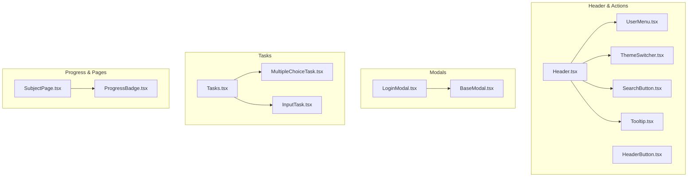
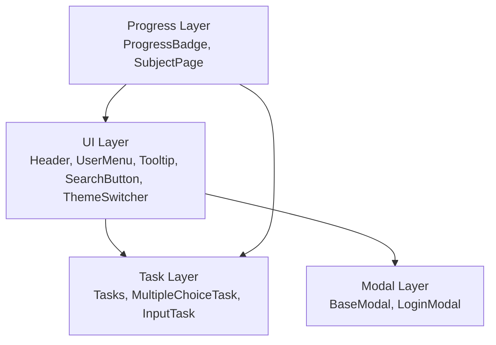
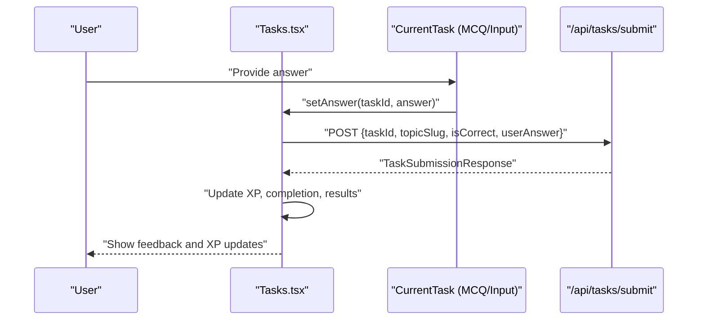
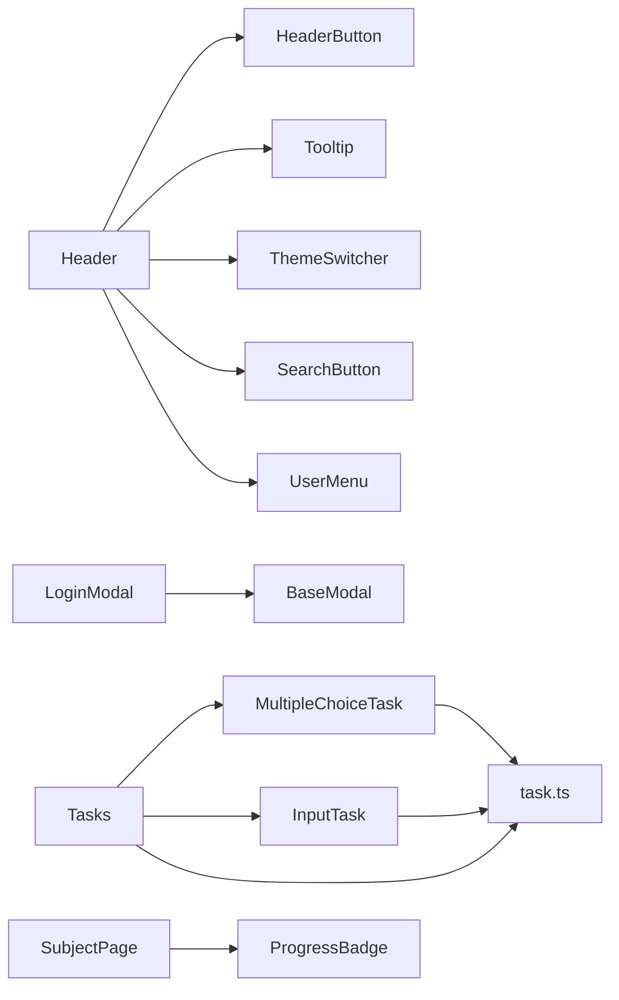

# Component Library

<cite>
**Referenced Files in This Document**
- [Header.tsx](file://components/Header.tsx)
- [HeaderButton.tsx](file://components/HeaderButton.tsx)
- [ThemeSwitcher.tsx](file://components/ThemeSwither/ThemeSwitcher.tsx)
- [SearchButton.tsx](file://components/Search/SearchButton.tsx)
- [BaseModal.tsx](file://components/BaseModal.tsx)
- [LoginModal.tsx](file://components/auth/LoginModal.tsx)
- [UserMenu.tsx](file://components/UserMenu.tsx)
- [Tooltip.tsx](file://components/Tooltip.tsx)
- [MultipleChoiceTask.tsx](file://components/tasks/MultipleChoiceTask.tsx)
- [InputTask.tsx](file://components/tasks/InputTask.tsx)
- [Tasks.tsx](file://components/tasks/Tasks.tsx)
- [ProgressBadge.tsx](file://components/math/ProgressBadge.tsx)
- [SubjectPage.tsx](file://components/SubjectPage.tsx)
- [task.ts](file://types/task.ts)
</cite>

## Table of Contents
1. [Introduction](#introduction)
2. [Project Structure](#project-structure)
3. [Core Components](#core-components)
4. [Architecture Overview](#architecture-overview)
5. [Detailed Component Analysis](#detailed-component-analysis)
6. [Dependency Analysis](#dependency-analysis)
7. [Performance Considerations](#performance-considerations)
8. [Troubleshooting Guide](#troubleshooting-guide)
9. [Conclusion](#conclusion)
10. [Appendices](#appendices)

## Introduction
This document describes the reusable UI component library used across the application. It covers header navigation and actions, modal systems, user interface elements, task components (multiple choice and input-based), progress visualization, and theme switching. For each component, we outline props, usage patterns, styling options, accessibility features, integration examples, composition patterns, and customization guidelines.

## Project Structure
The component library is organized by feature domains:
- Header and global actions: Header, HeaderButton, ThemeSwitcher, SearchButton, Tooltip, UserMenu
- Modals: BaseModal, LoginModal
- Task system: Tasks container, MultipleChoiceTask, InputTask
- Progress and pages: ProgressBadge, SubjectPage
- Types: Task types shared across components

**Diagram sources**
- [Header.tsx](file://components/Header.tsx#L33-L79)
- [HeaderButton.tsx](file://components/HeaderButton.tsx#L9-L22)
- [ThemeSwitcher.tsx](file://components/ThemeSwither/ThemeSwitcher.tsx#L8-L69)
- [SearchButton.tsx](file://components/Search/SearchButton.tsx#L7-L49)
- [UserMenu.tsx](file://components/UserMenu.tsx#L10-L97)
- [Tooltip.tsx](file://components/Tooltip.tsx#L11-L69)
- [BaseModal.tsx](file://components/BaseModal.tsx#L11-L70)
- [LoginModal.tsx](file://components/auth/LoginModal.tsx#L11-L23)
- [Tasks.tsx](file://components/tasks/Tasks.tsx#L12-L441)
- [MultipleChoiceTask.tsx](file://components/tasks/MultipleChoiceTask.tsx#L11-L72)
- [InputTask.tsx](file://components/tasks/InputTask.tsx#L11-L97)
- [ProgressBadge.tsx](file://components/math/ProgressBadge.tsx#L10-L48)
- [SubjectPage.tsx](file://components/SubjectPage.tsx#L26-L181)

**Section sources**
- [Header.tsx](file://components/Header.tsx#L33-L79)
- [BaseModal.tsx](file://components/BaseModal.tsx#L11-L70)
- [Tasks.tsx](file://components/tasks/Tasks.tsx#L12-L441)
- [ProgressBadge.tsx](file://components/math/ProgressBadge.tsx#L10-L48)
- [SubjectPage.tsx](file://components/SubjectPage.tsx#L26-L181)

## Core Components
- Header: Fixed header with subject navigation links, search, theme toggle, and user menu.
- HeaderButton: Reusable button shell for header icons.
- ThemeSwitcher: Toggle between light/dark/system themes with sound feedback.
- SearchButton: Animated search trigger with pulse animation.
- BaseModal: Portal-based modal with escape/close-outside behavior and transitions.
- LoginModal: Portal-wrapped login form inside BaseModal.
- UserMenu: Dropdown menu for authenticated users with logout action.
- Tooltip: Accessible tooltip with enter/leave and focus/blur triggers.
- MultipleChoiceTask: Interactive MCQ with selection, correctness feedback, and optional comments.
- InputTask: Text input task with normalization, validation, and feedback.
- Tasks: Orchestration container managing XP, completion, and submission flows.
- ProgressBadge: Section progress badge with loading and completion states.
- SubjectPage: Topic listing page with progress badges per section.

**Section sources**
- [Header.tsx](file://components/Header.tsx#L33-L79)
- [HeaderButton.tsx](file://components/HeaderButton.tsx#L9-L22)
- [ThemeSwitcher.tsx](file://components/ThemeSwither/ThemeSwitcher.tsx#L8-L69)
- [SearchButton.tsx](file://components/Search/SearchButton.tsx#L7-L49)
- [BaseModal.tsx](file://components/BaseModal.tsx#L11-L70)
- [LoginModal.tsx](file://components/auth/LoginModal.tsx#L11-L23)
- [UserMenu.tsx](file://components/UserMenu.tsx#L10-L97)
- [Tooltip.tsx](file://components/Tooltip.tsx#L11-L69)
- [MultipleChoiceTask.tsx](file://components/tasks/MultipleChoiceTask.tsx#L11-L72)
- [InputTask.tsx](file://components/tasks/InputTask.tsx#L11-L97)
- [Tasks.tsx](file://components/tasks/Tasks.tsx#L12-L441)
- [ProgressBadge.tsx](file://components/math/ProgressBadge.tsx#L10-L48)
- [SubjectPage.tsx](file://components/SubjectPage.tsx#L26-L181)

## Architecture Overview
The component library follows a layered pattern:
- Presentation layer: Header, UserMenu, Tooltip, SearchButton, ThemeSwitcher
- Modal layer: BaseModal composes with LoginModal
- Task layer: Tasks orchestrates MultipleChoiceTask and InputTask
- Data/UX layer: ProgressBadge and SubjectPage integrate progress and navigation

**Diagram sources**
- [Header.tsx](file://components/Header.tsx#L33-L79)
- [UserMenu.tsx](file://components/UserMenu.tsx#L10-L97)
- [Tooltip.tsx](file://components/Tooltip.tsx#L11-L69)
- [SearchButton.tsx](file://components/Search/SearchButton.tsx#L7-L49)
- [ThemeSwitcher.tsx](file://components/ThemeSwither/ThemeSwitcher.tsx#L8-L69)
- [BaseModal.tsx](file://components/BaseModal.tsx#L11-L70)
- [LoginModal.tsx](file://components/auth/LoginModal.tsx#L11-L23)
- [Tasks.tsx](file://components/tasks/Tasks.tsx#L12-L441)
- [MultipleChoiceTask.tsx](file://components/tasks/MultipleChoiceTask.tsx#L11-L72)
- [InputTask.tsx](file://components/tasks/InputTask.tsx#L11-L97)
- [ProgressBadge.tsx](file://components/math/ProgressBadge.tsx#L10-L48)
- [SubjectPage.tsx](file://components/SubjectPage.tsx#L26-L181)

## Detailed Component Analysis

### Header
- Purpose: Fixed global navigation bar with subject links, search, theme toggle, and user menu.
- Composition: Uses NavigationLink for each subject, Tooltip wrappers, and HeaderButton shells.
- Accessibility: Links use semantic Next.js Link; tooltips provide assistive labels.
- Styling: Tailwind utilities for spacing, borders, dark mode variants, and shadows.
- Integration: Consumed by app layouts to provide consistent navigation.

Usage pattern:
- Place Header at the top of pages requiring global navigation.
- Wrap actionable buttons with Tooltip for discoverability.

Customization guidelines:
- Adjust iconography and labels via NavigationLink props.
- Modify dark mode styles by updating Tailwind classes on the header wrapper.

**Section sources**
- [Header.tsx](file://components/Header.tsx#L33-L79)

### HeaderButton
- Purpose: Standardized header icon button shell with consistent sizing and border/shadow.
- Props:
  - onClickHandler: Function to handle clicks
  - children: Icon or element to render
  - className: Optional extra classes
- Styling: Consistent h-10 w-10, rounded-lg, border, and dark variants.

Usage pattern:
- Wrap interactive icons (theme toggle, search) with HeaderButton for uniformity.

**Section sources**
- [HeaderButton.tsx](file://components/HeaderButton.tsx#L9-L22)

### ThemeSwitcher
- Purpose: Toggle between light/dark/system themes with audio feedback.
- Props: None (uses next-themes internally).
- Behavior: Detects current theme, toggles on click, plays sound effects.
- Accessibility: Renders icon appropriate to current theme; relies on next-themes for ARIA attributes.
- Integration: Used inside Header via Tooltip.

Usage pattern:
- Render ThemeToggle within HeaderButton for consistent styling.

**Section sources**
- [ThemeSwitcher.tsx](file://components/ThemeSwither/ThemeSwitcher.tsx#L8-L69)

### SearchButton
- Purpose: Animated search trigger with pulsing effect.
- Props: None.
- Behavior: On click, toggles animation state; animation runs for a fixed duration.
- Styling: Conditional classes apply pulse animation and color changes during animation.

Usage pattern:
- Wrap with Tooltip for label; place in Header.

**Section sources**
- [SearchButton.tsx](file://components/Search/SearchButton.tsx#L7-L49)

### BaseModal
- Purpose: Portal-based modal overlay with exit animations and outside-click/escape handling.
- Props:
  - onClose: Callback invoked after close animation completes
  - children: Modal content
- Behavior: Mounts to document.body via createPortal; fades and scales modal; closes on Escape or clicking outside.
- Accessibility: Overlay and inner container receive focus management cues; close button present.

Usage pattern:
- Wrap any content (e.g., LoginModal) with BaseModal for consistent UX.

**Section sources**
- [BaseModal.tsx](file://components/BaseModal.tsx#L11-L70)

### LoginModal
- Purpose: Login form presented in a modal portal.
- Props:
  - onClose: Close handler passed to BaseModal
- Behavior: Renders LoginForm inside BaseModal; portals to body.

Usage pattern:
- Trigger from UserMenu or public pages; pass onClose to dismiss.

**Section sources**
- [LoginModal.tsx](file://components/auth/LoginModal.tsx#L11-L23)

### UserMenu
- Purpose: Authenticated user dropdown with avatar/name/email and logout.
- Props: None.
- Behavior: Opens on click; handles click-outside and Escape; shows skeleton while session is loading.
- Accessibility: Menu visibility controlled via transforms and pointer-events; logout uses accessible red text.

Usage pattern:
- Place in Header; wraps with Tooltip for label.

**Section sources**
- [UserMenu.tsx](file://components/UserMenu.tsx#L10-L97)

### Tooltip
- Purpose: Accessible tooltip with configurable delay and mounting lifecycle.
- Props:
  - content: Tooltip text
  - children: Trigger element
  - delay: Optional show delay in ms
- Behavior: Shows on mouse/focus enter; hides on leave; manages mount/unmount timing.

Usage pattern:
- Wrap actionable icons/buttons in Header for contextual help.

**Section sources**
- [Tooltip.tsx](file://components/Tooltip.tsx#L11-L69)

### MultipleChoiceTask
- Purpose: Interactive multiple-choice task with immediate feedback.
- Props:
  - task: TMultipleChoiceTask
  - setAnswer?: (taskId, answer) => void
- Behavior: Tracks selection; disables further selection after choice; highlights correct/wrong options; shows optional comment on wrong answer.
- Accessibility: Uses button elements for choices; visual states indicate selection and correctness.

Usage pattern:
- Render inside Tasks container; connect setAnswer to submission pipeline.

**Section sources**
- [MultipleChoiceTask.tsx](file://components/tasks/MultipleChoiceTask.tsx#L11-L72)
- [task.ts](file://types/task.ts#L1-L10)

### InputTask
- Purpose: Text input task with normalization and acceptance lists.
- Props:
  - task: TInputTask
  - setAnswer?: (taskId, answer) => void
- Behavior: Normalizes input; compares against accepted/correct answers; provides success/error feedback; supports Enter key submission.
- Accessibility: Disabled states prevent re-entry; feedback messages aid screen readers.

Usage pattern:
- Render inside Tasks container; connect setAnswer to submission pipeline.

**Section sources**
- [InputTask.tsx](file://components/tasks/InputTask.tsx#L11-L97)
- [task.ts](file://types/task.ts#L12-L22)

### Tasks
- Purpose: Container orchestration for task sequences, XP display, and submission.
- Props:
  - tasks: (TMultipleChoiceTask | TInputTask)[]
  - topicSlug: string
- Behavior:
  - Manages current task index and answers
  - Filters completed tasks
  - Submits answers to backend, updates XP and completion sets
  - Plays sounds on correct/incorrect answers
  - Displays XP progress bar, hot-topic indicator, and daily energy
- Accessibility: Results and XP info rendered as status updates; buttons labeled for navigation.

Usage pattern:
- Pass loaded tasks and topic slug; handle success callbacks upstream.

**Diagram sources**
- [Tasks.tsx](file://components/tasks/Tasks.tsx#L64-L122)
- [MultipleChoiceTask.tsx](file://components/tasks/MultipleChoiceTask.tsx#L11-L72)
- [InputTask.tsx](file://components/tasks/InputTask.tsx#L11-L97)

**Section sources**
- [Tasks.tsx](file://components/tasks/Tasks.tsx#L12-L441)
- [task.ts](file://types/task.ts#L1-L25)

### ProgressBadge
- Purpose: Visual progress badge indicating completed vs total items in a section.
- Props:
  - sectionTitle: string
  - totalLessons: number
- Behavior: Shows skeleton while loading; computes percentage and completion state; renders appropriate color scheme.
- Accessibility: Announces status via role and aria-label.

Usage pattern:
- Render alongside section headers in SubjectPage.

**Section sources**
- [ProgressBadge.tsx](file://components/math/ProgressBadge.tsx#L10-L48)

### SubjectPage
- Purpose: Topic listing page with lessons grid and progress badges.
- Props:
  - data: SubjectPageData (page title/description, sections)
  - basePath: string prefix for lesson URLs
- Behavior: Renders page header, sections, lessons grid, and lesson cards with links.

Usage pattern:
- Compose with data from content loaders; pass basePath derived from route.

**Section sources**
- [SubjectPage.tsx](file://components/SubjectPage.tsx#L26-L181)

## Dependency Analysis
Key dependencies and relationships:
- Header depends on HeaderButton, Tooltip, ThemeSwitcher, SearchButton, UserMenu.
- LoginModal composes BaseModal and LoginForm.
- Tasks depends on MultipleChoiceTask and InputTask; uses next-auth session and XP APIs.
- SubjectPage depends on ProgressBadge.
- Task types are centralized in task.ts and consumed by task components and Tasks container.

**Diagram sources**
- [Header.tsx](file://components/Header.tsx#L3-L11)
- [BaseModal.tsx](file://components/BaseModal.tsx#L11-L70)
- [LoginModal.tsx](file://components/auth/LoginModal.tsx#L11-L23)
- [UserMenu.tsx](file://components/UserMenu.tsx#L10-L97)
- [Tooltip.tsx](file://components/Tooltip.tsx#L11-L69)
- [ThemeSwitcher.tsx](file://components/ThemeSwither/ThemeSwitcher.tsx#L8-L69)
- [SearchButton.tsx](file://components/Search/SearchButton.tsx#L7-L49)
- [Tasks.tsx](file://components/tasks/Tasks.tsx#L12-L441)
- [MultipleChoiceTask.tsx](file://components/tasks/MultipleChoiceTask.tsx#L11-L72)
- [InputTask.tsx](file://components/tasks/InputTask.tsx#L11-L97)
- [ProgressBadge.tsx](file://components/math/ProgressBadge.tsx#L10-L48)
- [task.ts](file://types/task.ts#L1-L25)

**Section sources**
- [Header.tsx](file://components/Header.tsx#L3-L11)
- [Tasks.tsx](file://components/tasks/Tasks.tsx#L12-L441)
- [task.ts](file://types/task.ts#L1-L25)

## Performance Considerations
- Modal animations: BaseModal uses requestAnimationFrame and short transitions; keep child content lightweight.
- Task rendering: Tasks memoizes available tasks and uses controlled indices to avoid unnecessary re-renders.
- Theme switching: ThemeSwitcher defers to next-themes; minimize heavy computations in toggle handler.
- Tooltip: Mount/unmount lifecycle prevents unnecessary DOM nodes; keep content concise.
- ProgressBadge: Loading skeleton avoids layout shifts; defer real progress fetch until needed.

## Troubleshooting Guide
Common issues and resolutions:
- Modal does not close:
  - Ensure onClose is called after animation completes in BaseModal.
  - Verify click-outside and Escape handlers are attached.
- Tooltip not visible:
  - Confirm Tooltip receives a trigger element and delay is appropriate.
  - Check that Tooltip is not returning children prematurely.
- Task answer not recorded:
  - Verify setAnswer is wired to Tasks.handleTaskSubmit.
  - Confirm task type matches expected shape in task.ts.
- UserMenu not opening:
  - Ensure click-outside and Escape listeners are registered.
  - Check session status and loading state.
- Theme toggle not audible:
  - Confirm audio files exist and volume is set; handle play promise rejection.

**Section sources**
- [BaseModal.tsx](file://components/BaseModal.tsx#L15-L40)
- [Tooltip.tsx](file://components/Tooltip.tsx#L18-L32)
- [Tasks.tsx](file://components/tasks/Tasks.tsx#L64-L122)
- [UserMenu.tsx](file://components/UserMenu.tsx#L18-L36)
- [ThemeSwitcher.tsx](file://components/ThemeSwither/ThemeSwitcher.tsx#L15-L36)

## Conclusion
The component library provides a cohesive set of reusable UI elements for navigation, modals, tasks, progress, and theme switching. Components are designed with accessibility, performance, and composability in mind. By following the usage patterns and customization guidelines outlined here, teams can maintain consistency and extend functionality across the application.

## Appendices
- Props reference summary:
  - Header: No props; integrates child components.
  - HeaderButton: onClickHandler, children, className.
  - ThemeSwitcher: none.
  - SearchButton: none.
  - BaseModal: onClose, children.
  - LoginModal: onClose.
  - UserMenu: none.
  - Tooltip: content, children, delay.
  - MultipleChoiceTask: task, setAnswer.
  - InputTask: task, setAnswer.
  - Tasks: tasks, topicSlug.
  - ProgressBadge: sectionTitle, totalLessons.
  - SubjectPage: data, basePath.