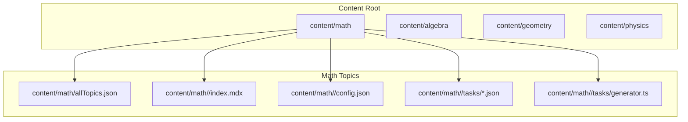
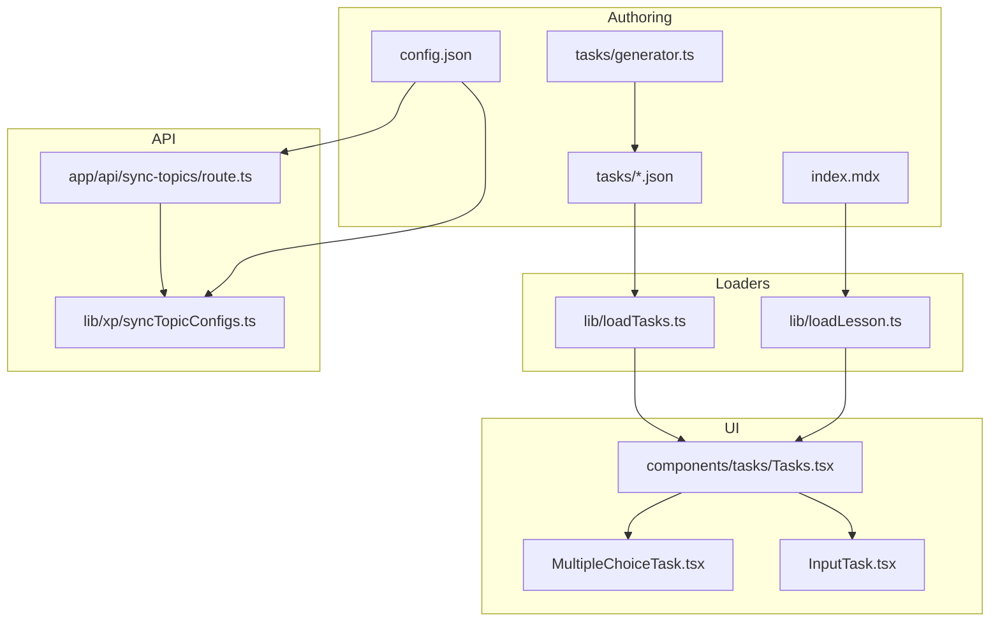
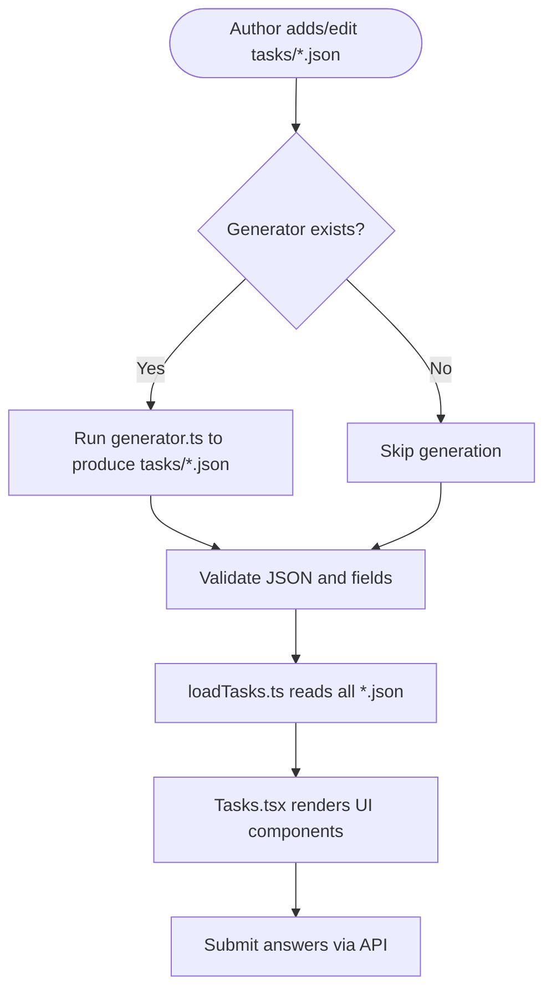
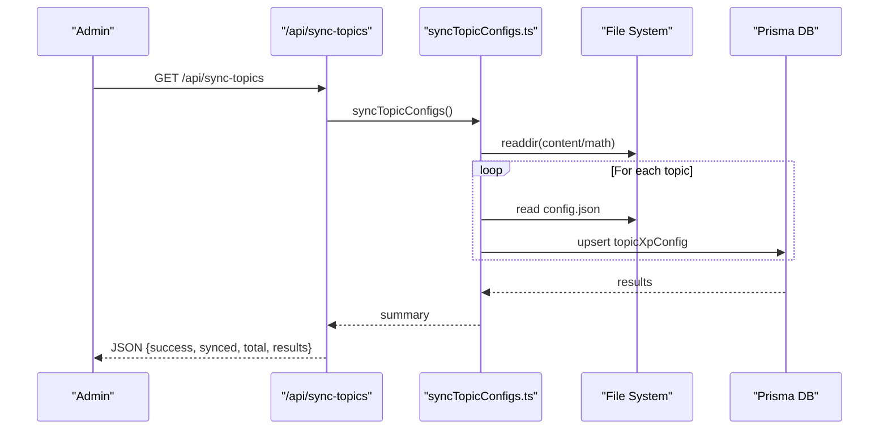
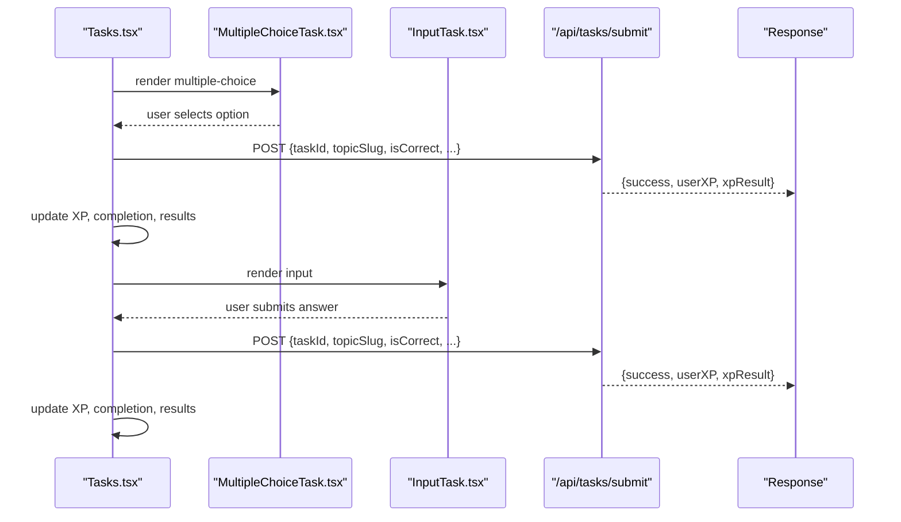
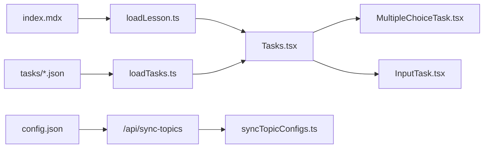

# Content Authoring

<cite>
**Referenced Files in This Document**
- [index.mdx](file://content/math/addition_and_subtraction_of_fractions/index.mdx)
- [config.json](file://content/math/addition_and_subtraction_of_fractions/config.json)
- [generator.ts](file://content/math/addition_and_subtraction_of_fractions/tasks/generator.ts)
- [allTopics.json](file://content/math/allTopics.json)
- [loadLesson.ts](file://lib/loadLesson.ts)
- [loadTasks.ts](file://lib/loadTasks.ts)
- [lesson.ts](file://types/lesson.ts)
- [task.ts](file://types/task.ts)
- [Tasks.tsx](file://components/tasks/Tasks.tsx)
- [MultipleChoiceTask.tsx](file://components/tasks/MultipleChoiceTask.tsx)
- [InputTask.tsx](file://components/tasks/InputTask.tsx)
- [route.ts](file://app/api/sync-topics/route.ts)
- [syncTopicConfigs.ts](file://lib/xp/syncTopicConfigs.ts)
</cite>

## Table of Contents
1. [Introduction](#introduction)
2. [Project Structure](#project-structure)
3. [Core Components](#core-components)
4. [Architecture Overview](#architecture-overview)
5. [Detailed Component Analysis](#detailed-component-analysis)
6. [Dependency Analysis](#dependency-analysis)
7. [Performance Considerations](#performance-considerations)
8. [Troubleshooting Guide](#troubleshooting-guide)
9. [Conclusion](#conclusion)
10. [Appendices](#appendices)

## Introduction
This document explains how to author educational content for the platform, focusing on:
- Creating MDX lessons with mathematical notation support
- Generating tasks (multiple choice and input) with static JSON files and a generator script
- Managing topic configuration and synchronizing it with the database
- Ensuring content consistency across subjects and maintaining authoring best practices

It also covers how learners interact with lessons and tasks, and how the system validates and persists progress.

## Project Structure
Content is organized per subject under a content directory. Each lesson resides in its own folder with an MDX index file, a topic configuration file, and a tasks subfolder containing static task JSON files and a generator script. A top-level topics manifest lists sections and lessons for navigation.

**Diagram sources**
- [allTopics.json](file://content/math/allTopics.json#L1-L26)
- [index.mdx](file://content/math/addition_and_subtraction_of_fractions/index.mdx#L1-L14)
- [config.json](file://content/math/addition_and_subtraction_of_fractions/config.json#L1-L10)
- [generator.ts](file://content/math/addition_and_subtraction_of_fractions/tasks/generator.ts#L1-L25)

**Section sources**
- [allTopics.json](file://content/math/allTopics.json#L1-L26)
- [index.mdx](file://content/math/addition_and_subtraction_of_fractions/index.mdx#L1-L14)
- [config.json](file://content/math/addition_and_subtraction_of_fractions/config.json#L1-L10)
- [generator.ts](file://content/math/addition_and_subtraction_of_fractions/tasks/generator.ts#L1-L25)

## Core Components
- Lesson loader: Reads MDX content and frontmatter from a lesson folder.
- Task loader: Loads all task JSON files from a tasks directory.
- Task components: Interactive UI for multiple-choice and input tasks.
- Topic configuration: Defines topic metadata and XP-related parameters.
- Synchronization API: Syncs topic configurations to the database.

Key responsibilities:
- Authoring: Create index.mdx with frontmatter and mathematical notation; define config.json; add task JSON files; optionally generate tasks via generator.ts.
- Rendering: Load lesson content and tasks; present interactive UI; persist submissions.
- Consistency: Keep config.json aligned with index.mdx frontmatter; keep allTopics.json up to date; ensure task IDs are unique and stable.

**Section sources**
- [loadLesson.ts](file://lib/loadLesson.ts#L1-L17)
- [loadTasks.ts](file://lib/loadTasks.ts#L1-L31)
- [lesson.ts](file://types/lesson.ts#L1-L7)
- [task.ts](file://types/task.ts#L1-L25)
- [Tasks.tsx](file://components/tasks/Tasks.tsx#L1-L441)
- [MultipleChoiceTask.tsx](file://components/tasks/MultipleChoiceTask.tsx#L1-L72)
- [InputTask.tsx](file://components/tasks/InputTask.tsx#L1-L97)
- [syncTopicConfigs.ts](file://lib/xp/syncTopicConfigs.ts#L1-L174)
- [route.ts](file://app/api/sync-topics/route.ts#L1-L19)

## Architecture Overview
The authoring pipeline integrates content files, loaders, and UI components, while the XP system manages topic configuration and learner progress.

**Diagram sources**
- [index.mdx](file://content/math/addition_and_subtraction_of_fractions/index.mdx#L1-L14)
- [config.json](file://content/math/addition_and_subtraction_of_fractions/config.json#L1-L10)
- [generator.ts](file://content/math/addition_and_subtraction_of_fractions/tasks/generator.ts#L1-L25)
- [loadLesson.ts](file://lib/loadLesson.ts#L1-L17)
- [loadTasks.ts](file://lib/loadTasks.ts#L1-L31)
- [Tasks.tsx](file://components/tasks/Tasks.tsx#L1-L441)
- [MultipleChoiceTask.tsx](file://components/tasks/MultipleChoiceTask.tsx#L1-L72)
- [InputTask.tsx](file://components/tasks/InputTask.tsx#L1-L97)
- [route.ts](file://app/api/sync-topics/route.ts#L1-L19)
- [syncTopicConfigs.ts](file://lib/xp/syncTopicConfigs.ts#L1-L174)

## Detailed Component Analysis

### Lesson Creation with MDX and Mathematical Notation
- Location: content/math/<topic>/index.mdx
- Frontmatter keys: title, description, difficulty, math
- Mathematical notation:
  - Inline math: wrap expressions with single dollar signs
  - Block math: wrap expressions with double dollar signs
- Best practices:
  - Keep frontmatter concise and consistent with config.json
  - Use semantic headings and short paragraphs
  - Prefer block math for complex formulas
  - Reference images or diagrams externally if needed

**Section sources**
- [index.mdx](file://content/math/addition_and_subtraction_of_fractions/index.mdx#L1-L14)
- [lesson.ts](file://types/lesson.ts#L1-L7)

### Topic Configuration Management
- Location: content/math/<topic>/config.json
- Fields include slug, title, description, difficulty, category, list-position, tags
- Synchronization:
  - Endpoint: GET /api/sync-topics
  - Behavior: Iterates math topics, reads each config.json, upserts into database
- Best practices:
  - Keep slug stable; it is used to link lessons and XP configuration
  - Align title and description with lesson frontmatter
  - Use consistent categories and tags across subjects

**Section sources**
- [config.json](file://content/math/addition_and_subtraction_of_fractions/config.json#L1-L10)
- [route.ts](file://app/api/sync-topics/route.ts#L1-L19)
- [syncTopicConfigs.ts](file://lib/xp/syncTopicConfigs.ts#L1-L174)

### Task Generation System
- Static tasks: Place JSON files in content/math/<topic>/tasks/
- Generator script: content/math/<topic>/tasks/generator.ts
- Task types:
  - Multiple choice: id, type, question, options (with optional comments), answer, difficulty, baseXP
  - Input: id, type, question, placeholder, correct, accepted, difficulty, baseXP
- Best practices:
  - Use unique, stable task IDs
  - Provide canonical correct answers and acceptable variants
  - Keep options plausible but clearly distinguishable
  - Use consistent difficulty and XP values

**Diagram sources**
- [generator.ts](file://content/math/addition_and_subtraction_of_fractions/tasks/generator.ts#L1-L25)
- [loadTasks.ts](file://lib/loadTasks.ts#L1-L31)
- [task.ts](file://types/task.ts#L1-L25)
- [Tasks.tsx](file://components/tasks/Tasks.tsx#L1-L441)

**Section sources**
- [generator.ts](file://content/math/addition_and_subtraction_of_fractions/tasks/generator.ts#L1-L25)
- [loadTasks.ts](file://lib/loadTasks.ts#L1-L31)
- [task.ts](file://types/task.ts#L1-L25)

### Content Synchronization Workflow
- Endpoint: GET /api/sync-topics
- Steps:
  - Enumerate math topic folders
  - Read each config.json
  - Upsert into database using Prisma
- Error handling:
  - Returns structured errors with success flag and details
- Best practices:
  - Run after editing config.json or adding new topics
  - Verify database records match content after sync

**Diagram sources**
- [route.ts](file://app/api/sync-topics/route.ts#L1-L19)
- [syncTopicConfigs.ts](file://lib/xp/syncTopicConfigs.ts#L1-L174)

**Section sources**
- [route.ts](file://app/api/sync-topics/route.ts#L1-L19)
- [syncTopicConfigs.ts](file://lib/xp/syncTopicConfigs.ts#L1-L174)

### Interactive Lesson Rendering and Submission
- Loading:
  - Load lesson content and frontmatter from index.mdx
  - Load tasks from tasks directory
- Rendering:
  - Tasks.tsx filters completed tasks and renders current task
  - MultipleChoiceTask.tsx and InputTask.tsx provide interactive UI
- Submission:
  - Tasks.tsx posts answers to /api/tasks/submit with task metadata
  - Updates user XP and completion state

**Diagram sources**
- [Tasks.tsx](file://components/tasks/Tasks.tsx#L1-L441)
- [MultipleChoiceTask.tsx](file://components/tasks/MultipleChoiceTask.tsx#L1-L72)
- [InputTask.tsx](file://components/tasks/InputTask.tsx#L1-L97)

**Section sources**
- [Tasks.tsx](file://components/tasks/Tasks.tsx#L1-L441)
- [MultipleChoiceTask.tsx](file://components/tasks/MultipleChoiceTask.tsx#L1-L72)
- [InputTask.tsx](file://components/tasks/InputTask.tsx#L1-L97)

## Dependency Analysis
- Content to loaders: index.mdx and tasks/*.json depend on loadLesson.ts and loadTasks.ts
- Loaders to UI: Tasks.tsx depends on task types and components
- Config to API: config.json is synchronized via sync-topic route and service
- UI to API: Tasks.tsx posts to task submission endpoint

**Diagram sources**
- [loadLesson.ts](file://lib/loadLesson.ts#L1-L17)
- [loadTasks.ts](file://lib/loadTasks.ts#L1-L31)
- [Tasks.tsx](file://components/tasks/Tasks.tsx#L1-L441)
- [MultipleChoiceTask.tsx](file://components/tasks/MultipleChoiceTask.tsx#L1-L72)
- [InputTask.tsx](file://components/tasks/InputTask.tsx#L1-L97)
- [route.ts](file://app/api/sync-topics/route.ts#L1-L19)
- [syncTopicConfigs.ts](file://lib/xp/syncTopicConfigs.ts#L1-L174)

**Section sources**
- [loadLesson.ts](file://lib/loadLesson.ts#L1-L17)
- [loadTasks.ts](file://lib/loadTasks.ts#L1-L31)
- [Tasks.tsx](file://components/tasks/Tasks.tsx#L1-L441)
- [MultipleChoiceTask.tsx](file://components/tasks/MultipleChoiceTask.tsx#L1-L72)
- [InputTask.tsx](file://components/tasks/InputTask.tsx#L1-L97)
- [route.ts](file://app/api/sync-topics/route.ts#L1-L19)
- [syncTopicConfigs.ts](file://lib/xp/syncTopicConfigs.ts#L1-L174)

## Performance Considerations
- Keep task JSON files small and focused; avoid large embedded assets in content
- Prefer block math sparingly; inline math is lighter
- Use generator.ts to batch-create tasks; avoid manual edits for bulk changes
- Minimize repeated re-syncs; group configuration updates and sync once

## Troubleshooting Guide
- Lesson not rendering math:
  - Ensure frontmatter math flag is set appropriately
  - Verify inline and block math delimiters are correct
- Tasks not appearing:
  - Confirm tasks/*.json parse correctly
  - Ensure task IDs are unique and stable
- Synchronization failures:
  - Check config.json validity and required fields
  - Review server logs for detailed error messages
- Submission not recorded:
  - Verify session presence
  - Confirm endpoint responds with success and XP updates

**Section sources**
- [loadTasks.ts](file://lib/loadTasks.ts#L1-L31)
- [route.ts](file://app/api/sync-topics/route.ts#L1-L19)
- [Tasks.tsx](file://components/tasks/Tasks.tsx#L1-L441)

## Conclusion
By following the authoring guidelines—creating MDX lessons with proper frontmatter, generating or curating task JSON, maintaining accurate topic configurations, and keeping content synchronized—you can build consistent, interactive learning experiences. Use the provided loaders and components to render lessons and tasks, and rely on the synchronization API to keep topic metadata and XP settings in sync with the database.

## Appendices

### Authoring Checklist
- Create or edit index.mdx with frontmatter and mathematical notation
- Define or update config.json with slug, title, description, difficulty, category, tags
- Add or update tasks/*.json; optionally run generator.ts to produce tasks
- Update allTopics.json to reflect new lessons or changes
- Run GET /api/sync-topics to synchronize configurations
- Test lesson rendering and task submission in the UI

### Content Validation Process
- Validate frontmatter against config.json
- Validate task JSON structure against task types
- Verify unique task IDs and stable slugs
- Confirm synchronization results and database upserts
- Test learner flow: XP display, completion, and progression