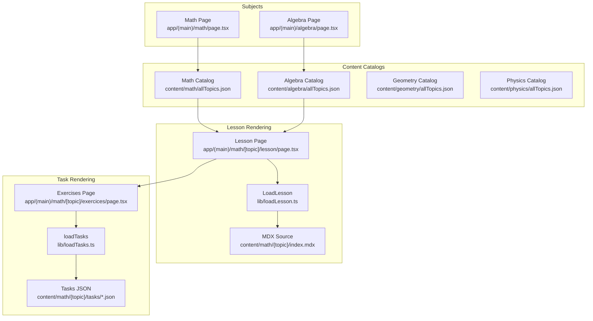
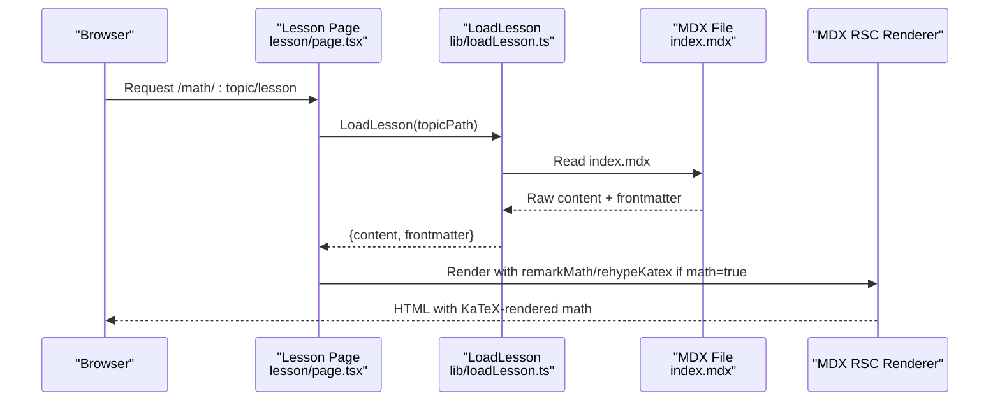
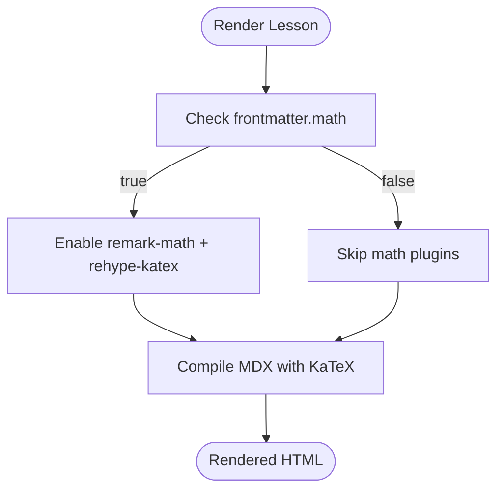
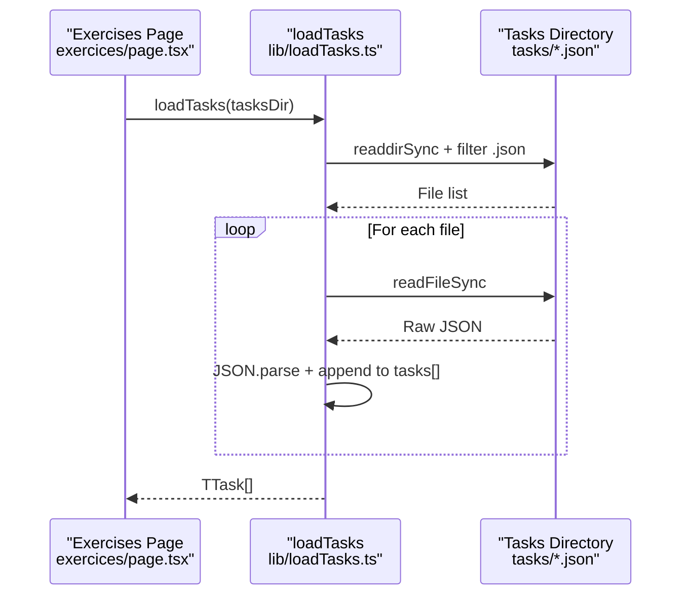
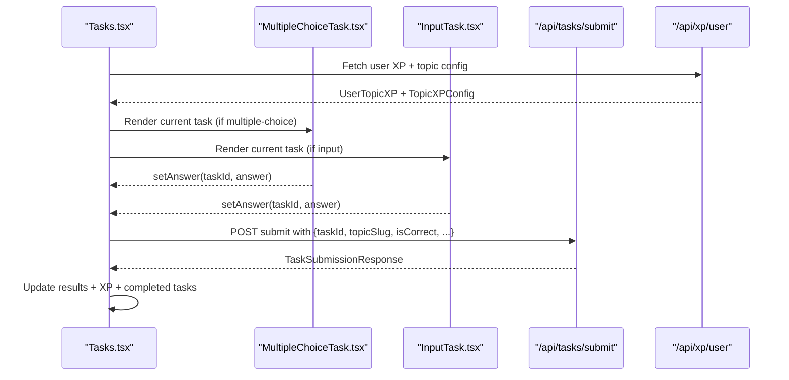
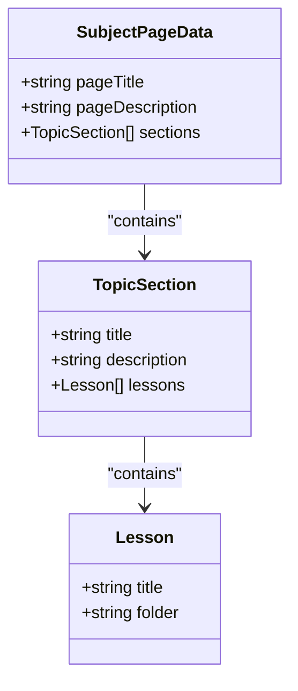
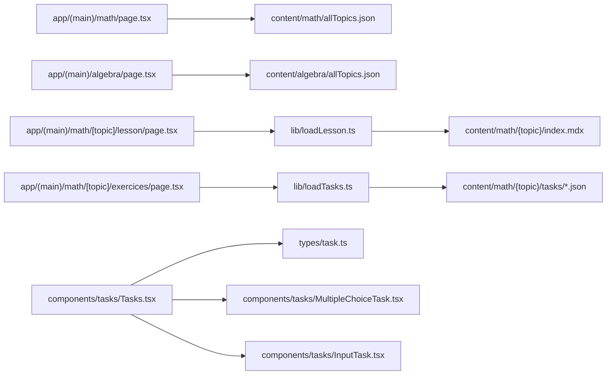

# Content Management System

<cite>
**Referenced Files in This Document**
- [content/math/allTopics.json](file://content/math/allTopics.json)
- [content/algebra/allTopics.json](file://content/algebra/allTopics.json)
- [content/geometry/allTopics.json](file://content/geometry/allTopics.json)
- [content/physics/allTopics.json](file://content/physics/allTopics.json)
- [content/math/addition_and_subtraction_of_fractions/config.json](file://content/math/addition_and_subtraction_of_fractions/config.json)
- [content/math/natural_numbers/index.mdx](file://content/math/natural_numbers/index.mdx)
- [content/math/addition_and_subtraction_of_fractions/index.mdx](file://content/math/addition_and_subtraction_of_fractions/index.mdx)
- [types/topic-config.ts](file://types/topic-config.ts)
- [lib/loadLesson.ts](file://lib/loadLesson.ts)
- [lib/loadTasks.ts](file://lib/loadTasks.ts)
- [types/lesson.ts](file://types/lesson.ts)
- [types/task.ts](file://types/task.ts)
- [app/(main)/math/[topic]/lesson/page.tsx](file://app/(main)/math/[topic]/lesson/page.tsx)
- [app/(main)/math/[topic]/exercices/page.tsx](file://app/(main)/math/[topic]/exercices/page.tsx)
- [components/tasks/Tasks.tsx](file://components/tasks/Tasks.tsx)
- [components/tasks/MultipleChoiceTask.tsx](file://components/tasks/MultipleChoiceTask.tsx)
- [components/tasks/InputTask.tsx](file://components/tasks/InputTask.tsx)
- [components/SubjectPage.tsx](file://components/SubjectPage.tsx)
- [app/(main)/math/page.tsx](file://app/(main)/math/page.tsx)
- [app/(main)/algebra/page.tsx](file://app/(main)/algebra/page.tsx)
</cite>

## Table of Contents
1. [Introduction](#introduction)
2. [Project Structure](#project-structure)
3. [Core Components](#core-components)
4. [Architecture Overview](#architecture-overview)
5. [Detailed Component Analysis](#detailed-component-analysis)
6. [Dependency Analysis](#dependency-analysis)
7. [Performance Considerations](#performance-considerations)
8. [Troubleshooting Guide](#troubleshooting-guide)
9. [Conclusion](#conclusion)
10. [Appendices](#appendices)

## Introduction
This document describes the content management system that powers the interactive math learning platform. It explains how subjects (Math, Algebra, Geometry, Physics) are organized, how MDX lessons are authored and rendered with mathematical notation, how topics are configured with difficulty levels and metadata, and how content is dynamically loaded to render lessons and tasks. Practical examples show how to create new lessons, configure topic parameters, and integrate mathematical formulas using KaTeX-compatible syntax.

## Project Structure
The system is organized by subject with shared content and rendering components:
- Subject pages consume JSON topic catalogs to build browseable lists of lessons.
- Each lesson is an MDX file with frontmatter and embedded mathematical content.
- Tasks are JSON files located under each lesson’s tasks directory.
- Rendering uses Next.js App Router dynamic routes and RSC with remark/rehype plugins for math.

**Diagram sources**
- [app/(main)/math/page.tsx](file://app/(main)/math/page.tsx#L1-L9)
- [app/(main)/algebra/page.tsx](file://app/(main)/algebra/page.tsx#L1-L9)
- [content/math/allTopics.json](file://content/math/allTopics.json#L1-L26)
- [content/algebra/allTopics.json](file://content/algebra/allTopics.json#L1-L12)
- [content/geometry/allTopics.json](file://content/geometry/allTopics.json#L1-L12)
- [content/physics/allTopics.json](file://content/physics/allTopics.json#L1-L12)
- [app/(main)/math/[topic]/lesson/page.tsx](file://app/(main)/math/[topic]/lesson/page.tsx#L1-L94)
- [lib/loadLesson.ts](file://lib/loadLesson.ts#L1-L17)
- [content/math/addition_and_subtraction_of_fractions/index.mdx](file://content/math/addition_and_subtraction_of_fractions/index.mdx#L1-L14)
- [app/(main)/math/[topic]/exercices/page.tsx](file://app/(main)/math/[topic]/exercices/page.tsx#L1-L32)
- [lib/loadTasks.ts](file://lib/loadTasks.ts#L1-L31)

**Section sources**
- [app/(main)/math/page.tsx](file://app/(main)/math/page.tsx#L1-L9)
- [app/(main)/algebra/page.tsx](file://app/(main)/algebra/page.tsx#L1-L9)
- [content/math/allTopics.json](file://content/math/allTopics.json#L1-L26)
- [content/algebra/allTopics.json](file://content/algebra/allTopics.json#L1-L12)
- [content/geometry/allTopics.json](file://content/geometry/allTopics.json#L1-L12)
- [content/physics/allTopics.json](file://content/physics/allTopics.json#L1-L12)
- [app/(main)/math/[topic]/lesson/page.tsx](file://app/(main)/math/[topic]/lesson/page.tsx#L1-L94)
- [lib/loadLesson.ts](file://lib/loadLesson.ts#L1-L17)
- [app/(main)/math/[topic]/exercices/page.tsx](file://app/(main)/math/[topic]/exercices/page.tsx#L1-L32)
- [lib/loadTasks.ts](file://lib/loadTasks.ts#L1-L31)

## Core Components
- Subject catalog JSON: Defines subject-level page metadata and topic sections with lessons.
- Topic configuration: Per-topic JSON that sets slug, title, difficulty, category, tags, and learning parameters.
- MDX lesson authoring: Frontmatter controls title, description, difficulty, and math flag; content supports inline and block math via KaTeX.
- Dynamic lesson loader: Reads MDX, extracts frontmatter, and prepares MDX-RSC rendering with optional math plugins.
- Task loader: Scans a tasks directory for JSON files and parses them into a unified task model.
- Task UI components: Interactive multiple-choice and input tasks with submission, feedback, and XP integration.
- Subject page renderer: Builds browsable topic lists from catalogs.

**Section sources**
- [content/math/allTopics.json](file://content/math/allTopics.json#L1-L26)
- [content/math/addition_and_subtraction_of_fractions/config.json](file://content/math/addition_and_subtraction_of_fractions/config.json#L1-L10)
- [content/math/addition_and_subtraction_of_fractions/index.mdx](file://content/math/addition_and_subtraction_of_fractions/index.mdx#L1-L14)
- [lib/loadLesson.ts](file://lib/loadLesson.ts#L1-L17)
- [lib/loadTasks.ts](file://lib/loadTasks.ts#L1-L31)
- [types/lesson.ts](file://types/lesson.ts#L1-L7)
- [types/task.ts](file://types/task.ts#L1-L25)
- [components/SubjectPage.tsx](file://components/SubjectPage.tsx#L1-L181)

## Architecture Overview
The system follows a content-first architecture:
- Static content is stored in JSON catalogs and MDX files.
- Pages are generated per topic with dynamic routes.
- Rendering uses Next.js App Router with RSC and MDX compilation.
- Tasks are loaded asynchronously and presented with interactive components.
- XP and topic configuration are fetched per-session for adaptive behavior.

**Diagram sources**
- [app/(main)/math/[topic]/lesson/page.tsx](file://app/(main)/math/[topic]/lesson/page.tsx#L1-L94)
- [lib/loadLesson.ts](file://lib/loadLesson.ts#L1-L17)
- [content/math/addition_and_subtraction_of_fractions/index.mdx](file://content/math/addition_and_subtraction_of_fractions/index.mdx#L1-L14)

## Detailed Component Analysis

### Subject Catalogs and Topic Organization
- Each subject has a dedicated allTopics.json that defines:
  - Page-level title and description.
  - Sections with titles, descriptions, and ordered lessons.
  - Each lesson entry includes display title and folder name.
- Subject pages import the appropriate catalog and pass it to a reusable SubjectPage component.

Practical example: Adding a new topic section
- Edit the subject’s allTopics.json to include a new section with lessons.
- Ensure each lesson has a unique folder under content/{subject}/{lessonFolder}.

**Section sources**
- [content/math/allTopics.json](file://content/math/allTopics.json#L1-L26)
- [content/algebra/allTopics.json](file://content/algebra/allTopics.json#L1-L12)
- [content/geometry/allTopics.json](file://content/geometry/allTopics.json#L1-L12)
- [content/physics/allTopics.json](file://content/physics/allTopics.json#L1-L12)
- [app/(main)/math/page.tsx](file://app/(main)/math/page.tsx#L1-L9)
- [app/(main)/algebra/page.tsx](file://app/(main)/algebra/page.tsx#L1-L9)

### Topic Configuration Management
- Per-topic config.json defines:
  - Slug, title, description, difficulty, category.
  - Position in listings, tags, and XP-related parameters.
- The TopicConfig type enumerates supported difficulty levels and XP scheduling fields.

Practical example: Configure a new topic
- Create config.json inside the lesson’s content directory with required fields.
- Use difficulty values from the TopicDifficulty union.

**Section sources**
- [content/math/addition_and_subtraction_of_fractions/config.json](file://content/math/addition_and_subtraction_of_fractions/config.json#L1-L10)
- [types/topic-config.ts](file://types/topic-config.ts#L1-L17)

### MDX Lesson Authoring and Mathematical Notation
- MDX frontmatter supports title, description, difficulty, and a math flag.
- Inline math uses single-dollar delimiters; block math uses double-dollar delimiters.
- The lesson page conditionally enables remark-math and rehype-katex when math=true.

Practical example: Writing math in a lesson
- Use inline math syntax within paragraphs.
- Use block math for standalone equations.
- Ensure the frontmatter math field is set appropriately.

**Diagram sources**
- [app/(main)/math/[topic]/lesson/page.tsx](file://app/(main)/math/[topic]/lesson/page.tsx#L40-L46)
- [content/math/addition_and_subtraction_of_fractions/index.mdx](file://content/math/addition_and_subtraction_of_fractions/index.mdx#L1-L14)

**Section sources**
- [content/math/natural_numbers/index.mdx](file://content/math/natural_numbers/index.mdx#L1-L14)
- [content/math/addition_and_subtraction_of_fractions/index.mdx](file://content/math/addition_and_subtraction_of_fractions/index.mdx#L1-L14)
- [types/lesson.ts](file://types/lesson.ts#L1-L7)
- [app/(main)/math/[topic]/lesson/page.tsx](file://app/(main)/math/[topic]/lesson/page.tsx#L1-L94)

### Dynamic Content Loading Mechanisms
- LoadLesson reads the MDX file, extracts frontmatter via gray-matter, and returns content and metadata.
- loadTasks scans the tasks directory, filters JSON files, parses them, and aggregates into a single array.

**Diagram sources**
- [app/(main)/math/[topic]/exercices/page.tsx](file://app/(main)/math/[topic]/exercices/page.tsx#L1-L32)
- [lib/loadTasks.ts](file://lib/loadTasks.ts#L1-L31)

**Section sources**
- [lib/loadLesson.ts](file://lib/loadLesson.ts#L1-L17)
- [lib/loadTasks.ts](file://lib/loadTasks.ts#L1-L31)
- [app/(main)/math/[topic]/exercices/page.tsx](file://app/(main)/math/[topic]/exercices/page.tsx#L1-L32)

### Task System and Interactive Rendering
- Tasks.tsx orchestrates:
  - Fetching user XP and topic config.
  - Filtering out completed tasks.
  - Presenting current task and handling submissions.
  - Updating UI with results and XP feedback.
- MultipleChoiceTask and InputTask provide interactive components with immediate feedback.
- Submission sends task details to the backend API and updates local state.

**Diagram sources**
- [components/tasks/Tasks.tsx](file://components/tasks/Tasks.tsx#L1-L441)
- [components/tasks/MultipleChoiceTask.tsx](file://components/tasks/MultipleChoiceTask.tsx#L1-L72)
- [components/tasks/InputTask.tsx](file://components/tasks/InputTask.tsx#L1-L97)

**Section sources**
- [components/tasks/Tasks.tsx](file://components/tasks/Tasks.tsx#L1-L441)
- [components/tasks/MultipleChoiceTask.tsx](file://components/tasks/MultipleChoiceTask.tsx#L1-L72)
- [components/tasks/InputTask.tsx](file://components/tasks/InputTask.tsx#L1-L97)
- [types/task.ts](file://types/task.ts#L1-L25)

### Subject Page Rendering
- SubjectPage.tsx accepts a SubjectPageData object and renders:
  - Page header with title and description.
  - Topic sections with lesson cards linking to lesson pages.

**Diagram sources**
- [components/SubjectPage.tsx](file://components/SubjectPage.tsx#L1-L181)

**Section sources**
- [components/SubjectPage.tsx](file://components/SubjectPage.tsx#L1-L181)

## Dependency Analysis
- Pages depend on content catalogs for navigation.
- Lesson pages depend on the lesson loader and MDX rendering pipeline.
- Exercises pages depend on the task loader and task components.
- Task components depend on types and APIs for submission and XP.

**Diagram sources**
- [app/(main)/math/page.tsx](file://app/(main)/math/page.tsx#L1-L9)
- [app/(main)/algebra/page.tsx](file://app/(main)/algebra/page.tsx#L1-L9)
- [content/math/allTopics.json](file://content/math/allTopics.json#L1-L26)
- [content/algebra/allTopics.json](file://content/algebra/allTopics.json#L1-L12)
- [app/(main)/math/[topic]/lesson/page.tsx](file://app/(main)/math/[topic]/lesson/page.tsx#L1-L94)
- [lib/loadLesson.ts](file://lib/loadLesson.ts#L1-L17)
- [content/math/addition_and_subtraction_of_fractions/index.mdx](file://content/math/addition_and_subtraction_of_fractions/index.mdx#L1-L14)
- [app/(main)/math/[topic]/exercices/page.tsx](file://app/(main)/math/[topic]/exercices/page.tsx#L1-L32)
- [lib/loadTasks.ts](file://lib/loadTasks.ts#L1-L31)
- [types/task.ts](file://types/task.ts#L1-L25)
- [components/tasks/Tasks.tsx](file://components/tasks/Tasks.tsx#L1-L441)
- [components/tasks/MultipleChoiceTask.tsx](file://components/tasks/MultipleChoiceTask.tsx#L1-L72)
- [components/tasks/InputTask.tsx](file://components/tasks/InputTask.tsx#L1-L97)

**Section sources**
- [app/(main)/math/page.tsx](file://app/(main)/math/page.tsx#L1-L9)
- [app/(main)/algebra/page.tsx](file://app/(main)/algebra/page.tsx#L1-L9)
- [app/(main)/math/[topic]/lesson/page.tsx](file://app/(main)/math/[topic]/lesson/page.tsx#L1-L94)
- [app/(main)/math/[topic]/exercices/page.tsx](file://app/(main)/math/[topic]/exercices/page.tsx#L1-L32)
- [lib/loadLesson.ts](file://lib/loadLesson.ts#L1-L17)
- [lib/loadTasks.ts](file://lib/loadTasks.ts#L1-L31)
- [types/task.ts](file://types/task.ts#L1-L25)

## Performance Considerations
- Disable ISR/SSR for lesson pages to ensure fresh content and avoid stale MDX rendering.
- Keep MDX files small and avoid heavy images; defer non-critical assets.
- Use static generation for subject catalogs; regenerate when content changes.
- Batch task loading and avoid unnecessary re-renders by memoizing computed values.
- Lazy-load sounds and heavy assets only when needed.

[No sources needed since this section provides general guidance]

## Troubleshooting Guide
Common issues and resolutions:
- Math not rendering:
  - Verify frontmatter math flag is present and truthy.
  - Confirm remark-math and rehype-katex are enabled in the lesson page.
- Task parsing errors:
  - Ensure task JSON files are valid and parseable.
  - Check for mixed arrays and objects; the loader handles both.
- Navigation links:
  - Ensure lesson folders match entries in the subject catalog.
  - Confirm dynamic route parameters align with catalog slugs.

**Section sources**
- [app/(main)/math/[topic]/lesson/page.tsx](file://app/(main)/math/[topic]/lesson/page.tsx#L40-L46)
- [lib/loadTasks.ts](file://lib/loadTasks.ts#L16-L26)
- [content/math/allTopics.json](file://content/math/allTopics.json#L8-L13)

## Conclusion
The content management system combines static catalogs, MDX-authored lessons, and dynamic task rendering to deliver an interactive learning experience. By organizing content around subjects and topics, enabling math rendering with KaTeX, and structuring tasks with clear models, the platform supports scalable authoring and personalized practice.

[No sources needed since this section summarizes without analyzing specific files]

## Appendices

### Practical Examples

- Create a new lesson
  - Add a new folder under content/{subject}/{lessonFolder}.
  - Write index.mdx with frontmatter (title, description, difficulty, math).
  - Place task JSON files under content/{subject}/{lessonFolder}/tasks/.
  - Reference the lesson in the subject’s allTopics.json.

- Configure topic parameters
  - Create config.json in the lesson’s content directory with slug, title, difficulty, category, tags, and position.
  - Use difficulty values from the TopicDifficulty union.

- Integrate mathematical formulas
  - Use inline math with single-dollar delimiters in paragraphs.
  - Use block math with double-dollar delimiters for standalone equations.
  - Ensure the lesson’s frontmatter math flag is set to enable KaTeX rendering.

**Section sources**
- [content/math/addition_and_subtraction_of_fractions/index.mdx](file://content/math/addition_and_subtraction_of_fractions/index.mdx#L1-L14)
- [content/math/addition_and_subtraction_of_fractions/config.json](file://content/math/addition_and_subtraction_of_fractions/config.json#L1-L10)
- [content/math/allTopics.json](file://content/math/allTopics.json#L8-L13)
- [app/(main)/math/[topic]/lesson/page.tsx](file://app/(main)/math/[topic]/lesson/page.tsx#L40-L46)