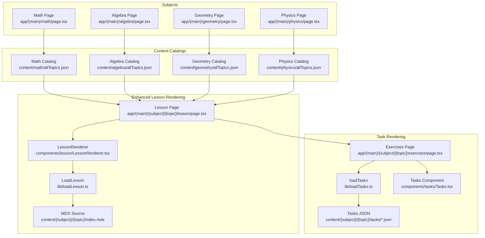
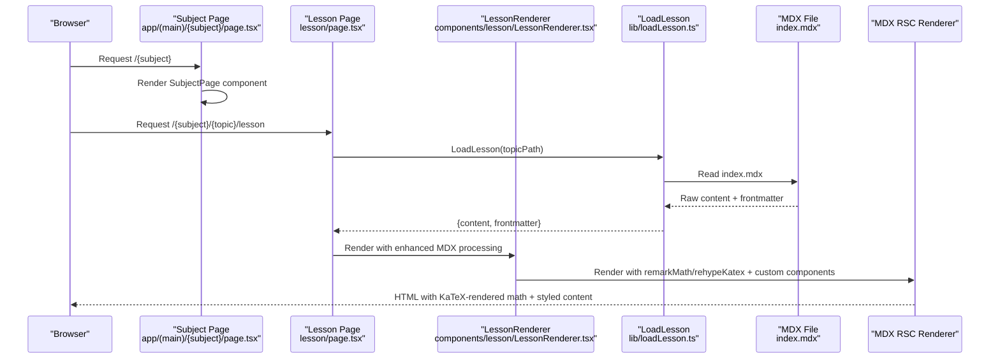
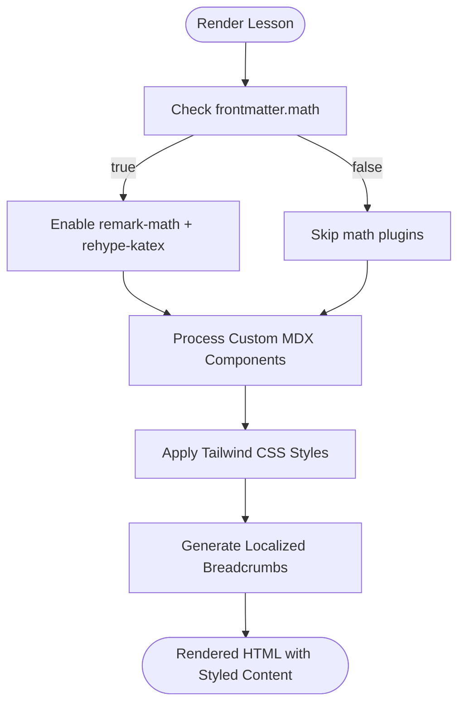
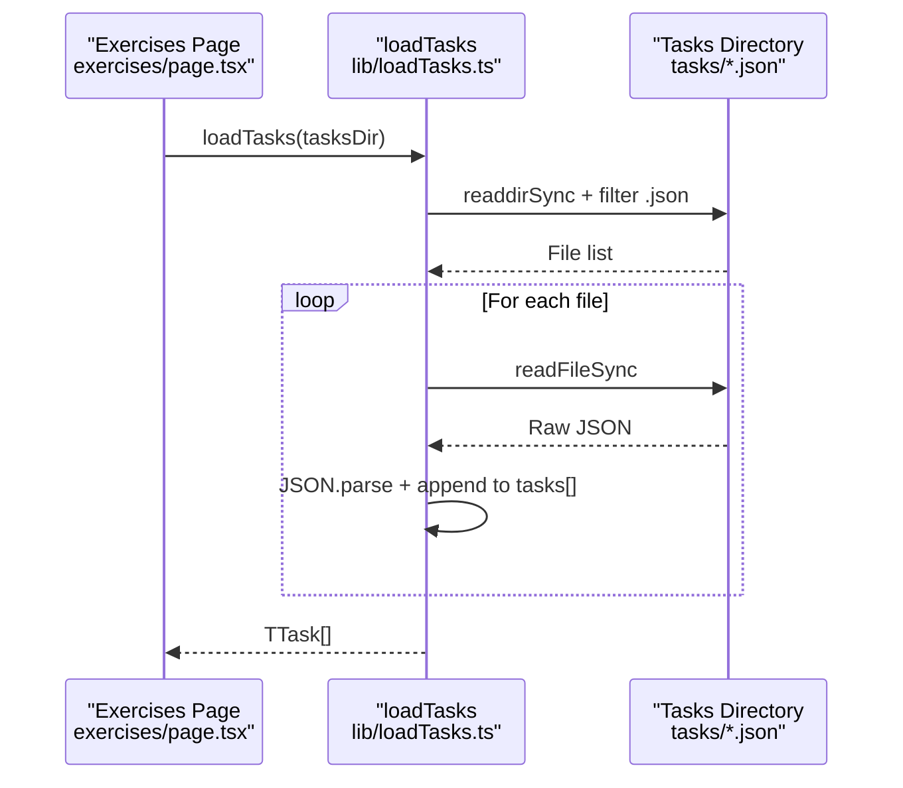
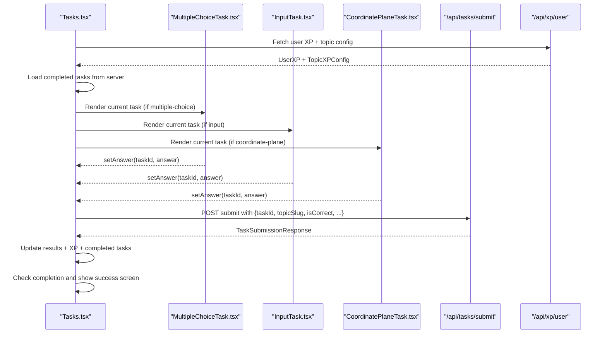
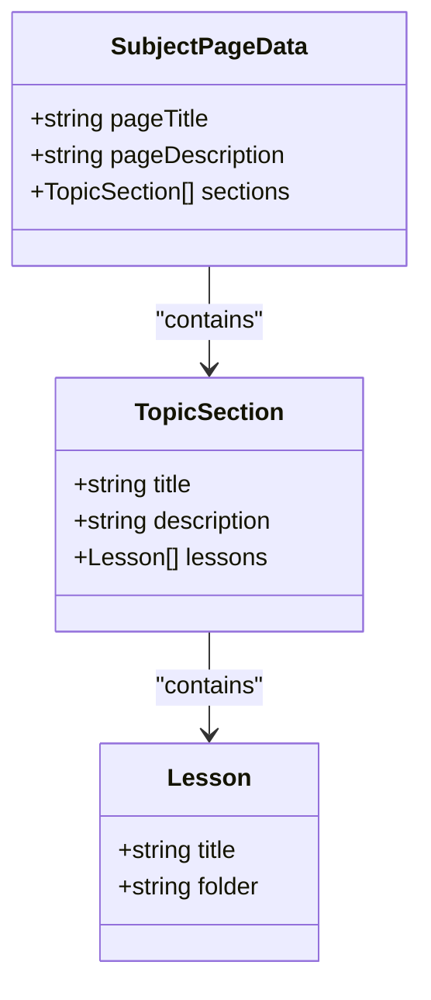
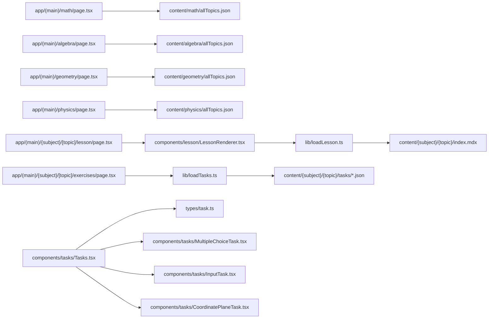

# Content Management System

<cite>
**Referenced Files in This Document**
- [content/math/allTopics.json](file://content/math/allTopics.json)
- [content/algebra/allTopics.json](file://content/algebra/allTopics.json)
- [content/geometry/allTopics.json](file://content/geometry/allTopics.json)
- [content/physics/allTopics.json](file://content/physics/allTopics.json)
- [content/math/addition_and_subtraction_of_fractions/config.json](file://content/math/addition_and_subtraction_of_fractions/config.json)
- [content/math/natural_numbers/index.mdx](file://content/math/natural_numbers/index.mdx)
- [content/math/addition_and_subtraction_of_fractions/index.mdx](file://content/math/addition_and_subtraction_of_fractions/index.mdx)
- [types/topic-config.ts](file://types/topic-config.ts)
- [lib/loadLesson.ts](file://lib/loadLesson.ts)
- [lib/loadTasks.ts](file://lib/loadTasks.ts)
- [types/lesson.ts](file://types/lesson.ts)
- [types/task.ts](file://types/task.ts)
- [app/(main)/math/[topic]/lesson/page.tsx](file://app/(main)/math/[topic]/lesson/page.tsx)
- [app/(main)/math/[topic]/exercices/page.tsx](file://app/(main)/math/[topic]/exercices/page.tsx)
- [app/(main)/algebra/[topic]/lesson/page.tsx](file://app/(main)/algebra/[topic]/lesson/page.tsx)
- [app/(main)/algebra/[topic]/exercises/page.tsx](file://app/(main)/algebra/[topic]/exercises/page.tsx)
- [app/(main)/geometry/[topic]/lesson/page.tsx](file://app/(main)/geometry/[topic]/lesson/page.tsx)
- [app/(main)/geometry/[topic]/exercises/page.tsx](file://app/(main)/geometry/[topic]/exercises/page.tsx)
- [app/(main)/physics/[topic]/lesson/page.tsx](file://app/(main)/physics/[topic]/lesson/page.tsx)
- [app/(main)/physics/[topic]/exercises/page.tsx](file://app/(main)/physics/[topic]/exercises/page.tsx)
- [components/tasks/Tasks.tsx](file://components/tasks/Tasks.tsx)
- [components/tasks/MultipleChoiceTask.tsx](file://components/tasks/MultipleChoiceTask.tsx)
- [components/tasks/InputTask.tsx](file://components/tasks/InputTask.tsx)
- [components/lesson/LessonRenderer.tsx](file://components/lesson/LessonRenderer.tsx)
- [components/SubjectPage.tsx](file://components/SubjectPage.tsx)
- [app/(main)/math/page.tsx](file://app/(main)/math/page.tsx)
- [app/(main)/algebra/page.tsx](file://app/(main)/algebra/page.tsx)
- [app/(main)/geometry/page.tsx](file://app/(main)/geometry/page.tsx)
- [app/(main)/physics/page.tsx](file://app/(main)/physics/page.tsx)
</cite>

## Update Summary
**Changes Made**
- Added comprehensive documentation for Physics subject implementation
- Updated subject-specific page structure documentation
- Enhanced lesson rendering system documentation with new LessonRenderer component
- Expanded task system documentation with advanced features
- Added detailed coverage of dynamic content loading mechanisms across all subjects
- Updated architecture diagrams to reflect expanded infrastructure

## Table of Contents
1. [Introduction](#introduction)
2. [Project Structure](#project-structure)
3. [Core Components](#core-components)
4. [Architecture Overview](#architecture-overview)
5. [Detailed Component Analysis](#detailed-component-analysis)
6. [Dependency Analysis](#dependency-analysis)
7. [Performance Considerations](#performance-considerations)
8. [Troubleshooting Guide](#troubleshooting-guide)
9. [Conclusion](#conclusion)
10. [Appendices](#appendices)

## Introduction
This document describes the content management system that powers the interactive math learning platform. It explains how subjects (Math, Algebra, Geometry, Physics) are organized, how MDX lessons are authored and rendered with mathematical notation, how topics are configured with difficulty levels and metadata, and how content is dynamically loaded to render lessons and tasks. The system now features enhanced MDX rendering capabilities with the new LessonRenderer component and comprehensive subject-specific implementations.

## Project Structure
The system is organized by subject with shared content and rendering components across four distinct subjects:
- Subject pages consume JSON topic catalogs to build browseable lists of lessons.
- Each lesson is an MDX file with frontmatter and embedded mathematical content.
- Tasks are JSON files located under each lesson's tasks directory.
- Rendering uses Next.js App Router dynamic routes and RSC with remark/rehype plugins for math.
- The new LessonRenderer component provides enhanced MDX processing and styling.

```mermaid
graph TB
subgraph "Subjects"
M["Math Page<br/>app/(main)/math/page.tsx"]
A["Algebra Page<br/>app/(main)/algebra/page.tsx"]
G["Geometry Page<br/>app/(main)/geometry/page.tsx"]
P["Physics Page<br/>app/(main)/physics/page.tsx"]
end
subgraph "Content Catalogs"
CM["Math Catalog<br/>content/math/allTopics.json"]
CA["Algebra Catalog<br/>content/algebra/allTopics.json"]
CG["Geometry Catalog<br/>content/geometry/allTopics.json"]
CP["Physics Catalog<br/>content/physics/allTopics.json"]
end
subgraph "Enhanced Lesson Rendering"
LR["LessonRenderer<br/>components/lesson/LessonRenderer.tsx"]
LPage["Lesson Page<br/>app/(main)/{subject}/[topic]/lesson/page.tsx"]
LoadLesson["LoadLesson<br/>lib/loadLesson.ts"]
MDX["MDX Source<br/>content/{subject}/{topic}/index.mdx"]
end
subgraph "Task Rendering"
EPage["Exercises Page<br/>app/(main)/{subject}/[topic]/exercises/page.tsx"]
LoadTasks["loadTasks<br/>lib/loadTasks.ts"]
TasksDir["Tasks JSON<br/>content/{subject}/{topic}/tasks/*.json"]
TasksComp["Tasks Component<br/>components/tasks/Tasks.tsx"]
end
M --> CM
A --> CA
G --> CG
P --> CP
CM --> LPage
CA --> LPage
CG --> LPage
CP --> LPage
LPage --> LR
LR --> LoadLesson
LoadLesson --> MDX
LPage --> EPage
EPage --> LoadTasks
LoadTasks --> TasksDir
EPage --> TasksComp
```

**Diagram sources**
- [app/(main)/math/page.tsx](file://app/(main)/math/page.tsx#L1-L9)
- [app/(main)/algebra/page.tsx](file://app/(main)/algebra/page.tsx#L1-L9)
- [app/(main)/geometry/page.tsx](file://app/(main)/geometry/page.tsx#L1-L9)
- [app/(main)/physics/page.tsx](file://app/(main)/physics/page.tsx#L1-L9)
- [content/math/allTopics.json](file://content/math/allTopics.json#L1-L26)
- [content/algebra/allTopics.json](file://content/algebra/allTopics.json#L1-L12)
- [content/geometry/allTopics.json](file://content/geometry/allTopics.json#L1-L12)
- [content/physics/allTopics.json](file://content/physics/allTopics.json#L1-L12)
- [components/lesson/LessonRenderer.tsx](file://components/lesson/LessonRenderer.tsx#L1-L182)
- [app/(main)/math/[topic]/lesson/page.tsx](file://app/(main)/math/[topic]/lesson/page.tsx#L1-L36)
- [lib/loadLesson.ts](file://lib/loadLesson.ts#L1-L17)
- [content/math/addition_and_subtraction_of_fractions/index.mdx](file://content/math/addition_and_subtraction_of_fractions/index.mdx#L1-L14)
- [app/(main)/math/[topic]/exercices/page.tsx](file://app/(main)/math/[topic]/exercices/page.tsx#L1-L42)
- [lib/loadTasks.ts](file://lib/loadTasks.ts#L1-L31)
- [components/tasks/Tasks.tsx](file://components/tasks/Tasks.tsx#L1-L373)

**Section sources**
- [app/(main)/math/page.tsx](file://app/(main)/math/page.tsx#L1-L9)
- [app/(main)/algebra/page.tsx](file://app/(main)/algebra/page.tsx#L1-L9)
- [app/(main)/geometry/page.tsx](file://app/(main)/geometry/page.tsx#L1-L9)
- [app/(main)/physics/page.tsx](file://app/(main)/physics/page.tsx#L1-L9)
- [content/math/allTopics.json](file://content/math/allTopics.json#L1-L26)
- [content/algebra/allTopics.json](file://content/algebra/allTopics.json#L1-L12)
- [content/geometry/allTopics.json](file://content/geometry/allTopics.json#L1-L12)
- [content/physics/allTopics.json](file://content/physics/allTopics.json#L1-L12)
- [components/lesson/LessonRenderer.tsx](file://components/lesson/LessonRenderer.tsx#L1-L182)
- [app/(main)/math/[topic]/lesson/page.tsx](file://app/(main)/math/[topic]/lesson/page.tsx#L1-L36)
- [app/(main)/math/[topic]/exercices/page.tsx](file://app/(main)/math/[topic]/exercices/page.tsx#L1-L42)
- [lib/loadLesson.ts](file://lib/loadLesson.ts#L1-L17)
- [lib/loadTasks.ts](file://lib/loadTasks.ts#L1-L31)
- [components/tasks/Tasks.tsx](file://components/tasks/Tasks.tsx#L1-L373)

## Core Components
- Subject catalog JSON: Defines subject-level page metadata and topic sections with lessons.
- Topic configuration: Per-topic JSON that sets slug, title, difficulty, category, tags, and learning parameters.
- Enhanced MDX lesson authoring: Frontmatter controls title, description, difficulty, and math flag; content supports inline and block math via KaTeX through the new LessonRenderer component.
- Dynamic lesson loader: Reads MDX, extracts frontmatter, and prepares MDX-RSC rendering with optional math plugins.
- Advanced task loader: Scans a tasks directory for JSON files and parses them into a unified task model with support for multiple task types.
- Enhanced task UI components: Interactive multiple-choice, input, and coordinate plane tasks with submission, feedback, XP integration, and auto-transition capabilities.
- Subject page renderer: Builds browsable topic lists from catalogs with localized subject labels.

**Section sources**
- [content/math/allTopics.json](file://content/math/allTopics.json#L1-L26)
- [content/math/addition_and_subtraction_of_fractions/config.json](file://content/math/addition_and_subtraction_of_fractions/config.json#L1-L10)
- [content/math/addition_and_subtraction_of_fractions/index.mdx](file://content/math/addition_and_subtraction_of_fractions/index.mdx#L1-L14)
- [components/lesson/LessonRenderer.tsx](file://components/lesson/LessonRenderer.tsx#L1-L182)
- [lib/loadLesson.ts](file://lib/loadLesson.ts#L1-L17)
- [lib/loadTasks.ts](file://lib/loadTasks.ts#L1-L31)
- [types/lesson.ts](file://types/lesson.ts#L1-L7)
- [types/task.ts](file://types/task.ts#L1-L25)
- [components/SubjectPage.tsx](file://components/SubjectPage.tsx#L1-L181)
- [components/tasks/Tasks.tsx](file://components/tasks/Tasks.tsx#L1-L373)

## Architecture Overview
The system follows a content-first architecture with enhanced rendering capabilities:
- Static content is stored in JSON catalogs and MDX files across four subjects.
- Pages are generated per topic with dynamic routes using generateStaticParams.
- Enhanced rendering uses Next.js App Router with RSC and MDX compilation through LessonRenderer.
- Tasks are loaded asynchronously with advanced lazy loading and code splitting.
- XP and topic configuration are fetched per-session for adaptive behavior with auto-transition features.

```mermaid
sequenceDiagram
participant Browser as "Browser"
participant SubjectPage as "Subject Page<br/>app/(main)/{subject}/page.tsx"
participant LessonPage as "Lesson Page<br/>lesson/page.tsx"
participant LessonRenderer as "LessonRenderer<br/>components/lesson/LessonRenderer.tsx"
participant Loader as "LoadLesson<br/>lib/loadLesson.ts"
participant FS as "MDX File<br/>index.mdx"
participant MDXRSC as "MDX RSC Renderer"
Browser->>SubjectPage : Request /{subject}
SubjectPage->>SubjectPage : Render SubjectPage component
Browser->>LessonPage : Request /{subject}/{topic}/lesson
LessonPage->>Loader : LoadLesson(topicPath)
Loader->>FS : Read index.mdx
FS-->>Loader : Raw content + frontmatter
Loader-->>LessonPage : {content, frontmatter}
LessonPage->>LessonRenderer : Render with enhanced MDX processing
LessonRenderer->>MDXRSC : Render with remarkMath/rehypeKatex + custom components
MDXRSC-->>Browser : HTML with KaTeX-rendered math + styled content
```

**Diagram sources**
- [app/(main)/math/page.tsx](file://app/(main)/math/page.tsx#L1-L9)
- [app/(main)/algebra/[topic]/lesson/page.tsx](file://app/(main)/algebra/[topic]/lesson/page.tsx#L1-L36)
- [components/lesson/LessonRenderer.tsx](file://components/lesson/LessonRenderer.tsx#L104-L182)
- [lib/loadLesson.ts](file://lib/loadLesson.ts#L1-L17)
- [content/math/addition_and_subtraction_of_fractions/index.mdx](file://content/math/addition_and_subtraction_of_fractions/index.mdx#L1-L14)

## Detailed Component Analysis

### Subject Catalogs and Topic Organization
- Each subject has a dedicated allTopics.json that defines:
  - Page-level title and description.
  - Sections with titles, descriptions, and ordered lessons.
  - Each lesson entry includes display title and folder name.
- Subject pages import the appropriate catalog and pass it to a reusable SubjectPage component.
- All four subjects (Math, Algebra, Geometry, Physics) follow identical organizational patterns.

Practical example: Adding a new topic section
- Edit the subject's allTopics.json to include a new section with lessons.
- Ensure each lesson has a unique folder under content/{subject}/{lessonFolder}.

**Section sources**
- [content/math/allTopics.json](file://content/math/allTopics.json#L1-L26)
- [content/algebra/allTopics.json](file://content/algebra/allTopics.json#L1-L12)
- [content/geometry/allTopics.json](file://content/geometry/allTopics.json#L1-L12)
- [content/physics/allTopics.json](file://content/physics/allTopics.json#L1-L12)
- [app/(main)/math/page.tsx](file://app/(main)/math/page.tsx#L1-L9)
- [app/(main)/algebra/page.tsx](file://app/(main)/algebra/page.tsx#L1-L9)
- [app/(main)/geometry/page.tsx](file://app/(main)/geometry/page.tsx#L1-L9)
- [app/(main)/physics/page.tsx](file://app/(main)/physics/page.tsx#L1-L9)

### Topic Configuration Management
- Per-topic config.json defines:
  - Slug, title, description, difficulty, category.
  - Position in listings, tags, and XP-related parameters.
- The TopicConfig type enumerates supported difficulty levels and XP scheduling fields.

Practical example: Configure a new topic
- Create config.json inside the lesson's content directory with required fields.
- Use difficulty values from the TopicDifficulty union.

**Section sources**
- [content/math/addition_and_subtraction_of_fractions/config.json](file://content/math/addition_and_subtraction_of_fractions/config.json#L1-L10)
- [types/topic-config.ts](file://types/topic-config.ts#L1-L17)

### Enhanced MDX Lesson Authoring and Mathematical Notation
- MDX frontmatter supports title, description, difficulty, and a math flag.
- Inline math uses single-dollar delimiters; block math uses double-dollar delimiters.
- The new LessonRenderer component provides enhanced MDX processing with custom components and styling.
- Custom components include specialized styling for headings, paragraphs, lists, code blocks, and quotes.
- Automatic breadcrumb generation with localized subject labels.

Practical example: Writing math in a lesson
- Use inline math syntax within paragraphs.
- Use block math for standalone equations.
- Ensure the frontmatter math field is set appropriately.

```mermaid
flowchart TD
Start(["Render Lesson"]) --> CheckMath["Check frontmatter.math"]
CheckMath --> |true| EnablePlugins["Enable remark-math + rehype-katex"]
CheckMath --> |false| SkipPlugins["Skip math plugins"]
EnablePlugins --> ProcessComponents["Process Custom MDX Components"]
SkipPlugins --> ProcessComponents
ProcessComponents --> ApplyStyles["Apply Tailwind CSS Styles"]
ApplyStyles --> GenerateBreadcrumbs["Generate Localized Breadcrumbs"]
GenerateBreadcrumbs --> Output(["Rendered HTML with Styled Content"])
```

**Diagram sources**
- [components/lesson/LessonRenderer.tsx](file://components/lesson/LessonRenderer.tsx#L104-L182)
- [content/math/addition_and_subtraction_of_fractions/index.mdx](file://content/math/addition_and_subtraction_of_fractions/index.mdx#L1-L14)

**Section sources**
- [content/math/natural_numbers/index.mdx](file://content/math/natural_numbers/index.mdx#L1-L14)
- [content/math/addition_and_subtraction_of_fractions/index.mdx](file://content/math/addition_and_subtraction_of_fractions/index.mdx#L1-L14)
- [types/lesson.ts](file://types/lesson.ts#L1-L7)
- [components/lesson/LessonRenderer.tsx](file://components/lesson/LessonRenderer.tsx#L1-L182)

### Dynamic Content Loading Mechanisms
- LoadLesson reads the MDX file, extracts frontmatter via gray-matter, and returns content and metadata.
- loadTasks scans the tasks directory, filters JSON files, parses them, and aggregates into a single array.
- Subject pages use generateStaticParams to statically generate all topic routes during build time.
- Enhanced error handling and parameter validation for dynamic routes.

```mermaid
sequenceDiagram
participant Exercises as "Exercises Page<br/>exercises/page.tsx"
participant Loader as "loadTasks<br/>lib/loadTasks.ts"
participant FS as "Tasks Directory<br/>tasks/*.json"
Exercises->>Loader : loadTasks(tasksDir)
Loader->>FS : readdirSync + filter .json
FS-->>Loader : File list
loop For each file
Loader->>FS : readFileSync
FS-->>Loader : Raw JSON
Loader->>Loader : JSON.parse + append to tasks[]
end
Loader-->>Exercises : TTask[]
```

**Diagram sources**
- [app/(main)/math/[topic]/exercices/page.tsx](file://app/(main)/math/[topic]/exercices/page.tsx#L1-L42)
- [lib/loadTasks.ts](file://lib/loadTasks.ts#L1-L31)

**Section sources**
- [lib/loadLesson.ts](file://lib/loadLesson.ts#L1-L17)
- [lib/loadTasks.ts](file://lib/loadTasks.ts#L1-L31)
- [app/(main)/math/[topic]/exercices/page.tsx](file://app/(main)/math/[topic]/exercices/page.tsx#L1-L42)
- [app/(main)/algebra/[topic]/exercises/page.tsx](file://app/(main)/algebra/[topic]/exercises/page.tsx#L1-L42)
- [app/(main)/geometry/[topic]/exercises/page.tsx](file://app/(main)/geometry/[topic]/exercises/page.tsx#L1-L42)
- [app/(main)/physics/[topic]/exercises/page.tsx](file://app/(main)/physics/[topic]/exercises/page.tsx#L1-L42)

### Advanced Task System and Interactive Rendering
- Tasks.tsx orchestrates:
  - Fetching user XP and topic config with proper error handling.
  - Filtering out completed tasks with submission results restoration.
  - Presenting current task and handling submissions with auto-transition.
  - Updating UI with results, XP feedback, and completion detection.
  - Advanced lazy loading with Suspense boundaries for code splitting.
- MultipleChoiceTask, InputTask, and CoordinatePlaneTask provide specialized interactive components.
- Submission sends task details to the backend API and updates local state with optimistic updates.
- Auto-transition feature automatically advances to next task after correct answers.
- Comprehensive success screen with review date display.

```mermaid
sequenceDiagram
participant UI as "Tasks.tsx"
participant MC as "MultipleChoiceTask.tsx"
participant IN as "InputTask.tsx"
participant CP as "CoordinatePlaneTask.tsx"
participant API as "/api/tasks/submit"
participant XPAPI as "/api/xp/user"
UI->>XPAPI : Fetch user XP + topic config
XPAPI-->>UI : UserXP + TopicXPConfig
UI->>UI : Load completed tasks from server
UI->>MC : Render current task (if multiple-choice)
UI->>IN : Render current task (if input)
UI->>CP : Render current task (if coordinate-plane)
MC-->>UI : setAnswer(taskId, answer)
IN-->>UI : setAnswer(taskId, answer)
CP-->>UI : setAnswer(taskId, answer)
UI->>API : POST submit with {taskId, topicSlug, isCorrect, ...}
API-->>UI : TaskSubmissionResponse
UI->>UI : Update results + XP + completed tasks
UI->>UI : Check completion and show success screen
```

**Diagram sources**
- [components/tasks/Tasks.tsx](file://components/tasks/Tasks.tsx#L1-L373)
- [components/tasks/MultipleChoiceTask.tsx](file://components/tasks/MultipleChoiceTask.tsx#L1-L72)
- [components/tasks/InputTask.tsx](file://components/tasks/InputTask.tsx#L1-L97)

**Section sources**
- [components/tasks/Tasks.tsx](file://components/tasks/Tasks.tsx#L1-L373)
- [components/tasks/MultipleChoiceTask.tsx](file://components/tasks/MultipleChoiceTask.tsx#L1-L72)
- [components/tasks/InputTask.tsx](file://components/tasks/InputTask.tsx#L1-L97)
- [types/task.ts](file://types/task.ts#L1-L25)

### Enhanced Subject Page Rendering
- SubjectPage.tsx accepts a SubjectPageData object and renders:
  - Page header with title and description.
  - Topic sections with lesson cards linking to lesson pages.
  - Localized subject labels for better user experience.
- All subject pages follow identical patterns with different basePath values.

```mermaid
classDiagram
class SubjectPageData {
+string pageTitle
+string pageDescription
+TopicSection[] sections
}
class TopicSection {
+string title
+string description
+Lesson[] lessons
}
class Lesson {
+string title
+string folder
}
SubjectPageData --> TopicSection : "contains"
TopicSection --> Lesson : "contains"
```

**Diagram sources**
- [components/SubjectPage.tsx](file://components/SubjectPage.tsx#L1-L181)

**Section sources**
- [components/SubjectPage.tsx](file://components/SubjectPage.tsx#L1-L181)

### Physics Subject Implementation
- Physics subject follows the exact same pattern as other subjects.
- Uses the same catalog structure and dynamic routing.
- Implements the same lesson and exercise pages with subject-specific basePath.
- Physics catalog currently contains minimal content but follows the established structure.

**Section sources**
- [content/physics/allTopics.json](file://content/physics/allTopics.json#L1-L12)
- [app/(main)/physics/[topic]/lesson/page.tsx](file://app/(main)/physics/[topic]/lesson/page.tsx#L1-L36)
- [app/(main)/physics/[topic]/exercises/page.tsx](file://app/(main)/physics/[topic]/exercises/page.tsx#L1-L42)

## Dependency Analysis
- Pages depend on content catalogs for navigation across all four subjects.
- Lesson pages depend on the lesson loader and enhanced MDX rendering pipeline.
- Exercises pages depend on the task loader and advanced task components.
- Task components depend on types, APIs, and enhanced submission handling.
- LessonRenderer depends on MDX remote processing and KaTeX rendering.

```mermaid
graph LR
MathPage["app/(main)/math/page.tsx"] --> MathCatalog["content/math/allTopics.json"]
AlgebraPage["app/(main)/algebra/page.tsx"] --> AlgebraCatalog["content/algebra/allTopics.json"]
GeometryPage["app/(main)/geometry/page.tsx"] --> GeometryCatalog["content/geometry/allTopics.json"]
PhysicsPage["app/(main)/physics/page.tsx"] --> PhysicsCatalog["content/physics/allTopics.json"]
LessonPage["app/(main)/{subject}/[topic]/lesson/page.tsx"] --> LessonRenderer["components/lesson/LessonRenderer.tsx"]
LessonRenderer --> LoadLesson["lib/loadLesson.ts"]
LoadLesson --> MDXFile["content/{subject}/{topic}/index.mdx"]
ExercisesPage["app/(main)/{subject}/[topic]/exercises/page.tsx"] --> LoadTasks["lib/loadTasks.ts"]
LoadTasks --> TasksJSON["content/{subject}/{topic}/tasks/*.json"]
TasksUI["components/tasks/Tasks.tsx"] --> Types["types/task.ts"]
TasksUI --> MC["components/tasks/MultipleChoiceTask.tsx"]
TasksUI --> IN["components/tasks/InputTask.tsx"]
TasksUI --> CP["components/tasks/CoordinatePlaneTask.tsx"]
```

**Diagram sources**
- [app/(main)/math/page.tsx](file://app/(main)/math/page.tsx#L1-L9)
- [app/(main)/algebra/page.tsx](file://app/(main)/algebra/page.tsx#L1-L9)
- [app/(main)/geometry/page.tsx](file://app/(main)/geometry/page.tsx#L1-L9)
- [app/(main)/physics/page.tsx](file://app/(main)/physics/page.tsx#L1-L9)
- [content/math/allTopics.json](file://content/math/allTopics.json#L1-L26)
- [content/algebra/allTopics.json](file://content/algebra/allTopics.json#L1-L12)
- [content/geometry/allTopics.json](file://content/geometry/allTopics.json#L1-L12)
- [content/physics/allTopics.json](file://content/physics/allTopics.json#L1-L12)
- [components/lesson/LessonRenderer.tsx](file://components/lesson/LessonRenderer.tsx#L1-L182)
- [app/(main)/math/[topic]/lesson/page.tsx](file://app/(main)/math/[topic]/lesson/page.tsx#L1-L36)
- [lib/loadLesson.ts](file://lib/loadLesson.ts#L1-L17)
- [content/math/addition_and_subtraction_of_fractions/index.mdx](file://content/math/addition_and_subtraction_of_fractions/index.mdx#L1-L14)
- [app/(main)/math/[topic]/exercices/page.tsx](file://app/(main)/math/[topic]/exercices/page.tsx#L1-L42)
- [lib/loadTasks.ts](file://lib/loadTasks.ts#L1-L31)
- [types/task.ts](file://types/task.ts#L1-L25)
- [components/tasks/Tasks.tsx](file://components/tasks/Tasks.tsx#L1-L373)
- [components/tasks/MultipleChoiceTask.tsx](file://components/tasks/MultipleChoiceTask.tsx#L1-L72)
- [components/tasks/InputTask.tsx](file://components/tasks/InputTask.tsx#L1-L97)
- [components/tasks/CoordinatePlaneTask.tsx](file://components/tasks/CoordinatePlaneTask.tsx#L1-L120)

**Section sources**
- [app/(main)/math/page.tsx](file://app/(main)/math/page.tsx#L1-L9)
- [app/(main)/algebra/page.tsx](file://app/(main)/algebra/page.tsx#L1-L9)
- [app/(main)/geometry/page.tsx](file://app/(main)/geometry/page.tsx#L1-L9)
- [app/(main)/physics/page.tsx](file://app/(main)/physics/page.tsx#L1-L9)
- [app/(main)/math/[topic]/lesson/page.tsx](file://app/(main)/math/[topic]/lesson/page.tsx#L1-L36)
- [app/(main)/math/[topic]/exercices/page.tsx](file://app/(main)/math/[topic]/exercices/page.tsx#L1-L42)
- [lib/loadLesson.ts](file://lib/loadLesson.ts#L1-L17)
- [lib/loadTasks.ts](file://lib/loadTasks.ts#L1-L31)
- [types/task.ts](file://types/task.ts#L1-L25)
- [components/lesson/LessonRenderer.tsx](file://components/lesson/LessonRenderer.tsx#L1-L182)
- [components/tasks/Tasks.tsx](file://components/tasks/Tasks.tsx#L1-L373)

## Performance Considerations
- Disable ISR/SSR for lesson pages to ensure fresh content and avoid stale MDX rendering.
- Keep MDX files small and avoid heavy images; defer non-critical assets.
- Use static generation for subject catalogs with generateStaticParams for optimal performance.
- Implement lazy loading for task components to reduce initial bundle size.
- Batch task loading and avoid unnecessary re-renders by memoizing computed values.
- Use Suspense boundaries for seamless code splitting experience.
- Cache user XP data and topic configurations to minimize API calls.
- Implement auto-transition delays for better user experience and reduced server load.

## Troubleshooting Guide
Common issues and resolutions:
- Math not rendering:
  - Verify frontmatter math flag is present and truthy.
  - Confirm remark-math and rehype-katex are enabled in the LessonRenderer.
- Task parsing errors:
  - Ensure task JSON files are valid and parseable.
  - Check for mixed arrays and objects; the loader handles both.
  - Verify task types match supported task interfaces.
- Navigation links:
  - Ensure lesson folders match entries in the subject catalog.
  - Confirm dynamic route parameters align with catalog slugs.
- Subject-specific issues:
  - Verify Physics subject catalog exists and is properly formatted.
  - Check that generateStaticParams returns valid topic parameters.
  - Ensure LessonRenderer receives correct subject and topic props.
- Enhanced rendering problems:
  - Verify LessonRenderer has access to required dependencies.
  - Check that MDX components are properly registered.
  - Ensure custom styles are applied correctly.

**Section sources**
- [components/lesson/LessonRenderer.tsx](file://components/lesson/LessonRenderer.tsx#L113-L116)
- [lib/loadTasks.ts](file://lib/loadTasks.ts#L16-L26)
- [content/math/allTopics.json](file://content/math/allTopics.json#L8-L13)
- [app/(main)/physics/[topic]/lesson/page.tsx](file://app/(main)/physics/[topic]/lesson/page.tsx#L9-L16)
- [components/lesson/LessonRenderer.tsx](file://components/lesson/LessonRenderer.tsx#L1-L182)

## Conclusion
The content management system combines static catalogs, enhanced MDX-authored lessons with the new LessonRenderer component, and advanced dynamic task rendering to deliver an interactive learning experience across four subjects. By organizing content around subjects and topics, enabling math rendering with KaTeX, structuring tasks with clear models, and implementing auto-transition features, the platform supports scalable authoring and personalized practice with improved user experience.

## Appendices

### Practical Examples

- Create a new lesson
  - Add a new folder under content/{subject}/{lessonFolder}.
  - Write index.mdx with frontmatter (title, description, difficulty, math).
  - Place task JSON files under content/{subject}/{lessonFolder}/tasks/.
  - Reference the lesson in the subject's allTopics.json.

- Configure topic parameters
  - Create config.json in the lesson's content directory with slug, title, difficulty, category, tags, and position.
  - Use difficulty values from the TopicDifficulty union.

- Integrate mathematical formulas
  - Use inline math with single-dollar delimiters in paragraphs.
  - Use block math with double-dollar delimiters for standalone equations.
  - Ensure the lesson's frontmatter math flag is set to enable KaTeX rendering.

- Implement subject-specific pages
  - Create subject page component following the established pattern.
  - Import and pass the subject's allTopics.json catalog.
  - Use appropriate basePath for navigation.

- Enhance task system
  - Support multiple task types: multiple-choice, input, and coordinate-plane.
  - Implement auto-transition for better user experience.
  - Add lazy loading for improved performance.
  - Integrate XP tracking and completion detection.

**Section sources**
- [content/math/addition_and_subtraction_of_fractions/index.mdx](file://content/math/addition_and_subtraction_of_fractions/index.mdx#L1-L14)
- [content/math/addition_and_subtraction_of_fractions/config.json](file://content/math/addition_and_subtraction_of_fractions/config.json#L1-L10)
- [content/math/allTopics.json](file://content/math/allTopics.json#L8-L13)
- [components/lesson/LessonRenderer.tsx](file://components/lesson/LessonRenderer.tsx#L113-L116)
- [components/tasks/Tasks.tsx](file://components/tasks/Tasks.tsx#L173-L218)
- [app/(main)/physics/[topic]/lesson/page.tsx](file://app/(main)/physics/[topic]/lesson/page.tsx#L1-L36)