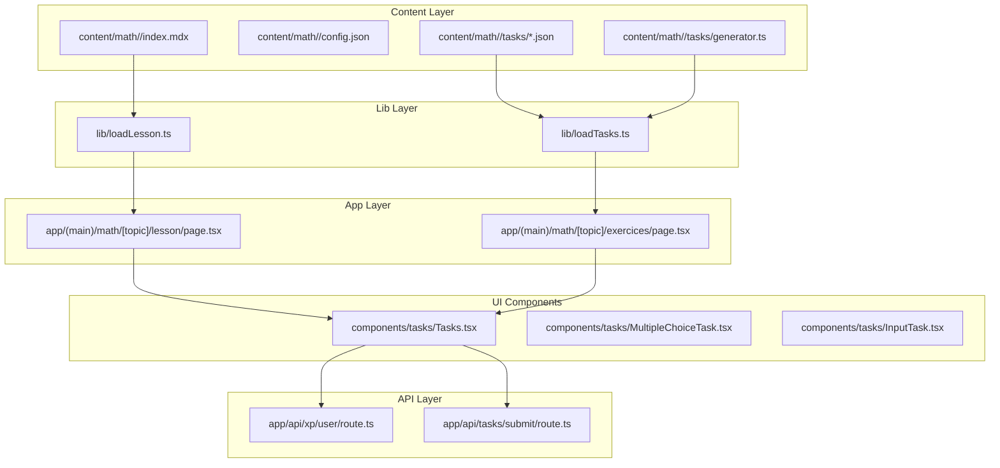
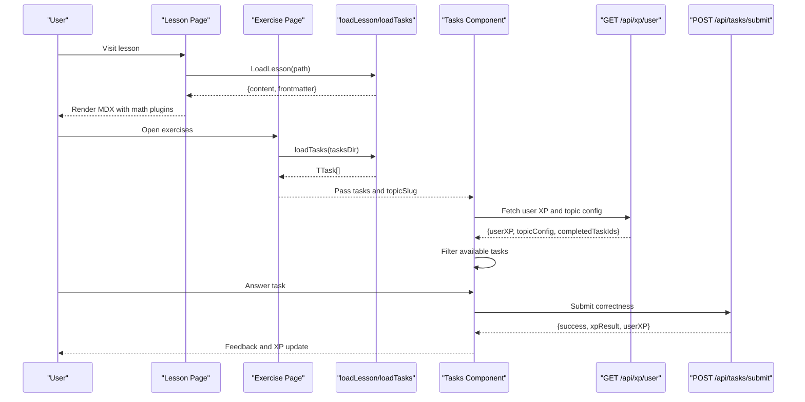
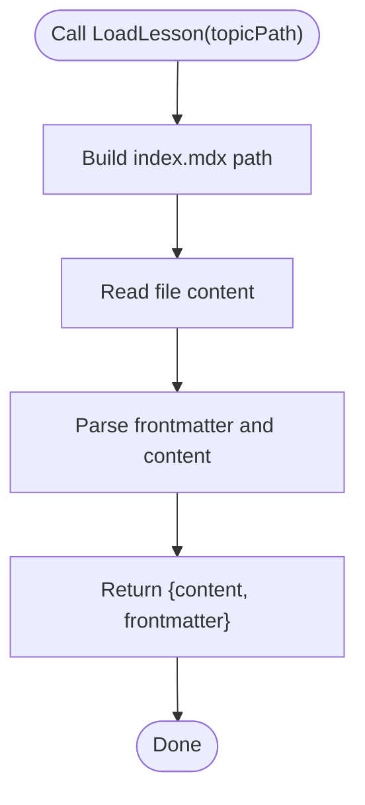
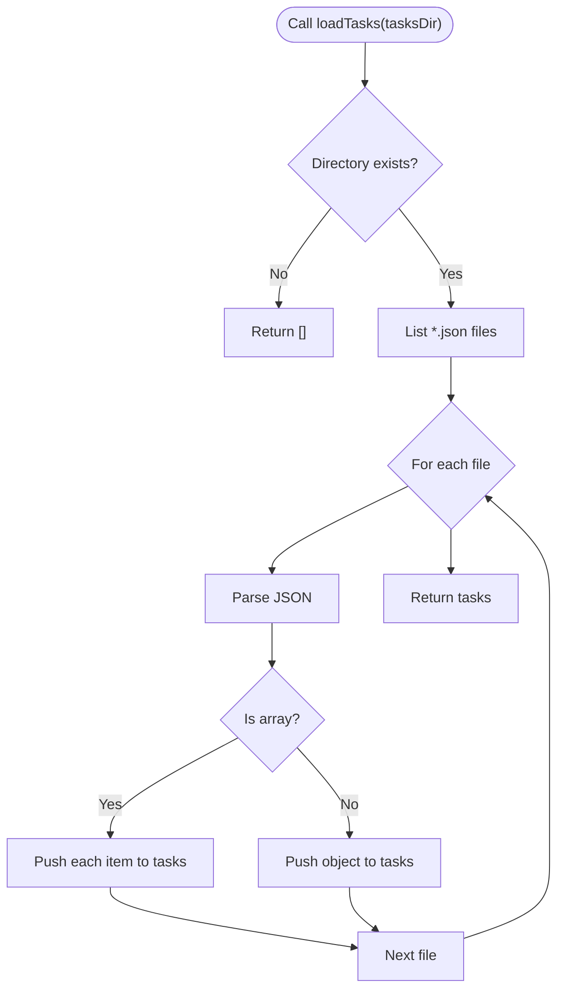
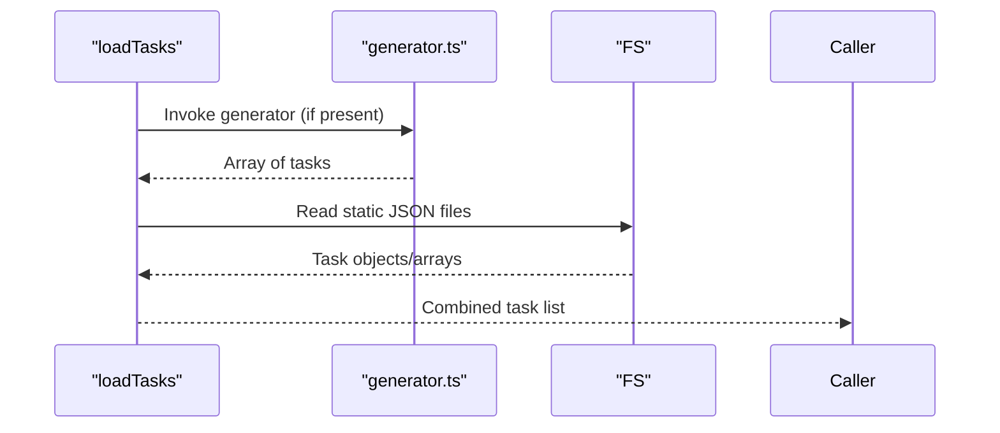
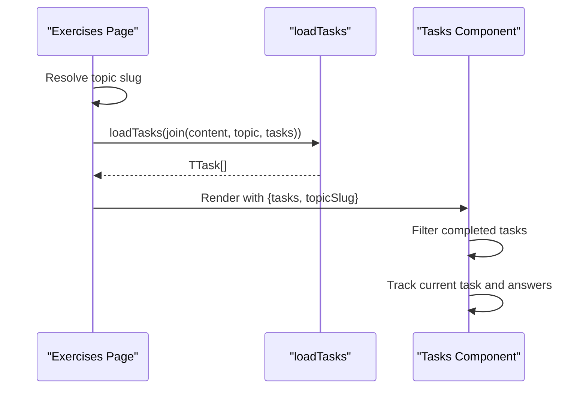
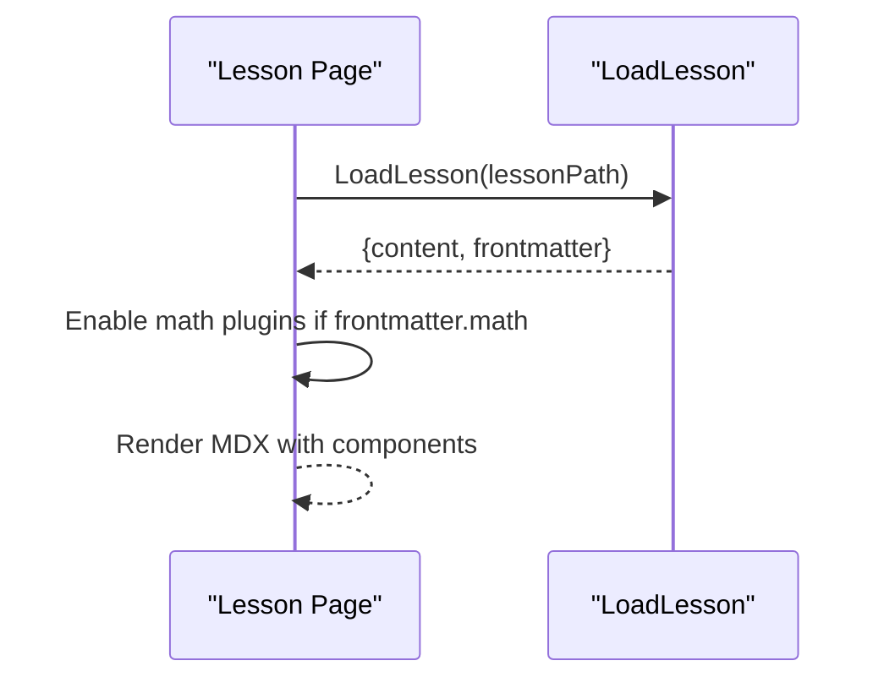
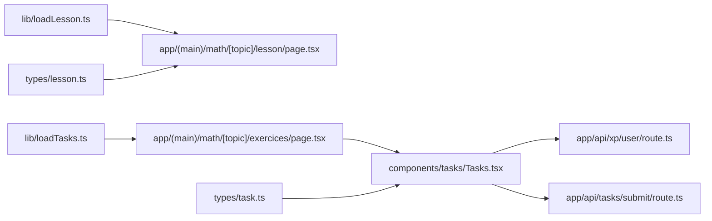

# Dynamic Content Loading & Task Integration

<cite>
**Referenced Files in This Document**
- [loadLesson.ts](file://lib/loadLesson.ts)
- [loadTasks.ts](file://lib/loadTasks.ts)
- [lesson.ts](file://types/lesson.ts)
- [task.ts](file://types/task.ts)
- [generator.ts](file://content/math/addition_and_subtraction_of_fractions/tasks/generator.ts)
- [001-mcq.json](file://content/math/addition_and_subtraction_of_fractions/tasks/001-mcq.json)
- [Tasks.tsx](file://components/tasks/Tasks.tsx)
- [MultipleChoiceTask.tsx](file://components/tasks/MultipleChoiceTask.tsx)
- [InputTask.tsx](file://components/tasks/InputTask.tsx)
- [page.tsx (lesson)](file://app/(main)/math/[topic]/lesson/page.tsx)
- [page.tsx (exercises)](file://app/(main)/math/[topic]/exercices/page.tsx)
- [route.ts (tasks submit)](file://app/api/tasks/submit/route.ts)
- [route.ts (xp user)](file://app/api/xp/user/route.ts)
- [config.json](file://content/math/addition_and_subtraction_of_fractions/config.json)
- [index.mdx](file://content/math/addition_and_subtraction_of_fractions/index.mdx)
</cite>

## Table of Contents
1. [Introduction](#introduction)
2. [Project Structure](#project-structure)
3. [Core Components](#core-components)
4. [Architecture Overview](#architecture-overview)
5. [Detailed Component Analysis](#detailed-component-analysis)
6. [Dependency Analysis](#dependency-analysis)
7. [Performance Considerations](#performance-considerations)
8. [Troubleshooting Guide](#troubleshooting-guide)
9. [Conclusion](#conclusion)
10. [Appendices](#appendices)

## Introduction
This document explains the dynamic content loading system that fetches and renders lessons with integrated tasks. It covers how loadLesson.ts and loadTasks.ts assemble complete learning experiences, how task generators produce dynamic content variations, and how different task formats (multiple choice and input) are integrated into lessons. It also documents the file organization structure for tasks, the task loading pipeline, caching and performance considerations, practical examples for creating task generators and custom task types, and guidance for debugging content loading issues. Finally, it addresses content versioning, task randomization, and cross-device consistency.

## Project Structure
The learning system is organized around content-driven lessons and task sets:
- Lessons are authored in MDX under content/<subject>/<topic>/index.mdx with frontmatter metadata.
- Tasks are stored as JSON files under content/<subject>/<topic>/tasks/.
- Task generation logic can be provided via a generator script per topic.
- Rendering pages orchestrate lesson rendering and task presentation.



**Diagram sources**
- [page.tsx (lesson)](file://app/(main)/math/[topic]/lesson/page.tsx#L29-L90)
- [page.tsx (exercises)](file://app/(main)/math/[topic]/exercices/page.tsx#L8-L31)
- [loadLesson.ts](file://lib/loadLesson.ts#L6-L16)
- [loadTasks.ts](file://lib/loadTasks.ts#L5-L30)
- [Tasks.tsx](file://components/tasks/Tasks.tsx#L12-L441)
- [route.ts (tasks submit)](file://app/api/tasks/submit/route.ts#L6-L58)
- [route.ts (xp user)](file://app/api/xp/user/route.ts#L5-L40)

**Section sources**
- [page.tsx (lesson)](file://app/(main)/math/[topic]/lesson/page.tsx#L1-L94)
- [page.tsx (exercises)](file://app/(main)/math/[topic]/exercices/page.tsx#L1-L32)
- [loadLesson.ts](file://lib/loadLesson.ts#L1-L17)
- [loadTasks.ts](file://lib/loadTasks.ts#L1-L31)

## Core Components
- Lesson loader: Reads and parses MDX with frontmatter metadata.
- Task loader: Scans a topic’s tasks directory, parses all JSON files, and flattens arrays into a single task list.
- Task components: Render multiple-choice and input tasks, manage answers, and integrate with XP APIs.
- Exercise page: Assembles tasks for a topic and passes them to the Tasks component.
- Lesson page: Renders the lesson content with optional math support.

Key data types:
- Lesson frontmatter defines title, description, difficulty, and math toggle.
- Task union supports multiple-choice and input variants with shared fields.

**Section sources**
- [lesson.ts](file://types/lesson.ts#L1-L7)
- [task.ts](file://types/task.ts#L1-L25)
- [loadLesson.ts](file://lib/loadLesson.ts#L6-L16)
- [loadTasks.ts](file://lib/loadTasks.ts#L5-L30)
- [Tasks.tsx](file://components/tasks/Tasks.tsx#L12-L441)

## Architecture Overview
The system follows a content-first, static-rendered lesson page and a dynamic task-exercise page:
- Lesson page statically generates content from MDX with optional math plugins.
- Exercise page dynamically loads tasks from JSON and optionally generated tasks.
- Tasks component manages user progress, XP retrieval, and submission to the backend.



**Diagram sources**
- [page.tsx (lesson)](file://app/(main)/math/[topic]/lesson/page.tsx#L29-L90)
- [page.tsx (exercises)](file://app/(main)/math/[topic]/exercices/page.tsx#L8-L31)
- [loadLesson.ts](file://lib/loadLesson.ts#L6-L16)
- [loadTasks.ts](file://lib/loadTasks.ts#L5-L30)
- [Tasks.tsx](file://components/tasks/Tasks.tsx#L47-L122)
- [route.ts (tasks submit)](file://app/api/tasks/submit/route.ts#L6-L58)
- [route.ts (xp user)](file://app/api/xp/user/route.ts#L5-L40)

## Detailed Component Analysis

### Lesson Loading Pipeline
- Reads index.mdx from a topic path.
- Parses frontmatter and returns content and metadata.
- Lesson page conditionally enables math rendering based on frontmatter flag.



**Diagram sources**
- [loadLesson.ts](file://lib/loadLesson.ts#L6-L16)
- [page.tsx (lesson)](file://app/(main)/math/[topic]/lesson/page.tsx#L36-L46)

**Section sources**
- [loadLesson.ts](file://lib/loadLesson.ts#L6-L16)
- [lesson.ts](file://types/lesson.ts#L1-L7)
- [page.tsx (lesson)](file://app/(main)/math/[topic]/lesson/page.tsx#L36-L46)

### Task Loading Pipeline
- Validates tasks directory existence.
- Lists JSON files and ignores non-JSON entries.
- Parses each file; if the parsed value is an array, iterates and pushes each element; otherwise pushes the object.
- Returns a flattened task list.



**Diagram sources**
- [loadTasks.ts](file://lib/loadTasks.ts#L5-L30)

**Section sources**
- [loadTasks.ts](file://lib/loadTasks.ts#L5-L30)
- [task.ts](file://types/task.ts#L1-L25)

### Task Generators and Dynamic Variations
- Generator script produces multiple task variants programmatically.
- The loader includes generator output alongside static JSON tasks.
- Example generator creates multiple-choice tasks with randomized but deterministic parameters.



**Diagram sources**
- [loadTasks.ts](file://lib/loadTasks.ts#L5-L30)
- [generator.ts](file://content/math/addition_and_subtraction_of_fractions/tasks/generator.ts#L1-L25)

**Section sources**
- [generator.ts](file://content/math/addition_and_subtraction_of_fractions/tasks/generator.ts#L1-L25)

### Task Formats Integration
- Multiple-choice tasks render options, show correctness feedback, and display comments.
- Input tasks normalize answers and accept multiple correct forms.
- Tasks component orchestrates navigation, completion tracking, and XP updates.

```mermaid
classDiagram
class TMultipleChoiceTask {
+string id
+string type
+string? description
+string question
+{ text : string; comment? : string | null }[] options
+number answer
+("easy"|"medium"|"hard"|string)? difficulty
+number? baseXP
}
class TInputTask {
+string id
+string type
+string? description
+string question
+string placeholder
+string correct
+string[] accepted
+("easy"|"medium"|"hard"|string)? difficulty
+number? baseXP
}
class TTask {
}
TTask <|-- TMultipleChoiceTask
TTask <|-- TInputTask
```

**Diagram sources**
- [task.ts](file://types/task.ts#L1-L25)

**Section sources**
- [MultipleChoiceTask.tsx](file://components/tasks/MultipleChoiceTask.tsx#L11-L72)
- [InputTask.tsx](file://components/tasks/InputTask.tsx#L11-L97)
- [Tasks.tsx](file://components/tasks/Tasks.tsx#L12-L441)
- [task.ts](file://types/task.ts#L1-L25)

### Exercise Page and Task Presentation
- The exercise page resolves the topic slug, builds the tasks directory path, loads tasks, and renders the Tasks component.
- Tasks component filters out completed tasks, tracks answers, and submits correct answers to the backend.



**Diagram sources**
- [page.tsx (exercises)](file://app/(main)/math/[topic]/exercices/page.tsx#L8-L31)
- [Tasks.tsx](file://components/tasks/Tasks.tsx#L12-L441)
- [loadTasks.ts](file://lib/loadTasks.ts#L5-L30)

**Section sources**
- [page.tsx (exercises)](file://app/(main)/math/[topic]/exercices/page.tsx#L8-L31)
- [Tasks.tsx](file://components/tasks/Tasks.tsx#L12-L441)

### Lesson Rendering with Math Support
- Lesson page reads lesson metadata and content, conditionally enabling math plugins based on frontmatter.
- Uses MDX Remote to render content with custom components.



**Diagram sources**
- [page.tsx (lesson)](file://app/(main)/math/[topic]/lesson/page.tsx#L29-L90)
- [loadLesson.ts](file://lib/loadLesson.ts#L6-L16)

**Section sources**
- [page.tsx (lesson)](file://app/(main)/math/[topic]/lesson/page.tsx#L29-L90)
- [index.mdx](file://content/math/addition_and_subtraction_of_fractions/index.mdx#L1-L14)

## Dependency Analysis
- Lesson page depends on loadLesson for content extraction and MDX rendering.
- Exercise page depends on loadTasks for assembling tasks.
- Tasks component depends on:
  - Frontend state and effects for user progress.
  - API endpoints for XP retrieval and task submission.
- Task types define the contract for both static and generated tasks.



**Diagram sources**
- [loadLesson.ts](file://lib/loadLesson.ts#L6-L16)
- [loadTasks.ts](file://lib/loadTasks.ts#L5-L30)
- [page.tsx (lesson)](file://app/(main)/math/[topic]/lesson/page.tsx#L29-L90)
- [page.tsx (exercises)](file://app/(main)/math/[topic]/exercices/page.tsx#L8-L31)
- [Tasks.tsx](file://components/tasks/Tasks.tsx#L12-L441)
- [route.ts (tasks submit)](file://app/api/tasks/submit/route.ts#L6-L58)
- [route.ts (xp user)](file://app/api/xp/user/route.ts#L5-L40)
- [lesson.ts](file://types/lesson.ts#L1-L7)
- [task.ts](file://types/task.ts#L1-L25)

**Section sources**
- [loadLesson.ts](file://lib/loadLesson.ts#L6-L16)
- [loadTasks.ts](file://lib/loadTasks.ts#L5-L30)
- [Tasks.tsx](file://components/tasks/Tasks.tsx#L12-L441)

## Performance Considerations
- Static lesson rendering: The lesson page disables ISR/SSR to ensure fresh content per request, which is appropriate for content that changes infrequently and relies on local filesystem reads.
- Task loading: loadTasks performs synchronous filesystem reads; for large task sets, consider:
  - Pre-generating combined JSON to reduce IO.
  - Caching task lists in memory keyed by topic.
  - Lazy-loading tasks after initial render.
- Rendering: Tasks component memoizes available tasks and avoids unnecessary re-renders.
- Network: XP retrieval and task submission are asynchronous; ensure minimal blocking and handle errors gracefully.

[No sources needed since this section provides general guidance]

## Troubleshooting Guide
Common issues and resolutions:
- JSON parse errors during task loading:
  - Symptom: Error logs indicating failed JSON parsing for a specific file.
  - Resolution: Validate JSON syntax and structure against the task type definitions.
  - Reference: [loadTasks.ts](file://lib/loadTasks.ts#L24-L26)
- Missing tasks directory:
  - Symptom: Empty task list returned.
  - Resolution: Ensure the tasks directory exists and contains valid JSON files.
  - Reference: [loadTasks.ts](file://lib/loadTasks.ts#L6)
- Incorrect task type handling:
  - Symptom: Unknown task type or runtime errors.
  - Resolution: Verify task.type matches supported variants and ensure the component switch handles the type.
  - Reference: [Tasks.tsx](file://components/tasks/Tasks.tsx#L180-L200)
- Submission failures:
  - Symptom: Unauthorized or missing fields errors.
  - Resolution: Confirm authentication and presence of required fields in submission payload.
  - Reference: [route.ts (tasks submit)](file://app/api/tasks/submit/route.ts#L10-L25)
- XP retrieval issues:
  - Symptom: Missing topicSlug or unauthorized requests.
  - Resolution: Ensure topicSlug is provided and user is authenticated.
  - Reference: [route.ts (xp user)](file://app/api/xp/user/route.ts#L13-L21)

**Section sources**
- [loadTasks.ts](file://lib/loadTasks.ts#L6-L27)
- [Tasks.tsx](file://components/tasks/Tasks.tsx#L180-L200)
- [route.ts (tasks submit)](file://app/api/tasks/submit/route.ts#L10-L25)
- [route.ts (xp user)](file://app/api/xp/user/route.ts#L13-L21)

## Conclusion
The dynamic content loading system combines static lesson rendering with flexible, JSON-backed tasks and optional programmatic generation. The loaders encapsulate content ingestion, while the Tasks component orchestrates user interaction, progress tracking, and XP integration. By structuring tasks consistently and leveraging the provided APIs, developers can extend the system with new task types, generators, and content while maintaining performance and cross-device compatibility.

[No sources needed since this section summarizes without analyzing specific files]

## Appendices

### Practical Examples

- Creating a task generator:
  - Place a generator function in content/<subject>/<topic>/tasks/generator.ts that returns an array of tasks.
  - Ensure each task conforms to the task type definitions.
  - Reference: [generator.ts](file://content/math/addition_and_subtraction_of_fractions/tasks/generator.ts#L1-L25), [task.ts](file://types/task.ts#L1-L25)

- Implementing a custom task type:
  - Extend the task union with a new interface and update the Tasks component switch to render the new component.
  - Keep the new type compatible with the submission and XP systems.
  - References: [task.ts](file://types/task.ts#L1-L25), [Tasks.tsx](file://components/tasks/Tasks.tsx#L180-L200)

- Organizing task files:
  - Store static tasks as numbered JSON files (e.g., 001-mcq.json) and group related tasks by topic.
  - Optionally include a generator.ts for dynamic content.
  - Reference: [001-mcq.json](file://content/math/addition_and_subtraction_of_fractions/tasks/001-mcq.json#L1-L250)

- Debugging content loading:
  - Verify lesson frontmatter and MDX parsing.
  - Check task directory permissions and JSON validity.
  - Inspect network requests for XP and submission endpoints.
  - References: [page.tsx (lesson)](file://app/(main)/math/[topic]/lesson/page.tsx#L36-L46), [loadTasks.ts](file://lib/loadTasks.ts#L24-L26), [route.ts (xp user)](file://app/api/xp/user/route.ts#L23-L32)

### Content Versioning and Randomization
- Versioning:
  - Use topic-level config.json to track metadata and ordering.
  - Reference: [config.json](file://content/math/addition_and_subtraction_of_fractions/config.json#L1-L10)
- Randomization:
  - Implement generator functions to produce varied tasks while keeping IDs stable for tracking.
  - Normalize input answers in task components to support equivalent correct responses.
  - References: [generator.ts](file://content/math/addition_and_subtraction_of_fractions/tasks/generator.ts#L1-L25), [InputTask.tsx](file://components/tasks/InputTask.tsx#L16-L34)

### Cross-Device Consistency
- Prefer numeric IDs for tasks to maintain stable references across devices.
- Use normalized answer matching for input tasks to avoid strict whitespace and casing differences.
- Keep math rendering consistent by enabling the same plugins based on frontmatter.
- References: [task.ts](file://types/task.ts#L1-L25), [InputTask.tsx](file://components/tasks/InputTask.tsx#L16-L34), [page.tsx (lesson)](file://app/(main)/math/[topic]/lesson/page.tsx#L43-L46)