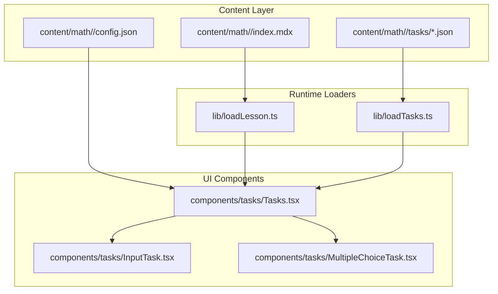
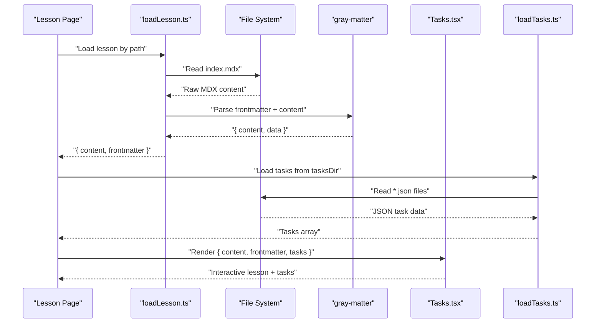
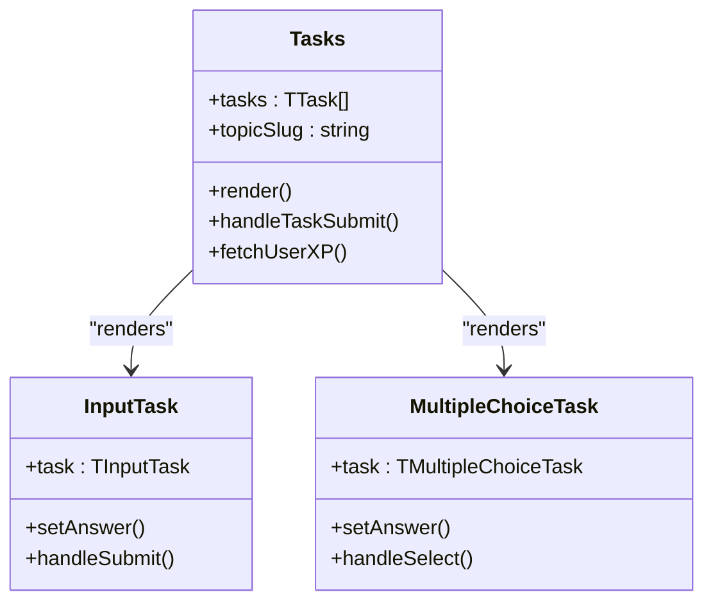
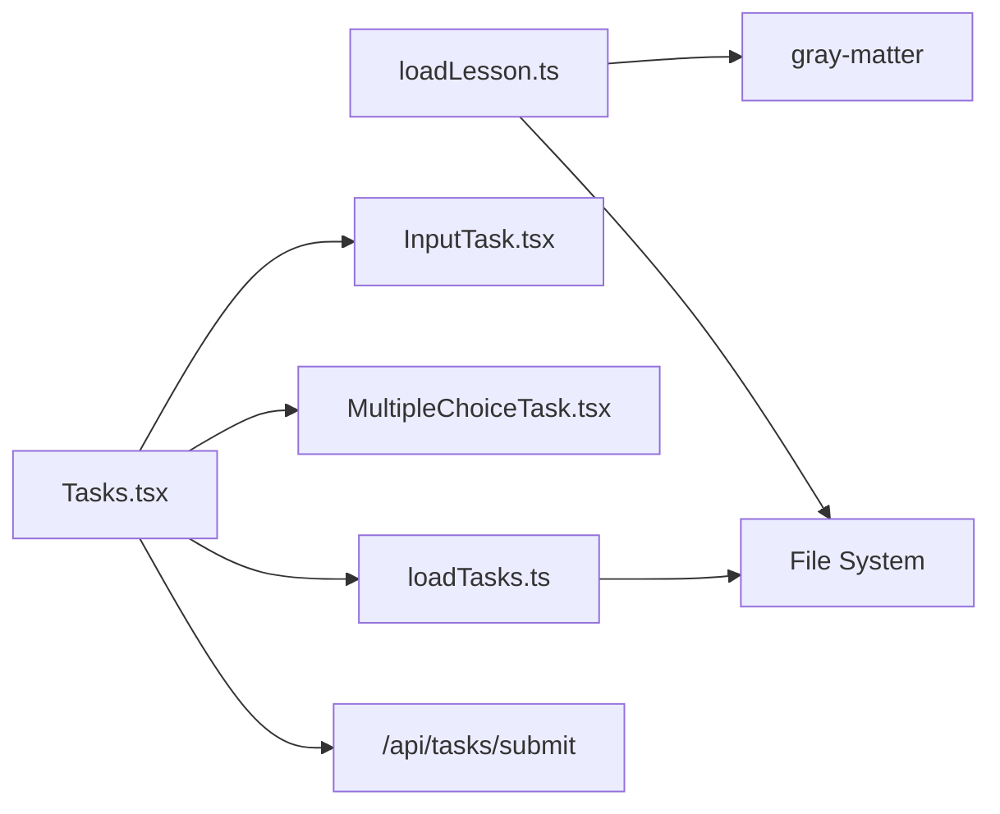

# MDX Lesson Authoring & Rendering

<cite>
**Referenced Files in This Document**
- [loadLesson.ts](file://lib/loadLesson.ts)
- [lesson.ts](file://types/lesson.ts)
- [index.mdx (Fractions)](file://content/math/addition_and_subtraction_of_fractions/index.mdx)
- [index.mdx (Natural Numbers)](file://content/math/natural_numbers/index.mdx)
- [Tasks.tsx](file://components/tasks/Tasks.tsx)
- [InputTask.tsx](file://components/tasks/InputTask.tsx)
- [MultipleChoiceTask.tsx](file://components/tasks/MultipleChoiceTask.tsx)
- [loadTasks.ts](file://lib/loadTasks.ts)
- [task.ts](file://types/task.ts)
- [config.json (Fractions Topic)](file://content/math/addition_and_subtraction_of_fractions/config.json)
- [001-mcq.json](file://content/math/addition_and_subtraction_of_fractions/tasks/001-mcq.json)
- [002-input.json](file://content/math/addition_and_subtraction_of_fractions/tasks/002-input.json)
</cite>

## Table of Contents
1. [Introduction](#introduction)
2. [Project Structure](#project-structure)
3. [Core Components](#core-components)
4. [Architecture Overview](#architecture-overview)
5. [Detailed Component Analysis](#detailed-component-analysis)
6. [Dependency Analysis](#dependency-analysis)
7. [Performance Considerations](#performance-considerations)
8. [Troubleshooting Guide](#troubleshooting-guide)
9. [Conclusion](#conclusion)
10. [Appendices](#appendices)

## Introduction
This document explains how the MDX lesson authoring system works in this Next.js application, focusing on:
- How lessons are authored using MDX with frontmatter metadata
- How mathematical expressions are embedded inline and in display blocks
- How lessons are dynamically loaded at runtime
- How interactive tasks integrate with lessons to form a cohesive learning experience
- Best practices for organizing content, validating inputs, and optimizing performance

## Project Structure
The lesson system is composed of:
- Content authored in MDX under content/<subject>/<topic>/index.mdx
- Frontmatter fields that describe the lesson (title, description, difficulty, math flag)
- Optional task sets under content/<subject>/<topic>/tasks/*.json
- Runtime loaders that parse MDX and tasks
- UI components that render lessons and present tasks

**Diagram sources**
- [loadLesson.ts](file://lib/loadLesson.ts#L1-L17)
- [loadTasks.ts](file://lib/loadTasks.ts#L1-L31)
- [Tasks.tsx](file://components/tasks/Tasks.tsx#L1-L441)
- [InputTask.tsx](file://components/tasks/InputTask.tsx#L1-L97)
- [MultipleChoiceTask.tsx](file://components/tasks/MultipleChoiceTask.tsx#L1-L72)
- [index.mdx (Fractions)](file://content/math/addition_and_subtraction_of_fractions/index.mdx#L1-L14)
- [config.json (Fractions Topic)](file://content/math/addition_and_subtraction_of_fractions/config.json#L1-L10)

**Section sources**
- [loadLesson.ts](file://lib/loadLesson.ts#L1-L17)
- [loadTasks.ts](file://lib/loadTasks.ts#L1-L31)
- [Tasks.tsx](file://components/tasks/Tasks.tsx#L1-L441)
- [InputTask.tsx](file://components/tasks/InputTask.tsx#L1-L97)
- [MultipleChoiceTask.tsx](file://components/tasks/MultipleChoiceTask.tsx#L1-L72)
- [index.mdx (Fractions)](file://content/math/addition_and_subtraction_of_fractions/index.mdx#L1-L14)
- [index.mdx (Natural Numbers)](file://content/math/natural_numbers/index.mdx#L1-L14)
- [config.json (Fractions Topic)](file://content/math/addition_and_subtraction_of_fractions/config.json#L1-L10)

## Core Components
- Lesson loader: Reads an MDX file, parses frontmatter, and returns content and metadata
- Task loader: Scans a tasks directory and aggregates JSON task definitions
- Task UI: Renders either multiple-choice or input tasks, tracks progress, and submits answers
- Types: Strongly typed lesson frontmatter and task structures

Key responsibilities:
- loadLesson.ts: Loads and parses MDX with gray-matter
- loadTasks.ts: Loads and validates task JSON files
- Tasks.tsx: Orchestrates task lifecycle, XP feedback, and navigation
- InputTask.tsx and MultipleChoiceTask.tsx: Present individual task types with immediate feedback
- Types: lesson.ts and task.ts define shapes for frontmatter and tasks

**Section sources**
- [loadLesson.ts](file://lib/loadLesson.ts#L1-L17)
- [lesson.ts](file://types/lesson.ts#L1-L7)
- [loadTasks.ts](file://lib/loadTasks.ts#L1-L31)
- [task.ts](file://types/task.ts#L1-L25)
- [Tasks.tsx](file://components/tasks/Tasks.tsx#L1-L441)
- [InputTask.tsx](file://components/tasks/InputTask.tsx#L1-L97)
- [MultipleChoiceTask.tsx](file://components/tasks/MultipleChoiceTask.tsx#L1-L72)

## Architecture Overview
The lesson rendering pipeline:
1. A lesson page requests the lesson content via loadLesson
2. The MDX content and frontmatter are returned
3. Optional tasks are loaded via loadTasks
4. The Tasks component renders the lesson content and presents tasks
5. Learner answers are validated and submitted to the backend for XP updates

**Diagram sources**
- [loadLesson.ts](file://lib/loadLesson.ts#L1-L17)
- [index.mdx (Fractions)](file://content/math/addition_and_subtraction_of_fractions/index.mdx#L1-L14)
- [loadTasks.ts](file://lib/loadTasks.ts#L1-L31)
- [Tasks.tsx](file://components/tasks/Tasks.tsx#L1-L441)

## Detailed Component Analysis

### Lesson Loading and MDX Parsing
- loadLesson reads index.mdx, parses frontmatter, and returns content and frontmatter
- Frontmatter fields include title, description, difficulty, and a math flag indicating whether math rendering is enabled
- The MDX content contains plain text mixed with LaTeX-style math delimiters:
  - Inline math: $...$
  - Display math: $$ ... $$

Practical example locations:
- Fractions lesson demonstrates inline and block math
- Natural numbers lesson mirrors the same pattern

**Section sources**
- [loadLesson.ts](file://lib/loadLesson.ts#L1-L17)
- [lesson.ts](file://types/lesson.ts#L1-L7)
- [index.mdx (Fractions)](file://content/math/addition_and_subtraction_of_fractions/index.mdx#L1-L14)
- [index.mdx (Natural Numbers)](file://content/math/natural_numbers/index.mdx#L1-L14)

### Mathematical Notation in MDX
- Inline math: Use single dollar signs around expressions
- Display math: Use double dollar signs for block equations
- The presence of the math frontmatter flag signals that math rendering should be enabled during lesson presentation

Example patterns:
- Inline formula in fractions lesson
- Block integral equation in fractions lesson

Note: While the repository does not include a dedicated MDX renderer or KaTeX integration component, the math frontmatter and LaTeX-style delimiters indicate intent to support mathematical rendering in the lesson UI.

**Section sources**
- [index.mdx (Fractions)](file://content/math/addition_and_subtraction_of_fractions/index.mdx#L8-L13)
- [index.mdx (Natural Numbers)](file://content/math/natural_numbers/index.mdx#L8-L13)
- [lesson.ts](file://types/lesson.ts#L5-L5)

### Task System Integration
- Tasks are stored as JSON files under content/<subject>/<topic>/tasks/
- loadTasks scans the directory and merges all JSON entries into a flat array
- Tasks.tsx manages:
  - Current task selection and navigation
  - Answer validation and submission
  - XP and streak feedback
  - Filtering of completed tasks

Task types:
- Multiple choice: Options with optional comments
- Input: Free-form answer with accepted forms

Submission flow:
- Tasks.tsx validates answers locally (comparing against correct/accepted)
- Submits to the backend API for XP computation and persistence
- Updates UI with results and XP metrics

**Section sources**
- [loadTasks.ts](file://lib/loadTasks.ts#L1-L31)
- [Tasks.tsx](file://components/tasks/Tasks.tsx#L64-L122)
- [InputTask.tsx](file://components/tasks/InputTask.tsx#L16-L34)
- [MultipleChoiceTask.tsx](file://components/tasks/MultipleChoiceTask.tsx#L17-L22)
- [task.ts](file://types/task.ts#L1-L25)
- [001-mcq.json](file://content/math/addition_and_subtraction_of_fractions/tasks/001-mcq.json#L1-L250)
- [002-input.json](file://content/math/addition_and_subtraction_of_fractions/tasks/002-input.json#L1-L10)

### Task UI Components
- InputTask.tsx: Presents a free-response input with normalization and accepted answers
- MultipleChoiceTask.tsx: Presents options with immediate correctness feedback and explanatory comments
- Tasks.tsx: Orchestrates task lifecycle, XP display, and navigation controls

**Diagram sources**
- [Tasks.tsx](file://components/tasks/Tasks.tsx#L12-L200)
- [InputTask.tsx](file://components/tasks/InputTask.tsx#L6-L34)
- [MultipleChoiceTask.tsx](file://components/tasks/MultipleChoiceTask.tsx#L6-L22)
- [task.ts](file://types/task.ts#L1-L25)

## Dependency Analysis
- loadLesson depends on gray-matter and the filesystem to extract frontmatter and content
- loadTasks depends on the filesystem to enumerate and parse JSON task files
- Tasks.tsx depends on task components and the XP API for learner state
- Task components depend on task types for shape validation

**Diagram sources**
- [loadLesson.ts](file://lib/loadLesson.ts#L1-L17)
- [loadTasks.ts](file://lib/loadTasks.ts#L1-L31)
- [Tasks.tsx](file://components/tasks/Tasks.tsx#L1-L441)
- [InputTask.tsx](file://components/tasks/InputTask.tsx#L1-L97)
- [MultipleChoiceTask.tsx](file://components/tasks/MultipleChoiceTask.tsx#L1-L72)

**Section sources**
- [loadLesson.ts](file://lib/loadLesson.ts#L1-L17)
- [loadTasks.ts](file://lib/loadTasks.ts#L1-L31)
- [Tasks.tsx](file://components/tasks/Tasks.tsx#L1-L441)
- [InputTask.tsx](file://components/tasks/InputTask.tsx#L1-L97)
- [MultipleChoiceTask.tsx](file://components/tasks/MultipleChoiceTask.tsx#L1-L72)

## Performance Considerations
- Prefer lazy-loading task sets only when needed (e.g., after lesson content is confirmed)
- Cache parsed MDX and task arrays per topic slug to avoid repeated disk reads
- Debounce or batch task submissions to reduce network overhead
- Keep task JSON files small and structured to minimize parsing cost
- Avoid heavy computations in render paths; compute derived state with useMemo/useCallback where appropriate

## Troubleshooting Guide
Common issues and resolutions:
- Task parsing errors: loadTasks logs parsing failures per file; verify JSON validity and schema alignment
- Empty tasks array: Ensure tasks directory exists and contains .json files
- Task submission failures: Tasks.tsx catches and logs submission errors; confirm backend endpoint availability and session presence
- Incorrect answer handling: InputTask normalizes whitespace and case; ensure accepted answers reflect expected formats

**Section sources**
- [loadTasks.ts](file://lib/loadTasks.ts#L24-L26)
- [Tasks.tsx](file://components/tasks/Tasks.tsx#L117-L122)
- [InputTask.tsx](file://components/tasks/InputTask.tsx#L16-L30)

## Conclusion
This system combines MDX-authored lessons with a robust task-driven learning loop. Lessons are loaded dynamically with frontmatter metadata, while tasks are aggregated from JSON files and presented through specialized UI components. The math-enabled frontmatter indicates future support for mathematical rendering, and the task system provides immediate feedback and XP tracking to reinforce learning.

## Appendices

### Practical Examples and Best Practices
- Writing lessons with math:
  - Use inline math with single dollar signs for expressions within text
  - Use display math with double dollar signs for standalone equations
  - Enable the math frontmatter flag to signal math rendering support
  - Example references:
    - [index.mdx (Fractions)](file://content/math/addition_and_subtraction_of_fractions/index.mdx#L8-L13)
    - [index.mdx (Natural Numbers)](file://content/math/natural_numbers/index.mdx#L8-L13)

- Embedding interactive components:
  - Place tasks under content/<subject>/<topic>/tasks/ as JSON files
  - Use multiple-choice tasks for quick recall and spaced practice
  - Use input tasks for free-form responses with accepted variants
  - References:
    - [001-mcq.json](file://content/math/addition_and_subtraction_of_fractions/tasks/001-mcq.json#L1-L250)
    - [002-input.json](file://content/math/addition_and_subtraction_of_fractions/tasks/002-input.json#L1-L10)

- Creating problem-solving scenarios:
  - Structure tasks to scaffold understanding (easy → medium → hard)
  - Provide explanatory comments for incorrect choices
  - Reference:
    - [MultipleChoiceTask.tsx](file://components/tasks/MultipleChoiceTask.tsx#L59-L64)

- Structuring content for optimal learning flow:
  - Use config.json to define topic metadata and ordering
  - Keep lessons concise with clear frontmatter
  - Reference:
    - [config.json (Fractions Topic)](file://content/math/addition_and_subtraction_of_fractions/config.json#L1-L10)

- Content validation:
  - Ensure task JSON conforms to types for multiple-choice and input tasks
  - Verify correctness and accepted answers in input tasks
  - Reference:
    - [task.ts](file://types/task.ts#L1-L25)

- Performance optimization:
  - Cache lesson and task data per topic
  - Minimize re-renders with memoization
  - Defer task loading until lesson is ready
  - Reference:
    - [Tasks.tsx](file://components/tasks/Tasks.tsx#L125-L127)