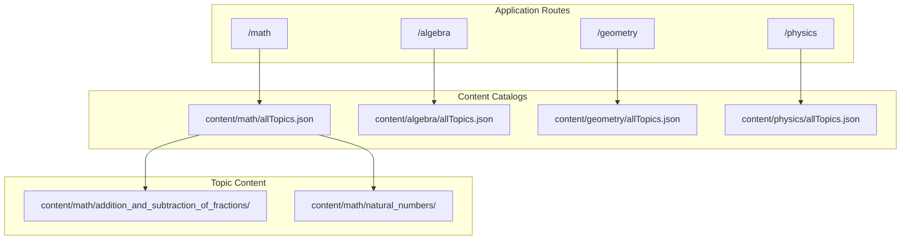
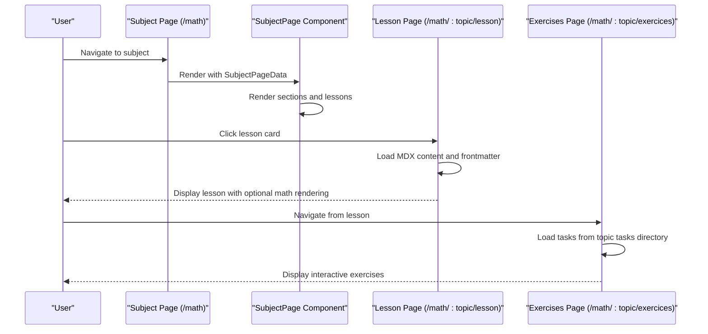
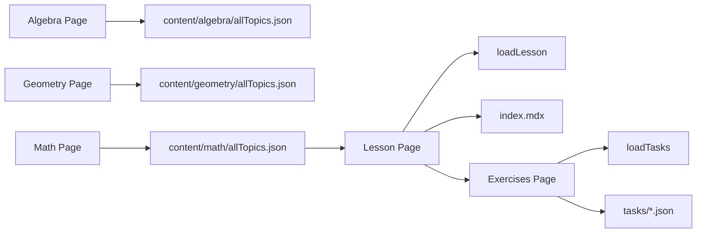

# Subject Organization & Structure

<cite>
**Referenced Files in This Document**
- [content/algebra/allTopics.json](file://content/algebra/allTopics.json)
- [content/geometry/allTopics.json](file://content/geometry/allTopics.json)
- [content/math/allTopics.json](file://content/math/allTopics.json)
- [content/math/addition_and_subtraction_of_fractions/config.json](file://content/math/addition_and_subtraction_of_fractions/config.json)
- [content/math/natural_numbers/index.mdx](file://content/math/natural_numbers/index.mdx)
- [content/math/addition_and_subtraction_of_fractions/index.mdx](file://content/math/addition_and_subtraction_of_fractions/index.mdx)
- [app/(main)/algebra/page.tsx](file://app/(main)/algebra/page.tsx)
- [app/(main)/geometry/page.tsx](file://app/(main)/geometry/page.tsx)
- [app/(main)/physics/page.tsx](file://app/(main)/physics/page.tsx)
- [app/(main)/math/page.tsx](file://app/(main)/math/page.tsx)
- [app/(main)/math/[topic]/lesson/page.tsx](file://app/(main)/math/[topic]/lesson/page.tsx)
- [app/(main)/math/[topic]/exercices/page.tsx](file://app/(main)/math/[topic]/exercices/page.tsx)
- [components/SubjectPage.tsx](file://components/SubjectPage.tsx)
- [lib/loadLesson.ts](file://lib/loadLesson.ts)
- [lib/loadTasks.ts](file://lib/loadTasks.ts)
- [types/topic-config.ts](file://types/topic-config.ts)
- [types/lesson.ts](file://types/lesson.ts)
</cite>

## Table of Contents
1. [Introduction](#introduction)
2. [Project Structure](#project-structure)
3. [Core Components](#core-components)
4. [Architecture Overview](#architecture-overview)
5. [Detailed Component Analysis](#detailed-component-analysis)
6. [Dependency Analysis](#dependency-analysis)
7. [Performance Considerations](#performance-considerations)
8. [Troubleshooting Guide](#troubleshooting-guide)
9. [Conclusion](#conclusion)

## Introduction
This document explains the subject organization system used to structure mathematical content across disciplines. It covers how subjects (Math, Algebra, Geometry, Physics) are organized hierarchically with sections, subsections, and lessons. It documents the JSON configuration structure for subject pages, the lesson content model, and the navigation patterns that ensure consistency across all subjects. Practical examples demonstrate how to add new subjects, create sections with metadata, and organize lessons within topic folders. Guidance is also provided on supporting multi-language content and maintaining consistent navigation.

## Project Structure
The system organizes content by subject under a content directory, with each subject having its own topic catalog and individual topic folders containing lessons and exercises.

- Subject pages are rendered by dedicated Next.js pages under the main application routes.
- Each subject page loads a JSON catalog that defines sections and lessons.
- Lessons are stored as MDX files with frontmatter and optional task sets.
- Exercises are served via a separate route that loads task JSON files.

**Diagram sources**
- [app/(main)/math/page.tsx](file://app/(main)/math/page.tsx#L1-L9)
- [app/(main)/algebra/page.tsx](file://app/(main)/algebra/page.tsx#L1-L9)
- [app/(main)/geometry/page.tsx](file://app/(main)/geometry/page.tsx#L1-L9)
- [app/(main)/physics/page.tsx](file://app/(main)/physics/page.tsx#L1-L9)
- [content/math/allTopics.json](file://content/math/allTopics.json#L1-L26)
- [content/math/addition_and_subtraction_of_fractions/config.json](file://content/math/addition_and_subtraction_of_fractions/config.json#L1-L10)

**Section sources**
- [app/(main)/math/page.tsx](file://app/(main)/math/page.tsx#L1-L9)
- [app/(main)/algebra/page.tsx](file://app/(main)/algebra/page.tsx#L1-L9)
- [app/(main)/geometry/page.tsx](file://app/(main)/geometry/page.tsx#L1-L9)
- [app/(main)/physics/page.tsx](file://app/(main)/physics/page.tsx#L1-L9)
- [content/math/allTopics.json](file://content/math/allTopics.json#L1-L26)

## Core Components
The subject organization system comprises three primary layers:
- Subject page catalogs: JSON files that define subject metadata and hierarchical sections with lessons.
- Lesson content: MDX files with frontmatter for title, description, difficulty, and math rendering flags.
- Rendering pipeline: Next.js pages and a shared SubjectPage component that render the catalogs and navigate to lessons and exercises.

Key data structures:
- SubjectPageData: Defines the subject-level metadata and sections array.
- TopicSection: Defines a section with title, optional description, and a lessons array.
- Lesson: Defines a lesson with title and folder reference.
- TopicConfig: Defines topic-level configuration used for advanced features (XP, scheduling).
- LessonFrontmatter: Defines lesson frontmatter fields for rendering.

**Section sources**
- [components/SubjectPage.tsx](file://components/SubjectPage.tsx#L4-L19)
- [types/topic-config.ts](file://types/topic-config.ts#L1-L17)
- [types/lesson.ts](file://types/lesson.ts#L1-L7)

## Architecture Overview
The system follows a content-first architecture:
- Subject pages import a JSON catalog and pass it to a shared SubjectPage component.
- The SubjectPage component renders sections and lessons consistently across subjects.
- Lesson pages load MDX content dynamically and optionally enable math rendering.
- Exercise pages load task sets from JSON files located alongside lessons.

**Diagram sources**
- [app/(main)/math/page.tsx](file://app/(main)/math/page.tsx#L1-L9)
- [components/SubjectPage.tsx](file://components/SubjectPage.tsx#L26-L33)
- [app/(main)/math/[topic]/lesson/page.tsx](file://app/(main)/math/[topic]/lesson/page.tsx#L29-L90)
- [app/(main)/math/[topic]/exercices/page.tsx](file://app/(main)/math/[topic]/exercices/page.tsx#L8-L31)

## Detailed Component Analysis

### Subject Catalog JSON Schema
Each subject’s catalog is a JSON file with:
- pageTitle: The display title for the subject page.
- pageDescription: A brief description shown on the subject page.
- sections: An array of TopicSection objects, each with:
  - title: Section title.
  - description: Optional section description.
  - lessons: An array of Lesson objects, each with:
    - title: Lesson title.
    - folder: The topic folder name that contains the lesson content.

Example references:
- [content/math/allTopics.json](file://content/math/allTopics.json#L1-L26)
- [content/algebra/allTopics.json](file://content/algebra/allTopics.json#L1-L12)
- [content/geometry/allTopics.json](file://content/geometry/allTopics.json#L1-L12)

Practical example: Adding a new lesson to an existing section
- Add a new topic folder under content/math with an index.mdx and optional tasks.
- Update the subject catalog to include the new lesson with title and folder.
- Ensure the folder name matches the lesson’s topic folder.

**Section sources**
- [content/math/allTopics.json](file://content/math/allTopics.json#L1-L26)
- [content/algebra/allTopics.json](file://content/algebra/allTopics.json#L1-L12)
- [content/geometry/allTopics.json](file://content/geometry/allTopics.json#L1-L12)

### Lesson Content Model
Each lesson is stored as an MDX file with frontmatter:
- title: Lesson title.
- description: Lesson description.
- difficulty: Lesson difficulty level.
- math: Boolean flag enabling math rendering.

Example references:
- [content/math/natural_numbers/index.mdx](file://content/math/natural_numbers/index.mdx#L1-L14)
- [content/math/addition_and_subtraction_of_fractions/index.mdx](file://content/math/addition_and_subtraction_of_fractions/index.mdx#L1-L14)

Loading and rendering:
- Lesson pages use a loader to extract content and frontmatter from MDX.
- Math rendering is enabled conditionally based on frontmatter flags.

Example references:
- [lib/loadLesson.ts](file://lib/loadLesson.ts#L6-L16)
- [app/(main)/math/[topic]/lesson/page.tsx](file://app/(main)/math/[topic]/lesson/page.tsx#L38-L80)

**Section sources**
- [types/lesson.ts](file://types/lesson.ts#L1-L7)
- [lib/loadLesson.ts](file://lib/loadLesson.ts#L6-L16)
- [app/(main)/math/[topic]/lesson/page.tsx](file://app/(main)/math/[topic]/lesson/page.tsx#L38-L80)

### Topic Configuration (Advanced Features)
Topic-level configuration supports advanced features like XP systems, scheduling, and categorization. While not required for basic lesson rendering, it enables richer functionality.

Key fields include:
- slug: Unique identifier for the topic.
- title: Topic title.
- description: Topic description.
- difficulty: Difficulty level.
- category: Category (e.g., math).
- inListPosition: Ordering hint.
- tags: Array of tags for discovery.

Example references:
- [content/math/addition_and_subtraction_of_fractions/config.json](file://content/math/addition_and_subtraction_of_fractions/config.json#L1-L10)
- [types/topic-config.ts](file://types/topic-config.ts#L3-L16)

**Section sources**
- [types/topic-config.ts](file://types/topic-config.ts#L1-L17)
- [content/math/addition_and_subtraction_of_fractions/config.json](file://content/math/addition_and_subtraction_of_fractions/config.json#L1-L10)

### Navigation Patterns Across Subjects
Consistent navigation is achieved by:
- Using a shared SubjectPage component to render sections and lessons.
- Generating lesson links from the base path and lesson folder.
- Providing a standardized exercise route per topic.

References:
- [components/SubjectPage.tsx](file://components/SubjectPage.tsx#L158-L166)
- [app/(main)/math/[topic]/lesson/page.tsx](file://app/(main)/math/[topic]/lesson/page.tsx#L82-L87)
- [app/(main)/math/[topic]/exercices/page.tsx](file://app/(main)/math/[topic]/exercices/page.tsx#L21-L27)

**Section sources**
- [components/SubjectPage.tsx](file://components/SubjectPage.tsx#L158-L166)
- [app/(main)/math/[topic]/lesson/page.tsx](file://app/(main)/math/[topic]/lesson/page.tsx#L82-L87)
- [app/(main)/math/[topic]/exercices/page.tsx](file://app/(main)/math/[topic]/exercices/page.tsx#L21-L27)

### Multi-Language Support
The system supports multi-language content by:
- Storing localized subject catalogs in each subject’s content directory.
- Keeping lesson content localized in the respective topic folders.
- Maintaining consistent folder and file naming conventions across languages.

Examples:
- Subject catalogs use localized strings for titles and descriptions.
- Lesson MDX files include localized frontmatter and content.

References:
- [content/algebra/allTopics.json](file://content/algebra/allTopics.json#L2-L3)
- [content/geometry/allTopics.json](file://content/geometry/allTopics.json#L2-L3)
- [content/math/allTopics.json](file://content/math/allTopics.json#L2-L3)

**Section sources**
- [content/algebra/allTopics.json](file://content/algebra/allTopics.json#L2-L3)
- [content/geometry/allTopics.json](file://content/geometry/allTopics.json#L2-L3)
- [content/math/allTopics.json](file://content/math/allTopics.json#L2-L3)

### Practical Examples

#### Adding a New Subject
Steps:
- Create a new content directory for the subject (e.g., content/newsubject).
- Add a subject catalog file (e.g., content/newsubject/allTopics.json) with pageTitle, pageDescription, and initial sections.
- Create a Next.js page under app/(main)/newsubject/page.tsx that imports the catalog and renders it with SubjectPage.
- Verify navigation appears consistently across the site.

References:
- [app/(main)/math/page.tsx](file://app/(main)/math/page.tsx#L1-L9)
- [components/SubjectPage.tsx](file://components/SubjectPage.tsx#L26-L33)

#### Creating Sections with Proper Metadata
Steps:
- In the subject catalog, add a section object with title and description.
- Optionally add lessons to the section with title and folder fields.
- Ensure folder names match the topic directories.

References:
- [content/math/allTopics.json](file://content/math/allTopics.json#L4-L24)

#### Organizing Lessons Within Topic Folders
Steps:
- Create a new topic folder under content/math/<folder>.
- Add an index.mdx with frontmatter (title, description, difficulty, math).
- Optionally add a tasks directory with JSON-formatted exercises.
- Reference the new topic folder in the subject catalog.

References:
- [content/math/natural_numbers/index.mdx](file://content/math/natural_numbers/index.mdx#L1-L14)
- [content/math/addition_and_subtraction_of_fractions/index.mdx](file://content/math/addition_and_subtraction_of_fractions/index.mdx#L1-L14)
- [app/(main)/math/[topic]/exercices/page.tsx](file://app/(main)/math/[topic]/exercices/page.tsx#L15-L17)

## Dependency Analysis
The system exhibits low coupling and clear separation of concerns:
- Subject pages depend on local JSON catalogs and the SubjectPage component.
- Lesson pages depend on loaders to parse MDX and frontmatter.
- Exercises depend on task loaders to assemble interactive content.

**Diagram sources**
- [app/(main)/algebra/page.tsx](file://app/(main)/algebra/page.tsx#L1-L9)
- [app/(main)/geometry/page.tsx](file://app/(main)/geometry/page.tsx#L1-L9)
- [app/(main)/math/page.tsx](file://app/(main)/math/page.tsx#L1-L9)
- [content/math/allTopics.json](file://content/math/allTopics.json#L1-L26)
- [lib/loadLesson.ts](file://lib/loadLesson.ts#L6-L16)
- [lib/loadTasks.ts](file://lib/loadTasks.ts#L5-L30)
- [app/(main)/math/[topic]/lesson/page.tsx](file://app/(main)/math/[topic]/lesson/page.tsx#L38-L80)
- [app/(main)/math/[topic]/exercices/page.tsx](file://app/(main)/math/[topic]/exercices/page.tsx#L15-L17)

**Section sources**
- [components/SubjectPage.tsx](file://components/SubjectPage.tsx#L26-L33)
- [lib/loadLesson.ts](file://lib/loadLesson.ts#L6-L16)
- [lib/loadTasks.ts](file://lib/loadTasks.ts#L5-L30)

## Performance Considerations
- Static generation: Lesson pages use static generation with explicit parameters derived from the filesystem, ensuring predictable build-time behavior.
- Minimal runtime work: Frontmatter extraction and task loading are straightforward file reads with minimal overhead.
- Conditional math rendering: Math plugins are only applied when frontmatter indicates math content, reducing unnecessary processing.

[No sources needed since this section provides general guidance]

## Troubleshooting Guide
Common issues and resolutions:
- Lesson not appearing in the subject catalog:
  - Verify the lesson’s folder name matches the folder field in the catalog.
  - Confirm the catalog references the lesson within the correct section.
  - References: [content/math/allTopics.json](file://content/math/allTopics.json#L8-L13)

- Lesson content not rendering:
  - Ensure the index.mdx exists in the topic folder and contains valid frontmatter.
  - References: [content/math/natural_numbers/index.mdx](file://content/math/natural_numbers/index.mdx#L1-L6)

- Math formulas not displaying:
  - Set the math frontmatter flag to true in index.mdx.
  - References: [app/(main)/math/[topic]/lesson/page.tsx](file://app/(main)/math/[topic]/lesson/page.tsx#L43-L46)

- Exercises not loading:
  - Confirm the tasks directory exists and contains valid JSON files.
  - References: [app/(main)/math/[topic]/exercices/page.tsx](file://app/(main)/math/[topic]/exercices/page.tsx#L15-L17)

**Section sources**
- [content/math/allTopics.json](file://content/math/allTopics.json#L8-L13)
- [content/math/natural_numbers/index.mdx](file://content/math/natural_numbers/index.mdx#L1-L6)
- [app/(main)/math/[topic]/lesson/page.tsx](file://app/(main)/math/[topic]/lesson/page.tsx#L43-L46)
- [app/(main)/math/[topic]/exercices/page.tsx](file://app/(main)/math/[topic]/exercices/page.tsx#L15-L17)

## Conclusion
The subject organization system provides a scalable, content-driven architecture for structuring educational material across disciplines. By using JSON catalogs for subject metadata, MDX for lesson content, and a shared rendering component, the system ensures consistent navigation and easy maintenance. Multi-language support is achieved through localized catalogs and content, while optional topic configurations enable advanced features. Following the documented patterns allows contributors to add subjects, sections, and lessons efficiently while preserving a uniform user experience.