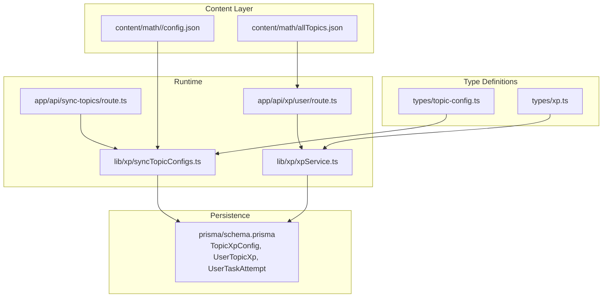
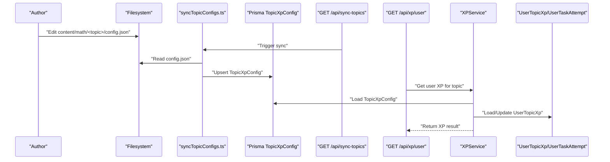
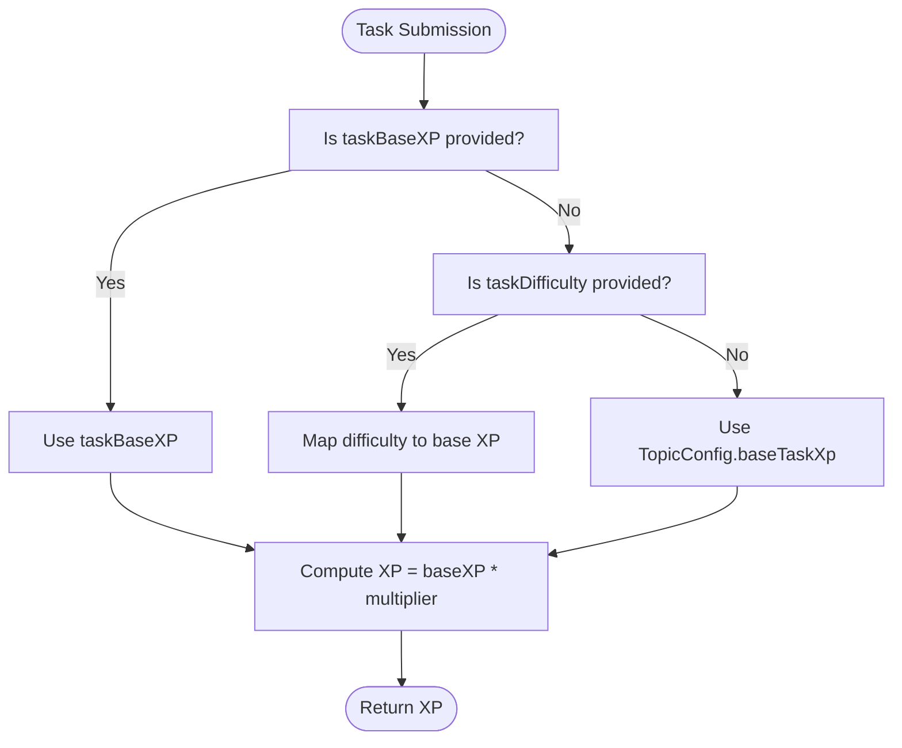
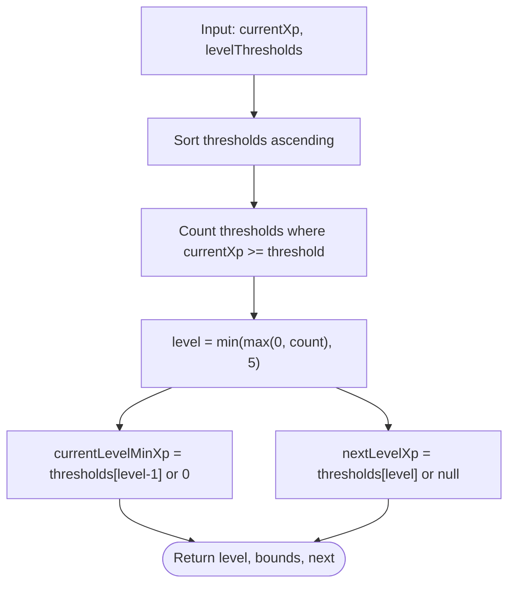
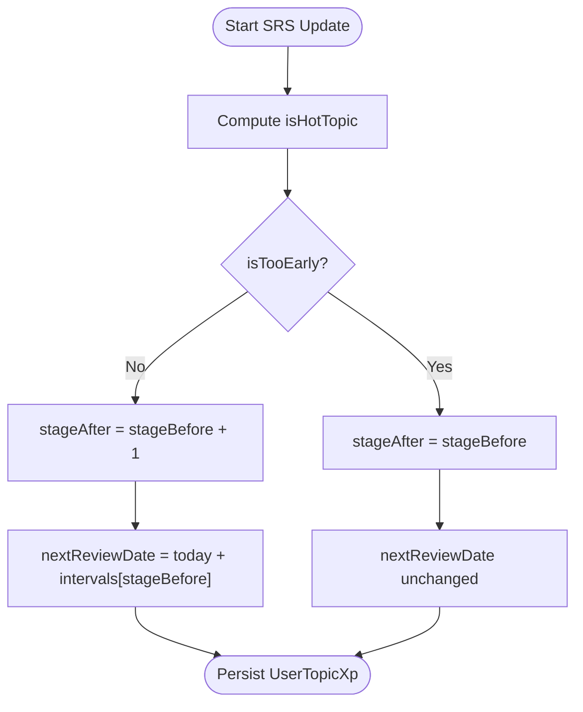
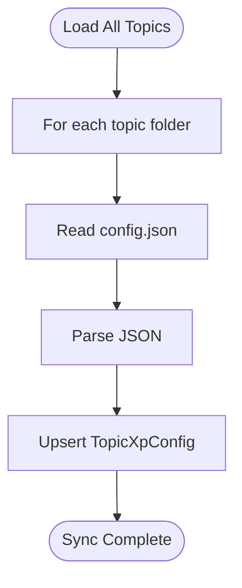
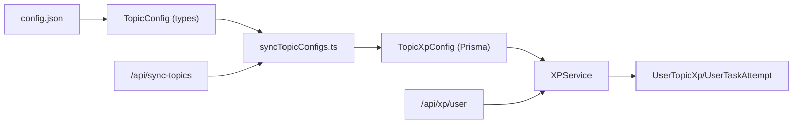

# Topic Configuration & Parameters

<cite>
**Referenced Files in This Document**
- [config.json](file://content/math/addition_and_subtraction_of_fractions/config.json)
- [topic-config.ts](file://types/topic-config.ts)
- [xp.ts](file://types/xp.ts)
- [syncTopicConfigs.ts](file://lib/xp/syncTopicConfigs.ts)
- [xpService.ts](file://lib/xp/xpService.ts)
- [XP_SYSTEM.md](file://XP_SYSTEM.md)
- [XP_SRS_AUDIT.md](file://XP_SRS_AUDIT.md)
- [route.ts](file://app/api/sync-topics/route.ts)
- [route.ts](file://app/api/xp/user/route.ts)
- [schema.prisma](file://prisma/schema.prisma)
- [allTopics.json](file://content/math/allTopics.json)
</cite>

## Table of Contents
1. [Introduction](#introduction)
2. [Project Structure](#project-structure)
3. [Core Components](#core-components)
4. [Architecture Overview](#architecture-overview)
5. [Detailed Component Analysis](#detailed-component-analysis)
6. [Dependency Analysis](#dependency-analysis)
7. [Performance Considerations](#performance-considerations)
8. [Troubleshooting Guide](#troubleshooting-guide)
9. [Conclusion](#conclusion)
10. [Appendices](#appendices)

## Introduction
This document explains the topic configuration system that governs learning parameters and behavioral settings for subjects. It covers:
- The config.json structure and fields
- How difficulty levels and mastery thresholds are defined
- How SRS review intervals are configured and applied
- How topic configurations integrate with the XP system
- Practical examples for configuring new topics, defining mastery milestones, and establishing learning pathways
- Validation, parameter optimization, and propagation via syncTopicConfigs.ts

## Project Structure
The topic configuration system spans content files, type definitions, service logic, API endpoints, and database schema:
- Content-level topic configs live under content/<subject>/<topic>/config.json
- Types define TopicConfig and TopicXPConfig shapes
- XP service reads TopicConfig and applies it during XP calculations and SRS updates
- API endpoints expose synchronization and user XP retrieval
- Prisma schema defines persisted TopicXpConfig and related entities

**Diagram sources**
- [config.json](file://content/math/addition_and_subtraction_of_fractions/config.json#L1-L10)
- [topic-config.ts](file://types/topic-config.ts#L1-L17)
- [xp.ts](file://types/xp.ts#L3-L24)
- [syncTopicConfigs.ts](file://lib/xp/syncTopicConfigs.ts#L1-L174)
- [xpService.ts](file://lib/xp/xpService.ts#L11-L293)
- [route.ts](file://app/api/sync-topics/route.ts#L1-L19)
- [route.ts](file://app/api/xp/user/route.ts#L1-L41)
- [schema.prisma](file://prisma/schema.prisma#L70-L142)

**Section sources**
- [config.json](file://content/math/addition_and_subtraction_of_fractions/config.json#L1-L10)
- [allTopics.json](file://content/math/allTopics.json#L1-L26)
- [topic-config.ts](file://types/topic-config.ts#L1-L17)
- [xp.ts](file://types/xp.ts#L3-L24)
- [syncTopicConfigs.ts](file://lib/xp/syncTopicConfigs.ts#L1-L174)
- [xpService.ts](file://lib/xp/xpService.ts#L11-L293)
- [route.ts](file://app/api/sync-topics/route.ts#L1-L19)
- [route.ts](file://app/api/xp/user/route.ts#L1-L41)
- [schema.prisma](file://prisma/schema.prisma#L70-L142)

## Core Components
- TopicConfig (content-level): Defines topic metadata and learning parameters (difficulty, base XP, daily limits, multipliers, SRS intervals, level thresholds).
- TopicXPConfig (database): Persisted configuration with defaults and computed fields.
- XPService: Applies TopicConfig to XP calculation, SRS scheduling, and level computation.
- syncTopicConfigs: Reads content configs and upserts them into TopicXpConfig.
- API endpoints: Expose synchronization and user XP retrieval.

Key relationships:
- TopicConfig is loaded from content and upserted into TopicXpConfig
- XPService reads TopicXpConfig to compute XP, SRS stages, and levels
- UserTopicXp persists per-user progress and SRS state

**Section sources**
- [topic-config.ts](file://types/topic-config.ts#L3-L16)
- [xp.ts](file://types/xp.ts#L26-L48)
- [xpService.ts](file://lib/xp/xpService.ts#L118-L293)
- [syncTopicConfigs.ts](file://lib/xp/syncTopicConfigs.ts#L54-L130)
- [schema.prisma](file://prisma/schema.prisma#L70-L97)

## Architecture Overview
The configuration pipeline:
1. Author creates or updates config.json in content/<subject>/<topic>
2. Admin triggers synchronization via GET /api/sync-topics
3. syncTopicConfigs reads each config.json and upserts into TopicXpConfig
4. Frontend or API requests user XP via GET /api/xp/user?topicSlug=<slug>
5. XPService loads TopicXpConfig and UserTopicXp, computes XP, SRS, and levels
6. Results are returned to the UI for display

**Diagram sources**
- [syncTopicConfigs.ts](file://lib/xp/syncTopicConfigs.ts#L10-L49)
- [route.ts](file://app/api/sync-topics/route.ts#L8-L11)
- [route.ts](file://app/api/xp/user/route.ts#L25-L32)
- [xpService.ts](file://lib/xp/xpService.ts#L118-L293)
- [schema.prisma](file://prisma/schema.prisma#L70-L142)

## Detailed Component Analysis

### Topic Config Schema and Fields
- slug: Unique topic identifier used to link content and DB
- title, description, category: Metadata for UI and navigation
- difficulty: TopicDifficulty enum; influences base XP scaling
- inListPosition/maxXp/tags/baseTaskXp: Learning parameters
- reviewIntervals: SRS intervals in days
- dailyXpDecay/minXpPercent: Legacy SRS parameters
- minXpPercent: Minimum XP floor factor
- Optional advanced fields (when present): dailyFullTasks, dailyHalfTasks, multiplierFull, multiplierHalf, multiplierLow, multiplierEarly, levelThresholds

Notes:
- The content-level TopicConfig type differs slightly from the DB TopicXPConfig (optional vs required fields and defaults)
- The DB schema defines defaults for many fields, while content config overrides them

**Section sources**
- [config.json](file://content/math/addition_and_subtraction_of_fractions/config.json#L1-L10)
- [topic-config.ts](file://types/topic-config.ts#L3-L16)
- [xp.ts](file://types/xp.ts#L3-L24)
- [schema.prisma](file://prisma/schema.prisma#L70-L97)

### Difficulty Levels and Base XP Scaling
- Difficulty affects base XP when taskBaseXP is not explicitly provided
- The XPService selects base XP based on task difficulty or falls back to TopicConfig.baseTaskXp

**Diagram sources**
- [xpService.ts](file://lib/xp/xpService.ts#L177-L187)
- [xpService.ts](file://lib/xp/xpService.ts#L198-L198)

**Section sources**
- [xpService.ts](file://lib/xp/xpService.ts#L177-L187)
- [xpService.ts](file://lib/xp/xpService.ts#L198-L198)

### Mastery Thresholds and Level Computation
- Levels are computed from cumulative XP using levelThresholds
- The algorithm counts thresholds passed and clamps to 0–5
- XPService exposes currentLevelMinXp and nextLevelXp for UI

**Diagram sources**
- [xpService.ts](file://lib/xp/xpService.ts#L71-L89)

**Section sources**
- [XP_SYSTEM.md](file://XP_SYSTEM.md#L79-L127)
- [xpService.ts](file://lib/xp/xpService.ts#L71-L89)

### SRS Review Intervals and Stages
- SRS stage increments only on scheduled reviews (isHotTopic)
- Early reviews (isTooEarly) keep stage unchanged and do not advance nextReviewDate
- Intervals come from TopicConfig.reviewIntervals (default [1, 3, 7, 14, 30])

**Diagram sources**
- [xpService.ts](file://lib/xp/xpService.ts#L200-L218)

**Section sources**
- [XP_SYSTEM.md](file://XP_SYSTEM.md#L197-L240)
- [xpService.ts](file://lib/xp/xpService.ts#L200-L218)

### Anti-Grind Daily Multipliers
- Daily task index determines multiplier tier
- First dailyFullTasks tasks: multiplierFull
- Next dailyHalfTasks tasks: multiplierHalf
- Beyond: multiplierLow
- Too early reviews ignore daily multiplier and apply multiplierEarly

**Section sources**
- [XP_SYSTEM.md](file://XP_SYSTEM.md#L130-L194)
- [xpService.ts](file://lib/xp/xpService.ts#L91-L106)
- [xpService.ts](file://lib/xp/xpService.ts#L188-L197)

### Prerequisite Relationships and Content Access
- Prerequisites are not defined in TopicConfig or TopicXPConfig
- Content access is controlled by UI logic that checks whether a topic is “hot” (ready for review) or too early
- The completedTaskIds endpoint returns empty when a topic is hot, enabling full review access

**Section sources**
- [xpService.ts](file://lib/xp/xpService.ts#L759-L793)
- [route.ts](file://app/api/xp/user/route.ts#L27-L30)

### Practical Configuration Examples
- New topic setup:
  - Create content/math/<topic>/config.json with slug, title, category, baseTaskXp, reviewIntervals, levelThresholds, and optional dailyFullTasks/dailyHalfTasks/multipliers
  - Run GET /api/sync-topics to persist to TopicXpConfig
- Mastery milestones:
  - Adjust levelThresholds to change XP needed per level
- Review intervals:
  - Modify reviewIntervals to control spacing between reviews
- Learning pathway:
  - Use allTopics.json to group lessons and navigate to topics
  - Use completedTaskIds to gate content access based on SRS readiness

**Section sources**
- [config.json](file://content/math/addition_and_subtraction_of_fractions/config.json#L1-L10)
- [allTopics.json](file://content/math/allTopics.json#L1-L26)
- [route.ts](file://app/api/sync-topics/route.ts#L8-L11)

### Configuration Validation and Propagation
- syncTopicConfigs reads each topic folder and parses config.json
- It upserts into TopicXpConfig, preserving optional fields when present
- API endpoints validate presence of topicSlug and user session before returning XP

**Diagram sources**
- [syncTopicConfigs.ts](file://lib/xp/syncTopicConfigs.ts#L10-L49)

**Section sources**
- [syncTopicConfigs.ts](file://lib/xp/syncTopicConfigs.ts#L10-L49)
- [route.ts](file://app/api/sync-topics/route.ts#L8-L11)
- [route.ts](file://app/api/xp/user/route.ts#L16-L21)

## Dependency Analysis
- Content config.json depends on TopicConfig type
- syncTopicConfigs depends on filesystem and Prisma TopicXpConfig
- XPService depends on TopicXpConfig and UserTopicXp
- API endpoints depend on XPService and authentication

**Diagram sources**
- [config.json](file://content/math/addition_and_subtraction_of_fractions/config.json#L1-L10)
- [topic-config.ts](file://types/topic-config.ts#L3-L16)
- [syncTopicConfigs.ts](file://lib/xp/syncTopicConfigs.ts#L54-L130)
- [schema.prisma](file://prisma/schema.prisma#L70-L142)
- [xpService.ts](file://lib/xp/xpService.ts#L118-L293)
- [route.ts](file://app/api/sync-topics/route.ts#L1-L19)
- [route.ts](file://app/api/xp/user/route.ts#L1-L41)

**Section sources**
- [schema.prisma](file://prisma/schema.prisma#L70-L142)
- [xpService.ts](file://lib/xp/xpService.ts#L118-L293)
- [syncTopicConfigs.ts](file://lib/xp/syncTopicConfigs.ts#L54-L130)

## Performance Considerations
- Synchronization batches topic reads and writes; ensure content directories are organized to minimize IO
- XPService uses Prisma transactions to keep consistency; avoid frequent repeated lookups by caching TopicConfig where appropriate
- UI should avoid requesting XP frequently; batch updates and rely on backend responses

## Troubleshooting Guide
Common issues and resolutions:
- Topic config not found:
  - Verify slug matches between content and DB
  - Confirm GET /api/sync-topics succeeded
- Incorrect XP or SRS behavior:
  - Check reviewIntervals and levelThresholds
  - Validate dailyFullTasks/dailyHalfTasks and multipliers
- UI not reflecting hot/early state:
  - Ensure frontend consumes isHotTopic/isTooEarly from XPService results
- Missing prerequisites:
  - Implement prerequisite checks in UI logic using completedTaskIds and SRS readiness

**Section sources**
- [XP_SRS_AUDIT.md](file://XP_SRS_AUDIT.md#L27-L97)
- [xpService.ts](file://lib/xp/xpService.ts#L172-L175)
- [xpService.ts](file://lib/xp/xpService.ts#L759-L793)

## Conclusion
The topic configuration system cleanly separates content authoring (config.json) from runtime behavior (TopicXPConfig and XPService). By tuning base XP, daily limits, multipliers, SRS intervals, and level thresholds, authors can shape learning pacing and retention. Synchronization propagates changes reliably, and the XPService integrates these parameters into a cohesive XP, SRS, and level progression model.

## Appendices

### Appendix A: Field Reference
- TopicConfig (content)
  - slug, title, description, difficulty, category, inListPosition, maxXp, tags, baseTaskXp, reviewIntervals, dailyXpDecay, minXpPercent
  - Optional: dailyFullTasks, dailyHalfTasks, multiplierFull, multiplierHalf, multiplierLow, multiplierEarly, levelThresholds
- TopicXPConfig (DB)
  - Same fields with defaults; persisted with Prisma

**Section sources**
- [topic-config.ts](file://types/topic-config.ts#L3-L16)
- [xp.ts](file://types/xp.ts#L26-L48)
- [schema.prisma](file://prisma/schema.prisma#L70-L97)

### Appendix B: API Endpoints
- GET /api/sync-topics: Synchronizes all topic configs from content to DB
- GET /api/xp/user?topicSlug=<slug>: Returns user XP, topic config, and completed task IDs

**Section sources**
- [route.ts](file://app/api/sync-topics/route.ts#L8-L11)
- [route.ts](file://app/api/xp/user/route.ts#L25-L32)