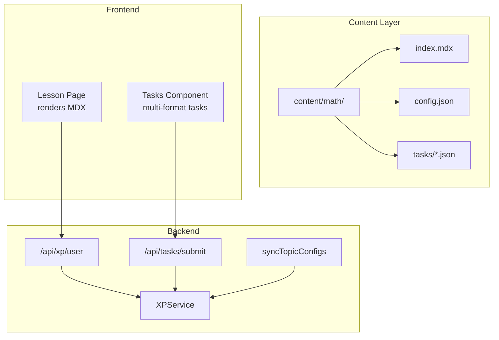
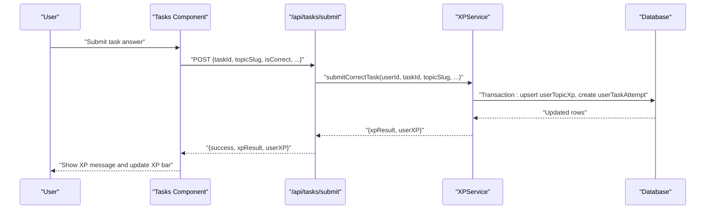
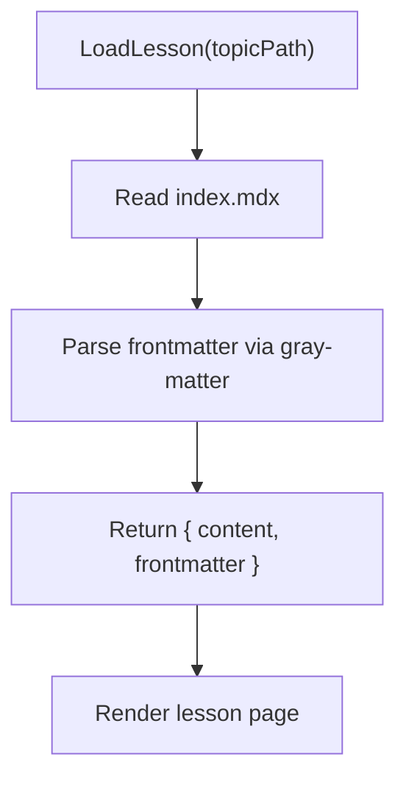
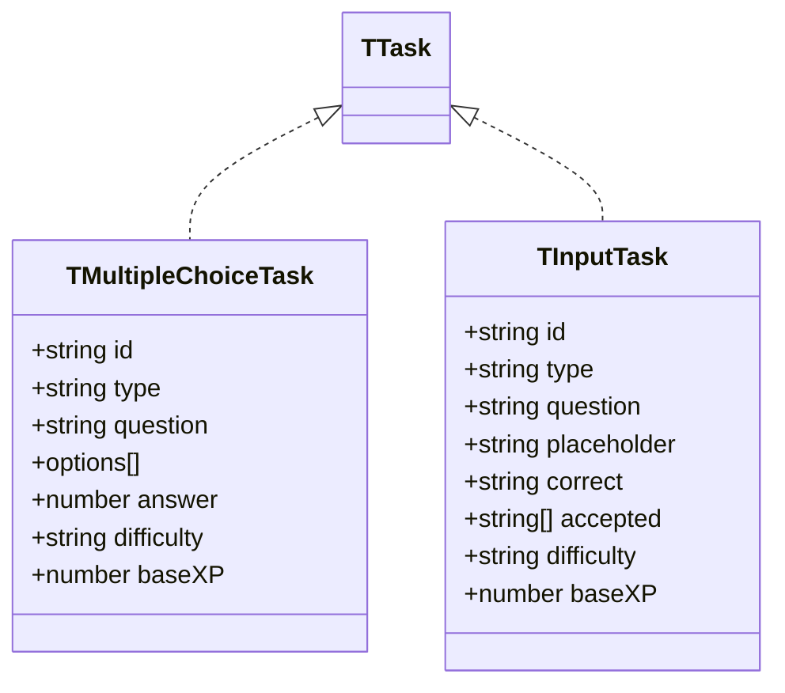
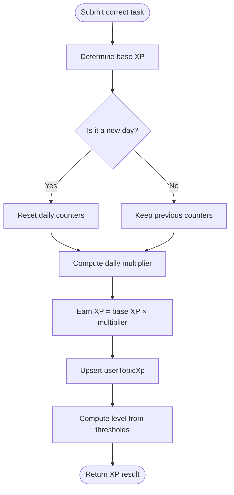
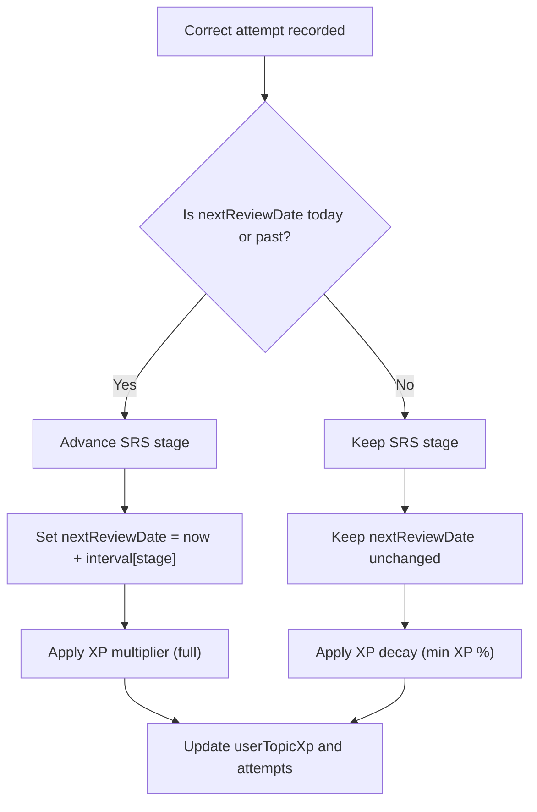
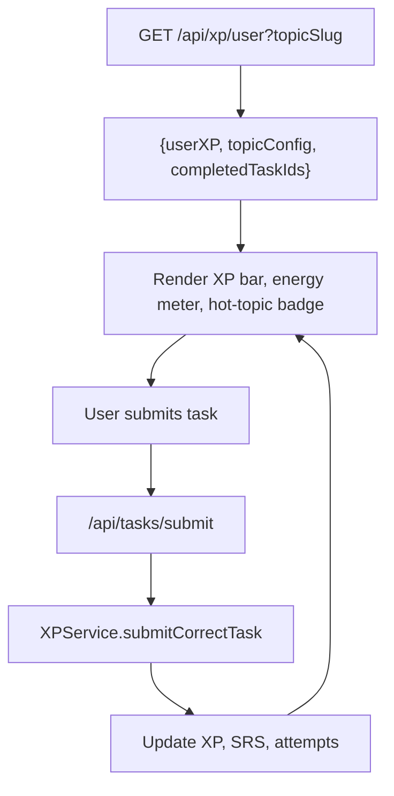
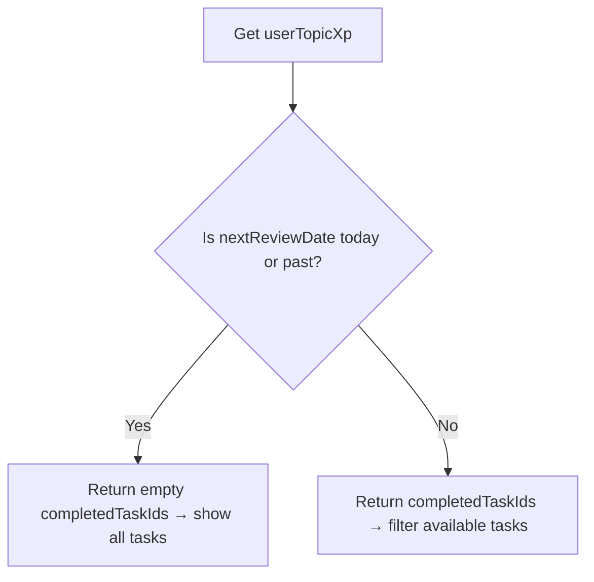
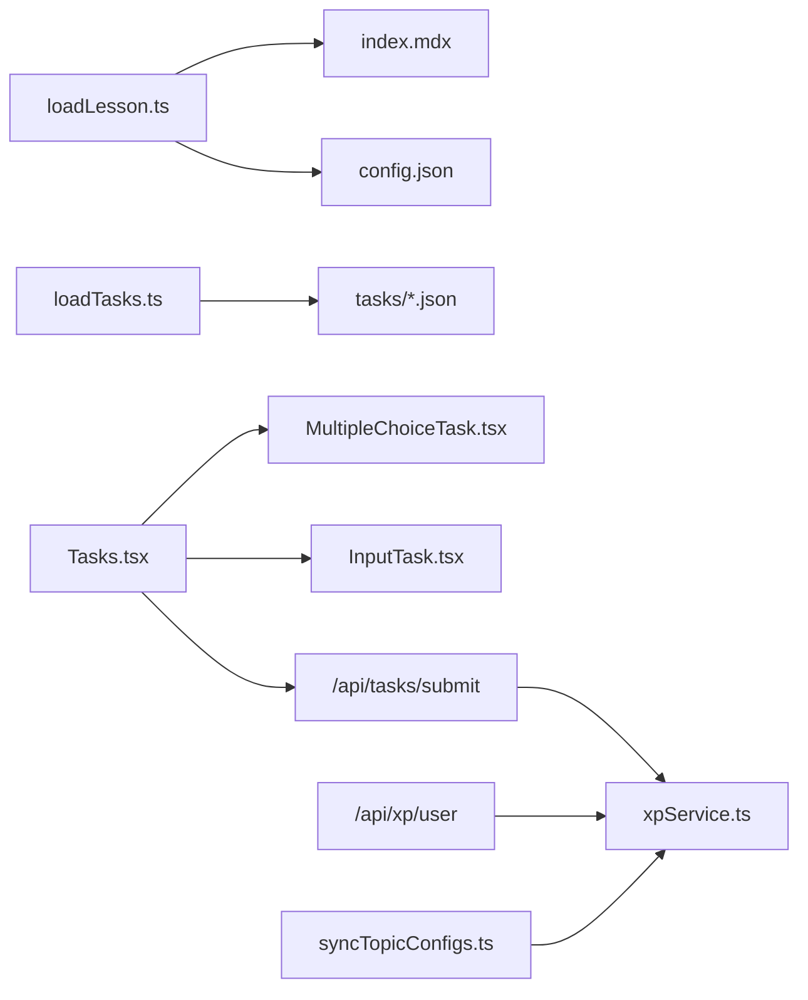

# Core Features

<cite>
**Referenced Files in This Document**
- [index.mdx](file://content/math/addition_and_subtraction_of_fractions/index.mdx)
- [config.json](file://content/math/addition_and_subtraction_of_fractions/config.json)
- [loadLesson.ts](file://lib/loadLesson.ts)
- [loadTasks.ts](file://lib/loadTasks.ts)
- [lesson.ts](file://types/lesson.ts)
- [task.ts](file://types/task.ts)
- [xpService.ts](file://lib/xp/xpService.ts)
- [syncTopicConfigs.ts](file://lib/xp/syncTopicConfigs.ts)
- [route.ts](file://app/api/xp/user/route.ts)
- [route.ts](file://app/api/tasks/submit/route.ts)
- [Tasks.tsx](file://components/tasks/Tasks.tsx)
- [MultipleChoiceTask.tsx](file://components/tasks/MultipleChoiceTask.tsx)
- [InputTask.tsx](file://components/tasks/InputTask.tsx)
- [xp.ts](file://types/xp.ts)
</cite>

## Table of Contents
1. [Introduction](#introduction)
2. [Project Structure](#project-structure)
3. [Core Components](#core-components)
4. [Architecture Overview](#architecture-overview)
5. [Detailed Component Analysis](#detailed-component-analysis)
6. [Dependency Analysis](#dependency-analysis)
7. [Performance Considerations](#performance-considerations)
8. [Troubleshooting Guide](#troubleshooting-guide)
9. [Conclusion](#conclusion)

## Introduction
This document explains the core educational features of the math learning application: the interactive lesson system powered by MDX content, the gamified XP progression system, the spaced repetition system (SRS), the multi-format task system, and progress tracking mechanisms. It also describes how these features work together to create an engaging, mastery-based, and adaptive learning experience, including anti-grind mechanics and adaptive content delivery.

## Project Structure
The application organizes educational content under a content directory with subject/topic folders containing MDX lessons and JSON task definitions. The frontend renders lessons and tasks, while backend APIs coordinate XP and SRS calculations and persist progress.

**Diagram sources**
- [index.mdx](file://content/math/addition_and_subtraction_of_fractions/index.mdx#L1-L14)
- [config.json](file://content/math/addition_and_subtraction_of_fractions/config.json#L1-L10)
- [loadLesson.ts](file://lib/loadLesson.ts#L1-L17)
- [loadTasks.ts](file://lib/loadTasks.ts#L1-L31)
- [Tasks.tsx](file://components/tasks/Tasks.tsx#L1-L441)
- [route.ts](file://app/api/xp/user/route.ts#L1-L41)
- [route.ts](file://app/api/tasks/submit/route.ts#L1-L59)
- [xpService.ts](file://lib/xp/xpService.ts#L1-L795)
- [syncTopicConfigs.ts](file://lib/xp/syncTopicConfigs.ts#L1-L174)

**Section sources**
- [index.mdx](file://content/math/addition_and_subtraction_of_fractions/index.mdx#L1-L14)
- [config.json](file://content/math/addition_and_subtraction_of_fractions/config.json#L1-L10)
- [loadLesson.ts](file://lib/loadLesson.ts#L1-L17)
- [loadTasks.ts](file://lib/loadTasks.ts#L1-L31)
- [Tasks.tsx](file://components/tasks/Tasks.tsx#L1-L441)
- [route.ts](file://app/api/xp/user/route.ts#L1-L41)
- [route.ts](file://app/api/tasks/submit/route.ts#L1-L59)
- [xpService.ts](file://lib/xp/xpService.ts#L1-L795)
- [syncTopicConfigs.ts](file://lib/xp/syncTopicConfigs.ts#L1-L174)

## Core Components
- Interactive lesson system with MDX: Lessons are authored in MDX with frontmatter metadata and rendered on topic pages.
- Multi-format task system: Tasks support multiple-choice and input formats, loaded from JSON files.
- Gamified XP progression: Users earn XP per task with daily multipliers and level thresholds.
- Spaced Repetition System (SRS): Review scheduling uses fixed intervals; early reviews reduce XP but do not advance SRS.
- Progress tracking: Real-time XP bar, energy meter, scheduled review dates, and completion stats.
- Anti-grind mechanics: Early reviews apply XP decay and prevent SRS advancement; daily XP caps preserve long-term motivation.

**Section sources**
- [lesson.ts](file://types/lesson.ts#L1-L7)
- [task.ts](file://types/task.ts#L1-L25)
- [xp.ts](file://types/xp.ts#L1-L131)
- [xpService.ts](file://lib/xp/xpService.ts#L1-L795)
- [Tasks.tsx](file://components/tasks/Tasks.tsx#L1-L441)

## Architecture Overview
The system integrates content ingestion, task rendering, and XP/SRS computation through a transactional service layer. The UI reacts to user actions and updates progress dynamically.

**Diagram sources**
- [Tasks.tsx](file://components/tasks/Tasks.tsx#L64-L122)
- [route.ts](file://app/api/tasks/submit/route.ts#L6-L58)
- [xpService.ts](file://lib/xp/xpService.ts#L118-L293)

## Detailed Component Analysis

### Interactive Lesson System with MDX Content
- Content model: Each topic folder contains an MDX index with frontmatter and math-enabled content, plus a config.json describing metadata and difficulty.
- Loading pipeline: A loader reads the MDX file, parses frontmatter, and returns structured content for rendering.
- Rendering: Topic pages consume the lesson content to display theory and examples.

**Diagram sources**
- [loadLesson.ts](file://lib/loadLesson.ts#L6-L16)
- [lesson.ts](file://types/lesson.ts#L1-L7)
- [index.mdx](file://content/math/addition_and_subtraction_of_fractions/index.mdx#L1-L14)

**Section sources**
- [loadLesson.ts](file://lib/loadLesson.ts#L1-L17)
- [lesson.ts](file://types/lesson.ts#L1-L7)
- [index.mdx](file://content/math/addition_and_subtraction_of_fractions/index.mdx#L1-L14)
- [config.json](file://content/math/addition_and_subtraction_of_fractions/config.json#L1-L10)

### Multi-Format Task System
- Task formats: Multiple-choice and input tasks define questions, options, correct answers, and difficulty/base XP.
- Task loading: JSON files in the topic’s tasks directory are parsed into a unified task array.
- Task rendering: The Tasks component filters out completed tasks and renders the current task type-specific component.

**Diagram sources**
- [task.ts](file://types/task.ts#L1-L25)

**Section sources**
- [task.ts](file://types/task.ts#L1-L25)
- [loadTasks.ts](file://lib/loadTasks.ts#L1-L31)
- [MultipleChoiceTask.tsx](file://components/tasks/MultipleChoiceTask.tsx#L1-L60)
- [InputTask.tsx](file://components/tasks/InputTask.tsx#L1-L97)

### Gamified XP Progression System
- Daily XP cap: First N tasks earn full XP; next N earn half; beyond that, low XP remains. This preserves long-term engagement.
- Leveling: Cumulative XP advances through predefined thresholds; the UI shows current XP and progress to the next level.
- XP calculation: Base XP is derived from task difficulty or override; daily multiplier determines earnings.

**Diagram sources**
- [xpService.ts](file://lib/xp/xpService.ts#L118-L293)
- [xp.ts](file://types/xp.ts#L50-L68)

**Section sources**
- [xpService.ts](file://lib/xp/xpService.ts#L91-L106)
- [xpService.ts](file://lib/xp/xpService.ts#L221-L222)
- [xp.ts](file://types/xp.ts#L50-L68)

### Spaced Repetition System (SRS)
- Scheduling: After each correct attempt, the system computes the next review date based on the current SRS stage and configured intervals.
- Hot vs. early: If the review date has passed, it is a scheduled review and SRS advances; otherwise, the attempt counts but SRS stays the same.
- XP impact: Scheduled reviews give full XP; early reviews apply XP decay and minimum XP percentage.

**Diagram sources**
- [xpService.ts](file://lib/xp/xpService.ts#L200-L217)
- [xpService.ts](file://lib/xp/xpService.ts#L451-L502)
- [xp.ts](file://types/xp.ts#L83-L96)

**Section sources**
- [xpService.ts](file://lib/xp/xpService.ts#L200-L217)
- [xpService.ts](file://lib/xp/xpService.ts#L451-L502)
- [xp.ts](file://types/xp.ts#L83-L96)

### Progress Tracking and Anti-Grind Mechanics
- XP bar and level: Real-time progress shown with current XP and next level threshold.
- Energy meter: Displays remaining tasks eligible for full/half XP within the daily cap.
- Hot topic indicator: Highlights when a topic is due for review.
- Anti-grind: Early reviews reduce XP and do not advance SRS; daily caps prevent burnout.

**Diagram sources**
- [route.ts](file://app/api/xp/user/route.ts#L5-L40)
- [Tasks.tsx](file://components/tasks/Tasks.tsx#L47-L62)
- [Tasks.tsx](file://components/tasks/Tasks.tsx#L204-L370)
- [route.ts](file://app/api/tasks/submit/route.ts#L34-L47)
- [xpService.ts](file://lib/xp/xpService.ts#L118-L293)

**Section sources**
- [route.ts](file://app/api/xp/user/route.ts#L1-L41)
- [Tasks.tsx](file://components/tasks/Tasks.tsx#L1-L441)
- [xpService.ts](file://lib/xp/xpService.ts#L118-L293)

### Adaptive Content Delivery
- Completion filtering: When a topic is not “hot,” only previously completed tasks remain available for targeted review.
- Dynamic availability: As SRS progresses and the next review date arrives, all tasks become available again for reinforcement.

**Diagram sources**
- [xpService.ts](file://lib/xp/xpService.ts#L759-L793)
- [Tasks.tsx](file://components/tasks/Tasks.tsx#L125-L127)

**Section sources**
- [xpService.ts](file://lib/xp/xpService.ts#L759-L793)
- [Tasks.tsx](file://components/tasks/Tasks.tsx#L125-L127)

### Practical Examples
- Example: Completing a medium-difficulty task earns XP scaled by the daily multiplier; if the topic is due for review, SRS advances and the next review date is set accordingly.
- Example: Submitting an early review reduces XP due to decay and keeps SRS stage unchanged, preserving long-term retention.
- Example: After finishing all currently available tasks, the UI congratulates the user and displays the next scheduled review date.

**Section sources**
- [route.ts](file://app/api/tasks/submit/route.ts#L34-L47)
- [xpService.ts](file://lib/xp/xpService.ts#L440-L444)
- [Tasks.tsx](file://components/tasks/Tasks.tsx#L146-L168)

## Dependency Analysis
The system exhibits clear separation of concerns: content ingestion, task orchestration, and XP/SRS computation are encapsulated in dedicated modules and services.

**Diagram sources**
- [loadLesson.ts](file://lib/loadLesson.ts#L1-L17)
- [index.mdx](file://content/math/addition_and_subtraction_of_fractions/index.mdx#L1-L14)
- [config.json](file://content/math/addition_and_subtraction_of_fractions/config.json#L1-L10)
- [loadTasks.ts](file://lib/loadTasks.ts#L1-L31)
- [Tasks.tsx](file://components/tasks/Tasks.tsx#L1-L441)
- [MultipleChoiceTask.tsx](file://components/tasks/MultipleChoiceTask.tsx#L1-L60)
- [InputTask.tsx](file://components/tasks/InputTask.tsx#L1-L97)
- [route.ts](file://app/api/tasks/submit/route.ts#L1-L59)
- [route.ts](file://app/api/xp/user/route.ts#L1-L41)
- [xpService.ts](file://lib/xp/xpService.ts#L1-L795)
- [syncTopicConfigs.ts](file://lib/xp/syncTopicConfigs.ts#L1-L174)

**Section sources**
- [loadLesson.ts](file://lib/loadLesson.ts#L1-L17)
- [loadTasks.ts](file://lib/loadTasks.ts#L1-L31)
- [Tasks.tsx](file://components/tasks/Tasks.tsx#L1-L441)
- [xpService.ts](file://lib/xp/xpService.ts#L1-L795)
- [syncTopicConfigs.ts](file://lib/xp/syncTopicConfigs.ts#L1-L174)

## Performance Considerations
- Transactional XP updates: All XP and SRS changes occur in a single database transaction to maintain consistency.
- Efficient queries: Filtering tasks due for review leverages indexed fields (userId, topicSlug, nextReviewDate, masteryLevel).
- Client-side caching: The UI caches XP and topic config after initial load to minimize repeated network requests.

## Troubleshooting Guide
- Unauthorized access: API endpoints check authentication; ensure a valid session exists.
- Missing required fields: Submission endpoint validates presence of taskId and topicSlug.
- Topic config missing: XPService throws when a topic config is not found; run synchronization to populate DB.
- Task parsing errors: Task loader logs JSON parse errors; verify task files are valid JSON.

**Section sources**
- [route.ts](file://app/api/tasks/submit/route.ts#L10-L25)
- [xpService.ts](file://lib/xp/xpService.ts#L129-L131)
- [loadTasks.ts](file://lib/loadTasks.ts#L24-L26)

## Conclusion
The application combines interactive MDX lessons, multi-format tasks, and a robust XP/SRS engine to deliver a mastery-based, adaptive, and motivating learning experience. Anti-grind mechanics and daily XP caps sustain long-term engagement, while SRS ensures durable retention. Together, these features form a cohesive educational platform that adapts to the learner’s progress and reinforces knowledge efficiently.