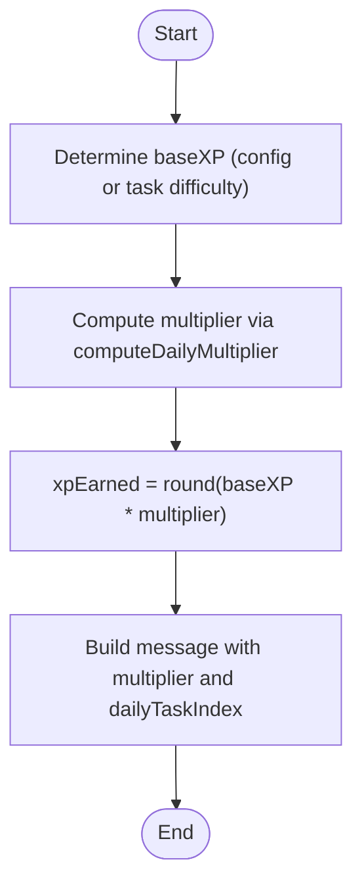

# Anti-Grind Mechanics

<cite>
**Referenced Files in This Document**
- [xpService.ts](file://lib/xp/xpService.ts)
- [route.ts](file://app/api/tasks/submit/route.ts)
- [route.ts](file://app/api/xp/user/route.ts)
- [Tasks.tsx](file://components/tasks/Tasks.tsx)
- [schema.prisma](file://prisma/schema.prisma)
- [XP_SYSTEM.md](file://XP_SYSTEM.md)
- [XP_SRS_AUDIT.md](file://XP_SRS_AUDIT.md)
- [loadTasks.ts](file://lib/loadTasks.ts)
- [001-mcq.json](file://content/math/addition_and_subtraction_of_fractions/tasks/001-mcq.json)
- [002-input.json](file://content/math/addition_and_subtraction_of_fractions/tasks/002-input.json)
</cite>

## Table of Contents
1. [Introduction](#introduction)
2. [Project Structure](#project-structure)
3. [Core Components](#core-components)
4. [Architecture Overview](#architecture-overview)
5. [Detailed Component Analysis](#detailed-component-analysis)
6. [Dependency Analysis](#dependency-analysis)
7. [Performance Considerations](#performance-considerations)
8. [Troubleshooting Guide](#troubleshooting-guide)
9. [Conclusion](#conclusion)
10. [Appendices](#appendices)

## Introduction
This document explains the anti-grind system designed to prevent XP farming and encourage balanced, spaced learning. It covers:
- Daily task counter per topic and reset behavior
- Tiered XP multiplier system (dailyFullTasks vs dailyHalfTasks)
- Progressive fatigue multipliers and task position calculation
- How the system maintains learning quality over quantity
- Examples of daily XP progression, fatigue effects, and optimal learning patterns

## Project Structure
The anti-grind logic lives primarily in the XP service and is integrated with the task submission API and UI components. Supporting files define data models and task content.

**Diagram sources**
- [route.ts](file://app/api/tasks/submit/route.ts#L1-L59)
- [route.ts](file://app/api/xp/user/route.ts#L1-L41)
- [xpService.ts](file://lib/xp/xpService.ts#L117-L293)
- [schema.prisma](file://prisma/schema.prisma#L70-L142)
- [Tasks.tsx](file://components/tasks/Tasks.tsx#L1-L441)

**Section sources**
- [route.ts](file://app/api/tasks/submit/route.ts#L1-L59)
- [route.ts](file://app/api/xp/user/route.ts#L1-L41)
- [xpService.ts](file://lib/xp/xpService.ts#L117-L293)
- [schema.prisma](file://prisma/schema.prisma#L70-L142)
- [Tasks.tsx](file://components/tasks/Tasks.tsx#L1-L441)

## Core Components
- XPService: Implements anti-grind, SRS, XP computation, and persistence in a single transaction.
- API routes: Expose endpoints to submit tasks and fetch user XP/topic state.
- Prisma schema: Defines TopicXpConfig, UserTopicXp, and UserTaskAttempt tables.
- UI Tasks component: Renders XP stats, energy bar, and messages from XPService.

Key responsibilities:
- Track dailyTasksCount per topic and reset only on date change
- Compute daily XP multiplier based on task position within the day
- Apply progressive fatigue multipliers and SRS stage progression
- Maintain balanced learning by discouraging repetitive grinding

**Section sources**
- [xpService.ts](file://lib/xp/xpService.ts#L117-L293)
- [schema.prisma](file://prisma/schema.prisma#L70-L142)
- [route.ts](file://app/api/tasks/submit/route.ts#L1-L59)
- [route.ts](file://app/api/xp/user/route.ts#L1-L41)
- [Tasks.tsx](file://components/tasks/Tasks.tsx#L205-L408)

## Architecture Overview
The anti-grind pipeline runs inside a single Prisma transaction to ensure atomicity of XP updates, SRS progression, and daily counters.

**Diagram sources**
- [route.ts](file://app/api/tasks/submit/route.ts#L34-L47)
- [xpService.ts](file://lib/xp/xpService.ts#L117-L293)

## Detailed Component Analysis

### Daily Task Counter Mechanism
- Per-topic dailyTasksCount increments each time a correct task is submitted within the same calendar day.
- Resets when the stored dailyTasksDate differs from today’s date.
- Important: Reset does not occur simply because a topic becomes “hot” (due for review) — this prevents exploiting resets by timing reviews.

**Diagram sources**
- [xpService.ts](file://lib/xp/xpService.ts#L157-L165)

**Section sources**
- [xpService.ts](file://lib/xp/xpService.ts#L157-L165)
- [XP_SYSTEM.md](file://XP_SYSTEM.md#L138-L153)

### Tiered Multiplier System (dailyFullTasks vs dailyHalfTasks)
- computeDailyMultiplier maps the task’s 1-based position within the day to a tier:
  - First dailyFullTasks tasks: multiplierFull (e.g., 1.0)
  - Next dailyHalfTasks tasks: multiplierHalf (e.g., 0.5)
  - Beyond that: multiplierLow (e.g., 0.1)
- This creates a fatigue staircase that naturally caps daily XP growth.

**Diagram sources**
- [xpService.ts](file://lib/xp/xpService.ts#L91-L106)

**Section sources**
- [xpService.ts](file://lib/xp/xpService.ts#L91-L106)
- [XP_SYSTEM.md](file://XP_SYSTEM.md#L154-L175)

### Task Position Calculations and XP Earned
- Base XP can come from task difficulty or topic config.
- Final XP = round(baseXP × multiplier), ensuring non-negative XP.
- dailyTaskIndex is the 1-based position used for UI messaging.

**Diagram sources**
- [xpService.ts](file://lib/xp/xpService.ts#L177-L198)

**Section sources**
- [xpService.ts](file://lib/xp/xpService.ts#L177-L198)

### Progressive Fatigue and SRS Interaction
- isTooEarly flag determines if the topic is due for review yet.
- If isTooEarly is true:
  - Use multiplierEarly (e.g., 0.1) regardless of daily task index
  - SRS stage does not advance; nextReviewDate remains unchanged
- If isTooEarly is false:
  - Use computeDailyMultiplier fatigue curve
  - Advance SRS stage and set nextReviewDate based on reviewIntervals

**Diagram sources**
- [xpService.ts](file://lib/xp/xpService.ts#L171-L217)

**Section sources**
- [xpService.ts](file://lib/xp/xpService.ts#L171-L217)
- [XP_SYSTEM.md](file://XP_SYSTEM.md#L176-L194)

### Data Model and Persistence
- TopicXpConfig defines per-topic XP policy (dailyFullTasks, dailyHalfTasks, multipliers, SRS intervals, level thresholds).
- UserTopicXp stores per-user-per-topic state (XP, level, daily counters, SRS stage, dates).
- UserTaskAttempt records each correct attempt with XP earned, SRS metadata, and timestamps.

**Diagram sources**
- [schema.prisma](file://prisma/schema.prisma#L70-L142)

**Section sources**
- [schema.prisma](file://prisma/schema.prisma#L70-L142)

### API Integration and UI Feedback
- POST /api/tasks/submit triggers XPService.submitCorrectTask and returns XP result and updated user XP.
- GET /api/xp/user returns user XP, topic config, and completed task IDs for filtering.
- Tasks.tsx displays:
  - Level and XP progress
  - “Hot topic” indicator
  - Daily energy bar (remaining full/half tasks)
  - Timer until next review
  - XP message with multiplier and daily task index

**Diagram sources**
- [route.ts](file://app/api/xp/user/route.ts#L25-L32)
- [route.ts](file://app/api/tasks/submit/route.ts#L34-L47)
- [Tasks.tsx](file://components/tasks/Tasks.tsx#L47-L122)

**Section sources**
- [route.ts](file://app/api/xp/user/route.ts#L1-L41)
- [route.ts](file://app/api/tasks/submit/route.ts#L1-L59)
- [Tasks.tsx](file://components/tasks/Tasks.tsx#L205-L408)

## Dependency Analysis
- API handlers depend on XPService for all XP computations.
- XPService depends on Prisma models for persistence.
- UI depends on API responses for rendering XP stats and feedback.

**Diagram sources**
- [route.ts](file://app/api/tasks/submit/route.ts#L1-L59)
- [route.ts](file://app/api/xp/user/route.ts#L1-L41)
- [xpService.ts](file://lib/xp/xpService.ts#L117-L293)
- [schema.prisma](file://prisma/schema.prisma#L70-L142)
- [Tasks.tsx](file://components/tasks/Tasks.tsx#L1-L441)

**Section sources**
- [route.ts](file://app/api/tasks/submit/route.ts#L1-L59)
- [route.ts](file://app/api/xp/user/route.ts#L1-L41)
- [xpService.ts](file://lib/xp/xpService.ts#L117-L293)
- [schema.prisma](file://prisma/schema.prisma#L70-L142)
- [Tasks.tsx](file://components/tasks/Tasks.tsx#L1-L441)

## Performance Considerations
- Single transaction ensures consistency and reduces contention.
- Indexes on user/topic keys and nextReviewDate optimize queries for due-for-review tasks.
- UI computes daily energy and timers client-side for responsiveness.

[No sources needed since this section provides general guidance]

## Troubleshooting Guide
Common issues and checks:
- XP not increasing as expected:
  - Verify isTooEarly flag and multiplierEarly usage when reviewing early.
  - Confirm dailyTasksCount increments only on correct submissions within the same day.
- SRS stage not advancing:
  - Ensure isTooEarly is false when reviewing on schedule.
  - Check reviewIntervals alignment with intended spacing.
- UI shows “too early” but user expects full XP:
  - Review TopicXpConfig.multiplierEarly and SRS timing.
- Task IDs not filtered:
  - Confirm completedTaskIds returned by /api/xp/user excludes tasks already reviewed.

**Section sources**
- [xpService.ts](file://lib/xp/xpService.ts#L171-L217)
- [XP_SYSTEM.md](file://XP_SYSTEM.md#L176-L194)
- [route.ts](file://app/api/xp/user/route.ts#L25-L32)
- [Tasks.tsx](file://components/tasks/Tasks.tsx#L146-L169)

## Conclusion
The anti-grind system enforces balanced learning by combining:
- A strict daily task counter per topic with date-based reset
- A tiered XP multiplier that simulates fatigue
- SRS-driven scheduling that rewards timely reviews
Together, these mechanics discourage repetitive grinding and promote spaced, effective practice.

[No sources needed since this section summarizes without analyzing specific files]

## Appendices

### Example Scenarios and Patterns

- Daily XP progression example (typical topic config):
  - 10 tasks at 1.0 multiplier: 10 × baseXP
  - 10 tasks at 0.5 multiplier: 10 × baseXP × 0.5
  - 1+ tasks at 0.1 multiplier: remainder at reduced rate
  - Total XP capped by fatigue staircase

- Optimal learning pattern:
  - Complete up to dailyFullTasks at full XP
  - Resume on or after nextReviewDate for maximum XP and SRS advancement
  - Avoid excessive repetition before due date to prevent multiplierEarly penalties

- Fatigue effects:
  - After dailyFullTasks + dailyHalfTasks, XP drops to multiplierLow
  - Early reviews consistently apply multiplierEarly regardless of task index

**Section sources**
- [XP_SYSTEM.md](file://XP_SYSTEM.md#L296-L339)
- [xpService.ts](file://lib/xp/xpService.ts#L91-L106)
- [xpService.ts](file://lib/xp/xpService.ts#L171-L217)

### Task Content Integration
- Tasks are loaded from content directories and include difficulty and optional baseXP.
- These values influence XP calculation when provided.

**Section sources**
- [loadTasks.ts](file://lib/loadTasks.ts#L1-L31)
- [001-mcq.json](file://content/math/addition_and_subtraction_of_fractions/tasks/001-mcq.json#L1-L250)
- [002-input.json](file://content/math/addition_and_subtraction_of_fractions/tasks/002-input.json#L1-L10)