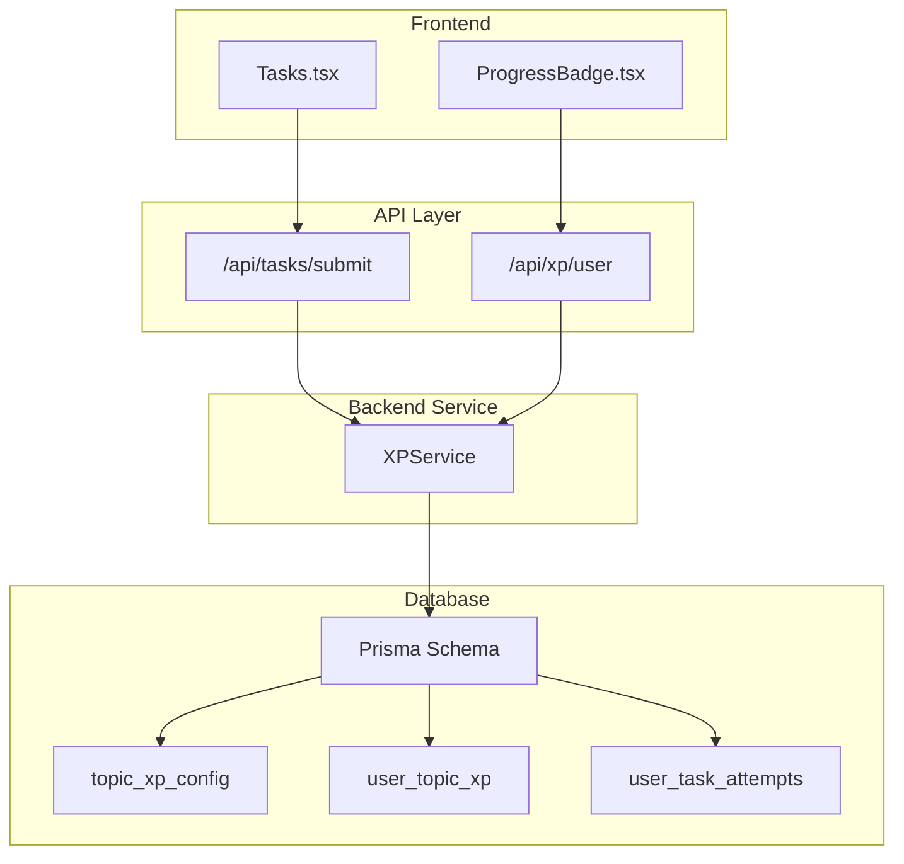
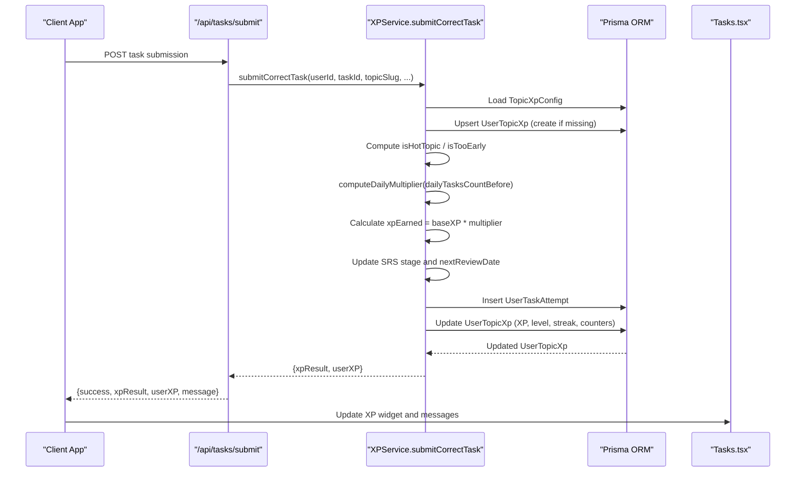
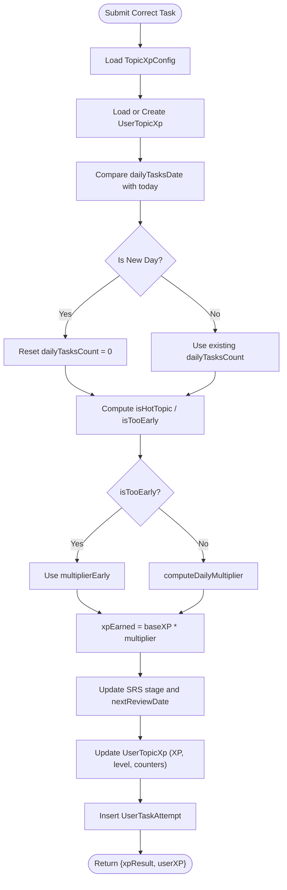
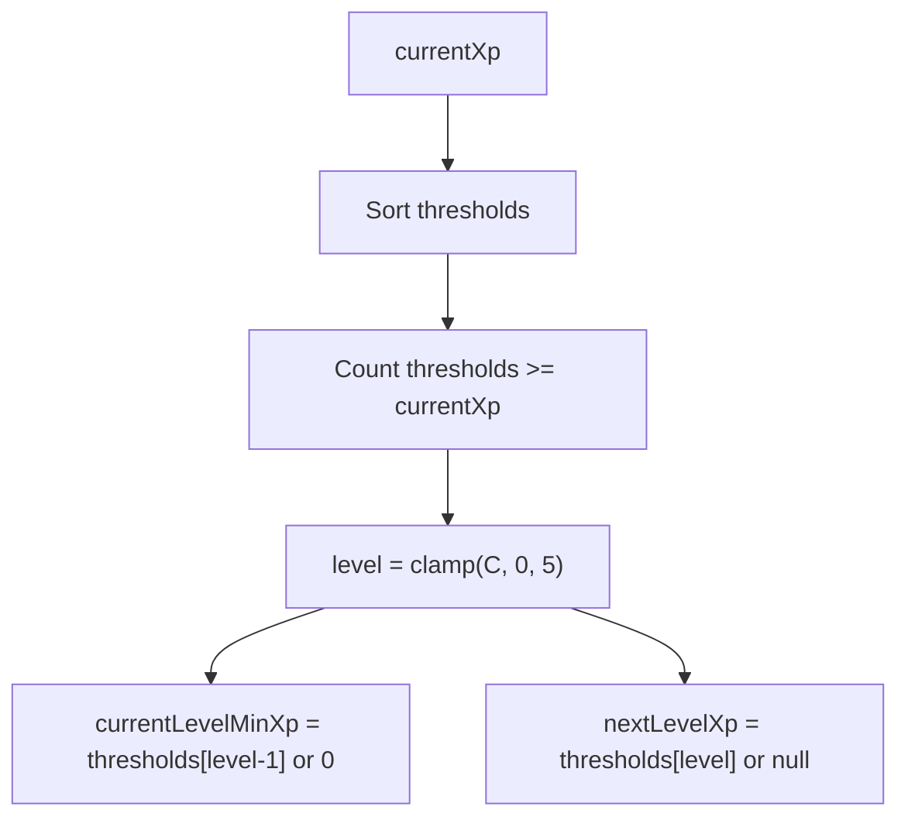
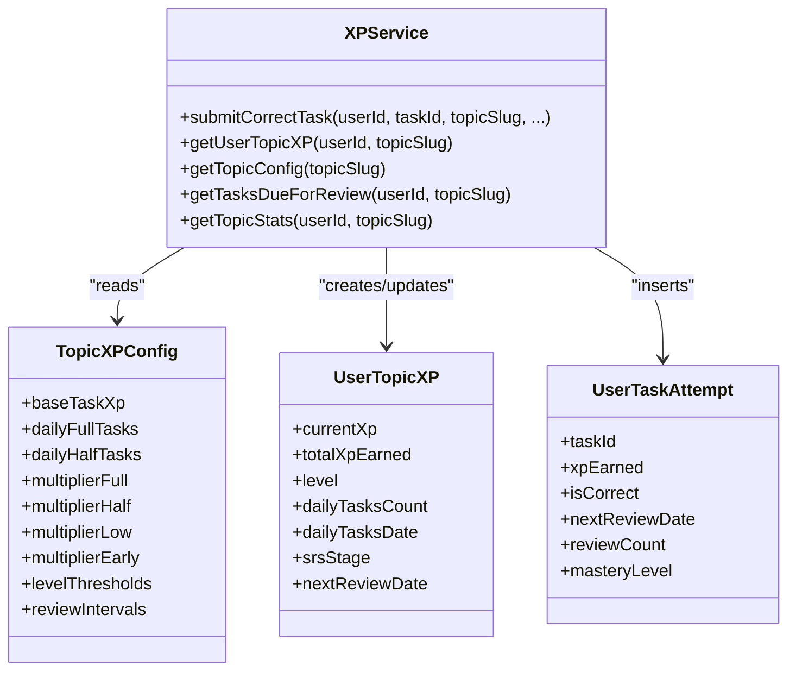

# Gamification System

<cite>
**Referenced Files in This Document**
- [XP_SYSTEM.md](file://XP_SYSTEM.md)
- [XP_SRS_AUDIT.md](file://XP_SRS_AUDIT.md)
- [xpService.ts](file://lib/xp/xpService.ts)
- [types/xp.ts](file://types/xp.ts)
- [route.ts](file://app/api/tasks/submit/route.ts)
- [Tasks.tsx](file://components/tasks/Tasks.tsx)
- [route.ts](file://app/api/xp/user/route.ts)
- [ProgressBadge.tsx](file://components/math/ProgressBadge.tsx)
- [syncTopicConfigs.ts](file://lib/xp/syncTopicConfigs.ts)
- [schema.prisma](file://prisma/schema.prisma)
- [config.json](file://content/math/addition_and_subtraction_of_fractions/config.json)
</cite>

## Table of Contents
1. [Introduction](#introduction)
2. [Project Structure](#project-structure)
3. [Core Components](#core-components)
4. [Architecture Overview](#architecture-overview)
5. [Detailed Component Analysis](#detailed-component-analysis)
6. [Dependency Analysis](#dependency-analysis)
7. [Performance Considerations](#performance-considerations)
8. [Troubleshooting Guide](#troubleshooting-guide)
9. [Conclusion](#conclusion)
10. [Appendices](#appendices)

## Introduction
This document explains the gamification system that motivates and rewards student learning progress. It covers the XP calculation engine with anti-grind mechanics, the level progression system (0–5 levels), streak management, daily limits, and mastery-based progression. It documents the XP anti-grind formula, fatigue calculation, reward structures, and how gamification elements encourage consistent practice. Practical examples illustrate XP calculations, level advancement, streak maintenance, and progress visualization through badges and indicators.

## Project Structure
The gamification system spans backend services, frontend UI, and persistent storage:
- Backend service: XP calculation and SRS logic
- Frontend components: task submission, XP display, and progress visualization
- Database schema: stores topic configs, user progress, and task attempts
- Topic configuration synchronization: loads topic metadata from content files into the database

**Diagram sources**
- [Tasks.tsx](file://components/tasks/Tasks.tsx#L64-L122)
- [route.ts](file://app/api/tasks/submit/route.ts#L6-L58)
- [route.ts](file://app/api/xp/user/route.ts#L5-L40)
- [xpService.ts](file://lib/xp/xpService.ts#L118-L293)
- [schema.prisma](file://prisma/schema.prisma#L70-L142)

**Section sources**
- [XP_SYSTEM.md](file://XP_SYSTEM.md#L1-L356)
- [schema.prisma](file://prisma/schema.prisma#L70-L142)

## Core Components
- XPService: central engine computing XP, applying anti-grind fatigue, managing SRS stages and review dates, and updating user progress and attempts.
- Types: define TopicXPConfig, UserTopicXP, UserTaskAttempt, XPCalculationResult, and related interfaces.
- API endpoints: submit task answers and fetch user XP per topic.
- UI components: render XP progress, energy bar, hot-topic indicators, and streak-related feedback.
- Topic config sync: populate topic_xp_config from content files.

Key responsibilities:
- Anti-grind: daily task count per topic determines XP multiplier tiers.
- Mastery progression: levels 0–5 computed from XP thresholds; SRS stages drive spaced repetition.
- Reward feedback: messages, XP amounts, and UI indicators inform learners.

**Section sources**
- [xpService.ts](file://lib/xp/xpService.ts#L118-L293)
- [types/xp.ts](file://types/xp.ts#L26-L81)
- [route.ts](file://app/api/tasks/submit/route.ts#L6-L58)
- [route.ts](file://app/api/xp/user/route.ts#L5-L40)
- [Tasks.tsx](file://components/tasks/Tasks.tsx#L204-L370)
- [syncTopicConfigs.ts](file://lib/xp/syncTopicConfigs.ts#L10-L49)

## Architecture Overview
The gamification pipeline integrates task completion, XP computation, and SRS scheduling into a single transaction to ensure atomicity and consistency.

**Diagram sources**
- [route.ts](file://app/api/tasks/submit/route.ts#L6-L58)
- [xpService.ts](file://lib/xp/xpService.ts#L118-L293)
- [Tasks.tsx](file://components/tasks/Tasks.tsx#L64-L122)

## Detailed Component Analysis

### XP Calculation Engine and Anti-Grind Mechanics
- Daily task counter per topic: tracks tasks completed today; resets when the day changes or when the topic becomes hot (ready for scheduled review).
- Multiplier tiers:
  - First N tasks: multiplierFull (default 1.0)
  - Next M tasks: multiplierHalf (default 0.5)
  - Remaining: multiplierLow (default 0.1)
- Too early vs. scheduled review:
  - isTooEarly: when nextReviewDate is in the future
  - isHotTopic: when nextReviewDate is null or in the past
  - If too early, XP is reduced (multiplierEarly), but SRS stage does not advance
- Base XP determination:
  - Uses topic baseTaskXp, or overrides from task difficulty or explicit baseXP

**Diagram sources**
- [xpService.ts](file://lib/xp/xpService.ts#L118-L293)
- [XP_SYSTEM.md](file://XP_SYSTEM.md#L130-L194)

**Section sources**
- [xpService.ts](file://lib/xp/xpService.ts#L91-L106)
- [xpService.ts](file://lib/xp/xpService.ts#L118-L293)
- [XP_SYSTEM.md](file://XP_SYSTEM.md#L130-L194)

### Level Progression System (0–5 Levels)
- Thresholds: default [1000, 2500, 4500, 7000, 10000]
- Level computation:
  - Count thresholds met by current XP
  - Clamp to 0–5
  - Derive currentLevelMinXp and nextLevelXp for UI progress bars
- Level updates occur atomically with XP accumulation during task submission.

**Diagram sources**
- [xpService.ts](file://lib/xp/xpService.ts#L71-L89)
- [XP_SYSTEM.md](file://XP_SYSTEM.md#L79-L127)

**Section sources**
- [xpService.ts](file://lib/xp/xpService.ts#L71-L89)
- [XP_SYSTEM.md](file://XP_SYSTEM.md#L79-L127)

### Streak Management and Daily Limits
- Daily task limit per topic:
  - dailyFullTasks (default 10) at full XP
  - dailyHalfTasks (default 10) at 50% XP
  - Beyond that: 10% XP
- Streak concept:
  - SRS stage increases only on scheduled reviews (isHotTopic)
  - Too early submissions do not advance SRS stage
- UI indicators:
  - Energy bar shows remaining tasks in full/50% tiers
  - Hot-topic badge highlights when ready for scheduled review
  - Timer shows days until next full XP availability

**Section sources**
- [XP_SYSTEM.md](file://XP_SYSTEM.md#L130-L194)
- [Tasks.tsx](file://components/tasks/Tasks.tsx#L258-L370)

### Mastery-Based Progression
- Mastery level per task:
  - Incremented on scheduled reviews
  - Caps at 5
- Topic mastery:
  - Level reflects accumulated XP across the topic
- UI displays:
  - Task history and average mastery
  - Due-for-review tasks filtered by nextReviewDate and mastery

**Section sources**
- [xpService.ts](file://lib/xp/xpService.ts#L418-L449)
- [xpService.ts](file://lib/xp/xpService.ts#L608-L672)
- [XP_SYSTEM.md](file://XP_SYSTEM.md#L197-L240)

### Reward Structures and Feedback
- XP earned per task:
  - baseXP × multiplier
  - baseXP derived from topic config or task difficulty
- Messages:
  - Scheduled review, too early, or practice feedback
  - Level-up notifications
- UI feedback:
  - XP bar with current/next thresholds
  - Energy indicator and timer
  - Hot-topic highlight

**Section sources**
- [xpService.ts](file://lib/xp/xpService.ts#L177-L198)
- [Tasks.tsx](file://components/tasks/Tasks.tsx#L224-L239)
- [XP_SYSTEM.md](file://XP_SYSTEM.md#L242-L293)

### Practical Examples

#### Example 1: XP Calculation and Level Advancement
- Scenario: User completes 10 tasks in a topic on the same day.
- Daily multiplier tiers: first 10 at 1.0, next 10 at 0.5, beyond at 0.1.
- Base XP: 100 per task.
- XP earned: 10×100×1.0 = 1000.
- After 1000 XP: level advances to 1 (threshold 1000).
- SRS stage: increments to 1; nextReviewDate set to tomorrow.

**Section sources**
- [XP_SYSTEM.md](file://XP_SYSTEM.md#L296-L338)
- [xpService.ts](file://lib/xp/xpService.ts#L118-L293)

#### Example 2: Anti-Grind Fatigue and Reduced XP
- Scenario: User returns on day 2 when nextReviewDate is still in the future.
- isTooEarly = true; multiplierEarly (0.1) applies.
- XP earned: 100×0.1 = 10.
- SRS stage remains unchanged; nextReviewDate preserved.

**Section sources**
- [XP_SYSTEM.md](file://XP_SYSTEM.md#L176-L194)
- [xpService.ts](file://lib/xp/xpService.ts#L172-L175)

#### Example 3: Streak Maintenance and Scheduled Review
- Scenario: User returns on the scheduled day (isHotTopic).
- XP multiplier: computed from dailyTasksCountWithinToday.
- SRS stage advances; nextReviewDate shifts to next interval (e.g., 3 days later).

**Section sources**
- [XP_SYSTEM.md](file://XP_SYSTEM.md#L226-L238)
- [xpService.ts](file://lib/xp/xpService.ts#L200-L218)

#### Example 4: Progress Visualization Through Badges and Indicators
- UI shows:
  - XP bar with current and next thresholds
  - Energy bar indicating remaining tasks in full/50% tiers
  - Hot-topic badge when ready for scheduled review
  - Timer until next full XP availability

**Section sources**
- [Tasks.tsx](file://components/tasks/Tasks.tsx#L204-L370)
- [ProgressBadge.tsx](file://components/math/ProgressBadge.tsx#L1-L48)

## Dependency Analysis
The gamification system exhibits strong cohesion within XPService and clear separation of concerns across layers.

**Diagram sources**
- [xpService.ts](file://lib/xp/xpService.ts#L11-L11)
- [types/xp.ts](file://types/xp.ts#L26-L81)

**Section sources**
- [types/xp.ts](file://types/xp.ts#L26-L81)
- [schema.prisma](file://prisma/schema.prisma#L70-L142)

## Performance Considerations
- Single transaction ensures atomicity for XP updates, preventing race conditions.
- Indexes on user_id, topicSlug, and nextReviewDate optimize frequent queries.
- UI computations (energy bar, timers) are client-side and lightweight.
- Recommendations:
  - Add logging around XP calculations for debugging.
  - Consider caching frequently accessed topic configs.
  - Monitor query performance for due-for-review tasks.

[No sources needed since this section provides general guidance]

## Troubleshooting Guide
Common issues and resolutions:
- Anti-grind not resetting as expected:
  - Ensure dailyTasksDate comparison uses ISO date strings and that isHotTopic triggers reset.
- Too early XP not reduced:
  - Verify isTooEarly logic and that multiplierEarly is applied.
- SRS stage not advancing:
  - Confirm isHotTopic condition and that stageAfter increments only on scheduled reviews.
- UI not reflecting XP changes:
  - Confirm API responses include userXP and that Tasks.tsx updates state accordingly.

**Section sources**
- [XP_SRS_AUDIT.md](file://XP_SRS_AUDIT.md#L27-L97)
- [xpService.ts](file://lib/xp/xpService.ts#L172-L175)
- [Tasks.tsx](file://components/tasks/Tasks.tsx#L64-L122)

## Conclusion
The gamification system combines anti-grind fatigue, mastery-driven progression, and spaced repetition to encourage consistent, meaningful practice. The XPService centralizes logic for XP calculation, daily limits, SRS scheduling, and level computation, while the UI provides immediate feedback and motivation through XP bars, energy indicators, and hot-topic cues. With minor UI enhancements, the system can further reinforce streak behavior and mastery milestones.

[No sources needed since this section summarizes without analyzing specific files]

## Appendices

### API Definitions
- POST /api/tasks/submit
  - Request: TaskSubmissionRequest (taskId, topicSlug, isCorrect, baseXP, difficulty)
  - Response: TaskSubmissionResponse (success, xpResult, userXP, message)
- GET /api/xp/user?topicSlug=...
  - Response: GETXpUserResponse (userXP, topicConfig, completedTaskIds)

**Section sources**
- [route.ts](file://app/api/tasks/submit/route.ts#L6-L58)
- [route.ts](file://app/api/xp/user/route.ts#L5-L40)
- [types/xp.ts](file://types/xp.ts#L98-L131)

### Database Schema Highlights
- topic_xp_config: stores per-topic XP configuration (multipliers, thresholds, intervals)
- user_topic_xp: tracks user progress per topic (XP, level, daily counters, SRS)
- user_task_attempts: records each correct attempt with XP earned and SRS metadata

**Section sources**
- [schema.prisma](file://prisma/schema.prisma#L70-L142)

### Topic Configuration Sync
- On startup, content/math/*/config.json files are synchronized into topic_xp_config via syncTopicConfigs.
- Optional environment flag disables sync for local development without a database.

**Section sources**
- [README.md](file://README.md#L41-L50)
- [syncTopicConfigs.ts](file://lib/xp/syncTopicConfigs.ts#L10-L49)
- [config.json](file://content/math/addition_and_subtraction_of_fractions/config.json#L1-L10)