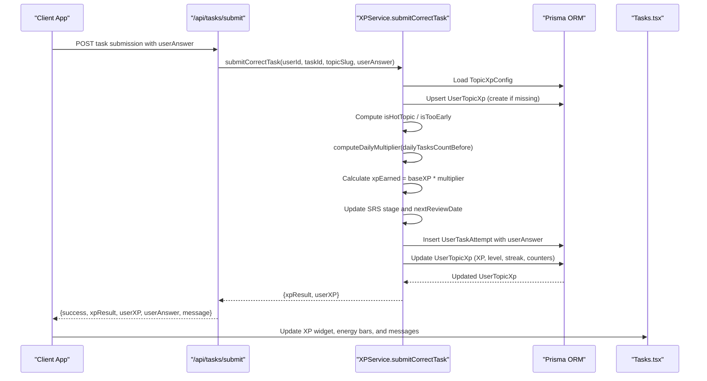
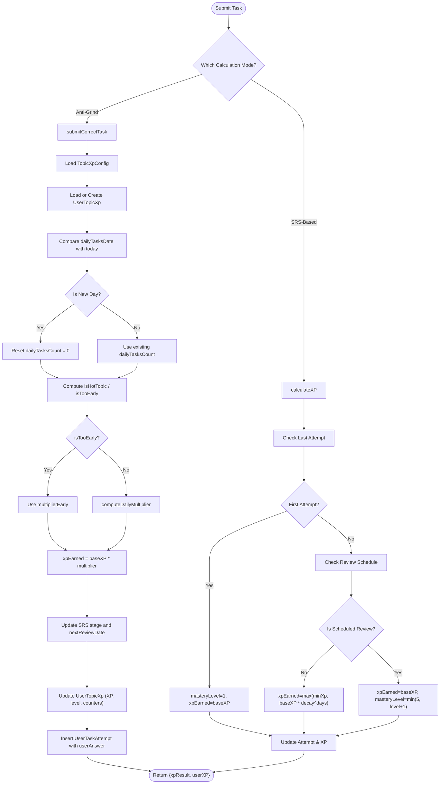
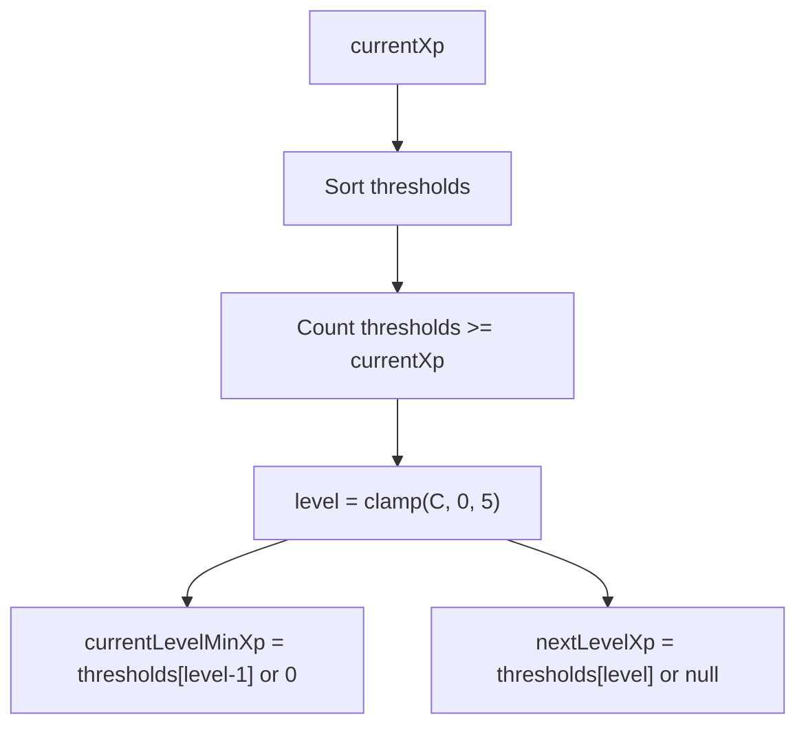
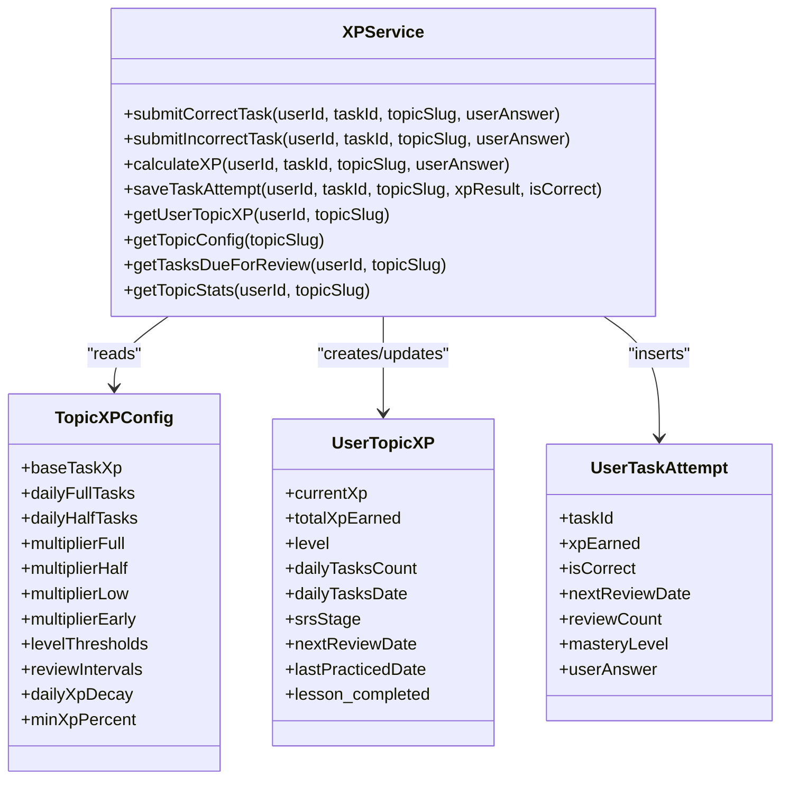

# Gamification System

<cite>
**Referenced Files in This Document**
- [XP_SYSTEM.md](file://XP_SYSTEM.md)
- [XP_SRS_AUDIT.md](file://XP_SRS_AUDIT.md)
- [xpService.ts](file://lib/xp/xpService.ts)
- [types/xp.ts](file://types/xp.ts)
- [route.ts](file://app/api/tasks/submit/route.ts)
- [Tasks.tsx](file://components/tasks/Tasks.tsx)
- [route.ts](file://app/api/xp/user/route.ts)
- [UserXPDisplay.tsx](file://components/tasks/UserXPDisplay.tsx)
- [utils.ts](file://components/tasks/utils.ts)
- [syncTopicConfigs.ts](file://lib/xp/syncTopicConfigs.ts)
- [schema.prisma](file://prisma/schema.prisma)
- [migration.sql](file://prisma/migrations/20260130185755_add_user_answer/migration.sql)
- [migration.sql](file://prisma/migrations/20260131171720_add_lesson_completed_to_user_topic_xp/migration.sql)
- [config.json](file://content/math/addition_and_subtraction_of_fractions/config.json)
</cite>

## Update Summary
**Changes Made**
- Enhanced XP tracking system with comprehensive user answer storage in database
- Improved XP calculation engine with dual calculation modes (anti-grind and SRS-based)
- Comprehensive progress visualization components with energy bars and XP progress indicators
- Added lesson completion tracking and enhanced SRS scheduling system
- Updated API endpoints to support user answer persistence and enhanced XP calculations

## Table of Contents
1. [Introduction](#introduction)
2. [Project Structure](#project-structure)
3. [Core Components](#core-components)
4. [Architecture Overview](#architecture-overview)
5. [Detailed Component Analysis](#detailed-component-analysis)
6. [Enhanced XP Tracking System](#enhanced-xp-tracking-system)
7. [Improved XP Calculation Engine](#improved-xp-calculation-engine)
8. [Comprehensive Progress Visualization](#comprehensive-progress-visualization)
9. [Dependency Analysis](#dependency-analysis)
10. [Performance Considerations](#performance-considerations)
11. [Troubleshooting Guide](#troubleshooting-guide)
12. [Conclusion](#conclusion)
13. [Appendices](#appendices)

## Introduction
This document explains the enhanced gamification system that motivates and rewards student learning progress. The system now features comprehensive user answer storage, dual XP calculation engines (anti-grind fatigue and spaced repetition), and sophisticated progress visualization components. It covers the XP calculation engine with anti-grind mechanics, level progression system (0–5 levels), streak management, daily limits, mastery-based progression, and enhanced reward structures with user answer persistence.

## Project Structure
The gamification system spans backend services, frontend UI, and persistent storage with enhanced tracking capabilities:
- Backend service: Dual XP calculation engines (anti-grind and SRS) with user answer storage
- Frontend components: Enhanced task submission, XP display, and comprehensive progress visualization
- Database schema: Stores topic configs, user progress, task attempts, and user answers
- Topic configuration synchronization: loads topic metadata from content files into the database

```mermaid
graph TB
subgraph "Frontend"
UI_Tasks["Tasks.tsx"]
UI_Progress["UserXPDisplay.tsx"]
UI_Utils["utils.ts"]
end
subgraph "API Layer"
API_Submit["/api/tasks/submit"]
API_XP["/api/xp/user"]
end
subgraph "Backend Service"
SVC["XPService"]
SVC_Calculate["calculateXP"]
SVC_Save["saveTaskAttempt"]
end
subgraph "Database"
PRISMA["Prisma Schema"]
CFG["topic_xp_config"]
XP["user_topic_xp"]
ATTEMPTS["user_task_attempts"]
ANSWERS["user_answer column"]
END
UI_Tasks --> API_Submit
UI_Progress --> API_XP
UI_Utils --> UI_Progress
API_Submit --> SVC
API_XP --> SVC
SVC --> PRISMA
PRISMA --> CFG
PRISMA --> XP
PRISMA --> ATTEMPTS
PRISMA --> ANSWERS
```

**Diagram sources**
- [Tasks.tsx](file://components/tasks/Tasks.tsx#L313-L316)
- [UserXPDisplay.tsx](file://components/tasks/UserXPDisplay.tsx#L77-L123)
- [route.ts](file://app/api/tasks/submit/route.ts#L6-L70)
- [route.ts](file://app/api/xp/user/route.ts#L5-L40)
- [xpService.ts](file://lib/xp/xpService.ts#L118-L303)
- [schema.prisma](file://prisma/schema.prisma#L70-L144)

**Section sources**
- [XP_SYSTEM.md](file://XP_SYSTEM.md#L1-L356)
- [schema.prisma](file://prisma/schema.prisma#L70-L144)

## Core Components
- **XPService**: Central engine computing XP through dual calculation modes, storing user answers, managing SRS stages and review dates, and updating user progress and attempts.
- **Enhanced Types**: Define TopicXPConfig, UserTopicXP, UserTaskAttempt with userAnswer persistence, XPCalculationResult, and related interfaces.
- **API endpoints**: Submit task answers with user answer storage and fetch user XP per topic with enhanced data.
- **UI components**: Render comprehensive XP progress, energy bars, hot-topic indicators, streak-related feedback, and lesson completion tracking.
- **Topic config sync**: Populate topic_xp_config from content files with enhanced configuration options.

Key responsibilities:
- **Dual XP calculation**: Anti-grind fatigue system and SRS-based spaced repetition with user answer persistence
- **Mastery progression**: Levels 0–5 computed from XP thresholds; SRS stages drive spaced repetition
- **Reward feedback**: Messages, XP amounts, UI indicators, and user answer analytics inform learners
- **Progress tracking**: Comprehensive visualization with energy bars, XP progress, and lesson completion status

**Section sources**
- [xpService.ts](file://lib/xp/xpService.ts#L11-L11)
- [types/xp.ts](file://types/xp.ts#L26-L82)
- [route.ts](file://app/api/tasks/submit/route.ts#L6-L70)
- [route.ts](file://app/api/xp/user/route.ts#L5-L40)
- [UserXPDisplay.tsx](file://components/tasks/UserXPDisplay.tsx#L1-L124)
- [syncTopicConfigs.ts](file://lib/xp/syncTopicConfigs.ts#L10-L49)

## Architecture Overview
The enhanced gamification pipeline integrates task completion, dual XP computation modes, user answer storage, and SRS scheduling into a single transaction to ensure atomicity and consistency.

```mermaid
sequenceDiagram
participant Client as "Client App"
participant API as "/api/tasks/submit"
participant Service as "XPService.submitCorrectTask"
participant DB as "Prisma ORM"
participant UI as "Tasks.tsx"
Client->>API : POST task submission with userAnswer
API->>Service : submitCorrectTask(userId, taskId, topicSlug, userAnswer)
Service->>DB : Load TopicXpConfig
Service->>DB : Upsert UserTopicXp (create if missing)
Service->>Service : Compute isHotTopic / isTooEarly
Service->>Service : computeDailyMultiplier(dailyTasksCountBefore)
Service->>Service : Calculate xpEarned = baseXP * multiplier
Service->>Service : Update SRS stage and nextReviewDate
Service->>DB : Insert UserTaskAttempt with userAnswer
Service->>DB : Update UserTopicXp (XP, level, streak, counters)
DB-->>Service : Updated UserTopicXp
Service-->>API : {xpResult, userXP}
API-->>Client : {success, xpResult, userXP, userAnswer, message}
Client->>UI : Update XP widget, energy bars, and messages
```

**Diagram sources**
- [route.ts](file://app/api/tasks/submit/route.ts#L6-L70)
- [xpService.ts](file://lib/xp/xpService.ts#L118-L303)
- [Tasks.tsx](file://components/tasks/Tasks.tsx#L313-L316)

## Detailed Component Analysis

### Enhanced XP Calculation Engine and Anti-Grind Mechanics
The system now features dual XP calculation modes with comprehensive user answer storage:

**Anti-Grind Mode (submitCorrectTask)**:
- Daily task counter per topic: tracks tasks completed today; resets when the day changes or when the topic becomes hot
- Multiplier tiers: First N tasks (1.0), Next M tasks (0.5), Remaining (0.1)
- Too early vs. scheduled review: isTooEarly reduces XP but doesn't advance SRS stage
- Base XP determination: Uses topic baseTaskXp or overrides from task difficulty

**SRS-Based Mode (calculateXP)**:
- Spaced repetition system with configurable intervals [1, 3, 7, 14, 30] days
- XP decay calculation: baseXP * (dailyXpDecay ^ daysSinceLastAttempt)
- Minimum XP cap: baseXP * minXpPercent
- Mastery level progression: increments on scheduled reviews, caps at 5

```mermaid
flowchart TD
Start(["Submit Task"]) --> CheckMode{"Which Calculation Mode?"}
CheckMode --> |Anti-Grind| AntiGrind["submitCorrectTask"]
CheckMode --> |SRS-Based| SRSCalc["calculateXP"]
AntiGrind --> LoadConfig["Load TopicXpConfig"]
LoadConfig --> LoadOrCreateXP["Load or Create UserTopicXp"]
LoadOrCreateXP --> TodayCheck["Compare dailyTasksDate with today"]
TodayCheck --> IsNewDay{"Is New Day?"}
IsNewDay --> |Yes| ResetCounter["Reset dailyTasksCount = 0"]
IsNewDay --> |No| UseExisting["Use existing dailyTasksCount"]
ResetCounter --> ComputeStatus["Compute isHotTopic / isTooEarly"]
UseExisting --> ComputeStatus
ComputeStatus --> EarlyCheck{"isTooEarly?"}
EarlyCheck --> |Yes| UseEarlyMult["Use multiplierEarly"]
EarlyCheck --> |No| DailyMult["computeDailyMultiplier"]
UseEarlyMult --> CalcXP["xpEarned = baseXP * multiplier"]
DailyMult --> CalcXP
CalcXP --> UpdateSRS["Update SRS stage and nextReviewDate"]
UpdateSRS --> UpdateXP["Update UserTopicXp (XP, level, counters)"]
UpdateXP --> SaveAttempt["Insert UserTaskAttempt with userAnswer"]
SaveAttempt --> End(["Return {xpResult, userXP}"])
SRSCalc --> CheckLastAttempt["Check Last Attempt"]
CheckLastAttempt --> IsFirstAttempt{"First Attempt?"}
IsFirstAttempt --> |Yes| FirstAttempt["masteryLevel=1, xpEarned=baseXP"]
IsFirstAttempt --> |No| CheckReview["Check Review Schedule"]
CheckReview --> IsScheduled{"Is Scheduled Review?"}
IsScheduled --> |Yes| FullXP["xpEarned=baseXP, masteryLevel=min(5, level+1)"]
IsScheduled --> |No| DecayCalc["xpEarned=max(minXp, baseXP * decay^days)"]
FirstAttempt --> UpdateAttempt["Update Attempt & XP"]
DecayCalc --> UpdateAttempt
FullXP --> UpdateAttempt
UpdateAttempt --> End
```

**Diagram sources**
- [xpService.ts](file://lib/xp/xpService.ts#L118-L303)
- [xpService.ts](file://lib/xp/xpService.ts#L503-L607)
- [XP_SYSTEM.md](file://XP_SYSTEM.md#L130-L194)

**Section sources**
- [xpService.ts](file://lib/xp/xpService.ts#L91-L106)
- [xpService.ts](file://lib/xp/xpService.ts#L118-L303)
- [xpService.ts](file://lib/xp/xpService.ts#L503-L607)
- [XP_SYSTEM.md](file://XP_SYSTEM.md#L130-L194)

### Level Progression System (0–5 Levels)
- Thresholds: default [1000, 2500, 4500, 7000, 10000]
- Level computation: Count thresholds met by current XP, clamp to 0–5
- Level updates occur atomically with XP accumulation during task submission

```mermaid
flowchart TD
A["currentXp"] --> B["Sort thresholds"]
B --> C["Count thresholds >= currentXp"]
C --> D["level = clamp(C, 0, 5)"]
D --> E["currentLevelMinXp = thresholds[level-1] or 0"]
D --> F["nextLevelXp = thresholds[level] or null"]
```

**Diagram sources**
- [xpService.ts](file://lib/xp/xpService.ts#L71-L89)
- [XP_SYSTEM.md](file://XP_SYSTEM.md#L79-L127)

**Section sources**
- [xpService.ts](file://lib/xp/xpService.ts#L71-L89)
- [XP_SYSTEM.md](file://XP_SYSTEM.md#L79-L127)

### Streak Management and Daily Limits
- Daily task limit per topic: dailyFullTasks (default 10) at full XP, dailyHalfTasks (default 10) at 50% XP
- Beyond that: 10% XP with anti-grind multiplierEarly
- Streak concept: SRS stage increases only on scheduled reviews (isHotTopic)
- Too early submissions do not advance SRS stage but still consume daily task counter
- UI indicators: Energy bar shows remaining tasks in full/50% tiers, hot-topic badge highlights readiness

**Section sources**
- [XP_SYSTEM.md](file://XP_SYSTEM.md#L130-L194)
- [UserXPDisplay.tsx](file://components/tasks/UserXPDisplay.tsx#L16-L42)
- [utils.ts](file://components/tasks/utils.ts#L34-L64)

### Mastery-Based Progression
- Mastery level per task: incremented on scheduled reviews, caps at 5
- Topic mastery: Level reflects accumulated XP across the topic
- UI displays: Task history with user answers, average mastery, due-for-review tasks
- Lesson completion tracking: New lesson_completed field for comprehensive progress monitoring

**Section sources**
- [xpService.ts](file://lib/xp/xpService.ts#L418-L449)
- [xpService.ts](file://lib/xp/xpService.ts#L608-L672)
- [XP_SYSTEM.md](file://XP_SYSTEM.md#L197-L240)
- [migration.sql](file://prisma/migrations/20260131171720_add_lesson_completed_to_user_topic_xp/migration.sql#L1-L2)

### Reward Structures and Feedback
- XP earned per task: baseXP × multiplier (anti-grind mode) or decay-based (SRS mode)
- Messages: Scheduled review, too early, practice feedback, level-up notifications
- UI feedback: XP bar with current/next thresholds, energy indicator, hot-topic highlight, timer
- User answer persistence: All user responses stored for analytics and review

**Section sources**
- [xpService.ts](file://lib/xp/xpService.ts#L177-L198)
- [UserXPDisplay.tsx](file://components/tasks/UserXPDisplay.tsx#L104-L121)
- [XP_SYSTEM.md](file://XP_SYSTEM.md#L242-L293)

### Practical Examples

#### Example 1: Enhanced XP Calculation and Level Advancement
- Scenario: User completes 10 tasks in a topic on the same day using anti-grind mode
- Daily multiplier tiers: first 10 at 1.0, next 10 at 0.5, beyond at 0.1
- Base XP: 100 per task
- XP earned: 10×100×1.0 = 1000
- After 1000 XP: level advances to 1 (threshold 1000)
- SRS stage: increments to 1; nextReviewDate set to tomorrow
- User answer: Stored in user_task_attempts table for analytics

**Section sources**
- [XP_SYSTEM.md](file://XP_SYSTEM.md#L296-L338)
- [xpService.ts](file://lib/xp/xpService.ts#L118-L303)

#### Example 2: SRS-Based XP Decay and Reduced XP
- Scenario: User returns on day 5 when nextReviewDate is in the past (too early)
- XP decay: 100 × (0.5^(5-1)) = 100 × 0.0625 = 6 XP (minimum 10 XP cap)
- SRS stage remains unchanged; nextReviewDate preserved
- User answer: Still stored for historical tracking

**Section sources**
- [XP_SYSTEM.md](file://XP_SYSTEM.md#L176-L194)
- [xpService.ts](file://lib/xp/xpService.ts#L568-L571)

#### Example 3: Streak Maintenance and Scheduled Review
- Scenario: User returns on the scheduled day (isHotTopic)
- XP multiplier: computed from dailyTasksCountWithinToday
- SRS stage advances; nextReviewDate shifts to next interval (e.g., 3 days later)
- User answer: Stored with full XP reward

**Section sources**
- [XP_SYSTEM.md](file://XP_SYSTEM.md#L226-L238)
- [xpService.ts](file://lib/xp/xpService.ts#L200-L218)

#### Example 4: Progress Visualization Through Enhanced Badges and Indicators
- UI shows: XP bar with current and next thresholds, energy bar with remaining tasks
- Hot-topic badge when ready for scheduled review, timer until next full XP availability
- Lesson completion status, user answer analytics, and mastery level indicators

**Section sources**
- [UserXPDisplay.tsx](file://components/tasks/UserXPDisplay.tsx#L77-L123)
- [utils.ts](file://components/tasks/utils.ts#L85-L93)

## Enhanced XP Tracking System
The system now provides comprehensive user answer storage and tracking capabilities:

### User Answer Storage
- **Database Enhancement**: Added user_answer TEXT column to user_task_attempts table
- **API Integration**: Task submission endpoint now accepts userAnswer parameter
- **Persistence Logic**: User answers stored as strings for all task types
- **Analytics Capability**: Enables detailed user response analysis and learning pattern tracking

### Lesson Completion Tracking
- **New Field**: lesson_completed BOOLEAN DEFAULT false in user_topic_xp table
- **Tracking Mechanism**: Monitors completion status for lessons and topics
- **Progress Monitoring**: Provides comprehensive view of learning milestones achieved

### Enhanced Data Persistence
- **Atomic Transactions**: User answers stored within the same transaction as XP updates
- **Consistency Guarantees**: Ensures user answers and XP calculations remain synchronized
- **Historical Tracking**: Complete audit trail of user responses for educational analysis

**Section sources**
- [migration.sql](file://prisma/migrations/20260130185755_add_user_answer/migration.sql#L1-L2)
- [migration.sql](file://prisma/migrations/20260131171720_add_lesson_completed_to_user_topic_xp/migration.sql#L1-L2)
- [route.ts](file://app/api/tasks/submit/route.ts#L18-L50)
- [xpService.ts](file://lib/xp/xpService.ts#L264-L276)

## Improved XP Calculation Engine
The system now features dual calculation modes optimized for different learning scenarios:

### Anti-Grind Fatigue System
- **Daily Task Counter**: Tracks user activity per day with automatic reset
- **Tiered Multipliers**: Progressive XP reduction to prevent grinding behavior
- **Streak Preservation**: Maintains SRS progression even during anti-grind periods
- **User Experience**: Encourages balanced practice without penalizing legitimate effort

### Spaced Repetition System (SRS)
- **Interval Management**: Configurable review intervals [1, 3, 7, 14, 30] days
- **XP Decay Algorithm**: Exponential decay based on days since last attempt
- **Minimum XP Guarantee**: Ensures meaningful XP rewards even with delays
- **Mastery Progression**: Automatic level increases on successful reviews

### Enhanced Calculation Methods
- **submitCorrectTask**: Anti-grind focused calculation with user answer storage
- **calculateXP**: SRS-based calculation for spaced repetition optimization
- **saveTaskAttempt**: Direct attempt saving without XP calculation
- **getXPMessage**: Context-aware messaging based on calculation mode

**Section sources**
- [xpService.ts](file://lib/xp/xpService.ts#L118-L303)
- [xpService.ts](file://lib/xp/xpService.ts#L503-L607)
- [xpService.ts](file://lib/xp/xpService.ts#L658-L730)

## Comprehensive Progress Visualization
The system now provides rich progress tracking through enhanced UI components:

### UserXPDisplay Component
- **XP Progress Bar**: Visual representation of current level and next threshold
- **Energy Bar**: Real-time display of remaining daily XP capacity
- **Hot Topic Indicator**: Visual cue for topics ready for review
- **Review Timer**: Countdown to next full XP availability
- **Lesson Status**: Display of completed lessons and overall progress

### Energy Calculation System
- **Dynamic Stats**: Full/half task remaining counts with real-time updates
- **Color Coding**: Green/yellow/red indicators based on energy levels
- **Status Text**: Descriptive messages about current energy state
- **Hot Topic Detection**: Automatic identification of review-ready topics

### Enhanced UI Utilities
- **Time Formatting**: Human-readable countdowns and date displays
- **Task Navigation**: Intelligent selection of next unattempted tasks
- **Answer Checking**: Robust validation across all task types
- **Responsive Design**: Adaptive layouts for different screen sizes

**Section sources**
- [UserXPDisplay.tsx](file://components/tasks/UserXPDisplay.tsx#L1-L124)
- [utils.ts](file://components/tasks/utils.ts#L34-L93)

## Dependency Analysis
The enhanced gamification system exhibits strong cohesion within XPService and clear separation of concerns across layers with comprehensive user tracking.

```mermaid
classDiagram
class XPService {
+submitCorrectTask(userId, taskId, topicSlug, userAnswer)
+submitIncorrectTask(userId, taskId, topicSlug, userAnswer)
+calculateXP(userId, taskId, topicSlug, userAnswer)
+saveTaskAttempt(userId, taskId, topicSlug, xpResult, isCorrect)
+getUserTopicXP(userId, topicSlug)
+getTopicConfig(topicSlug)
+getTasksDueForReview(userId, topicSlug)
+getTopicStats(userId, topicSlug)
}
class TopicXPConfig {
+baseTaskXp
+dailyFullTasks
+dailyHalfTasks
+multiplierFull
+multiplierHalf
+multiplierLow
+multiplierEarly
+levelThresholds
+reviewIntervals
+dailyXpDecay
+minXpPercent
}
class UserTopicXP {
+currentXp
+totalXpEarned
+level
+dailyTasksCount
+dailyTasksDate
+srsStage
+nextReviewDate
+lastPracticedDate
+lesson_completed
}
class UserTaskAttempt {
+taskId
+xpEarned
+isCorrect
+nextReviewDate
+reviewCount
+masteryLevel
+userAnswer
}
XPService --> TopicXPConfig : "reads"
XPService --> UserTopicXP : "creates/updates"
XPService --> UserTaskAttempt : "inserts"
```

**Diagram sources**
- [xpService.ts](file://lib/xp/xpService.ts#L11-L11)
- [types/xp.ts](file://types/xp.ts#L26-L82)

**Section sources**
- [types/xp.ts](file://types/xp.ts#L26-L82)
- [schema.prisma](file://prisma/schema.prisma#L70-L144)

## Performance Considerations
- **Single Transaction**: Ensures atomicity for XP updates and user answer storage, preventing race conditions
- **Database Indexes**: Optimized indexes on user_id, topicSlug, nextReviewDate, and user_answer for fast queries
- **Client-Side Calculations**: UI computations (energy bar, timers) are lightweight and cached
- **Enhanced Caching**: Topic configs and user progress cached for improved responsiveness
- **Recommendations**:
  - Add logging around XP calculations for debugging user answer storage
  - Consider caching frequently accessed topic configs and user progress
  - Monitor query performance for due-for-review tasks and user answer analytics
  - Implement background processing for user answer analysis

## Troubleshooting Guide
Common issues and resolutions:
- **Anti-grind not resetting as expected**:
  - Ensure dailyTasksDate comparison uses ISO date strings and that isHotTopic triggers reset
  - Verify user_answer storage in database for troubleshooting
- **Too early XP not reduced**:
  - Verify isTooEarly logic and that multiplierEarly is applied
  - Check SRS calculation mode vs anti-grind mode differences
- **SRS stage not advancing**:
  - Confirm isHotTopic condition and that stageAfter increments only on scheduled reviews
  - Verify user_answer persistence for SRS-based calculations
- **UI not reflecting XP changes**:
  - Confirm API responses include userXP and that Tasks.tsx updates state accordingly
  - Check UserXPDisplay component rendering with enhanced props
- **User answer not appearing**:
  - Verify user_answer column exists in user_task_attempts table
  - Check API endpoint passes userAnswer parameter correctly
  - Ensure database migration applied successfully

**Section sources**
- [XP_SRS_AUDIT.md](file://XP_SRS_AUDIT.md#L27-L97)
- [xpService.ts](file://lib/xp/xpService.ts#L172-L175)
- [UserXPDisplay.tsx](file://components/tasks/UserXPDisplay.tsx#L6-L14)

## Conclusion
The enhanced gamification system combines anti-grind fatigue prevention, mastery-driven progression, and sophisticated spaced repetition with comprehensive user answer tracking. The dual XP calculation engines (anti-grind and SRS-based) provide optimal learning experiences for different scenarios, while the enhanced UI components deliver rich progress visualization through XP bars, energy indicators, hot-topic cues, and lesson completion tracking. The addition of user answer storage enables powerful analytics and personalized learning recommendations. With continued enhancements, the system can further reinforce streak behavior, mastery milestones, and comprehensive learning progress monitoring.

## Appendices

### API Definitions
- **POST /api/tasks/submit**
  - Request: TaskSubmissionRequest (taskId, topicSlug, isCorrect, userAnswer, baseXP, difficulty)
  - Response: TaskSubmissionResponse (success, xpResult, userXP, userAnswer, message)
- **GET /api/xp/user?topicSlug=...**
  - Response: GETXpUserResponse (userXP, topicConfig, completedTaskIds with userAnswer)

**Section sources**
- [route.ts](file://app/api/tasks/submit/route.ts#L6-L70)
- [route.ts](file://app/api/xp/user/route.ts#L5-L40)
- [types/xp.ts](file://types/xp.ts#L98-L133)

### Database Schema Highlights
- **topic_xp_config**: Stores per-topic XP configuration (multipliers, thresholds, intervals, decay rates)
- **user_topic_xp**: Tracks user progress per topic (XP, level, daily counters, SRS, lesson completion)
- **user_task_attempts**: Records each attempt with XP earned, SRS metadata, and user answers
- **Enhanced Columns**: user_answer TEXT for response storage, lesson_completed BOOLEAN for progress tracking

**Section sources**
- [schema.prisma](file://prisma/schema.prisma#L70-L144)

### Topic Configuration Sync
- On startup, content/math/*/config.json files are synchronized into topic_xp_config via syncTopicConfigs
- Optional environment flag disables sync for local development without a database
- Enhanced configuration includes daily XP decay, minimum XP percentages, and review intervals

**Section sources**
- [README.md](file://README.md#L41-L50)
- [syncTopicConfigs.ts](file://lib/xp/syncTopicConfigs.ts#L10-L49)
- [config.json](file://content/math/addition_and_subtraction_of_fractions/config.json#L1-L10)

### Enhanced Progress Visualization Components
- **UserXPDisplay**: Comprehensive XP progress with energy bars and hot-topic indicators
- **Energy Calculation**: Dynamic stats with color-coded status and descriptive text
- **Time Formatting**: Human-readable countdowns and date displays
- **Lesson Tracking**: Completion status and overall progress monitoring

**Section sources**
- [UserXPDisplay.tsx](file://components/tasks/UserXPDisplay.tsx#L1-L124)
- [utils.ts](file://components/tasks/utils.ts#L34-L93)