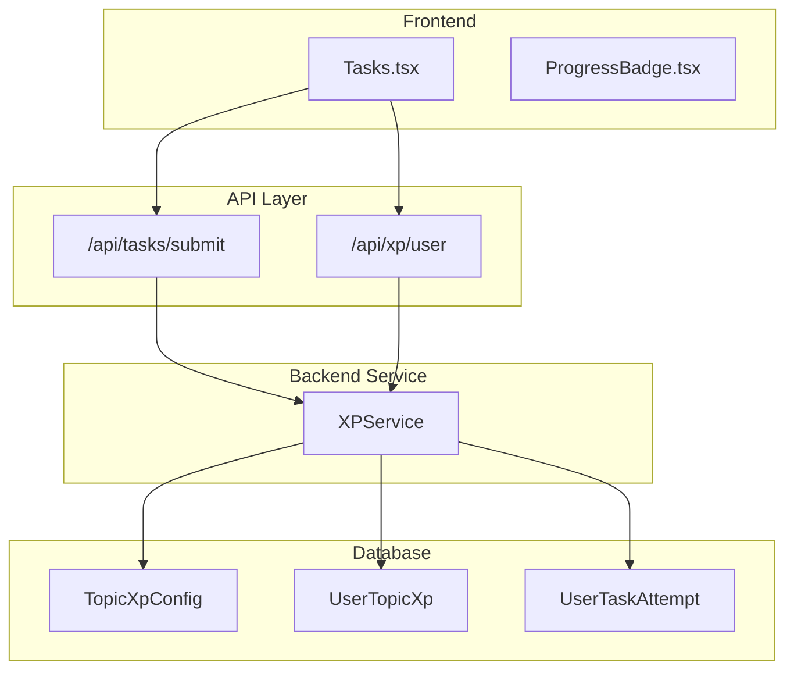
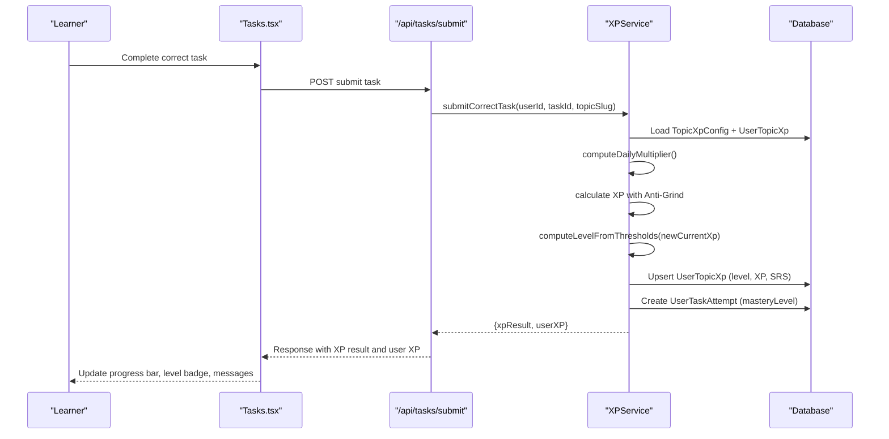
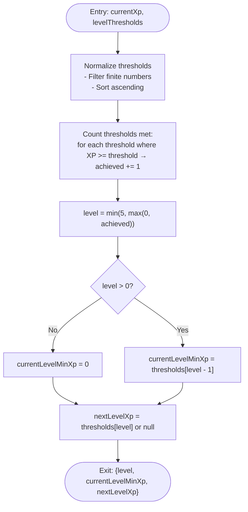
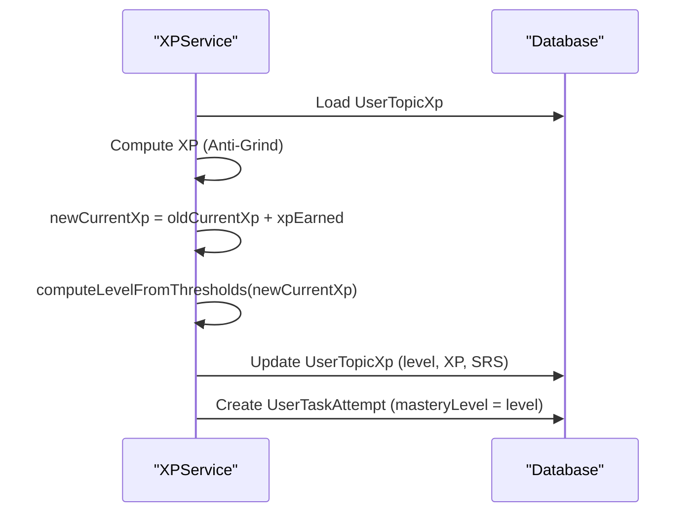
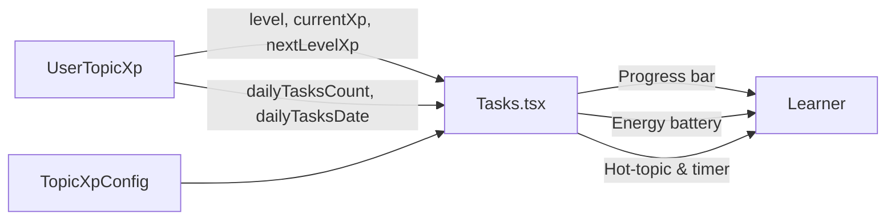
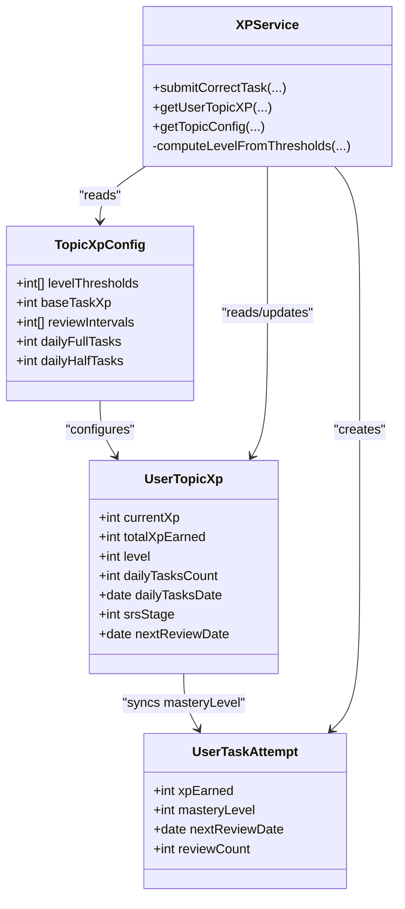

# Level Progression System

<cite>
**Referenced Files in This Document**
- [XP_SYSTEM.md](file://XP_SYSTEM.md)
- [XP_SRS_AUDIT.md](file://XP_SRS_AUDIT.md)
- [xpService.ts](file://lib/xp/xpService.ts)
- [route.ts](file://app/api/tasks/submit/route.ts)
- [route.ts](file://app/api/xp/user/route.ts)
- [Tasks.tsx](file://components/tasks/Tasks.tsx)
- [ProgressBadge.tsx](file://components/math/ProgressBadge.tsx)
- [schema.prisma](file://prisma/schema.prisma)
- [syncTopicConfigs.ts](file://lib/xp/syncTopicConfigs.ts)
- [xp.ts](file://types/xp.ts)
</cite>

## Table of Contents
1. [Introduction](#introduction)
2. [Project Structure](#project-structure)
3. [Core Components](#core-components)
4. [Architecture Overview](#architecture-overview)
5. [Detailed Component Analysis](#detailed-component-analysis)
6. [Dependency Analysis](#dependency-analysis)
7. [Performance Considerations](#performance-considerations)
8. [Troubleshooting Guide](#troubleshooting-guide)
9. [Conclusion](#conclusion)

## Introduction
This document explains the level progression system that provides clear achievement milestones for learners. It focuses on how users start at level 0 and advance through predefined XP thresholds, the computeLevelFromThresholds algorithm, default level thresholds, and how level calculation integrates with the broader XP and SRS gamification framework. It also documents the synchronization between UserTopicXp.level and UserTaskAttempt.masteryLevel, level advancement triggers, and visual progress indicators.

## Project Structure
The level progression system spans backend services, database models, and frontend UI components:

- Backend service: XPService computes XP, manages SRS, and calculates levels via computeLevelFromThresholds
- Database models: TopicXpConfig, UserTopicXp, and UserTaskAttempt persist configuration, user progress, and attempt history
- Frontend: Tasks component renders XP progress, energy battery, hot-topic indicators, and mastery level badges
- APIs: Submit task endpoint and XP retrieval endpoint integrate frontend with backend services

**Diagram sources**
- [Tasks.tsx](file://components/tasks/Tasks.tsx#L1-L441)
- [route.ts](file://app/api/tasks/submit/route.ts#L1-L59)
- [route.ts](file://app/api/xp/user/route.ts#L1-L41)
- [xpService.ts](file://lib/xp/xpService.ts#L1-L795)
- [schema.prisma](file://prisma/schema.prisma#L70-L143)

**Section sources**
- [XP_SYSTEM.md](file://XP_SYSTEM.md#L1-L356)
- [schema.prisma](file://prisma/schema.prisma#L70-L143)

## Core Components
- computeLevelFromThresholds: Computes user level from current XP against configured thresholds, with bounds clamping to 0–5 and auxiliary boundaries for progress bars
- TopicXpConfig.levelThresholds: Defines XP thresholds for levels (default [1000, 2500, 4500, 7000, 10000])
- UserTopicXp.level: Persisted level value per topic per user
- UserTaskAttempt.masteryLevel: Per-task mastery level synchronized with topic level
- XPService.submitCorrectTask: Orchestrates XP calculation, SRS updates, and level recalculation
- Frontend progress rendering: Displays level, XP, progress bar, energy battery, and hot-topic status

**Section sources**
- [xpService.ts](file://lib/xp/xpService.ts#L71-L89)
- [xp.ts](file://types/xp.ts#L26-L81)
- [XP_SYSTEM.md](file://XP_SYSTEM.md#L79-L127)
- [Tasks.tsx](file://components/tasks/Tasks.tsx#L204-L370)

## Architecture Overview
The level progression pipeline connects user actions to persistent state and real-time UI feedback:

**Diagram sources**
- [route.ts](file://app/api/tasks/submit/route.ts#L34-L47)
- [xpService.ts](file://lib/xp/xpService.ts#L118-L293)
- [Tasks.tsx](file://components/tasks/Tasks.tsx#L64-L122)

## Detailed Component Analysis

### computeLevelFromThresholds Algorithm
Purpose: Convert accumulated XP into a bounded level (0–5) and derive boundary values for progress visualization.

Behavior:
- Sorts thresholds and counts how many thresholds are met or exceeded by current XP
- Clamps level to 0–5
- Derives currentLevelMinXp (lower bound of current level) and nextLevelXp (upper threshold or null if max level)

**Diagram sources**
- [xpService.ts](file://lib/xp/xpService.ts#L71-L89)

**Section sources**
- [xpService.ts](file://lib/xp/xpService.ts#L71-L89)
- [XP_SYSTEM.md](file://XP_SYSTEM.md#L79-L114)

### Default Level Thresholds and Level Boundaries
- Default thresholds: [1000, 2500, 4500, 7000, 10000]
- Interpretation:
  - Level 0: XP < 1000
  - Level 1: XP ≥ 1000
  - Level 2: XP ≥ 2500
  - Level 3: XP ≥ 4500
  - Level 4: XP ≥ 7000
  - Level 5: XP ≥ 10000

These thresholds are persisted in TopicXpConfig.levelThresholds and used by computeLevelFromThresholds to compute level and progress boundaries.

**Section sources**
- [XP_SYSTEM.md](file://XP_SYSTEM.md#L84-L96)
- [schema.prisma](file://prisma/schema.prisma#L85)

### Level Calculation Logic and Advancement Triggers
- Advancement occurs after XP accumulation from a correct task submission
- submitCorrectTask:
  - Computes XP with Anti-Grind multiplier
  - Updates UserTopicXp.currentXp and totalXpEarned
  - Recomputes level via computeLevelFromThresholds
  - Persists level and derived boundaries (currentLevelMinXp, nextLevelXp)
  - Creates UserTaskAttempt with masteryLevel equal to topic level

**Diagram sources**
- [xpService.ts](file://lib/xp/xpService.ts#L219-L222)
- [xpService.ts](file://lib/xp/xpService.ts#L268-L286)
- [xpService.ts](file://lib/xp/xpService.ts#L255-L266)

**Section sources**
- [XP_SYSTEM.md](file://XP_SYSTEM.md#L115-L127)
- [xpService.ts](file://lib/xp/xpService.ts#L118-L293)

### Synchronization Between UserTopicXp.level and UserTaskAttempt.masteryLevel
- UserTopicXp.level: Topic-level mastery stored in the database
- UserTaskAttempt.masteryLevel: Per-task mastery synchronized to the topic level upon successful submission
- Both are updated consistently through submitCorrectTask to ensure alignment across the gamification experience

**Section sources**
- [XP_SYSTEM.md](file://XP_SYSTEM.md#L117-L119)
- [xpService.ts](file://lib/xp/xpService.ts#L245-L266)

### Visual Progress Indicators and UI Integration
The Tasks component renders:
- Level badge and XP display
- Progress bar between currentLevelMinXp and nextLevelXp
- Energy battery indicating remaining full/half XP tasks for the day
- Hot-topic indicator and countdown until next full XP restoration

**Diagram sources**
- [Tasks.tsx](file://components/tasks/Tasks.tsx#L204-L370)
- [xp.ts](file://types/xp.ts#L50-L81)

**Section sources**
- [Tasks.tsx](file://components/tasks/Tasks.tsx#L204-L370)
- [XP_SRS_AUDIT.md](file://XP_SRS_AUDIT.md#L42-L64)

### Examples of Level Transitions and Threshold Calculations
- Starting state: currentXp = 0 → level = 0
- After 10 tasks at 100 XP each with full-day multipliers: currentXp ≈ 1000 → level = 1
- After additional XP to reach thresholds:
  - 2500 XP → level = 2
  - 4500 XP → level = 3
  - 7000 XP → level = 4
  - 10000 XP → level = 5

Progress bar calculation:
- width% = clamp(0, 100, (currentXp − currentLevelMinXp) / (nextLevelXp − currentLevelMinXp) × 100)

**Section sources**
- [XP_SYSTEM.md](file://XP_SYSTEM.md#L89-L114)
- [Tasks.tsx](file://components/tasks/Tasks.tsx#L237-L256)

## Dependency Analysis
The level progression system depends on:
- TopicXpConfig for thresholds and XP parameters
- UserTopicXp for persisted level and XP
- UserTaskAttempt for per-task mastery synchronization
- XPService for computation and persistence
- Frontend components for rendering and user feedback

**Diagram sources**
- [schema.prisma](file://prisma/schema.prisma#L70-L143)
- [xpService.ts](file://lib/xp/xpService.ts#L118-L293)
- [xp.ts](file://types/xp.ts#L26-L81)

**Section sources**
- [schema.prisma](file://prisma/schema.prisma#L70-L143)
- [xpService.ts](file://lib/xp/xpService.ts#L118-L293)

## Performance Considerations
- Threshold sorting and counting are O(n) for n thresholds; default size is small (≤5), so negligible overhead
- Single database transaction ensures atomicity for XP, level, and attempt updates
- UI progress bar recomputation is lightweight and triggered only on XP updates

## Troubleshooting Guide
Common issues and resolutions:
- Levels not updating: Verify submitCorrectTask is invoked for correct answers and that computeLevelFromThresholds is called during persistence
- Mismatch between topic level and task mastery: Ensure UserTaskAttempt.masteryLevel is set to the computed topic level
- UI not reflecting progress: Confirm Tasks component reads currentLevelMinXp and nextLevelXp from UserTopicXp and re-renders on updates
- Missing visual indicators: The audit highlights missing UI battery, timer, and hot-topic cues; implement these for better UX

**Section sources**
- [XP_SRS_AUDIT.md](file://XP_SRS_AUDIT.md#L42-L64)
- [XP_SYSTEM.md](file://XP_SYSTEM.md#L115-L127)

## Conclusion
The level progression system provides a robust, threshold-based leveling mechanism integrated with XP accumulation, Anti-Grind fatigue control, and SRS scheduling. Users start at level 0 and advance through clearly defined XP milestones, with consistent synchronization between topic-level and per-task mastery states. The frontend renders meaningful progress indicators, and the backend ensures reliable, transactional updates. Enhancing UI with energy battery, hot-topic highlights, and timers would further improve the gamification experience.