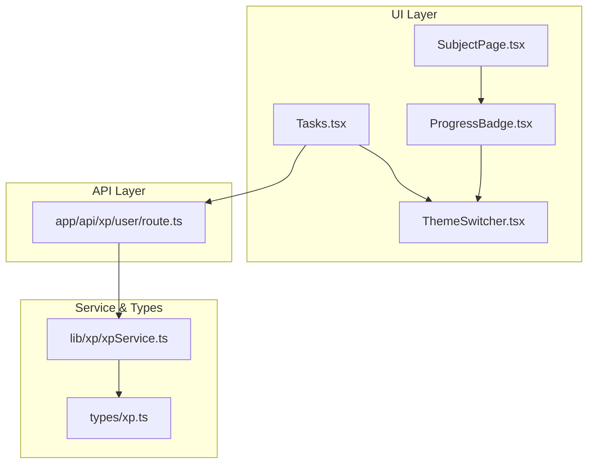
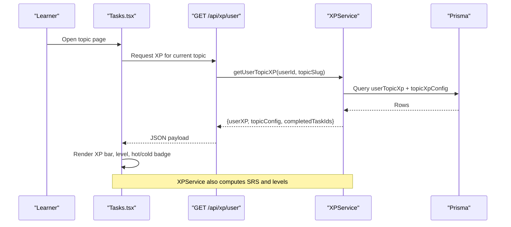
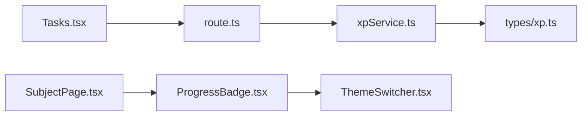

# Progress Visualization

<cite>
**Referenced Files in This Document**
- [ProgressBadge.tsx](file://components/math/ProgressBadge.tsx)
- [SubjectPage.tsx](file://components/SubjectPage.tsx)
- [Tasks.tsx](file://components/tasks/Tasks.tsx)
- [xpService.ts](file://lib/xp/xpService.ts)
- [route.ts](file://app/api/xp/user/route.ts)
- [xp.ts](file://types/xp.ts)
- [ThemeSwitcher.tsx](file://components/ThemeSwither/ThemeSwitcher.tsx)
- [XP_SRS_AUDIT.md](file://XP_SRS_AUDIT.md)
</cite>

## Table of Contents
1. [Introduction](#introduction)
2. [Project Structure](#project-structure)
3. [Core Components](#core-components)
4. [Architecture Overview](#architecture-overview)
5. [Detailed Component Analysis](#detailed-component-analysis)
6. [Dependency Analysis](#dependency-analysis)
7. [Performance Considerations](#performance-considerations)
8. [Troubleshooting Guide](#troubleshooting-guide)
9. [Conclusion](#conclusion)

## Introduction
This document explains the progress visualization system for learner achievements and milestones. It covers:
- The ProgressBadge component for per-section completion badges
- XP progress bars, level indicators, and mastery displays
- How progress data flows from XPService to UI components
- Real-time progress updates and visual feedback mechanisms
- Badge styling, progress animations, hot/cold topic indicators, and theme integration
- Usage examples, data binding patterns, and customization options

## Project Structure
The progress visualization spans UI components, a backend API, and a service layer that encapsulates XP and SRS logic.

**Diagram sources**
- [ProgressBadge.tsx](file://components/math/ProgressBadge.tsx#L1-L48)
- [SubjectPage.tsx](file://components/SubjectPage.tsx#L1-L181)
- [Tasks.tsx](file://components/tasks/Tasks.tsx#L200-L441)
- [route.ts](file://app/api/xp/user/route.ts#L1-L41)
- [xpService.ts](file://lib/xp/xpService.ts#L1-L795)
- [xp.ts](file://types/xp.ts#L1-L131)
- [ThemeSwitcher.tsx](file://components/ThemeSwither/ThemeSwitcher.tsx#L1-L69)

**Section sources**
- [ProgressBadge.tsx](file://components/math/ProgressBadge.tsx#L1-L48)
- [SubjectPage.tsx](file://components/SubjectPage.tsx#L1-L181)
- [Tasks.tsx](file://components/tasks/Tasks.tsx#L200-L441)
- [route.ts](file://app/api/xp/user/route.ts#L1-L41)
- [xpService.ts](file://lib/xp/xpService.ts#L1-L795)
- [xp.ts](file://types/xp.ts#L1-L131)
- [ThemeSwitcher.tsx](file://components/ThemeSwither/ThemeSwitcher.tsx#L1-L69)

## Core Components
- ProgressBadge: Lightweight per-section completion indicator with animated loading and completion state styling.
- XP progress bar and level display: Implemented in Tasks UI with dynamic width and color transitions.
- Hot/cold topic indicators: Visual badges and container highlights based on SRS status.
- XPService: Centralized XP calculation, SRS scheduling, and user/topic persistence logic.
- API endpoint: Provides user XP, topic config, and completed task IDs for the current topic.

**Section sources**
- [ProgressBadge.tsx](file://components/math/ProgressBadge.tsx#L1-L48)
- [Tasks.tsx](file://components/tasks/Tasks.tsx#L200-L441)
- [xpService.ts](file://lib/xp/xpService.ts#L118-L293)
- [route.ts](file://app/api/xp/user/route.ts#L5-L32)

## Architecture Overview
The system follows a clean separation of concerns:
- UI components render progress and respond to user actions
- API routes authenticate and fetch XP data for the current topic
- XPService encapsulates XP computation, SRS scheduling, and persistence
- Types define the shape of XP, topic configs, and calculation results

**Diagram sources**
- [route.ts](file://app/api/xp/user/route.ts#L5-L32)
- [xpService.ts](file://lib/xp/xpService.ts#L325-L350)
- [Tasks.tsx](file://components/tasks/Tasks.tsx#L200-L370)

## Detailed Component Analysis

### ProgressBadge Component
Purpose:
- Show a compact completion badge for a section with lessons
- Display loading state and completion state with theme-aware colors

Key behaviors:
- Animated skeleton while loading
- Completion percentage computed from props
- Completion state toggles badge color scheme
- Accessible labeling via role and aria-label

Usage pattern:
- Integrated into subject pages to show per-section progress

Customization options:
- Adjust color classes for light/dark themes
- Modify size classes (height/width) for different layouts
- Swap icon or text representation as needed

**Section sources**
- [ProgressBadge.tsx](file://components/math/ProgressBadge.tsx#L10-L47)
- [SubjectPage.tsx](file://components/SubjectPage.tsx#L117-L117)

### XP Progress Bar and Level Indicators
Purpose:
- Visualize current XP toward next level
- Display current level and total XP earned
- Highlight hot/cold topic status

Implementation highlights:
- Dynamic width based on current vs. next level thresholds
- Smooth transition animation for width changes
- Container highlight and “hot topic” badge when SRS requires review
- Timer text indicating time until full XP restoration
- Daily energy battery showing remaining tasks with color-coded segments

Styling and theming:
- Uses theme-aware background and text colors
- Gradient fill for the XP bar
- Color-coded energy battery segments

Real-time updates:
- Triggered by API refresh after task submission
- Reflects updated user XP, levels, and SRS dates

**Section sources**
- [Tasks.tsx](file://components/tasks/Tasks.tsx#L214-L256)
- [Tasks.tsx](file://components/tasks/Tasks.tsx#L259-L349)
- [Tasks.tsx](file://components/tasks/Tasks.tsx#L351-L369)

### Hot/Cold Topic Indicators
Purpose:
- Communicate whether a topic is due for scheduled review (“hot”) or too early to review (“cold”)
- Provide immediate visual feedback for SRS behavior

Implementation:
- “Hot topic” badge appears when next review date is today or past
- Container border and background gradient change to warm tones when hot
- Timer shows days until full XP restoration when cold
- Energy battery reflects remaining daily tasks with color zones

Integration with XPService:
- Determined by comparing next review date to current date
- Used to decide multiplier and SRS stage advancement

**Section sources**
- [Tasks.tsx](file://components/tasks/Tasks.tsx#L217-L226)
- [Tasks.tsx](file://components/tasks/Tasks.tsx#L206-L212)
- [Tasks.tsx](file://components/tasks/Tasks.tsx#L351-L365)
- [xpService.ts](file://lib/xp/xpService.ts#L171-L175)

### XPService: Data Flow and Logic
Responsibilities:
- Compute XP rewards considering task difficulty and daily multipliers
- Manage SRS stages and next review dates
- Track user levels based on XP thresholds
- Persist and return user XP, topic config, and completed task IDs

Data flow:
- Accepts task submission and user context
- Calculates XP and SRS adjustments
- Updates userTopicXp and userTaskAttempt records
- Returns structured results for UI consumption

Key algorithms:
- Daily multiplier computation based on task count within a day
- Level computation from XP thresholds
- SRS stage progression and next review date scheduling

**Section sources**
- [xpService.ts](file://lib/xp/xpService.ts#L118-L293)
- [xpService.ts](file://lib/xp/xpService.ts#L325-L350)
- [xpService.ts](file://lib/xp/xpService.ts#L376-L480)
- [xpService.ts](file://lib/xp/xpService.ts#L531-L603)

### API Endpoint: GET /api/xp/user
Responsibilities:
- Authenticate request
- Extract topicSlug from query params
- Fetch user XP, topic config, and completed task IDs
- Return structured response for UI rendering

Error handling:
- Unauthorized and missing topicSlug scenarios
- Internal server error fallback

**Section sources**
- [route.ts](file://app/api/xp/user/route.ts#L5-L32)

### Types: Data Contracts
Defines:
- TopicXPConfig: topic-level XP configuration (thresholds, intervals, daily caps)
- UserTopicXP: per-user topic XP, levels, SRS stage, and daily counters
- XPCalculationResult: outcome of XP computation including SRS diagnostics
- TaskSubmissionRequest/Response: submission contract for tasks
- TaskDueForReview: review queue entries

These types guide UI rendering and service logic.

**Section sources**
- [xp.ts](file://types/xp.ts#L26-L81)
- [xp.ts](file://types/xp.ts#L83-L96)
- [xp.ts](file://types/xp.ts#L115-L131)

### Theme Integration
- ThemeSwitcher provides light/dark mode toggling
- ProgressBadge and Tasks components use Tailwind utility classes that adapt to dark mode
- XP bar gradients and container highlights remain readable across themes

Best practices:
- Prefer Tailwind dark: variants for consistent theming
- Avoid hardcoding colors; rely on semantic color classes

**Section sources**
- [ThemeSwitcher.tsx](file://components/ThemeSwither/ThemeSwitcher.tsx#L1-L69)
- [ProgressBadge.tsx](file://components/math/ProgressBadge.tsx#L34-L38)
- [Tasks.tsx](file://components/tasks/Tasks.tsx#L206-L212)

## Dependency Analysis

**Diagram sources**
- [Tasks.tsx](file://components/tasks/Tasks.tsx#L200-L370)
- [route.ts](file://app/api/xp/user/route.ts#L1-L41)
- [xpService.ts](file://lib/xp/xpService.ts#L1-L795)
- [xp.ts](file://types/xp.ts#L1-L131)
- [SubjectPage.tsx](file://components/SubjectPage.tsx#L1-L181)
- [ProgressBadge.tsx](file://components/math/ProgressBadge.tsx#L1-L48)
- [ThemeSwitcher.tsx](file://components/ThemeSwither/ThemeSwitcher.tsx#L1-L69)

**Section sources**
- [Tasks.tsx](file://components/tasks/Tasks.tsx#L200-L370)
- [route.ts](file://app/api/xp/user/route.ts#L1-L41)
- [xpService.ts](file://lib/xp/xpService.ts#L1-L795)
- [SubjectPage.tsx](file://components/SubjectPage.tsx#L1-L181)
- [ProgressBadge.tsx](file://components/math/ProgressBadge.tsx#L1-L48)
- [ThemeSwitcher.tsx](file://components/ThemeSwither/ThemeSwitcher.tsx#L1-L69)

## Performance Considerations
- Minimize re-renders by passing memoized props to progress components
- Debounce or batch UI updates after XP recalculations
- Use efficient Tailwind utilities; avoid excessive nested wrappers
- Keep XP bar width calculations simple and precomputed where possible

## Troubleshooting Guide
Common issues and resolutions:
- XP bar not updating after task submission
  - Ensure the UI triggers a refetch of XP data from the API endpoint
  - Verify the endpoint returns updated userXP and topicConfig
- Hot/cold indicator not visible
  - Confirm that userXP.nextReviewDate is present and compared against current date
  - Check that the UI condition evaluates to true for hot/cold states
- ProgressBadge shows loading indefinitely
  - Implement a realistic fetch to populate completed count
  - Add error handling and fallback states
- Theme inconsistencies
  - Use Tailwind dark: variants for all themed elements
  - Confirm ThemeSwitcher is initialized and active

**Section sources**
- [XP_SRS_AUDIT.md](file://XP_SRS_AUDIT.md#L42-L53)
- [XP_SRS_AUDIT.md](file://XP_SRS_AUDIT.md#L80-L97)
- [route.ts](file://app/api/xp/user/route.ts#L5-L32)
- [Tasks.tsx](file://components/tasks/Tasks.tsx#L217-L226)
- [ProgressBadge.tsx](file://components/math/ProgressBadge.tsx#L26-L30)

## Conclusion
The progress visualization system combines a robust XPService with intuitive UI components to deliver timely, theme-aware feedback on learner progress. The XP bar, level indicators, and hot/cold topic signals provide clear motivation and direction. Enhancing the UI with the identified visualizations and ensuring seamless real-time updates will further improve the learning experience.