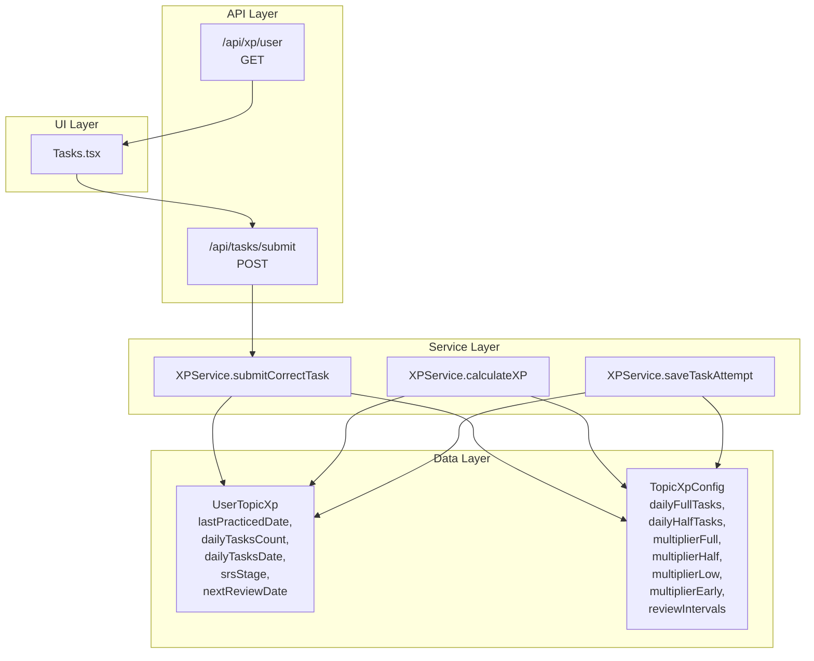
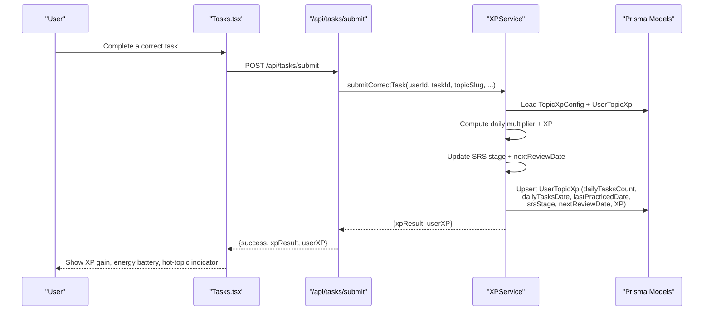
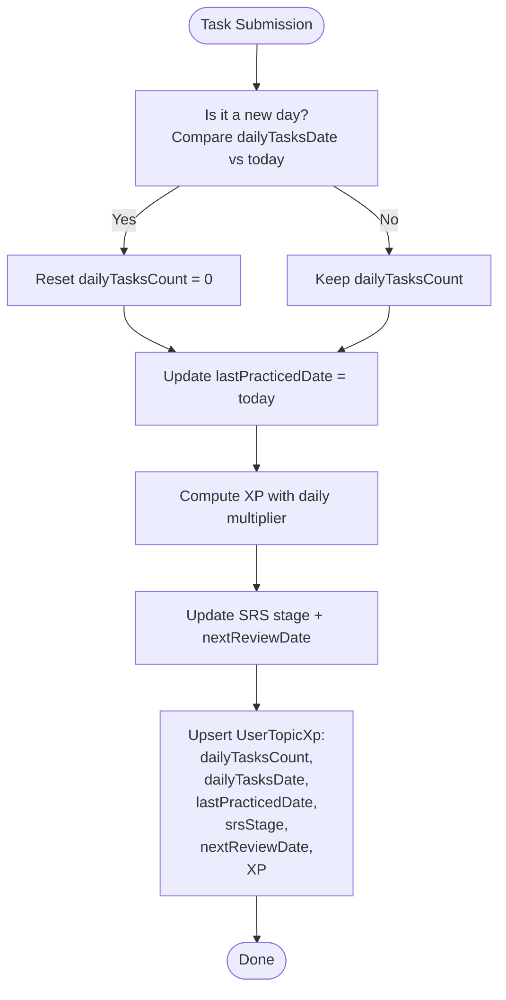
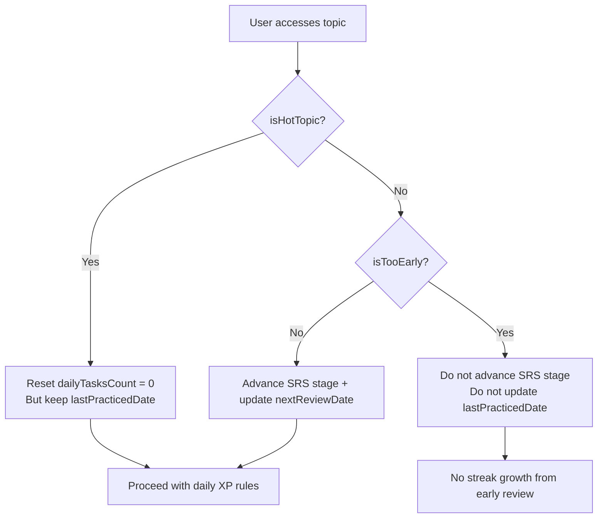
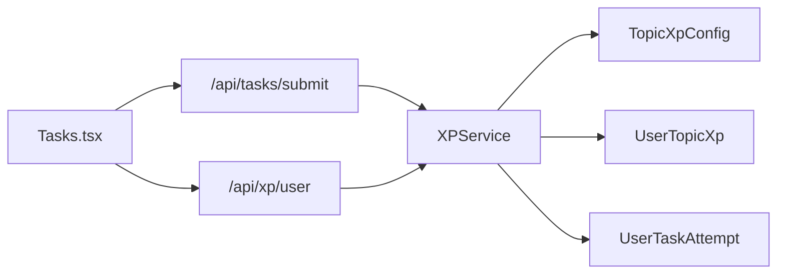
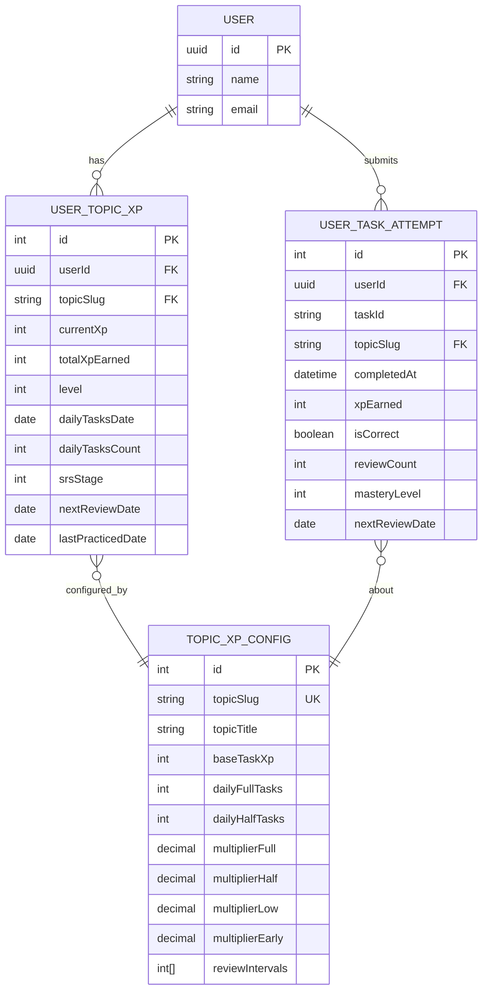

# Streak Management

<cite>
**Referenced Files in This Document**
- [xpService.ts](file://lib/xp/xpService.ts)
- [Tasks.tsx](file://components/tasks/Tasks.tsx)
- [route.ts](file://app/api/tasks/submit/route.ts)
- [route.ts](file://app/api/xp/user/route.ts)
- [xp.ts](file://types/xp.ts)
- [schema.prisma](file://prisma/schema.prisma)
- [XP_SYSTEM.md](file://XP_SYSTEM.md)
- [XP_SRS_AUDIT.md](file://XP_SRS_AUDIT.md)
</cite>

## Table of Contents
1. [Introduction](#introduction)
2. [Project Structure](#project-structure)
3. [Core Components](#core-components)
4. [Architecture Overview](#architecture-overview)
5. [Detailed Component Analysis](#detailed-component-analysis)
6. [Dependency Analysis](#dependency-analysis)
7. [Performance Considerations](#performance-considerations)
8. [Troubleshooting Guide](#troubleshooting-guide)
9. [Conclusion](#conclusion)
10. [Appendices](#appendices)

## Introduction
This document explains the streak management system that tracks consecutive learning activity and rewards consistency. While the codebase does not define a dedicated "streak" field, streak-like behavior emerges from two complementary mechanisms:
- Daily activity tracking via lastPracticedDate
- SRS review scheduling that naturally encourages regular practice

The system influences XP multipliers, shapes review timing, and provides the foundation for streak-based achievements and bonuses. It also integrates with daily XP calculations and UI visualization to reinforce consistent practice.

## Project Structure
The streak management logic spans service-layer computation, API endpoints, UI rendering, and database models.

**Diagram sources**
- [route.ts](file://app/api/tasks/submit/route.ts#L1-L59)
- [route.ts](file://app/api/xp/user/route.ts#L1-L41)
- [xpService.ts](file://lib/xp/xpService.ts#L117-L293)
- [Tasks.tsx](file://components/tasks/Tasks.tsx#L1-L441)
- [schema.prisma](file://prisma/schema.prisma#L99-L122)
- [xp.ts](file://types/xp.ts#L26-L81)

**Section sources**
- [route.ts](file://app/api/tasks/submit/route.ts#L1-L59)
- [route.ts](file://app/api/xp/user/route.ts#L1-L41)
- [xpService.ts](file://lib/xp/xpService.ts#L117-L293)
- [Tasks.tsx](file://components/tasks/Tasks.tsx#L1-L441)
- [schema.prisma](file://prisma/schema.prisma#L99-L122)
- [xp.ts](file://types/xp.ts#L26-L81)

## Core Components
- XPService: Central orchestrator for XP calculation, SRS progression, and daily activity updates. It computes XP multipliers, manages daily task counters, and updates lastPracticedDate.
- Tasks UI: Renders XP progress, energy battery, hot-topic indicators, and timers. It surfaces daily task limits and next review dates to encourage consistent practice.
- API endpoints: Expose submission and XP retrieval to power the UI and integrate with the service layer.
- Database models: Persist daily activity, SRS state, and topic configuration.

Key fields supporting streak-like behavior:
- lastPracticedDate: Tracks the last date a user practiced a topic.
- dailyTasksCount and dailyTasksDate: Enforce daily XP energy limits to prevent grinding.
- srsStage and nextReviewDate: Drive scheduled reviews that reward regular engagement.

**Section sources**
- [xpService.ts](file://lib/xp/xpService.ts#L46-L62)
- [schema.prisma](file://prisma/schema.prisma#L99-L122)
- [XP_SYSTEM.md](file://XP_SYSTEM.md#L130-L194)

## Architecture Overview
The streak management architecture combines real-time XP updates with SRS scheduling and UI feedback loops.

**Diagram sources**
- [route.ts](file://app/api/tasks/submit/route.ts#L34-L47)
- [xpService.ts](file://lib/xp/xpService.ts#L117-L293)
- [Tasks.tsx](file://components/tasks/Tasks.tsx#L64-L122)

## Detailed Component Analysis

### Streak Calculation Logic
Streaks are not stored as a single field. Instead, streak-like continuity emerges from:
- lastPracticedDate: Updated on each correct submission to reflect the latest practice date.
- Daily task counter resets at day boundaries, encouraging daily participation.
- SRS scheduling ensures users return on planned review dates, reinforcing routine practice.

**Diagram sources**
- [xpService.ts](file://lib/xp/xpService.ts#L157-L286)

**Section sources**
- [xpService.ts](file://lib/xp/xpService.ts#L157-L286)
- [schema.prisma](file://prisma/schema.prisma#L99-L122)

### Daily Activity Tracking via lastPracticedDate
- On each correct submission, lastPracticedDate is set to the current date, marking the user’s latest practice.
- This enables streak continuity checks in higher-level logic (e.g., determining if today counts as a consecutive day after a previous practice).

Integration points:
- Submission endpoint triggers the update.
- UI displays last practiced date and related hints.

**Section sources**
- [xpService.ts](file://lib/xp/xpService.ts#L284-L284)
- [route.ts](file://app/api/tasks/submit/route.ts#L34-L47)

### Streak Preservation During SRS Review Periods
- When a topic becomes “hot” (isHotTopic), the daily counter resets to encourage fresh daily practice, but lastPracticedDate remains updated.
- If a user practices while “too early,” SRS stage does not advance, preventing unintended streak growth from premature reviews.
- This preserves streaks by rewarding actual daily engagement rather than forced early reviews.

**Diagram sources**
- [xpService.ts](file://lib/xp/xpService.ts#L171-L217)

**Section sources**
- [xpService.ts](file://lib/xp/xpService.ts#L171-L217)

### How Streaks Influence XP Multipliers, Bonuses, and Achievements
- XP multipliers are derived from daily task index and SRS status:
  - First N tasks: multiplierFull
  - Next N tasks: multiplierHalf
  - Beyond: multiplierLow
  - Too early review: multiplierEarly
- These multipliers shape XP gains and indirectly support streak-based achievements by incentivizing daily practice and timely reviews.

Potential bonus mechanics:
- Streak-based achievements and XP bonuses can be introduced by computing consecutive practice days using lastPracticedDate and enforcing minimum daily participation thresholds.

**Section sources**
- [xpService.ts](file://lib/xp/xpService.ts#L91-L106)
- [XP_SYSTEM.md](file://XP_SYSTEM.md#L130-L194)

### Streak Reset Conditions
- New day boundary: dailyTasksCount resets to 0.
- Hot topic condition: dailyTasksCount resets to 0 to encourage fresh daily practice.
- Too early review: SRS stage does not advance; streak growth is paused until proper review timing.

**Section sources**
- [xpService.ts](file://lib/xp/xpService.ts#L163-L165)
- [xpService.ts](file://lib/xp/xpService.ts#L171-L173)

### Streak Visualization in the UI
The UI currently visualizes:
- XP progress and level
- Energy battery indicating remaining full-reward tasks for the day
- Hot-topic indicator and countdown to next review
- Last practiced date hint

Future enhancements could include:
- A dedicated streak badge showing consecutive practice days
- Visual streak charts or streak counters on topic lists

**Section sources**
- [Tasks.tsx](file://components/tasks/Tasks.tsx#L205-L370)
- [XP_SYSTEM.md](file://XP_SYSTEM.md#L350-L356)

### Integration with Daily XP Calculations
- Daily XP is computed using computeDailyMultiplier based on dailyTasksCountBefore and configured thresholds.
- The service updates lastPracticedDate and SRS stage alongside XP, ensuring streak continuity and review scheduling remain aligned with daily practice.

**Section sources**
- [xpService.ts](file://lib/xp/xpService.ts#L91-L106)
- [xpService.ts](file://lib/xp/xpService.ts#L117-L293)

### Examples of Streak Growth Patterns and Reset Scenarios
- Pattern A: Consistent daily practice
  - Each correct submission updates lastPracticedDate and increments XP with appropriate multiplier.
  - SRS stage advances on schedule, reinforcing routine.
- Pattern B: Hot topic mid-day
  - Daily counter resets to 0, but lastPracticedDate remains updated.
  - User can continue practicing with full XP for the day.
- Pattern C: Too early review
  - SRS stage does not advance; XP is reduced via multiplierEarly.
  - No streak growth occurs until the proper review date.

**Section sources**
- [xpService.ts](file://lib/xp/xpService.ts#L171-L217)
- [XP_SRS_AUDIT.md](file://XP_SRS_AUDIT.md#L27-L53)

### How Streak Management Complements Gamification
- Encourages regular practice through:
  - Daily XP energy limits that reward sustained effort
  - SRS scheduling that nudges users back on optimal days
  - Visual feedback (energy battery, hot-topic indicator) that reinforces streak-friendly behavior
- Provides hooks for future gamification:
  - Streak badges and milestones
  - Special bonuses for perfect streaks
  - Achievement tiers based on longest streaks

**Section sources**
- [XP_SYSTEM.md](file://XP_SYSTEM.md#L342-L356)
- [XP_SRS_AUDIT.md](file://XP_SRS_AUDIT.md#L80-L97)

## Dependency Analysis

**Diagram sources**
- [xpService.ts](file://lib/xp/xpService.ts#L117-L293)
- [Tasks.tsx](file://components/tasks/Tasks.tsx#L1-L441)
- [route.ts](file://app/api/tasks/submit/route.ts#L1-L59)
- [route.ts](file://app/api/xp/user/route.ts#L1-L41)
- [schema.prisma](file://prisma/schema.prisma#L70-L142)

**Section sources**
- [xpService.ts](file://lib/xp/xpService.ts#L117-L293)
- [schema.prisma](file://prisma/schema.prisma#L70-L142)

## Performance Considerations
- Single transaction per submission ensures consistency and reduces contention.
- Indexes on nextReviewDate and user/topic keys optimize review queries and XP retrieval.
- UI computations for energy battery and hot-topic indicators are client-side and lightweight.

[No sources needed since this section provides general guidance]

## Troubleshooting Guide
Common issues and resolutions:
- Missing UI streak visualization
  - Symptom: No visible streak indicators in Tasks UI.
  - Resolution: Add streak display components and connect to lastPracticedDate and daily counters.
- Incorrect streak growth after hot topic
  - Symptom: Streak appears unaffected by hot topic resets.
  - Resolution: Ensure lastPracticedDate is updated even when dailyTasksCount resets.
- Early review prevents streak advancement
  - Symptom: Streak stalls when reviewing too early.
  - Resolution: This is expected behavior; communicate via UI that early reviews pause streak growth.

**Section sources**
- [XP_SRS_AUDIT.md](file://XP_SRS_AUDIT.md#L42-L53)
- [xpService.ts](file://lib/xp/xpService.ts#L171-L217)

## Conclusion
The streak management system leverages lastPracticedDate, daily task counters, and SRS scheduling to naturally reward consistent practice. While a dedicated streak field is not present, the combination of daily XP energy, hot-topic resets, and scheduled reviews creates strong incentives for regular engagement. Future enhancements can introduce explicit streak tracking and visualizations to further strengthen gamification and encourage long-term habit formation.

[No sources needed since this section summarizes without analyzing specific files]

## Appendices

### Data Model Overview

**Diagram sources**
- [schema.prisma](file://prisma/schema.prisma#L19-L142)