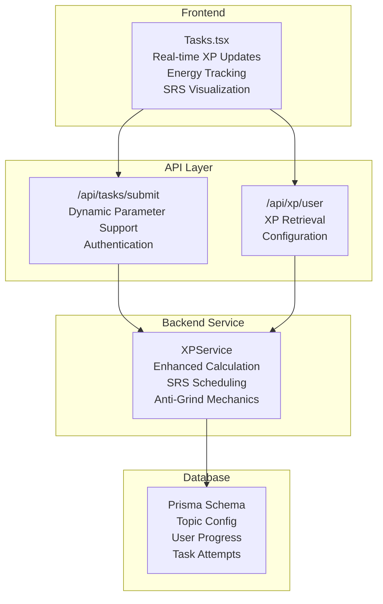
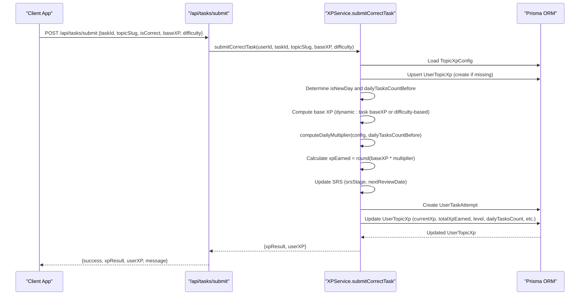
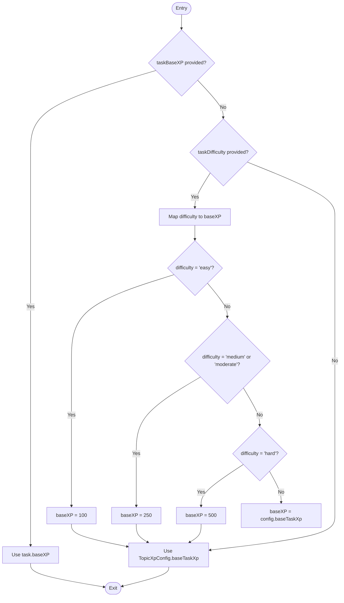
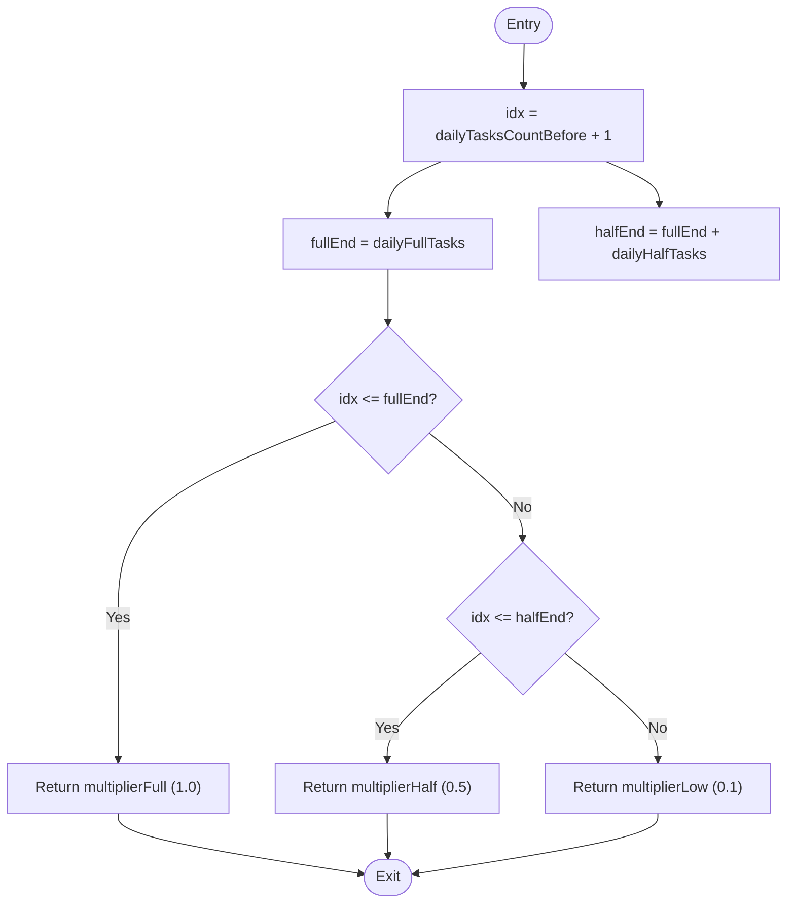
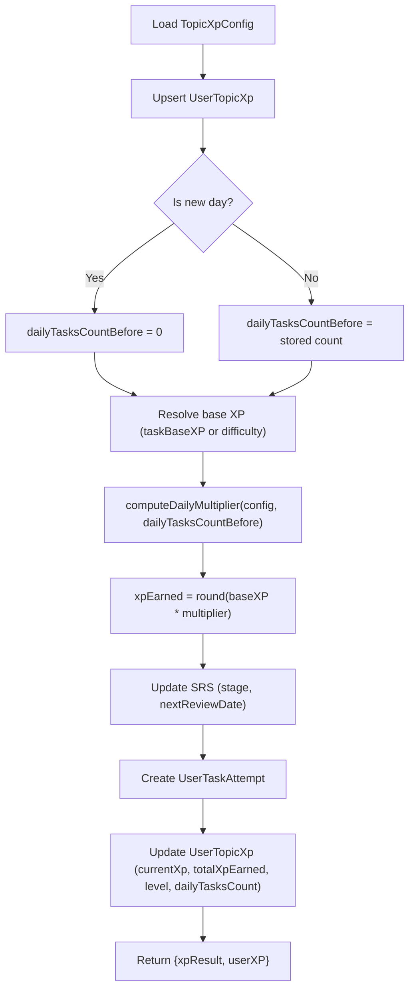
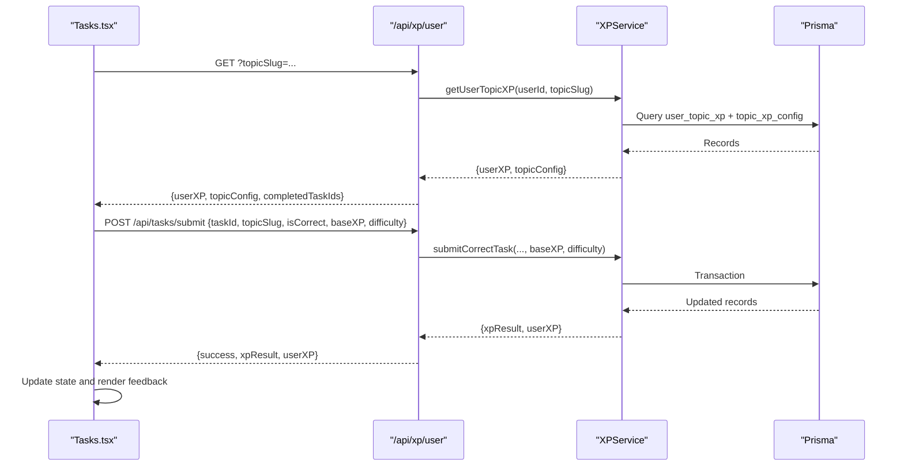

# XP Calculation Engine

<cite>
**Referenced Files in This Document**
- [xpService.ts](file://lib/xp/xpService.ts)
- [xp.ts](file://types/xp.ts)
- [route.ts](file://app/api/tasks/submit/route.ts)
- [route.ts](file://app/api/xp/user/route.ts)
- [Tasks.tsx](file://components/tasks/Tasks.tsx)
- [schema.prisma](file://prisma/schema.prisma)
</cite>

## Update Summary
**Changes Made**
- Enhanced XP calculation system with dynamic base XP calculation and difficulty-based XP mapping
- Added advanced SRS scheduling with interval-based review system
- Implemented streak tracking and daily task limits with tiered multiplier system
- Expanded from 794 to 902 lines with comprehensive XP calculation logic
- Added new calculateXP method for SRS-based XP calculation
- Enhanced submitCorrectTask workflow with anti-grind mechanics and SRS integration
- Improved frontend integration with real-time XP updates and energy tracking

## Table of Contents
1. [Introduction](#introduction)
2. [Project Structure](#project-structure)
3. [Core Components](#core-components)
4. [Architecture Overview](#architecture-overview)
5. [Detailed Component Analysis](#detailed-component-analysis)
6. [Advanced Features](#advanced-features)
7. [Integration Points](#integration-points)
8. [Performance Considerations](#performance-considerations)
9. [Troubleshooting Guide](#troubleshooting-guide)
10. [Practical Examples](#practical-examples)
11. [Conclusion](#conclusion)

## Introduction
This document explains the enhanced XP calculation engine that governs experience point rewards for student achievements. The system has been significantly expanded with dynamic base XP calculation, difficulty-based XP mapping, advanced SRS (Spaced Repetition System) scheduling, streak tracking, and comprehensive anti-grind mechanics. The system now supports both traditional XP accrual and SRS-based learning optimization, providing a balanced approach to educational gamification.

The engine calculates XP rewards based on task completion, difficulty levels, daily practice limits, and spaced repetition intervals, creating an adaptive learning experience that encourages consistent practice while preventing burnout.

## Project Structure
The XP system spans backend services, API routes, frontend components, and database schema with enhanced functionality:

- **Backend Service**: Comprehensive XPService with dynamic calculation, SRS scheduling, anti-grind enforcement, and persistence
- **API Routes**: Task submission endpoint with dynamic parameter support and XP retrieval endpoint
- **Frontend Components**: Interactive task interface with real-time XP updates, energy tracking, and SRS visualization
- **Database Schema**: Persistent storage for XP configurations, user progress, and task attempts with decimal precision

**Diagram sources**
- [Tasks.tsx](file://components/tasks/Tasks.tsx#L1-L200)
- [route.ts](file://app/api/tasks/submit/route.ts#L1-L67)
- [route.ts](file://app/api/xp/user/route.ts#L1-L41)
- [xpService.ts](file://lib/xp/xpService.ts#L11-L902)
- [schema.prisma](file://prisma/schema.prisma#L70-L143)

## Core Components

### XPService: Enhanced Calculation Engine
The XPService orchestrates comprehensive XP computation with multiple calculation modes:

- **Dynamic Base XP Calculation**: Supports both static base XP values and difficulty-based mapping
- **Advanced SRS Scheduling**: Implements interval-based spaced repetition with configurable review cycles
- **Anti-Grind Mechanics**: Enforces daily task limits with tiered multiplier system
- **Streak Tracking**: Monitors daily practice patterns and adjusts XP accordingly
- **Transaction Management**: Ensures atomic updates across XP, attempts, and progress tracking

### Types: Strongly-Typed Interfaces
Comprehensive type definitions for all XP-related entities:
- **TopicXPConfig**: Complete configuration for topic-specific XP settings
- **UserTopicXP**: User progress tracking with computed metrics
- **UserTaskAttempt**: Individual task attempt history with SRS data
- **XPCalculationResult**: Detailed calculation results with diagnostic information

### API Integration
- **Task Submission**: Handles correct/incorrect submissions with dynamic parameter processing
- **XP Retrieval**: Provides user progress, topic configuration, and completion status
- **Authentication**: Secure session-based access control

**Section sources**
- [xpService.ts](file://lib/xp/xpService.ts#L11-L902)
- [xp.ts](file://types/xp.ts#L1-L131)
- [route.ts](file://app/api/tasks/submit/route.ts#L1-L67)
- [route.ts](file://app/api/xp/user/route.ts#L1-L41)

## Architecture Overview
The enhanced XP engine follows a sophisticated transactional workflow that ensures consistency across XP calculation, SRS scheduling, daily limits, and streak tracking.

**Diagram sources**
- [route.ts](file://app/api/tasks/submit/route.ts#L6-L58)
- [xpService.ts](file://lib/xp/xpService.ts#L118-L293)

## Detailed Component Analysis

### Enhanced Base XP Calculation Logic
The system now supports flexible base XP determination through multiple sources:

**Diagram sources**
- [xpService.ts](file://lib/xp/xpService.ts#L177-L186)

**Section sources**
- [xpService.ts](file://lib/xp/xpService.ts#L177-L186)

### Advanced computeDailyMultiplier Logic
The function implements a sophisticated tiered multiplier system based on daily task performance:

**Diagram sources**
- [xpService.ts](file://lib/xp/xpService.ts#L91-L106)

**Section sources**
- [xpService.ts](file://lib/xp/xpService.ts#L91-L106)

### Enhanced submitCorrectTask Workflow
The comprehensive workflow integrates multiple systems for optimal learning experience:

- **Configuration Loading**: Loads topic-specific XP configuration with defaults
- **Progress Management**: Creates user progress record if non-existent
- **Daily Cycle Detection**: Identifies new day resets and maintains streak continuity
- **Base XP Resolution**: Applies dynamic calculation from multiple sources
- **Multiplier Application**: Implements tiered daily limit system
- **SRS Integration**: Updates spaced repetition stage and review schedule
- **Attempt Recording**: Logs detailed attempt history with XP and SRS data
- **Progress Updates**: Maintains current XP, total XP, level, and daily statistics

**Diagram sources**
- [xpService.ts](file://lib/xp/xpService.ts#L118-L293)

**Section sources**
- [xpService.ts](file://lib/xp/xpService.ts#L118-L293)

### SRS-Based XP Calculation Method
The calculateXP method provides an alternative calculation path focused purely on spaced repetition:

- **Last Attempt Analysis**: Reviews previous attempt history for SRS progression
- **Interval-Based Calculation**: Uses configurable review intervals for XP determination
- **Decay Factor Application**: Implements exponential decay for delayed reviews
- **Mastery Level Progression**: Advances through configurable mastery stages
- **Next Review Date Calculation**: Determines optimal future review timing

**Section sources**
- [xpService.ts](file://lib/xp/xpService.ts#L483-L587)

## Advanced Features

### Streak Tracking and Daily Limits
The system implements sophisticated streak management:

- **Daily Task Count**: Tracks completed tasks per day with automatic reset
- **Tiered Multiplier System**: Progressive XP reduction after daily limits reached
- **Energy Visualization**: Real-time display of remaining daily XP capacity
- **Streak Continuity**: Maintains streak across sessions with date-based detection

### Advanced SRS Scheduling
Comprehensive spaced repetition implementation:

- **Configurable Intervals**: Customizable review schedules (1, 3, 7, 14, 30 days)
- **Mastery Level Progression**: Five-stage mastery system with automatic advancement
- **Early Review Handling**: Differentiates between scheduled and premature reviews
- **Review Date Management**: Sophisticated date calculation for optimal learning timing

### Anti-Grind Mechanics
Multiple layers of prevention against excessive grinding:

- **Daily Task Limits**: Configurable caps on daily XP accumulation
- **Multiplier Tiers**: Progressive XP reduction beyond daily limits
- **Early Review Penalties**: Reduced XP for reviewing before optimal timing
- **Minimum XP Thresholds**: Guaranteed minimum XP even with decay factors

**Section sources**
- [xpService.ts](file://lib/xp/xpService.ts#L91-L106)
- [xpService.ts](file://lib/xp/xpService.ts#L171-L218)
- [schema.prisma](file://prisma/schema.prisma#L70-L143)

## Integration Points

### API Integration
The system provides robust API endpoints:

- **Task Submission Endpoint**: Validates authentication, processes submissions, and returns detailed results
- **User XP Endpoint**: Retrieves comprehensive user progress with configuration and completion status
- **Parameter Processing**: Handles dynamic baseXP and difficulty parameters seamlessly
- **Error Handling**: Comprehensive error handling with meaningful diagnostic information

### Frontend Integration
The Tasks component provides rich user interaction:

- **Real-time Updates**: Immediate XP feedback and progress visualization
- **Energy Tracking**: Visual representation of daily XP capacity and remaining tasks
- **SRS Status**: Clear indication of review readiness and upcoming review dates
- **Historical Data**: Access to attempt history and mastery progression

**Diagram sources**
- [Tasks.tsx](file://components/tasks/Tasks.tsx#L534-L575)
- [route.ts](file://app/api/xp/user/route.ts#L5-L40)
- [xpService.ts](file://lib/xp/xpService.ts#L432-L457)

**Section sources**
- [route.ts](file://app/api/tasks/submit/route.ts#L1-L67)
- [route.ts](file://app/api/xp/user/route.ts#L1-L41)
- [Tasks.tsx](file://components/tasks/Tasks.tsx#L534-L575)

## Performance Considerations

### Database Optimization
- **Decimal Precision**: Uses Decimal type for precise multiplier calculations
- **Index Optimization**: Strategic indexing on frequently queried fields
- **Transaction Batching**: Atomic operations to prevent race conditions
- **Query Efficiency**: Optimized queries with selective field retrieval

### Frontend Performance
- **State Caching**: Local state caching to minimize API calls
- **Memoization**: Computed values cached with dependency tracking
- **Efficient Rendering**: Conditional rendering based on state changes
- **Resource Management**: Proper cleanup of audio resources and timers

### Calculation Efficiency
- **Minimal Rounding**: Single rounding operation at calculation end
- **Early Termination**: Quick exits for edge cases and invalid states
- **Batch Operations**: Combined database operations within transactions
- **Memory Management**: Efficient data structures for large attempt histories

## Troubleshooting Guide

### Common Issues and Resolutions
- **Unauthorized Access**: Ensure valid session before calling submission endpoint
- **Missing Parameters**: Verify taskId, topicSlug, and required authentication
- **Configuration Errors**: Check topic configuration exists and is properly formatted
- **Daily Limit Confusion**: Review tiered multiplier system and daily task counts
- **SRS Timing Issues**: Verify review intervals and nextReviewDate calculations
- **Difficulty Mapping Errors**: Ensure task difficulty values match expected formats
- **Base XP Conflicts**: Understand precedence between task parameters and difficulty mapping

### Debug Information
The system provides comprehensive diagnostic information:
- **XP Calculation Details**: Breakdown of base XP, multipliers, and final amounts
- **SRS Status Indicators**: Current stage, review count, and next review date
- **Daily Limit Information**: Remaining tasks and current tier level
- **Error Messages**: Descriptive error messages for troubleshooting

**Section sources**
- [route.ts](file://app/api/tasks/submit/route.ts#L6-L58)
- [xpService.ts](file://lib/xp/xpService.ts#L118-L293)

## Practical Examples

### Example 1: Dynamic Base XP Calculation
Assume a task with difficulty-based XP mapping:
- Easy task: difficulty = 'easy' → baseXP = 100
- Medium task: difficulty = 'medium' → baseXP = 250  
- Hard task: difficulty = 'hard' → baseXP = 500
- Custom baseXP parameter: baseXP = 300 (takes precedence over difficulty)

Calculation sequence:
- Task with difficulty 'easy': XP = 100 × multiplier
- Task with difficulty 'medium': XP = 250 × multiplier
- Task with difficulty 'hard': XP = 500 × multiplier
- Task with custom baseXP: XP = 300 × multiplier

**Section sources**
- [xpService.ts](file://lib/xp/xpService.ts#L177-L186)

### Example 2: Daily Task Sequence with Multipliers
Assume a topic with configuration:
- baseTaskXp = 100
- dailyFullTasks = 10
- dailyHalfTasks = 10
- multiplierFull = 1.0
- multiplierHalf = 0.5
- multiplierLow = 0.1

Daily sequence:
- Tasks 1-10: multiplier = 1.0 → XP = 100 per task
- Tasks 11-20: multiplier = 0.5 → XP = 50 per task  
- Tasks 21+: multiplier = 0.1 → XP = 10 per task

**Section sources**
- [xpService.ts](file://lib/xp/xpService.ts#L91-L106)

### Example 3: SRS Timing Effects
Different review scenarios:
- **Hot Topic (on schedule)**: XP = baseXP, SRS stage increases, nextReviewDate advances
- **Too Early (before nextReviewDate)**: XP = baseXP × multiplierEarly, SRS stage remains unchanged
- **Late Review**: XP calculated with decay factor, SRS stage may advance based on mastery

**Section sources**
- [xpService.ts](file://lib/xp/xpService.ts#L171-L218)

### Example 4: Level Progression System
Default level thresholds: [1000, 2500, 4500, 7000, 10000]
- XP 0–999: Level 0 (beginner)
- XP 1000–2499: Level 1 (intermediate)
- XP 2500–4499: Level 2 (advanced)
- XP 4500–6999: Level 3 (expert)
- XP 7000–9999: Level 4 (master)
- XP 10000+: Level 5 (legend)

**Section sources**
- [xpService.ts](file://lib/xp/xpService.ts#L71-L89)

## Conclusion
The enhanced XP calculation engine represents a comprehensive approach to educational gamification with sophisticated learning optimization. The system successfully balances immediate reward feedback with long-term retention through spaced repetition, while preventing burnout through intelligent anti-grind mechanics.

Key innovations include:
- **Flexible Base XP Calculation**: Dynamic determination from multiple sources
- **Advanced SRS Implementation**: Interval-based learning optimization
- **Tiered Daily Limits**: Progressive XP reduction for sustainable practice
- **Comprehensive Analytics**: Detailed tracking of streaks, mastery, and progress
- **Real-time Feedback**: Immediate XP updates and SRS visualization

The modular design allows for easy customization of XP configurations, daily limits, multiplier tiers, and difficulty mappings per topic. The system now supports both traditional XP accrual and SRS-based learning optimization, providing greater flexibility for diverse educational objectives and learning styles.