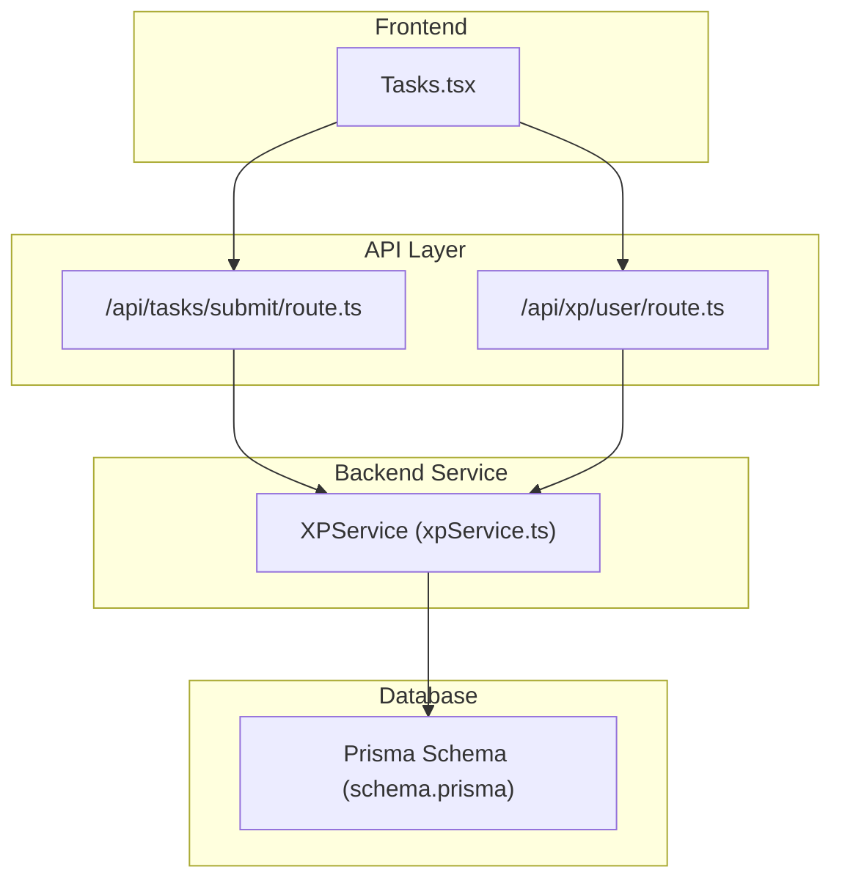
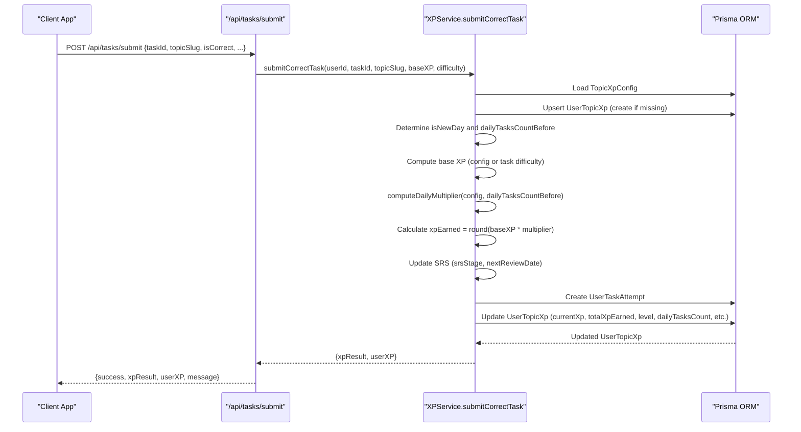
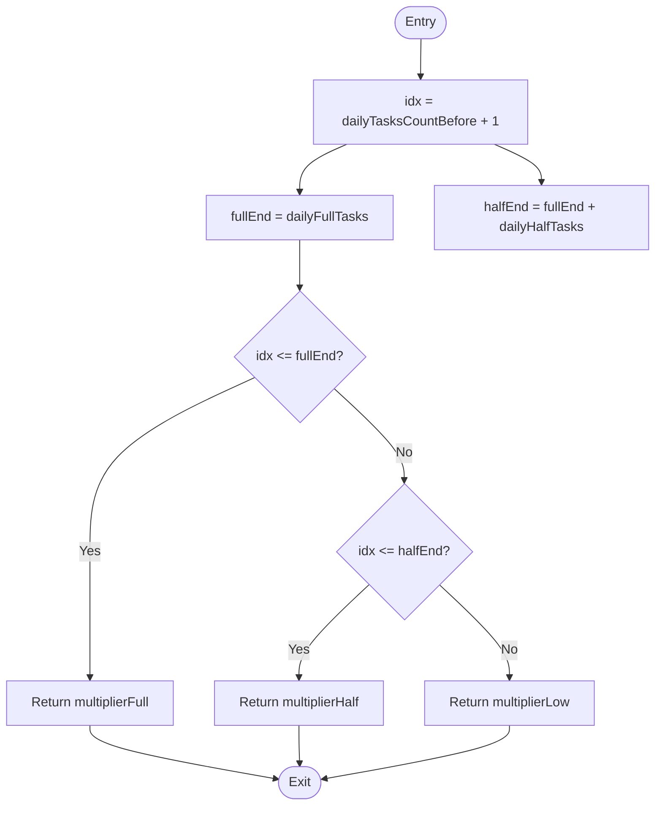
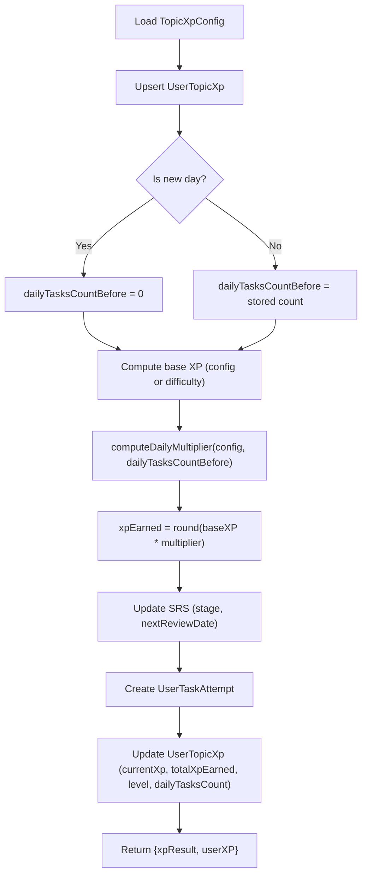
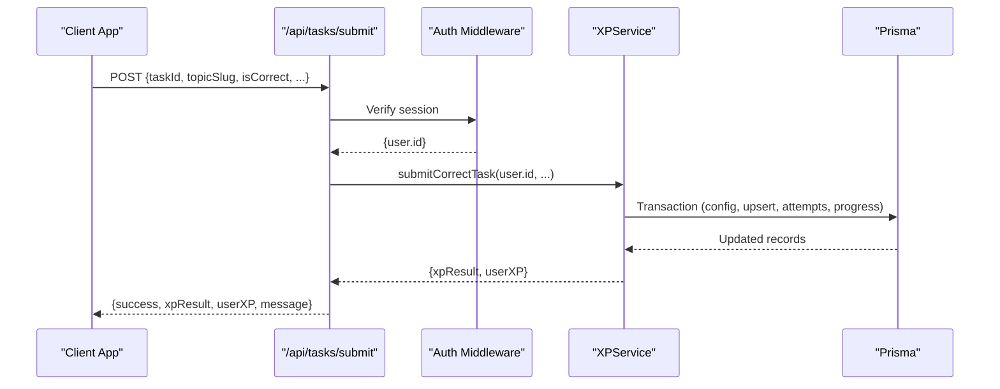
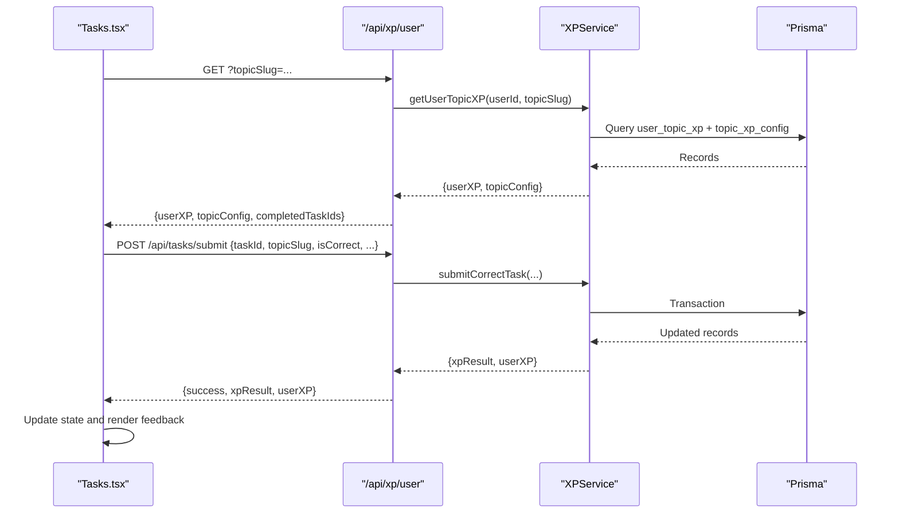
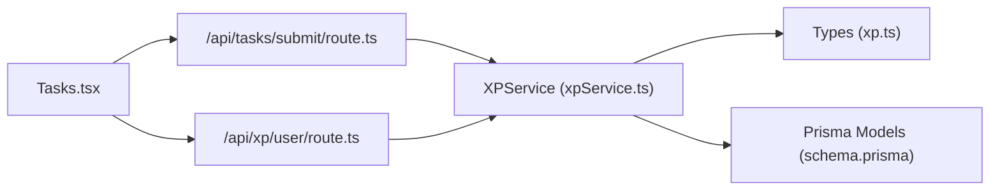

# XP Calculation Engine

<cite>
**Referenced Files in This Document**
- [xpService.ts](file://lib/xp/xpService.ts)
- [xp.ts](file://types/xp.ts)
- [route.ts](file://app/api/tasks/submit/route.ts)
- [route.ts](file://app/api/xp/user/route.ts)
- [Tasks.tsx](file://components/tasks/Tasks.tsx)
- [schema.prisma](file://prisma/schema.prisma)
- [XP_SYSTEM.md](file://XP_SYSTEM.md)
</cite>

## Table of Contents
1. [Introduction](#introduction)
2. [Project Structure](#project-structure)
3. [Core Components](#core-components)
4. [Architecture Overview](#architecture-overview)
5. [Detailed Component Analysis](#detailed-component-analysis)
6. [Dependency Analysis](#dependency-analysis)
7. [Performance Considerations](#performance-considerations)
8. [Troubleshooting Guide](#troubleshooting-guide)
9. [Conclusion](#conclusion)

## Introduction
This document explains the XP calculation engine that governs experience point rewards for student achievements. It covers the core XP formula, base task XP values, daily task limits, multiplier tiers (full, half, low), the computeDailyMultiplier function logic, the submitCorrectTask workflow, XP accumulation mechanisms, and how XP contributes to level progression. It also documents integration with the task submission API and real-time XP updates on the frontend.

## Project Structure
The XP system spans backend services, API routes, frontend components, and database schema:
- Backend service encapsulates XP computation and persistence logic
- API routes expose endpoints for task submission and user XP retrieval
- Frontend components render XP progress, energy bars, and real-time feedback
- Database schema defines persistent XP, configuration, and attempt records

**Diagram sources**
- [Tasks.tsx](file://components/tasks/Tasks.tsx#L64-L122)
- [route.ts](file://app/api/tasks/submit/route.ts#L6-L58)
- [route.ts](file://app/api/xp/user/route.ts#L5-L40)
- [xpService.ts](file://lib/xp/xpService.ts#L117-L293)
- [schema.prisma](file://prisma/schema.prisma#L70-L142)

**Section sources**
- [XP_SYSTEM.md](file://XP_SYSTEM.md#L1-L356)
- [schema.prisma](file://prisma/schema.prisma#L70-L142)

## Core Components
- XPService: Central service implementing XP calculation, SRS scheduling, anti-grind mechanics, and persistence
- Types: Strongly-typed interfaces for XP configuration, user progress, attempts, and API contracts
- API Routes: Expose task submission and XP retrieval endpoints
- Frontend Tasks: Integrates with API to display XP, energy, and real-time feedback

Key responsibilities:
- Compute XP reward considering base XP, daily multiplier tiers, and SRS timing
- Track daily task counts per topic to enforce anti-grind
- Manage SRS stages and next review dates
- Persist progress and attempts in the database
- Provide real-time XP updates to the UI

**Section sources**
- [xpService.ts](file://lib/xp/xpService.ts#L11-L795)
- [xp.ts](file://types/xp.ts#L1-L131)
- [route.ts](file://app/api/tasks/submit/route.ts#L1-L59)
- [route.ts](file://app/api/xp/user/route.ts#L1-L41)
- [Tasks.tsx](file://components/tasks/Tasks.tsx#L47-L122)

## Architecture Overview
The XP engine follows a transactional workflow that ensures consistency across XP, SRS, and daily limits.

**Diagram sources**
- [route.ts](file://app/api/tasks/submit/route.ts#L6-L58)
- [xpService.ts](file://lib/xp/xpService.ts#L117-L293)

## Detailed Component Analysis

### XPService: Core Calculation and Persistence
The XPService orchestrates XP computation, SRS scheduling, anti-grind enforcement, and persistence.

- Configuration mapping: Converts database rows to strongly-typed TopicXPConfig with defaults for multipliers, daily limits, and thresholds
- Level computation: Computes level from accumulated XP using configured thresholds
- Daily multiplier logic: Applies tiered multipliers based on task position within daily limits
- SRS logic: Updates stage and next review date depending on whether review occurs on schedule or too early
- Transactional updates: Ensures atomicity across XP, attempts, and progress

Key methods and responsibilities:
- submitCorrectTask: Main entry point for XP accrual with anti-grind and SRS
- computeDailyMultiplier: Determines multiplier tier based on daily task index
- computeLevelFromThresholds: Calculates level from current XP
- getXPCalculationResult: Alternative calculation path for SRS-only XP without anti-grind
- saveTaskAttempt: Low-level persistence of attempts and XP updates
- getTopicConfig, getUserTopicXP, getUserAllTopicsXP: Data retrieval helpers

**Section sources**
- [xpService.ts](file://lib/xp/xpService.ts#L11-L795)

#### computeDailyMultiplier Logic
The function maps a 1-based daily task index to a multiplier tier:
- First N tasks: full multiplier
- Next M tasks: half multiplier
- Beyond N+M: low multiplier

**Diagram sources**
- [xpService.ts](file://lib/xp/xpService.ts#L91-L106)

**Section sources**
- [xpService.ts](file://lib/xp/xpService.ts#L91-L106)

#### submitCorrectTask Workflow
The workflow integrates anti-grind, SRS, XP accumulation, and level progression:

- Load topic config and user progress (create if missing)
- Determine if it is a new day and compute dailyTasksCountBefore
- Resolve base XP from config or task difficulty
- Compute daily multiplier and XP earned
- Update SRS stage and next review date
- Persist attempt and update user XP totals and level
- Return diagnostic info for UI

**Diagram sources**
- [xpService.ts](file://lib/xp/xpService.ts#L117-L293)

**Section sources**
- [xpService.ts](file://lib/xp/xpService.ts#L117-L293)

### API Integration
- Task Submission Endpoint: Validates session, checks correctness, and calls XPService.submitCorrectTask
- User XP Endpoint: Fetches user XP, topic config, and completed task IDs for UI rendering

**Diagram sources**
- [route.ts](file://app/api/tasks/submit/route.ts#L6-L58)
- [xpService.ts](file://lib/xp/xpService.ts#L117-L293)

**Section sources**
- [route.ts](file://app/api/tasks/submit/route.ts#L1-L59)
- [route.ts](file://app/api/xp/user/route.ts#L1-L41)

### Frontend Integration
The Tasks component:
- Fetches user XP and topic config on mount
- Submits correct answers to the API endpoint
- Updates local state with XP results and displays real-time feedback
- Renders XP progress, energy bar, and SRS timer

**Diagram sources**
- [Tasks.tsx](file://components/tasks/Tasks.tsx#L47-L122)
- [route.ts](file://app/api/xp/user/route.ts#L5-L40)
- [xpService.ts](file://lib/xp/xpService.ts#L325-L350)

**Section sources**
- [Tasks.tsx](file://components/tasks/Tasks.tsx#L47-L122)

## Dependency Analysis
The XP engine depends on:
- Prisma models for TopicXpConfig, UserTopicXp, and UserTaskAttempt
- Types for XP configuration, user progress, attempts, and API contracts
- API routes for external integration
- Frontend components for real-time updates

**Diagram sources**
- [xpService.ts](file://lib/xp/xpService.ts#L1-L795)
- [xp.ts](file://types/xp.ts#L1-L131)
- [schema.prisma](file://prisma/schema.prisma#L70-L142)
- [route.ts](file://app/api/tasks/submit/route.ts#L1-L59)
- [route.ts](file://app/api/xp/user/route.ts#L1-L41)
- [Tasks.tsx](file://components/tasks/Tasks.tsx#L1-L441)

**Section sources**
- [schema.prisma](file://prisma/schema.prisma#L70-L142)
- [xp.ts](file://types/xp.ts#L1-L131)

## Performance Considerations
- Transactional writes: All XP updates occur within a single transaction to prevent race conditions and inconsistent state
- Efficient queries: Uses targeted lookups for topic config, user progress, and attempts
- Minimal rounding: Rounds XP at the end to reduce floating-point drift
- UI caching: Frontend caches XP and config to minimize redundant requests

## Troubleshooting Guide
Common issues and resolutions:
- Unauthorized access: Ensure session is present and valid before calling submission endpoint
- Missing required fields: Verify taskId and topicSlug are provided
- Incorrect answer handling: Non-correct submissions are rejected by the API
- Missing topic config: If topic config is not found, the service throws an error
- Anti-grind confusion: If XP seems low despite correct answers, check daily task index and multiplier tier
- SRS timing: If XP is low due to early review, confirm nextReviewDate and isTooEarly flag

**Section sources**
- [route.ts](file://app/api/tasks/submit/route.ts#L6-L58)
- [xpService.ts](file://lib/xp/xpService.ts#L117-L293)

## Practical Examples

### Example 1: Daily Task Sequence with Multipliers
Assume a topic with:
- baseTaskXp = 100
- dailyFullTasks = 10
- dailyHalfTasks = 10
- multiplierFull = 1.0
- multiplierHalf = 0.5
- multiplierLow = 0.1

Sequence:
- Task 1–10: multiplier = 1.0 → XP = 100
- Task 11–20: multiplier = 0.5 → XP = 50
- Task 21+: multiplier = 0.1 → XP = 10

Notes:
- The first task of the day resets dailyTasksCountBefore to 0
- After the first task, dailyTasksCountBefore increments with each subsequent task

**Section sources**
- [xpService.ts](file://lib/xp/xpService.ts#L91-L106)
- [XP_SYSTEM.md](file://XP_SYSTEM.md#L154-L175)

### Example 2: SRS Timing Effects
- Hot topic (on schedule): XP full, SRS stage increases, nextReviewDate advances
- Too early (before nextReviewDate): XP reduced by multiplierEarly, SRS stage remains unchanged
- Early review after hot topic: Normal XP with SRS progression

**Section sources**
- [xpService.ts](file://lib/xp/xpService.ts#L171-L218)
- [XP_SYSTEM.md](file://XP_SYSTEM.md#L176-L194)

### Example 3: Level Progression
Default level thresholds: [1000, 2500, 4500, 7000, 10000]
- XP 0–999: Level 0
- XP 1000–2499: Level 1
- XP 2500–4499: Level 2
- XP 4500–6999: Level 3
- XP 7000–9999: Level 4
- XP 10000+: Level 5

**Section sources**
- [xpService.ts](file://lib/xp/xpService.ts#L71-L89)
- [XP_SYSTEM.md](file://XP_SYSTEM.md#L84-L114)

## Conclusion
The XP calculation engine combines anti-grind daily limits, SRS scheduling, and configurable thresholds to create a balanced learning incentive system. The submitCorrectTask workflow ensures consistent XP accrual, while the API and frontend integrate seamlessly to provide real-time feedback. The modular design allows easy customization of base XP, daily limits, and multiplier tiers per topic.