# Coordinate Plane Task System

<cite>
**Referenced Files in This Document**
- [CoordinatePlaneTask.tsx](file://components/tasks/CoordinatePlaneTask.tsx)
- [task.ts](file://types/task.ts)
- [001-coordinate.json](file://content/geometry/coordinate-plane-example/tasks/001-coordinate.json)
- [utils.ts](file://components/tasks/utils.ts)
- [Tasks.tsx](file://components/tasks/Tasks.tsx)
- [useTaskSubmission.ts](file://components/tasks/hooks/useTaskSubmission.ts)
- [loadTasks.ts](file://lib/loadTasks.ts)
- [page.tsx](file://app/(main)/geometry/[topic]/exercises/page.tsx)
- [route.ts](file://app/api/tasks/submit/route.ts)
- [TaskCard.tsx](file://components/tasks/TaskCard.tsx)
- [TaskResultDisplay.tsx](file://components/tasks/TaskResultDisplay.tsx)
- [xp.ts](file://types/xp.ts)
- [xpService.ts](file://lib/xp/xpService.ts)
</cite>

## Update Summary
**Changes Made**
- Enhanced drag-and-drop functionality with sophisticated pointer event handling
- Implemented responsive design with adaptive cell sizing
- Added visual feedback mechanisms for drag states and point positioning
- Improved interaction model with dedicated clear button approach
- Updated coordinate plane rendering with enhanced visual indicators

## Table of Contents
1. [Introduction](#introduction)
2. [System Architecture](#system-architecture)
3. [Core Components](#core-components)
4. [Coordinate Plane Task Implementation](#coordinate-plane-task-implementation)
5. [Task Management System](#task-management-system)
6. [XP and Progress Tracking](#xp-and-progress-tracking)
7. [Data Flow and Processing](#data-flow-and-processing)
8. [User Interface Components](#user-interface-components)
9. [Configuration and Customization](#configuration-and-customization)
10. [Performance Considerations](#performance-considerations)
11. [Troubleshooting Guide](#troubleshooting-guide)
12. [Conclusion](#conclusion)

## Introduction

The Coordinate Plane Task System is a specialized educational component within a mathematics learning platform designed to help students practice and master coordinate geometry skills. This system provides interactive exercises where learners can plot points on a virtual coordinate plane, reinforcing their understanding of Cartesian coordinates, quadrants, and geometric plotting.

The system supports multiple difficulty levels and various exercise types, with a focus on providing immediate feedback and gamified learning experiences through XP (Experience Points) rewards. It integrates seamlessly with the broader educational platform's authentication, progress tracking, and spaced repetition systems.

**Updated** Enhanced with comprehensive drag-and-drop functionality, responsive design improvements, and sophisticated pointer event handling for improved user interaction.

## System Architecture

The Coordinate Plane Task System follows a modular React-based architecture with clear separation of concerns:

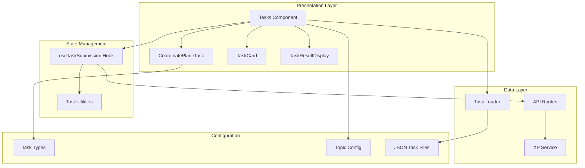

**Diagram sources**
- [Tasks.tsx](file://components/tasks/Tasks.tsx#L51-L373)
- [CoordinatePlaneTask.tsx](file://components/tasks/CoordinatePlaneTask.tsx#L14-L554)
- [useTaskSubmission.ts](file://components/tasks/hooks/useTaskSubmission.ts#L12-L165)

## Core Components

### Task Type Definitions

The system defines a comprehensive task type hierarchy that supports multiple exercise formats:

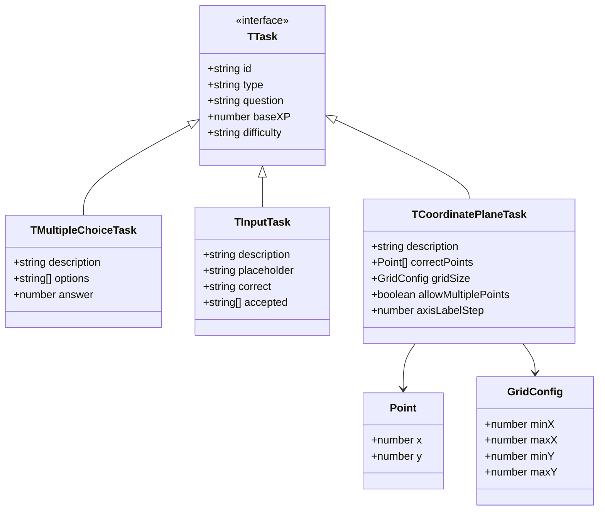

**Diagram sources**
- [task.ts](file://types/task.ts#L1-L38)

**Section sources**
- [task.ts](file://types/task.ts#L1-L38)

### Task Loading Infrastructure

The system uses a flexible file-based task loading mechanism:

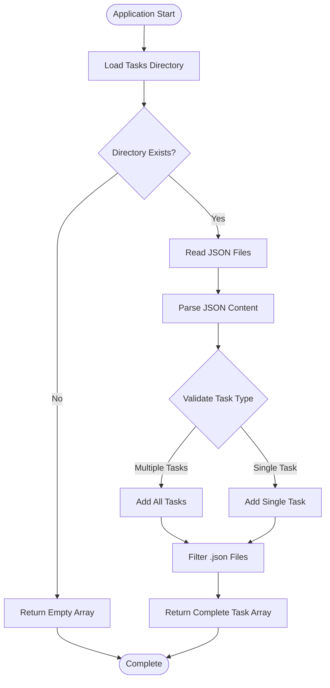

**Diagram sources**
- [loadTasks.ts](file://lib/loadTasks.ts#L5-L31)

**Section sources**
- [loadTasks.ts](file://lib/loadTasks.ts#L1-L31)

## Coordinate Plane Task Implementation

### Interactive Grid System with Drag-and-Drop

The Coordinate Plane Task component provides a sophisticated interactive grid interface with comprehensive drag-and-drop functionality:

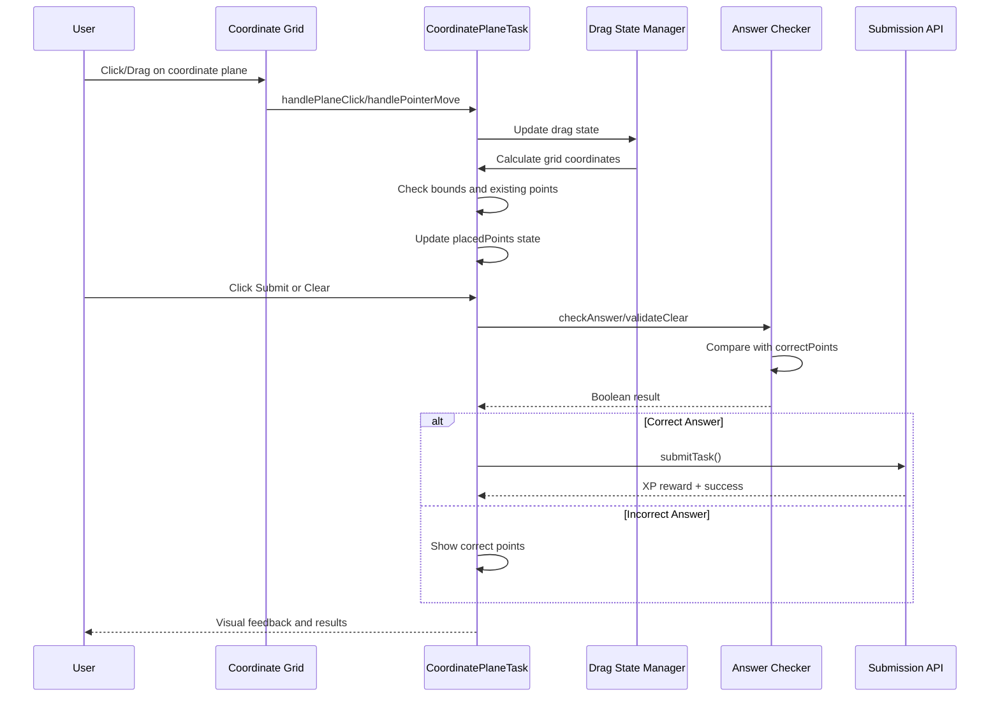

**Diagram sources**
- [CoordinatePlaneTask.tsx](file://components/tasks/CoordinatePlaneTask.tsx#L106-L246)
- [utils.ts](file://components/tasks/utils.ts#L121-L139)

### Enhanced Pointer Event Handling

The system implements sophisticated pointer event handling for optimal cross-device compatibility:

| Event Type | Handler | Functionality |
|------------|---------|---------------|
| `onPointerDown` | `handlePointPointerDown` | Initialize drag state and capture pointer |
| `onPointerMove` | `handlePointerMove` | Track drag movement with threshold detection |
| `onPointerUp` | `handlePointerUp` | Finalize drag operation and release pointer |
| `onClick` | `handlePlaneClick` | Handle click-to-place functionality |
| `onPointerLeave` | `handlePointerUp` | Handle drag cancellation when pointer leaves |

**Updated** Added comprehensive pointer event handling with drag state management and visual feedback mechanisms.

### Adaptive Cell Sizing and Responsive Design

The system dynamically calculates optimal cell sizes based on container dimensions and grid requirements:

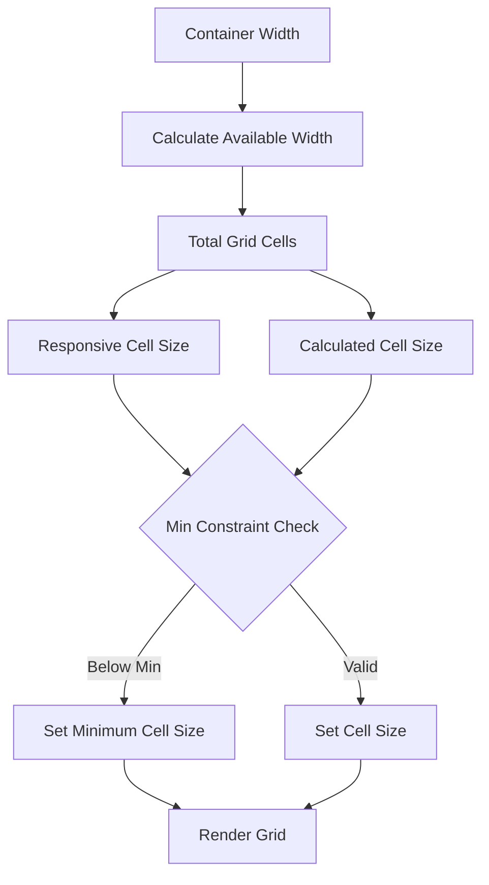

**Diagram sources**
- [CoordinatePlaneTask.tsx](file://components/tasks/CoordinatePlaneTask.tsx#L39-L82)

**Section sources**
- [CoordinatePlaneTask.tsx](file://components/tasks/CoordinatePlaneTask.tsx#L23-L82)

### Visual Feedback and Drag State Management

The coordinate plane implements sophisticated visual feedback for drag operations:

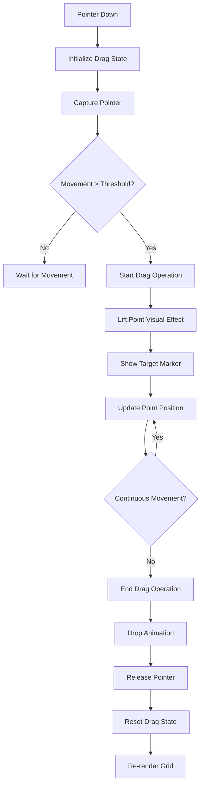

**Diagram sources**
- [CoordinatePlaneTask.tsx](file://components/tasks/CoordinatePlaneTask.tsx#L187-L246)

**Section sources**
- [CoordinatePlaneTask.tsx](file://components/tasks/CoordinatePlaneTask.tsx#L26-L246)

## Task Management System

### State Management Architecture

The task management system employs a sophisticated state management pattern:

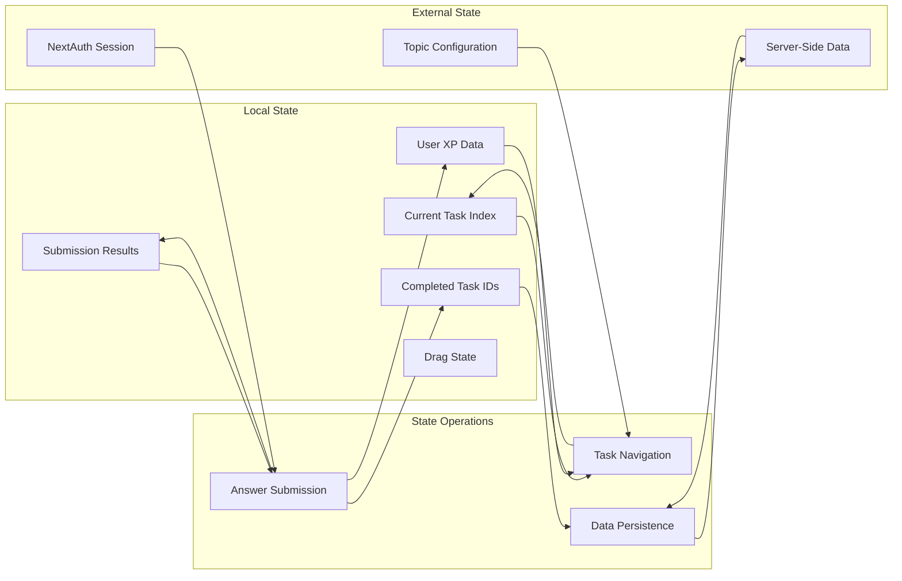

**Diagram sources**
- [Tasks.tsx](file://components/tasks/Tasks.tsx#L58-L133)
- [useTaskSubmission.ts](file://components/tasks/hooks/useTaskSubmission.ts#L18-L26)

### Task Submission Workflow

The submission process handles both authenticated and anonymous users with different workflows:

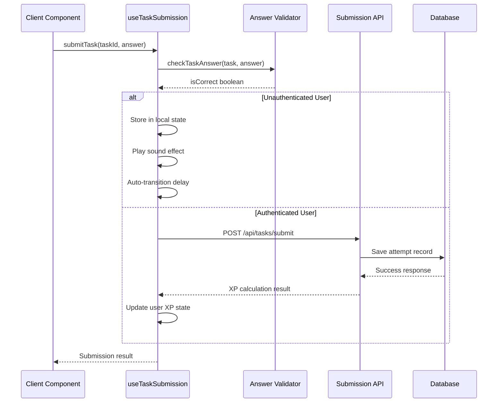

**Diagram sources**
- [useTaskSubmission.ts](file://components/tasks/hooks/useTaskSubmission.ts#L27-L142)
- [route.ts](file://app/api/tasks/submit/route.ts#L6-L71)

**Section sources**
- [Tasks.tsx](file://components/tasks/Tasks.tsx#L172-L218)
- [useTaskSubmission.ts](file://components/tasks/hooks/useTaskSubmission.ts#L12-L165)

## XP and Progress Tracking

### Spaced Repetition System (SRS)

The system implements a sophisticated spaced repetition algorithm that optimizes learning efficiency:

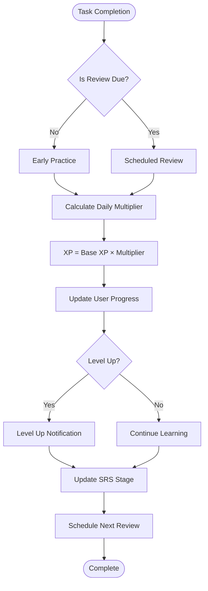

**Diagram sources**
- [xpService.ts](file://lib/xp/xpService.ts#L118-L303)

### XP Calculation Logic

The XP service implements a tiered multiplier system based on daily task completion:

| Task Order | Multiplier | Description |
|------------|------------|-------------|
| 1st-10th | 100% | Full XP reward |
| 11th-20th | 50% | Half XP reward |
| 21st+ | 10% | Reduced XP reward |

**Section sources**
- [xpService.ts](file://lib/xp/xpService.ts#L91-L106)
- [xp.ts](file://types/xp.ts#L84-L97)

## Data Flow and Processing

### Task Loading Pipeline

The system processes tasks through a multi-stage pipeline:

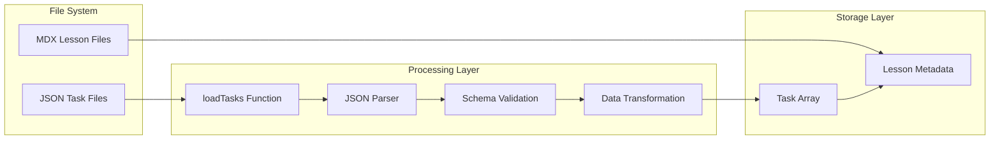

**Diagram sources**
- [loadTasks.ts](file://lib/loadTasks.ts#L5-L31)
- [page.tsx](file://app/(main)/geometry/[topic]/exercises/page.tsx#L16-L20)

### Real-time Feedback System

The system provides immediate feedback through multiple channels:

| Feedback Type | Trigger | Display Method |
|---------------|---------|----------------|
| Visual Indicators | Answer submission | Color-coded dots (green/red/blue) |
| Audio Feedback | Correct answers | Sound effects |
| Text Messages | All submissions | Success/error messages |
| Progress Tracking | Daily completion | XP bars and level indicators |
| Drag Feedback | Pointer events | Visual lift and target markers |

**Updated** Enhanced visual feedback system with drag state indicators and coordinate display during pointer interactions.

**Section sources**
- [CoordinatePlaneTask.tsx](file://components/tasks/CoordinatePlaneTask.tsx#L417-L450)
- [TaskResultDisplay.tsx](file://components/tasks/TaskResultDisplay.tsx#L7-L41)

## User Interface Components

### Task Card Container

The TaskCard component provides a consistent interface for all task types:

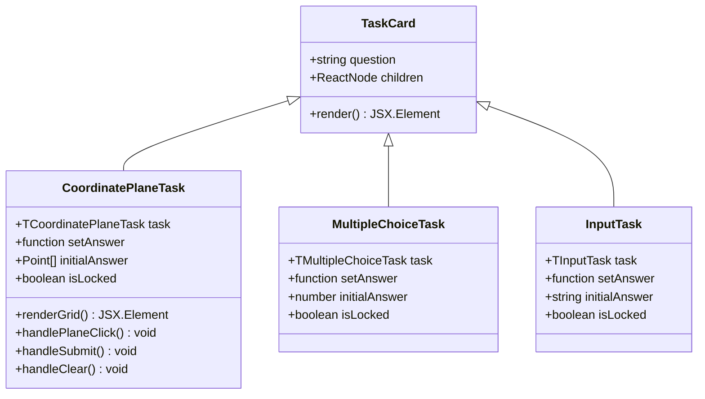

**Diagram sources**
- [TaskCard.tsx](file://components/tasks/TaskCard.tsx#L8-L18)
- [CoordinatePlaneTask.tsx](file://components/tasks/CoordinatePlaneTask.tsx#L14-L19)

### Enhanced Grid Layout and Visual Design

The coordinate plane adapts to different screen sizes and aspect ratios with sophisticated visual design:

| Screen Size | Max Width | Max Height | Cell Size | Visual Features |
|-------------|-----------|------------|-----------|-----------------|
| Mobile | 300px | 300px | 15px/unit | Simplified grid, basic feedback |
| Tablet | 400px | 400px | 20px/unit | Standard grid, enhanced feedback |
| Desktop | 600px | 600px | 30px/unit | Full grid, comprehensive feedback |
| Large Screens | 800px | 600px | 30px/unit | Optimized for wide displays |

**Updated** Enhanced responsive design with adaptive cell sizing and comprehensive visual feedback for drag operations.

**Section sources**
- [CoordinatePlaneTask.tsx](file://components/tasks/CoordinatePlaneTask.tsx#L39-L82)

## Configuration and Customization

### Task Configuration Options

Each coordinate plane task can be customized with specific parameters:

| Property | Type | Default | Purpose |
|----------|------|---------|---------|
| `id` | string | Required | Unique task identifier |
| `type` | 'coordinate-plane' | Required | Task type discriminator |
| `question` | string | Required | Instruction text |
| `correctPoints` | Array<Point> | Required | Target coordinates |
| `gridSize` | GridConfig | {-10,10,-10,10} | Grid boundaries |
| `allowMultiplePoints` | boolean | true | Multi-point capability |
| `axisLabelStep` | number | 1 | Label frequency |
| `difficulty` | string | 'easy' | Task difficulty level |
| `baseXP` | number | 1000 | Base XP reward |

**Section sources**
- [task.ts](file://types/task.ts#L24-L35)
- [001-coordinate.json](file://content/geometry/coordinate-plane-example/tasks/001-coordinate.json#L7-L18)

### Example Task Configurations

The system includes several example configurations demonstrating different use cases:

```mermaid
graph TB
subgraph "Easy Difficulty"
Easy1[Single Point: (-3,8)]
Easy2[Single Point: (5,-4)]
Easy3[Custom Grid: (-20,20)]
end
subgraph "Medium Difficulty"
Med1[Two Points: (-2,3), (4,-1)]
Med2[Triangle Vertices]
Med3[Large Grid: (-15,15)]
end
subgraph "Hard Difficulty"
Hard1[Square Vertices]
Hard2[Large Coordinates: (10,15)]
end
Easy1 --> Med1
Med1 --> Hard1
```

**Diagram sources**
- [001-coordinate.json](file://content/geometry/coordinate-plane-example/tasks/001-coordinate.json#L1-L99)

**Section sources**
- [001-coordinate.json](file://content/geometry/coordinate-plane-example/tasks/001-coordinate.json#L1-L99)

## Performance Considerations

### Optimization Strategies

The system implements several performance optimization techniques:

1. **Code Splitting**: Task components are lazily loaded to reduce initial bundle size
2. **State Memoization**: Complex calculations are memoized to avoid redundant computations
3. **Event Delegation**: Mouse and pointer events are efficiently handled to minimize re-renders
4. **CSS-in-JS**: Dynamic styles are optimized for minimal DOM manipulation
5. **Pointer Capture**: Efficient pointer tracking reduces event listener overhead
6. **Drag Threshold**: Prevents unnecessary state updates during minor movements

**Updated** Enhanced performance optimizations with drag state management and efficient pointer event handling.

### Memory Management

The system carefully manages memory usage through:

- Weak references for audio elements
- Cleanup functions for event listeners
- Efficient array operations for point tracking
- Proper disposal of SVG elements
- Drag state cleanup and pointer release

## Troubleshooting Guide

### Common Issues and Solutions

| Issue | Symptoms | Solution |
|-------|----------|----------|
| Grid not rendering | Blank screen or errors | Check grid dimensions and cell size calculations |
| Points not registering | Clicks have no effect | Verify mouse/pointer event handlers and coordinate conversion |
| Drag not working | Points don't move during drag | Check pointer capture and drag state management |
| Incorrect scoring | Wrong answers marked correct | Review answer validation logic and point comparison |
| XP not updating | No progress changes | Check API response handling and state updates |
| Performance lag | Slow interactions | Optimize SVG rendering and state updates |
| Touch scrolling interference | Grid scrolls during drag | Check touchAction property and event prevention |

**Updated** Added troubleshooting for drag-and-drop functionality and pointer event handling issues.

### Debugging Tools

The system includes built-in debugging capabilities:

- Console logging for major state transitions
- Error boundaries for graceful failure handling
- Network request monitoring for API calls
- Performance profiling for rendering optimization
- Drag state debugging for pointer event issues

**Section sources**
- [CoordinatePlaneTask.tsx](file://components/tasks/CoordinatePlaneTask.tsx#L41-L52)
- [useTaskSubmission.ts](file://components/tasks/hooks/useTaskSubmission.ts#L137-L141)

## Conclusion

The Coordinate Plane Task System represents a comprehensive solution for teaching coordinate geometry through interactive, gamified learning. Its modular architecture, sophisticated state management, and integrated XP system create an engaging educational experience that adapts to individual learning needs.

**Updated** The enhanced system now features comprehensive drag-and-drop functionality with sophisticated pointer event handling, responsive design improvements with adaptive cell sizing, and enhanced visual feedback mechanisms. These improvements significantly enhance the user experience while maintaining the system's educational effectiveness.

Key strengths of the system include its flexible configuration options, responsive design, immediate feedback mechanisms, and integration with spaced repetition learning principles. The system successfully balances educational effectiveness with user engagement through thoughtful interface design and reward systems.

Future enhancements could include additional task types, collaborative features, and advanced analytics for learning progression tracking. The solid architectural foundation provides a strong base for continued development and expansion of the educational platform's capabilities.

The comprehensive drag-and-drop functionality, enhanced visual feedback, and improved interaction model represent significant improvements that make the coordinate plane tasks more intuitive and engaging for learners across different devices and interaction modes.