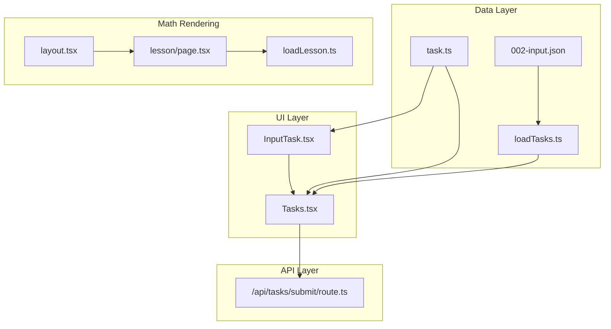
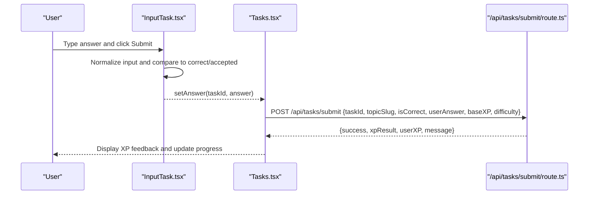
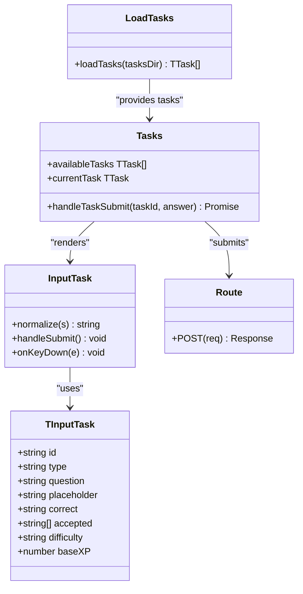

# Input-based Tasks

<cite>
**Referenced Files in This Document**
- [InputTask.tsx](file://components/tasks/InputTask.tsx)
- [Tasks.tsx](file://components/tasks/Tasks.tsx)
- [task.ts](file://types/task.ts)
- [002-input.json](file://content/math/addition_and_subtraction_of_fractions/tasks/002-input.json)
- [loadTasks.ts](file://lib/loadTasks.ts)
- [route.ts](file://app/api/tasks/submit/route.ts)
- [page.tsx](file://app/(main)/math/[topic]/lesson/page.tsx)
- [loadLesson.ts](file://lib/loadLesson.ts)
- [layout.tsx](file://app/layout.tsx)
</cite>

## Table of Contents
1. [Introduction](#introduction)
2. [Project Structure](#project-structure)
3. [Core Components](#core-components)
4. [Architecture Overview](#architecture-overview)
5. [Detailed Component Analysis](#detailed-component-analysis)
6. [Dependency Analysis](#dependency-analysis)
7. [Performance Considerations](#performance-considerations)
8. [Troubleshooting Guide](#troubleshooting-guide)
9. [Conclusion](#conclusion)
10. [Appendices](#appendices)

## Introduction
This document explains the input-based task component system used to present and evaluate free-response numerical and algebraic answers. It covers:
- Mathematical input handling and normalization
- Answer validation logic and acceptance lists
- Formatting requirements for numerical and algebraic responses
- Integration with the main task system and correctness checking
- User feedback mechanisms and accessibility considerations
- Error handling, input sanitization, and real-time validation feedback

## Project Structure
The input task system spans UI components, task data, and backend validation:
- UI components render questions, collect answers, and provide immediate feedback
- Task data is stored as JSON files and loaded at runtime
- Backend validates correct answers and awards XP

**Diagram sources**
- [InputTask.tsx](file://components/tasks/InputTask.tsx#L1-L97)
- [Tasks.tsx](file://components/tasks/Tasks.tsx#L1-L441)
- [task.ts](file://types/task.ts#L1-L25)
- [loadTasks.ts](file://lib/loadTasks.ts#L1-L31)
- [002-input.json](file://content/math/addition_and_subtraction_of_fractions/tasks/002-input.json#L1-L10)
- [route.ts](file://app/api/tasks/submit/route.ts#L1-L59)
- [page.tsx](file://app/(main)/math/[topic]/lesson/page.tsx#L1-L94)
- [loadLesson.ts](file://lib/loadLesson.ts#L1-L17)
- [layout.tsx](file://app/layout.tsx#L1-L45)

**Section sources**
- [InputTask.tsx](file://components/tasks/InputTask.tsx#L1-L97)
- [Tasks.tsx](file://components/tasks/Tasks.tsx#L1-L441)
- [task.ts](file://types/task.ts#L1-L25)
- [loadTasks.ts](file://lib/loadTasks.ts#L1-L31)
- [002-input.json](file://content/math/addition_and_subtraction_of_fractions/tasks/002-input.json#L1-L10)
- [route.ts](file://app/api/tasks/submit/route.ts#L1-L59)
- [page.tsx](file://app/(main)/math/[topic]/lesson/page.tsx#L1-L94)
- [loadLesson.ts](file://lib/loadLesson.ts#L1-L17)
- [layout.tsx](file://app/layout.tsx#L1-L45)

## Core Components
- InputTask: Renders a single input task, normalizes user input, compares against correct and accepted answers, and provides visual feedback.
- Tasks: Orchestrates task navigation, collects answers, submits to the backend, and displays XP and review progress.
- Types: Defines the shape of input tasks and shared task union.
- Task data: JSON files define questions, placeholders, correct answers, and accepted variants.
- API: Validates correct answers server-side and returns XP results.

Key responsibilities:
- Normalize whitespace and case for comparison
- Accept either the canonical correct answer or any item in the accepted list
- Provide immediate visual feedback and optional hints after submission
- Integrate with XP service and topic configuration

**Section sources**
- [InputTask.tsx](file://components/tasks/InputTask.tsx#L11-L38)
- [Tasks.tsx](file://components/tasks/Tasks.tsx#L64-L122)
- [task.ts](file://types/task.ts#L12-L22)
- [002-input.json](file://content/math/addition_and_subtraction_of_fractions/tasks/002-input.json#L1-L10)

## Architecture Overview
End-to-end flow for input tasks:
1. Tasks loads task JSON files via loadTasks and renders InputTask
2. User submits an answer; InputTask computes correctness locally
3. Tasks forwards the answer to the backend for XP validation
4. Backend validates correctness and returns XP result and user XP snapshot
5. Tasks updates UI with XP feedback and moves to the next task

**Diagram sources**
- [InputTask.tsx](file://components/tasks/InputTask.tsx#L24-L34)
- [Tasks.tsx](file://components/tasks/Tasks.tsx#L64-L122)
- [route.ts](file://app/api/tasks/submit/route.ts#L6-L58)

## Detailed Component Analysis

### InputTask Component
Responsibilities:
- Render question and input field
- Normalize user input (trim, remove spaces, lowercase)
- Compare normalized input against correct answer and accepted list
- Disable input after submission and show green/red feedback
- Provide a Clear button to reset the input

Validation logic highlights:
- Normalization ensures whitespace and case differences do not invalidate answers
- Submission sets a flag to prevent repeated submissions and disables input
- Feedback shows “Correct” or “Incorrect” and lists accepted answers when wrong

Accessibility considerations:
- Input field is focusable and supports Enter key submission
- Visual feedback uses color contrast (green for correct, red for incorrect)
- Placeholder text communicates expected format

Formatting requirements:
- Numerical fractions: "a/b" format as shown in the example
- Algebraic expressions: Keep expressions in a simplified, standard form consistent with correct/accepted entries

Real-time validation:
- Immediate feedback after submission; no intermediate live checks

**Section sources**
- [InputTask.tsx](file://components/tasks/InputTask.tsx#L11-L96)
- [002-input.json](file://content/math/addition_and_subtraction_of_fractions/tasks/002-input.json#L5-L9)

### Tasks Component
Responsibilities:
- Manage current task index, collected answers, submission results, and XP state
- Filter out completed tasks and navigate between available tasks
- Submit answers to the backend and play sound cues on correct/incorrect outcomes
- Display XP progress, hot-topic indicators, and daily energy bars

Correctness checking:
- For input tasks, correctness is determined by comparing the submitted answer to the task’s correct answer
- For multiple-choice tasks, correctness is determined by matching the selected option index

User feedback:
- Shows XP result details (multiplier, daily task index, next review date)
- Provides navigation buttons to move between tasks

Integration with XP:
- Fetches user XP and topic configuration on session change
- Updates XP and completion status after successful submissions

**Section sources**
- [Tasks.tsx](file://components/tasks/Tasks.tsx#L12-L122)
- [Tasks.tsx](file://components/tasks/Tasks.tsx#L125-L200)

### Task Data Model and Loading
Data model:
- TInputTask defines required fields: id, type, question, placeholder, correct, accepted, difficulty, baseXP
- Tasks are loaded from JSON files and parsed into a unified array

Loading mechanism:
- loadTasks reads all .json files from a directory, parses JSON, and accumulates tasks
- Errors during parsing are caught and logged

Example task:
- Demonstrates fraction arithmetic with multiple acceptable forms

**Section sources**
- [task.ts](file://types/task.ts#L12-L22)
- [loadTasks.ts](file://lib/loadTasks.ts#L5-L30)
- [002-input.json](file://content/math/addition_and_subtraction_of_fractions/tasks/002-input.json#L1-L10)

### Backend Validation and XP Integration
Validation:
- The backend expects a correct answer; if isCorrect is false, it returns an error-like response
- Only correct submissions trigger XP computation

Response:
- Returns success, XP result, user XP snapshot, and a localized message

**Section sources**
- [route.ts](file://app/api/tasks/submit/route.ts#L6-L58)

### Mathematical Notation Support
Math rendering:
- Lesson pages support LaTeX via remark-math and rehype-katex when the frontmatter flag is enabled
- KaTeX CSS is included globally for consistent rendering

This enables rich mathematical content in lessons, complementing input tasks that may involve fractions, algebraic expressions, or numeric results.

**Section sources**
- [page.tsx](file://app/(main)/math/[topic]/lesson/page.tsx#L40-L46)
- [page.tsx](file://app/(main)/math/[topic]/lesson/page.tsx#L70-L80)
- [layout.tsx](file://app/layout.tsx#L4-L4)

## Dependency Analysis
Component and module relationships:
- InputTask depends on TInputTask type and React state hooks
- Tasks composes InputTask and MultipleChoiceTask, manages session and XP state, and integrates with the backend
- Task data loading is decoupled from UI via loadTasks
- Backend route depends on XPService and auth guards

**Diagram sources**
- [task.ts](file://types/task.ts#L12-L22)
- [InputTask.tsx](file://components/tasks/InputTask.tsx#L11-L38)
- [Tasks.tsx](file://components/tasks/Tasks.tsx#L12-L122)
- [loadTasks.ts](file://lib/loadTasks.ts#L5-L30)
- [route.ts](file://app/api/tasks/submit/route.ts#L6-L58)

**Section sources**
- [task.ts](file://types/task.ts#L12-L22)
- [InputTask.tsx](file://components/tasks/InputTask.tsx#L11-L38)
- [Tasks.tsx](file://components/tasks/Tasks.tsx#L12-L122)
- [loadTasks.ts](file://lib/loadTasks.ts#L5-L30)
- [route.ts](file://app/api/tasks/submit/route.ts#L6-L58)

## Performance Considerations
- Input normalization is O(n) per comparison; acceptable for typical short answers
- Avoid heavy client-side computations in InputTask; keep validation simple and fast
- Debouncing or real-time validation could be added later if needed, but current design favors simplicity and immediate feedback
- Backend validation ensures correctness even if client-side logic is bypassed

## Troubleshooting Guide
Common issues and resolutions:
- No feedback after submission
  - Ensure the submit button is clicked and not disabled; check that the component is not in a submitted state
  - Verify that the backend receives a correct answer and returns success
- Incorrect answers marked as correct
  - Confirm that the correct answer in the JSON matches the intended solution
  - Ensure accepted list includes equivalent forms (e.g., reduced fractions)
- Input not recognized due to formatting
  - Remove extra spaces and confirm the expected format (e.g., "a/b")
  - Check that normalization does not inadvertently alter intended syntax
- Backend rejects submission
  - Verify that the request includes required fields and that the user is authenticated
  - Confirm that isCorrect is true for the submitted answer

Sanitization and validation patterns:
- Client-side: trim, remove spaces, lowercase comparisons
- Server-side: strict correctness check; only correct answers advance XP

Accessibility tips:
- Screen readers: rely on visual cues (colors) and text feedback; ensure placeholder text clearly indicates expected format
- Keyboard navigation: Enter key triggers submission; buttons remain accessible

**Section sources**
- [InputTask.tsx](file://components/tasks/InputTask.tsx#L24-L34)
- [Tasks.tsx](file://components/tasks/Tasks.tsx#L64-L122)
- [route.ts](file://app/api/tasks/submit/route.ts#L20-L32)

## Conclusion
The input-based task system provides a straightforward, accessible way to accept numerical and algebraic answers. Its design emphasizes simplicity, immediate feedback, and seamless integration with XP tracking. By combining client-side normalization with server-side validation, it balances usability with correctness while supporting rich mathematical content in lessons.

## Appendices

### Example Task JSON Fields
- id: Unique identifier
- type: "input"
- question: Prompt for the user
- placeholder: Guidance on expected format
- correct: Canonical correct answer
- accepted: Alternative acceptable answers
- difficulty: Optional difficulty level
- baseXP: Optional XP value for the task

**Section sources**
- [002-input.json](file://content/math/addition_and_subtraction_of_fractions/tasks/002-input.json#L1-L10)
- [task.ts](file://types/task.ts#L12-L22)