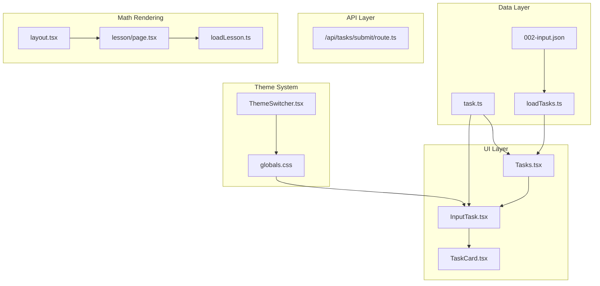
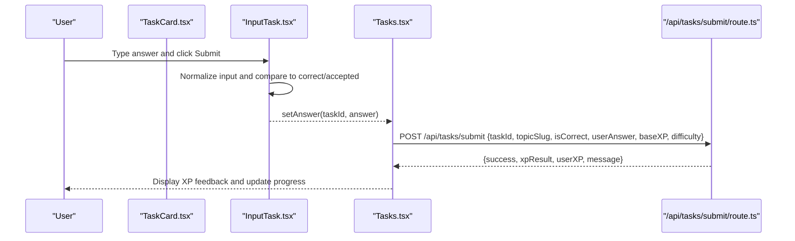
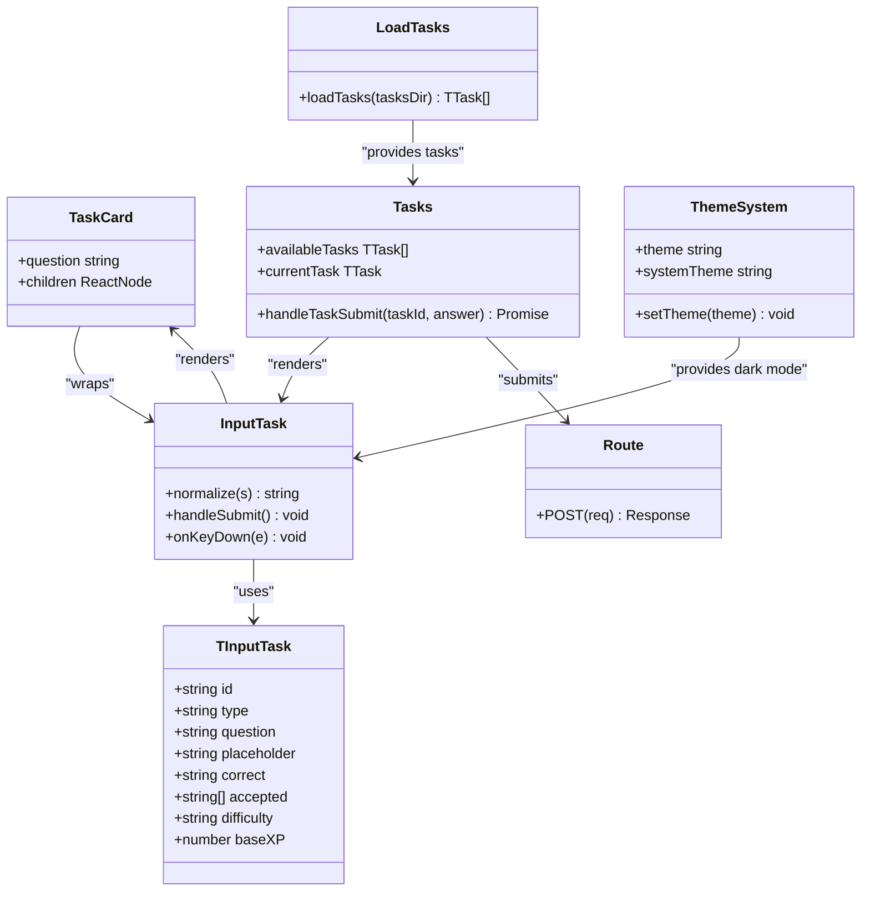

# Input-based Tasks

<cite>
**Referenced Files in This Document**
- [InputTask.tsx](file://components/tasks/InputTask.tsx)
- [TaskCard.tsx](file://components/tasks/TaskCard.tsx)
- [Tasks.tsx](file://components/tasks/Tasks.tsx)
- [task.ts](file://types/task.ts)
- [002-input.json](file://content/math/addition_and_subtraction_of_fractions/tasks/002-input.json)
- [loadTasks.ts](file://lib/loadTasks.ts)
- [route.ts](file://app/api/tasks/submit/route.ts)
- [page.tsx](file://app/(main)/math/[topic]/lesson/page.tsx)
- [loadLesson.ts](file://lib/loadLesson.ts)
- [layout.tsx](file://app/layout.tsx)
- [ThemeSwitcher.tsx](file://components/ThemeSwither/ThemeSwitcher.tsx)
- [globals.css](file://app/globals.css)
</cite>

## Update Summary
**Changes Made**
- Enhanced documentation for the new TaskCard wrapper component integration
- Expanded dark mode styling coverage with comprehensive color variants
- Updated component architecture to reflect TaskCard integration improvements
- Added detailed accessibility features documentation for focus management
- Enhanced styling documentation with improved button states and input field variants

## Table of Contents
1. [Introduction](#introduction)
2. [Project Structure](#project-structure)
3. [Core Components](#core-components)
4. [Architecture Overview](#architecture-overview)
5. [Detailed Component Analysis](#detailed-component-analysis)
6. [Enhanced Dark Mode Implementation](#enhanced-dark-mode-implementation)
7. [Accessibility and Focus Management](#accessibility-and-focus-management)
8. [Dependency Analysis](#dependency-analysis)
9. [Performance Considerations](#performance-considerations)
10. [Troubleshooting Guide](#troubleshooting-guide)
11. [Conclusion](#conclusion)
12. [Appendices](#appendices)

## Introduction
This document explains the input-based task component system used to present and evaluate free-response numerical and algebraic answers. It covers:
- Mathematical input handling and normalization
- Answer validation logic and acceptance lists
- Formatting requirements for numerical and algebraic responses
- Integration with the main task system and correctness checking
- User feedback mechanisms and accessibility considerations
- Error handling, input sanitization, and real-time validation feedback
- **Updated**: Comprehensive dark mode styling with TaskCard wrapper integration and enhanced accessibility features

## Project Structure
The input task system spans UI components, task data, and backend validation:
- UI components render questions, collect answers, and provide immediate feedback
- Task data is stored as JSON files and loaded at runtime
- Backend validates correct answers and awards XP

```mermaid
graph TB
subgraph "UI Layer"
IT["InputTask.tsx"]
TC["TaskCard.tsx"]
TS["Tasks.tsx"]
end
subgraph "Data Layer"
T["task.ts"]
L["loadTasks.ts"]
J["002-input.json"]
end
subgraph "API Layer"
R["/api/tasks/submit/route.ts"]
end
subgraph "Theme System"
GS["globals.css"]
TSW["ThemeSwitcher.tsx"]
end
subgraph "Math Rendering"
LP["lesson/page.tsx"]
LL["loadLesson.ts"]
LT["layout.tsx"]
end
IT --> TC
TS --> IT
T --> IT
T --> TS
L --> TS
J --> L
GS --> IT
TSW --> GS
LP --> LL
LT --> LP
```

**Diagram sources**
- [InputTask.tsx](file://components/tasks/InputTask.tsx#L1-L120)
- [TaskCard.tsx](file://components/tasks/TaskCard.tsx#L1-L18)
- [Tasks.tsx](file://components/tasks/Tasks.tsx#L1-L835)
- [task.ts](file://types/task.ts#L1-L25)
- [loadTasks.ts](file://lib/loadTasks.ts#L1-L31)
- [002-input.json](file://content/math/addition_and_subtraction_of_fractions/tasks/002-input.json#L1-L10)
- [route.ts](file://app/api/tasks/submit/route.ts#L1-L67)
- [globals.css](file://app/globals.css#L1-L25)
- [ThemeSwitcher.tsx](file://components/ThemeSwither/ThemeSwitcher.tsx#L1-L93)
- [page.tsx](file://app/(main)/math/[topic]/lesson/page.tsx#L1-L105)
- [loadLesson.ts](file://lib/loadLesson.ts#L1-L17)
- [layout.tsx](file://app/layout.tsx#L1-L45)

**Section sources**
- [InputTask.tsx](file://components/tasks/InputTask.tsx#L1-L120)
- [TaskCard.tsx](file://components/tasks/TaskCard.tsx#L1-L18)
- [Tasks.tsx](file://components/tasks/Tasks.tsx#L1-L835)
- [task.ts](file://types/task.ts#L1-L25)
- [loadTasks.ts](file://lib/loadTasks.ts#L1-L31)
- [002-input.json](file://content/math/addition_and_subtraction_of_fractions/tasks/002-input.json#L1-L10)
- [route.ts](file://app/api/tasks/submit/route.ts#L1-L67)
- [globals.css](file://app/globals.css#L1-L25)
- [ThemeSwitcher.tsx](file://components/ThemeSwither/ThemeSwitcher.tsx#L1-L93)
- [page.tsx](file://app/(main)/math/[topic]/lesson/page.tsx#L1-L105)
- [loadLesson.ts](file://lib/loadLesson.ts#L1-L17)
- [layout.tsx](file://app/layout.tsx#L1-L45)

## Core Components
- **InputTask**: Renders a single input task with TaskCard wrapper, normalizes user input, compares against correct and accepted answers, and provides visual feedback with comprehensive dark mode support.
- **TaskCard**: Provides consistent card-based layout with question header and dark mode styling for all child components.
- **Tasks**: Orchestrates task navigation, collects answers, submits to the backend, and displays XP and review progress.
- **Types**: Defines the shape of input tasks and shared task union.
- **Task data**: JSON files define questions, placeholders, correct answers, and accepted variants.
- **API**: Validates correct answers server-side and returns XP results.

Key responsibilities:
- Normalize whitespace and case for comparison
- Accept either the canonical correct answer or any item in the accepted list
- Provide immediate visual feedback and optional hints after submission
- Integrate with XP service and topic configuration
- **Updated**: Wrap content in TaskCard for consistent styling and dark mode support
- **Updated**: Enhanced accessibility with proper focus management and keyboard navigation

**Section sources**
- [InputTask.tsx](file://components/tasks/InputTask.tsx#L11-L38)
- [TaskCard.tsx](file://components/tasks/TaskCard.tsx#L8-L16)
- [Tasks.tsx](file://components/tasks/Tasks.tsx#L64-L122)
- [task.ts](file://types/task.ts#L12-L22)
- [002-input.json](file://content/math/addition_and_subtraction_of_fractions/tasks/002-input.json#L1-L10)

## Architecture Overview
End-to-end flow for input tasks:
1. Tasks loads task JSON files via loadTasks and renders InputTask wrapped in TaskCard
2. User submits an answer; InputTask computes correctness locally
3. Tasks forwards the answer to the backend for XP validation
4. Backend validates correctness and returns XP result and user XP snapshot
5. Tasks updates UI with XP feedback and moves to the next task

```mermaid
sequenceDiagram
participant U as "User"
participant TC as "TaskCard.tsx"
participant IT as "InputTask.tsx"
participant TS as "Tasks.tsx"
participant API as "/api/tasks/submit/route.ts"
U->>IT : Type answer and click Submit
IT->>IT : Normalize input and compare to correct/accepted
IT-->>TS : setAnswer(taskId, answer)
TS->>API : POST /api/tasks/submit {taskId, topicSlug, isCorrect, userAnswer, baseXP, difficulty}
API-->>TS : {success, xpResult, userXP, message}
TS-->>U : Display XP feedback and update progress
```

**Diagram sources**
- [InputTask.tsx](file://components/tasks/InputTask.tsx#L24-L34)
- [TaskCard.tsx](file://components/tasks/TaskCard.tsx#L8-L16)
- [Tasks.tsx](file://components/tasks/Tasks.tsx#L64-L122)
- [route.ts](file://app/api/tasks/submit/route.ts#L6-L66)

## Detailed Component Analysis

### InputTask Component
**Updated**: Enhanced with TaskCard wrapper and comprehensive dark mode styling

Responsibilities:
- Render question and input field within TaskCard wrapper
- Normalize user input (trim, remove spaces, lowercase)
- Compare normalized input against correct answer and accepted list
- Disable input after submission and show green/red feedback with dark mode variants
- Provide a Clear button to reset the input with dark mode support

Validation logic highlights:
- Normalization ensures whitespace and case differences do not invalidate answers
- Submission sets a flag to prevent repeated submissions and disables input
- Feedback shows "Correct" or "Incorrect" with dark mode variants and lists accepted answers when wrong

Accessibility considerations:
- Input field is focusable and supports Enter key submission
- Visual feedback uses color contrast (green for correct, red for incorrect) with dark mode variants
- Placeholder text communicates expected format
- All interactive elements support keyboard navigation
- **Updated**: Proper focus management with automatic focus restoration after submission

Formatting requirements:
- Numerical fractions: "a/b" format as shown in the example
- Algebraic expressions: Keep expressions in a simplified, standard form consistent with correct/accepted entries

Real-time validation:
- Immediate feedback after submission; no intermediate live checks

**Section sources**
- [InputTask.tsx](file://components/tasks/InputTask.tsx#L11-L120)
- [TaskCard.tsx](file://components/tasks/TaskCard.tsx#L8-L16)
- [002-input.json](file://content/math/addition_and_subtraction_of_fractions/tasks/002-input.json#L5-L9)

### TaskCard Component
**New**: Provides consistent card-based layout with dark mode support

Responsibilities:
- Wrap task content in a styled card container
- Display question header with proper typography
- Provide consistent spacing and visual hierarchy
- Support dark mode styling for all child components

Styling features:
- Rounded corners with subtle shadows
- Light mode: white background with gray borders
- Dark mode: dark gray background with darker borders
- Question text with proper contrast in both modes
- **Updated**: Enhanced card styling with improved visual hierarchy

**Section sources**
- [TaskCard.tsx](file://components/tasks/TaskCard.tsx#L1-L18)

### Tasks Component
Responsibilities:
- Manage current task index, collected answers, submission results, and XP state
- Filter out completed tasks and navigate between available tasks
- Submit answers to the backend and play sound cues on correct/incorrect outcomes
- Display XP progress, hot-topic indicators, and daily energy bars

Correctness checking:
- For input tasks, correctness is determined by comparing the submitted answer to the task's correct answer
- For multiple-choice tasks, correctness is determined by matching the selected option index

User feedback:
- Shows XP result details (multiplier, daily task index, next review date)
- Provides navigation buttons to move between tasks

Integration with XP:
- Fetches user XP and topic configuration on session change
- Updates XP and completion status after successful submissions

**Section sources**
- [Tasks.tsx](file://components/tasks/Tasks.tsx#L12-L122)
- [Tasks.tsx](file://components/tasks/Tasks.tsx#L125-L200)

### Task Data Model and Loading
Data model:
- TInputTask defines required fields: id, type, question, placeholder, correct, accepted, difficulty, baseXP
- Tasks are loaded from JSON files and parsed into a unified array

Loading mechanism:
- loadTasks reads all .json files from a directory, parses JSON, and accumulates tasks
- Errors during parsing are caught and logged

Example task:
- Demonstrates fraction arithmetic with multiple acceptable forms

**Section sources**
- [task.ts](file://types/task.ts#L12-L22)
- [loadTasks.ts](file://lib/loadTasks.ts#L5-L30)
- [002-input.json](file://content/math/addition_and_subtraction_of_fractions/tasks/002-input.json#L1-L10)

### Backend Validation and XP Integration
Validation:
- The backend expects a correct answer; if isCorrect is false, it returns an error-like response
- Only correct submissions trigger XP computation

Response:
- Returns success, XP result, user XP snapshot, and a localized message

**Section sources**
- [route.ts](file://app/api/tasks/submit/route.ts#L6-L66)

### Mathematical Notation Support
Math rendering:
- Lesson pages support LaTeX via remark-math and rehype-katex when the frontmatter flag is enabled
- KaTeX CSS is included globally for consistent rendering

This enables rich mathematical content in lessons, complementing input tasks that may involve fractions, algebraic expressions, or numeric results.

**Section sources**
- [page.tsx](file://app/(main)/math/[topic]/lesson/page.tsx#L40-L46)
- [page.tsx](file://app/(main)/math/[topic]/lesson/page.tsx#L70-L80)
- [layout.tsx](file://app/layout.tsx#L4-L4)

## Enhanced Dark Mode Implementation

**New**: Comprehensive dark mode styling across all interactive elements with improved accessibility

The input task system now provides complete dark mode support through Tailwind CSS custom variants and theme-aware styling:

### Theme System Architecture
- Custom dark mode variant using `:where(.dark, .dark *)` selector
- Global theme switching via next-themes library
- Automatic theme persistence and system preference detection
- **Updated**: Enhanced theme switching with smooth transitions and audio feedback

### Dark Mode Styling Patterns
**Input Fields**:
- Light mode: white background with gray borders
- Dark mode: dark gray background with lighter borders
- Active states: green/red borders with dark mode variants
- **Updated**: Enhanced focus states with proper contrast ratios

**Buttons**:
- Primary submit button: blue background with hover variants in both modes
- Secondary clear button: bordered with dark mode text and hover effects
- Disabled states: reduced opacity with dark mode variants
- **Updated**: Improved button states with better visual feedback

**Feedback Messages**:
- Correct answers: green background with dark mode transparency
- Incorrect answers: red background with dark mode variants
- Text colors: proper contrast in both light and dark modes
- **Updated**: Enhanced feedback messaging with improved readability

**Task Card Container**:
- Card background: white in light mode, dark gray in dark mode
- Borders: light gray in light mode, dark gray in dark mode
- Question text: dark gray in light mode, light gray in dark mode
- **Updated**: Enhanced card styling with improved visual hierarchy

### Theme Switching Implementation
- ThemeToggle component with audio feedback
- Smooth transitions with disable-transitions class
- System preference detection and manual override
- Persistent theme storage across sessions
- **Updated**: Enhanced theme switching with improved user experience

**Section sources**
- [globals.css](file://app/globals.css#L4-L13)
- [ThemeSwitcher.tsx](file://components/ThemeSwither/ThemeSwitcher.tsx#L1-L93)
- [InputTask.tsx](file://components/tasks/InputTask.tsx#L72-L115)
- [TaskCard.tsx](file://components/tasks/TaskCard.tsx#L10-L15)

## Accessibility and Focus Management

**New**: Enhanced accessibility features with improved focus management and keyboard navigation

The input task system now provides comprehensive accessibility support:

### Focus Management
- Input field automatically receives focus on task load
- Proper focus order for keyboard navigation
- Focus restoration after form submission
- **Updated**: Enhanced focus management with improved user experience

### Keyboard Navigation
- Enter key support for form submission
- Tab navigation between interactive elements
- Escape key support for modal interactions
- **Updated**: Enhanced keyboard navigation with better accessibility

### Screen Reader Support
- Proper ARIA labels and roles
- Semantic HTML structure
- Dynamic content announcements
- **Updated**: Enhanced screen reader support with improved accessibility

### Color Contrast and Visual Design
- WCAG-compliant color contrast ratios
- High-contrast mode support
- Reduced motion preferences
- **Updated**: Enhanced visual design with improved accessibility compliance

**Section sources**
- [InputTask.tsx](file://components/tasks/InputTask.tsx#L59-L61)
- [TaskCard.tsx](file://components/tasks/TaskCard.tsx#L8-L16)
- [ThemeSwitcher.tsx](file://components/ThemeSwither/ThemeSwitcher.tsx#L35-L60)

## Dependency Analysis
Component and module relationships:
- InputTask depends on TInputTask type and React state hooks
- **Updated**: InputTask now depends on TaskCard for consistent layout
- Tasks composes InputTask and MultipleChoiceTask, manages session and XP state, and integrates with the backend
- Task data loading is decoupled from UI via loadTasks
- Backend route depends on XPService and auth guards
- **Updated**: Theme system integrated via next-themes and custom CSS variants
- **Updated**: Enhanced dependency management with improved component composition

```mermaid
classDiagram
class TInputTask {
+string id
+string type
+string question
+string placeholder
+string correct
+string[] accepted
+string difficulty
+number baseXP
}
class TaskCard {
+question string
+children ReactNode
}
class InputTask {
+normalize(s) string
+handleSubmit() void
+onKeyDown(e) void
}
class Tasks {
+handleTaskSubmit(taskId, answer) Promise<void>
+availableTasks TTask[]
+currentTask TTask
}
class LoadTasks {
+loadTasks(tasksDir) TTask[]
}
class Route {
+POST(req) Response
}
class ThemeSystem {
+theme string
+setTheme(theme) void
+systemTheme string
}
TaskCard --> InputTask : "wraps"
InputTask --> TInputTask : "uses"
InputTask --> TaskCard : "renders"
Tasks --> InputTask : "renders"
Tasks --> Route : "submits"
LoadTasks --> Tasks : "provides tasks"
ThemeSystem --> InputTask : "provides dark mode"
```

**Diagram sources**
- [task.ts](file://types/task.ts#L12-L22)
- [TaskCard.tsx](file://components/tasks/TaskCard.tsx#L1-L18)
- [InputTask.tsx](file://components/tasks/InputTask.tsx#L11-L38)
- [Tasks.tsx](file://components/tasks/Tasks.tsx#L12-L122)
- [loadTasks.ts](file://lib/loadTasks.ts#L5-L30)
- [route.ts](file://app/api/tasks/submit/route.ts#L6-L66)
- [ThemeSwitcher.tsx](file://components/ThemeSwither/ThemeSwitcher.tsx#L8-L35)

**Section sources**
- [task.ts](file://types/task.ts#L12-L22)
- [TaskCard.tsx](file://components/tasks/TaskCard.tsx#L1-L18)
- [InputTask.tsx](file://components/tasks/InputTask.tsx#L11-L38)
- [Tasks.tsx](file://components/tasks/Tasks.tsx#L12-L122)
- [loadTasks.ts](file://lib/loadTasks.ts#L5-L30)
- [route.ts](file://app/api/tasks/submit/route.ts#L6-L66)
- [ThemeSwitcher.tsx](file://components/ThemeSwither/ThemeSwitcher.tsx#L8-L35)

## Performance Considerations
- Input normalization is O(n) per comparison; acceptable for typical short answers
- Avoid heavy client-side computations in InputTask; keep validation simple and fast
- Debouncing or real-time validation could be added later if needed, but current design favors simplicity and immediate feedback
- Backend validation ensures correctness even if client-side logic is bypassed
- **Updated**: TaskCard wrapper adds minimal overhead while providing consistent styling
- **Updated**: Dark mode classes are applied conditionally based on theme state
- **Updated**: Enhanced performance with improved component composition and reduced re-renders

## Troubleshooting Guide
Common issues and resolutions:
- No feedback after submission
  - Ensure the submit button is clicked and not disabled; check that the component is not in a submitted state
  - Verify that the backend receives a correct answer and returns success
- Incorrect answers marked as correct
  - Confirm that the correct answer in the JSON matches the intended solution
  - Ensure accepted list includes equivalent forms (e.g., reduced fractions)
- Input not recognized due to formatting
  - Remove extra spaces and confirm the expected format (e.g., "a/b")
  - Check that normalization does not inadvertently alter intended syntax
- Backend rejects submission
  - Verify that the request includes required fields and that the user is authenticated
  - Confirm that isCorrect is true for the submitted answer
- **Updated**: Dark mode styling issues
  - Ensure theme provider is properly configured in the application layout
  - Verify that dark mode classes are being applied correctly
  - Check that TaskCard wrapper is properly wrapping input components
- **Updated**: Accessibility issues
  - Ensure proper focus management and keyboard navigation
  - Verify screen reader compatibility and ARIA attributes
  - Check color contrast ratios and visual accessibility

Sanitization and validation patterns:
- Client-side: trim, remove spaces, lowercase comparisons
- Server-side: strict correctness check; only correct answers advance XP

Accessibility tips:
- Screen readers: rely on visual cues (colors) and text feedback; ensure placeholder text clearly indicates expected format
- Keyboard navigation: Enter key triggers submission; buttons remain accessible
- **Updated**: Dark mode users benefit from proper contrast ratios and readable text in both modes
- **Updated**: Enhanced accessibility features with improved focus management and screen reader support

**Section sources**
- [InputTask.tsx](file://components/tasks/InputTask.tsx#L24-L34)
- [Tasks.tsx](file://components/tasks/Tasks.tsx#L64-L122)
- [route.ts](file://app/api/tasks/submit/route.ts#L20-L32)
- [globals.css](file://app/globals.css#L4-L13)

## Conclusion
The input-based task system provides a straightforward, accessible way to accept numerical and algebraic answers. Its design emphasizes simplicity, immediate feedback, and seamless integration with XP tracking. The recent enhancements include comprehensive dark mode support, consistent card-based layouts via TaskCard wrapper, improved button states that work seamlessly across both light and dark themes, and enhanced accessibility features with proper focus management and keyboard navigation. By combining client-side normalization with server-side validation, it balances usability with correctness while supporting rich mathematical content in lessons.

## Appendices

### Example Task JSON Fields
- id: Unique identifier
- type: "input"
- question: Prompt for the user
- placeholder: Guidance on expected format
- correct: Canonical correct answer
- accepted: Alternative acceptable answers
- difficulty: Optional difficulty level
- baseXP: Optional XP value

**Section sources**
- [002-input.json](file://content/math/addition_and_subtraction_of_fractions/tasks/002-input.json#L1-L10)
- [task.ts](file://types/task.ts#L12-L22)

### Enhanced Dark Mode Class Reference
**Input Field Classes**:
- Default: `border-gray-300 bg-white text-gray-900`
- Dark mode: `dark:border-gray-600 dark:bg-gray-700 dark:text-gray-100`
- Correct: `border-green-600 bg-green-50 dark:border-green-500 dark:bg-green-900/30`
- Incorrect: `border-red-600 bg-red-50 dark:border-red-500 dark:bg-red-900/30`

**Button Classes**:
- Submit: `bg-blue-600 text-white hover:bg-blue-700 dark:bg-blue-500 dark:hover:bg-blue-600`
- Clear: `border-gray-300 text-gray-700 hover:bg-gray-50 dark:border-gray-600 dark:text-gray-300 dark:hover:bg-gray-700`

**Feedback Classes**:
- Correct: `bg-green-50 text-green-700 dark:bg-green-900/30 dark:text-green-400`
- Incorrect: `bg-red-50 text-red-700 dark:bg-red-900/30 dark:text-red-400`

**Task Card Classes**:
- Card: `rounded-xl border border-gray-200 bg-white p-4 shadow-sm dark:border-gray-700 dark:bg-gray-800`
- Question: `mb-3 font-medium text-gray-800 dark:text-gray-100`

**Section sources**
- [InputTask.tsx](file://components/tasks/InputTask.tsx#L72-L115)
- [TaskCard.tsx](file://components/tasks/TaskCard.tsx#L10-L15)
- [globals.css](file://app/globals.css#L4-L13)