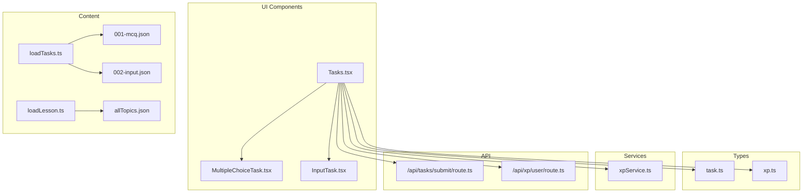
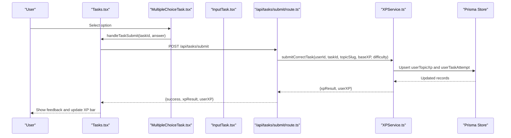
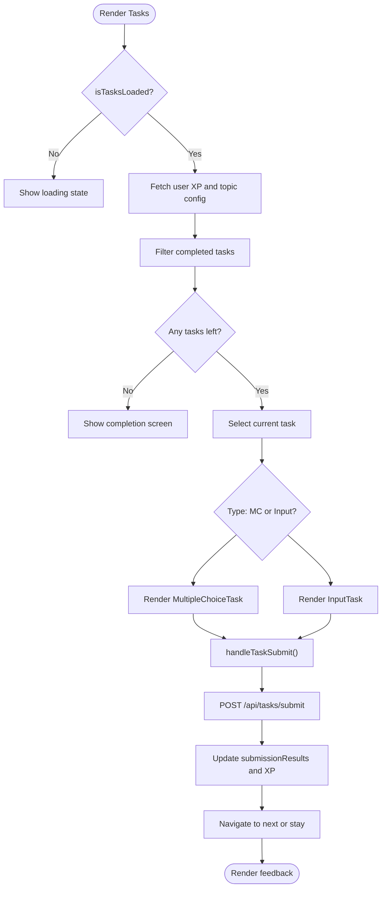
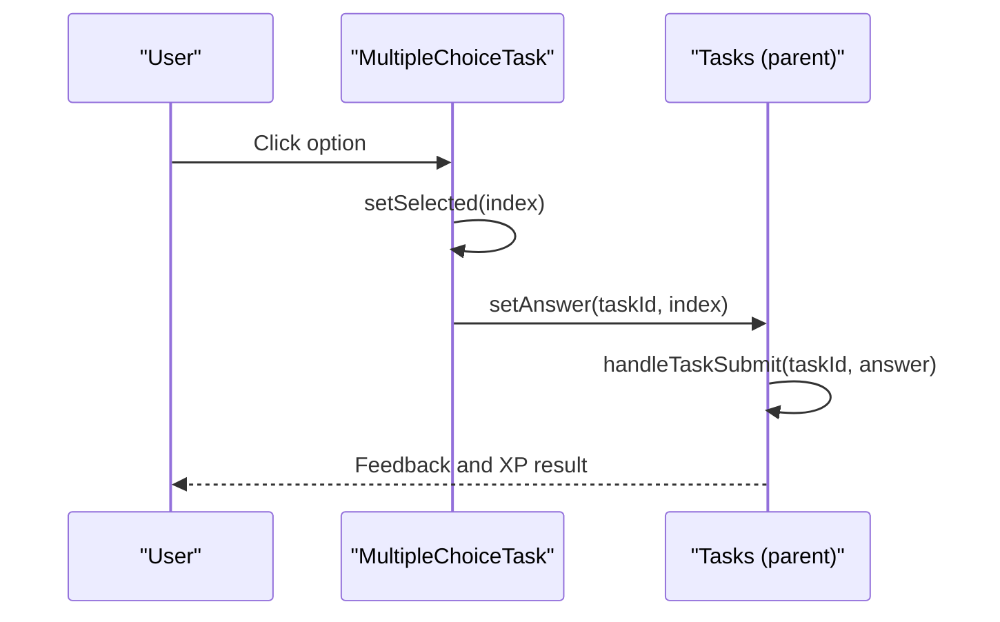
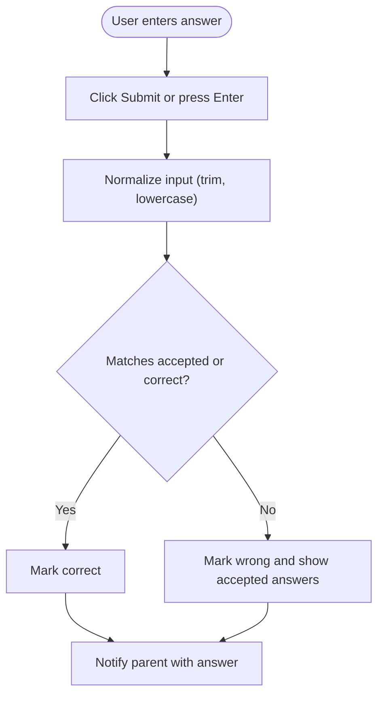
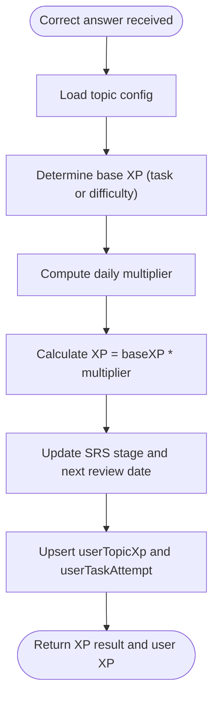
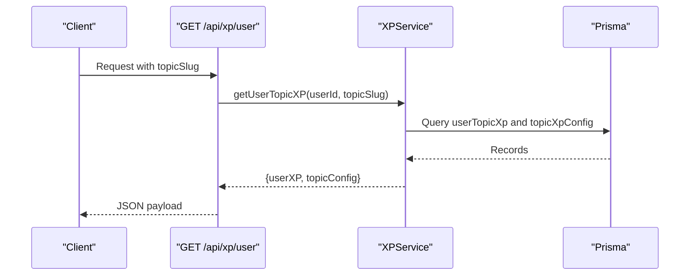
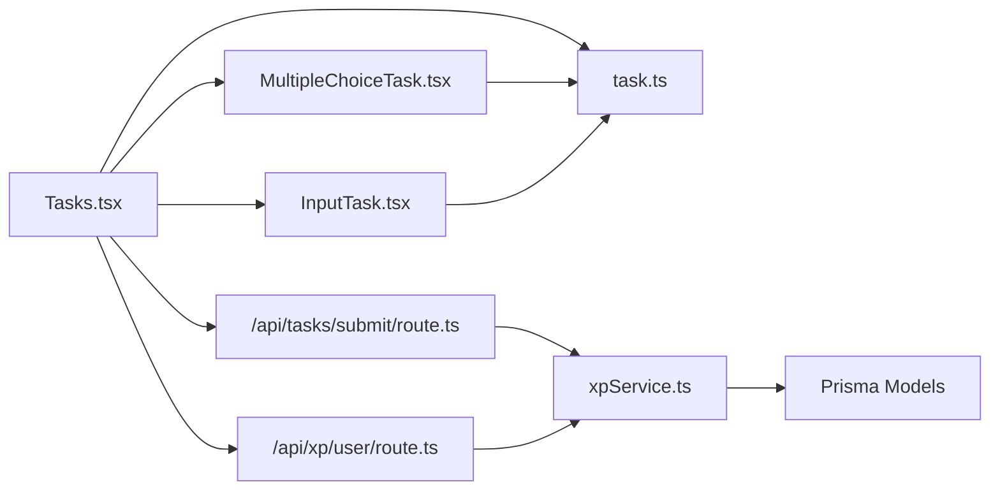

# Learning Interface

<cite>
**Referenced Files in This Document**
- [Tasks.tsx](file://components/tasks/Tasks.tsx)
- [MultipleChoiceTask.tsx](file://components/tasks/MultipleChoiceTask.tsx)
- [InputTask.tsx](file://components/tasks/InputTask.tsx)
- [task.ts](file://types/task.ts)
- [loadTasks.ts](file://lib/loadTasks.ts)
- [xp.ts](file://types/xp.ts)
- [xpService.ts](file://lib/xp/xpService.ts)
- [route.ts](file://app/api/tasks/submit/route.ts)
- [route.ts](file://app/api/xp/user/route.ts)
- [001-mcq.json](file://content/math/addition_and_subtraction_of_fractions/tasks/001-mcq.json)
- [002-input.json](file://content/math/addition_and_subtraction_of_fractions/tasks/002-input.json)
- [loadLesson.ts](file://lib/loadLesson.ts)
- [allTopics.json](file://content/math/allTopics.json)
</cite>

## Table of Contents
1. [Introduction](#introduction)
2. [Project Structure](#project-structure)
3. [Core Components](#core-components)
4. [Architecture Overview](#architecture-overview)
5. [Detailed Component Analysis](#detailed-component-analysis)
6. [Dependency Analysis](#dependency-analysis)
7. [Performance Considerations](#performance-considerations)
8. [Troubleshooting Guide](#troubleshooting-guide)
9. [Conclusion](#conclusion)
10. [Appendices](#appendices)

## Introduction
This document explains the interactive learning interface that powers student engagement with mathematical content. It covers the task system architecture supporting multiple-choice and input-based questions, lesson progression tracking, difficulty scaling, and adaptive content delivery. It documents the component hierarchy, task rendering logic, user interaction patterns, and real-time feedback mechanisms. Practical examples demonstrate how to create tasks, integrate components, and optimize the user workflow.

## Project Structure
The learning interface is organized around:
- Task rendering components for multiple-choice and input tasks
- A central task container orchestrating navigation, submission, and feedback
- Content loaders for lessons and tasks
- An XP and SRS service managing difficulty scaling and adaptive scheduling
- API routes handling submissions and XP retrieval



**Diagram sources**
- [Tasks.tsx](file://components/tasks/Tasks.tsx#L1-L441)
- [MultipleChoiceTask.tsx](file://components/tasks/MultipleChoiceTask.tsx#L1-L72)
- [InputTask.tsx](file://components/tasks/InputTask.tsx#L1-L97)
- [task.ts](file://types/task.ts#L1-L25)
- [xp.ts](file://types/xp.ts#L1-L131)
- [loadTasks.ts](file://lib/loadTasks.ts#L1-L31)
- [loadLesson.ts](file://lib/loadLesson.ts#L1-L17)
- [allTopics.json](file://content/math/allTopics.json#L1-L26)
- [001-mcq.json](file://content/math/addition_and_subtraction_of_fractions/tasks/001-mcq.json#L1-L250)
- [002-input.json](file://content/math/addition_and_subtraction_of_fractions/tasks/002-input.json#L1-L10)
- [xpService.ts](file://lib/xp/xpService.ts#L1-L795)
- [route.ts](file://app/api/tasks/submit/route.ts#L1-L59)
- [route.ts](file://app/api/xp/user/route.ts#L1-L41)

**Section sources**
- [Tasks.tsx](file://components/tasks/Tasks.tsx#L1-L441)
- [task.ts](file://types/task.ts#L1-L25)
- [loadTasks.ts](file://lib/loadTasks.ts#L1-L31)
- [loadLesson.ts](file://lib/loadLesson.ts#L1-L17)
- [allTopics.json](file://content/math/allTopics.json#L1-L26)

## Core Components
- Tasks container: Manages task lifecycle, user XP state, completion tracking, and real-time feedback. Renders the appropriate task component based on type and handles navigation between tasks.
- MultipleChoiceTask: Presents a question with multiple options, tracks selection, and displays correctness with contextual comments.
- InputTask: Accepts free-form answers, normalizes input, validates against accepted forms, and provides immediate feedback.
- Task types: Define the shape of multiple-choice and input tasks, including difficulty and base XP.
- Content loaders: Load lesson content and task sets from JSON files for rendering.
- XP service: Computes XP rewards, applies daily multipliers, manages SRS intervals, and persists attempts and progress.
- API routes: Expose endpoints for submitting answers and retrieving user XP and topic configuration.

Key responsibilities:
- Rendering: Tasks.tsx selects and renders the current task component.
- Interaction: Components trigger submission via a shared handler that posts to the backend.
- Feedback: Real-time messages, XP results, and visual cues inform correctness and progress.
- Adaptivity: XPService determines difficulty scaling and scheduling based on mastery and timing.

**Section sources**
- [Tasks.tsx](file://components/tasks/Tasks.tsx#L12-L423)
- [MultipleChoiceTask.tsx](file://components/tasks/MultipleChoiceTask.tsx#L11-L72)
- [InputTask.tsx](file://components/tasks/InputTask.tsx#L11-L97)
- [task.ts](file://types/task.ts#L1-L25)
- [loadTasks.ts](file://lib/loadTasks.ts#L5-L30)
- [xp.ts](file://types/xp.ts#L107-L131)
- [xpService.ts](file://lib/xp/xpService.ts#L118-L293)
- [route.ts](file://app/api/tasks/submit/route.ts#L6-L58)
- [route.ts](file://app/api/xp/user/route.ts#L5-L40)

## Architecture Overview
The system follows a layered pattern:
- UI layer: React components render tasks and feedback.
- Service layer: XPService encapsulates XP calculation, SRS scheduling, and persistence.
- Data layer: Prisma-backed storage for user progress, topic configs, and attempts.
- API layer: Next.js routes expose submission and XP retrieval endpoints.
- Content layer: JSON files define tasks and lessons.



**Diagram sources**
- [Tasks.tsx](file://components/tasks/Tasks.tsx#L64-L122)
- [MultipleChoiceTask.tsx](file://components/tasks/MultipleChoiceTask.tsx#L17-L22)
- [InputTask.tsx](file://components/tasks/InputTask.tsx#L24-L34)
- [route.ts](file://app/api/tasks/submit/route.ts#L6-L58)
- [xpService.ts](file://lib/xp/xpService.ts#L118-L293)

## Detailed Component Analysis

### Tasks Container
Responsibilities:
- Loads user XP and topic configuration on session change.
- Filters out completed tasks and navigates through available tasks.
- Submits answers and updates state with XP results and feedback.
- Provides navigation controls and visual XP indicators.

Processing logic highlights:
- Completion filtering: Uses a Set of completed task IDs to hide solved tasks.
- Submission flow: Validates session, computes correctness, posts to API, and updates state.
- Feedback display: Shows XP result messages and next-review dates.



**Diagram sources**
- [Tasks.tsx](file://components/tasks/Tasks.tsx#L37-L122)

**Section sources**
- [Tasks.tsx](file://components/tasks/Tasks.tsx#L12-L423)

### Multiple Choice Task
Responsibilities:
- Present options and manage single selection.
- Disable further interaction after selection.
- Highlight correctness and show explanatory comments.

Interaction pattern:
- On first selection, invokes parent handler with answer.
- After selection, disables buttons and shows visual feedback.



**Diagram sources**
- [MultipleChoiceTask.tsx](file://components/tasks/MultipleChoiceTask.tsx#L17-L22)
- [Tasks.tsx](file://components/tasks/Tasks.tsx#L64-L122)

**Section sources**
- [MultipleChoiceTask.tsx](file://components/tasks/MultipleChoiceTask.tsx#L11-L72)

### Input Task
Responsibilities:
- Accept free-form answers with Enter support.
- Normalize input for comparison against accepted forms.
- Provide immediate correctness feedback and reveal accepted answers on error.

Validation logic:
- Normalizes whitespace and case.
- Compares against accepted list or canonical correct answer.



**Diagram sources**
- [InputTask.tsx](file://components/tasks/InputTask.tsx#L24-L34)

**Section sources**
- [InputTask.tsx](file://components/tasks/InputTask.tsx#L11-L97)

### Task Types and Content Loading
Task types define the structure for both multiple-choice and input tasks, including difficulty and base XP. Content loaders parse JSON task files into a unified array for rendering.

```mermaid
classDiagram
class TMultipleChoiceTask {
+string id
+string type
+string question
+{ text, comment? }[] options
+number answer
+string difficulty
+number baseXP?
}
class TInputTask {
+string id
+string type
+string question
+string placeholder
+string correct
+string[] accepted
+string difficulty
+number baseXP?
}
class TTask {
<<union>>
}
TTask <|-- TMultipleChoiceTask
TTask <|-- TInputTask
```

**Diagram sources**
- [task.ts](file://types/task.ts#L1-L25)

**Section sources**
- [task.ts](file://types/task.ts#L1-L25)
- [loadTasks.ts](file://lib/loadTasks.ts#L5-L30)
- [001-mcq.json](file://content/math/addition_and_subtraction_of_fractions/tasks/001-mcq.json#L1-L250)
- [002-input.json](file://content/math/addition_and_subtraction_of_fractions/tasks/002-input.json#L1-L10)

### XP and Adaptive Delivery
XPService governs difficulty scaling and adaptive scheduling:
- Daily multipliers: Full XP for early tasks, reduced for later tasks within a daily cap.
- SRS intervals: Schedule reviews based on mastery stage and configured intervals.
- Level computation: Levels advance based on cumulative XP thresholds.



**Diagram sources**
- [xpService.ts](file://lib/xp/xpService.ts#L118-L293)
- [xp.ts](file://types/xp.ts#L26-L96)

**Section sources**
- [xp.ts](file://types/xp.ts#L26-L131)
- [xpService.ts](file://lib/xp/xpService.ts#L118-L293)

### API Integration
Endpoints:
- POST /api/tasks/submit: Validates session, checks correctness, and triggers XPService to compute XP and persist attempts.
- GET /api/xp/user: Returns user XP, topic config, and completed task IDs for adaptive filtering.



**Diagram sources**
- [route.ts](file://app/api/xp/user/route.ts#L5-L40)
- [xpService.ts](file://lib/xp/xpService.ts#L325-L350)

**Section sources**
- [route.ts](file://app/api/tasks/submit/route.ts#L6-L58)
- [route.ts](file://app/api/xp/user/route.ts#L5-L40)
- [xpService.ts](file://lib/xp/xpService.ts#L325-L350)

## Dependency Analysis
High-level dependencies:
- Tasks.tsx depends on task types, input/output components, session data, and XP APIs.
- Components depend on task props and a shared submission handler.
- XPService depends on Prisma models and topic configurations.
- API routes depend on XPService and authentication middleware.



**Diagram sources**
- [Tasks.tsx](file://components/tasks/Tasks.tsx#L3-L11)
- [MultipleChoiceTask.tsx](file://components/tasks/MultipleChoiceTask.tsx#L3-L4)
- [InputTask.tsx](file://components/tasks/InputTask.tsx#L3-L4)
- [route.ts](file://app/api/tasks/submit/route.ts#L2-L4)
- [route.ts](file://app/api/xp/user/route.ts#L3-L4)
- [xpService.ts](file://lib/xp/xpService.ts#L1-L11)

**Section sources**
- [Tasks.tsx](file://components/tasks/Tasks.tsx#L3-L11)
- [route.ts](file://app/api/tasks/submit/route.ts#L2-L4)
- [route.ts](file://app/api/xp/user/route.ts#L3-L4)
- [xpService.ts](file://lib/xp/xpService.ts#L1-L11)

## Performance Considerations
- Memoization: The available tasks list is computed with memoization to avoid unnecessary re-renders.
- Filtering: Completed tasks are filtered client-side using a Set for O(1) lookup.
- Daily multipliers: Precomputed multipliers reduce runtime branching during XP calculation.
- Debounced UI updates: Submission state prevents rapid resubmissions while keeping the UI responsive.

[No sources needed since this section provides general guidance]

## Troubleshooting Guide
Common issues and resolutions:
- Unauthorized access on submission: Ensure the user is signed in; API routes check session and reject unauthenticated requests.
- Incorrect answers not counted: The submission endpoint only processes correct answers; incorrect submissions return a failure response.
- No tasks shown after completion: The container displays a completion screen when all available tasks are finished; check topic configuration and completion tracking.
- XP not updating: Verify that the XP endpoint returns user XP and topic config; confirm that the submission endpoint is reachable and returning XP results.

**Section sources**
- [route.ts](file://app/api/tasks/submit/route.ts#L10-L32)
- [route.ts](file://app/api/xp/user/route.ts#L9-L21)
- [Tasks.tsx](file://components/tasks/Tasks.tsx#L146-L169)

## Conclusion
The learning interface combines modular task components, robust XP and SRS mechanics, and adaptive content delivery to create an engaging, personalized math learning experience. The system’s layered architecture ensures maintainability, while real-time feedback and difficulty scaling promote effective learning outcomes.

[No sources needed since this section summarizes without analyzing specific files]

## Appendices

### Practical Examples

- Creating a multiple-choice task:
  - Define a JSON task with options and an answer index.
  - Reference the JSON file in the lesson tasks directory.
  - The loader reads the file and exposes tasks to the UI.

  **Section sources**
  - [001-mcq.json](file://content/math/addition_and_subtraction_of_fractions/tasks/001-mcq.json#L1-L250)
  - [loadTasks.ts](file://lib/loadTasks.ts#L5-L30)

- Creating an input task:
  - Define a JSON task with a canonical correct answer and optional accepted variants.
  - The input component normalizes and compares answers, providing immediate feedback.

  **Section sources**
  - [002-input.json](file://content/math/addition_and_subtraction_of_fractions/tasks/002-input.json#L1-L10)
  - [InputTask.tsx](file://components/tasks/InputTask.tsx#L16-L34)

- Integrating tasks into a lesson:
  - Use the lesson loader to read MDX content and metadata.
  - Combine with task loading to present theory followed by practice.

  **Section sources**
  - [loadLesson.ts](file://lib/loadLesson.ts#L6-L16)
  - [allTopics.json](file://content/math/allTopics.json#L1-L26)

- Optimizing user workflow:
  - Use the XP bar to show progress and energy remaining for the day.
  - Leverage hot-topic indicators to encourage timely reviews.
  - Provide clear navigation between tasks to reduce cognitive load.

  **Section sources**
  - [Tasks.tsx](file://components/tasks/Tasks.tsx#L205-L421)
  - [xpService.ts](file://lib/xp/xpService.ts#L118-L293)