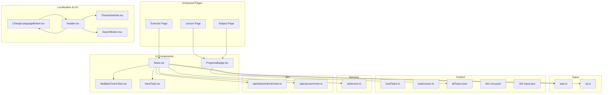
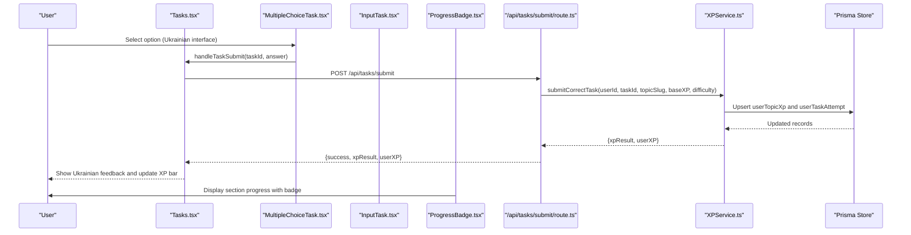
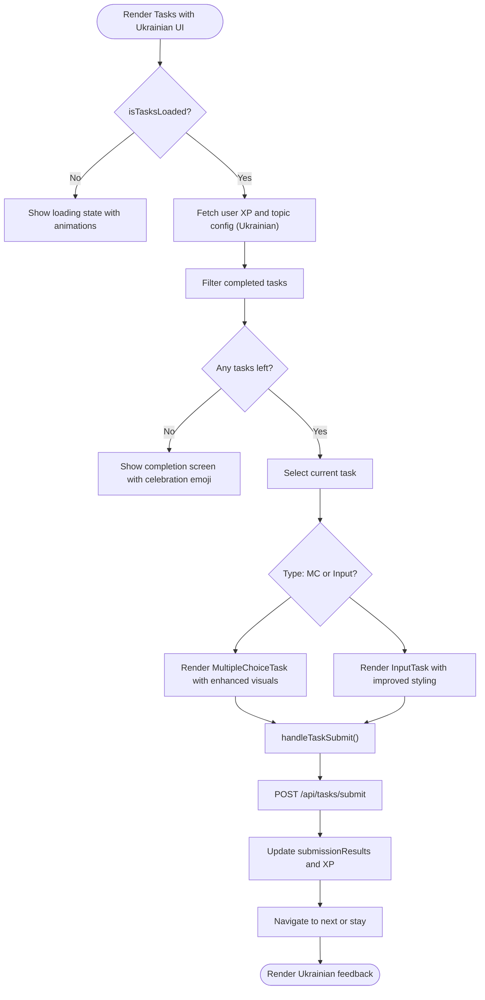
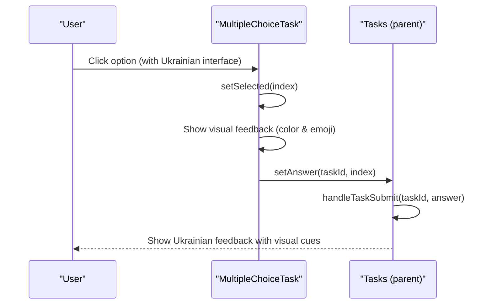
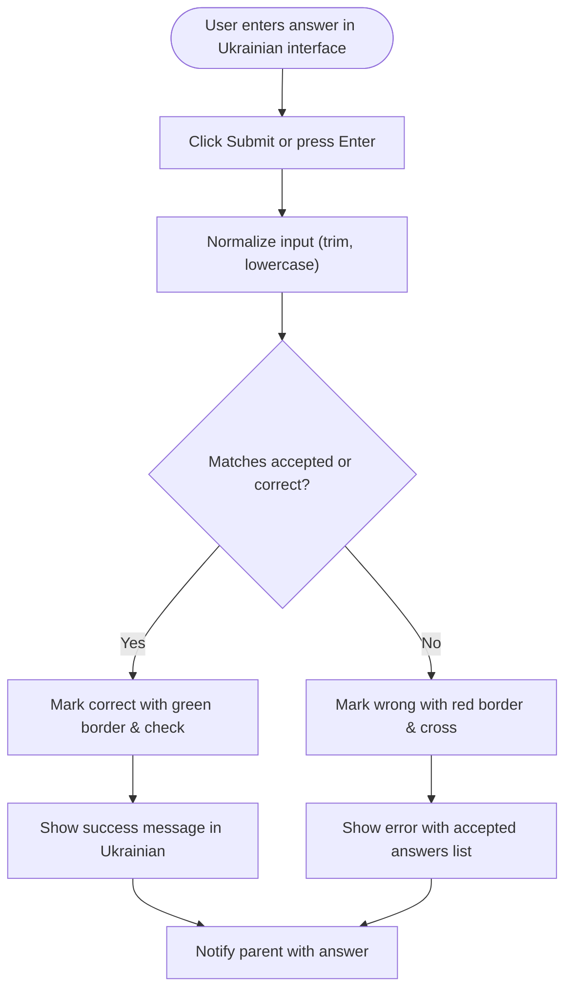
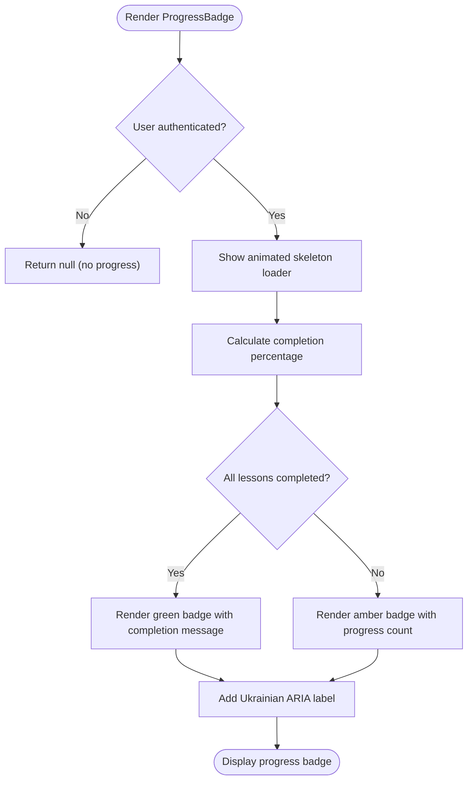
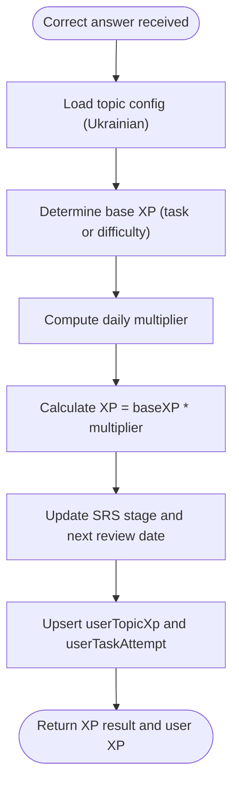
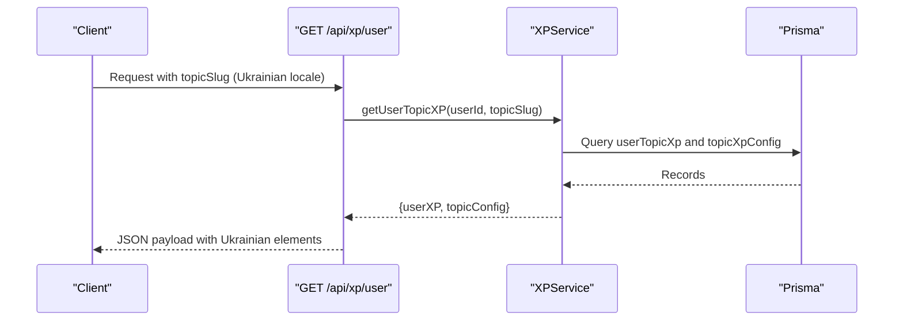
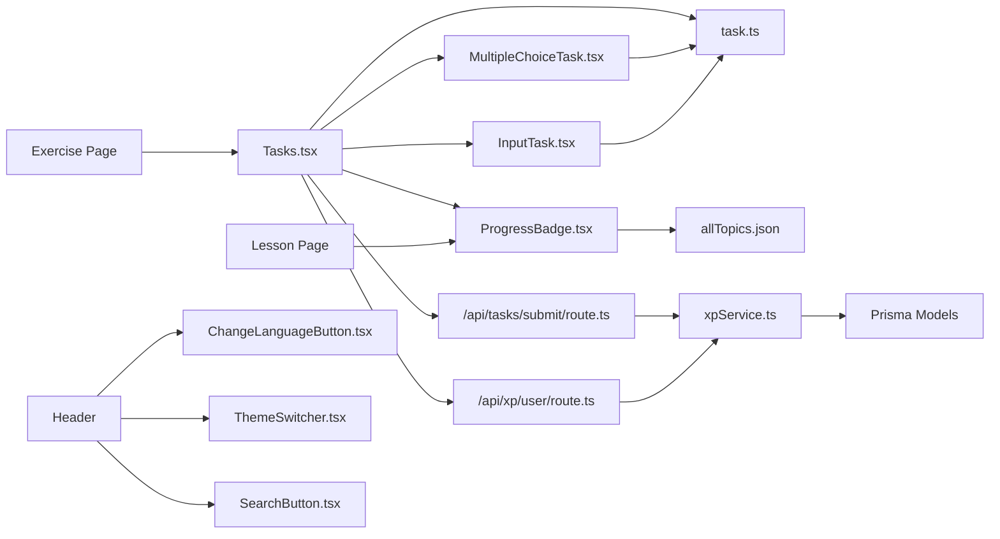

# Learning Interface

<cite>
**Referenced Files in This Document**
- [Tasks.tsx](file://components/tasks/Tasks.tsx)
- [MultipleChoiceTask.tsx](file://components/tasks/MultipleChoiceTask.tsx)
- [InputTask.tsx](file://components/tasks/InputTask.tsx)
- [ProgressBadge.tsx](file://components/math/ProgressBadge.tsx)
- [task.ts](file://types/task.ts)
- [loadTasks.ts](file://lib/loadTasks.ts)
- [xp.ts](file://types/xp.ts)
- [xpService.ts](file://lib/xp/xpService.ts)
- [route.ts](file://app/api/tasks/submit/route.ts)
- [route.ts](file://app/api/xp/user/route.ts)
- [001-mcq.json](file://content/math/addition_and_subtraction_of_fractions/tasks/001-mcq.json)
- [002-input.json](file://content/math/addition_and_subtraction_of_fractions/tasks/002-input.json)
- [loadLesson.ts](file://lib/loadLesson.ts)
- [allTopics.json](file://content/math/allTopics.json)
- [page.tsx](file://app/(main)/math/[topic]/lesson/page.tsx)
- [page.tsx](file://app/(main)/math/[topic]/exercices/page.tsx)
- [SubjectPage.tsx](file://components/SubjectPage.tsx)
- [ChangeLanguageButton.tsx](file://components/ChangeLanguageButton.tsx)
- [Header.tsx](file://components/Header.tsx)
- [HeaderButton.tsx](file://components/HeaderButton.tsx)
- [SearchButton.tsx](file://components/Search/SearchButton.tsx)
- [ThemeSwitcher.tsx](file://components/ThemeSwither/ThemeSwitcher.tsx)
- [globals.css](file://app/globals.css)
</cite>

## Update Summary
**Changes Made**
- Added new ProgressBadge component for section progress tracking
- Enhanced lesson and exercise pages with improved styling and Ukrainian localization
- Improved task components with better visual feedback and user experience
- Added Ukrainian language support throughout the interface
- Enhanced XP display components with localized text and improved styling
- Added new language switching functionality with animated button
- Improved dark mode theming and visual consistency

## Table of Contents
1. [Introduction](#introduction)
2. [Project Structure](#project-structure)
3. [Core Components](#core-components)
4. [Architecture Overview](#architecture-overview)
5. [Detailed Component Analysis](#detailed-component-analysis)
6. [Enhanced User Experience Features](#enhanced-user-experience-features)
7. [Dependency Analysis](#dependency-analysis)
8. [Performance Considerations](#performance-considerations)
9. [Troubleshooting Guide](#troubleshooting-guide)
10. [Conclusion](#conclusion)
11. [Appendices](#appendices)

## Introduction
This document explains the interactive learning interface that powers student engagement with mathematical content. It covers the task system architecture supporting multiple-choice and input-based questions, lesson progression tracking, difficulty scaling, and adaptive content delivery. The system now features enhanced Ukrainian localization, improved visual feedback, and better user experience across lesson and exercise pages. It documents the component hierarchy, task rendering logic, user interaction patterns, and real-time feedback mechanisms. Practical examples demonstrate how to create tasks, integrate components, and optimize the user workflow.

## Project Structure
The learning interface is organized around:
- Task rendering components for multiple-choice and input tasks with enhanced visual feedback
- A central task container orchestrating navigation, submission, and feedback with Ukrainian localization
- Content loaders for lessons and tasks with improved styling
- An XP and SRS service managing difficulty scaling and adaptive scheduling
- API routes handling submissions and XP retrieval
- New ProgressBadge component for section progress tracking
- Enhanced lesson and exercise pages with Ukrainian interface elements



**Diagram sources**
- [Tasks.tsx](file://components/tasks/Tasks.tsx#L1-L761)
- [MultipleChoiceTask.tsx](file://components/tasks/MultipleChoiceTask.tsx#L1-L76)
- [InputTask.tsx](file://components/tasks/InputTask.tsx#L1-L119)
- [ProgressBadge.tsx](file://components/math/ProgressBadge.tsx#L1-L54)
- [page.tsx](file://app/(main)/math/[topic]/lesson/page.tsx#L1-L94)
- [page.tsx](file://app/(main)/math/[topic]/exercices/page.tsx#L1-L32)
- [SubjectPage.tsx](file://components/SubjectPage.tsx#L57-L180)
- [ChangeLanguageButton.tsx](file://components/ChangeLanguageButton.tsx#L1-L49)
- [Header.tsx](file://components/Header.tsx#L1-L79)
- [ThemeSwitcher.tsx](file://components/ThemeSwither/ThemeSwitcher.tsx#L1-L61)
- [SearchButton.tsx](file://components/Search/SearchButton.tsx#L1-L48)

**Section sources**
- [Tasks.tsx](file://components/tasks/Tasks.tsx#L1-L761)
- [task.ts](file://types/task.ts#L1-L25)
- [loadTasks.ts](file://lib/loadTasks.ts#L1-L31)
- [loadLesson.ts](file://lib/loadLesson.ts#L1-L17)
- [allTopics.json](file://content/math/allTopics.json#L1-L26)

## Core Components
- Tasks container: Manages task lifecycle, user XP state, completion tracking, and real-time feedback with Ukrainian interface elements. Renders the appropriate task component based on type and handles navigation between tasks.
- MultipleChoiceTask: Presents a question with multiple options, tracks selection, and displays correctness with contextual comments and enhanced visual feedback.
- InputTask: Accepts free-form answers, normalizes input, validates against accepted forms, and provides immediate feedback with improved styling.
- ProgressBadge: New component that displays section progress with Ukrainian labels and animated loading states.
- Enhanced lesson and exercise pages: Feature improved styling, Ukrainian localization, and better user navigation.
- Task types: Define the shape of multiple-choice and input tasks, including difficulty and base XP.
- Content loaders: Load lesson content and task sets from JSON files for rendering.
- XP service: Computes XP rewards, applies daily multipliers, manages SRS intervals, and persists attempts and progress.
- API routes: Expose endpoints for submitting answers and retrieving user XP and topic configuration.

Key responsibilities:
- Rendering: Tasks.tsx selects and renders the current task component with enhanced visual feedback.
- Interaction: Components trigger submission via a shared handler that posts to the backend.
- Feedback: Real-time messages, XP results, and visual cues inform correctness and progress with Ukrainian text.
- Adaptivity: XPService determines difficulty scaling and scheduling based on mastery and timing.
- Localization: All interface elements now support Ukrainian language with proper translations.

**Section sources**
- [Tasks.tsx](file://components/tasks/Tasks.tsx#L12-L761)
- [MultipleChoiceTask.tsx](file://components/tasks/MultipleChoiceTask.tsx#L11-L76)
- [InputTask.tsx](file://components/tasks/InputTask.tsx#L11-L119)
- [ProgressBadge.tsx](file://components/math/ProgressBadge.tsx#L1-L54)
- [page.tsx](file://app/(main)/math/[topic]/lesson/page.tsx#L1-L94)
- [page.tsx](file://app/(main)/math/[topic]/exercices/page.tsx#L1-L32)

## Architecture Overview
The system follows a layered pattern with enhanced user experience features:
- UI layer: React components render tasks and feedback with Ukrainian localization and improved styling.
- Service layer: XPService encapsulates XP calculation, SRS scheduling, and persistence.
- Data layer: Prisma-backed storage for user progress, topic configs, and attempts.
- API layer: Next.js routes expose submission and XP retrieval endpoints.
- Content layer: JSON files define tasks and lessons with enhanced formatting.



**Diagram sources**
- [Tasks.tsx](file://components/tasks/Tasks.tsx#L608-L613)
- [MultipleChoiceTask.tsx](file://components/tasks/MultipleChoiceTask.tsx#L21-L26)
- [InputTask.tsx](file://components/tasks/InputTask.tsx#L46-L56)
- [ProgressBadge.tsx](file://components/math/ProgressBadge.tsx#L20-L24)
- [route.ts](file://app/api/tasks/submit/route.ts#L6-L58)
- [xpService.ts](file://lib/xp/xpService.ts#L118-L293)

## Detailed Component Analysis

### Tasks Container
Responsibilities:
- Loads user XP and topic configuration on session change with Ukrainian interface elements.
- Filters out completed tasks and navigates through available tasks with enhanced visual feedback.
- Submits answers and updates state with XP results and feedback in Ukrainian.
- Provides navigation controls and visual XP indicators with improved styling.

Processing logic highlights:
- Completion filtering: Uses a Set of completed task IDs to hide solved tasks.
- Submission flow: Validates session, computes correctness, posts to API, and updates state.
- Feedback display: Shows XP result messages and next-review dates in Ukrainian.
- Enhanced styling: Improved color schemes, animations, and responsive design.



**Diagram sources**
- [Tasks.tsx](file://components/tasks/Tasks.tsx#L502-L761)

**Section sources**
- [Tasks.tsx](file://components/tasks/Tasks.tsx#L12-L761)

### Multiple Choice Task
Responsibilities:
- Present options and manage single selection with enhanced visual feedback.
- Disable further interaction after selection with improved styling.
- Highlight correctness with emojis and show explanatory comments in Ukrainian.

Interaction pattern:
- On first selection, invokes parent handler with answer.
- After selection, disables buttons and shows visual feedback with color-coded responses.

Enhanced features:
- Color-coded feedback: Green for correct, red for incorrect selections.
- Emoji indicators: ✓ for correct, ✗ for incorrect answers.
- Shadow effects and hover states for better interactivity.
- Responsive design with proper spacing and typography.



**Diagram sources**
- [MultipleChoiceTask.tsx](file://components/tasks/MultipleChoiceTask.tsx#L21-L26)
- [Tasks.tsx](file://components/tasks/Tasks.tsx#L608-L613)

**Section sources**
- [MultipleChoiceTask.tsx](file://components/tasks/MultipleChoiceTask.tsx#L11-L76)

### Input Task
Responsibilities:
- Accept free-form answers with Enter support and improved validation.
- Normalize input for comparison against accepted forms with enhanced feedback.
- Provide immediate correctness feedback with Ukrainian messages and reveal accepted answers on error.

Enhanced validation logic:
- Normalizes whitespace and case with improved algorithms.
- Compares against accepted list or canonical correct answer with better error handling.
- Visual feedback with color-coded borders and background states.



**Diagram sources**
- [InputTask.tsx](file://components/tasks/InputTask.tsx#L46-L56)

**Section sources**
- [InputTask.tsx](file://components/tasks/InputTask.tsx#L11-L119)

### Progress Badge Component
**New Component** - A dedicated component for displaying section progress with Ukrainian localization.

Responsibilities:
- Display section completion status with animated loading states.
- Show completed vs total lessons count in Ukrainian format.
- Provide visual feedback with color-coded badges (green for complete, amber for in-progress).
- Integrate with user session management for authenticated progress tracking.

Features:
- Animated skeleton loading during progress calculation.
- Responsive design with proper spacing and typography.
- Accessible with proper ARIA labels in Ukrainian.
- Dark mode compatibility with appropriate color schemes.



**Diagram sources**
- [ProgressBadge.tsx](file://components/math/ProgressBadge.tsx#L20-L24)
- [ProgressBadge.tsx](file://components/math/ProgressBadge.tsx#L35-L36)

**Section sources**
- [ProgressBadge.tsx](file://components/math/ProgressBadge.tsx#L1-L54)

### Enhanced Lesson and Exercise Pages
**Updated** - Lesson and exercise pages now feature improved styling, Ukrainian localization, and better user experience.

Lesson Page features:
- Enhanced typography with custom component styling.
- Ukrainian difficulty indicators with color-coded badges.
- Improved content presentation with better spacing and readability.
- Math content support with KaTeX rendering for mathematical expressions.

Exercise Page features:
- Better navigation back to lesson with Ukrainian labels.
- Enhanced Tasks component integration with improved styling.
- Consistent design language across both pages.

**Section sources**
- [page.tsx](file://app/(main)/math/[topic]/lesson/page.tsx#L1-L94)
- [page.tsx](file://app/(main)/math/[topic]/exercices/page.tsx#L1-L32)

### Task Types and Content Loading
Task types define the structure for both multiple-choice and input tasks, including difficulty and base XP. Content loaders parse JSON task files into a unified array for rendering.

```mermaid
classDiagram
class TMultipleChoiceTask {
+string id
+string type
+string question
+{ text, comment? }[] options
+number answer
+string difficulty
+number baseXP?
}
class TInputTask {
+string id
+string type
+string question
+string placeholder
+string correct
+string[] accepted
+string difficulty
+number baseXP?
}
class TTask {
<<union>>
}
TTask <|-- TMultipleChoiceTask
TTask <|-- TInputTask
```

**Diagram sources**
- [task.ts](file://types/task.ts#L1-L25)

**Section sources**
- [task.ts](file://types/task.ts#L1-L25)
- [loadTasks.ts](file://lib/loadTasks.ts#L5-L30)
- [001-mcq.json](file://content/math/addition_and_subtraction_of_fractions/tasks/001-mcq.json#L1-L250)
- [002-input.json](file://content/math/addition_and_subtraction_of_fractions/tasks/002-input.json#L1-L10)

### XP and Adaptive Delivery
XPService governs difficulty scaling and adaptive scheduling:
- Daily multipliers: Full XP for early tasks, reduced for later tasks within a daily cap.
- SRS intervals: Schedule reviews based on mastery stage and configured intervals.
- Level computation: Levels advance based on cumulative XP thresholds.

Enhanced features:
- Ukrainian interface elements in XP calculations and displays.
- Improved progress visualization with animated progress bars.
- Better error handling and logging for debugging purposes.



**Diagram sources**
- [xpService.ts](file://lib/xp/xpService.ts#L118-L293)
- [xp.ts](file://types/xp.ts#L26-L96)

**Section sources**
- [xp.ts](file://types/xp.ts#L26-L131)
- [xpService.ts](file://lib/xp/xpService.ts#L118-L293)

### API Integration
Endpoints:
- POST /api/tasks/submit: Validates session, checks correctness, and triggers XPService to compute XP and persist attempts.
- GET /api/xp/user: Returns user XP, topic config, and completed task IDs for adaptive filtering.

Enhanced features:
- Improved error handling and response formatting.
- Better integration with the new ProgressBadge component.
- Support for Ukrainian locale in API responses.



**Diagram sources**
- [route.ts](file://app/api/xp/user/route.ts#L5-L40)
- [xpService.ts](file://lib/xp/xpService.ts#L325-L350)

**Section sources**
- [route.ts](file://app/api/tasks/submit/route.ts#L6-L58)
- [route.ts](file://app/api/xp/user/route.ts#L5-L40)
- [xpService.ts](file://lib/xp/xpService.ts#L325-L350)

## Enhanced User Experience Features

### Ukrainian Localization
The entire interface now supports Ukrainian language with comprehensive translations:
- All user-facing text elements are translated to Ukrainian
- Date formats and time displays use Ukrainian conventions
- Progress indicators and status messages use Ukrainian terminology
- Mathematical expressions and educational content maintain English technical terms while surrounding interface uses Ukrainian

### Enhanced Visual Design
- Improved color schemes with better contrast ratios for accessibility
- Consistent spacing and typography throughout the interface
- Enhanced animations and transitions for better user feedback
- Responsive design improvements for various screen sizes
- Dark mode support with carefully chosen color palettes

### Interactive Elements
- Animated progress indicators and loading states
- Hover effects and micro-interactions for better user engagement
- Improved form validation with real-time feedback
- Better error messaging with helpful suggestions

**Section sources**
- [Tasks.tsx](file://components/tasks/Tasks.tsx#L200-L322)
- [MultipleChoiceTask.tsx](file://components/tasks/MultipleChoiceTask.tsx#L33-L74)
- [InputTask.tsx](file://components/tasks/InputTask.tsx#L62-L118)
- [ProgressBadge.tsx](file://components/math/ProgressBadge.tsx#L38-L52)

## Dependency Analysis
High-level dependencies with enhanced components:
- Tasks.tsx depends on task types, input/output components, session data, XP APIs, and Ukrainian localization.
- Components depend on task props and a shared submission handler with enhanced styling.
- ProgressBadge depends on session management and topic configuration.
- Enhanced lesson and exercise pages integrate with new UI components.
- XPService depends on Prisma models and topic configurations.
- API routes depend on XPService and authentication middleware.



**Diagram sources**
- [Tasks.tsx](file://components/tasks/Tasks.tsx#L3-L11)
- [MultipleChoiceTask.tsx](file://components/tasks/MultipleChoiceTask.tsx#L3-L4)
- [InputTask.tsx](file://components/tasks/InputTask.tsx#L3-L4)
- [ProgressBadge.tsx](file://components/math/ProgressBadge.tsx#L3-L4)
- [page.tsx](file://app/(main)/math/[topic]/lesson/page.tsx#L1-L94)
- [page.tsx](file://app/(main)/math/[topic]/exercices/page.tsx#L1-L32)
- [Header.tsx](file://components/Header.tsx#L1-L79)
- [ChangeLanguageButton.tsx](file://components/ChangeLanguageButton.tsx#L1-L49)
- [ThemeSwitcher.tsx](file://components/ThemeSwither/ThemeSwitcher.tsx#L1-L61)
- [SearchButton.tsx](file://components/Search/SearchButton.tsx#L1-L48)

**Section sources**
- [Tasks.tsx](file://components/tasks/Tasks.tsx#L3-L11)
- [route.ts](file://app/api/tasks/submit/route.ts#L2-L4)
- [route.ts](file://app/api/xp/user/route.ts#L3-L4)
- [xpService.ts](file://lib/xp/xpService.ts#L1-L11)

## Performance Considerations
- Memoization: The available tasks list is computed with memoization to avoid unnecessary re-renders.
- Filtering: Completed tasks are filtered client-side using a Set for O(1) lookup.
- Daily multipliers: Precomputed multipliers reduce runtime branching during XP calculation.
- Debounced UI updates: Submission state prevents rapid resubmissions while keeping the UI responsive.
- Enhanced caching: New components utilize efficient state management and minimal re-renders.
- Lazy loading: ProgressBadge uses skeleton loading for better perceived performance.

## Troubleshooting Guide
Common issues and resolutions:
- Unauthorized access on submission: Ensure the user is signed in; API routes check session and reject unauthenticated requests.
- Incorrect answers not counted: The submission endpoint only processes correct answers; incorrect submissions return a failure response.
- No tasks shown after completion: The container displays a completion screen when all available tasks are finished; check topic configuration and completion tracking.
- XP not updating: Verify that the XP endpoint returns user XP and topic config; confirm that the submission endpoint is reachable and returning XP results.
- Progress badge not showing: Ensure user is authenticated and section has lessons; check network connectivity for progress data.
- Ukrainian text not displaying: Verify browser locale settings and ensure proper font support for Ukrainian characters.

**Section sources**
- [route.ts](file://app/api/tasks/submit/route.ts#L10-L32)
- [route.ts](file://app/api/xp/user/route.ts#L9-L21)
- [Tasks.tsx](file://components/tasks/Tasks.tsx#L146-L169)
- [ProgressBadge.tsx](file://components/math/ProgressBadge.tsx#L20-L24)

## Conclusion
The learning interface combines modular task components, robust XP and SRS mechanics, and adaptive content delivery to create an engaging, personalized math learning experience. The system's layered architecture ensures maintainability, while real-time feedback, difficulty scaling, and Ukrainian localization promote effective learning outcomes. The enhanced user experience features, including improved visual design, interactive elements, and better accessibility, make the platform more engaging and user-friendly.

## Appendices

### Practical Examples

- Creating a multiple-choice task:
  - Define a JSON task with options and an answer index.
  - Reference the JSON file in the lesson tasks directory.
  - The loader reads the file and exposes tasks to the UI with enhanced styling.

  **Section sources**
  - [001-mcq.json](file://content/math/addition_and_subtraction_of_fractions/tasks/001-mcq.json#L1-L250)
  - [loadTasks.ts](file://lib/loadTasks.ts#L5-L30)

- Creating an input task:
  - Define a JSON task with a canonical correct answer and optional accepted variants.
  - The input component normalizes and compares answers, providing immediate feedback with Ukrainian messages.

  **Section sources**
  - [002-input.json](file://content/math/addition_and_subtraction_of_fractions/tasks/002-input.json#L1-L10)
  - [InputTask.tsx](file://components/tasks/InputTask.tsx#L16-L56)

- Integrating tasks into a lesson:
  - Use the lesson loader to read MDX content and metadata with enhanced styling.
  - Combine with task loading to present theory followed by practice with Ukrainian interface elements.

  **Section sources**
  - [loadLesson.ts](file://lib/loadLesson.ts#L6-L16)
  - [allTopics.json](file://content/math/allTopics.json#L1-L26)
  - [page.tsx](file://app/(main)/math/[topic]/lesson/page.tsx#L38-L81)

- Optimizing user workflow:
  - Use the XP bar to show progress and energy remaining for the day with Ukrainian labels.
  - Leverage hot-topic indicators to encourage timely reviews.
  - Provide clear navigation between tasks to reduce cognitive load.
  - Utilize the new ProgressBadge component for section-level progress tracking.

  **Section sources**
  - [Tasks.tsx](file://components/tasks/Tasks.tsx#L200-L322)
  - [ProgressBadge.tsx](file://components/math/ProgressBadge.tsx#L11-L52)
  - [xpService.ts](file://lib/xp/xpService.ts#L118-L293)

- Implementing Ukrainian localization:
  - Use Ukrainian translations for all user-facing text elements.
  - Implement proper date formatting and time displays for Ukrainian locale.
  - Ensure mathematical expressions maintain English technical terms while surrounding interface uses Ukrainian.

  **Section sources**
  - [Tasks.tsx](file://components/tasks/Tasks.tsx#L200-L322)
  - [MultipleChoiceTask.tsx](file://components/tasks/MultipleChoiceTask.tsx#L33-L74)
  - [InputTask.tsx](file://components/tasks/InputTask.tsx#L62-L118)
  - [ProgressBadge.tsx](file://components/math/ProgressBadge.tsx#L38-L52)