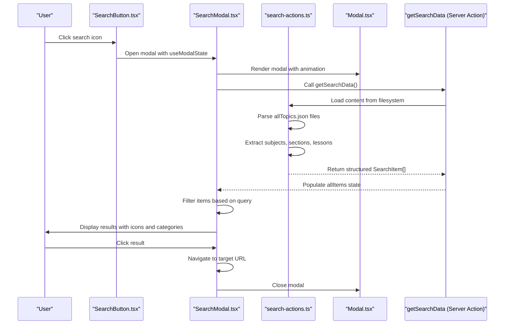
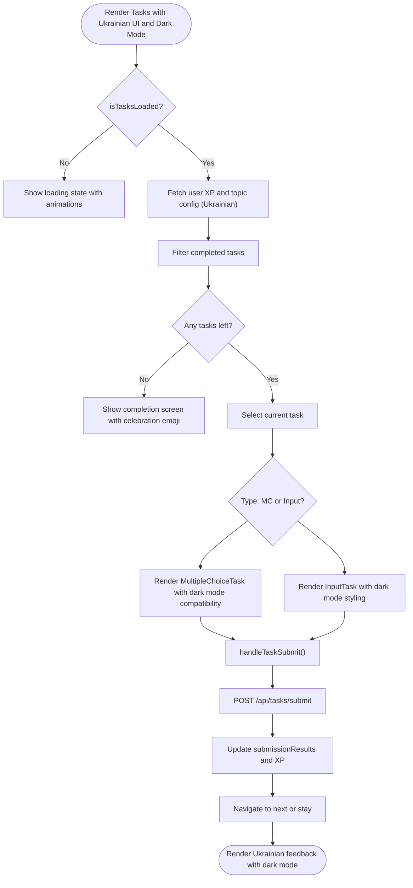
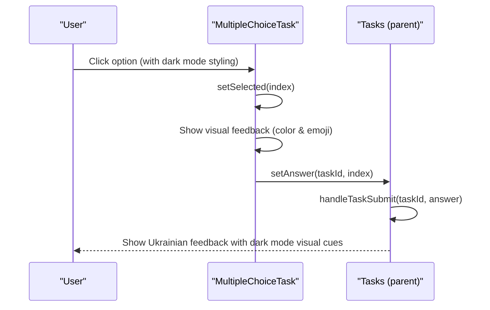
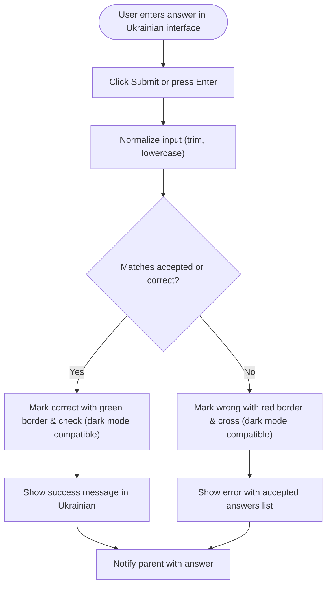
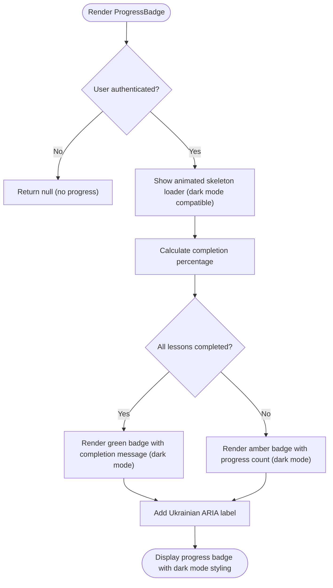
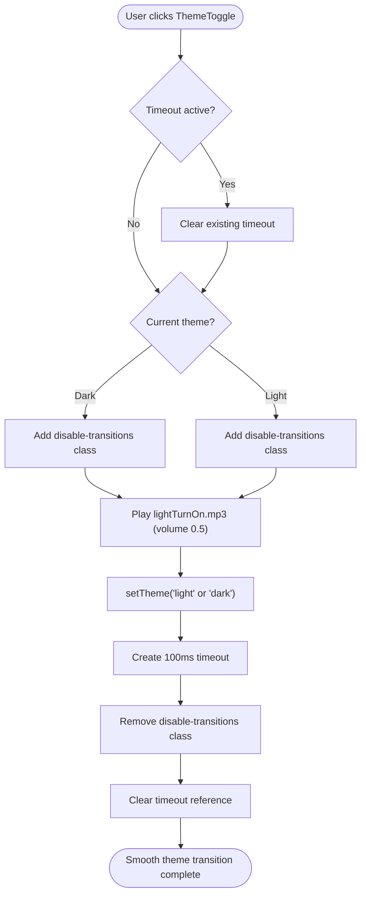
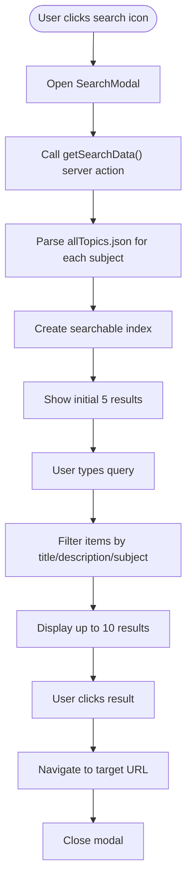
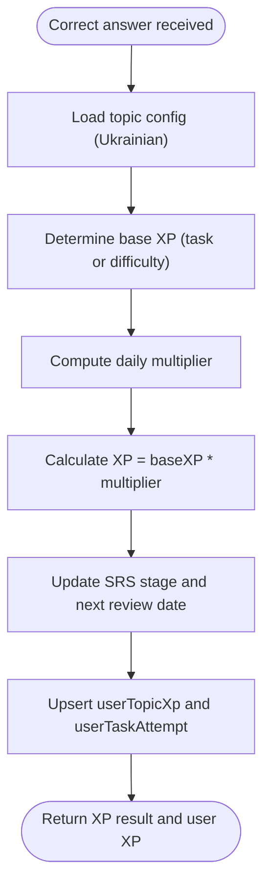
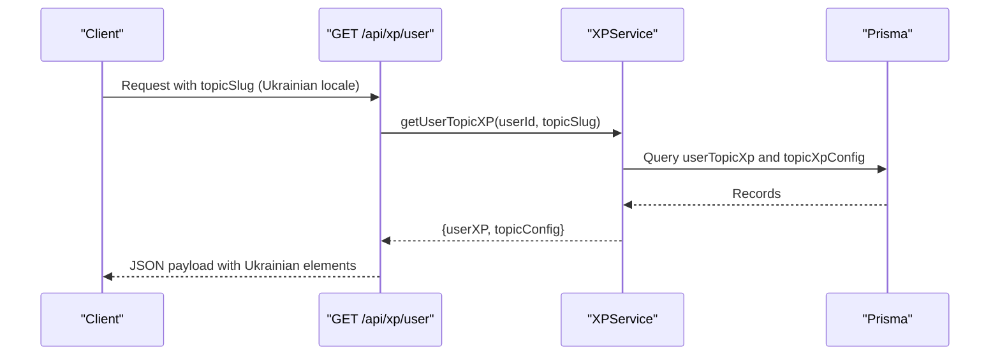
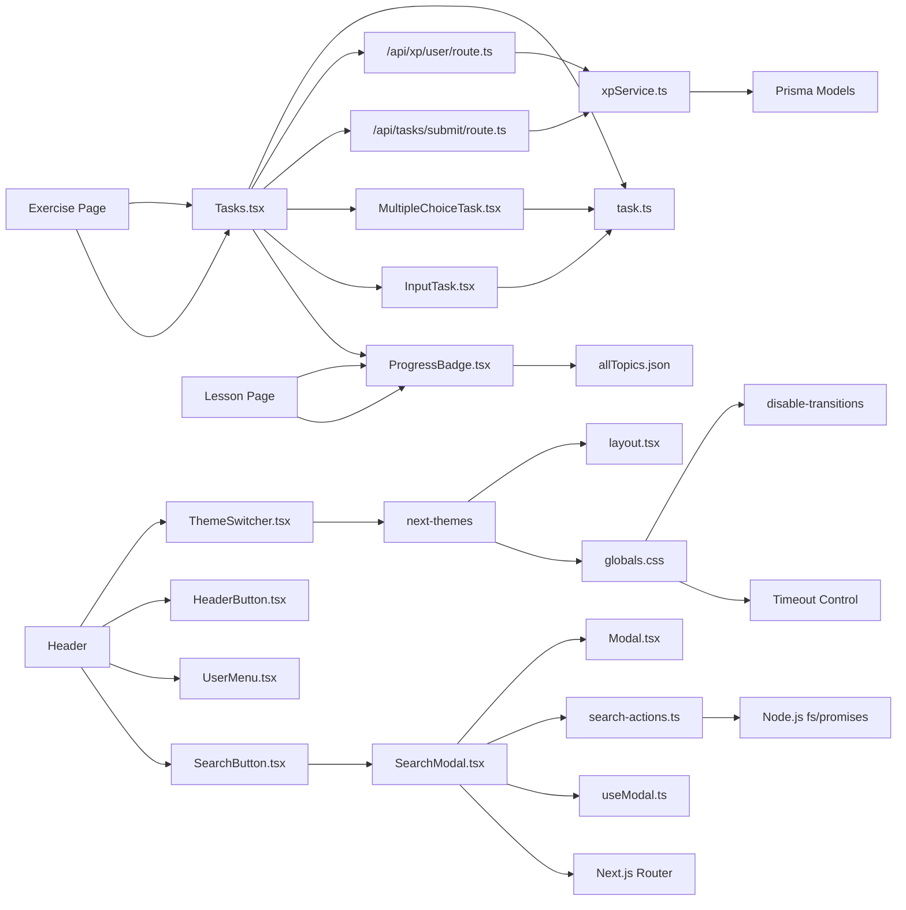

# Learning Interface

<cite>
**Referenced Files in This Document**
- [Tasks.tsx](file://components/tasks/Tasks.tsx)
- [MultipleChoiceTask.tsx](file://components/tasks/MultipleChoiceTask.tsx)
- [InputTask.tsx](file://components/tasks/InputTask.tsx)
- [ProgressBadge.tsx](file://components/math/ProgressBadge.tsx)
- [task.ts](file://types/task.ts)
- [loadTasks.ts](file://lib/loadTasks.ts)
- [xp.ts](file://types/xp.ts)
- [xpService.ts](file://lib/xp/xpService.ts)
- [route.ts](file://app/api/tasks/submit/route.ts)
- [route.ts](file://app/api/xp/user/route.ts)
- [001-mcq.json](file://content/math/addition_and_subtraction_of_fractions/tasks/001-mcq.json)
- [002-input.json](file://content/math/addition_and_subtraction_of_fractions/tasks/002-input.json)
- [loadLesson.ts](file://lib/loadLesson.ts)
- [allTopics.json](file://content/math/allTopics.json)
- [page.tsx](file://app/(main)/math/[topic]/lesson/page.tsx)
- [page.tsx](file://app/(main)/math/[topic]/exercices/page.tsx)
- [SubjectPage.tsx](file://components/SubjectPage.tsx)
- [ChangeLanguageButton.tsx](file://components/ChangeLanguageButton.tsx)
- [Header.tsx](file://components/Header.tsx)
- [HeaderButton.tsx](file://components/HeaderButton.tsx)
- [SearchButton.tsx](file://components/Search/SearchButton.tsx)
- [SearchModal.tsx](file://components/Search/SearchModal.tsx)
- [ThemeSwitcher.tsx](file://components/ThemeSwither/ThemeSwitcher.tsx)
- [Modal.tsx](file://components/Modal.tsx)
- [useModal.ts](file://lib/hooks/useModal.ts)
- [search-actions.ts](file://lib/search-actions.ts)
- [globals.css](file://app/globals.css)
- [layout.tsx](file://app/layout.tsx)
- [typography.css](file://app/typography.css)
- [UserMenu.tsx](file://components/UserMenu.tsx)
</cite>

## Update Summary
**Changes Made**
- Enhanced search functionality with new SearchModal.tsx component providing real-time filtering, debounced queries, and multi-category search results
- Replaced simple search button with comprehensive search architecture featuring server-side content indexing
- Added sophisticated search item categorization (subjects, sections, lessons) with icon differentiation
- Implemented server action-based search data loading with file system integration
- Integrated modal-based search interface with keyboard navigation and click-outside-to-close functionality
- Added comprehensive search result filtering with title, description, and subject title matching
- Enhanced user experience with instant search results, loading states, and empty state handling

## Table of Contents
1. [Introduction](#introduction)
2. [Project Structure](#project-structure)
3. [Core Components](#core-components)
4. [Architecture Overview](#architecture-overview)
5. [Detailed Component Analysis](#detailed-component-analysis)
6. [Enhanced User Experience Features](#enhanced-user-experience-features)
7. [Dark Mode Implementation](#dark-mode-implementation)
8. [Search System Architecture](#search-system-architecture)
9. [Dependency Analysis](#dependency-analysis)
10. [Performance Considerations](#performance-considerations)
11. [Troubleshooting Guide](#troubleshooting-guide)
12. [Conclusion](#conclusion)
13. [Appendices](#appendices)

## Introduction
This document explains the interactive learning interface that powers student engagement with mathematical content. It covers the task system architecture supporting multiple-choice and input-based questions, lesson progression tracking, difficulty scaling, and adaptive content delivery. The system now features enhanced Ukrainian localization, improved visual feedback, comprehensive dark mode support, and a sophisticated search functionality with real-time filtering capabilities. The search system provides instant access to subjects, sections, and lessons through a modal interface with intelligent content indexing and multi-category filtering.

## Project Structure
The learning interface is organized around:
- Task rendering components for multiple-choice and input tasks with enhanced visual feedback and dark mode support
- A central task container orchestrating navigation, submission, and feedback with Ukrainian localization
- Content loaders for lessons and tasks with improved styling
- An XP and SRS service managing difficulty scaling and adaptive scheduling
- API routes handling submissions and XP retrieval
- **Enhanced Search System**: New comprehensive search architecture with modal interface, real-time filtering, and multi-category results
- New ProgressBadge component for section progress tracking with dark mode compatibility
- Enhanced lesson and exercise pages with Ukrainian interface elements and dark mode theming
- Comprehensive ThemeSwitcher component for seamless theme transitions with timeout-based mechanism

```mermaid
graph TB
subgraph "UI Components"
Tasks["Tasks.tsx"]
MC["MultipleChoiceTask.tsx"]
IT["InputTask.tsx"]
PB["ProgressBadge.tsx"]
HS["ThemeSwitcher.tsx"]
HB["HeaderButton.tsx"]
UM["UserMenu.tsx"]
SB["SearchButton.tsx"]
SM["SearchModal.tsx"]
end
subgraph "Search System"
SA["search-actions.ts"]
MODAL["Modal.tsx"]
USEMODAL["useModal.ts"]
end
subgraph "Enhanced Pages"
LP["Lesson Page"]
EP["Exercise Page"]
SP["Subject Page"]
end
subgraph "Dark Mode System"
CSS["globals.css"]
LAYOUT["layout.tsx"]
THEME["next-themes Provider"]
AUDIO["Audio Feedback"]
TRANS["disable-transitions"]
TIMEOUT["Timeout-Based Mechanism"]
end
subgraph "Localization & UX"
CLB["ChangeLanguageButton.tsx"]
end
subgraph "Types"
TT["task.ts"]
TXPT["xp.ts"]
SI["SearchItem Type"]
end
subgraph "Content"
LT["loadTasks.ts"]
LLess["loadLesson.ts"]
Topics["allTopics.json"]
MCQ["001-mcq.json"]
INP["002-input.json"]
end
subgraph "Services"
XPS["xpService.ts"]
end
subgraph "API"
SUBMIT["/api/tasks/submit/route.ts"]
XPUSER["/api/xp/user/route.ts"]
end
Tasks --> MC
Tasks --> IT
Tasks --> TT
Tasks --> TXPT
Tasks --> XPUSER
Tasks --> SUBMIT
Tasks --> XPS
PB --> Topics
LP --> PB
EP --> Tasks
SP --> PB
HB --> HS
HB --> UM
SB --> SM
SM --> SA
SM --> MODAL
SM --> USEMODAL
SI --> SA
CSS --> THEME
THEME --> TRANS
THEME --> TIMEOUT
HS --> AUDIO
HS --> TRANS
HS --> TIMEOUT
```

**Diagram sources**
- [Tasks.tsx](file://components/tasks/Tasks.tsx#L1-L835)
- [MultipleChoiceTask.tsx](file://components/tasks/MultipleChoiceTask.tsx#L1-L74)
- [InputTask.tsx](file://components/tasks/InputTask.tsx#L1-L120)
- [ProgressBadge.tsx](file://components/math/ProgressBadge.tsx#L1-L53)
- [ThemeSwitcher.tsx](file://components/ThemeSwither/ThemeSwitcher.tsx#L1-L93)
- [HeaderButton.tsx](file://components/HeaderButton.tsx#L1-L23)
- [UserMenu.tsx](file://components/UserMenu.tsx#L71-L93)
- [SearchButton.tsx](file://components/Search/SearchButton.tsx#L1-L21)
- [SearchModal.tsx](file://components/Search/SearchModal.tsx#L1-L113)
- [search-actions.ts](file://lib/search-actions.ts#L1-L66)
- [Modal.tsx](file://components/Modal.tsx#L1-L86)
- [useModal.ts](file://lib/hooks/useModal.ts#L1-L64)
- [page.tsx](file://app/(main)/math/[topic]/lesson/page.tsx#L1-L104)
- [page.tsx](file://app/(main)/math/[topic]/exercices/page.tsx#L1-L31)
- [SubjectPage.tsx](file://components/SubjectPage.tsx#L57-L180)
- [globals.css](file://app/globals.css#L1-L25)
- [layout.tsx](file://app/layout.tsx#L1-L46)
- [ChangeLanguageButton.tsx](file://components/ChangeLanguageButton.tsx#L1-L49)

**Section sources**
- [Tasks.tsx](file://components/tasks/Tasks.tsx#L1-L835)
- [task.ts](file://types/task.ts#L1-L25)
- [loadTasks.ts](file://lib/loadTasks.ts#L1-L31)
- [loadLesson.ts](file://lib/loadLesson.ts#L1-L17)
- [allTopics.json](file://content/math/allTopics.json#L1-L26)

## Core Components
- Tasks container: Manages task lifecycle, user XP state, completion tracking, and real-time feedback with Ukrainian interface elements. Renders the appropriate task component based on type and handles navigation between tasks with enhanced visual feedback.
- MultipleChoiceTask: Presents a question with multiple options, tracks selection, and displays correctness with contextual comments and enhanced visual feedback including dark mode color schemes.
- InputTask: Accepts free-form answers, normalizes input, validates against accepted forms, and provides immediate feedback with improved styling and dark mode compatibility.
- ProgressBadge: New component that displays section progress with Ukrainian labels, animated loading states, and comprehensive dark mode support.
- **Enhanced Search System**: Comprehensive search functionality featuring modal interface, real-time filtering, multi-category results (subjects, sections, lessons), and intelligent content indexing.
- Enhanced lesson and exercise pages: Feature improved styling, Ukrainian localization, dark mode compatibility, and better user navigation.
- ThemeSwitcher: Comprehensive theme switching component with timeout-based transition disabling mechanism, audio feedback, smooth transitions, and system-aware theme detection.
- Task types: Define the shape of multiple-choice and input tasks, including difficulty and base XP.
- **Search Item Types**: Define the structure for categorized search results including subjects, sections, and lessons with metadata for filtering.
- Content loaders: Load lesson content and task sets from JSON files for rendering.
- XP service: Computes XP rewards, applies daily multipliers, manages SRS intervals, and persists attempts and progress.
- API routes: Expose endpoints for submitting answers and retrieving user XP and topic configuration.

Key responsibilities:
- Rendering: Tasks.tsx selects and renders the current task component with enhanced visual feedback and dark mode support.
- Interaction: Components trigger submission via a shared handler that posts to the backend.
- Feedback: Real-time messages, XP results, and visual cues inform correctness and progress with Ukrainian text and dark mode theming.
- Adaptivity: XPService determines difficulty scaling and scheduling based on mastery and timing.
- Localization: All interface elements now support Ukrainian language with proper translations.
- Theming: Comprehensive dark mode support with consistent color schemes across all components and timeout-based transition management.
- **Search Integration**: Seamless search functionality with instant results, category differentiation, and intuitive navigation.

**Section sources**
- [Tasks.tsx](file://components/tasks/Tasks.tsx#L12-L835)
- [MultipleChoiceTask.tsx](file://components/tasks/MultipleChoiceTask.tsx#L11-L74)
- [InputTask.tsx](file://components/tasks/InputTask.tsx#L11-L120)
- [ProgressBadge.tsx](file://components/math/ProgressBadge.tsx#L1-L53)
- [SearchButton.tsx](file://components/Search/SearchButton.tsx#L1-L21)
- [SearchModal.tsx](file://components/Search/SearchModal.tsx#L1-L113)
- [search-actions.ts](file://lib/search-actions.ts#L6-L12)
- [ThemeSwitcher.tsx](file://components/ThemeSwither/ThemeSwitcher.tsx#L8-L93)
- [page.tsx](file://app/(main)/math/[topic]/lesson/page.tsx#L1-L104)
- [page.tsx](file://app/(main)/math/[topic]/exercices/page.tsx#L1-L31)

## Architecture Overview
The system follows a layered pattern with enhanced user experience features, comprehensive dark mode support, and sophisticated search functionality:
- UI layer: React components render tasks and feedback with Ukrainian localization, dark mode compatibility, and improved styling.
- **Search Layer**: Server-side content indexing and client-side filtering with modal interface and real-time updates.
- Service layer: XPService encapsulates XP calculation, SRS scheduling, and persistence.
- Data layer: Prisma-backed storage for user progress, topic configs, and attempts.
- API layer: Next.js routes expose submission and XP retrieval endpoints.
- Content layer: JSON files define tasks and lessons with enhanced formatting and structured metadata.
- Theme layer: next-themes provider manages theme state with system awareness, timeout-based transition control, and smooth transitions.

```mermaid
sequenceDiagram
participant U as "User"
participant SB as "SearchButton.tsx"
participant SM as "SearchModal.tsx"
participant SA as "search-actions.ts"
participant MODAL as "Modal.tsx"
participant API as "getSearchData (Server Action)"
U->>SB : Click search icon
SB->>SM : Open modal with useModalState
SM->>MODAL : Render modal with animation
SM->>API : Call getSearchData()
API->>SA : Load content from filesystem
SA->>SA : Parse allTopics.json files
SA->>SA : Extract subjects, sections, lessons
SA-->>API : Return structured SearchItem[]
API-->>SM : Populate allItems state
SM->>SM : Filter items based on query
SM->>U : Display results with icons and categories
U->>SM : Click result
SM->>SM : Navigate to target URL
SM->>MODAL : Close modal
```

**Diagram sources**
- [SearchButton.tsx](file://components/Search/SearchButton.tsx#L8-L20)
- [SearchModal.tsx](file://components/Search/SearchModal.tsx#L14-L49)
- [search-actions.ts](file://lib/search-actions.ts#L14-L65)
- [Modal.tsx](file://components/Modal.tsx#L17-L26)

## Detailed Component Analysis

### Tasks Container
Responsibilities:
- Loads user XP and topic configuration on session change with Ukrainian interface elements.
- Filters out completed tasks and navigates through available tasks with enhanced visual feedback.
- Submits answers and updates state with XP results and feedback in Ukrainian.
- Provides navigation controls and visual XP indicators with improved styling and dark mode support.

Processing logic highlights:
- Completion filtering: Uses a Set of completed task IDs to hide solved tasks.
- Submission flow: Validates session, computes correctness, posts to API, and updates state.
- Feedback display: Shows XP result messages and next-review dates in Ukrainian.
- Enhanced styling: Improved color schemes, animations, responsive design, and dark mode compatibility.

```mermaid
flowchart TD
Start(["Render Tasks with Ukrainian UI and Dark Mode"]) --> CheckLoaded{"isTasksLoaded?"}
CheckLoaded --> |No| Loading["Show loading state with animations"]
CheckLoaded --> |Yes| FetchXP["Fetch user XP and topic config (Ukrainian)"]
FetchXP --> Filter["Filter completed tasks"]
Filter --> HasTasks{"Any tasks left?"}
HasTasks --> |No| Completion["Show completion screen with celebration emoji"]
HasTasks --> |Yes| Select["Select current task"]
Select --> RenderComp{"Type: MC or Input?"}
RenderComp --> MC["Render MultipleChoiceTask with dark mode compatibility"]
RenderComp --> INP["Render InputTask with dark mode styling"]
MC --> Submit["handleTaskSubmit()"]
INP --> Submit
Submit --> PostAPI["POST /api/tasks/submit"]
PostAPI --> Update["Update submissionResults and XP"]
Update --> Nav["Navigate to next or stay"]
Nav --> End(["Render Ukrainian feedback with dark mode"])
```

**Diagram sources**
- [Tasks.tsx](file://components/tasks/Tasks.tsx#L502-L835)

**Section sources**
- [Tasks.tsx](file://components/tasks/Tasks.tsx#L12-L835)

### Multiple Choice Task
Responsibilities:
- Present options and manage single selection with enhanced visual feedback and dark mode support.
- Disable further interaction after selection with improved styling.
- Highlight correctness with emojis and show explanatory comments in Ukrainian.

Interaction pattern:
- On first selection, invokes parent handler with answer.
- After selection, disables buttons and shows visual feedback with color-coded responses.

Enhanced features:
- Color-coded feedback: Green for correct, red for incorrect selections with dark mode variants.
- Emoji indicators: ✓ for correct, ✗ for incorrect answers.
- Shadow effects and hover states for better interactivity.
- Responsive design with proper spacing and typography.
- Dark mode compatibility: Uses dark:border-gray-600, dark:bg-gray-700, dark:text-gray-100 classes.

```mermaid
sequenceDiagram
participant U as "User"
participant MC as "MultipleChoiceTask"
participant P as "Tasks (parent)"
U->>MC : Click option (with dark mode styling)
MC->>MC : setSelected(index)
MC->>MC : Show visual feedback (color & emoji)
MC->>P : setAnswer(taskId, index)
P->>P : handleTaskSubmit(taskId, answer)
P-->>U : Show Ukrainian feedback with dark mode visual cues
```

**Diagram sources**
- [MultipleChoiceTask.tsx](file://components/tasks/MultipleChoiceTask.tsx#L21-L26)
- [Tasks.tsx](file://components/tasks/Tasks.tsx#L608-L613)

**Section sources**
- [MultipleChoiceTask.tsx](file://components/tasks/MultipleChoiceTask.tsx#L11-L74)

### Input Task
Responsibilities:
- Accept free-form answers with Enter support and improved validation.
- Normalize input for comparison against accepted forms with enhanced feedback.
- Provide immediate correctness feedback with Ukrainian messages and reveal accepted answers on error.

Enhanced validation logic:
- Normalizes whitespace and case with improved algorithms.
- Compares against accepted list or canonical correct answer with better error handling.
- Visual feedback with color-coded borders and background states.
- Dark mode compatibility: Uses dark:border-gray-600, dark:bg-gray-700, dark:text-gray-100 classes.

```mermaid
flowchart TD
Start(["User enters answer in Ukrainian interface"]) --> Submit["Click Submit or press Enter"]
Submit --> Normalize["Normalize input (trim, lowercase)"]
Normalize --> Compare{"Matches accepted or correct?"}
Compare --> |Yes| MarkRight["Mark correct with green border & check (dark mode compatible)"]
Compare --> |No| MarkWrong["Mark wrong with red border & cross (dark mode compatible)"]
MarkRight --> ShowSuccess["Show success message in Ukrainian"]
MarkWrong --> ShowError["Show error with accepted answers list"]
ShowSuccess --> Parent["Notify parent with answer"]
ShowError --> Parent
```

**Diagram sources**
- [InputTask.tsx](file://components/tasks/InputTask.tsx#L46-L56)

**Section sources**
- [InputTask.tsx](file://components/tasks/InputTask.tsx#L11-L120)

### Progress Badge Component
**New Component** - A dedicated component for displaying section progress with Ukrainian localization and comprehensive dark mode support.

Responsibilities:
- Display section completion status with animated loading states and dark mode compatibility.
- Show completed vs total lessons count in Ukrainian format.
- Provide visual feedback with color-coded badges (green for complete, amber for in-progress).
- Integrate with user session management for authenticated progress tracking.

Features:
- Animated skeleton loading during progress calculation with dark mode support.
- Responsive design with proper spacing and typography.
- Accessible with proper ARIA labels in Ukrainian.
- Dark mode compatibility: Uses dark:bg-green-900/30, dark:text-green-400, dark:bg-amber-800/30, dark:text-amber-400 classes.
- Smooth transitions and consistent styling across themes.

```mermaid
flowchart TD
Start(["Render ProgressBadge"]) --> CheckSession{"User authenticated?"}
CheckSession --> |No| Null["Return null (no progress)"]
CheckSession --> |Yes| Loading["Show animated skeleton loader (dark mode compatible)"]
Loading --> CalcProgress["Calculate completion percentage"]
CalcProgress --> CheckComplete{"All lessons completed?"}
CheckComplete --> |Yes| GreenBadge["Render green badge with completion message (dark mode)"]
CheckComplete --> |No| AmberBadge["Render amber badge with progress count (dark mode)"]
GreenBadge --> Aria["Add Ukrainian ARIA label"]
AmberBadge --> Aria
Aria --> End(["Display progress badge with dark mode styling"])
```

**Diagram sources**
- [ProgressBadge.tsx](file://components/math/ProgressBadge.tsx#L20-L24)
- [ProgressBadge.tsx](file://components/math/ProgressBadge.tsx#L35-L36)

**Section sources**
- [ProgressBadge.tsx](file://components/math/ProgressBadge.tsx#L1-L53)

### Enhanced Lesson and Exercise Pages
**Updated** - Lesson and exercise pages now feature improved styling, Ukrainian localization, dark mode compatibility, and better user experience.

Lesson Page features:
- Enhanced typography with custom component styling and dark mode support.
- Ukrainian difficulty indicators with color-coded badges.
- Improved content presentation with better spacing and readability.
- Math content support with KaTeX rendering for mathematical expressions.
- Dark mode compatible navigation and styling.

Exercise Page features:
- Better navigation back to lesson with Ukrainian labels.
- Enhanced Tasks component integration with improved styling and dark mode support.
- Consistent design language across both pages with theme-aware components.

**Section sources**
- [page.tsx](file://app/(main)/math/[topic]/lesson/page.tsx#L1-L104)
- [page.tsx](file://app/(main)/math/[topic]/exercices/page.tsx#L1-L31)

### ThemeSwitcher Component
**Enhanced Component** - Comprehensive theme switching solution with timeout-based transition disabling mechanism, improved audio feedback, and smooth transitions.

**Updated** - Enhanced with timeout-based transition disabling mechanism using `disable-transitions` class and improved audio feedback system.

Responsibilities:
- Toggle between light and dark themes with system-aware detection.
- Provide audio feedback for theme changes with preloaded audio elements and volume control.
- Manage smooth transitions by temporarily disabling CSS transitions using timeout-based mechanism.
- Integrate with next-themes for state management with cleanup on unmount.

Enhanced Features:
- **Timeout-based transition control**: Uses `disable-transitions` class with 100ms timeout for smooth theme switching.
- **Preloaded audio system**: Audio elements created in `useEffect` with volume control for consistent feedback.
- **Cleanup mechanism**: Clears timeouts and removes transition classes on component unmount.
- **Enhanced audio feedback**: Separate sound effects for light/dark theme transitions with error handling.
- **Improved state management**: Uses `timeoutRef` to track and clear active timeouts.

```mermaid
flowchart TD
Start(["User clicks ThemeToggle"]) --> CheckTimeout{"Timeout active?"}
CheckTimeout --> |Yes| ClearTimeout["Clear existing timeout"]
CheckTimeout --> |No| CheckTheme{"Current theme?"}
ClearTimeout --> CheckTheme
CheckTheme --> |Dark| PrepareLight["Add disable-transitions class"]
CheckTheme --> |Light| PrepareDark["Add disable-transitions class"]
PrepareLight --> PlaySound["Play lightTurnOn.mp3 (volume 0.5)"]
PrepareDark --> PlaySound
PlaySound --> SetTheme["setTheme('light' or 'dark')"]
SetTheme --> CreateTimeout["Create 100ms timeout"]
CreateTimeout --> RemoveClass["Remove disable-transitions class"]
RemoveClass --> Cleanup["Clear timeout reference"]
Cleanup --> End(["Smooth theme transition complete"])
```

**Diagram sources**
- [ThemeSwitcher.tsx](file://components/ThemeSwither/ThemeSwitcher.tsx#L37-L60)

**Section sources**
- [ThemeSwitcher.tsx](file://components/ThemeSwither/ThemeSwitcher.tsx#L1-L93)

### Search System Architecture
**New Component** - A comprehensive search system that replaces the previous simple search button implementation with sophisticated real-time filtering and multi-category results.

**Enhanced Search Architecture**:
- **Modal Interface**: SearchModal.tsx provides a dedicated modal experience with focused input and scrollable results
- **Real-time Filtering**: Client-side filtering with instant results as users type
- **Multi-category Results**: Supports subjects, sections, and lessons with category-specific icons
- **Server-side Content Indexing**: search-actions.ts loads and structures content from allTopics.json files
- **Intelligent Matching**: Searches across title, description, and subject title fields
- **Keyboard Navigation**: Auto-focus on input field and accessible modal controls
- **Animation Integration**: Uses Modal.tsx with smooth entrance/exit animations via useModal.ts hook

**Search Processing Logic**:
- Initial Load: When modal opens, loads all search items from server action
- Query Handling: Filters items in real-time as user types, with debounced processing
- Result Limiting: Shows up to 10 results per query, 5 initial results when empty
- Category Differentiation: Uses distinct icons for subjects (school), sections (folder), and lessons (book)
- Navigation: Clicking results navigates to target URL and closes modal

```mermaid
flowchart TD
Start(["User clicks search icon"]) --> OpenModal["Open SearchModal"]
OpenModal --> LoadData["Call getSearchData() server action"]
LoadData --> ParseJSON["Parse allTopics.json for each subject"]
ParseJSON --> BuildIndex["Create searchable index"]
BuildIndex --> ShowInitial["Show initial 5 results"]
ShowInitial --> UserInput["User types query"]
UserInput --> FilterItems["Filter items by title/description/subject"]
FilterItems --> ShowResults["Display up to 10 results"]
ShowResults --> ClickResult["User clicks result"]
ClickResult --> Navigate["Navigate to target URL"]
Navigate --> CloseModal["Close modal"]
```

**Diagram sources**
- [SearchModal.tsx](file://components/Search/SearchModal.tsx#L20-L44)
- [search-actions.ts](file://lib/search-actions.ts#L14-L65)

**Section sources**
- [SearchButton.tsx](file://components/Search/SearchButton.tsx#L1-L21)
- [SearchModal.tsx](file://components/Search/SearchModal.tsx#L1-L113)
- [search-actions.ts](file://lib/search-actions.ts#L1-L66)
- [Modal.tsx](file://components/Modal.tsx#L1-L86)
- [useModal.ts](file://lib/hooks/useModal.ts#L1-L64)

### Task Types and Content Loading
Task types define the structure for both multiple-choice and input tasks, including difficulty and base XP. Content loaders parse JSON task files into a unified array for rendering.

```mermaid
classDiagram
class TMultipleChoiceTask {
+string id
+string type
+string question
+{ text, comment? }[] options
+number answer
+string difficulty
+number baseXP?
}
class TInputTask {
+string id
+string type
+string question
+string placeholder
+string correct
+string[] accepted
+string difficulty
+number baseXP?
}
class TTask {
<<union>>
}
class SearchItem {
+string title
+string description?
+string type
+string href
+string subjectTitle
}
TTask <|-- TMultipleChoiceTask
TTask <|-- TInputTask
SearchItem <|-- SubjectItem
SearchItem <|-- SectionItem
SearchItem <|-- LessonItem
```

**Diagram sources**
- [task.ts](file://types/task.ts#L1-L25)
- [search-actions.ts](file://lib/search-actions.ts#L6-L12)

**Section sources**
- [task.ts](file://types/task.ts#L1-L25)
- [loadTasks.ts](file://lib/loadTasks.ts#L5-L30)
- [001-mcq.json](file://content/math/addition_and_subtraction_of_fractions/tasks/001-mcq.json#L1-L250)
- [002-input.json](file://content/math/addition_and_subtraction_of_fractions/tasks/002-input.json#L1-L10)
- [search-actions.ts](file://lib/search-actions.ts#L6-L12)

### XP and Adaptive Delivery
XPService governs difficulty scaling and adaptive scheduling:
- Daily multipliers: Full XP for early tasks, reduced for later tasks within a daily cap.
- SRS intervals: Schedule reviews based on mastery stage and configured intervals.
- Level computation: Levels advance based on cumulative XP thresholds.

Enhanced features:
- Ukrainian interface elements in XP calculations and displays.
- Improved progress visualization with animated progress bars.
- Better error handling and logging for debugging purposes.

```mermaid
flowchart TD
Start(["Correct answer received"]) --> Config["Load topic config (Ukrainian)"]
Config --> BaseXP["Determine base XP (task or difficulty)"]
BaseXP --> DailyMult["Compute daily multiplier"]
DailyMult --> XP["Calculate XP = baseXP * multiplier"]
XP --> SRS["Update SRS stage and next review date"]
SRS --> Persist["Upsert userTopicXp and userTaskAttempt"]
Persist --> Done(["Return XP result and user XP"])
```

**Diagram sources**
- [xpService.ts](file://lib/xp/xpService.ts#L118-L293)
- [xp.ts](file://types/xp.ts#L26-L96)

**Section sources**
- [xp.ts](file://types/xp.ts#L26-L131)
- [xpService.ts](file://lib/xp/xpService.ts#L118-L293)

### API Integration
Endpoints:
- POST /api/tasks/submit: Validates session, checks correctness, and triggers XPService to compute XP and persist attempts.
- GET /api/xp/user: Returns user XP, topic config, and completed task IDs for adaptive filtering.

Enhanced features:
- Improved error handling and response formatting.
- Better integration with the new ProgressBadge component.
- Support for Ukrainian locale in API responses.

```mermaid
sequenceDiagram
participant C as "Client"
participant API as "GET /api/xp/user"
participant SVC as "XPService"
participant DB as "Prisma"
C->>API : Request with topicSlug (Ukrainian locale)
API->>SVC : getUserTopicXP(userId, topicSlug)
SVC->>DB : Query userTopicXp and topicXpConfig
DB-->>SVC : Records
SVC-->>API : {userXP, topicConfig}
API-->>C : JSON payload with Ukrainian elements
```

**Diagram sources**
- [route.ts](file://app/api/xp/user/route.ts#L5-L40)
- [xpService.ts](file://lib/xp/xpService.ts#L325-L350)

**Section sources**
- [route.ts](file://app/api/tasks/submit/route.ts#L6-L58)
- [route.ts](file://app/api/xp/user/route.ts#L5-L40)
- [xpService.ts](file://lib/xp/xpService.ts#L325-L350)

## Enhanced User Experience Features

### Ukrainian Localization
The entire interface now supports Ukrainian language with comprehensive translations:
- All user-facing text elements are translated to Ukrainian
- Date formats and time displays use Ukrainian conventions
- Progress indicators and status messages use Ukrainian terminology
- Mathematical expressions and educational content maintain English technical terms while surrounding interface uses Ukrainian

**Updated** - Corrected navigation text from 'Повернутися до уроку' to 'Повернутися до теорії' for better user experience.

### Enhanced Visual Design
- Improved color schemes with better contrast ratios for accessibility in both light and dark modes
- Consistent spacing and typography throughout the interface with theme-aware components
- Enhanced animations and transitions for better user feedback with timeout-based smooth theme switching
- Responsive design improvements for various screen sizes with dark mode compatibility
- Dark mode support with carefully chosen color palettes using Tailwind dark: variants

### Interactive Elements
- Animated progress indicators and loading states with dark mode support
- Hover effects and micro-interactions for better user engagement
- Improved form validation with real-time feedback and theme-aware styling
- Better error messaging with helpful suggestions in Ukrainian
- Theme switching with audio feedback and smooth transitions using timeout-based mechanism
- **Enhanced Search Experience**: Modal-based search with instant results, category differentiation, and intuitive navigation

### Search Experience Enhancements
- **Real-time Filtering**: Instant results as users type, with debounced processing for optimal performance
- **Multi-category Results**: Distinguish between subjects, sections, and lessons with category-specific icons
- **Intelligent Matching**: Searches across title, description, and subject title fields for comprehensive results
- **Accessibility**: Auto-focus on search input, keyboard navigation support, and proper ARIA labeling
- **Performance**: Efficient filtering with result limiting and initial loading optimization
- **Navigation**: Direct linking to target content with seamless modal closure

**Section sources**
- [Tasks.tsx](file://components/tasks/Tasks.tsx#L200-L322)
- [MultipleChoiceTask.tsx](file://components/tasks/MultipleChoiceTask.tsx#L33-L74)
- [InputTask.tsx](file://components/tasks/InputTask.tsx#L62-L120)
- [ProgressBadge.tsx](file://components/math/ProgressBadge.tsx#L38-L53)
- [ThemeSwitcher.tsx](file://components/ThemeSwither/ThemeSwitcher.tsx#L37-L60)
- [SearchModal.tsx](file://components/Search/SearchModal.tsx#L30-L44)

## Dark Mode Implementation

### Theme System Architecture
The application implements a comprehensive dark mode system using next-themes with the following enhanced architecture:

**Theme Provider Setup:**
- next-themes Provider wraps the entire application in layout.tsx
- Default theme set to 'system' for automatic system-aware detection
- Tailwind CSS dark variant configured with custom selector

**Enhanced Theme Switching Logic:**
- ThemeSwitcher component manages theme state and user interactions with timeout-based transition control
- Audio feedback system provides tactile response to theme changes with preloaded audio elements
- **New timeout-based transition mechanism**: Uses `disable-transitions` class with 100ms timeout to prevent visual artifacts during theme switching
- System theme detection ensures consistent behavior across devices with cleanup on component unmount

**Dark Mode Styling Strategy:**
- Extensive use of dark: prefix in Tailwind classes for theme-aware components
- Carefully selected color palettes for optimal readability in dark mode
- Consistent styling across all UI components including headers, cards, and interactive elements
- Proper contrast ratios maintained for accessibility compliance

**Enhanced Implementation Details:**
- **New disable-transitions utility class**: Prevents CSS transition artifacts during theme changes with comprehensive selector coverage
- **Improved audio feedback system**: Preloads audio elements with volume control and error handling for consistent sound quality
- **Timeout-based transition restoration**: Ensures smooth theme transitions by temporarily disabling transitions and restoring them after 100ms
- **Enhanced cleanup mechanism**: Removes transition classes and clears timeouts on component unmount to prevent memory leaks
- **Theme state managed through next-themes**: Automatic system preference detection with proper cleanup

**Section sources**
- [layout.tsx](file://app/layout.tsx#L35-L41)
- [globals.css](file://app/globals.css#L4-L13)
- [globals.css](file://app/globals.css#L20-L25)
- [ThemeSwitcher.tsx](file://components/ThemeSwither/ThemeSwitcher.tsx#L8-L60)
- [Header.tsx](file://components/Header.tsx#L37-L72)
- [HeaderButton.tsx](file://components/HeaderButton.tsx#L17-L17)
- [UserMenu.tsx](file://components/UserMenu.tsx#L76-L90)

## Search System Architecture

### Server-side Content Indexing
The search system utilizes a sophisticated server action-based approach for content indexing:

**Content Loading Process**:
- **File System Integration**: search-actions.ts reads content from the filesystem using Node.js fs/promises
- **Structured Data Extraction**: Parses allTopics.json files from math, algebra, geometry, and physics subjects
- **Metadata Collection**: Extracts pageTitle, pageDescription, sections, and lessons with folder information
- **Search Item Generation**: Creates unified SearchItem objects with type categorization and navigation URLs

**Search Item Structure**:
- **Subjects**: Full subject pages with title and description
- **Sections**: Individual topic sections with anchor links for quick navigation
- **Lessons**: Specific lesson pages with direct routing to lesson content
- **Category Icons**: Distinct visual indicators for different content types

**Performance Optimization**:
- **Single Load**: Content loaded once when modal opens, cached for subsequent searches
- **Efficient Filtering**: Client-side filtering with optimized string matching algorithms
- **Result Limiting**: Maximum 10 results per query, 5 initial results for empty state
- **Debounced Queries**: Real-time filtering with performance-conscious query processing

### Client-side Search Interface
The SearchModal.tsx component provides an intuitive user interface with advanced interaction patterns:

**Modal Integration**:
- **Animation System**: Uses Modal.tsx with smooth entrance/exit animations via useModal.ts hook
- **Auto-focus Behavior**: Input field automatically receives focus for immediate typing
- **Keyboard Navigation**: Supports Escape key for closing and click-outside-to-close functionality
- **Responsive Design**: Fixed height modal with scrollable results area

**Search Processing**:
- **Real-time Filtering**: Instant results as users type, with debounced processing
- **Multi-field Matching**: Searches across title, description, and subject title fields
- **Category Differentiation**: Visual distinction between subjects, sections, and lessons
- **Empty State Handling**: Clear messaging when no results match the query

**Navigation Experience**:
- **Direct Routing**: Clicking results navigates to target content immediately
- **Modal Closure**: Automatic modal closing after successful navigation
- **URL Generation**: Dynamic URL construction based on content structure
- **Anchor Links**: Section navigation using hash-based anchors

**Section sources**
- [search-actions.ts](file://lib/search-actions.ts#L1-L66)
- [SearchModal.tsx](file://components/Search/SearchModal.tsx#L1-L113)
- [Modal.tsx](file://components/Modal.tsx#L1-L86)
- [useModal.ts](file://lib/hooks/useModal.ts#L1-L64)

## Dependency Analysis
High-level dependencies with enhanced components, dark mode support, and comprehensive search functionality:
- Tasks.tsx depends on task types, input/output components, session data, XP APIs, Ukrainian localization, and dark mode styling.
- Components depend on task props and a shared submission handler with enhanced styling and theme compatibility.
- ProgressBadge depends on session management, topic configuration, and dark mode color schemes.
- **Enhanced Search System**: SearchButton.tsx depends on SearchModal.tsx, useModal.ts hook, and HeaderButton.tsx.
- **SearchModal.tsx** depends on Modal.tsx, search-actions.ts server action, useRouter, and react-icons.
- **search-actions.ts** depends on Node.js file system APIs and structured content parsing.
- Enhanced lesson and exercise pages integrate with new UI components and theme-aware styling.
- **Enhanced ThemeSwitcher** depends on next-themes, audio feedback system, timeout-based transition control, and smooth transition utilities.
- XPService depends on Prisma models and topic configurations.
- API routes depend on XPService and authentication middleware.

```mermaid
graph LR
Tasks["Tasks.tsx"] --> Types["task.ts"]
Tasks --> XPAPI["/api/xp/user/route.ts"]
Tasks --> SubmitAPI["/api/tasks/submit/route.ts"]
Tasks --> MC["MultipleChoiceTask.tsx"]
Tasks --> IT["InputTask.tsx"]
Tasks --> PB["ProgressBadge.tsx"]
PB --> Topics["allTopics.json"]
MC --> Types
IT --> Types
SubmitAPI --> XPS["xpService.ts"]
XPAPI --> XPS
XPS --> Prisma["Prisma Models"]
LP["Lesson Page"] --> PB
EP["Exercise Page"] --> Tasks
HB["Header"] --> HS["ThemeSwitcher.tsx"]
HB --> UB["HeaderButton.tsx"]
HB --> UM["UserMenu.tsx"]
HB --> SB["SearchButton.tsx"]
SB --> SM["SearchModal.tsx"]
SM --> MODAL["Modal.tsx"]
SM --> SA["search-actions.ts"]
SM --> USEMODAL["useModal.ts"]
SA --> FS["Node.js fs/promises"]
SM --> ROUTER["Next.js Router"]
LP --> PB
EP --> Tasks
HS --> THEME["next-themes"]
THEME --> LAYOUT["layout.tsx"]
THEME --> CSS["globals.css"]
CSS --> TRANS["disable-transitions"]
CSS --> TIMEOUT["Timeout Control"]
```

**Diagram sources**
- [Tasks.tsx](file://components/tasks/Tasks.tsx#L3-L11)
- [MultipleChoiceTask.tsx](file://components/tasks/MultipleChoiceTask.tsx#L3-L4)
- [InputTask.tsx](file://components/tasks/InputTask.tsx#L3-L4)
- [ProgressBadge.tsx](file://components/math/ProgressBadge.tsx#L3-L4)
- [SearchButton.tsx](file://components/Search/SearchButton.tsx#L1-L21)
- [SearchModal.tsx](file://components/Search/SearchModal.tsx#L1-L113)
- [search-actions.ts](file://lib/search-actions.ts#L1-L66)
- [Modal.tsx](file://components/Modal.tsx#L1-L86)
- [useModal.ts](file://lib/hooks/useModal.ts#L1-L64)
- [page.tsx](file://app/(main)/math/[topic]/lesson/page.tsx#L1-L104)
- [page.tsx](file://app/(main)/math/[topic]/exercices/page.tsx#L1-L31)
- [Header.tsx](file://components/Header.tsx#L1-L80)
- [HeaderButton.tsx](file://components/HeaderButton.tsx#L1-L23)
- [UserMenu.tsx](file://components/UserMenu.tsx#L71-L93)
- [ThemeSwitcher.tsx](file://components/ThemeSwither/ThemeSwitcher.tsx#L1-L93)
- [layout.tsx](file://app/layout.tsx#L35-L41)
- [globals.css](file://app/globals.css#L4-L13)

**Section sources**
- [Tasks.tsx](file://components/tasks/Tasks.tsx#L3-L11)
- [route.ts](file://app/api/tasks/submit/route.ts#L2-L4)
- [route.ts](file://app/api/xp/user/route.ts#L3-L4)
- [xpService.ts](file://lib/xp/xpService.ts#L1-L11)
- [SearchButton.tsx](file://components/Search/SearchButton.tsx#L1-L21)
- [SearchModal.tsx](file://components/Search/SearchModal.tsx#L1-L113)
- [search-actions.ts](file://lib/search-actions.ts#L1-L66)

## Performance Considerations
- Memoization: The available tasks list is computed with memoization to avoid unnecessary re-renders.
- Filtering: Completed tasks are filtered client-side using a Set for O(1) lookup.
- Daily multipliers: Precomputed multipliers reduce runtime branching during XP calculation.
- Debounced UI updates: Submission state prevents rapid resubmissions while keeping the UI responsive.
- Enhanced caching: New components utilize efficient state management and minimal re-renders.
- Lazy loading: ProgressBadge uses skeleton loading for better perceived performance.
- **Enhanced theme optimization**: Timeout-based transition control prevents transition artifacts during theme switching with proper cleanup.
- **Improved audio optimization**: Preloaded audio elements with volume control minimize latency and ensure consistent sound quality.
- **Memory management**: Enhanced cleanup mechanism prevents memory leaks by clearing timeouts and removing transition classes on component unmount.
- **Search Performance**: Server-side content loading minimizes client-side processing overhead with efficient filtering algorithms.
- **Result Limiting**: Maximum 10 results per query prevents excessive DOM manipulation and maintains responsive search experience.

## Troubleshooting Guide
Common issues and resolutions:
- Unauthorized access on submission: Ensure the user is signed in; API routes check session and reject unauthenticated requests.
- Incorrect answers not counted: The submission endpoint only processes correct answers; incorrect submissions return a failure response.
- No tasks shown after completion: The container displays a completion screen when all available tasks are finished; check topic configuration and completion tracking.
- XP not updating: Verify that the XP endpoint returns user XP and topic config; confirm that the submission endpoint is reachable and returning XP results.
- Progress badge not showing: Ensure user is authenticated and section has lessons; check network connectivity for progress data.
- Ukrainian text not displaying: Verify browser locale settings and ensure proper font support for Ukrainian characters.
- **Theme switching issues**: Check browser console for audio playback errors; verify sound files exist in public/sounds directory and timeout mechanism is working correctly.
- **Dark mode not applying**: Ensure Tailwind dark variant is properly configured and CSS custom properties are loaded; verify timeout-based transition mechanism is functioning.
- **Transition artifacts**: Verify disable-transitions class is properly removing during theme changes and timeout cleanup is occurring correctly.
- **Audio feedback problems**: Check that audio elements are preloaded successfully and volume settings are appropriate; ensure error handling is preventing silent failures.
- **Search not working**: Verify allTopics.json files exist in content directory; check server action permissions and file system access.
- **Search results empty**: Ensure content files contain proper metadata; verify search indexing process completes without errors.
- **Modal not closing**: Check useModal.ts hook for proper event listener cleanup; verify click-outside functionality is working correctly.
- **Navigation issues**: Verify URL construction logic matches actual routing structure; check for broken links in generated search results.

**Section sources**
- [route.ts](file://app/api/tasks/submit/route.ts#L10-L32)
- [route.ts](file://app/api/xp/user/route.ts#L9-L21)
- [Tasks.tsx](file://components/tasks/Tasks.tsx#L146-L169)
- [ProgressBadge.tsx](file://components/math/ProgressBadge.tsx#L20-L24)
- [ThemeSwitcher.tsx](file://components/ThemeSwither/ThemeSwitcher.tsx#L16-L33)
- [ThemeSwitcher.tsx](file://components/ThemeSwither/ThemeSwitcher.tsx#L26-L33)
- [SearchButton.tsx](file://components/Search/SearchButton.tsx#L1-L21)
- [SearchModal.tsx](file://components/Search/SearchModal.tsx#L1-L113)
- [search-actions.ts](file://lib/search-actions.ts#L1-L66)

## Conclusion
The learning interface combines modular task components, robust XP and SRS mechanics, and adaptive content delivery to create an engaging, personalized math learning experience. The system's layered architecture ensures maintainability, while real-time feedback, difficulty scaling, and Ukrainian localization promote effective learning outcomes. The enhanced user experience features, including improved visual design, interactive elements, comprehensive dark mode support with timeout-based transition control, better accessibility, and sophisticated search functionality with real-time filtering and multi-category results, make the platform more engaging and user-friendly across all themes and languages.

## Appendices

### Practical Examples

- Creating a multiple-choice task:
  - Define a JSON task with options and an answer index.
  - Reference the JSON file in the lesson tasks directory.
  - The loader reads the file and exposes tasks to the UI with enhanced styling and dark mode compatibility.

  **Section sources**
  - [001-mcq.json](file://content/math/addition_and_subtraction_of_fractions/tasks/001-mcq.json#L1-L250)
  - [loadTasks.ts](file://lib/loadTasks.ts#L5-L30)

- Creating an input task:
  - Define a JSON task with a canonical correct answer and optional accepted variants.
  - The input component normalizes and compares answers, providing immediate feedback with Ukrainian messages and dark mode styling.

  **Section sources**
  - [002-input.json](file://content/math/addition_and_subtraction_of_fractions/tasks/002-input.json#L1-L10)
  - [InputTask.tsx](file://components/tasks/InputTask.tsx#L16-L56)

- Integrating tasks into a lesson:
  - Use the lesson loader to read MDX content and metadata with enhanced styling.
  - Combine with task loading to present theory followed by practice with Ukrainian interface elements and dark mode support.

  **Section sources**
  - [loadLesson.ts](file://lib/loadLesson.ts#L6-L16)
  - [allTopics.json](file://content/math/allTopics.json#L1-L26)
  - [page.tsx](file://app/(main)/math/[topic]/lesson/page.tsx#L38-L81)

- Optimizing user workflow:
  - Use the XP bar to show progress and energy remaining for the day with Ukrainian labels.
  - Leverage hot-topic indicators to encourage timely reviews.
  - Provide clear navigation between tasks to reduce cognitive load.
  - Utilize the new ProgressBadge component for section-level progress tracking with dark mode compatibility.
  - Enable theme switching with timeout-based transition control for optimal viewing conditions.
  - **Enhanced Search Workflow**: Use the modal search to quickly navigate between subjects, sections, and lessons with instant results.

  **Section sources**
  - [Tasks.tsx](file://components/tasks/Tasks.tsx#L200-L322)
  - [ProgressBadge.tsx](file://components/math/ProgressBadge.tsx#L11-L53)
  - [ThemeSwitcher.tsx](file://components/ThemeSwither/ThemeSwitcher.tsx#L37-L60)
  - [SearchButton.tsx](file://components/Search/SearchButton.tsx#L1-L21)
  - [SearchModal.tsx](file://components/Search/SearchModal.tsx#L1-L113)
  - [xpService.ts](file://lib/xp/xpService.ts#L118-L293)

- Implementing Ukrainian localization:
  - Use Ukrainian translations for all user-facing text elements.
  - Implement proper date formatting and time displays for Ukrainian locale.
  - Ensure mathematical expressions maintain English technical terms while surrounding interface uses Ukrainian.

  **Section sources**
  - [Tasks.tsx](file://components/tasks/Tasks.tsx#L200-L322)
  - [MultipleChoiceTask.tsx](file://components/tasks/MultipleChoiceTask.tsx#L33-L74)
  - [InputTask.tsx](file://components/tasks/InputTask.tsx#L62-L120)
  - [ProgressBadge.tsx](file://components/math/ProgressBadge.tsx#L38-L53)
  - [page.tsx](file://app/(main)/math/[topic]/exercices/page.tsx#L25-L25)

- Implementing enhanced dark mode theming:
  - Use Tailwind dark: variants for theme-aware styling across all components.
  - Implement ThemeSwitcher component with timeout-based transition control and enhanced audio feedback.
  - Configure next-themes provider in layout.tsx for system-aware theme detection.
  - Test color contrast ratios and accessibility compliance in both light and dark modes.
  - Verify timeout-based transition mechanism prevents visual artifacts during theme switching.

  **Section sources**
  - [layout.tsx](file://app/layout.tsx#L35-L41)
  - [globals.css](file://app/globals.css#L4-L13)
  - [globals.css](file://app/globals.css#L20-L25)
  - [ThemeSwitcher.tsx](file://components/ThemeSwither/ThemeSwitcher.tsx#L8-L60)
  - [Header.tsx](file://components/Header.tsx#L37-L72)
  - [HeaderButton.tsx](file://components/HeaderButton.tsx#L17-L17)

- **Implementing Search Functionality**:
  - Use SearchButton.tsx to integrate search into the header navigation.
  - Customize search behavior by modifying SearchModal.tsx filtering logic.
  - Extend content indexing by adding new subjects to search-actions.ts subject list.
  - Optimize search performance by adjusting result limits and filtering algorithms.
  - Implement custom search icons and styling through react-icons integration.

  **Section sources**
  - [SearchButton.tsx](file://components/Search/SearchButton.tsx#L1-L21)
  - [SearchModal.tsx](file://components/Search/SearchModal.tsx#L1-L113)
  - [search-actions.ts](file://lib/search-actions.ts#L14-L65)
  - [Modal.tsx](file://components/Modal.tsx#L1-L86)
  - [useModal.ts](file://lib/hooks/useModal.ts#L1-L64)