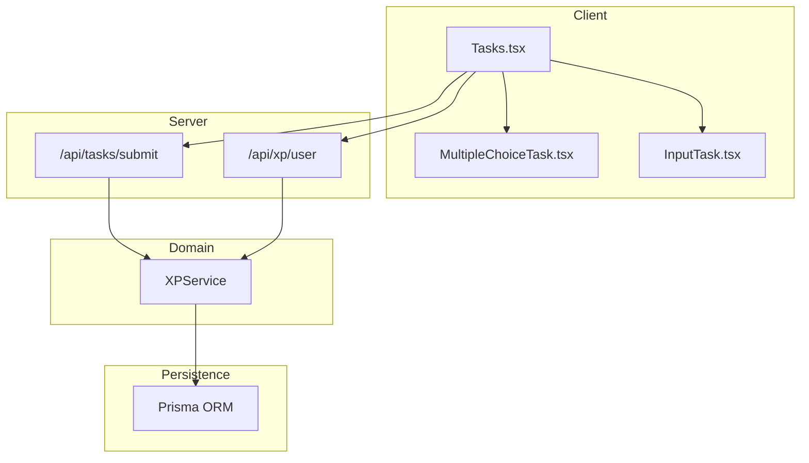
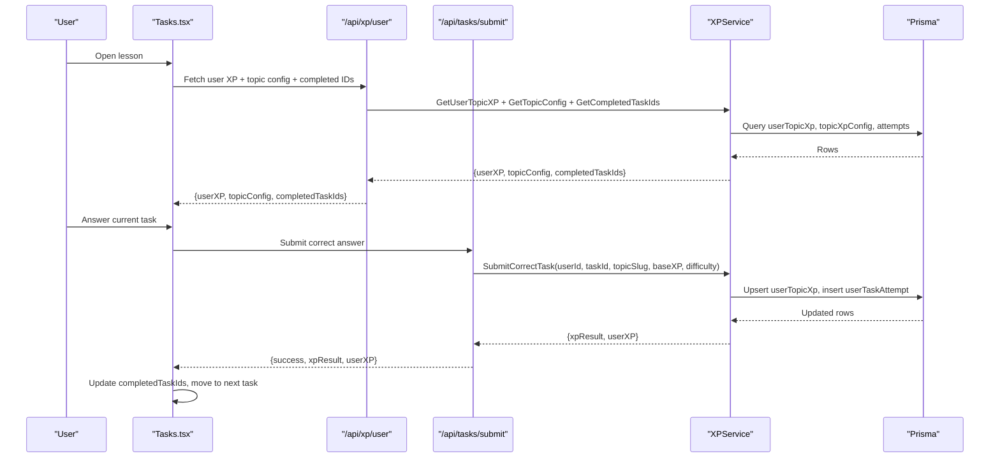
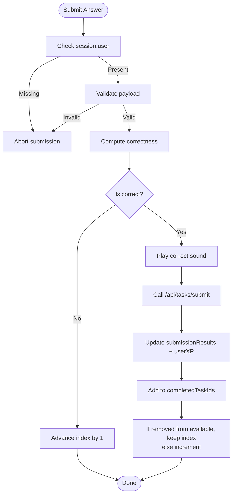
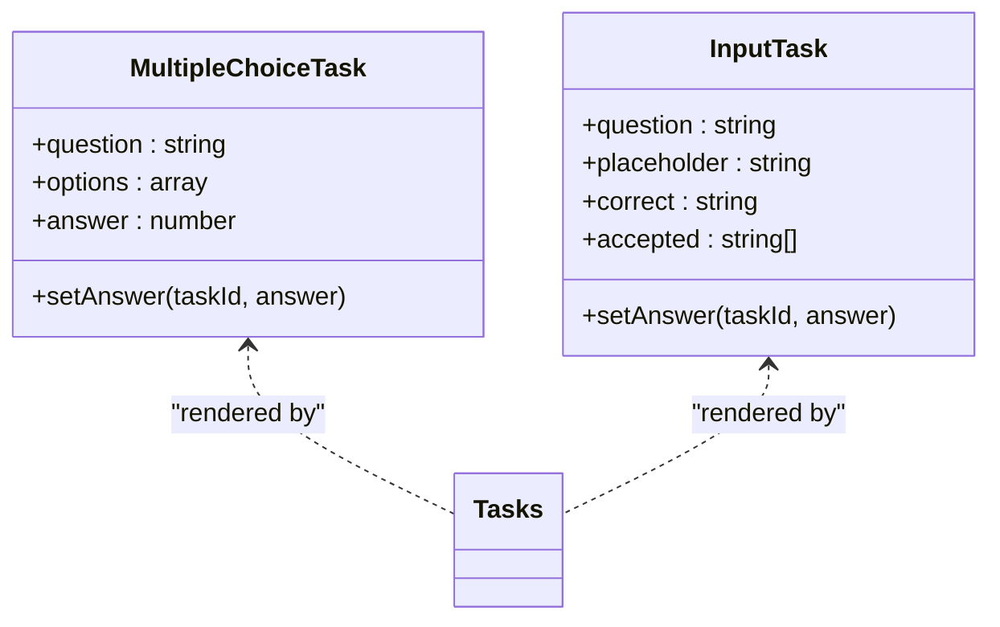
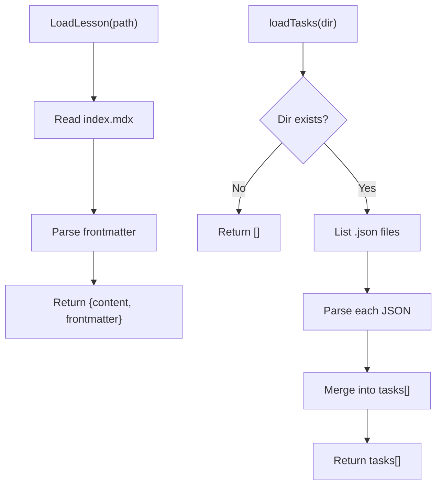
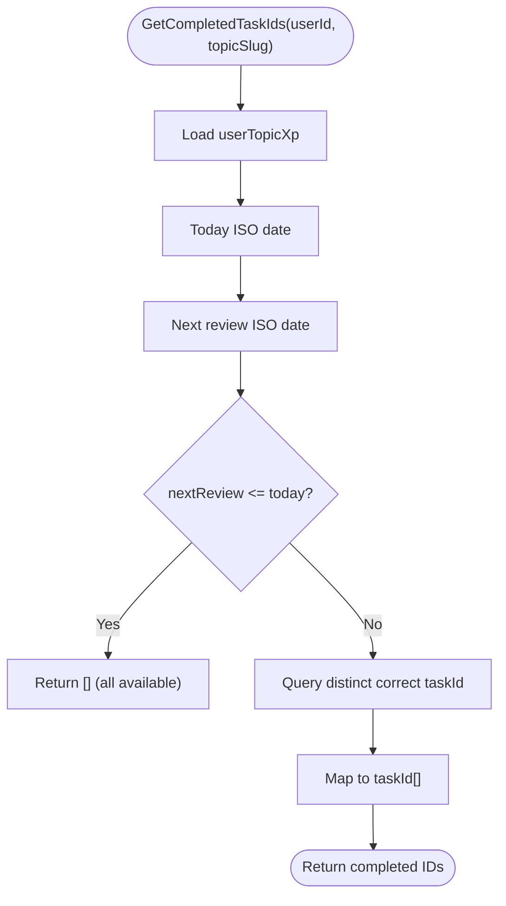
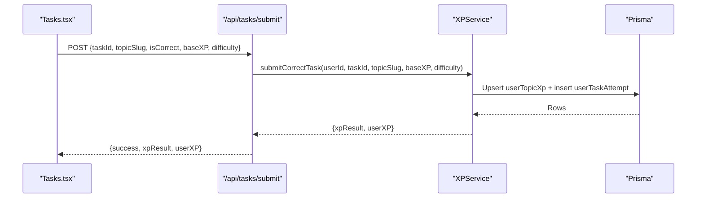
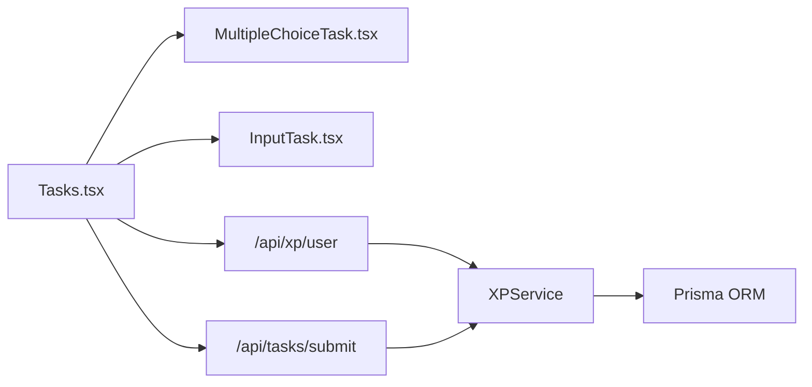

# Lesson Progression & Navigation

<cite>
**Referenced Files in This Document**
- [Tasks.tsx](file://components/tasks/Tasks.tsx)
- [MultipleChoiceTask.tsx](file://components/tasks/MultipleChoiceTask.tsx)
- [InputTask.tsx](file://components/tasks/InputTask.tsx)
- [loadTasks.ts](file://lib/loadTasks.ts)
- [loadLesson.ts](file://lib/loadLesson.ts)
- [route.ts](file://app/api/tasks/submit/route.ts)
- [route.ts](file://app/api/xp/user/route.ts)
- [xpService.ts](file://lib/xp/xpService.ts)
- [task.ts](file://types/task.ts)
- [lesson.ts](file://types/lesson.ts)
- [xp.ts](file://types/xp.ts)
- [index.mdx](file://content/math/addition_and_subtraction_of_fractions/index.mdx)
- [config.json](file://content/math/addition_and_subtraction_of_fractions/config.json)
</cite>

## Table of Contents
1. [Introduction](#introduction)
2. [Project Structure](#project-structure)
3. [Core Components](#core-components)
4. [Architecture Overview](#architecture-overview)
5. [Detailed Component Analysis](#detailed-component-analysis)
6. [Dependency Analysis](#dependency-analysis)
7. [Performance Considerations](#performance-considerations)
8. [Troubleshooting Guide](#troubleshooting-guide)
9. [Conclusion](#conclusion)
10. [Appendices](#appendices)

## Introduction
This document explains the lesson progression system that governs task sequencing, completion tracking, and user navigation. It covers how tasks are filtered for availability, how completion states are managed, and how users advance automatically or manually. It also documents navigation controls, progress indicators, milestone achievements, lesson loading patterns, and user journey optimization. Edge cases such as empty task sets, task reordering, and cross-session progress persistence are addressed.

## Project Structure
The lesson progression system spans client-side UI components, server-side APIs, and persistent XP/SRS logic backed by a database. Key areas:
- Client task rendering and navigation: Tasks container and task-specific components
- Task loading from content: JSON task files and MDX lesson metadata
- Submission pipeline: Client submission → API → XP service transaction
- XP and SRS engine: Daily XP caps, streak-based multipliers, scheduled reviews

**Diagram sources**
- [Tasks.tsx](file://components/tasks/Tasks.tsx#L1-L441)
- [MultipleChoiceTask.tsx](file://components/tasks/MultipleChoiceTask.tsx#L1-L72)
- [InputTask.tsx](file://components/tasks/InputTask.tsx#L1-L97)
- [route.ts](file://app/api/tasks/submit/route.ts#L1-L59)
- [route.ts](file://app/api/xp/user/route.ts#L1-L41)
- [xpService.ts](file://lib/xp/xpService.ts#L1-L795)

**Section sources**
- [Tasks.tsx](file://components/tasks/Tasks.tsx#L1-L441)
- [route.ts](file://app/api/tasks/submit/route.ts#L1-L59)
- [route.ts](file://app/api/xp/user/route.ts#L1-L41)
- [xpService.ts](file://lib/xp/xpService.ts#L1-L795)

## Core Components
- Tasks container orchestrates task availability, navigation, submission, and XP display.
- Task components render question types and capture user answers.
- Loading utilities read lesson content and tasks from disk.
- API endpoints expose XP retrieval and task submission.
- XP service encapsulates SRS scheduling, XP calculations, and daily caps.

Key responsibilities:
- Filter available tasks by completed IDs and hot-topic state
- Track current task index and submission results
- Persist completion state and XP across sessions
- Enforce daily XP multipliers and scheduled review windows

**Section sources**
- [Tasks.tsx](file://components/tasks/Tasks.tsx#L12-L137)
- [MultipleChoiceTask.tsx](file://components/tasks/MultipleChoiceTask.tsx#L11-L26)
- [InputTask.tsx](file://components/tasks/InputTask.tsx#L11-L38)
- [loadTasks.ts](file://lib/loadTasks.ts#L5-L30)
- [route.ts](file://app/api/tasks/submit/route.ts#L6-L58)
- [route.ts](file://app/api/xp/user/route.ts#L5-L40)
- [xpService.ts](file://lib/xp/xpService.ts#L118-L293)

## Architecture Overview
The system follows a layered pattern:
- UI layer: Tasks.tsx renders the current task and navigation controls
- Domain layer: XPService performs XP calculation, SRS scheduling, and daily caps
- Persistence layer: Prisma ORM stores user progress, attempts, and topic configs
- API layer: Next.js routes validate auth, delegate to XPService, and return structured responses

**Diagram sources**
- [Tasks.tsx](file://components/tasks/Tasks.tsx#L47-L122)
- [route.ts](file://app/api/xp/user/route.ts#L25-L32)
- [route.ts](file://app/api/tasks/submit/route.ts#L34-L47)
- [xpService.ts](file://lib/xp/xpService.ts#L118-L293)

## Detailed Component Analysis

### Tasks Container: Availability, Navigation, and Completion
- Available tasks filtering: Filters out completed tasks using a Set of completed IDs.
- Automatic advancement: On correct submission, adds task to completed set; if removal occurs, the next available task becomes current; otherwise increments index.
- Navigation controls: Previous/Next buttons adjust the current index; disabled when at edges.
- Progress indicators: XP bar, level, daily energy battery, and next review countdown.
- Milestone achievements: Level thresholds computed from topic config; messages reflect level-ups.

**Diagram sources**
- [Tasks.tsx](file://components/tasks/Tasks.tsx#L64-L122)

**Section sources**
- [Tasks.tsx](file://components/tasks/Tasks.tsx#L125-L137)
- [Tasks.tsx](file://components/tasks/Tasks.tsx#L144-L146)
- [Tasks.tsx](file://components/tasks/Tasks.tsx#L205-L420)

### Task Components: Rendering and Interaction
- Multiple choice: Renders options, tracks selection, disables after selection, shows feedback and optional comments.
- Input task: Normalizes answers (case and whitespace), compares against accepted list or canonical answer, and shows correctness feedback.

**Diagram sources**
- [MultipleChoiceTask.tsx](file://components/tasks/MultipleChoiceTask.tsx#L11-L26)
- [InputTask.tsx](file://components/tasks/InputTask.tsx#L11-L38)
- [task.ts](file://types/task.ts#L1-L25)

**Section sources**
- [MultipleChoiceTask.tsx](file://components/tasks/MultipleChoiceTask.tsx#L11-L71)
- [InputTask.tsx](file://components/tasks/InputTask.tsx#L11-L96)
- [task.ts](file://types/task.ts#L1-L25)

### Lesson Loading Patterns
- Lesson content: MDX frontmatter provides metadata (title, description, difficulty).
- Topic config: JSON config defines slug, title, difficulty, category, tags, and ordering.
- Task loading: Reads all JSON files in a tasks directory and merges into a single array.

**Diagram sources**
- [loadLesson.ts](file://lib/loadLesson.ts#L6-L16)
- [loadTasks.ts](file://lib/loadTasks.ts#L5-L30)
- [index.mdx](file://content/math/addition_and_subtraction_of_fractions/index.mdx#L1-L14)
- [config.json](file://content/math/addition_and_subtraction_of_fractions/config.json#L1-L10)

**Section sources**
- [loadLesson.ts](file://lib/loadLesson.ts#L6-L16)
- [loadTasks.ts](file://lib/loadTasks.ts#L5-L30)
- [lesson.ts](file://types/lesson.ts#L1-L7)
- [index.mdx](file://content/math/addition_and_subtraction_of_fractions/index.mdx#L1-L14)
- [config.json](file://content/math/addition_and_subtraction_of_fractions/config.json#L1-L10)

### Task Availability Algorithms
- Hot topic window: If the next review date is today or past, all tasks are available (empty completed list).
- Outside hot window: Only previously correct attempts count as completed; future tasks remain locked until review time.

**Diagram sources**
- [xpService.ts](file://lib/xp/xpService.ts#L759-L793)

**Section sources**
- [xpService.ts](file://lib/xp/xpService.ts#L759-L793)

### Submission Pipeline and SRS Mechanics
- Submission endpoint validates auth and payload, then delegates to XPService.
- XPService computes XP based on base XP, daily multiplier tier, and SRS stage.
- SRS scheduling advances review dates according to configured intervals; early reviews yield reduced XP.

**Diagram sources**
- [route.ts](file://app/api/tasks/submit/route.ts#L34-L47)
- [xpService.ts](file://lib/xp/xpService.ts#L118-L293)

**Section sources**
- [route.ts](file://app/api/tasks/submit/route.ts#L6-L58)
- [xpService.ts](file://lib/xp/xpService.ts#L118-L293)

### Progress Indicators and Milestones
- XP bar: Shows current XP vs. next level threshold; computed from topic config level thresholds.
- Level badge: Reflects current level; messages indicate level-ups.
- Daily energy battery: Tracks remaining full/half XP slots per day based on dailyFullTasks and dailyHalfTasks.
- Hot topic indicator: Highlights when next review date is due or overdue.
- Milestones: Level thresholds and mastery progression via SRS stages.

**Section sources**
- [Tasks.tsx](file://components/tasks/Tasks.tsx#L205-L420)
- [xpService.ts](file://lib/xp/xpService.ts#L71-L89)

### Navigation Controls
- Previous/Next buttons: Controlled by current index and available tasks length.
- Behavior: Prevents navigating beyond bounds; resets index to 0 if needed after empty state.

**Section sources**
- [Tasks.tsx](file://components/tasks/Tasks.tsx#L415-L420)
- [Tasks.tsx](file://components/tasks/Tasks.tsx#L171-L176)

## Dependency Analysis
- Tasks.tsx depends on:
  - Task components for rendering
  - NextAuth session for user identity
  - XPService via API endpoints for XP and completion state
- API endpoints depend on:
  - XPService for all computations
  - Prisma for persistence
- XPService depends on:
  - Topic config and user progress rows
  - SRS intervals and daily caps

**Diagram sources**
- [Tasks.tsx](file://components/tasks/Tasks.tsx#L1-L441)
- [route.ts](file://app/api/xp/user/route.ts#L1-L41)
- [route.ts](file://app/api/tasks/submit/route.ts#L1-L59)
- [xpService.ts](file://lib/xp/xpService.ts#L1-L795)

**Section sources**
- [Tasks.tsx](file://components/tasks/Tasks.tsx#L1-L441)
- [route.ts](file://app/api/xp/user/route.ts#L1-L41)
- [route.ts](file://app/api/tasks/submit/route.ts#L1-L59)
- [xpService.ts](file://lib/xp/xpService.ts#L1-L795)

## Performance Considerations
- Client-side filtering: Using a Set for completed IDs ensures O(1) lookup during availability computation.
- Memoization: Available tasks recomputed via useMemo based on tasks and completed IDs to avoid unnecessary renders.
- API batching: Fetch XP and topic config in a single request; avoid redundant network calls.
- Database queries: XPService consolidates reads/writes into transactions to minimize round-trips.

[No sources needed since this section provides general guidance]

## Troubleshooting Guide
Common issues and resolutions:
- Unauthorized access: Ensure session is present before calling XP or submission endpoints.
- Missing required fields: Verify taskId and topicSlug are provided on submission.
- Empty task sets: When hot topic is not due, completedTaskIds filter locks future tasks; wait until next review date.
- Task reordering: Tasks are presented in the order returned by the available tasks array; reordering requires updating the underlying task list and ensuring stable IDs.
- Progress persistence: Cross-session progress relies on userTopicXp and userTaskAttempt records; ensure database connectivity and proper user identification.

**Section sources**
- [route.ts](file://app/api/tasks/submit/route.ts#L10-L25)
- [route.ts](file://app/api/xp/user/route.ts#L9-L21)
- [xpService.ts](file://lib/xp/xpService.ts#L759-L793)

## Conclusion
The lesson progression system integrates task rendering, availability filtering, submission handling, and XP/SRS mechanics into a cohesive learning pipeline. Users navigate through lessons with clear progress indicators, automatic advancement on correct answers, and structured milestones. The design supports robust edge cases, including empty task sets during review windows, task reordering, and reliable progress persistence across sessions.

[No sources needed since this section summarizes without analyzing specific files]

## Appendices

### Example: Lesson Loading Pattern
- Load lesson metadata from MDX frontmatter.
- Load topic config for UI and scheduling.
- Load tasks from JSON files and pass to the Tasks container.

**Section sources**
- [loadLesson.ts](file://lib/loadLesson.ts#L6-L16)
- [loadTasks.ts](file://lib/loadTasks.ts#L5-L30)
- [index.mdx](file://content/math/addition_and_subtraction_of_fractions/index.mdx#L1-L14)
- [config.json](file://content/math/addition_and_subtraction_of_fractions/config.json#L1-L10)

### Example: Task Availability Algorithm
- If the next review date is today or earlier, return no completed IDs (all tasks available).
- Otherwise, return IDs of tasks answered correctly to lock future tasks until review.

**Section sources**
- [xpService.ts](file://lib/xp/xpService.ts#L759-L793)

### Example: Automatic Task Advancement
- On correct submission, update completed IDs and either remove the current task from the available set or increment index.

**Section sources**
- [Tasks.tsx](file://components/tasks/Tasks.tsx#L104-L116)