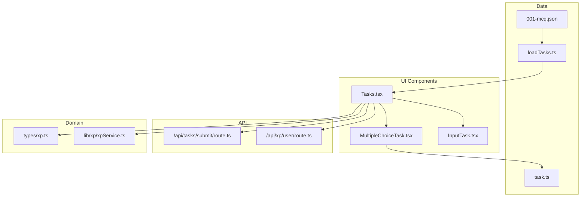
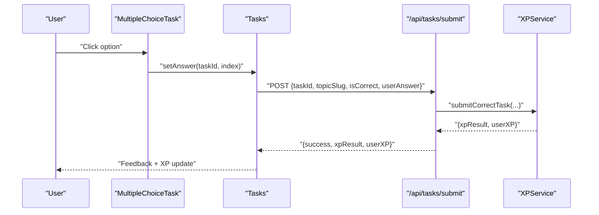
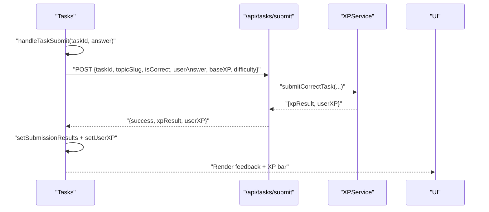
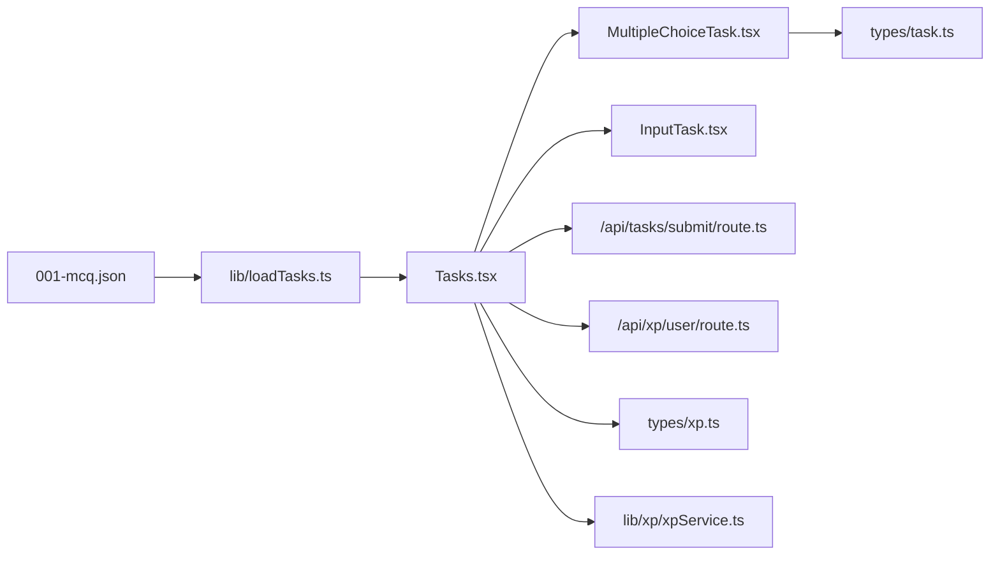

# Multiple Choice Tasks

<cite>
**Referenced Files in This Document**
- [MultipleChoiceTask.tsx](file://components/tasks/MultipleChoiceTask.tsx)
- [Tasks.tsx](file://components/tasks/Tasks.tsx)
- [task.ts](file://types/task.ts)
- [001-mcq.json](file://content/math/addition_and_subtraction_of_fractions/tasks/001-mcq.json)
- [InputTask.tsx](file://components/tasks/InputTask.tsx)
- [loadTasks.ts](file://lib/loadTasks.ts)
- [route.ts](file://app/api/tasks/submit/route.ts)
- [route.ts](file://app/api/xp/user/route.ts)
- [xp.ts](file://types/xp.ts)
- [xpService.ts](file://lib/xp/xpService.ts)
</cite>

## Table of Contents
1. [Introduction](#introduction)
2. [Project Structure](#project-structure)
3. [Core Components](#core-components)
4. [Architecture Overview](#architecture-overview)
5. [Detailed Component Analysis](#detailed-component-analysis)
6. [Dependency Analysis](#dependency-analysis)
7. [Performance Considerations](#performance-considerations)
8. [Troubleshooting Guide](#troubleshooting-guide)
9. [Conclusion](#conclusion)
10. [Appendices](#appendices)

## Introduction
This document explains the multiple choice task component system used for mathematical exercises. It covers how tasks render, how user selections are captured, how immediate feedback is shown, and how correctness is validated. It also documents the component props, event handling patterns, integration with the main task system, examples of task configuration, accessibility features, styling and responsive design considerations, and user interaction optimizations tailored for math content.

## Project Structure
The multiple choice system is composed of:
- A task renderer component that renders a single multiple choice item
- A task container that orchestrates navigation, submission, XP calculation, and UI feedback
- Task data loaded from JSON files
- API endpoints for submitting answers and retrieving user XP
- Types that define the shape of tasks and XP-related data



**Diagram sources**
- [MultipleChoiceTask.tsx](file://components/tasks/MultipleChoiceTask.tsx#L1-L72)
- [Tasks.tsx](file://components/tasks/Tasks.tsx#L1-L441)
- [InputTask.tsx](file://components/tasks/InputTask.tsx#L1-L97)
- [task.ts](file://types/task.ts#L1-L25)
- [001-mcq.json](file://content/math/addition_and_subtraction_of_fractions/tasks/001-mcq.json#L1-L250)
- [loadTasks.ts](file://lib/loadTasks.ts#L1-L31)
- [route.ts](file://app/api/tasks/submit/route.ts#L1-L59)
- [route.ts](file://app/api/xp/user/route.ts#L1-L41)
- [xp.ts](file://types/xp.ts#L1-L131)
- [xpService.ts](file://lib/xp/xpService.ts#L1-L795)

**Section sources**
- [MultipleChoiceTask.tsx](file://components/tasks/MultipleChoiceTask.tsx#L1-L72)
- [Tasks.tsx](file://components/tasks/Tasks.tsx#L1-L441)
- [task.ts](file://types/task.ts#L1-L25)
- [001-mcq.json](file://content/math/addition_and_subtraction_of_fractions/tasks/001-mcq.json#L1-L250)
- [loadTasks.ts](file://lib/loadTasks.ts#L1-L31)
- [route.ts](file://app/api/tasks/submit/route.ts#L1-L59)
- [route.ts](file://app/api/xp/user/route.ts#L1-L41)
- [xp.ts](file://types/xp.ts#L1-L131)
- [xpService.ts](file://lib/xp/xpService.ts#L1-L795)

## Core Components
- MultipleChoiceTask: Renders a single multiple choice question with options, handles selection, and displays correctness and optional hints.
- Tasks: Manages the task lifecycle, tracks answers, submits to the backend, updates XP, and controls navigation between tasks.
- InputTask: Provides a parallel input-based task type for comparison and completeness of the task system.
- Task data: JSON files define multiple choice tasks with question text, options, correct answer index, and optional comments.
- Types: Define the structure of tasks and XP-related domain objects.

Key responsibilities:
- Rendering: Present question text and options; apply visual feedback for selected, correct, and incorrect choices.
- Selection handling: Capture a single selection per task; prevent re-selection after lock.
- Immediate feedback: Show correctness immediately upon selection; display option-specific comments for incorrect choices.
- Validation: Compare selected index with stored correct answer index.
- Integration: Bridge UI to backend via submission endpoint and XP service.

**Section sources**
- [MultipleChoiceTask.tsx](file://components/tasks/MultipleChoiceTask.tsx#L11-L72)
- [Tasks.tsx](file://components/tasks/Tasks.tsx#L12-L200)
- [InputTask.tsx](file://components/tasks/InputTask.tsx#L11-L97)
- [task.ts](file://types/task.ts#L1-L25)
- [001-mcq.json](file://content/math/addition_and_subtraction_of_fractions/tasks/001-mcq.json#L1-L250)

## Architecture Overview
The system follows a unidirectional data flow:
- Tasks loads task data from JSON files and maintains local state for answers and submission results.
- On selection, MultipleChoiceTask invokes a callback that posts the answer to the backend.
- The backend validates correctness and calculates XP using the XP service.
- The UI updates XP, shows feedback, and advances to the next task.



**Diagram sources**
- [MultipleChoiceTask.tsx](file://components/tasks/MultipleChoiceTask.tsx#L17-L22)
- [Tasks.tsx](file://components/tasks/Tasks.tsx#L64-L122)
- [route.ts](file://app/api/tasks/submit/route.ts#L6-L58)
- [xpService.ts](file://lib/xp/xpService.ts#L118-L293)

## Detailed Component Analysis

### MultipleChoiceTask Component
Purpose:
- Render a single multiple choice question with options.
- Track and enforce a single selection per task.
- Provide immediate visual feedback for correctness and show option comments on incorrect selection.

Rendering logic:
- Displays question text and a vertical list of options.
- Applies distinct styles for:
  - Unselected options
  - Selected option
  - Correct option (after selection)
  - Incorrect option (after selection)
- Disables further interaction after selection.

Selection handling:
- Stores the selected index locally.
- Invokes the parent callback with taskId and selected index.
- Resets selection when the task prop changes.

Immediate feedback:
- Shows a green checkmark for correct option.
- Shows a red cross for incorrect option.
- Displays an optional comment below an incorrect option.

Accessibility:
- Uses semantic button elements for each option.
- Disabled state prevents re-selection after lock.
- Visual contrast maintained for correct/incorrect states.

Styling and responsiveness:
- Responsive padding and spacing for mobile and desktop.
- Hover and focus-friendly affordances.
- Tailwind utility classes applied consistently.

Complexity:
- Rendering loop over options is O(n) with n options.
- State updates are constant-time.

**Section sources**
- [MultipleChoiceTask.tsx](file://components/tasks/MultipleChoiceTask.tsx#L11-L72)

#### Class Diagram
```mermaid
classDiagram
class MultipleChoiceTask {
+props.task : TMultipleChoiceTask
+props.setAnswer(taskId, answer)
-selected : number|null
+handleSelect(index)
+render()
}
class TMultipleChoiceTask {
+string id
+string type="multiple-choice"
+string question
+{text, comment?}[] options
+number answer
+string|undefined difficulty
+number|undefined baseXP
}
MultipleChoiceTask --> TMultipleChoiceTask : "renders"
```

**Diagram sources**
- [MultipleChoiceTask.tsx](file://components/tasks/MultipleChoiceTask.tsx#L6-L22)
- [task.ts](file://types/task.ts#L1-L10)

### Tasks Container
Purpose:
- Manage the entire task session: loading tasks, tracking answers, submitting, updating XP, and navigating tasks.
- Provide XP and topic energy feedback.
- Control availability of navigation buttons.

Key behaviors:
- Loads tasks from JSON via a loader utility.
- Filters out completed tasks using XP service data.
- Submits answers to the backend and updates submission results.
- Plays sound feedback on correct answers.
- Updates user XP and completion set based on submission results.

Submission flow:
- Validates session and prevents concurrent submissions.
- Determines correctness based on task type.
- Posts to the submission endpoint with task metadata.
- Updates state with XP result and user XP.

Navigation:
- Maintains current task index and moves forward/backward.
- Shows completion screen when all available tasks are done.

**Section sources**
- [Tasks.tsx](file://components/tasks/Tasks.tsx#L12-L441)
- [loadTasks.ts](file://lib/loadTasks.ts#L5-L30)

#### Sequence Diagram: Answer Submission and Feedback


**Diagram sources**
- [Tasks.tsx](file://components/tasks/Tasks.tsx#L64-L122)
- [route.ts](file://app/api/tasks/submit/route.ts#L6-L58)
- [xpService.ts](file://lib/xp/xpService.ts#L118-L293)

### Task Data Model and Examples
Task model:
- Multiple choice tasks include id, type marker, question text, options array, correct answer index, difficulty, and base XP.
- Options include text and an optional comment shown when the user selects incorrectly.

Example configuration:
- See the JSON file containing multiple-choice tasks for a topic, including question text, options, and answer indices.

Validation:
- Correctness is determined by comparing the selected index with the stored answer index.

Shuffling:
- No explicit shuffling algorithm is present in the current implementation. Options appear in the order defined in the JSON.

**Section sources**
- [task.ts](file://types/task.ts#L1-L10)
- [001-mcq.json](file://content/math/addition_and_subtraction_of_fractions/tasks/001-mcq.json#L1-L250)

### API Integration and XP Calculation
Submission endpoint:
- Requires an authenticated session.
- Validates presence of required fields.
- On correct answer, delegates to XP service to compute XP and update user state.

XP service:
- Computes XP based on daily multipliers, difficulty, and base XP.
- Manages SRS stages and next review dates.
- Returns XP result and updated user XP to the UI.

User XP retrieval:
- Endpoint fetches user topic XP, topic config, and completed task IDs to filter available tasks.

**Section sources**
- [route.ts](file://app/api/tasks/submit/route.ts#L6-L58)
- [route.ts](file://app/api/xp/user/route.ts#L5-L40)
- [xp.ts](file://types/xp.ts#L50-L131)
- [xpService.ts](file://lib/xp/xpService.ts#L118-L293)

### Accessibility Features
- Buttons are keyboard focusable and actionable.
- Disabled state communicates non-interactive state after selection.
- Visual indicators (checkmarks/crosses) complement textual feedback.
- Contrast and color semantics clearly distinguish correct/incorrect states.

Recommendations:
- Add aria-live regions for dynamic feedback messages.
- Ensure focus moves to feedback after selection.
- Provide skip-links for long question lists.

**Section sources**
- [MultipleChoiceTask.tsx](file://components/tasks/MultipleChoiceTask.tsx#L39-L67)

### Styling Patterns and Responsive Design
- Consistent spacing and padding for readability across devices.
- Tailwind utility classes for responsive layouts.
- Hover and focus states improve interactivity.
- Disabled states communicate unavailability.

Responsive considerations:
- Flexible widths and padding adapt to small screens.
- Large touch targets for mobile interaction.

**Section sources**
- [MultipleChoiceTask.tsx](file://components/tasks/MultipleChoiceTask.tsx#L29-L70)

### User Interaction Optimization for Math
- Immediate feedback reduces cognitive load.
- Option comments help learners understand mistakes.
- Navigation buttons enable controlled pacing.
- Sound cues reinforce correctness.

**Section sources**
- [Tasks.tsx](file://components/tasks/Tasks.tsx#L34-L41)
- [MultipleChoiceTask.tsx](file://components/tasks/MultipleChoiceTask.tsx#L59-L64)

## Dependency Analysis
The multiple choice system depends on:
- Task types for shape validation
- Task data loader for JSON parsing
- API routes for submission and XP retrieval
- XP service for calculations and persistence
- UI components for rendering and interaction



**Diagram sources**
- [MultipleChoiceTask.tsx](file://components/tasks/MultipleChoiceTask.tsx#L3-L4)
- [Tasks.tsx](file://components/tasks/Tasks.tsx#L3-L11)
- [InputTask.tsx](file://components/tasks/InputTask.tsx#L3-L4)
- [route.ts](file://app/api/tasks/submit/route.ts#L1-L59)
- [route.ts](file://app/api/xp/user/route.ts#L1-L41)
- [xp.ts](file://types/xp.ts#L1-L131)
- [xpService.ts](file://lib/xp/xpService.ts#L1-L795)
- [001-mcq.json](file://content/math/addition_and_subtraction_of_fractions/tasks/001-mcq.json#L1-L250)
- [loadTasks.ts](file://lib/loadTasks.ts#L1-L31)

**Section sources**
- [MultipleChoiceTask.tsx](file://components/tasks/MultipleChoiceTask.tsx#L1-L72)
- [Tasks.tsx](file://components/tasks/Tasks.tsx#L1-L441)
- [task.ts](file://types/task.ts#L1-L25)
- [001-mcq.json](file://content/math/addition_and_subtraction_of_fractions/tasks/001-mcq.json#L1-L250)
- [loadTasks.ts](file://lib/loadTasks.ts#L1-L31)
- [route.ts](file://app/api/tasks/submit/route.ts#L1-L59)
- [route.ts](file://app/api/xp/user/route.ts#L1-L41)
- [xp.ts](file://types/xp.ts#L1-L131)
- [xpService.ts](file://lib/xp/xpService.ts#L1-L795)

## Performance Considerations
- Rendering: Single selection per task minimizes re-renders; option list rendering is O(n).
- Network: Debounce or disable repeated submissions; the container prevents concurrent submissions.
- Memory: Keep only current task and results in memory; avoid storing entire history unless needed.
- UX: Preload sounds and defer heavy assets to reduce perceived latency.

## Troubleshooting Guide
Common issues and resolutions:
- No feedback after selecting an option:
  - Verify the callback is passed down and invoked on selection.
  - Ensure the submission endpoint receives the correct payload.
- Incorrect answer marked as correct:
  - Confirm the answer index matches the intended correct option.
  - Check that the submission endpoint validates correctness before calculating XP.
- XP not updating:
  - Ensure the response includes user XP and that the UI state is updated accordingly.
- Tasks not filtering correctly:
  - Verify completed task IDs are fetched and applied to filter available tasks.

**Section sources**
- [MultipleChoiceTask.tsx](file://components/tasks/MultipleChoiceTask.tsx#L17-L22)
- [Tasks.tsx](file://components/tasks/Tasks.tsx#L64-L122)
- [route.ts](file://app/api/tasks/submit/route.ts#L27-L32)
- [route.ts](file://app/api/xp/user/route.ts#L23-L32)

## Conclusion
The multiple choice task system provides a clear, accessible, and efficient way to render math problems, capture user selections, and deliver immediate feedback. Its integration with the XP service and API ensures meaningful learning progression and engagement. The modular design allows easy extension to support shuffling, advanced feedback, and additional task types.

## Appendices

### Props Reference: MultipleChoiceTask
- task: TMultipleChoiceTask
  - id: Unique identifier
  - type: Literal "multiple-choice"
  - question: Question text
  - options: Array of { text, comment? }
  - answer: Index of correct option
  - difficulty: Optional difficulty level
  - baseXP: Optional base XP value
- setAnswer?: (taskId: string, answer: number) => void

**Section sources**
- [MultipleChoiceTask.tsx](file://components/tasks/MultipleChoiceTask.tsx#L6-L9)
- [task.ts](file://types/task.ts#L1-L10)

### Example Task Configuration
- See the JSON file for a topic’s multiple choice tasks, including question text, options, and answer indices.

**Section sources**
- [001-mcq.json](file://content/math/addition_and_subtraction_of_fractions/tasks/001-mcq.json#L1-L250)

### Answer Shuffling Algorithms
- Not implemented in the current codebase. To add shuffling:
  - Shuffle indices before rendering options.
  - Track original answer index and adjust it accordingly.
  - Ensure submission compares against the shuffled correct index.

[No sources needed since this section provides general guidance]

### Accessibility Checklist
- Ensure all interactive elements are keyboard accessible.
- Provide visible focus indicators.
- Use ARIA attributes for dynamic feedback.
- Maintain sufficient color contrast for correctness indicators.

[No sources needed since this section provides general guidance]