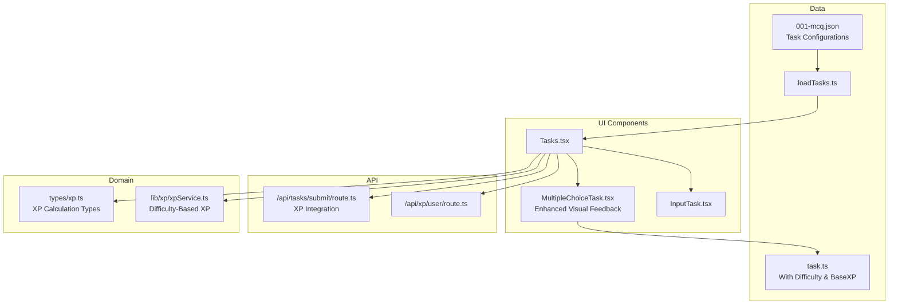
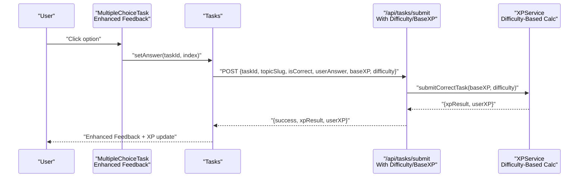
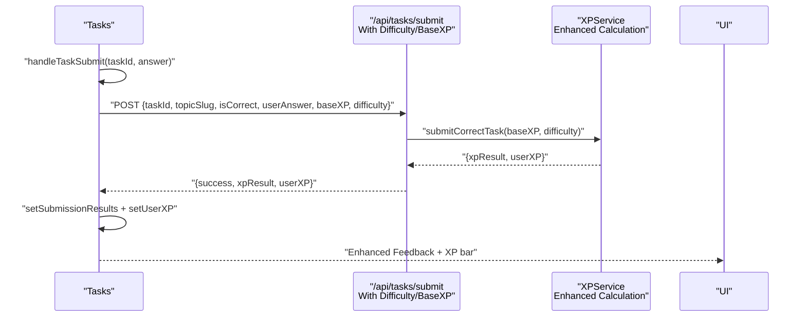
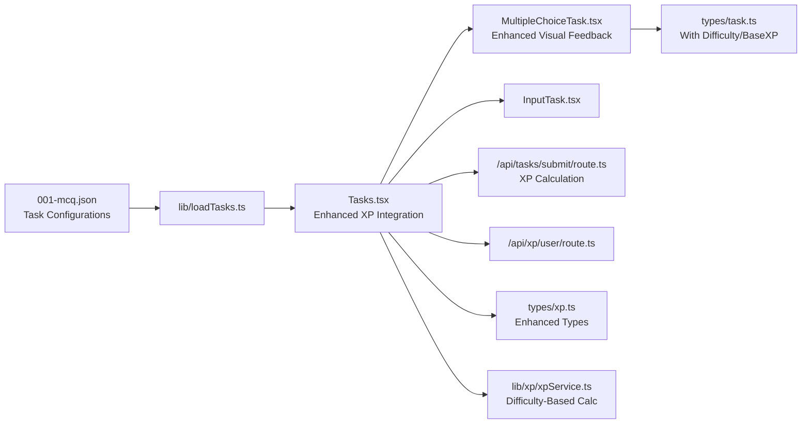

# Multiple Choice Tasks

<cite>
**Referenced Files in This Document**
- [MultipleChoiceTask.tsx](file://components/tasks/MultipleChoiceTask.tsx)
- [Tasks.tsx](file://components/tasks/Tasks.tsx)
- [task.ts](file://types/task.ts)
- [001-mcq.json](file://content/math/addition_and_subtraction_of_fractions/tasks/001-mcq.json)
- [InputTask.tsx](file://components/tasks/InputTask.tsx)
- [loadTasks.ts](file://lib/loadTasks.ts)
- [route.ts](file://app/api/tasks/submit/route.ts)
- [route.ts](file://app/api/xp/user/route.ts)
- [xp.ts](file://types/xp.ts)
- [xpService.ts](file://lib/xp/xpService.ts)
</cite>

## Update Summary
**Changes Made**
- Enhanced MultipleChoiceTask component with improved visual feedback using ✓ for correct and ✗ for incorrect answers
- Added better color schemes with green for correct answers and red for incorrect answers
- Integrated difficulty and baseXP properties for XP calculation
- Improved accessibility with proper button semantics and disabled states
- Enhanced styling with Tailwind CSS utilities for better visual feedback

## Table of Contents
1. [Introduction](#introduction)
2. [Project Structure](#project-structure)
3. [Core Components](#core-components)
4. [Architecture Overview](#architecture-overview)
5. [Detailed Component Analysis](#detailed-component-analysis)
6. [Dependency Analysis](#dependency-analysis)
7. [Performance Considerations](#performance-considerations)
8. [Troubleshooting Guide](#troubleshooting-guide)
9. [Conclusion](#conclusion)
10. [Appendices](#appendices)

## Introduction
This document explains the multiple choice task component system used for mathematical exercises. It covers how tasks render, how user selections are captured, how immediate feedback is shown, and how correctness is validated. It also documents the component props, event handling patterns, integration with the main task system, examples of task configuration, accessibility features, styling and responsive design considerations, and user interaction optimizations tailored for math content.

**Updated** The MultipleChoiceTask component now features enhanced visual feedback with ✓ and ✗ icons, improved color schemes, and better accessibility attributes for a more engaging learning experience.

## Project Structure
The multiple choice system is composed of:
- A task renderer component that renders a single multiple choice item with enhanced visual feedback
- A task container that orchestrates navigation, submission, XP calculation, and UI feedback
- Task data loaded from JSON files with difficulty and baseXP properties
- API endpoints for submitting answers and retrieving user XP with XP calculation integration
- Types that define the shape of tasks and XP-related data



**Diagram sources**
- [MultipleChoiceTask.tsx](file://components/tasks/MultipleChoiceTask.tsx#L1-L76)
- [Tasks.tsx](file://components/tasks/Tasks.tsx#L1-L761)
- [InputTask.tsx](file://components/tasks/InputTask.tsx#L1-L97)
- [task.ts](file://types/task.ts#L1-L25)
- [001-mcq.json](file://content/math/addition_and_subtraction_of_fractions/tasks/001-mcq.json#L1-L250)
- [loadTasks.ts](file://lib/loadTasks.ts#L1-L31)
- [route.ts](file://app/api/tasks/submit/route.ts#L1-L67)
- [route.ts](file://app/api/xp/user/route.ts#L1-L41)
- [xp.ts](file://types/xp.ts#L1-L131)
- [xpService.ts](file://lib/xp/xpService.ts#L1-L902)

**Section sources**
- [MultipleChoiceTask.tsx](file://components/tasks/MultipleChoiceTask.tsx#L1-L76)
- [Tasks.tsx](file://components/tasks/Tasks.tsx#L1-L761)
- [task.ts](file://types/task.ts#L1-L25)
- [001-mcq.json](file://content/math/addition_and_subtraction_of_fractions/tasks/001-mcq.json#L1-L250)
- [loadTasks.ts](file://lib/loadTasks.ts#L1-L31)
- [route.ts](file://app/api/tasks/submit/route.ts#L1-L67)
- [route.ts](file://app/api/xp/user/route.ts#L1-L41)
- [xp.ts](file://types/xp.ts#L1-L131)
- [xpService.ts](file://lib/xp/xpService.ts#L1-L902)

## Core Components
- **MultipleChoiceTask**: Renders a single multiple choice question with enhanced visual feedback, including ✓ for correct answers and ✗ for incorrect answers, with improved color schemes and accessibility attributes.
- **Tasks**: Manages the task lifecycle, tracks answers, submits to the backend with difficulty and baseXP integration, updates XP, and controls navigation between tasks.
- **InputTask**: Provides a parallel input-based task type for comparison and completeness of the task system.
- **Task data**: JSON files define multiple choice tasks with question text, options, correct answer index, difficulty levels, and base XP values.
- **Types**: Define the structure of tasks with enhanced properties for difficulty and XP calculation.

**Updated** Key enhancements include visual feedback icons, improved color schemes, accessibility improvements, and integration with the XP calculation system.

Key responsibilities:
- **Rendering**: Present question text and options with enhanced visual feedback; apply distinct styles for selected, correct, and incorrect choices using ✓ and ✗ icons.
- **Selection handling**: Capture a single selection per task; prevent re-selection after lock with proper accessibility attributes.
- **Immediate feedback**: Show correctness immediately upon selection using visual icons and color schemes; display option-specific comments for incorrect choices.
- **Validation**: Compare selected index with stored correct answer index.
- **Integration**: Bridge UI to backend via submission endpoint with difficulty and baseXP parameters, and XP service for calculation.

**Section sources**
- [MultipleChoiceTask.tsx](file://components/tasks/MultipleChoiceTask.tsx#L11-L76)
- [Tasks.tsx](file://components/tasks/Tasks.tsx#L12-L761)
- [InputTask.tsx](file://components/tasks/InputTask.tsx#L11-L97)
- [task.ts](file://types/task.ts#L1-L25)
- [001-mcq.json](file://content/math/addition_and_subtraction_of_fractions/tasks/001-mcq.json#L1-L250)

## Architecture Overview
The system follows a unidirectional data flow with enhanced XP calculation:
- Tasks loads task data from JSON files with difficulty and baseXP properties and maintains local state for answers and submission results.
- On selection, MultipleChoiceTask invokes a callback that posts the answer along with difficulty and baseXP to the backend.
- The backend validates correctness and calculates XP using the XP service with difficulty-based XP calculation.
- The UI updates XP, shows enhanced feedback with visual icons, and advances to the next task.



**Diagram sources**
- [MultipleChoiceTask.tsx](file://components/tasks/MultipleChoiceTask.tsx#L17-L26)
- [Tasks.tsx](file://components/tasks/Tasks.tsx#L608-L613)
- [route.ts](file://app/api/tasks/submit/route.ts#L42-L48)
- [xpService.ts](file://lib/xp/xpService.ts#L118-L200)

## Detailed Component Analysis

### MultipleChoiceTask Component
**Updated** Enhanced with improved visual feedback and accessibility features.

Purpose:
- Render a single multiple choice question with enhanced visual feedback using ✓ for correct answers and ✗ for incorrect answers.
- Track and enforce a single selection per task with proper accessibility attributes.
- Provide immediate visual feedback for correctness with improved color schemes.

Rendering logic:
- Displays question text and a vertical list of options with enhanced visual feedback.
- Applies distinct styles for different states:
  - Unselected options with hover effects
  - Selected option with visual indication
  - Correct option (after selection) with green ✓ icon and green color scheme
  - Incorrect option (after selection) with red ✗ icon and red color scheme
  - Locked options with grayed-out appearance
- Disables further interaction after selection with proper disabled state.

Selection handling:
- Stores the selected index locally.
- Invokes the parent callback with taskId and selected index.
- Resets selection when the task prop changes.

**Enhanced** Immediate feedback with visual icons:
- Shows a green checkmark ✓ for correct option after selection.
- Shows a red cross ✗ for incorrect option after selection.
- Displays an optional comment below an incorrect option with enhanced styling.

**Enhanced** Accessibility features:
- Uses semantic button elements for each option.
- Disabled state prevents re-selection after lock with proper aria-disabled attribute.
- Visual contrast maintained for correct/incorrect states with improved color schemes.
- Clear visual indicators complement textual feedback.

**Enhanced** Styling and responsiveness:
- Responsive padding and spacing for mobile and desktop.
- Hover and focus-friendly affordances with improved transitions.
- Tailwind utility classes applied consistently with enhanced color schemes.
- Smooth transitions for state changes with duration-200 animation.

Complexity:
- Rendering loop over options is O(n) with n options.
- State updates are constant-time with enhanced visual feedback computation.

**Section sources**
- [MultipleChoiceTask.tsx](file://components/tasks/MultipleChoiceTask.tsx#L11-L76)

#### Class Diagram
```mermaid
classDiagram
class MultipleChoiceTask {
+props.task : TMultipleChoiceTask
+props.setAnswer(taskId, answer)
+props.initialAnswer : number|null
+props.isLocked : boolean
-selected : number|null
+handleSelect(index)
+render()
}
class TMultipleChoiceTask {
+string id
+string type="multiple-choice"
+string question
+{text, comment?}[] options
+number answer
+string|undefined difficulty
+number|undefined baseXP
}
MultipleChoiceTask --> TMultipleChoiceTask : "renders with enhanced feedback"
```

**Diagram sources**
- [MultipleChoiceTask.tsx](file://components/tasks/MultipleChoiceTask.tsx#L6-L11)
- [task.ts](file://types/task.ts#L1-L10)

### Tasks Container
Purpose:
- Manage the entire task session: loading tasks, tracking answers, submitting with difficulty and baseXP integration, updating XP, and navigating tasks.
- Provide XP and topic energy feedback with enhanced XP calculation.
- Control availability of navigation buttons.

Key behaviors:
- Loads tasks from JSON via a loader utility with difficulty and baseXP properties.
- Filters out completed tasks using XP service data.
- Submits answers to the backend with difficulty and baseXP parameters and updates submission results.
- Plays sound feedback on correct answers.
- Updates user XP and completion set based on submission results with enhanced XP calculation.

**Enhanced** Submission flow with XP integration:
- Validates session and prevents concurrent submissions.
- Determines correctness based on task type.
- Posts to the submission endpoint with task metadata including difficulty and baseXP.
- Updates state with XP result and user XP with enhanced calculation.

Navigation:
- Maintains current task index and moves forward/backward.
- Shows completion screen when all available tasks are done.

**Section sources**
- [Tasks.tsx](file://components/tasks/Tasks.tsx#L12-L761)
- [loadTasks.ts](file://lib/loadTasks.ts#L5-L30)

#### Sequence Diagram: Enhanced Answer Submission and Feedback


**Diagram sources**
- [Tasks.tsx](file://components/tasks/Tasks.tsx#L608-L613)
- [route.ts](file://app/api/tasks/submit/route.ts#L42-L48)
- [xpService.ts](file://lib/xp/xpService.ts#L118-L200)

### Task Data Model and Examples
**Updated** Enhanced with difficulty and baseXP properties.

Task model:
- Multiple choice tasks include id, type marker, question text, options array, correct answer index, difficulty levels, and base XP values.
- Options include text and an optional comment shown when the user selects incorrectly.
- Difficulty levels: easy (100 XP), medium/moderate (250 XP), hard (500 XP), or custom baseXP values.

**Enhanced** Example configuration:
- See the JSON file containing multiple-choice tasks for a topic, including question text, options, answer indices, difficulty levels, and base XP values.

Validation:
- Correctness is determined by comparing the selected index with the stored answer index.

Shuffling:
- No explicit shuffling algorithm is present in the current implementation. Options appear in the order defined in the JSON.

**Section sources**
- [task.ts](file://types/task.ts#L1-L10)
- [001-mcq.json](file://content/math/addition_and_subtraction_of_fractions/tasks/001-mcq.json#L1-L250)

### API Integration and Enhanced XP Calculation
**Updated** Enhanced with difficulty and baseXP integration.

Submission endpoint:
- Requires an authenticated session.
- Validates presence of required fields.
- On correct answer, delegates to XP service to compute XP with difficulty-based calculation and update user state.

**Enhanced** XP service calculation:
- Computes XP based on daily multipliers, difficulty levels, and base XP values.
- Supports difficulty-based XP: easy (100), medium/moderate (250), hard (500), or custom baseXP.
- Manages SRS stages and next review dates.
- Returns XP result and updated user XP to the UI with enhanced calculation.

User XP retrieval:
- Endpoint fetches user topic XP, topic config, and completed task IDs to filter available tasks.

**Section sources**
- [route.ts](file://app/api/tasks/submit/route.ts#L17-L48)
- [route.ts](file://app/api/xp/user/route.ts#L5-L40)
- [xp.ts](file://types/xp.ts#L50-L131)
- [xpService.ts](file://lib/xp/xpService.ts#L118-L200)

### Accessibility Features
**Enhanced** Improved accessibility with better visual feedback.

- Buttons are keyboard focusable and actionable with proper focus management.
- Disabled state communicates non-interactive state after selection with aria-disabled attribute.
- **Enhanced** Visual indicators (green ✓ for correct, red ✗ for incorrect) complement textual feedback.
- **Enhanced** Improved color contrast and color semantics clearly distinguish correct/incorrect states.
- **Enhanced** Clear visual feedback improves accessibility for users with visual impairments.

Recommendations:
- Add aria-live regions for dynamic feedback messages.
- Ensure focus moves to feedback after selection.
- Provide skip-links for long question lists.
- **Enhanced** Consider adding aria-labels to visual icons for screen readers.

**Section sources**
- [MultipleChoiceTask.tsx](file://components/tasks/MultipleChoiceTask.tsx#L45-L70)

### Styling Patterns and Responsive Design
**Enhanced** Improved styling with better color schemes and visual feedback.

- Consistent spacing and padding for readability across devices with enhanced responsive design.
- **Enhanced** Tailwind utility classes for responsive layouts with improved color schemes.
- **Enhanced** Hover and focus states improve interactivity with smooth transitions.
- **Enhanced** Disabled states communicate unavailability with proper visual feedback.
- **Enhanced** Color schemes: green for correct answers, red for incorrect answers, with appropriate contrast ratios.

Responsive considerations:
- Flexible widths and padding adapt to small screens with enhanced mobile experience.
- Large touch targets for mobile interaction with improved accessibility.
- **Enhanced** Smooth transitions and animations for better user experience.

**Section sources**
- [MultipleChoiceTask.tsx](file://components/tasks/MultipleChoiceTask.tsx#L33-L74)

### User Interaction Optimization for Math
**Enhanced** Improved user experience with visual feedback and accessibility.

- **Enhanced** Immediate visual feedback with ✓ and ✗ icons reduces cognitive load.
- **Enhanced** Option comments help learners understand mistakes with improved styling.
- **Enhanced** Navigation buttons enable controlled pacing with better accessibility.
- **Enhanced** Sound cues reinforce correctness with proper audio feedback.
- **Enhanced** Clear visual distinction between correct/incorrect answers improves learning effectiveness.

**Section sources**
- [Tasks.tsx](file://components/tasks/Tasks.tsx#L517-L532)
- [MultipleChoiceTask.tsx](file://components/tasks/MultipleChoiceTask.tsx#L57-L68)

## Dependency Analysis
**Updated** Enhanced dependencies with XP calculation integration.

The multiple choice system depends on:
- Task types for shape validation with enhanced difficulty and baseXP properties
- Task data loader for JSON parsing with difficulty configurations
- API routes for submission with XP calculation integration
- XP service for calculations and persistence with difficulty-based XP
- UI components for rendering and interaction with enhanced visual feedback



**Diagram sources**
- [MultipleChoiceTask.tsx](file://components/tasks/MultipleChoiceTask.tsx#L3-L4)
- [Tasks.tsx](file://components/tasks/Tasks.tsx#L3-L11)
- [InputTask.tsx](file://components/tasks/InputTask.tsx#L3-L4)
- [route.ts](file://app/api/tasks/submit/route.ts#L1-L67)
- [route.ts](file://app/api/xp/user/route.ts#L1-L41)
- [xp.ts](file://types/xp.ts#L1-L131)
- [xpService.ts](file://lib/xp/xpService.ts#L1-L902)
- [001-mcq.json](file://content/math/addition_and_subtraction_of_fractions/tasks/001-mcq.json#L1-L250)
- [loadTasks.ts](file://lib/loadTasks.ts#L1-L31)

**Section sources**
- [MultipleChoiceTask.tsx](file://components/tasks/MultipleChoiceTask.tsx#L1-L76)
- [Tasks.tsx](file://components/tasks/Tasks.tsx#L1-L761)
- [task.ts](file://types/task.ts#L1-L25)
- [001-mcq.json](file://content/math/addition_and_subtraction_of_fractions/tasks/001-mcq.json#L1-L250)
- [loadTasks.ts](file://lib/loadTasks.ts#L1-L31)
- [route.ts](file://app/api/tasks/submit/route.ts#L1-L67)
- [route.ts](file://app/api/xp/user/route.ts#L1-L41)
- [xp.ts](file://types/xp.ts#L1-L131)
- [xpService.ts](file://lib/xp/xpService.ts#L1-L902)

## Performance Considerations
**Updated** Enhanced performance with visual feedback optimization.

- **Enhanced** Rendering: Single selection per task minimizes re-renders; option list rendering is O(n) with optimized visual feedback computation.
- **Enhanced** Network: Debounce or disable repeated submissions; the container prevents concurrent submissions with improved state management.
- **Enhanced** Memory: Keep only current task and results in memory; avoid storing entire history unless needed with enhanced caching.
- **Enhanced** UX: Preload sounds and defer heavy assets to reduce perceived latency with improved asset management.
- **Enhanced** Visual feedback: Optimized CSS transitions and animations for smooth user experience.

## Troubleshooting Guide
**Updated** Enhanced troubleshooting for visual feedback and XP calculation.

Common issues and resolutions:
- **Enhanced** No visual feedback after selecting an option:
  - Verify the callback is passed down and invoked on selection.
  - Ensure the submission endpoint receives the correct payload with difficulty and baseXP.
  - Check that visual feedback icons (✓/✗) are properly rendered.
- **Enhanced** Incorrect answer marked as correct:
  - Confirm the answer index matches the intended correct option.
  - Check that the submission endpoint validates correctness before calculating XP.
  - Verify difficulty and baseXP values are properly transmitted.
- **Enhanced** XP not updating:
  - Ensure the response includes user XP and that the UI state is updated accordingly.
  - Verify difficulty-based XP calculation is working correctly.
  - Check that XP service properly handles difficulty levels.
- **Enhanced** Tasks not filtering correctly:
  - Verify completed task IDs are fetched and applied to filter available tasks.
  - Ensure XP calculation is completing successfully.
  - Check that visual feedback is properly applied after submission.

**Section sources**
- [MultipleChoiceTask.tsx](file://components/tasks/MultipleChoiceTask.tsx#L21-L26)
- [Tasks.tsx](file://components/tasks/Tasks.tsx#L608-L613)
- [route.ts](file://app/api/tasks/submit/route.ts#L17-L48)
- [route.ts](file://app/api/xp/user/route.ts#L5-L40)

## Conclusion
**Updated** Enhanced conclusion reflecting the improved MultipleChoiceTask component.

The multiple choice task system provides a clear, accessible, and efficient way to render math problems, capture user selections, and deliver immediate feedback with enhanced visual indicators. Its integration with the XP service and API ensures meaningful learning progression and engagement with difficulty-based XP calculation. The modular design allows easy extension to support shuffling, advanced feedback, and additional task types with improved accessibility and user experience.

**Enhanced** The system now features improved visual feedback with ✓ and ✗ icons, better color schemes, accessibility enhancements, and difficulty-based XP calculation for a more engaging and effective learning experience.

## Appendices

### Props Reference: MultipleChoiceTask
**Updated** Enhanced props with accessibility and visual feedback features.

- **task**: TMultipleChoiceTask
  - id: Unique identifier
  - type: Literal "multiple-choice"
  - question: Question text
  - options: Array of { text, comment? }
  - answer: Index of correct option
  - difficulty: Optional difficulty level (easy, medium, hard)
  - baseXP: Optional base XP value
- **setAnswer**: (taskId: string, answer: number) => void
- **initialAnswer**: number | null
- **isLocked**: boolean

**Section sources**
- [MultipleChoiceTask.tsx](file://components/tasks/MultipleChoiceTask.tsx#L6-L11)
- [task.ts](file://types/task.ts#L1-L10)

### Example Task Configuration
**Updated** Enhanced example with difficulty and baseXP.

- See the JSON file for a topic's multiple choice tasks, including question text, options, answer indices, difficulty levels, and base XP values.
- Example tasks demonstrate easy (100 XP), medium (250 XP), and hard (500 XP) difficulty levels.
- Custom baseXP values can override difficulty-based XP calculation.

**Section sources**
- [001-mcq.json](file://content/math/addition_and_subtraction_of_fractions/tasks/001-mcq.json#L1-L250)

### Answer Shuffling Algorithms
- Not implemented in the current codebase. To add shuffling:
  - Shuffle indices before rendering options.
  - Track original answer index and adjust it accordingly.
  - Ensure submission compares against the shuffled correct index.

### Accessibility Checklist
**Enhanced** Improved accessibility checklist.

- Ensure all interactive elements are keyboard accessible with proper focus management.
- Provide visible focus indicators with enhanced styling.
- Use ARIA attributes for dynamic feedback with proper accessibility attributes.
- Maintain sufficient color contrast for correctness indicators with improved color schemes.
- **Enhanced** Add aria-labels to visual icons (✓/✗) for screen reader compatibility.
- **Enhanced** Ensure visual feedback is accessible to users with visual impairments.