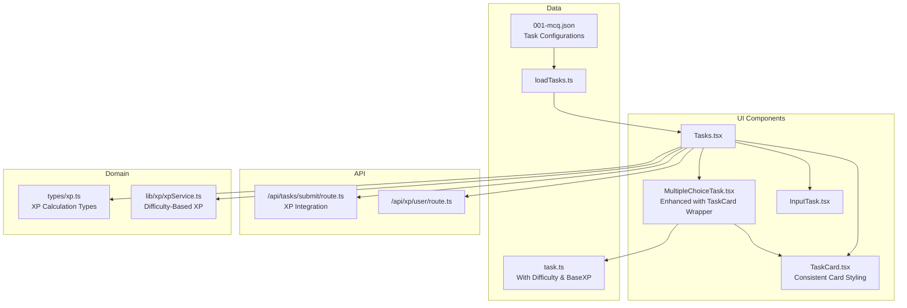
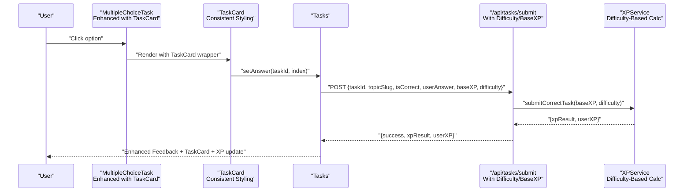
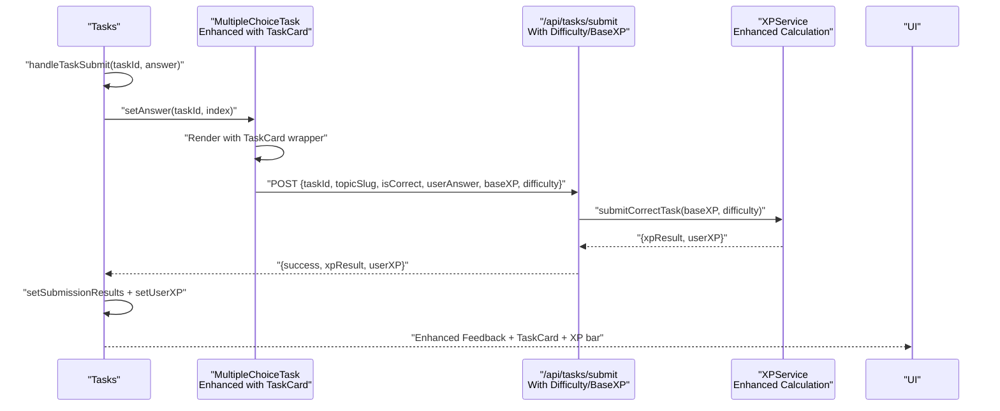
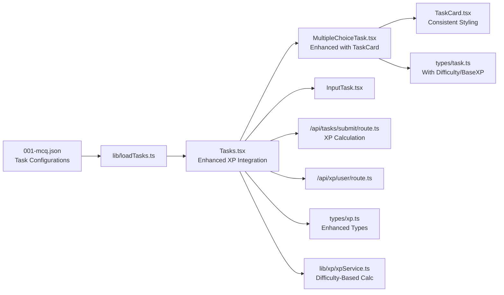

# Multiple Choice Tasks

<cite>
**Referenced Files in This Document**
- [MultipleChoiceTask.tsx](file://components/tasks/MultipleChoiceTask.tsx)
- [TaskCard.tsx](file://components/tasks/TaskCard.tsx)
- [Tasks.tsx](file://components/tasks/Tasks.tsx)
- [task.ts](file://types/task.ts)
- [001-mcq.json](file://content/math/addition_and_subtraction_of_fractions/tasks/001-mcq.json)
- [InputTask.tsx](file://components/tasks/InputTask.tsx)
- [loadTasks.ts](file://lib/loadTasks.ts)
- [route.ts](file://app/api/tasks/submit/route.ts)
- [route.ts](file://app/api/xp/user/route.ts)
- [xp.ts](file://types/xp.ts)
- [xpService.ts](file://lib/xp/xpService.ts)
</cite>

## Update Summary
**Changes Made**
- Enhanced MultipleChoiceTask component with new TaskCard wrapper for consistent card styling
- Comprehensive dark mode styling variants with proper dark: prefix utilities
- Improved button interactions with enhanced dark mode support and visual feedback
- Enhanced visual feedback for correct/incorrect selections with improved color schemes
- Added TaskCard component for consistent question presentation across task types
- Improved accessibility with better dark mode color contrast and semantic markup
- Enhanced responsive design with consistent spacing and padding across devices
- Optimized Tailwind utility classes for responsive layouts with comprehensive dark mode variants

## Table of Contents
1. [Introduction](#introduction)
2. [Project Structure](#project-structure)
3. [Core Components](#core-components)
4. [Architecture Overview](#architecture-overview)
5. [Detailed Component Analysis](#detailed-component-analysis)
6. [Dependency Analysis](#dependency-analysis)
7. [Performance Considerations](#performance-considerations)
8. [Troubleshooting Guide](#troubleshooting-guide)
9. [Conclusion](#conclusion)
10. [Appendices](#appendices)

## Introduction
This document explains the multiple choice task component system used for mathematical exercises. It covers how tasks render, how user selections are captured, how immediate feedback is shown, and how correctness is validated. It also documents the component props, event handling patterns, integration with the main task system, examples of task configuration, accessibility features, styling and responsive design considerations, and user interaction optimizations tailored for math content.

**Updated** The MultipleChoiceTask component now features a new TaskCard wrapper, comprehensive dark mode styling variants, enhanced button interactions with improved visual feedback, and better accessibility support for both light and dark themes. The system includes improved responsive design with consistent spacing and optimized Tailwind utility classes for better cross-device compatibility.

## Project Structure
The multiple choice system is composed of:
- A task renderer component that renders a single multiple choice item with enhanced visual feedback and TaskCard wrapper
- A TaskCard component that provides consistent card styling for all task types
- A task container that orchestrates navigation, submission, XP calculation, and UI feedback
- Task data loaded from JSON files with difficulty and baseXP properties
- API endpoints for submitting answers and retrieving user XP with XP calculation integration
- Types that define the shape of tasks and XP-related data

```mermaid
graph TB
subgraph "UI Components"
MC["MultipleChoiceTask.tsx<br/>Enhanced with TaskCard Wrapper"]
TC["TaskCard.tsx<br/>Consistent Card Styling"]
TS["Tasks.tsx"]
IT["InputTask.tsx"]
end
subgraph "Data"
TSK["task.ts<br/>With Difficulty & BaseXP"]
DATA["001-mcq.json<br/>Task Configurations"]
LOAD["loadTasks.ts"]
end
subgraph "API"
SUBMIT["/api/tasks/submit/route.ts<br/>XP Integration"]
XPGET["/api/xp/user/route.ts"]
end
subgraph "Domain"
TYPES["types/xp.ts<br/>XP Calculation Types"]
XPSVC["lib/xp/xpService.ts<br/>Difficulty-Based XP"]
end
TS --> MC
TS --> TC
TS --> IT
TS --> SUBMIT
TS --> XPGET
TS --> TYPES
TS --> XPSVC
MC --> TC
MC --> TSK
DATA --> LOAD
LOAD --> TS
```

**Diagram sources**
- [MultipleChoiceTask.tsx](file://components/tasks/MultipleChoiceTask.tsx#L1-L74)
- [TaskCard.tsx](file://components/tasks/TaskCard.tsx#L1-L18)
- [Tasks.tsx](file://components/tasks/Tasks.tsx#L1-L835)
- [InputTask.tsx](file://components/tasks/InputTask.tsx#L1-L120)
- [task.ts](file://types/task.ts#L1-L25)
- [001-mcq.json](file://content/math/addition_and_subtraction_of_fractions/tasks/001-mcq.json#L1-L250)
- [loadTasks.ts](file://lib/loadTasks.ts#L1-L31)
- [route.ts](file://app/api/tasks/submit/route.ts#L1-L67)
- [route.ts](file://app/api/xp/user/route.ts#L1-L41)
- [xp.ts](file://types/xp.ts#L1-L131)
- [xpService.ts](file://lib/xp/xpService.ts#L1-L902)

**Section sources**
- [MultipleChoiceTask.tsx](file://components/tasks/MultipleChoiceTask.tsx#L1-L74)
- [TaskCard.tsx](file://components/tasks/TaskCard.tsx#L1-L18)
- [Tasks.tsx](file://components/tasks/Tasks.tsx#L1-L835)
- [task.ts](file://types/task.ts#L1-L25)
- [001-mcq.json](file://content/math/addition_and_subtraction_of_fractions/tasks/001-mcq.json#L1-L250)
- [loadTasks.ts](file://lib/loadTasks.ts#L1-L31)
- [route.ts](file://app/api/tasks/submit/route.ts#L1-L67)
- [route.ts](file://app/api/xp/user/route.ts#L1-L41)
- [xp.ts](file://types/xp.ts#L1-L131)
- [xpService.ts](file://lib/xp/xpService.ts#L1-L902)

## Core Components
- **MultipleChoiceTask**: Renders a single multiple choice question with enhanced visual feedback, TaskCard wrapper, and comprehensive dark mode support. Features improved color schemes for correct/incorrect answers and better accessibility attributes.
- **TaskCard**: Provides consistent card styling for all task types with proper question header and dark mode support.
- **Tasks**: Manages the task lifecycle, tracks answers, submits to the backend with difficulty and baseXP integration, updates XP, and controls navigation between tasks.
- **InputTask**: Provides a parallel input-based task type for comparison and completeness of the task system.
- **Task data**: JSON files define multiple choice tasks with question text, options, correct answer index, difficulty levels, and base XP values.
- **Types**: Define the structure of tasks with enhanced properties for difficulty and XP calculation.

**Updated** Key enhancements include TaskCard wrapper integration, comprehensive dark mode styling, improved button interactions, enhanced visual feedback, and better accessibility support.

Key responsibilities:
- **Rendering**: Present question text and options with enhanced visual feedback using TaskCard wrapper; apply distinct styles for selected, correct, and incorrect choices with comprehensive dark mode support.
- **Selection handling**: Capture a single selection per task; prevent re-selection after lock with proper accessibility attributes and dark mode disabled states.
- **Immediate feedback**: Show correctness immediately upon selection using visual icons and improved color schemes; display option-specific comments for incorrect choices with enhanced dark mode styling.
- **Validation**: Compare selected index with stored correct answer index.
- **Integration**: Bridge UI to backend via submission endpoint with difficulty and baseXP parameters, and XP service for calculation.

**Section sources**
- [MultipleChoiceTask.tsx](file://components/tasks/MultipleChoiceTask.tsx#L14-L74)
- [TaskCard.tsx](file://components/tasks/TaskCard.tsx#L8-L17)
- [Tasks.tsx](file://components/tasks/Tasks.tsx#L1-L835)
- [InputTask.tsx](file://components/tasks/InputTask.tsx#L14-L120)
- [task.ts](file://types/task.ts#L1-L25)
- [001-mcq.json](file://content/math/addition_and_subtraction_of_fractions/tasks/001-mcq.json#L1-L250)

## Architecture Overview
The system follows a unidirectional data flow with enhanced XP calculation and TaskCard integration:
- Tasks loads task data from JSON files with difficulty and baseXP properties and maintains local state for answers and submission results.
- On selection, MultipleChoiceTask invokes a callback that posts the answer along with difficulty and baseXP to the backend.
- The backend validates correctness and calculates XP using the XP service with difficulty-based XP calculation.
- The UI updates XP, shows enhanced feedback with visual icons, applies TaskCard wrapper, and advances to the next task.

```mermaid
sequenceDiagram
participant U as "User"
participant MC as "MultipleChoiceTask<br/>Enhanced with TaskCard"
participant TC as "TaskCard<br/>Consistent Styling"
participant TS as "Tasks"
participant API as "/api/tasks/submit<br/>With Difficulty/BaseXP"
participant SVC as "XPService<br/>Difficulty-Based Calc"
U->>MC : "Click option"
MC->>TC : "Render with TaskCard wrapper"
TC->>TS : "setAnswer(taskId, index)"
TS->>API : "POST {taskId, topicSlug, isCorrect, userAnswer, baseXP, difficulty}"
API->>SVC : "submitCorrectTask(baseXP, difficulty)"
SVC-->>API : "{xpResult, userXP}"
API-->>TS : "{success, xpResult, userXP}"
TS-->>U : "Enhanced Feedback + TaskCard + XP update"
```

**Diagram sources**
- [MultipleChoiceTask.tsx](file://components/tasks/MultipleChoiceTask.tsx#L34-L72)
- [TaskCard.tsx](file://components/tasks/TaskCard.tsx#L8-L17)
- [Tasks.tsx](file://components/tasks/Tasks.tsx#L744-L751)
- [route.ts](file://app/api/tasks/submit/route.ts#L42-L48)
- [xpService.ts](file://lib/xp/xpService.ts#L118-L200)

## Detailed Component Analysis

### MultipleChoiceTask Component
**Updated** Enhanced with TaskCard wrapper, comprehensive dark mode styling, and improved button interactions.

Purpose:
- Render a single multiple choice question with TaskCard wrapper and enhanced visual feedback using ✓ for correct answers and ✗ for incorrect answers.
- Track and enforce a single selection per task with proper accessibility attributes and dark mode support.
- Provide immediate visual feedback for correctness with improved color schemes and comprehensive dark mode styling.

Rendering logic:
- Wraps content in TaskCard component for consistent card styling with question header.
- Displays question text and a vertical list of options with enhanced visual feedback.
- Applies distinct styles for different states with comprehensive dark mode support:
  - Unselected options with hover effects and proper dark mode variants
  - Selected option with visual indication and dark mode styling
  - Correct option (after selection) with green ✓ icon, green color scheme, and dark mode support
  - Incorrect option (after selection) with red ✗ icon, red color scheme, and dark mode support
  - Locked options with grayed-out appearance and dark mode disabled states
- Disables further interaction after selection with proper disabled state and aria-disabled attribute.

Selection handling:
- Stores the selected index locally.
- Invokes the parent callback with taskId and selected index.
- Resets selection when the task prop changes.

**Enhanced** Immediate feedback with visual icons and dark mode support:
- Shows a green checkmark ✓ for correct option after selection with proper dark mode color.
- Shows a red cross ✗ for incorrect option after selection with proper dark mode color.
- Displays an optional comment below an incorrect option with enhanced styling and dark mode support.

**Enhanced** Accessibility features:
- Uses semantic button elements for each option with proper focus management.
- Disabled state prevents re-selection after lock with proper aria-disabled attribute.
- Comprehensive dark mode color contrast maintained for correct/incorrect states.
- Clear visual indicators complement textual feedback with proper dark mode variants.
- Proper button styling with hover/focus states in both light and dark modes.

**Enhanced** Styling and responsiveness:
- TaskCard wrapper provides consistent card styling with question header.
- Responsive padding and spacing for mobile and desktop with enhanced dark mode support.
- Hover and focus-friendly affordances with improved transitions and dark mode variants.
- Tailwind utility classes applied consistently with comprehensive dark mode variants.
- Smooth transitions for state changes with duration-200 animation and dark mode support.

Complexity:
- Rendering loop over options is O(n) with n options.
- State updates are constant-time with enhanced visual feedback computation and dark mode styling.

**Section sources**
- [MultipleChoiceTask.tsx](file://components/tasks/MultipleChoiceTask.tsx#L14-L74)

#### Class Diagram
```mermaid
classDiagram
class MultipleChoiceTask {
+props.task : TMultipleChoiceTask
+props.setAnswer(taskId, answer)
+props.initialAnswer : number|null
+props.isLocked : boolean
-selected : number|null
+handleSelect(index)
+render()
}
class TaskCard {
+props.question : string
+props.children : ReactNode
+render()
}
class TMultipleChoiceTask {
+string id
+string type="multiple-choice"
+string question
+{text, comment?}[] options
+number answer
+string|undefined difficulty
+number|undefined baseXP
}
MultipleChoiceTask --> TMultipleChoiceTask : "renders with enhanced feedback"
MultipleChoiceTask --> TaskCard : "wraps content"
```

**Diagram sources**
- [MultipleChoiceTask.tsx](file://components/tasks/MultipleChoiceTask.tsx#L14-L19)
- [TaskCard.tsx](file://components/tasks/TaskCard.tsx#L8-L17)
- [task.ts](file://types/task.ts#L1-L10)

### TaskCard Component
**New** Added TaskCard component for consistent card styling across task types.

Purpose:
- Provide consistent card styling for all task types with proper question header and dark mode support.
- Encapsulate common styling patterns for task presentation.

Key features:
- Consistent rounded corners, borders, and shadows for all task types.
- Proper question header styling with font weight and color variants for light/dark modes.
- Dark mode support with proper color variants for borders, backgrounds, and text.
- Flexible child content rendering for different task types.

Styling patterns:
- Light mode: white background, gray borders, dark text.
- Dark mode: gray-800 background, gray-700 borders, gray-100 text.
- Consistent padding and spacing for all child components.

**Section sources**
- [TaskCard.tsx](file://components/tasks/TaskCard.tsx#L8-L17)

### Tasks Container
Purpose:
- Manage the entire task session: loading tasks, tracking answers, submitting with difficulty and baseXP integration, updating XP, and navigating tasks.
- Provide XP and topic energy feedback with enhanced XP calculation.
- Control availability of navigation buttons.

Key behaviors:
- Loads tasks from JSON via a loader utility with difficulty and baseXP properties.
- Filters out completed tasks using XP service data.
- Submits answers to the backend with difficulty and baseXP parameters and updates submission results.
- Plays sound feedback on correct answers.
- Updates user XP and completion set based on submission results with enhanced XP calculation.

**Enhanced** Submission flow with XP integration:
- Validates session and prevents concurrent submissions.
- Determines correctness based on task type.
- Posts to the submission endpoint with task metadata including difficulty and baseXP.
- Updates state with XP result and user XP with enhanced calculation.

Navigation:
- Maintains current task index and moves forward/backward.
- Shows completion screen when all available tasks are done.

**Section sources**
- [Tasks.tsx](file://components/tasks/Tasks.tsx#L1-L835)
- [loadTasks.ts](file://lib/loadTasks.ts#L5-L30)

#### Sequence Diagram: Enhanced Answer Submission and Feedback

```mermaid
sequenceDiagram
participant TS as "Tasks"
participant MC as "MultipleChoiceTask<br/>Enhanced with TaskCard"
participant API as "/api/tasks/submit<br/>With Difficulty/BaseXP"
participant SVC as "XPService<br/>Enhanced Calculation"
participant UI as "UI"
TS->>TS : "handleTaskSubmit(taskId, answer)"
TS->>MC : "setAnswer(taskId, index)"
MC->>MC : "Render with TaskCard wrapper"
MC->>API : "POST {taskId, topicSlug, isCorrect, userAnswer, baseXP, difficulty}"
API->>SVC : "submitCorrectTask(baseXP, difficulty)"
SVC-->>API : "{xpResult, userXP}"
API-->>TS : "{success, xpResult, userXP}"
TS->>TS : "setSubmissionResults + setUserXP"
TS-->>UI : "Enhanced Feedback + TaskCard + XP bar"
```

**Diagram sources**
- [Tasks.tsx](file://components/tasks/Tasks.tsx#L744-L751)
- [MultipleChoiceTask.tsx](file://components/tasks/MultipleChoiceTask.tsx#L34-L72)
- [route.ts](file://app/api/tasks/submit/route.ts#L42-L48)
- [xpService.ts](file://lib/xp/xpService.ts#L118-L200)

### Task Data Model and Examples
**Updated** Enhanced with difficulty and baseXP properties.

Task model:
- Multiple choice tasks include id, type marker, question text, options array, correct answer index, difficulty levels, and base XP values.
- Options include text and an optional comment shown when the user selects incorrectly.
- Difficulty levels: easy (100 XP), medium/moderate (250 XP), hard (500 XP), or custom baseXP values.

**Enhanced** Example configuration:
- See the JSON file containing multiple-choice tasks for a topic, including question text, options, answer indices, difficulty levels, and base XP values.

Validation:
- Correctness is determined by comparing the selected index with the stored answer index.

Shuffling:
- No explicit shuffling algorithm is present in the current implementation. Options appear in the order defined in the JSON.

**Section sources**
- [task.ts](file://types/task.ts#L1-L10)
- [001-mcq.json](file://content/math/addition_and_subtraction_of_fractions/tasks/001-mcq.json#L1-L250)

### API Integration and Enhanced XP Calculation
**Updated** Enhanced with difficulty and baseXP integration.

Submission endpoint:
- Requires an authenticated session.
- Validates presence of required fields.
- On correct answer, delegates to XP service to compute XP with difficulty-based calculation and update user state.

**Enhanced** XP service calculation:
- Computes XP based on daily multipliers, difficulty levels, and base XP values.
- Supports difficulty-based XP: easy (100), medium/moderate (250), hard (500), or custom baseXP.
- Manages SRS stages and next review dates.
- Returns XP result and updated user XP to the UI with enhanced calculation.

User XP retrieval:
- Endpoint fetches user topic XP, topic config, and completed task IDs to filter available tasks.

**Section sources**
- [route.ts](file://app/api/tasks/submit/route.ts#L17-L48)
- [route.ts](file://app/api/xp/user/route.ts#L5-L40)
- [xp.ts](file://types/xp.ts#L50-L131)
- [xpService.ts](file://lib/xp/xpService.ts#L118-L200)

### Accessibility Features
**Enhanced** Improved accessibility with comprehensive dark mode support.

- Buttons are keyboard focusable and actionable with proper focus management and dark mode focus states.
- Disabled state communicates non-interactive state after selection with aria-disabled attribute and dark mode disabled styling.
- **Enhanced** Visual indicators (green ✓ for correct, red ✗ for incorrect) complement textual feedback with proper dark mode color variants.
- **Enhanced** Improved color contrast and color semantics clearly distinguish correct/incorrect states with comprehensive dark mode support.
- **Enhanced** Clear visual feedback improves accessibility for users with visual impairments across both light and dark themes.
- **Enhanced** Proper semantic markup with TaskCard wrapper for better screen reader support.

Recommendations:
- Add aria-live regions for dynamic feedback messages.
- Ensure focus moves to feedback after selection.
- Provide skip-links for long question lists.
- **Enhanced** Consider adding aria-labels to visual icons for screen readers.
- **Enhanced** Ensure proper focus management in dark mode with visible focus indicators.

**Section sources**
- [MultipleChoiceTask.tsx](file://components/tasks/MultipleChoiceTask.tsx#L43-L71)
- [TaskCard.tsx](file://components/tasks/TaskCard.tsx#L8-L17)

### Styling Patterns and Responsive Design
**Enhanced** Comprehensive styling with dark mode variants and TaskCard integration.

- Consistent spacing and padding for readability across devices with enhanced responsive design and dark mode support.
- **Enhanced** Tailwind utility classes for responsive layouts with comprehensive dark mode variants including hover, focus, and disabled states.
- **Enhanced** Hover and focus states improve interactivity with smooth transitions and proper dark mode variants.
- **Enhanced** Disabled states communicate unavailability with proper visual feedback and dark mode styling.
- **Enhanced** Color schemes: green for correct answers, red for incorrect answers, with appropriate contrast ratios in both light and dark modes.
- **Enhanced** TaskCard wrapper provides consistent card styling with question headers and proper dark mode support.

Responsive considerations:
- Flexible widths and padding adapt to small screens with enhanced mobile experience and dark mode support.
- Large touch targets for mobile interaction with improved accessibility and dark mode focus states.
- **Enhanced** Smooth transitions and animations for better user experience across both light and dark themes.

**Section sources**
- [MultipleChoiceTask.tsx](file://components/tasks/MultipleChoiceTask.tsx#L43-L71)
- [TaskCard.tsx](file://components/tasks/TaskCard.tsx#L10-L15)

### User Interaction Optimization for Math
**Enhanced** Improved user experience with TaskCard wrapper and dark mode support.

- **Enhanced** Immediate visual feedback with ✓ and ✗ icons reduces cognitive load with proper dark mode color variants.
- **Enhanced** Option comments help learners understand mistakes with enhanced styling and dark mode support.
- **Enhanced** Navigation buttons enable controlled pacing with better accessibility and dark mode styling.
- **Enhanced** Sound cues reinforce correctness with proper audio feedback.
- **Enhanced** Clear visual distinction between correct/incorrect answers improves learning effectiveness with comprehensive dark mode support.
- **Enhanced** TaskCard wrapper provides consistent presentation across all task types with proper question headers.

**Section sources**
- [Tasks.tsx](file://components/tasks/Tasks.tsx#L796-L813)
- [MultipleChoiceTask.tsx](file://components/tasks/MultipleChoiceTask.tsx#L49-L66)

## Dependency Analysis
**Updated** Enhanced dependencies with TaskCard integration and dark mode support.

The multiple choice system depends on:
- Task types for shape validation with enhanced difficulty and baseXP properties
- Task data loader for JSON parsing with difficulty configurations
- API routes for submission with XP calculation integration
- XP service for calculations and persistence with difficulty-based XP
- UI components for rendering and interaction with enhanced visual feedback and dark mode support
- **New** TaskCard component for consistent card styling across task types

```mermaid
graph LR
MC["MultipleChoiceTask.tsx<br/>Enhanced with TaskCard"] --> TC["TaskCard.tsx<br/>Consistent Styling"]
MC --> T["types/task.ts<br/>With Difficulty/BaseXP"]
TS["Tasks.tsx<br/>Enhanced XP Integration"] --> MC
TS --> IT["InputTask.tsx"]
TS --> API1["/api/tasks/submit/route.ts<br/>XP Calculation"]
TS --> API2["/api/xp/user/route.ts"]
TS --> XPT["types/xp.ts<br/>Enhanced Types"]
TS --> XPS["lib/xp/xpService.ts<br/>Difficulty-Based Calc"]
DATA["001-mcq.json<br/>Task Configurations"] --> LD["lib/loadTasks.ts"]
LD --> TS
```

**Diagram sources**
- [MultipleChoiceTask.tsx](file://components/tasks/MultipleChoiceTask.tsx#L5)
- [TaskCard.tsx](file://components/tasks/TaskCard.tsx#L1-L18)
- [Tasks.tsx](file://components/tasks/Tasks.tsx#L1-L835)
- [InputTask.tsx](file://components/tasks/InputTask.tsx#L1-L120)
- [route.ts](file://app/api/tasks/submit/route.ts#L1-L67)
- [route.ts](file://app/api/xp/user/route.ts#L1-L41)
- [xp.ts](file://types/xp.ts#L1-L131)
- [xpService.ts](file://lib/xp/xpService.ts#L1-L902)
- [001-mcq.json](file://content/math/addition_and_subtraction_of_fractions/tasks/001-mcq.json#L1-L250)
- [loadTasks.ts](file://lib/loadTasks.ts#L1-L31)

**Section sources**
- [MultipleChoiceTask.tsx](file://components/tasks/MultipleChoiceTask.tsx#L1-L74)
- [TaskCard.tsx](file://components/tasks/TaskCard.tsx#L1-L18)
- [Tasks.tsx](file://components/tasks/Tasks.tsx#L1-L835)
- [task.ts](file://types/task.ts#L1-L25)
- [001-mcq.json](file://content/math/addition_and_subtraction_of_fractions/tasks/001-mcq.json#L1-L250)
- [loadTasks.ts](file://lib/loadTasks.ts#L1-L31)
- [route.ts](file://app/api/tasks/submit/route.ts#L1-L67)
- [route.ts](file://app/api/xp/user/route.ts#L1-L41)
- [xp.ts](file://types/xp.ts#L1-L131)
- [xpService.ts](file://lib/xp/xpService.ts#L1-L902)

## Performance Considerations
**Updated** Enhanced performance with TaskCard optimization and dark mode efficiency.

- **Enhanced** Rendering: Single selection per task minimizes re-renders; TaskCard wrapper provides efficient shared styling; option list rendering is O(n) with optimized visual feedback computation and dark mode styling.
- **Enhanced** Network: Debounce or disable repeated submissions; the container prevents concurrent submissions with improved state management.
- **Enhanced** Memory: Keep only current task and results in memory; avoid storing entire history unless needed with enhanced caching.
- **Enhanced** UX: Preload sounds and defer heavy assets to reduce perceived latency with improved asset management.
- **Enhanced** Visual feedback: Optimized CSS transitions and animations for smooth user experience across both light and dark themes.
- **Enhanced** Dark mode: Efficient dark mode variants using Tailwind's dark: prefix for optimal performance.

## Troubleshooting Guide
**Updated** Enhanced troubleshooting for TaskCard wrapper and dark mode styling.

Common issues and resolutions:
- **Enhanced** No visual feedback after selecting an option:
  - Verify the callback is passed down and invoked on selection.
  - Ensure the submission endpoint receives the correct payload with difficulty and baseXP.
  - Check that visual feedback icons (✓/✗) are properly rendered with dark mode support.
  - **New** Verify TaskCard wrapper is rendering correctly around the MultipleChoiceTask content.
- **Enhanced** Incorrect answer marked as correct:
  - Confirm the answer index matches the intended correct option.
  - Check that the submission endpoint validates correctness before calculating XP.
  - Verify difficulty and baseXP values are properly transmitted.
- **Enhanced** XP not updating:
  - Ensure the response includes user XP and that the UI state is updated accordingly.
  - Verify difficulty-based XP calculation is working correctly.
  - Check that XP service properly handles difficulty levels.
- **Enhanced** Tasks not filtering correctly:
  - Verify completed task IDs are fetched and applied to filter available tasks.
  - Ensure XP calculation is completing successfully.
  - Check that visual feedback is properly applied after submission.
- **Enhanced** Dark mode styling issues:
  - Verify dark mode classes are properly prefixed with dark: in Tailwind utilities.
  - Check that TaskCard wrapper applies dark mode styling correctly.
  - Ensure button states and hover/focus variants work properly in dark mode.
- **Enhanced** TaskCard wrapper not displaying:
  - Verify TaskCard component is imported and used correctly in MultipleChoiceTask.
  - Check that question prop is properly passed to TaskCard.
  - Ensure TaskCard renders children content correctly.

**Section sources**
- [MultipleChoiceTask.tsx](file://components/tasks/MultipleChoiceTask.tsx#L34-L72)
- [TaskCard.tsx](file://components/tasks/TaskCard.tsx#L8-L17)
- [Tasks.tsx](file://components/tasks/Tasks.tsx#L744-L751)
- [route.ts](file://app/api/tasks/submit/route.ts#L17-L48)
- [route.ts](file://app/api/xp/user/route.ts#L5-L40)

## Conclusion
**Updated** Enhanced conclusion reflecting the improved MultipleChoiceTask component with TaskCard wrapper and dark mode support.

The multiple choice task system provides a clear, accessible, and efficient way to render math problems, capture user selections, and deliver immediate feedback with enhanced visual indicators. Its integration with the XP service, API endpoints, and TaskCard wrapper ensures meaningful learning progression and engagement with difficulty-based XP calculation. The modular design allows easy extension to support shuffling, advanced feedback, and additional task types with improved accessibility, comprehensive dark mode support, and consistent card styling across all task types.

**Enhanced** The system now features a TaskCard wrapper for consistent presentation, comprehensive dark mode styling variants, enhanced button interactions, improved visual feedback with ✓ and ✗ icons, better color schemes, accessibility enhancements, and difficulty-based XP calculation for a more engaging and effective learning experience across both light and dark themes.

## Appendices

### Props Reference: MultipleChoiceTask
**Updated** Enhanced props with TaskCard wrapper and accessibility features.

- **task**: TMultipleChoiceTask
  - id: Unique identifier
  - type: Literal "multiple-choice"
  - question: Question text
  - options: Array of { text, comment? }
  - answer: Index of correct option
  - difficulty: Optional difficulty level (easy, medium, hard)
  - baseXP: Optional base XP value
- **setAnswer**: (taskId: string, answer: number) => void
- **initialAnswer**: number | null
- **isLocked**: boolean

**Section sources**
- [MultipleChoiceTask.tsx](file://components/tasks/MultipleChoiceTask.tsx#L7-L12)
- [task.ts](file://types/task.ts#L1-L10)

### Props Reference: TaskCard
**New** Props for TaskCard component.

- **question**: string - The question text to display as the card header
- **children**: ReactNode - The task content to render inside the card

**Section sources**
- [TaskCard.tsx](file://components/tasks/TaskCard.tsx#L3-L6)

### Example Task Configuration
**Updated** Enhanced example with difficulty and baseXP.

- See the JSON file for a topic's multiple choice tasks, including question text, options, answer indices, difficulty levels, and base XP values.
- Example tasks demonstrate easy (100 XP), medium (250 XP), and hard (500 XP) difficulty levels.
- Custom baseXP values can override difficulty-based XP calculation.

**Section sources**
- [001-mcq.json](file://content/math/addition_and_subtraction_of_fractions/tasks/001-mcq.json#L1-L250)

### Answer Shuffling Algorithms
- Not implemented in the current codebase. To add shuffling:
  - Shuffle indices before rendering options.
  - Track original answer index and adjust it accordingly.
  - Ensure submission compares against the shuffled correct index.

### Accessibility Checklist
**Enhanced** Improved accessibility checklist with dark mode support.

- Ensure all interactive elements are keyboard accessible with proper focus management and dark mode focus states.
- Provide visible focus indicators with enhanced styling in both light and dark modes.
- Use ARIA attributes for dynamic feedback with proper accessibility attributes.
- Maintain sufficient color contrast for correctness indicators with comprehensive dark mode support.
- **Enhanced** Add aria-labels to visual icons (✓/✗) for screen reader compatibility.
- **Enhanced** Ensure visual feedback is accessible to users with visual impairments across both light and dark themes.
- **Enhanced** Verify TaskCard wrapper provides proper semantic structure for screen readers.
- **Enhanced** Test dark mode color contrast ratios meet accessibility guidelines.