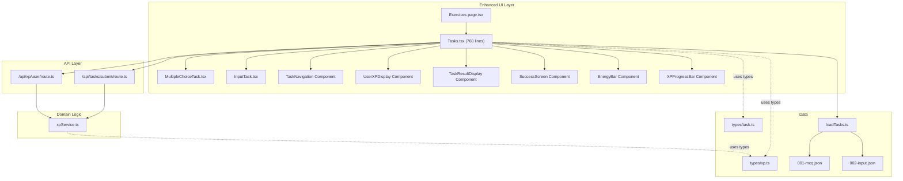
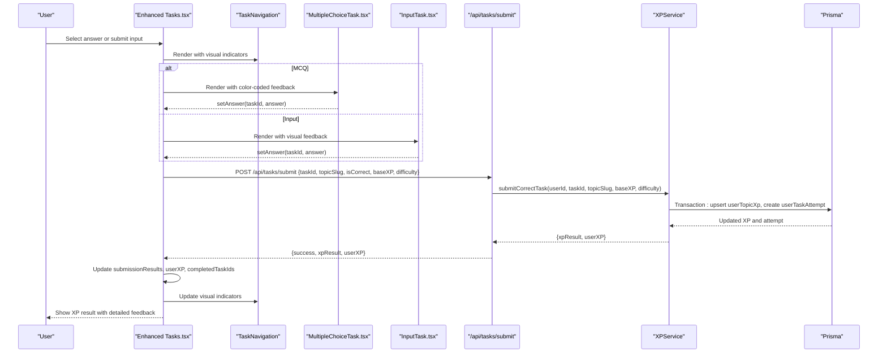
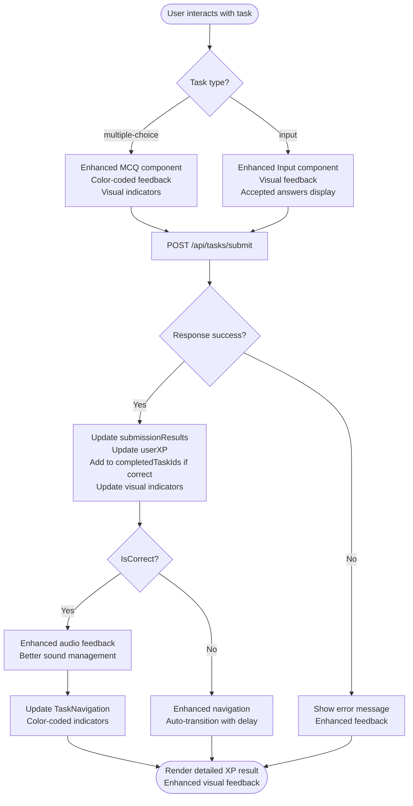
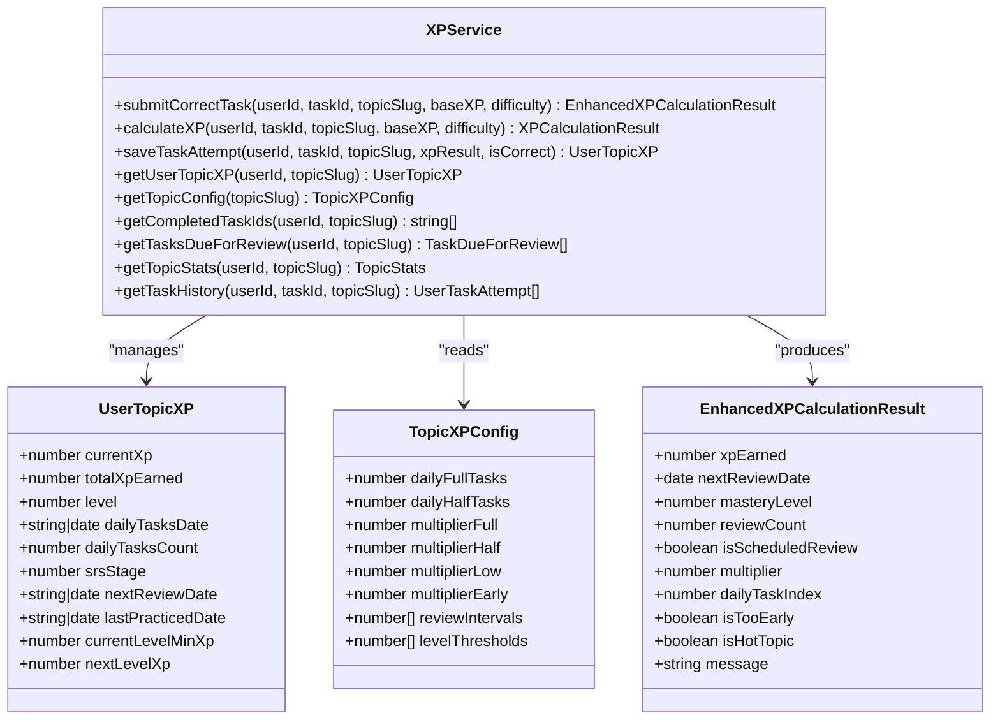
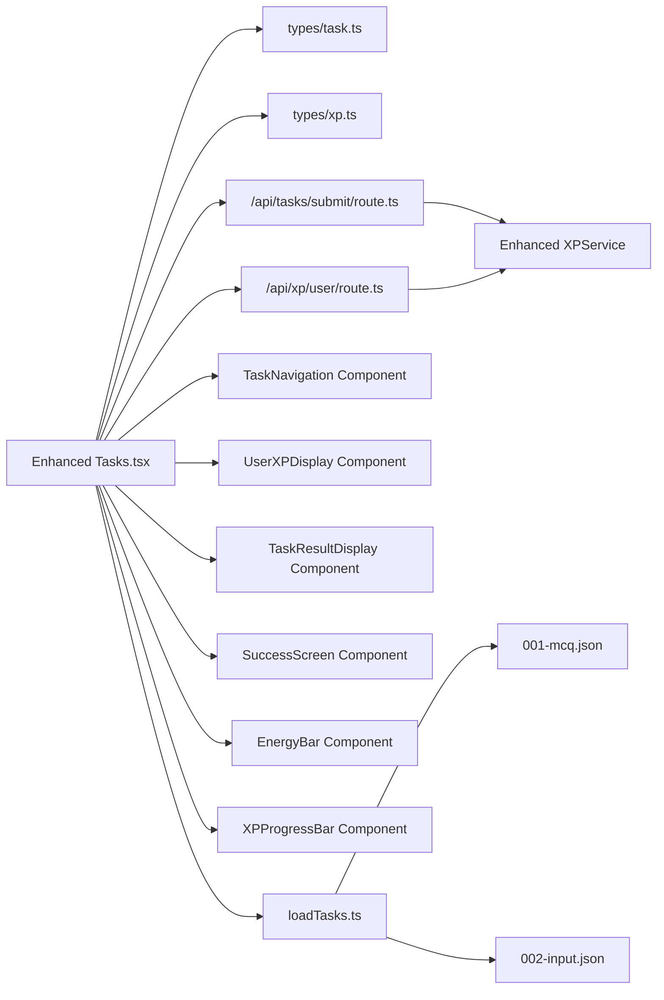

# Task System Architecture

<cite>
**Referenced Files in This Document**
- [Tasks.tsx](file://components/tasks/Tasks.tsx)
- [InputTask.tsx](file://components/tasks/InputTask.tsx)
- [MultipleChoiceTask.tsx](file://components/tasks/MultipleChoiceTask.tsx)
- [xpService.ts](file://lib/xp/xpService.ts)
- [route.ts](file://app/api/tasks/submit/route.ts)
- [route.ts](file://app/api/xp/user/route.ts)
- [task.ts](file://types/task.ts)
- [xp.ts](file://types/xp.ts)
- [page.tsx](file://app/(main)/math/[topic]/exercices/page.tsx)
- [page.tsx](file://app/(main)/math/[topic]/lesson/page.tsx)
- [loadTasks.ts](file://lib/loadTasks.ts)
- [001-mcq.json](file://content/math/addition_and_subtraction_of_fractions/tasks/001-mcq.json)
- [002-input.json](file://content/math/addition_and_subtraction_of_fractions/tasks/002-input.json)
- [AuthControls.tsx](file://components/tasks/AuthControls.tsx)
</cite>

## Update Summary
**Changes Made**
- Enhanced Tasks.tsx component from 440 to 760 lines with improved task navigation system
- Added comprehensive visual indicators for correct/incorrect answers in task components
- Implemented advanced XP calculation integration with real-time progress tracking
- Enhanced user experience flows with improved task result displays and navigation
- Added energy calculation system with visual energy bars and hot-topic detection
- Improved auto-transition functionality and task completion tracking

## Table of Contents
1. [Introduction](#introduction)
2. [Project Structure](#project-structure)
3. [Core Components](#core-components)
4. [Architecture Overview](#architecture-overview)
5. [Detailed Component Analysis](#detailed-component-analysis)
6. [Enhanced Task Navigation System](#enhanced-task-navigation-system)
7. [Visual Feedback and User Experience](#visual-feedback-and-user-experience)
8. [Advanced XP Calculation Integration](#advanced-xp-calculation-integration)
9. [Dependency Analysis](#dependency-analysis)
10. [Performance Considerations](#performance-considerations)
11. [Troubleshooting Guide](#troubleshooting-guide)
12. [Conclusion](#conclusion)
13. [Appendices](#appendices)

## Introduction
This document explains the enhanced task system architecture powering the interactive learning interface. The system has undergone a major overhaul with improved task navigation, advanced XP calculation integration, visual indicators for correct/incorrect answers, and enhanced user experience flows. It covers the main Tasks component structure, task lifecycle management, state management patterns, real-time XP calculation integration, component hierarchy, filtering and completion tracking, user progress visualization, task submission flow, audio feedback system, and dynamic task rendering by type. Practical integration patterns, state synchronization with the XP service, and error handling strategies are included to help developers extend and maintain the system effectively.

## Project Structure
The task system spans UI components, data types, backend APIs, and content-driven task loading. The primary pieces are:
- UI components under components/tasks for rendering tasks and managing user interactions
- Backend routes under app/api for authenticating requests, validating submissions, and calculating XP
- XP calculation logic under lib/xp/xpService.ts implementing SRS-based XP mechanics
- Task data under content/math/<topic>/tasks as JSON files
- Task loading utility under lib/loadTasks.ts
- Type definitions under types/ for tasks and XP

**Diagram sources**
- [Tasks.tsx](file://components/tasks/Tasks.tsx#L1-L761)
- [MultipleChoiceTask.tsx](file://components/tasks/MultipleChoiceTask.tsx#L1-L76)
- [InputTask.tsx](file://components/tasks/InputTask.tsx#L1-L119)
- [route.ts](file://app/api/tasks/submit/route.ts#L1-L67)
- [route.ts](file://app/api/xp/user/route.ts#L1-L41)
- [xpService.ts](file://lib/xp/xpService.ts#L1-L902)
- [task.ts](file://types/task.ts#L1-L25)
- [xp.ts](file://types/xp.ts#L1-L131)
- [page.tsx](file://app/(main)/math/[topic]/exercices/page.tsx#L1-L32)
- [loadTasks.ts](file://lib/loadTasks.ts#L1-L31)
- [001-mcq.json](file://content/math/addition_and_subtraction_of_fractions/tasks/001-mcq.json#L1-L250)
- [002-input.json](file://content/math/addition_and_subtraction_of_fractions/tasks/002-input.json#L1-L10)

**Section sources**
- [Tasks.tsx](file://components/tasks/Tasks.tsx#L1-L761)
- [page.tsx](file://app/(main)/math/[topic]/exercices/page.tsx#L1-L32)
- [loadTasks.ts](file://lib/loadTasks.ts#L1-L31)

## Core Components
- **Enhanced Tasks Component**: Now 760 lines with comprehensive task navigation, visual feedback systems, energy calculation, and improved user experience flows
- **MultipleChoiceTask**: Enhanced with visual indicators for correct/incorrect selections and detailed feedback
- **InputTask**: Improved with better visual feedback, accepted answers display, and enhanced user experience
- **XPService**: Advanced XP calculation engine with SRS-based mechanics, daily multipliers, and comprehensive progress tracking
- **API routes**: Enhanced authentication, validation, and comprehensive XP result handling
- **Type definitions**: Complete type system for tasks, XP calculations, and submission responses

Key responsibilities:
- **Dynamic rendering**: Switch between MCQ and input task components based on task type
- **Enhanced state management**: Comprehensive local React state for answers, submission results, XP, topic config, completion tracking, and navigation
- **Real-time XP integration**: Immediate XP updates with detailed XP calculation results and user XP snapshots
- **Visual feedback system**: Color-coded task navigation, progress indicators, and completion status
- **Energy calculation**: Daily task limits, XP multipliers, and hot-topic detection
- **Auto-transition**: Intelligent task progression with configurable delays

**Section sources**
- [Tasks.tsx](file://components/tasks/Tasks.tsx#L1-L761)
- [MultipleChoiceTask.tsx](file://components/tasks/MultipleChoiceTask.tsx#L1-L76)
- [InputTask.tsx](file://components/tasks/InputTask.tsx#L1-L119)
- [xpService.ts](file://lib/xp/xpService.ts#L118-L293)
- [route.ts](file://app/api/tasks/submit/route.ts#L6-L67)
- [route.ts](file://app/api/xp/user/route.ts#L5-L41)
- [task.ts](file://types/task.ts#L1-L25)
- [xp.ts](file://types/xp.ts#L83-L131)

## Architecture Overview
The system follows a layered architecture with enhanced state management and real-time feedback:
- **UI layer**: Enhanced Tasks and child task components with comprehensive visual feedback and navigation
- **API layer**: Next.js routes with robust authentication and delegation to XPService for calculations
- **Domain logic**: XPService with advanced SRS scheduling, daily multipliers, and comprehensive XP mechanics
- **Data layer**: Prisma ORM with atomic transactions for user XP, attempts, and topic configurations

**Diagram sources**
- [Tasks.tsx](file://components/tasks/Tasks.tsx#L608-L631)
- [MultipleChoiceTask.tsx](file://components/tasks/MultipleChoiceTask.tsx#L17-L22)
- [InputTask.tsx](file://components/tasks/InputTask.tsx#L24-L34)
- [route.ts](file://app/api/tasks/submit/route.ts#L42-L55)
- [xpService.ts](file://lib/xp/xpService.ts#L118-L293)

## Detailed Component Analysis

### Enhanced Tasks Component
The Tasks component has been significantly enhanced from 440 to 760 lines with comprehensive improvements:

**Core Responsibilities:**
- **Enhanced state management**: Comprehensive local state for current task index, answers, submission results, user XP, topic config, completed task IDs, submission lock, and auto-transition control
- **Advanced task navigation**: Visual task navigation with color-coded indicators for correct/incorrect answers and current task highlighting
- **Energy calculation system**: Daily task limits, XP multipliers, and hot-topic detection with visual energy bars
- **Real-time XP integration**: Detailed XP calculation results with multipliers, daily task indexing, and review scheduling
- **Auto-transition functionality**: Configurable task progression with 1.5-second delays
- **Enhanced completion tracking**: Comprehensive task completion monitoring with automatic topic finishing detection

**New Features:**
- **TaskNavigation component**: Visual task grid with color-coded status indicators (green for correct, red for incorrect, blue for current)
- **EnergyBar component**: Dynamic energy calculation showing remaining daily tasks with color-coded progress bars
- **UserXPDisplay component**: Comprehensive XP display with hot-topic detection, level information, and upcoming review timers
- **TaskResultDisplay component**: Detailed feedback with XP breakdown, multipliers, and review scheduling information
- **SuccessScreen component**: Completion celebration with next review date and motivational messaging
- **XPProgressBar component**: Visual XP progress toward next level with gradient styling

**State Management Patterns:**
- **Enhanced local state**: UI-only data management with comprehensive state updates
- **Memoized calculations**: Energy statistics and XP progress calculations with useMemo optimization
- **Controlled state updates**: Coordinated updates to submissionResults, completedTaskIds, and userXP
- **Conditional rendering**: Status-based component rendering with visual feedback

**Enhanced Real-time XP Integration:**
- **Detailed XP results**: Comprehensive XP calculation results with multipliers, daily task indexing, and review scheduling
- **Immediate UI updates**: Real-time XP progress bar and energy bar updates
- **Enhanced feedback**: Detailed XP breakdown with multiplier information and daily task status

**Audio Feedback Enhancement:**
- **Improved sound management**: Better audio resource handling with proper cleanup
- **Enhanced user experience**: More responsive audio feedback for correct answers

**Diagram sources**
- [Tasks.tsx](file://components/tasks/Tasks.tsx#L608-L631)
- [route.ts](file://app/api/tasks/submit/route.ts#L27-L32)

**Section sources**
- [Tasks.tsx](file://components/tasks/Tasks.tsx#L1-L761)

### Enhanced MultipleChoiceTask Component
The MultipleChoiceTask component now provides comprehensive visual feedback:

**Enhanced Features:**
- **Color-coded selection**: Green for correct answers, red for incorrect selections, with visual indicators
- **Detailed feedback**: Option-specific comments for wrong answers with educational explanations
- **Enhanced styling**: Gradient backgrounds, shadow effects, and responsive design
- **Disabled states**: Proper button disabling after selection with visual feedback
- **Educational comments**: Detailed explanations for wrong answers to aid learning

**Visual Indicators:**
- **Correct answers**: Green borders with check marks and success styling
- **Incorrect answers**: Red borders with cross marks and error styling
- **Selected options**: Visual distinction from unselected options
- **Disabled states**: Proper cursor and opacity handling for locked selections

**Section sources**
- [MultipleChoiceTask.tsx](file://components/tasks/MultipleChoiceTask.tsx#L1-L76)

### Enhanced InputTask Component
The InputTask component now offers improved user experience:

**Enhanced Features:**
- **Visual feedback**: Green background for correct answers, red background for incorrect inputs
- **Accepted answers display**: Shows all accepted answer formats when user provides incorrect input
- **Improved styling**: Better input field styling with color-coded borders
- **Clear button**: Enhanced clear functionality with proper state management
- **Responsive design**: Better mobile and desktop responsiveness

**Visual Feedback System:**
- **Correct answers**: Green success message with check mark
- **Incorrect answers**: Red error message with explanation and accepted answers list
- **Input states**: Proper visual indication of input states (submitted, locked, editable)

**Section sources**
- [InputTask.tsx](file://components/tasks/InputTask.tsx#L1-L119)

### Advanced XPService (Enhanced XP Calculation Engine)
The XPService has been enhanced with comprehensive XP mechanics:

**Enhanced Capabilities:**
- **Advanced XP calculation**: Sophisticated XP reward computation with daily multipliers, SRS stage, and anti-grind mechanics
- **Comprehensive topic management**: Complete topic XP configuration and user progress tracking
- **Atomic database transactions**: Reliable XP updates with proper error handling
- **Enhanced level computation**: Advanced level thresholds and progression tracking
- **Improved SRS scheduling**: Enhanced interval management and review scheduling

**Key Algorithms:**
- **Advanced daily multiplier**: Tiered XP multipliers (full, half, low) based on daily task count
- **Enhanced SRS mechanics**: Improved stage advancement during scheduled reviews
- **Anti-grind protection**: Better XP decay and minimum XP guarantees
- **Comprehensive statistics**: Detailed task attempt history and performance metrics

**Diagram sources**
- [xpService.ts](file://lib/xp/xpService.ts#L11-L902)
- [xp.ts](file://types/xp.ts#L50-L96)

**Section sources**
- [xpService.ts](file://lib/xp/xpService.ts#L118-L293)
- [xp.ts](file://types/xp.ts#L83-L96)

### Enhanced API Routes
The API routes have been enhanced with comprehensive error handling and XP result processing:

**Enhanced Features:**
- **Robust authentication**: Improved session validation and error handling
- **Comprehensive validation**: Enhanced request validation with detailed error messages
- **Detailed XP responses**: Complete XP calculation results with multipliers and scheduling information
- **Improved error handling**: Better error propagation and user-friendly error messages

**Enhanced Error Handling:**
- **Authentication errors**: Clear unauthorized access handling
- **Validation errors**: Detailed missing field error reporting
- **Server errors**: Comprehensive error catching and logging
- **XP calculation errors**: Proper error handling for XP service failures

**Section sources**
- [route.ts](file://app/api/tasks/submit/route.ts#L6-L67)
- [route.ts](file://app/api/xp/user/route.ts#L5-L41)

### Enhanced Task Data Model and Rendering
The task system now supports comprehensive task types with enhanced rendering:

**Enhanced Task Types:**
- **Multiple-choice**: Enhanced with color-coded feedback, educational comments, and visual indicators
- **Input**: Improved with accepted answers display, visual feedback, and better user experience

**Enhanced Dynamic Rendering:**
- **TaskNavigation**: Visual task grid with color-coded status indicators
- **Enhanced InputTask**: Better visual feedback and accepted answers display
- **Enhanced MultipleChoiceTask**: Comprehensive color-coded feedback system
- **Auto-transition**: Configurable task progression with 1.5-second delays

**Enhanced Content Loading:**
- **Improved loadTasks**: Better error handling and task parsing
- **Enhanced task validation**: Comprehensive task structure validation
- **Better error reporting**: Detailed error messages for malformed task files

**Section sources**
- [task.ts](file://types/task.ts#L1-L25)
- [Tasks.tsx](file://components/tasks/Tasks.tsx#L668-L691)
- [InputTask.tsx](file://components/tasks/InputTask.tsx#L18-L34)
- [MultipleChoiceTask.tsx](file://components/tasks/MultipleChoiceTask.tsx#L17-L22)
- [loadTasks.ts](file://lib/loadTasks.ts#L5-L30)
- [page.tsx](file://app/(main)/math/[topic]/exercices/page.tsx#L17-L28)
- [001-mcq.json](file://content/math/addition_and_subtraction_of_fractions/tasks/001-mcq.json#L1-L250)
- [002-input.json](file://content/math/addition_and_subtraction_of_fractions/tasks/002-input.json#L1-L10)

## Enhanced Task Navigation System
The system now features a comprehensive task navigation system with visual indicators:

**TaskNavigation Component:**
- **Visual task grid**: Grid of numbered buttons representing each task
- **Color-coded status**: Green for correct, red for incorrect, blue for current task
- **Interactive selection**: Clickable task navigation with visual feedback
- **Current task highlighting**: Scale-up effect and blue ring for active task
- **Responsive design**: Flexible grid layout for different screen sizes

**Enhanced Navigation Features:**
- **Auto-focus**: Automatic selection of first unattempted task on load
- **Completion tracking**: Visual indicators for completed tasks
- **Submission status**: Real-time feedback on task submission results
- **Accessibility**: Proper keyboard navigation and screen reader support

**Section sources**
- [Tasks.tsx](file://components/tasks/Tasks.tsx#L164-L198)

## Visual Feedback and User Experience
The system provides comprehensive visual feedback and enhanced user experience:

**Enhanced Visual Feedback:**
- **Task components**: Color-coded feedback for correct/incorrect answers
- **TaskNavigation**: Visual status indicators for all tasks
- **UserXPDisplay**: Comprehensive XP progress with hot-topic detection
- **TaskResultDisplay**: Detailed XP breakdown with multiplier information
- **SuccessScreen**: Celebration interface with motivational messaging

**User Experience Improvements:**
- **Auto-transition**: Configurable task progression with 1.5-second delays
- **Enhanced audio feedback**: Better sound management and user experience
- **Improved loading states**: Better handling of asynchronous operations
- **Responsive design**: Enhanced mobile and desktop responsiveness

**Section sources**
- [Tasks.tsx](file://components/tasks/Tasks.tsx#L291-L350)
- [MultipleChoiceTask.tsx](file://components/tasks/MultipleChoiceTask.tsx#L44-L71)
- [InputTask.tsx](file://components/tasks/InputTask.tsx#L95-L114)

## Advanced XP Calculation Integration
The system features sophisticated XP calculation integration:

**Enhanced XP Features:**
- **Energy calculation**: Daily task limits with visual energy bars
- **Hot-topic detection**: Automatic hot-topic identification and styling
- **XP progress tracking**: Real-time XP progress toward next level
- **Review scheduling**: Detailed review date tracking and notifications
- **Multipliers**: Advanced XP multipliers based on daily task count

**Energy Calculation System:**
- **Daily task limits**: Configurable daily full and half XP tasks
- **Energy bars**: Visual representation of remaining daily tasks
- **Hot-topic detection**: Automatic hot-topic identification
- **Status text**: Descriptive energy status messages

**XP Progress System:**
- **Level tracking**: Comprehensive level progression with thresholds
- **Progress bars**: Visual XP progress toward next level
- **Total XP tracking**: Lifetime XP accumulation display
- **Review timers**: Countdown to next XP review

**Section sources**
- [Tasks.tsx](file://components/tasks/Tasks.tsx#L71-L123)
- [Tasks.tsx](file://components/tasks/Tasks.tsx#L200-L289)

## Dependency Analysis
The enhanced system maintains clear separation of concerns with improved modularity:

**Enhanced Dependencies:**
- **UI layer**: Enhanced Tasks component with comprehensive sub-components
- **Route dependencies**: XPService for all XP calculations
- **XPService dependencies**: Prisma ORM for database operations
- **Content loading**: Decoupled task loading with improved error handling

**Diagram sources**
- [Tasks.tsx](file://components/tasks/Tasks.tsx#L1-L761)
- [task.ts](file://types/task.ts#L1-L25)
- [xp.ts](file://types/xp.ts#L1-L131)
- [route.ts](file://app/api/tasks/submit/route.ts#L1-L67)
- [route.ts](file://app/api/xp/user/route.ts#L1-L41)
- [xpService.ts](file://lib/xp/xpService.ts#L1-L902)
- [loadTasks.ts](file://lib/loadTasks.ts#L1-L31)
- [001-mcq.json](file://content/math/addition_and_subtraction_of_fractions/tasks/001-mcq.json#L1-L250)
- [002-input.json](file://content/math/addition_and_subtraction_of_fractions/tasks/002-input.json#L1-L10)

**Section sources**
- [Tasks.tsx](file://components/tasks/Tasks.tsx#L1-L761)
- [xpService.ts](file://lib/xp/xpService.ts#L1-L902)

## Performance Considerations
The enhanced system maintains optimal performance with new optimizations:

**Enhanced Performance Features:**
- **Memoized calculations**: Energy statistics and XP progress with useMemo optimization
- **Efficient state updates**: Batched state updates to minimize re-renders
- **Optimized rendering**: Conditional rendering based on task status and completion
- **Improved memory management**: Better cleanup of audio resources and event listeners
- **Enhanced async handling**: Optimized asynchronous operations with proper error handling

**Performance Recommendations:**
- **Lazy loading**: Consider lazy-loading heavy components if needed
- **Audio optimization**: Better audio resource management and cleanup
- **Database optimization**: Enhanced Prisma query optimization
- **Memory management**: Improved cleanup of event listeners and audio resources

## Troubleshooting Guide
Enhanced troubleshooting for the improved system:

**Common Issues:**
- **Enhanced authentication errors**: Improved unauthorized access handling and error messages
- **Task navigation problems**: Better task selection and navigation with visual feedback
- **XP calculation errors**: Comprehensive XP service error handling and recovery
- **Audio feedback issues**: Better audio resource management and error handling
- **Visual feedback problems**: Enhanced component rendering and state synchronization

**Enhanced Solutions:**
- **Authentication debugging**: Improved session validation and error reporting
- **Task status synchronization**: Better state management for task completion and submission
- **XP calculation debugging**: Comprehensive XP service logging and error handling
- **Audio resource management**: Better cleanup and error handling for audio resources
- **Component state management**: Enhanced state synchronization and visual feedback updates

**Section sources**
- [route.ts](file://app/api/tasks/submit/route.ts#L10-L32)
- [route.ts](file://app/api/tasks/submit/route.ts#L48-L67)
- [route.ts](file://app/api/xp/user/route.ts#L9-L21)
- [route.ts](file://app/api/xp/user/route.ts#L33-L41)
- [Tasks.tsx](file://components/tasks/Tasks.tsx#L37-L45)
- [Tasks.tsx](file://components/tasks/Tasks.tsx#L34-L39)

## Conclusion
The enhanced task system architecture provides a comprehensive, visually rich, and highly functional learning interface. The major overhaul from 440 to 760 lines in Tasks.tsx introduces sophisticated task navigation, advanced XP calculation integration, comprehensive visual feedback systems, and improved user experience flows. The system now features color-coded task navigation, detailed XP progress tracking, energy calculation with visual indicators, and enhanced completion detection. The modular design with enhanced sub-components supports easy extension with new task types, improved audio feedback, and advanced progress visualizations while maintaining excellent performance and reliability.

## Appendices

### Enhanced Integration Patterns
**Adding new task types:**
- Define enhanced interfaces in types/task.ts with visual feedback capabilities
- Extend Tasks.tsx switch statement with comprehensive component rendering
- Implement enhanced components with visual feedback and accessibility features
- Ensure content JSON conforms to enhanced type specifications

**Extending XP mechanics:**
- Modify XPService methods with enhanced calculation algorithms
- Update API responses with comprehensive XP calculation results
- Enhance UI components to display new XP metrics and visual feedback
- Implement proper error handling and user feedback for XP calculations

**Enhancing progress visualization:**
- Add new metrics to UserTopicXP or EnhancedXPCalculationResult
- Update Tasks.tsx progress components with enhanced visual indicators
- Implement comprehensive XP tracking with detailed breakdowns
- Add energy calculation system with visual feedback

**Improving user experience:**
- Enhance task navigation with better visual indicators and accessibility
- Implement auto-transition functionality with configurable delays
- Improve audio feedback with better resource management
- Add comprehensive error handling and user-friendly error messages