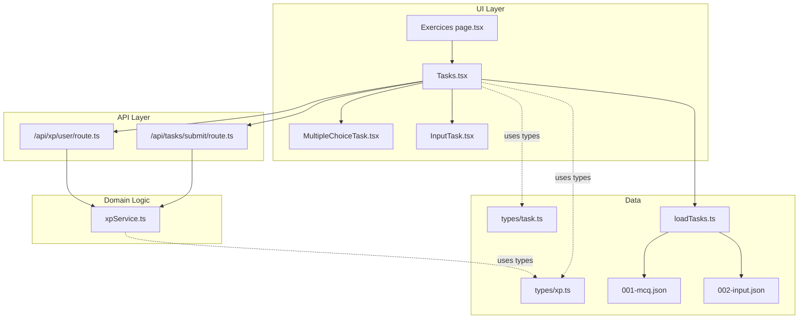
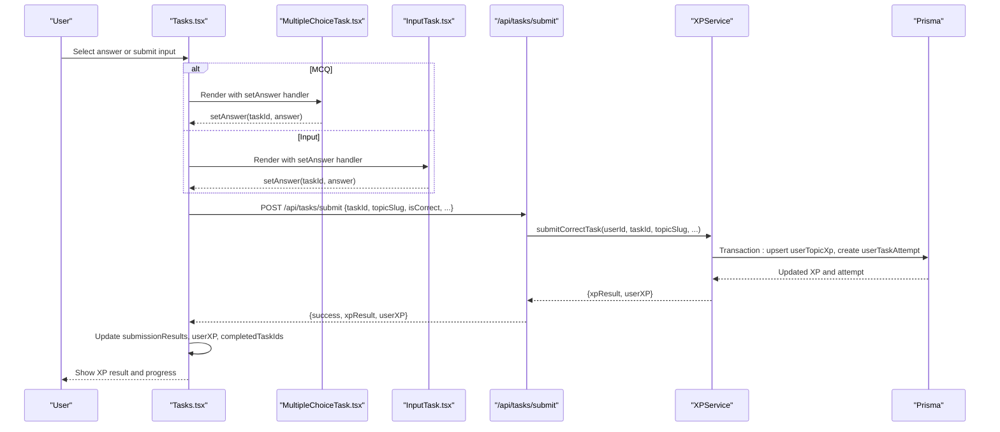
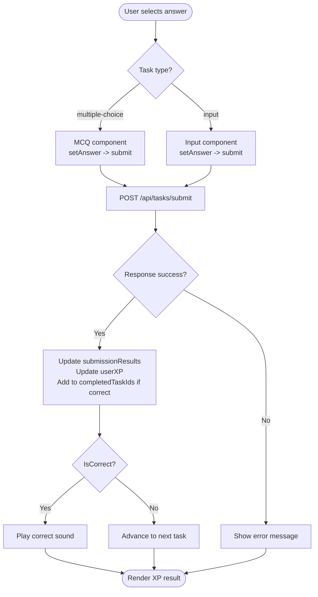
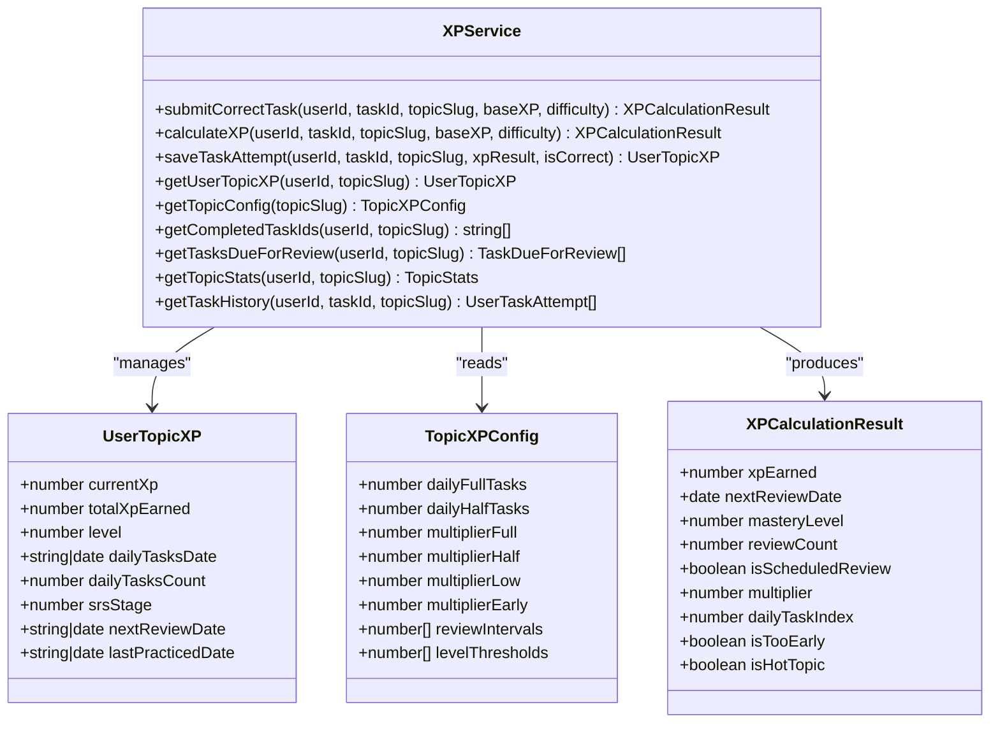
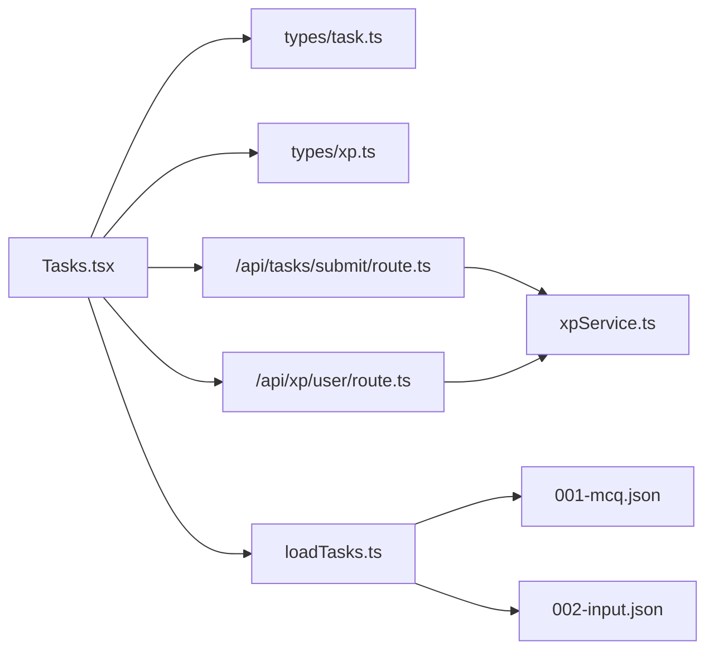

# Task System Architecture

<cite>
**Referenced Files in This Document**
- [Tasks.tsx](file://components/tasks/Tasks.tsx)
- [InputTask.tsx](file://components/tasks/InputTask.tsx)
- [MultipleChoiceTask.tsx](file://components/tasks/MultipleChoiceTask.tsx)
- [xpService.ts](file://lib/xp/xpService.ts)
- [route.ts](file://app/api/tasks/submit/route.ts)
- [route.ts](file://app/api/xp/user/route.ts)
- [task.ts](file://types/task.ts)
- [xp.ts](file://types/xp.ts)
- [page.tsx](file://app/(main)/math/[topic]/exercices/page.tsx)
- [page.tsx](file://app/(main)/math/[topic]/lesson/page.tsx)
- [loadTasks.ts](file://lib/loadTasks.ts)
- [001-mcq.json](file://content/math/addition_and_subtraction_of_fractions/tasks/001-mcq.json)
- [002-input.json](file://content/math/addition_and_subtraction_of_fractions/tasks/002-input.json)
- [AuthControls.tsx](file://components/tasks/AuthControls.tsx)
</cite>

## Table of Contents
1. [Introduction](#introduction)
2. [Project Structure](#project-structure)
3. [Core Components](#core-components)
4. [Architecture Overview](#architecture-overview)
5. [Detailed Component Analysis](#detailed-component-analysis)
6. [Dependency Analysis](#dependency-analysis)
7. [Performance Considerations](#performance-considerations)
8. [Troubleshooting Guide](#troubleshooting-guide)
9. [Conclusion](#conclusion)
10. [Appendices](#appendices)

## Introduction
This document explains the task system architecture powering the interactive learning interface. It covers the main Tasks component structure, task lifecycle management, state management patterns, real-time XP calculation integration, component hierarchy, filtering and completion tracking, user progress visualization, task submission flow, audio feedback system, and dynamic task rendering by type. Practical integration patterns, state synchronization with the XP service, and error handling strategies are included to help developers extend and maintain the system effectively.

## Project Structure
The task system spans UI components, data types, backend APIs, and content-driven task loading. The primary pieces are:
- UI components under components/tasks for rendering tasks and managing user interactions
- Backend routes under app/api for authenticating requests, validating submissions, and calculating XP
- XP calculation logic under lib/xp/xpService.ts implementing SRS-based XP mechanics
- Task data under content/math/<topic>/tasks as JSON files
- Task loading utility under lib/loadTasks.ts
- Type definitions under types/ for tasks and XP

**Diagram sources**
- [Tasks.tsx](file://components/tasks/Tasks.tsx#L1-L441)
- [MultipleChoiceTask.tsx](file://components/tasks/MultipleChoiceTask.tsx#L1-L72)
- [InputTask.tsx](file://components/tasks/InputTask.tsx#L1-L97)
- [route.ts](file://app/api/tasks/submit/route.ts#L1-L59)
- [route.ts](file://app/api/xp/user/route.ts#L1-L41)
- [xpService.ts](file://lib/xp/xpService.ts#L1-L795)
- [task.ts](file://types/task.ts#L1-L25)
- [xp.ts](file://types/xp.ts#L1-L131)
- [page.tsx](file://app/(main)/math/[topic]/exercices/page.tsx#L1-L32)
- [loadTasks.ts](file://lib/loadTasks.ts#L1-L31)
- [001-mcq.json](file://content/math/addition_and_subtraction_of_fractions/tasks/001-mcq.json#L1-L250)
- [002-input.json](file://content/math/addition_and_subtraction_of_fractions/tasks/002-input.json#L1-L10)

**Section sources**
- [Tasks.tsx](file://components/tasks/Tasks.tsx#L1-L441)
- [page.tsx](file://app/(main)/math/[topic]/exercices/page.tsx#L1-L32)
- [loadTasks.ts](file://lib/loadTasks.ts#L1-L31)

## Core Components
- Tasks: orchestrates task rendering, user answers, submission, XP updates, completion tracking, and progress display. It filters out completed tasks, manages current task index, and integrates audio feedback.
- MultipleChoiceTask: renders multiple-choice questions, tracks selection, and triggers submission with the selected index.
- InputTask: renders input-based questions, normalizes answers, validates against accepted forms, and submits the answer on submit or Enter.
- XPService: encapsulates XP calculation, SRS scheduling, daily multipliers, and persistence via database transactions.
- API routes: authenticate sessions, validate submissions, and return XP results and user XP snapshots.
- Type definitions: define task structures and XP-related domain models.

Key responsibilities:
- Dynamic rendering: switch between MCQ and input task components based on task type
- State management: local React state for answers, submission results, XP, topic config, and completion set
- Real-time XP: on correct submission, the UI updates immediately with XP result and user XP snapshot
- Filtering: hide completed tasks until the review period allows reattempts

**Section sources**
- [Tasks.tsx](file://components/tasks/Tasks.tsx#L12-L441)
- [MultipleChoiceTask.tsx](file://components/tasks/MultipleChoiceTask.tsx#L11-L72)
- [InputTask.tsx](file://components/tasks/InputTask.tsx#L11-L97)
- [xpService.ts](file://lib/xp/xpService.ts#L118-L293)
- [route.ts](file://app/api/tasks/submit/route.ts#L6-L58)
- [route.ts](file://app/api/xp/user/route.ts#L5-L40)
- [task.ts](file://types/task.ts#L1-L25)
- [xp.ts](file://types/xp.ts#L83-L131)

## Architecture Overview
The system follows a layered architecture:
- UI layer: Tasks and child task components manage user interactions and render feedback
- API layer: Next.js routes validate authentication and delegate to XPService for calculations
- Domain logic: XPService encapsulates XP mechanics, SRS scheduling, and persistence
- Data layer: Prisma ORM persists user XP, attempts, and topic configurations

**Diagram sources**
- [Tasks.tsx](file://components/tasks/Tasks.tsx#L64-L122)
- [MultipleChoiceTask.tsx](file://components/tasks/MultipleChoiceTask.tsx#L17-L22)
- [InputTask.tsx](file://components/tasks/InputTask.tsx#L24-L34)
- [route.ts](file://app/api/tasks/submit/route.ts#L34-L47)
- [xpService.ts](file://lib/xp/xpService.ts#L118-L293)

## Detailed Component Analysis

### Tasks Component
Responsibilities:
- Initialize and manage local state: current task index, answers, submission results, user XP, topic config, completed task IDs, and submission lock
- Fetch user XP and topic config on session/topic change
- Filter available tasks by excluding completed IDs
- Render current task dynamically based on type
- Handle task submission, correctness checks, audio feedback, and state updates
- Display XP progress bar, hot-topic badge, energy battery, and next review countdown

State management patterns:
- Local state for UI-only data (answers, results, indices)
- Derived state via useMemo to filter tasks
- Controlled updates to submissionResults and completedTaskIds
- Conditional rendering based on availability and completion

Real-time XP integration:
- On successful submission, the UI merges returned XP result and user XP snapshot into local state
- Progress bar and energy battery reflect immediate updates

Audio feedback:
- Preloads correct answer sound on mount
- Plays sound when a correct answer is detected locally before submission

Task lifecycle:
- Load tasks from content via loadTasks
- Filter out completed tasks
- Navigate forward/backward between available tasks
- On completion, show completion screen with next review date

**Diagram sources**
- [Tasks.tsx](file://components/tasks/Tasks.tsx#L64-L122)
- [route.ts](file://app/api/tasks/submit/route.ts#L27-L32)

**Section sources**
- [Tasks.tsx](file://components/tasks/Tasks.tsx#L12-L441)

### MultipleChoiceTask Component
Responsibilities:
- Render question and options
- Track selected option
- Disable further selection after choice
- Provide visual feedback for correct/incorrect selections
- Pass answer to parent via setAnswer

Behavior:
- Clears selection on task change
- Disables buttons after selection to prevent re-selection
- Shows optional comment for wrong choices

**Section sources**
- [MultipleChoiceTask.tsx](file://components/tasks/MultipleChoiceTask.tsx#L11-L72)

### InputTask Component
Responsibilities:
- Render input field with placeholder
- Normalize and compare user answer against accepted forms
- Provide submit/clear actions
- Disable controls after submission
- Show correct/incorrect feedback with accepted answers list

Validation:
- Normalization trims whitespace and lowercases strings
- Accepts either explicit accepted list or correct answer

**Section sources**
- [InputTask.tsx](file://components/tasks/InputTask.tsx#L11-L97)

### XPService (XP Calculation Engine)
Responsibilities:
- Compute XP rewards considering daily multipliers, SRS stage, and anti-grind mechanics
- Manage topic XP configs and user progress
- Persist results atomically via database transactions
- Provide helpers for level computation, daily multipliers, and SRS intervals

Key algorithms:
- Daily multiplier tiering: full XP for first N tasks, half for next N, low otherwise
- SRS scheduling: advance stage only during scheduled reviews; early attempts do not increase stage but still grant XP
- Level thresholds: compute level and next threshold based on accumulated XP
- Anti-grind: minimum XP percentage and exponential decay for repeated attempts outside schedule

**Diagram sources**
- [xpService.ts](file://lib/xp/xpService.ts#L11-L795)
- [xp.ts](file://types/xp.ts#L50-L96)

**Section sources**
- [xpService.ts](file://lib/xp/xpService.ts#L118-L293)
- [xp.ts](file://types/xp.ts#L83-L96)

### API Routes
- POST /api/tasks/submit: Validates session, ensures isCorrect, delegates to XPService.submitCorrectTask, and returns XP result and user XP snapshot
- GET /api/xp/user: Validates session, fetches user XP, topic config, and completed task IDs for the given topic

Error handling:
- Unauthorized and missing fields return appropriate HTTP errors
- Internal server errors are caught and returned as 500

**Section sources**
- [route.ts](file://app/api/tasks/submit/route.ts#L6-L58)
- [route.ts](file://app/api/xp/user/route.ts#L5-L40)

### Task Data Model and Rendering
Task types:
- Multiple-choice: includes question, options, and answer index
- Input: includes question, placeholder, correct answer, and accepted variants

Dynamic rendering:
- Tasks.tsx switches on task.type to render the appropriate component
- InputTask normalizes answers and compares against accepted forms
- MultipleChoiceTask disables selection after choice and shows comments for wrong answers

Content loading:
- loadTasks reads all JSON files in the topic’s tasks directory and parses them into TTask[]
- Exercices page loads tasks and passes them to Tasks

**Section sources**
- [task.ts](file://types/task.ts#L1-L25)
- [Tasks.tsx](file://components/tasks/Tasks.tsx#L180-L200)
- [InputTask.tsx](file://components/tasks/InputTask.tsx#L18-L34)
- [MultipleChoiceTask.tsx](file://components/tasks/MultipleChoiceTask.tsx#L17-L22)
- [loadTasks.ts](file://lib/loadTasks.ts#L5-L30)
- [page.tsx](file://app/(main)/math/[topic]/exercices/page.tsx#L17-L28)
- [001-mcq.json](file://content/math/addition_and_subtraction_of_fractions/tasks/001-mcq.json#L1-L250)
- [002-input.json](file://content/math/addition_and_subtraction_of_fractions/tasks/002-input.json#L1-L10)

### Authentication Controls
- AuthControls renders LoginButton or LogoutButton depending on authentication state
- Tasks relies on next-auth session to gate XP queries and submissions

**Section sources**
- [AuthControls.tsx](file://components/tasks/AuthControls.tsx#L10-L12)

## Dependency Analysis
The system exhibits clear separation of concerns:
- UI depends on types and routes
- Routes depend on XPService
- XPService depends on Prisma models and computes XP logic
- Content loading is decoupled from UI via loadTasks

**Diagram sources**
- [Tasks.tsx](file://components/tasks/Tasks.tsx#L1-L11)
- [task.ts](file://types/task.ts#L1-L25)
- [xp.ts](file://types/xp.ts#L1-L131)
- [route.ts](file://app/api/tasks/submit/route.ts#L1-L5)
- [route.ts](file://app/api/xp/user/route.ts#L1-L4)
- [xpService.ts](file://lib/xp/xpService.ts#L1-L11)
- [loadTasks.ts](file://lib/loadTasks.ts#L1-L5)
- [001-mcq.json](file://content/math/addition_and_subtraction_of_fractions/tasks/001-mcq.json#L1-L2)
- [002-input.json](file://content/math/addition_and_subtraction_of_fractions/tasks/002-input.json#L1)

**Section sources**
- [Tasks.tsx](file://components/tasks/Tasks.tsx#L1-L11)
- [xpService.ts](file://lib/xp/xpService.ts#L1-L11)

## Performance Considerations
- Memoized filtering: availableTasks computed via useMemo prevents unnecessary re-renders when tasks/completedTaskIds change
- Local state batching: submissionResults and completedTaskIds updated together after API response
- Minimal DOM updates: only XP result and progress UI react to frequent state changes
- Efficient XP queries: API returns only necessary fields (userXP, topicConfig, completedTaskIds)
- Database transactions: XPService wraps updates in single transaction to avoid partial writes

Recommendations:
- Debounce rapid successive submissions if needed
- Consider lazy-loading audio assets if bundle size becomes a concern
- For very large task sets, consider pagination or virtualization in future iterations

[No sources needed since this section provides general guidance]

## Troubleshooting Guide
Common issues and resolutions:
- Unauthorized access to XP APIs: ensure user is authenticated; routes return 401 when session is missing
- Missing required fields in submission: routes validate taskId and topicSlug; ensure frontend sends them
- Incorrect answers: route returns failure with message; UI shows feedback without updating XP
- Server errors: routes catch exceptions and return 500; check server logs for details
- No tasks shown: verify content files exist and loadTasks can parse them; ensure topicSlug matches content path
- Audio not playing: correctAnswer sound is preloaded on mount; ensure asset exists at public/sounds/correctChoice.mp3

**Section sources**
- [route.ts](file://app/api/tasks/submit/route.ts#L10-L32)
- [route.ts](file://app/api/tasks/submit/route.ts#L48-L57)
- [route.ts](file://app/api/xp/user/route.ts#L9-L21)
- [route.ts](file://app/api/xp/user/route.ts#L33-L39)
- [Tasks.tsx](file://components/tasks/Tasks.tsx#L37-L45)
- [Tasks.tsx](file://components/tasks/Tasks.tsx#L34-L39)

## Conclusion
The task system architecture cleanly separates UI, API, and domain logic while integrating real-time XP calculations powered by SRS scheduling and daily multipliers. Tasks composes specialized components, manages state efficiently, and synchronizes with the XP service to provide immediate feedback. The modular design supports easy extension with new task types, improved audio feedback, and enhanced progress visualizations.

[No sources needed since this section summarizes without analyzing specific files]

## Appendices

### Practical Integration Patterns
- Adding a new task type:
  - Define a new interface in types/task.ts
  - Extend Tasks.tsx switch statement to render the new component
  - Implement the component under components/tasks
  - Ensure content JSON conforms to the new type
- Extending XP mechanics:
  - Modify XPService methods to incorporate new factors (e.g., streak bonuses)
  - Update API responses and UI to display new XP metrics
- Enhancing progress visualization:
  - Add new metrics to UserTopicXP or XPCalculationResult
  - Update Tasks.tsx progress UI to reflect new data

[No sources needed since this section provides general guidance]