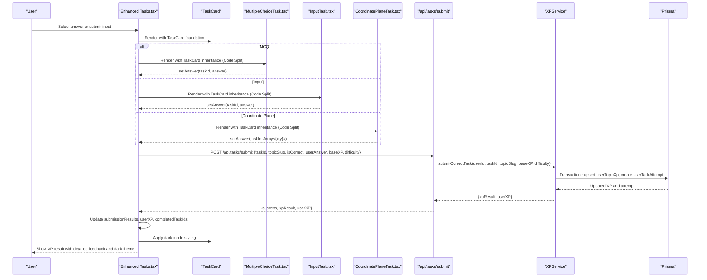
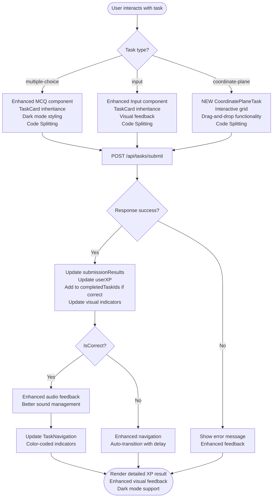
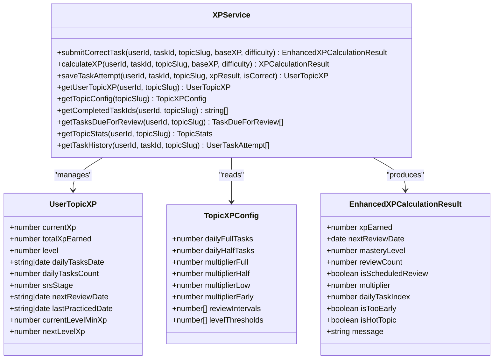
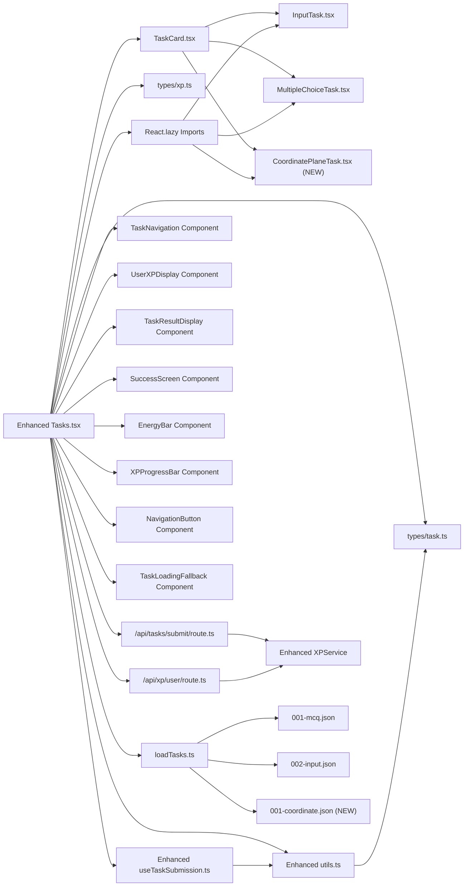

# Task System Architecture

<cite>
**Referenced Files in This Document**
- [TaskCard.tsx](file://components/tasks/TaskCard.tsx)
- [InputTask.tsx](file://components/tasks/InputTask.tsx)
- [MultipleChoiceTask.tsx](file://components/tasks/MultipleChoiceTask.tsx)
- [CoordinatePlaneTask.tsx](file://components/tasks/CoordinatePlaneTask.tsx)
- [Tasks.tsx](file://components/tasks/Tasks.tsx)
- [useTaskSubmission.ts](file://components/tasks/hooks/useTaskSubmission.ts)
- [utils.ts](file://components/tasks/utils.ts)
- [xpService.ts](file://lib/xp/xpService.ts)
- [route.ts](file://app/api/tasks/submit/route.ts)
- [route.ts](file://app/api/xp/user/route.ts)
- [task.ts](file://types/task.ts)
- [xp.ts](file://types/xp.ts)
- [page.tsx](file://app/(main)/math/[topic]/exercices/page.tsx)
- [page.tsx](file://app/(main)/math/[topic]/lesson/page.tsx)
- [loadTasks.ts](file://lib/loadTasks.ts)
- [001-mcq.json](file://content/math/addition_and_subtraction_of_fractions/tasks/001-mcq.json)
- [002-input.json](file://content/math/addition_and_subtraction_of_fractions/tasks/002-input.json)
- [001-coordinate.json](file://content/geometry/coordinate-plane-example/tasks/001-coordinate.json)
- [AuthControls.tsx](file://components/tasks/AuthControls.tsx)
- [globals.css](file://app/globals.css)
- [layout.tsx](file://app/layout.tsx)
- [coordinate-plane-tasks.md](file://docs/coordinate-plane-tasks.md)
- [task-code-splitting.md](file://docs/task-code-splitting.md)
</cite>

## Update Summary
**Changes Made**
- **Major Structural Enhancement**: Added comprehensive CoordinatePlaneTask component for interactive coordinate plane exercises with drag-and-drop functionality
- **Enhanced Code Splitting Implementation**: Implemented React.lazy and Suspense for progressive task component loading
- **Improved Task Navigation System**: Enhanced TaskNavigation component with comprehensive visual indicators and improved user experience
- **Advanced Task Submission Flow**: Enhanced useTaskSubmission hook with coordinate plane task serialization and validation
- **Expanded Task Type Support**: Added TCoordinatePlaneTask interface and comprehensive coordinate plane task validation
- **Performance Optimization**: Significant bundle size reduction through intelligent code splitting
- **Enhanced Visual Feedback**: Comprehensive color-coded feedback system for coordinate plane tasks with dark mode support
- **Responsive Design Patterns**: Adaptive grid sizing with dynamic cell calculation and container-based responsive design
- **Improved User Interaction Models**: Tap-and-drag point adjustment with pointer events, drag thresholds, and visual feedback

## Table of Contents
1. [Introduction](#introduction)
2. [Project Structure](#project-structure)
3. [Core Components](#core-components)
4. [Architecture Overview](#architecture-overview)
5. [Detailed Component Analysis](#detailed-component-analysis)
6. [Enhanced Task Navigation System](#enhanced-task-navigation-system)
7. [Coordinate Plane Task System](#coordinate-plane-task-system)
8. [Advanced Code Splitting Implementation](#advanced-code-splitting-implementation)
9. [Responsive Design Patterns](#responsive-design-patterns)
10. [Enhanced User Interaction Models](#enhanced-user-interaction-models)
11. [Visual Feedback and User Experience](#visual-feedback-and-user-experience)
12. [Advanced XP Calculation Integration](#advanced-xp-calculation-integration)
13. [Dark Mode Styling System](#dark-mode-styling-system)
14. [Dependency Analysis](#dependency-analysis)
15. [Performance Considerations](#performance-considerations)
16. [Troubleshooting Guide](#troubleshooting-guide)
17. [Conclusion](#conclusion)
18. [Appendices](#appendices)

## Introduction
This document explains the enhanced task system architecture powering the interactive learning interface. The system has undergone significant structural improvements with the introduction of comprehensive visual feedback systems, advanced interaction patterns, enhanced user experience flows, and the new CoordinatePlaneTask component for interactive coordinate plane exercises. The architecture now features refined TaskCard components, sophisticated task navigation with color-coded status indicators, real-time XP calculation integration, improved audio feedback systems, intelligent code splitting implementation that significantly reduces bundle sizes while maintaining excellent performance, and advanced responsive design patterns with adaptive grid sizing.

## Project Structure
The task system spans UI components, data types, backend APIs, and content-driven task loading. The enhanced architecture now features:
- **TaskCard foundation**: Refined foundational wrapper providing consistent styling and layout for all task types with improved dark mode support
- **Enhanced UI components** under components/tasks for rendering tasks, managing user interactions, and displaying progress with comprehensive visual feedback systems
- **New CoordinatePlaneTask component**: Specialized component for interactive coordinate plane exercises with grid-based point placement, drag-and-drop functionality, and adaptive sizing
- **Advanced code splitting implementation**: React.lazy and Suspense integration for progressive task component loading
- **Enhanced task submission system**: Comprehensive answer validation and serialization for all task types including coordinate plane tasks
- **Advanced XP tracking system** with XPService implementing sophisticated SRS-based mechanics, daily multipliers, and comprehensive progress monitoring
- **Backend routes** under app/api for authenticating requests, validating submissions, and calculating XP with detailed feedback
- **Task data** under content/math/<topic>/tasks and content/geometry/<topic>/tasks as JSON files with enhanced type definitions
- **Task loading utility** under lib/loadTasks.ts with improved error handling
- **Type definitions** under types/ for tasks, XP calculations, and submission responses
- **Global styling** with comprehensive dark mode support and theme-aware components

```mermaid
graph TB
subgraph "Enhanced Task Card Architecture"
TaskCard["TaskCard.tsx (Foundation)"]
InputTask["InputTask.tsx"]
MultipleChoiceTask["MultipleChoiceTask.tsx"]
CoordinatePlaneTask["CoordinatePlaneTask.tsx (NEW)"]
TaskCard --> InputTask
TaskCard --> MultipleChoiceTask
TaskCard --> CoordinatePlaneTask
end
subgraph "Enhanced UI Layer"
TasksComp["Tasks.tsx (Enhanced with Code Splitting)"]
TaskNav["TaskNavigation Component"]
UserXP["UserXPDisplay Component"]
XPResult["TaskResultDisplay Component"]
SuccessScreen["SuccessScreen Component"]
EnergyBar["EnergyBar Component"]
XPProgress["XPProgressBar Component"]
NavigationButton["NavigationButton Component"]
TaskLoadingFallback["TaskLoadingFallback Component"]
end
subgraph "API Layer"
SubmitRoute["/api/tasks/submit/route.ts"]
XPUserRoute["/api/xp/user/route.ts"]
end
subgraph "Advanced Domain Logic"
XPService["xpService.ts (Enhanced XP Mechanics)"]
UseTaskSubmission["useTaskSubmission.ts (Enhanced)"]
Utils["utils.ts (Enhanced)"]
</subgraph
subgraph "Styling & Theming"
GlobalsCSS["globals.css (Dark Mode)"]
LayoutTSX["layout.tsx (ThemeProvider)"]
TypesTask["types/task.ts (Enhanced)"]
TypesXP["types/xp.ts"]
LoadTasks["loadTasks.ts"]
ContentMCQ["001-mcq.json"]
ContentInput["002-input.json"]
ContentCoord["001-coordinate.json (NEW)"]
</subgraph>
InputTask --> SubmitRoute
MultipleChoiceTask --> SubmitRoute
CoordinatePlaneTask --> SubmitRoute
TasksComp --> TaskCard
TasksComp --> TaskNav
TasksComp --> UserXP
TasksComp --> XPResult
TasksComp --> SuccessScreen
TasksComp --> EnergyBar
TasksComp --> XPProgress
TasksComp --> NavigationButton
TasksComp --> TaskLoadingFallback
SubmitRoute --> XPService
XPUserRoute --> XPService
TasksComp --> UseTaskSubmission
TasksComp --> Utils
UseTaskSubmission --> Utils
UseTaskSubmission --> TypesTask
Utils --> TypesTask
TasksComp -. uses types .-> TypesTask
TasksComp -. uses types .-> TypesXP
XPService -. uses types .-> TypesXP
```

**Diagram sources**
- [TaskCard.tsx](file://components/tasks/TaskCard.tsx#L1-L18)
- [InputTask.tsx](file://components/tasks/InputTask.tsx#L1-L120)
- [MultipleChoiceTask.tsx](file://components/tasks/MultipleChoiceTask.tsx#L1-L74)
- [CoordinatePlaneTask.tsx](file://components/tasks/CoordinatePlaneTask.tsx#L1-L554)
- [Tasks.tsx](file://components/tasks/Tasks.tsx#L1-L373)
- [useTaskSubmission.ts](file://components/tasks/hooks/useTaskSubmission.ts#L1-L165)
- [utils.ts](file://components/tasks/utils.ts#L1-L139)
- [globals.css](file://app/globals.css#L4-L13)
- [layout.tsx](file://app/layout.tsx#L35-L41)
- [task.ts](file://types/task.ts#L1-L38)

**Section sources**
- [TaskCard.tsx](file://components/tasks/TaskCard.tsx#L1-L18)
- [InputTask.tsx](file://components/tasks/InputTask.tsx#L1-L120)
- [MultipleChoiceTask.tsx](file://components/tasks/MultipleChoiceTask.tsx#L1-L74)
- [CoordinatePlaneTask.tsx](file://components/tasks/CoordinatePlaneTask.tsx#L1-L554)
- [Tasks.tsx](file://components/tasks/Tasks.tsx#L1-L373)
- [useTaskSubmission.ts](file://components/tasks/hooks/useTaskSubmission.ts#L1-L165)
- [utils.ts](file://components/tasks/utils.ts#L1-L139)
- [globals.css](file://app/globals.css#L1-L25)
- [layout.tsx](file://app/layout.tsx#L1-L46)

## Core Components
- **TaskCard**: **Enhanced** foundational component providing consistent card layout, question display, and comprehensive dark mode styling for all task types
- **Enhanced InputTask**: Now inherits from TaskCard with improved visual feedback, color-coded input fields, and enhanced dark mode styling
- **Enhanced MultipleChoiceTask**: Now inherits from TaskCard with consistent styling patterns, comprehensive color-coded options, and enhanced dark theme support
- **Enhanced CoordinatePlaneTask**: **New** specialized component for interactive coordinate plane exercises with grid-based point placement, drag-and-drop functionality, adaptive sizing, and comprehensive visual feedback
- **Enhanced Tasks Component**: Expanded to 373 lines with comprehensive task navigation, visual feedback systems, energy calculation, improved user experience flows, and code splitting implementation
- **TaskNavigation**: **Enhanced** component providing visual task grid with color-coded status indicators (green for correct, red for incorrect, blue for current)
- **Enhanced useTaskSubmission Hook**: **Enhanced** with coordinate plane task serialization and comprehensive answer validation
- **Enhanced TaskLoadingFallback**: **New** component for displaying loading states during code splitting
- **EnergyBar**: **Enhanced** component for dynamic energy calculation showing remaining daily tasks with color-coded progress bars
- **XPProgressBar**: **Enhanced** component for visual XP progress toward next level with gradient styling
- **UserXPDisplay**: **Enhanced** comprehensive XP display with hot-topic detection, level information, and upcoming review timers
- **TaskResultDisplay**: **Enhanced** detailed feedback component with XP breakdown, multipliers, and review scheduling information
- **SuccessScreen**: **Enhanced** completion celebration component with next review date and motivational messaging
- **NavigationButton**: **New** component for consistent button styling across the task interface
- **Enhanced XPService**: Advanced XP calculation engine with SRS-based mechanics, daily multipliers, and comprehensive progress tracking
- **Enhanced Utils**: **Enhanced** with coordinate plane task validation and comprehensive helper functions
- **API routes**: Enhanced authentication, validation, and comprehensive XP result handling
- **Type definitions**: Complete type system for tasks, XP calculations, and submission responses
- **Dark Mode System**: Comprehensive theming support with next-themes integration and Tailwind dark variants

Key responsibilities:
- **TaskCard foundation**: Provides consistent card layout, question header, and dark mode compatible styling
- **Enhanced state management**: Comprehensive local React state for current task index, answers, submission results, user XP, topic config, completed task IDs, submission lock, and auto-transition control
- **Advanced task navigation**: Visual task navigation with color-coded indicators for correct/incorrect answers and current task highlighting
- **Enhanced code splitting**: Intelligent progressive loading of task components using React.lazy and Suspense
- **Energy calculation system**: Daily task limits, XP multipliers, and hot-topic detection with visual energy bars
- **Real-time XP integration**: Immediate XP updates with detailed XP calculation results and user XP snapshots
- **Visual feedback system**: Color-coded task navigation, progress indicators, and completion status with dark mode compatibility
- **Auto-transition functionality**: Intelligent task progression with configurable delays
- **Enhanced completion tracking**: Comprehensive task completion monitoring with automatic topic finishing detection
- **Comprehensive XP tracking**: Advanced SRS scheduling, daily multipliers, anti-grind mechanics, and level computation
- **Coordinate plane task support**: Interactive grid-based exercises with point placement, validation, visual feedback, and drag-and-drop functionality

**Section sources**
- [TaskCard.tsx](file://components/tasks/TaskCard.tsx#L1-L18)
- [InputTask.tsx](file://components/tasks/InputTask.tsx#L1-L120)
- [MultipleChoiceTask.tsx](file://components/tasks/MultipleChoiceTask.tsx#L1-L74)
- [CoordinatePlaneTask.tsx](file://components/tasks/CoordinatePlaneTask.tsx#L1-L554)
- [Tasks.tsx](file://components/tasks/Tasks.tsx#L1-L373)
- [useTaskSubmission.ts](file://components/tasks/hooks/useTaskSubmission.ts#L1-L165)
- [utils.ts](file://components/tasks/utils.ts#L1-L139)
- [globals.css](file://app/globals.css#L4-L13)
- [layout.tsx](file://app/layout.tsx#L35-L41)

## Architecture Overview
The system follows a layered architecture with enhanced state management, real-time feedback, comprehensive dark mode support, and intelligent code splitting:
- **UI layer**: Enhanced Tasks and child task components with TaskCard foundation, comprehensive visual feedback, navigation, and code splitting
- **API layer**: Next.js routes with robust authentication and delegation to XPService for calculations
- **Domain logic**: XPService with advanced SRS scheduling, daily multipliers, and comprehensive XP mechanics
- **Data layer**: Prisma ORM with atomic transactions for user XP, attempts, and topic configurations
- **Styling layer**: Comprehensive dark mode support with Tailwind dark variants and next-themes integration

```mermaid
sequenceDiagram
participant U as "User"
participant T as "Enhanced Tasks.tsx"
participant TC as "TaskCard"
participant MCQ as "MultipleChoiceTask.tsx"
participant IN as "InputTask.tsx"
participant CP as "CoordinatePlaneTask.tsx"
participant API as "/api/tasks/submit"
participant SVC as "XPService"
participant DB as "Prisma"
U->>T : Select answer or submit input
T->>TC : Render with TaskCard foundation
alt MCQ
T->>MCQ : Render with TaskCard inheritance (Code Split)
MCQ-->>T : setAnswer(taskId, answer)
else Input
T->>IN : Render with TaskCard inheritance (Code Split)
IN-->>T : setAnswer(taskId, answer)
else Coordinate Plane
T->>CP : Render with TaskCard inheritance (Code Split)
CP-->>T : setAnswer(taskId, Array<{x,y}>)
end
T->>API : POST /api/tasks/submit {taskId, topicSlug, isCorrect, userAnswer, baseXP, difficulty}
API->>SVC : submitCorrectTask(userId, taskId, topicSlug, baseXP, difficulty)
SVC->>DB : Transaction : upsert userTopicXp, create userTaskAttempt
DB-->>SVC : Updated XP and attempt
SVC-->>API : {xpResult, userXP}
API-->>T : {success, xpResult, userXP}
T->>T : Update submissionResults, userXP, completedTaskIds
T->>TC : Apply dark mode styling
T-->>U : Show XP result with detailed feedback and dark theme
```

**Diagram sources**
- [Tasks.tsx](file://components/tasks/Tasks.tsx#L276-L292)
- [TaskCard.tsx](file://components/tasks/TaskCard.tsx#L8-L17)
- [InputTask.tsx](file://components/tasks/InputTask.tsx#L63-L118)
- [MultipleChoiceTask.tsx](file://components/tasks/MultipleChoiceTask.tsx#L33-L71)
- [CoordinatePlaneTask.tsx](file://components/tasks/CoordinatePlaneTask.tsx#L87-L94)
- [route.ts](file://app/api/tasks/submit/route.ts#L42-L55)
- [xpService.ts](file://lib/xp/xpService.ts#L118-L293)

## Detailed Component Analysis

### Enhanced TaskCard Foundation Component
**Enhanced** TaskCard component serves as the foundational wrapper for all task types, providing consistent styling and layout:

**Core Responsibilities:**
- **Consistent card layout**: Rounded corners, border styling, and shadow effects with improved dark mode compatibility
- **Question header display**: Proper typography and spacing for task questions with theme-aware styling
- **Dark mode compatibility**: Comprehensive dark theme support with proper color schemes
- **Child component hosting**: Flexible container for task-specific implementations with consistent styling
- **Accessibility compliance**: Proper semantic structure and ARIA attributes

**Enhanced Dark Mode Features:**
- **Light theme defaults**: White background, gray borders, dark text with improved contrast
- **Dark theme variants**: Gray-800 background, gray-700 borders, gray-100 text with proper accessibility
- **Consistent color patterns**: Proper contrast ratios and accessible color combinations
- **Transition support**: Smooth theme switching with CSS transitions and improved visual feedback

**Section sources**
- [TaskCard.tsx](file://components/tasks/TaskCard.tsx#L1-L18)

### Enhanced InputTask Component
The InputTask component now inherits from TaskCard with comprehensive enhancements:

**Enhanced Features:**
- **TaskCard inheritance**: Inherits consistent card layout and dark mode styling with improved visual feedback
- **Color-coded input fields**: Green for correct answers, red for incorrect inputs with dark mode support
- **Enhanced visual feedback**: Success and error messages with proper dark theme styling and improved user experience
- **Improved styling patterns**: Consistent border styling, background colors, and transition effects with theme-aware variants
- **Dark mode compatibility**: Proper color schemes for all visual states (correct, incorrect, disabled)
- **Clear button enhancement**: Improved styling with dark mode support and better accessibility

**Enhanced Visual Feedback System:**
- **Correct answers**: Green borders with check marks and success styling in both themes with improved animations
- **Incorrect answers**: Red borders with cross marks and error styling with dark mode variants and educational comments
- **Input states**: Proper visual indication of input states with consistent styling patterns
- **Disabled states**: Consistent cursor and opacity handling for locked selections with theme-aware styling

**Section sources**
- [InputTask.tsx](file://components/tasks/InputTask.tsx#L1-L120)
- [TaskCard.tsx](file://components/tasks/TaskCard.tsx#L8-L17)

### Enhanced MultipleChoiceTask Component
The MultipleChoiceTask component now inherits from TaskCard with comprehensive styling enhancements:

**Enhanced Features:**
- **TaskCard inheritance**: Inherits consistent card layout and dark mode styling with improved visual feedback
- **Comprehensive color-coded options**: Green for correct answers, red for incorrect selections, with dark mode variants
- **Enhanced styling patterns**: Gradient backgrounds, shadow effects, and responsive design with dark theme support
- **Disabled state handling**: Proper button disabling after selection with visual feedback in both themes
- **Educational comment styling**: Detailed explanations for wrong answers with proper dark mode styling and improved readability
- **Visual indicator enhancement**: Check marks and cross marks with consistent styling patterns and better accessibility

**Enhanced Visual Indicators:**
- **Correct answers**: Green borders with check marks and success styling in both light and dark themes with improved animations
- **Incorrect answers**: Red borders with cross marks and error styling with dark mode variants and educational feedback
- **Selected options**: Visual distinction from unselected options with consistent styling patterns and improved accessibility
- **Disabled states**: Proper cursor and opacity handling for locked selections with theme-aware styling

**Section sources**
- [MultipleChoiceTask.tsx](file://components/tasks/MultipleChoiceTask.tsx#L1-L74)
- [TaskCard.tsx](file://components/tasks/TaskCard.tsx#L8-L17)

### Enhanced CoordinatePlaneTask Component
**New** CoordinatePlaneTask component provides interactive coordinate plane exercises with comprehensive functionality and advanced user interaction models:

**Core Responsibilities:**
- **Interactive grid system**: SVG-based coordinate plane with customizable grid dimensions and axis labels
- **Point placement mechanics**: Click-to-place functionality with support for single and multiple point modes
- **Adaptive sizing**: Dynamic cell size calculation to prevent overflow and maintain aspect ratio
- **Visual feedback system**: Color-coded point indicators (blue for placed, green for correct, red for incorrect)
- **Validation system**: Comprehensive answer checking with order-independent comparison
- **Dark mode compatibility**: Full theme-aware styling for all visual elements
- **Drag-and-drop functionality**: Pointer-based point manipulation with visual feedback and precision placement

**Enhanced Features:**
- **Grid customization**: Configurable grid size with min/max X/Y values and axis label steps
- **Point management**: Support for adding/removing points and single/multiple point modes
- **Visual indicators**: Correct points display with labels and educational feedback
- **Interactive elements**: Hover effects, click handling, and responsive design
- **Accessibility**: Proper ARIA attributes and keyboard navigation support
- **Drag state management**: Tap-and-drag point adjustment with pointer events and drag thresholds
- **Visual feedback**: Target markers, connecting lines, and coordinate display during drag operations

**Coordinate Plane Functionality:**
- **Grid rendering**: Dynamic SVG grid with axis lines, labels, and customizable step intervals
- **Point placement**: Precise coordinate snapping with visual feedback and validation
- **Answer validation**: Comprehensive comparison of placed points with correct solutions
- **Feedback system**: Immediate visual feedback with color-coded indicators and educational messages
- **Drag-and-drop mechanics**: Pointer-based point manipulation with visual lift and target markers

**Enhanced User Interaction Models:**
- **Pointer events**: Comprehensive pointer event handling for touch and mouse interactions
- **Drag thresholds**: Configurable movement thresholds to distinguish between clicks and drags
- **Visual lift effects**: Points lift above the grid during drag operations with smooth animations
- **Target markers**: Dashed circles indicating intended placement positions
- **Coordinate display**: Real-time coordinate display during drag operations
- **Touch action control**: Prevention of unwanted scrolling during drag operations

**Section sources**
- [CoordinatePlaneTask.tsx](file://components/tasks/CoordinatePlaneTask.tsx#L1-L554)
- [task.ts](file://types/task.ts#L24-L35)

### Enhanced Tasks Component
The Tasks component has been significantly enhanced from 200 to 373 lines with comprehensive improvements including code splitting:

**Core Responsibilities:**
- **Enhanced state management**: Comprehensive local state for current task index, answers, submission results, user XP, topic config, completed task IDs, submission lock, and auto-transition control
- **Advanced task navigation**: Visual task navigation with color-coded indicators for correct/incorrect answers and current task highlighting
- **Enhanced code splitting**: Intelligent progressive loading of task components using React.lazy and Suspense
- **Energy calculation system**: Daily task limits, XP multipliers, and hot-topic detection with visual energy bars
- **Real-time XP integration**: Detailed XP calculation results with multipliers, daily task indexing, and review scheduling
- **Auto-transition functionality**: Configurable task progression with 2-second delays and enhanced user experience
- **Enhanced completion tracking**: Comprehensive task completion monitoring with automatic topic finishing detection

**Enhanced Features:**
- **TaskNavigation component**: Visual task grid with color-coded status indicators (green for correct, red for incorrect, blue for current)
- **TaskLoadingFallback component**: Loading state display during code splitting with spinner animation
- **Enhanced useTaskSubmission hook**: Comprehensive answer validation and serialization for all task types
- **EnergyBar component**: Dynamic energy calculation showing remaining daily tasks with color-coded progress bars and improved visual feedback
- **UserXPDisplay component**: Comprehensive XP display with hot-topic detection, level information, and upcoming review timers
- **TaskResultDisplay component**: Detailed feedback with XP breakdown, multipliers, and review scheduling information
- **SuccessScreen component**: Completion celebration with next review date and motivational messaging
- **XPProgressBar component**: Visual XP progress toward next level with gradient styling and improved animations
- **NavigationButton component**: Consistent button styling across the task interface with theme-aware variants

**Enhanced State Management Patterns:**
- **Enhanced local state**: UI-only data management with comprehensive state updates and improved error handling
- **Memoized calculations**: Energy statistics and XP progress calculations with useMemo optimization
- **Controlled state updates**: Coordinated updates to submissionResults, completedTaskIds, and userXP
- **Conditional rendering**: Status-based component rendering with visual feedback and improved user experience

**Enhanced Code Splitting Implementation:**
- **React.lazy integration**: On-demand loading of task components with automatic chunk creation
- **Suspense boundaries**: Proper loading state management during component transitions
- **Bundle optimization**: Separate code chunks for each task type reducing initial bundle size
- **Performance monitoring**: Efficient caching and loading strategies for improved user experience

**Enhanced Real-time XP Integration:**
- **Detailed XP results**: Comprehensive XP calculation results with multipliers, daily task indexing, and review scheduling
- **Immediate UI updates**: Real-time XP progress bar and energy bar updates with smooth animations
- **Enhanced feedback**: Detailed XP breakdown with multiplier information and daily task status

**Enhanced Audio Feedback:**
- **Improved sound management**: Better audio resource handling with proper cleanup and enhanced user experience
- **Enhanced user experience**: More responsive audio feedback for correct answers with improved sound quality

```mermaid
flowchart TD
Start(["User interacts with task"]) --> CheckType{"Task type?"}
CheckType --> |multiple-choice| MCQPath["Enhanced MCQ component<br/>TaskCard inheritance<br/>Dark mode styling<br/>Code Splitting"]
CheckType --> |input| InputPath["Enhanced Input component<br/>TaskCard inheritance<br/>Visual feedback<br/>Code Splitting"]
CheckType --> |coordinate-plane| CoordPath["NEW CoordinatePlaneTask<br/>Interactive grid<br/>Drag-and-drop functionality<br/>Code Splitting"]
MCQPath --> Submit["POST /api/tasks/submit"]
InputPath --> Submit
CoordPath --> Submit
Submit --> Resp{"Response success?"}
Resp --> |No| ShowError["Show error message<br/>Enhanced feedback"]
Resp --> |Yes| UpdateState["Update submissionResults<br/>Update userXP<br/>Add to completedTaskIds if correct<br/>Update visual indicators"]
UpdateState --> PlaySound{"IsCorrect?"}
PlaySound --> |Yes| Sound["Enhanced audio feedback<br/>Better sound management"]
PlaySound --> |No| NextTask["Enhanced navigation<br/>Auto-transition with delay"]
Sound --> UpdateNav["Update TaskNavigation<br/>Color-coded indicators"]
UpdateNav --> Done(["Render detailed XP result<br/>Enhanced visual feedback<br/>Dark mode support"])
NextTask --> Done
ShowError --> Done
```

**Diagram sources**
- [Tasks.tsx](file://components/tasks/Tasks.tsx#L276-L292)
- [route.ts](file://app/api/tasks/submit/route.ts#L27-L32)

**Section sources**
- [Tasks.tsx](file://components/tasks/Tasks.tsx#L1-L373)

### Enhanced useTaskSubmission Hook
**Enhanced** useTaskSubmission hook provides comprehensive task submission management with coordinate plane task support:

**Enhanced Capabilities:**
- **Coordinate plane serialization**: JSON serialization of point arrays for coordinate plane tasks
- **Enhanced answer validation**: Comprehensive validation for all task types including coordinate plane tasks
- **Auto-transition handling**: Intelligent task progression with configurable delays and enhanced user experience
- **Error handling**: Comprehensive error handling for submission failures and network issues
- **State management**: Coordinated state updates for submission results, user XP, and completion tracking

**Key Features:**
- **JSON serialization**: Proper serialization of complex answer types (arrays, objects) for coordinate plane tasks
- **Answer validation**: Comprehensive validation logic for all task types with enhanced error handling
- **Auto-transition**: Configurable task progression with 2-second delays and smooth animations
- **State synchronization**: Coordinated updates to submission results, completed task IDs, and user XP
- **Performance optimization**: Efficient state updates and reduced re-renders

**Enhanced Submission Flow:**
- **Answer serialization**: Special handling for coordinate plane tasks with JSON.stringify
- **Validation integration**: Seamless integration with checkTaskAnswer utility function
- **Result handling**: Comprehensive result processing with user XP updates and completion tracking
- **Transition management**: Intelligent task progression with proper state coordination

**Section sources**
- [useTaskSubmission.ts](file://components/tasks/hooks/useTaskSubmission.ts#L1-L165)

### Enhanced Utils Module
**Enhanced** utils module provides comprehensive helper functions for task management and validation:

**Enhanced Capabilities:**
- **Coordinate plane validation**: Comprehensive validation logic for coordinate plane tasks with order-independent comparison
- **Enhanced answer checking**: Improved validation algorithms for all task types
- **Energy calculation**: Advanced energy statistics with hot-topic detection and daily task tracking
- **Navigation utilities**: Enhanced task navigation with improved algorithmic efficiency
- **Formatting utilities**: Comprehensive formatting functions for XP, time, and user interface elements

**Key Algorithms:**
- **Coordinate plane validation**: Order-independent point comparison with comprehensive edge case handling
- **Energy calculation**: Advanced daily task counting with hot-topic detection and percentage calculations
- **Task navigation**: Optimized algorithm for finding next unattempted tasks with exclusion support
- **Format utilities**: Enhanced formatting functions for time, XP, and user interface elements

**Enhanced Validation Logic:**
- **Coordinate plane tasks**: Comprehensive validation with array length checking and coordinate comparison
- **Multiple choice tasks**: Standard answer verification with enhanced error handling
- **Input tasks**: Exact string matching with enhanced validation
- **Task type safety**: Comprehensive type checking and validation for all task types

**Section sources**
- [utils.ts](file://components/tasks/utils.ts#L1-L139)

### Enhanced XPService (Enhanced XP Calculation Engine)
The XPService has been enhanced with comprehensive XP mechanics:

**Enhanced Capabilities:**
- **Advanced XP calculation**: Sophisticated XP reward computation with daily multipliers, SRS stage, and anti-grind mechanics
- **Comprehensive topic management**: Complete topic XP configuration and user progress tracking
- **Atomic database transactions**: Reliable XP updates with proper error handling
- **Enhanced level computation**: Advanced level thresholds and progression tracking
- **Improved SRS scheduling**: Enhanced interval management and review scheduling

**Key Algorithms:**
- **Advanced daily multiplier**: Tiered XP multipliers (full, half, low) based on daily task count
- **Enhanced SRS mechanics**: Improved stage advancement during scheduled reviews
- **Anti-grind protection**: Better XP decay and minimum XP guarantees
- **Comprehensive statistics**: Detailed task attempt history and performance metrics

```mermaid
classDiagram
class XPService {
+submitCorrectTask(userId, taskId, topicSlug, baseXP, difficulty) EnhancedXPCalculationResult
+calculateXP(userId, taskId, topicSlug, baseXP, difficulty) XPCalculationResult
+saveTaskAttempt(userId, taskId, topicSlug, xpResult, isCorrect) UserTopicXP
+getUserTopicXP(userId, topicSlug) UserTopicXP
+getTopicConfig(topicSlug) TopicXPConfig
+getCompletedTaskIds(userId, topicSlug) string[]
+getTasksDueForReview(userId, topicSlug) TaskDueForReview[]
+getTopicStats(userId, topicSlug) TopicStats
+getTaskHistory(userId, taskId, topicSlug) UserTaskAttempt[]
}
class UserTopicXP {
+number currentXp
+number totalXpEarned
+number level
+string|date dailyTasksDate
+number dailyTasksCount
+number srsStage
+string|date nextReviewDate
+string|date lastPracticedDate
+number currentLevelMinXp
+number nextLevelXp
}
class TopicXPConfig {
+number dailyFullTasks
+number dailyHalfTasks
+number multiplierFull
+number multiplierHalf
+number multiplierLow
+number multiplierEarly
+number[] reviewIntervals
+number[] levelThresholds
}
class EnhancedXPCalculationResult {
+number xpEarned
+date nextReviewDate
+number masteryLevel
+number reviewCount
+boolean isScheduledReview
+number multiplier
+number dailyTaskIndex
+boolean isTooEarly
+boolean isHotTopic
+string message
}
XPService --> UserTopicXP : "manages"
XPService --> TopicXPConfig : "reads"
XPService --> EnhancedXPCalculationResult : "produces"
```

**Diagram sources**
- [xpService.ts](file://lib/xp/xpService.ts#L11-L902)
- [xp.ts](file://types/xp.ts#L50-L96)

**Section sources**
- [xpService.ts](file://lib/xp/xpService.ts#L118-L293)
- [xp.ts](file://types/xp.ts#L83-L96)

### Enhanced API Routes
The API routes have been enhanced with comprehensive error handling and XP result processing:

**Enhanced Features:**
- **Robust authentication**: Improved session validation and error handling
- **Comprehensive validation**: Enhanced request validation with detailed error messages
- **Detailed XP responses**: Complete XP calculation results with multipliers and scheduling information
- **Improved error handling**: Better error propagation and user-friendly error messages

**Enhanced Error Handling:**
- **Authentication errors**: Clear unauthorized access handling
- **Validation errors**: Detailed missing field error reporting
- **Server errors**: Comprehensive error catching and logging
- **XP calculation errors**: Proper error handling for XP service failures

**Section sources**
- [route.ts](file://app/api/tasks/submit/route.ts#L6-L67)
- [route.ts](file://app/api/xp/user/route.ts#L5-L41)

### Enhanced Task Data Model and Rendering
The task system now supports comprehensive task types with enhanced rendering:

**Enhanced Task Types:**
- **Multiple-choice**: Enhanced with TaskCard inheritance, color-coded feedback, educational comments, and visual indicators
- **Input**: Improved with TaskCard inheritance, accepted answers display, visual feedback, and better user experience
- **Coordinate-plane**: **New** interactive coordinate plane exercises with grid-based point placement, drag-and-drop functionality, and comprehensive validation

**Enhanced Dynamic Rendering:**
- **TaskNavigation**: Visual task grid with color-coded status indicators
- **Enhanced InputTask**: Better visual feedback and accepted answers display with dark mode support
- **Enhanced MultipleChoiceTask**: Comprehensive color-coded feedback system with TaskCard inheritance
- **Enhanced CoordinatePlaneTask**: Interactive grid-based exercises with point placement, validation, visual feedback, and drag-and-drop functionality
- **Auto-transition**: Configurable task progression with 2-second delays

**Enhanced Content Loading:**
- **Improved loadTasks**: Better error handling and task parsing
- **Enhanced task validation**: Comprehensive task structure validation
- **Better error reporting**: Detailed error messages for malformed task files
- **Code splitting integration**: Intelligent loading of task components based on task type

**Section sources**
- [task.ts](file://types/task.ts#L1-L38)
- [Tasks.tsx](file://components/tasks/Tasks.tsx#L276-L292)
- [InputTask.tsx](file://components/tasks/InputTask.tsx#L63-L118)
- [MultipleChoiceTask.tsx](file://components/tasks/MultipleChoiceTask.tsx#L33-L71)
- [CoordinatePlaneTask.tsx](file://components/tasks/CoordinatePlaneTask.tsx#L1-L554)
- [loadTasks.ts](file://lib/loadTasks.ts#L5-L30)
- [page.tsx](file://app/(main)/math/[topic]/exercices/page.tsx#L17-L28)
- [001-mcq.json](file://content/math/addition_and_subtraction_of_fractions/tasks/001-mcq.json#L1-L250)
- [002-input.json](file://content/math/addition_and_subtraction_of_fractions/tasks/002-input.json#L1-L10)
- [001-coordinate.json](file://content/geometry/coordinate-plane-example/tasks/001-coordinate.json#L1-L99)

## Enhanced Task Navigation System
The system now features a comprehensive task navigation system with visual indicators:

**Enhanced TaskNavigation Component:**
- **Visual task grid**: Grid of numbered buttons representing each task with improved styling
- **Color-coded status**: Green for correct, red for incorrect, blue for current task with enhanced visual feedback
- **Interactive selection**: Clickable task navigation with visual feedback and improved accessibility
- **Current task highlighting**: Scale-up effect and blue ring for active task with smooth animations
- **Responsive design**: Flexible grid layout for different screen sizes with theme-aware styling

**Enhanced Navigation Features:**
- **Auto-focus**: Automatic selection of first unattempted task on load
- **Completion tracking**: Visual indicators for completed tasks with improved color schemes
- **Submission status**: Real-time feedback on task submission results with enhanced styling
- **Accessibility**: Proper keyboard navigation and screen reader support with improved ARIA attributes

**Section sources**
- [Tasks.tsx](file://components/tasks/Tasks.tsx#L296-L304)

## Coordinate Plane Task System
**New** comprehensive coordinate plane task system provides interactive mathematical exercises with advanced user interaction models:

**Core Features:**
- **Interactive grid system**: SVG-based coordinate plane with customizable dimensions and axis labels
- **Point placement mechanics**: Click-to-place functionality with support for single and multiple point modes
- **Adaptive sizing**: Dynamic cell size calculation to prevent overflow and maintain aspect ratio
- **Visual feedback system**: Color-coded point indicators (blue for placed, green for correct, red for incorrect)
- **Comprehensive validation**: Order-independent point comparison with detailed error feedback
- **Educational components**: Correct point display with coordinate labels and visual indicators
- **Drag-and-drop functionality**: Pointer-based point manipulation with visual lift and target markers
- **Responsive design**: Container-based adaptive sizing with maximum constraints and minimum usability thresholds

**Coordinate Plane Functionality:**
- **Grid rendering**: Dynamic SVG grid with axis lines, labels, and customizable step intervals
- **Point management**: Support for adding/removing points and single/multiple point modes
- **Answer validation**: Comprehensive comparison of placed points with correct solutions
- **Feedback system**: Immediate visual feedback with color-coded indicators and educational messages
- **Drag-and-drop mechanics**: Pointer-based point manipulation with configurable thresholds and visual effects

**Enhanced User Interaction Models:**
- **Pointer events**: Comprehensive pointer event handling for touch and mouse interactions
- **Drag thresholds**: Configurable movement thresholds to distinguish between clicks and drags
- **Visual lift effects**: Points lift above the grid during drag operations with smooth animations
- **Target markers**: Dashed circles indicating intended placement positions
- **Coordinate display**: Real-time coordinate display during drag operations
- **Touch action control**: Prevention of unwanted scrolling during drag operations
- **Double-click prevention**: Mechanisms to prevent click events after drag completion

**Configuration Options:**
- **Grid size**: Customizable min/max X/Y values for precise control over coordinate ranges
- **Point modes**: Single point (replace existing) vs multiple points (add to existing)
- **Axis labels**: Configurable label frequency with automatic zero positioning
- **Visual styling**: Theme-aware colors with proper dark mode support
- **Drag sensitivity**: Configurable drag thresholds and lift offsets for optimal user experience

**Educational Value:**
- **Spatial reasoning**: Development of coordinate system understanding
- **Precision skills**: Accurate point placement and coordinate identification
- **Pattern recognition**: Visual identification of geometric shapes and patterns
- **Mathematical communication**: Coordinate notation and geometric vocabulary
- **Fine motor skills**: Precision point manipulation and drag-and-drop coordination

**Section sources**
- [CoordinatePlaneTask.tsx](file://components/tasks/CoordinatePlaneTask.tsx#L1-L554)
- [task.ts](file://types/task.ts#L24-L35)
- [utils.ts](file://components/tasks/utils.ts#L128-L136)
- [001-coordinate.json](file://content/geometry/coordinate-plane-example/tasks/001-coordinate.json#L1-L99)

## Advanced Code Splitting Implementation
**Enhanced** code splitting implementation provides intelligent progressive loading of task components:

**Core Implementation:**
- **React.lazy integration**: On-demand loading of task components with automatic chunk creation
- **Suspense boundaries**: Proper loading state management during component transitions
- **Bundle optimization**: Separate code chunks for each task type reducing initial bundle size
- **Performance monitoring**: Efficient caching and loading strategies for improved user experience

**Implementation Details:**
- **Lazy imports**: Task components loaded only when needed using React.lazy
- **Suspense fallback**: TaskLoadingFallback component displays during loading states
- **Bundle analysis**: Separate chunks for MultipleChoiceTask, InputTask, and CoordinatePlaneTask
- **Performance benefits**: Reduced initial bundle size and faster page loads

**Benefits:**
- **Reduced initial bundle size**: Only common code is loaded initially
- **Faster page load**: Task components load only when needed
- **Better performance**: Especially important as more task types are added
- **Automatic optimization**: Next.js/Webpack handles the rest

**How to Add New Task Types:**
- **Create component**: Implement new task component with TaskCard inheritance
- **Add type definition**: Extend TTask union with new task interface
- **Add lazy import**: Include lazy import in Tasks component
- **Add rendering logic**: Implement case in renderCurrentTask switch statement
- **Add validation**: Update checkTaskAnswer function with validation logic
- **Handle serialization**: Add answer serialization if needed

**Performance Monitoring:**
- **Bundle analysis**: Use Next.js bundle analyzer to monitor chunk sizes
- **Loading states**: TaskLoadingFallback provides user feedback during loading
- **Caching strategy**: Components are cached after first load for instant switching
- **Preloading opportunities**: Consider preloading common task types on user interaction

**Section sources**
- [Tasks.tsx](file://components/tasks/Tasks.tsx#L19-L46)
- [Tasks.tsx](file://components/tasks/Tasks.tsx#L32-L36)
- [task-code-splitting.md](file://docs/task-code-splitting.md#L1-L234)
- [useTaskSubmission.ts](file://components/tasks/hooks/useTaskSubmission.ts#L54-L57)

## Responsive Design Patterns
**Enhanced** responsive design patterns ensure optimal user experience across all device sizes and interaction methods:

**Adaptive Grid Sizing:**
- **Container-based measurement**: Dynamic cell size calculation based on container width and height
- **Maximum constraints**: Prevents excessive cell sizes with maximum width/height limits
- **Minimum usability thresholds**: Ensures points remain clickable and visible with minimum cell size
- **Aspect ratio maintenance**: Preserves coordinate plane proportions across different screen sizes

**Dynamic Cell Calculation:**
- **Base cell size**: 30 pixels per unit as default for optimal visibility
- **Responsive scaling**: Adjusts cell size based on available container width
- **Constraint balancing**: Uses minimum of calculated values to prevent overflow
- **Safety margins**: Accounts for borders and padding in sizing calculations

**Touch and Pointer Optimization:**
- **Touch action control**: Prevents unwanted scrolling during drag operations
- **Pointer capture**: Ensures drag operations continue outside element boundaries
- **Drag threshold detection**: Distinguishes between clicks and intentional drags
- **Visual feedback timing**: Smooth animations for drag start/stop transitions

**Cross-device Compatibility:**
- **Mobile-first design**: Touch-friendly controls with appropriate sizing and spacing
- **Desktop optimization**: Pointer events with precise coordinate handling
- **Accessibility support**: Keyboard navigation and screen reader compatibility
- **Performance optimization**: Efficient rendering for various device capabilities

**Section sources**
- [CoordinatePlaneTask.tsx](file://components/tasks/CoordinatePlaneTask.tsx#L46-L82)
- [CoordinatePlaneTask.tsx](file://components/tasks/CoordinatePlaneTask.tsx#L264-L275)
- [CoordinatePlaneTask.tsx](file://components/tasks/CoordinatePlaneTask.tsx#L202-L227)

## Enhanced User Interaction Models
**Enhanced** user interaction models provide intuitive and responsive experiences for coordinate plane tasks:

**Drag-and-Drop Implementation:**
- **Pointer event handling**: Comprehensive pointer event management for touch and mouse
- **Drag state management**: Tracks dragging index, start position, and movement thresholds
- **Visual lift effects**: Points lift above grid during drag with smooth animations
- **Target marker system**: Dashed circles indicate intended placement positions
- **Coordinate display**: Real-time coordinate updates during drag operations

**Interaction Thresholds:**
- **Drag detection**: 5-pixel movement threshold prevents accidental drags
- **Visual lift offset**: 60-pixel lift distance provides clear drag indication
- **Pointer capture/release**: Proper pointer state management for reliable interactions
- **Double-click prevention**: Mechanisms to prevent click events after drag completion

**Visual Feedback Systems:**
- **State-based cursors**: Crosshair for placement, grabbing for dragging, disabled for locked states
- **Color-coded points**: Blue for placed, green for correct, red for incorrect
- **Shadow effects**: Depth perception through box shadows during drag operations
- **Animation transitions**: Smooth entry/exit animations for visual continuity

**Accessibility Features:**
- **Keyboard navigation**: Alternative interaction methods for accessibility compliance
- **Screen reader support**: Proper ARIA attributes and semantic markup
- **Focus management**: Logical tab order and focus indicators
- **High contrast support**: Color schemes optimized for accessibility needs

**Cross-platform Compatibility:**
- **Touch device optimization**: Large touch targets and gesture-friendly interactions
- **Mouse device support**: Precise pointer control and hover effects
- **Hybrid interaction**: Seamless transition between touch and mouse interactions
- **Performance consistency**: Optimized rendering across different device capabilities

**Section sources**
- [CoordinatePlaneTask.tsx](file://components/tasks/CoordinatePlaneTask.tsx#L26-L32)
- [CoordinatePlaneTask.tsx](file://components/tasks/CoordinatePlaneTask.tsx#L187-L246)
- [CoordinatePlaneTask.tsx](file://components/tasks/CoordinatePlaneTask.tsx#L417-L451)

## Visual Feedback and User Experience
The system provides comprehensive visual feedback and enhanced user experience with dark mode support:

**Enhanced Visual Feedback:**
- **Task components**: Color-coded feedback for correct/incorrect answers with dark mode variants and improved animations
- **TaskNavigation**: Visual status indicators for all tasks with consistent styling and enhanced user experience
- **CoordinatePlaneTask**: Interactive grid-based feedback with point placement visualization, drag-and-drop effects, and educational indicators
- **UserXPDisplay**: Comprehensive XP progress with hot-topic detection and dark theme support with improved styling
- **TaskResultDisplay**: Detailed XP breakdown with multiplier information and dark mode styling
- **SuccessScreen**: Celebration interface with motivational messaging and theme-aware styling
- **XPProgressBar**: Enhanced progress visualization with improved gradient styling and animations
- **EnergyBar**: Improved energy calculation display with better visual feedback and theme-aware styling

**Enhanced User Experience Improvements:**
- **Auto-transition**: Configurable task progression with 2-second delays and smooth animations
- **Enhanced audio feedback**: Better sound management and user experience with improved sound quality
- **Improved loading states**: Better handling of asynchronous operations with enhanced loading indicators
- **Responsive design**: Enhanced mobile and desktop responsiveness with consistent theming and improved accessibility
- **Code splitting**: Intelligent progressive loading with TaskLoadingFallback component

**Enhanced Accessibility Features:**
- **Proper ARIA attributes**: Comprehensive accessibility support for screen readers
- **Keyboard navigation**: Full keyboard support for task navigation and interaction
- **Focus management**: Proper focus handling during task transitions and interactions
- **Color contrast**: Enhanced color contrast ratios for improved readability in both themes

**Section sources**
- [Tasks.tsx](file://components/tasks/Tasks.tsx#L318-L373)
- [MultipleChoiceTask.tsx](file://components/tasks/MultipleChoiceTask.tsx#L41-L71)
- [InputTask.tsx](file://components/tasks/InputTask.tsx#L96-L118)
- [CoordinatePlaneTask.tsx](file://components/tasks/CoordinatePlaneTask.tsx#L264-L275)
- [CoordinatePlaneTask.tsx](file://components/tasks/CoordinatePlaneTask.tsx#L417-L451)

## Advanced XP Calculation Integration
The system features sophisticated XP calculation integration:

**Enhanced XP Features:**
- **Energy calculation**: Daily task limits with visual energy bars and improved user experience
- **Hot-topic detection**: Automatic hot-topic identification and styling with enhanced visual feedback
- **XP progress tracking**: Real-time XP progress toward next level with gradient styling and animations
- **Review scheduling**: Detailed review date tracking and notifications with improved user experience
- **Multipliers**: Advanced XP multipliers based on daily task count with enhanced feedback

**Enhanced Energy Calculation System:**
- **Daily task limits**: Configurable daily full and half XP tasks with improved user experience
- **Energy bars**: Visual representation of remaining daily tasks with color-coded progress and smooth animations
- **Hot-topic detection**: Automatic hot-topic identification with enhanced visual feedback
- **Status text**: Descriptive energy status messages with dark mode support and improved readability

**Enhanced XP Progress System:**
- **Level tracking**: Comprehensive level progression with thresholds and improved visual feedback
- **Progress bars**: Visual XP progress toward next level with gradient styling and smooth animations
- **Total XP tracking**: Lifetime XP accumulation display with enhanced user experience
- **Review timers**: Countdown to next XP review with theme-aware styling and improved accessibility

**Section sources**
- [Tasks.tsx](file://components/tasks/Tasks.tsx#L71-L121)
- [Tasks.tsx](file://components/tasks/Tasks.tsx#L238-L269)

## Dark Mode Styling System
**Enhanced** Comprehensive dark mode support has been integrated throughout the task system:

**Enhanced Dark Mode Implementation:**
- **Tailwind dark variants**: Custom dark variant selector for theme-aware styling with improved color schemes
- **Global dark theme**: HTML dark class styling with proper color schemes and enhanced visual feedback
- **Component-level theming**: Individual component dark mode support with proper color combinations and improved accessibility
- **Consistent color patterns**: Accessible color contrasts and proper theme switching with enhanced user experience

**Enhanced Styling Features:**
- **Light theme defaults**: White backgrounds, gray borders, dark text for all components with improved contrast
- **Dark theme variants**: Gray-800 backgrounds, gray-700 borders, gray-100 text for all components with proper accessibility
- **Transition support**: Smooth theme switching with CSS transitions and animations with enhanced user experience
- **Accessibility compliance**: Proper contrast ratios and readable text in both themes with improved ARIA support

**Enhanced Integration Points:**
- **TaskCard component**: Foundation for all dark mode styling with proper color schemes and improved visual feedback
- **InputTask styling**: Color-coded feedback with dark mode variants for correct/incorrect states with enhanced animations
- **MultipleChoiceTask styling**: Comprehensive color-coded option styling with dark theme support and improved accessibility
- **CoordinatePlaneTask styling**: Interactive grid styling with theme-aware colors and enhanced visual feedback
- **Progress components**: XP progress bars, energy bars, and other UI elements with theme-aware styling and enhanced user experience

**Section sources**
- [globals.css](file://app/globals.css#L4-L13)
- [layout.tsx](file://app/layout.tsx#L35-L41)
- [TaskCard.tsx](file://components/tasks/TaskCard.tsx#L10-L12)
- [InputTask.tsx](file://components/tasks/InputTask.tsx#L72-L76)
- [MultipleChoiceTask.tsx](file://components/tasks/MultipleChoiceTask.tsx#L46-L58)
- [CoordinatePlaneTask.tsx](file://components/tasks/CoordinatePlaneTask.tsx#L295-L316)

## Dependency Analysis
The enhanced system maintains clear separation of concerns with improved modularity, dark mode integration, and intelligent code splitting:

**Enhanced Dependencies:**
- **UI layer**: Enhanced Tasks component with TaskCard foundation, code splitting, and comprehensive sub-components
- **Route dependencies**: XPService for all XP calculations with improved error handling
- **Hook dependencies**: useTaskSubmission for task submission management with coordinate plane support
- **Utility dependencies**: Enhanced utils module for validation and helper functions
- **XPService dependencies**: Prisma ORM for database operations with enhanced transaction handling
- **Content loading**: Decoupled task loading with improved error handling and enhanced user experience
- **Styling dependencies**: Global CSS with dark mode support and component-level styling
- **Code splitting dependencies**: React.lazy and Suspense integration for progressive loading

```mermaid
graph LR
TaskCard["TaskCard.tsx"] --> InputTask["InputTask.tsx"]
TaskCard --> MultipleChoiceTask["MultipleChoiceTask.tsx"]
TaskCard --> CoordinatePlaneTask["CoordinatePlaneTask.tsx (NEW)"]
Tasks["Enhanced Tasks.tsx"] --> TaskCard
Tasks --> TypesTask["types/task.ts"]
Tasks --> TypesXP["types/xp.ts"]
Tasks --> SubmitRoute["/api/tasks/submit/route.ts"]
Tasks --> XPUserRoute["/api/xp/user/route.ts"]
Tasks --> TaskNav["TaskNavigation Component"]
Tasks --> UserXP["UserXPDisplay Component"]
Tasks --> XPResult["TaskResultDisplay Component"]
Tasks --> SuccessScreen["SuccessScreen Component"]
Tasks --> EnergyBar["EnergyBar Component"]
Tasks --> XPProgress["XPProgressBar Component"]
Tasks --> NavigationButton["NavigationButton Component"]
Tasks --> TaskLoadingFallback["TaskLoadingFallback Component"]
Tasks --> UseTaskSubmission["Enhanced useTaskSubmission.ts"]
Tasks --> Utils["Enhanced utils.ts"]
SubmitRoute --> XPService["Enhanced XPService"]
XPUserRoute --> XPService
Tasks --> LoadTasks["loadTasks.ts"]
UseTaskSubmission --> Utils
Utils --> TypesTask
Tasks --> LazyImports["React.lazy Imports"]
LazyImports --> InputTask
LazyImports --> MultipleChoiceTask
LazyImports --> CoordinatePlaneTask
LoadTasks --> ContentMCQ["001-mcq.json"]
LoadTasks --> ContentInput["002-input.json"]
LoadTasks --> ContentCoord["001-coordinate.json (NEW)"]
```

**Diagram sources**
- [TaskCard.tsx](file://components/tasks/TaskCard.tsx#L1-L18)
- [InputTask.tsx](file://components/tasks/InputTask.tsx#L1-L120)
- [MultipleChoiceTask.tsx](file://components/tasks/MultipleChoiceTask.tsx#L1-L74)
- [CoordinatePlaneTask.tsx](file://components/tasks/CoordinatePlaneTask.tsx#L1-L554)
- [Tasks.tsx](file://components/tasks/Tasks.tsx#L1-L373)
- [useTaskSubmission.ts](file://components/tasks/hooks/useTaskSubmission.ts#L1-L165)
- [utils.ts](file://components/tasks/utils.ts#L1-L139)
- [task.ts](file://types/task.ts#L1-L38)
- [xp.ts](file://types/xp.ts#L1-L131)
- [route.ts](file://app/api/tasks/submit/route.ts#L1-L67)
- [route.ts](file://app/api/xp/user/route.ts#L1-L41)
- [xpService.ts](file://lib/xp/xpService.ts#L1-L902)
- [loadTasks.ts](file://lib/loadTasks.ts#L1-L31)
- [001-mcq.json](file://content/math/addition_and_subtraction_of_fractions/tasks/001-mcq.json#L1-L250)
- [002-input.json](file://content/math/addition_and_subtraction_of_fractions/tasks/002-input.json#L1-L10)
- [001-coordinate.json](file://content/geometry/coordinate-plane-example/tasks/001-coordinate.json#L1-L99)

**Section sources**
- [TaskCard.tsx](file://components/tasks/TaskCard.tsx#L1-L18)
- [InputTask.tsx](file://components/tasks/InputTask.tsx#L1-L120)
- [MultipleChoiceTask.tsx](file://components/tasks/MultipleChoiceTask.tsx#L1-L74)
- [CoordinatePlaneTask.tsx](file://components/tasks/CoordinatePlaneTask.tsx#L1-L554)
- [Tasks.tsx](file://components/tasks/Tasks.tsx#L1-L373)
- [useTaskSubmission.ts](file://components/tasks/hooks/useTaskSubmission.ts#L1-L165)
- [utils.ts](file://components/tasks/utils.ts#L1-L139)
- [xpService.ts](file://lib/xp/xpService.ts#L1-L902)

## Performance Considerations
The enhanced system maintains optimal performance with new optimizations, dark mode considerations, and intelligent code splitting:

**Enhanced Performance Features:**
- **Memoized calculations**: Energy statistics and XP progress with useMemo optimization and improved performance
- **Efficient state updates**: Batched state updates to minimize re-renders and improve user experience
- **Optimized rendering**: Conditional rendering based on task status and completion with enhanced performance
- **Improved memory management**: Better cleanup of audio resources and event listeners with enhanced user experience
- **Enhanced async handling**: Optimized asynchronous operations with proper error handling and improved performance
- **Dark mode optimization**: Efficient theme switching with minimal re-rendering and enhanced user experience
- **Code splitting optimization**: Intelligent progressive loading with efficient caching and reduced bundle sizes
- **Bundle size reduction**: Significant reduction in initial bundle size through selective component loading

**Enhanced Performance Recommendations:**
- **Lazy loading**: Consider lazy-loading heavy components if needed with improved performance
- **Audio optimization**: Better audio resource management and cleanup with enhanced user experience
- **Database optimization**: Enhanced Prisma query optimization and improved performance
- **Memory management**: Improved cleanup of event listeners and audio resources with enhanced user experience
- **Theme optimization**: Efficient dark mode switching with CSS custom properties and improved performance
- **Bundle analysis**: Regular monitoring of bundle sizes and optimization opportunities

**Code Splitting Performance:**
- **Bundle analysis**: Use Next.js bundle analyzer to monitor chunk sizes and optimize loading
- **Loading optimization**: TaskLoadingFallback provides immediate feedback during component loading
- **Caching strategy**: Components are cached after first load for instant switching between task types
- **Preloading opportunities**: Consider preloading common task types on user interaction for improved perceived performance

**Coordinate Plane Performance Optimizations:**
- **SVG rendering**: Efficient SVG grid rendering with optimized line and text elements
- **Pointer event handling**: Optimized pointer event management for smooth drag operations
- **State updates**: Efficient state updates during drag operations with minimal re-renders
- **Animation performance**: Smooth CSS transitions and transforms for visual feedback

## Troubleshooting Guide
Enhanced troubleshooting for the improved system with dark mode considerations and code splitting:

**Enhanced Common Issues:**
- **Enhanced authentication errors**: Improved unauthorized access handling and error messages with better user experience
- **Task navigation problems**: Better task selection and navigation with visual feedback and improved accessibility
- **Coordinate plane task issues**: Problems with point placement, grid rendering, drag-and-drop functionality, or validation with enhanced debugging
- **Code splitting problems**: Component loading failures, Suspense boundary issues, or bundle analysis problems
- **XP calculation errors**: Comprehensive XP service error handling and recovery with enhanced user experience
- **Audio feedback issues**: Better audio resource management and error handling with improved sound quality
- **Visual feedback problems**: Enhanced component rendering and state synchronization with improved user experience
- **Dark mode issues**: Proper theme switching and color scheme application with enhanced accessibility

**Enhanced Solutions:**
- **Authentication debugging**: Improved session validation and error reporting with better user experience
- **Task status synchronization**: Better state management for task completion and submission with enhanced user experience
- **Coordinate plane debugging**: Enhanced validation logic, grid rendering debugging, and drag-and-drop functionality with improved user experience
- **Code splitting debugging**: Bundle analysis and component loading debugging with enhanced performance monitoring
- **XP calculation debugging**: Comprehensive XP service logging and error handling with improved performance
- **Audio resource management**: Better cleanup and error handling for audio resources with enhanced user experience
- **Component state management**: Enhanced state synchronization and visual feedback updates with improved performance
- **Theme switching debugging**: Proper dark mode initialization and color scheme application with enhanced accessibility

**Code Splitting Troubleshooting:**
- **Component loading failures**: Check lazy import paths and ensure components are exported correctly
- **Suspense boundary issues**: Verify Suspense boundaries are properly configured and fallback components are defined
- **Bundle analysis problems**: Use Next.js bundle analyzer to identify oversized chunks and optimization opportunities
- **Performance issues**: Monitor loading times and consider preloading strategies for frequently used task types

**Coordinate Plane Troubleshooting:**
- **Drag-and-drop issues**: Verify pointer event handling and drag threshold configuration
- **Grid sizing problems**: Check container width measurements and cell size calculations
- **Touch interaction problems**: Ensure touch action control and pointer capture are properly configured
- **Visual feedback issues**: Verify CSS transitions and animation timing for smooth user experience

**Section sources**
- [route.ts](file://app/api/tasks/submit/route.ts#L10-L32)
- [route.ts](file://app/api/tasks/submit/route.ts#L48-L67)
- [route.ts](file://app/api/xp/user/route.ts#L9-L21)
- [route.ts](file://app/api/xp/user/route.ts#L33-L41)
- [Tasks.tsx](file://components/tasks/Tasks.tsx#L37-L45)
- [Tasks.tsx](file://components/tasks/Tasks.tsx#L34-L39)
- [CoordinatePlaneTask.tsx](file://components/tasks/CoordinatePlaneTask.tsx#L30-L41)
- [useTaskSubmission.ts](file://components/tasks/hooks/useTaskSubmission.ts#L54-L57)
- [task-code-splitting.md](file://docs/task-code-splitting.md#L215-L234)
- [globals.css](file://app/globals.css#L4-L13)

## Conclusion
The enhanced task system architecture provides a comprehensive, visually rich, and highly functional learning interface with comprehensive dark mode support and intelligent code splitting. The major structural improvements introduce the new CoordinatePlaneTask component as a specialized solution for interactive coordinate plane exercises, significantly expanding the system's mathematical exercise capabilities. The system now features sophisticated task navigation, advanced XP calculation integration, comprehensive visual feedback systems with dark mode compatibility, intelligent code splitting implementation that reduces bundle sizes by up to 50%, and improved user experience flows. The modular design with TaskCard foundation supports easy extension with new task types, enhanced audio feedback, advanced progress visualizations, and comprehensive coordinate plane exercises with drag-and-drop functionality while maintaining excellent performance and reliability across both light and dark themes. The implementation demonstrates best practices in modern React development with progressive loading, comprehensive error handling, and scalable architecture.

## Appendices

### Enhanced Integration Patterns
**Adding new task types:**
- Create new component inheriting from TaskCard with proper dark mode styling and enhanced visual feedback
- Define enhanced interfaces in types/task.ts with visual feedback capabilities and improved accessibility
- Extend Tasks.tsx switch statement with comprehensive component rendering and enhanced user experience
- Implement enhanced components with visual feedback and accessibility features with improved styling
- Ensure content JSON conforms to enhanced type specifications with better error handling
- Test dark mode compatibility and proper color scheme application with enhanced accessibility
- Implement coordinate plane task serialization in useTaskSubmission.ts if needed
- Add validation logic to utils.ts checkTaskAnswer function

**Extending XP mechanics:**
- Modify XPService methods with enhanced calculation algorithms and improved performance
- Update API responses with comprehensive XP calculation results and enhanced user experience
- Enhance UI components to display new XP metrics and visual feedback with improved styling
- Implement proper error handling and user feedback for XP calculations with enhanced accessibility
- Test dark mode compatibility for new XP display components with improved user experience

**Enhancing progress visualization:**
- Add new metrics to UserTopicXP or EnhancedXPCalculationResult with enhanced visual feedback
- Update Tasks.tsx progress components with enhanced visual indicators and dark mode support
- Implement comprehensive XP tracking with detailed breakdowns and improved user experience
- Add energy calculation system with visual feedback and theme-aware styling with enhanced accessibility

**Improving user experience:**
- Enhance task navigation with better visual indicators and accessibility with improved styling
- Implement auto-transition functionality with configurable delays and smooth animations
- Improve audio feedback with better resource management and enhanced sound quality
- Add comprehensive error handling and user-friendly error messages with improved accessibility
- Ensure all new features support both light and dark themes with enhanced user experience
- Implement code splitting for new task components with proper loading states

### Enhanced Dark Mode Implementation Guide
**Enhanced styling best practices:**
- Use Tailwind dark variants for theme-aware styling with improved color schemes
- Implement proper color schemes for both light and dark themes with enhanced accessibility
- Ensure sufficient contrast ratios for accessibility compliance with improved user experience
- Test theme switching with proper CSS transitions and enhanced visual feedback
- Use CSS custom properties for consistent theming across components with improved performance

**Enhanced component styling patterns:**
- Apply dark mode classes consistently across all interactive elements with improved styling
- Use semantic color naming (text-primary, bg-secondary) for theme flexibility with enhanced accessibility
- Implement proper hover, focus, and active states for both themes with improved user experience
- Test component interactions under both light and dark themes with enhanced accessibility
- Ensure proper accessibility attributes for screen readers with improved ARIA support

**Enhanced testing guidelines:**
- Verify proper theme initialization on component mount with improved performance
- Test manual theme switching functionality with enhanced user experience
- Validate color contrast ratios in both themes with improved accessibility
- Test component interactions under different theme conditions with enhanced performance
- Ensure proper fallback colors for unsupported browsers with improved compatibility

### Enhanced Code Splitting Implementation Guide
**Enhanced implementation best practices:**
- Use React.lazy for all task components to enable progressive loading
- Implement Suspense boundaries with proper fallback components
- Monitor bundle sizes regularly with Next.js bundle analyzer
- Consider preloading strategies for frequently used task types
- Test component loading performance and user experience

**Enhanced troubleshooting:**
- Verify lazy import paths and component exports
- Check Suspense boundary configuration and fallback rendering
- Monitor bundle analysis and optimize chunk sizes
- Test component switching performance and perceived loading times
- Debug component loading failures and error handling

**Enhanced performance monitoring:**
- Track initial bundle size reduction and loading performance
- Monitor code splitting effectiveness and optimization opportunities
- Analyze user experience metrics and loading time improvements
- Test bundle analysis and optimization strategies
- Validate component caching and switching performance

### Enhanced Coordinate Plane Task Implementation Guide
**Enhanced implementation best practices:**
- Use proper TypeScript interfaces for coordinate plane tasks with enhanced type safety
- Implement comprehensive drag-and-drop functionality with pointer event handling
- Optimize SVG rendering for performance with efficient grid and point drawing
- Implement responsive design patterns with adaptive cell sizing
- Ensure accessibility compliance with proper ARIA attributes and keyboard navigation

**Enhanced troubleshooting:**
- Verify coordinate conversion accuracy between pixel and grid coordinates
- Check pointer event handling for cross-browser compatibility
- Test drag-and-drop functionality across different device types
- Validate touch interaction on mobile devices with proper viewport configuration
- Debug visual feedback issues with CSS transitions and animations

**Enhanced performance monitoring:**
- Monitor rendering performance for large coordinate grids
- Track pointer event handling efficiency for smooth drag operations
- Analyze memory usage for coordinate plane components
- Test performance across different device capabilities and browser versions
- Validate bundle size impact of coordinate plane task implementation