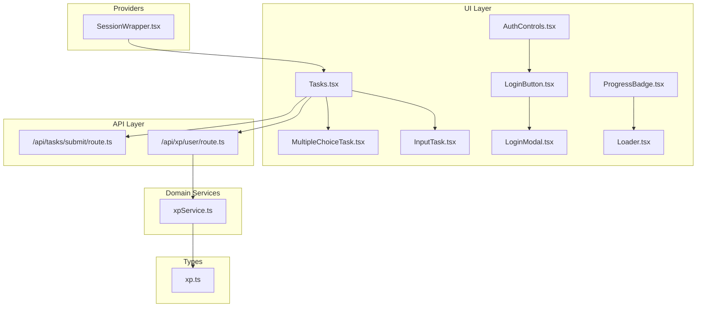
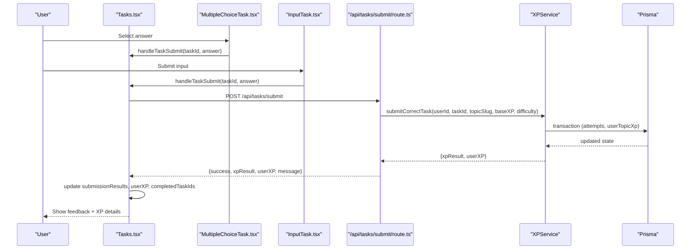
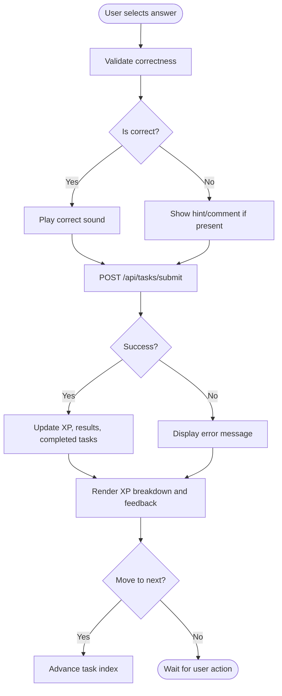
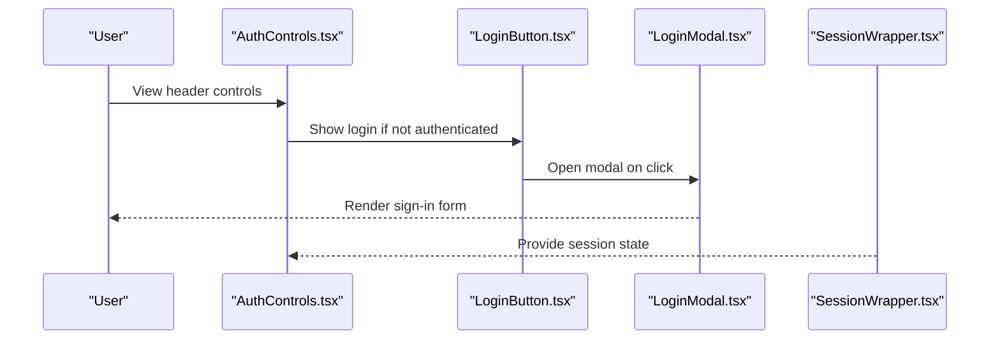
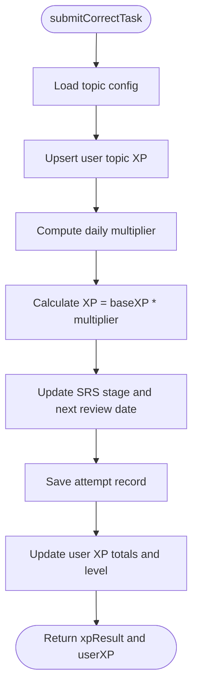
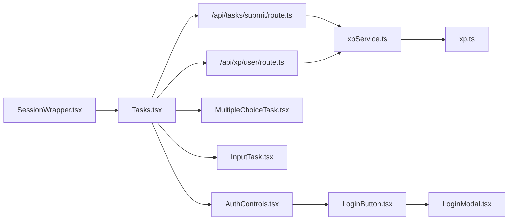

# User Feedback & Interaction

<cite>
**Referenced Files in This Document**
- [Tasks.tsx](file://components/tasks/Tasks.tsx)
- [MultipleChoiceTask.tsx](file://components/tasks/MultipleChoiceTask.tsx)
- [InputTask.tsx](file://components/tasks/InputTask.tsx)
- [AuthControls.tsx](file://components/tasks/AuthControls.tsx)
- [LoginButton.tsx](file://components/auth/LoginButton.tsx)
- [LoginModal.tsx](file://components/auth/LoginModal.tsx)
- [SessionWrapper.tsx](file://components/providers/SessionWrapper.tsx)
- [route.ts](file://app/api/tasks/submit/route.ts)
- [route.ts](file://app/api/xp/user/route.ts)
- [xpService.ts](file://lib/xp/xpService.ts)
- [xp.ts](file://types/xp.ts)
- [ProgressBadge.tsx](file://components/math/ProgressBadge.tsx)
- [Loader.tsx](file://components/Loader/Loader.tsx)
</cite>

## Table of Contents
1. [Introduction](#introduction)
2. [Project Structure](#project-structure)
3. [Core Components](#core-components)
4. [Architecture Overview](#architecture-overview)
5. [Detailed Component Analysis](#detailed-component-analysis)
6. [Dependency Analysis](#dependency-analysis)
7. [Performance Considerations](#performance-considerations)
8. [Troubleshooting Guide](#troubleshooting-guide)
9. [Conclusion](#conclusion)
10. [Appendices](#appendices)

## Introduction
This document explains the user feedback and interaction system within the learning interface. It covers real-time feedback mechanisms, audio cues, visual progress indicators, XP reward display, authentication-aware controls, user state management, and personalized learning experiences. It also documents error messaging, loading states, and accessibility considerations, with examples of feedback timing and sound integration.

## Project Structure
The learning interface centers around a task container that renders either multiple-choice or input tasks, manages user answers, and displays XP and progress feedback. Authentication state drives access to XP data and submissions. APIs handle XP retrieval and task submission, while the XP service encapsulates SRS-based calculations and persistence.

**Diagram sources**
- [Tasks.tsx](file://components/tasks/Tasks.tsx#L1-L441)
- [MultipleChoiceTask.tsx](file://components/tasks/MultipleChoiceTask.tsx#L1-L72)
- [InputTask.tsx](file://components/tasks/InputTask.tsx#L1-L97)
- [AuthControls.tsx](file://components/tasks/AuthControls.tsx#L1-L13)
- [LoginButton.tsx](file://components/auth/LoginButton.tsx#L1-L38)
- [LoginModal.tsx](file://components/auth/LoginModal.tsx#L1-L23)
- [SessionWrapper.tsx](file://components/providers/SessionWrapper.tsx#L1-L11)
- [route.ts](file://app/api/tasks/submit/route.ts#L1-L59)
- [route.ts](file://app/api/xp/user/route.ts#L1-L41)
- [xpService.ts](file://lib/xp/xpService.ts#L1-L795)
- [xp.ts](file://types/xp.ts#L1-L131)
- [ProgressBadge.tsx](file://components/math/ProgressBadge.tsx#L1-L48)
- [Loader.tsx](file://components/Loader/Loader.tsx#L1-L6)

**Section sources**
- [Tasks.tsx](file://components/tasks/Tasks.tsx#L1-L441)
- [route.ts](file://app/api/tasks/submit/route.ts#L1-L59)
- [route.ts](file://app/api/xp/user/route.ts#L1-L41)
- [xpService.ts](file://lib/xp/xpService.ts#L1-L795)
- [xp.ts](file://types/xp.ts#L1-L131)
- [SessionWrapper.tsx](file://components/providers/SessionWrapper.tsx#L1-L11)

## Core Components
- Tasks container orchestrates task rendering, answer collection, submission, and feedback display. It integrates audio cues, XP updates, and navigation between tasks.
- Task components provide immediate correctness feedback and guidance.
- Authentication-aware controls gate access to XP and submissions.
- API routes enforce authentication and delegate to XP service for calculations.
- XP service encapsulates SRS scheduling, XP multipliers, and persistence.

Key responsibilities:
- Real-time feedback: correctness visuals, hints, and messages.
- Audio cues: play sound on correct answer.
- Visual progress: XP bar, level, hot-topic indicator, and topic energy meter.
- XP rewards: computed per task with daily multipliers and SRS logic.
- Authentication-awareness: require signed-in user for XP and submissions.
- Personalized experience: hot-topic mode, scheduled reviews, and daily XP caps.

**Section sources**
- [Tasks.tsx](file://components/tasks/Tasks.tsx#L1-L441)
- [MultipleChoiceTask.tsx](file://components/tasks/MultipleChoiceTask.tsx#L1-L72)
- [InputTask.tsx](file://components/tasks/InputTask.tsx#L1-L97)
- [AuthControls.tsx](file://components/tasks/AuthControls.tsx#L1-L13)
- [route.ts](file://app/api/tasks/submit/route.ts#L1-L59)
- [route.ts](file://app/api/xp/user/route.ts#L1-L41)
- [xpService.ts](file://lib/xp/xpService.ts#L1-L795)

## Architecture Overview
The system follows a layered pattern:
- UI layer: React components manage state and render feedback.
- Provider layer: Session provider supplies authentication state.
- API layer: Next.js routes validate auth and delegate to domain services.
- Domain layer: XP service computes XP, SRS intervals, and persists results.

**Diagram sources**
- [Tasks.tsx](file://components/tasks/Tasks.tsx#L64-L122)
- [MultipleChoiceTask.tsx](file://components/tasks/MultipleChoiceTask.tsx#L11-L27)
- [InputTask.tsx](file://components/tasks/InputTask.tsx#L11-L38)
- [route.ts](file://app/api/tasks/submit/route.ts#L6-L47)
- [xpService.ts](file://lib/xp/xpService.ts#L118-L293)

## Detailed Component Analysis

### Tasks Container: Feedback, Audio, Progress, and Navigation
Responsibilities:
- Load user XP and topic config on session/topic change.
- Track current task index, answers, submission results, and completed tasks.
- Play correct-answer audio on correct submission.
- Render XP panel with level progress, hot-topic highlight, topic energy meter, and next-review countdown.
- Display per-task feedback with XP breakdown and scheduling info.
- Provide navigation between tasks.

Feedback timing and audio:
- Correct answers trigger playback of a correct-choice sound after validation.
- Submission results appear immediately after network response.

Visual progress indicators:
- XP bar shows current level progress with min/max thresholds.
- Hot-topic badge highlights when next review is due.
- Topic energy meter shows remaining daily XP allocation with color-coded bands.
- Countdown indicates time until full XP restoration.

Navigation:
- Previous/Next buttons enable moving across available tasks.

Authentication-awareness:
- XP fetch and task submission require a signed-in user via session.

Personalization:
- Hot-topic mode allows re-practicing tasks due for review.
- Daily XP multipliers adjust reward magnitude based on practice streak.

Accessibility:
- Status updates use semantic roles and labels.
- Disabled states prevent re-submission and maintain focus order.

**Diagram sources**
- [Tasks.tsx](file://components/tasks/Tasks.tsx#L64-L122)
- [MultipleChoiceTask.tsx](file://components/tasks/MultipleChoiceTask.tsx#L17-L22)
- [InputTask.tsx](file://components/tasks/InputTask.tsx#L24-L34)
- [route.ts](file://app/api/tasks/submit/route.ts#L27-L32)

**Section sources**
- [Tasks.tsx](file://components/tasks/Tasks.tsx#L1-L441)

### Task Components: Immediate Feedback and Guidance
Multiple choice:
- Visual feedback for selected, correct, and incorrect options.
- Optional explanatory comment shown on incorrect selection.
- Disabled state prevents changing answer after selection.

Input:
- Normalizes answers for comparison against accepted variants.
- Provides “Clear” and “Submit” actions.
- Shows correct/incorrect feedback and lists accepted answers on failure.

Accessibility:
- Disabled states and focusable elements preserve keyboard navigation.
- Color and icons convey correctness without relying solely on color.

**Section sources**
- [MultipleChoiceTask.tsx](file://components/tasks/MultipleChoiceTask.tsx#L1-L72)
- [InputTask.tsx](file://components/tasks/InputTask.tsx#L1-L97)

### Authentication Controls and Session Management
- AuthControls switches between login and logout based on authentication state.
- LoginButton toggles a modal overlay for sign-in.
- LoginModal renders the form inside a portal for consistent overlay behavior.
- SessionWrapper provides session context with controlled refetch behavior.

**Diagram sources**
- [AuthControls.tsx](file://components/tasks/AuthControls.tsx#L10-L12)
- [LoginButton.tsx](file://components/auth/LoginButton.tsx#L10-L37)
- [LoginModal.tsx](file://components/auth/LoginModal.tsx#L11-L22)
- [SessionWrapper.tsx](file://components/providers/SessionWrapper.tsx#L8-L10)

**Section sources**
- [AuthControls.tsx](file://components/tasks/AuthControls.tsx#L1-L13)
- [LoginButton.tsx](file://components/auth/LoginButton.tsx#L1-L38)
- [LoginModal.tsx](file://components/auth/LoginModal.tsx#L1-L23)
- [SessionWrapper.tsx](file://components/providers/SessionWrapper.tsx#L1-L11)

### API Routes: Authentication and Submission
- GET /api/xp/user validates session, requires topicSlug, and returns user XP, topic config, and completed task IDs.
- POST /api/tasks/submit validates session, checks required fields, rejects incorrect answers early, and on success computes XP via XPService.

Error handling:
- Unauthorized and missing field errors return appropriate HTTP statuses.
- Internal server errors are handled gracefully.

**Section sources**
- [route.ts](file://app/api/xp/user/route.ts#L1-L41)
- [route.ts](file://app/api/tasks/submit/route.ts#L1-L59)

### XP Service: SRS, Multipliers, and Persistence
Key computations:
- Daily XP multiplier based on task count within the day (full, half, low).
- SRS stage increases only during scheduled reviews; otherwise, XP is not advanced but still earned according to daily cap.
- Level advancement computed from thresholds.
- Transaction ensures consistency between attempts and user XP updates.

**Diagram sources**
- [xpService.ts](file://lib/xp/xpService.ts#L118-L293)

**Section sources**
- [xpService.ts](file://lib/xp/xpService.ts#L1-L795)
- [xp.ts](file://types/xp.ts#L1-L131)

### Visual Progress Indicators
- XP panel shows current XP, level, and progress bar with min/max thresholds.
- Hot-topic indicator highlights when next review is due.
- Topic energy meter reflects remaining daily XP allocation with color-coded bands.
- Countdown indicates time until full XP restoration.
- ProgressBadge demonstrates a minimal progress indicator with loading state and completion status.

Accessibility:
- Status labels and ARIA attributes communicate progress semantics.
- Loading skeleton provides feedback while data loads.

**Section sources**
- [Tasks.tsx](file://components/tasks/Tasks.tsx#L205-L370)
- [ProgressBadge.tsx](file://components/math/ProgressBadge.tsx#L1-L48)
- [Loader.tsx](file://components/Loader/Loader.tsx#L1-L6)

## Dependency Analysis
- Tasks depends on:
  - next-auth session for authentication gating.
  - API routes for XP retrieval and task submission.
  - XP service for computation and persistence.
  - Task components for rendering and collecting answers.
- API routes depend on:
  - NextAuth for session validation.
  - XP service for XP calculation and persistence.
- XP service depends on:
  - Prisma for database operations.
  - Topic and user XP types for shape and thresholds.

**Diagram sources**
- [Tasks.tsx](file://components/tasks/Tasks.tsx#L1-L441)
- [route.ts](file://app/api/tasks/submit/route.ts#L1-L59)
- [route.ts](file://app/api/xp/user/route.ts#L1-L41)
- [xpService.ts](file://lib/xp/xpService.ts#L1-L795)
- [xp.ts](file://types/xp.ts#L1-L131)
- [MultipleChoiceTask.tsx](file://components/tasks/MultipleChoiceTask.tsx#L1-L72)
- [InputTask.tsx](file://components/tasks/InputTask.tsx#L1-L97)
- [AuthControls.tsx](file://components/tasks/AuthControls.tsx#L1-L13)
- [LoginButton.tsx](file://components/auth/LoginButton.tsx#L1-L38)
- [LoginModal.tsx](file://components/auth/LoginModal.tsx#L1-L23)
- [SessionWrapper.tsx](file://components/providers/SessionWrapper.tsx#L1-L11)

**Section sources**
- [Tasks.tsx](file://components/tasks/Tasks.tsx#L1-L441)
- [route.ts](file://app/api/tasks/submit/route.ts#L1-L59)
- [route.ts](file://app/api/xp/user/route.ts#L1-L41)
- [xpService.ts](file://lib/xp/xpService.ts#L1-L795)
- [xp.ts](file://types/xp.ts#L1-L131)

## Performance Considerations
- Minimize re-renders by memoizing derived data (e.g., available tasks).
- Debounce or throttle repeated submissions using a pending flag.
- Preload or cache topic configs and user XP to reduce latency.
- Use efficient state updates (partial updates) to avoid unnecessary recalculations.
- Keep audio assets small and pre-initialize audio objects to avoid delays.

## Troubleshooting Guide
Common issues and resolutions:
- Unauthorized access to XP or submissions:
  - Ensure the user is signed in; session must include a user ID.
  - Verify provider configuration and session propagation.
- Missing required fields in submission:
  - Confirm taskId and topicSlug are provided.
- Incorrect answers:
  - The API returns a failure response with a message; display it to the user.
- Network failures:
  - Catch and surface errors; consider retry logic with exponential backoff.
- Loading states:
  - Use a placeholder or skeleton while XP is being fetched.
  - Consider a global loader for long operations.

Accessibility:
- Ensure feedback is conveyed through text and icons for screen reader users.
- Provide keyboard navigation and focus management for interactive elements.
- Use ARIA live regions for dynamic updates when appropriate.

**Section sources**
- [route.ts](file://app/api/tasks/submit/route.ts#L10-L15)
- [route.ts](file://app/api/tasks/submit/route.ts#L20-L25)
- [Tasks.tsx](file://components/tasks/Tasks.tsx#L139-L142)
- [Loader.tsx](file://components/Loader/Loader.tsx#L1-L6)

## Conclusion
The learning interface delivers a responsive, personalized experience through real-time feedback, audio cues, and visual progress indicators. Authentication-aware controls ensure secure access to XP and submissions, while the XP service enforces SRS-based scheduling and fair XP distribution. The modular architecture supports maintainability and extensibility, with clear separation between UI, API, and domain logic.

## Appendices
- Example feedback timing:
  - Immediate correctness feedback upon answer selection/input submission.
  - XP breakdown and scheduling details rendered after successful submission.
- Sound effect integration:
  - Correct answers trigger a short, positive sound cue.
- Accessibility considerations:
  - Semantic roles and labels for progress and feedback.
  - Disabled states and keyboard-friendly interactions.