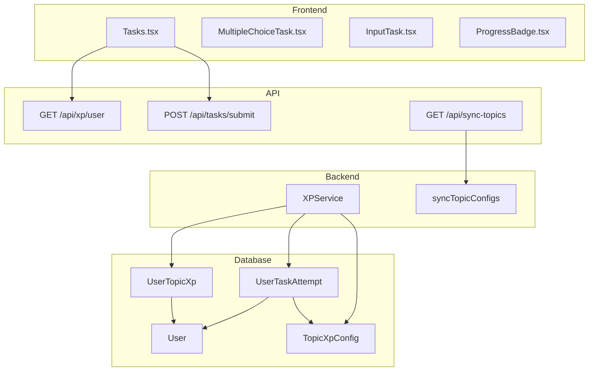
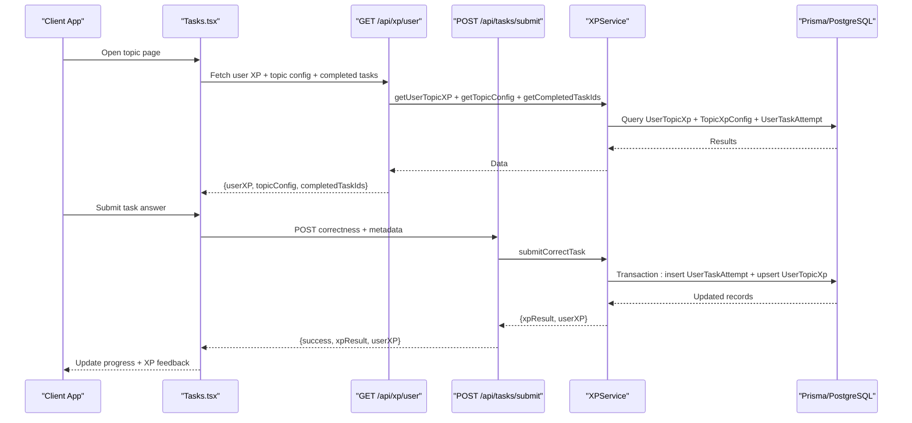
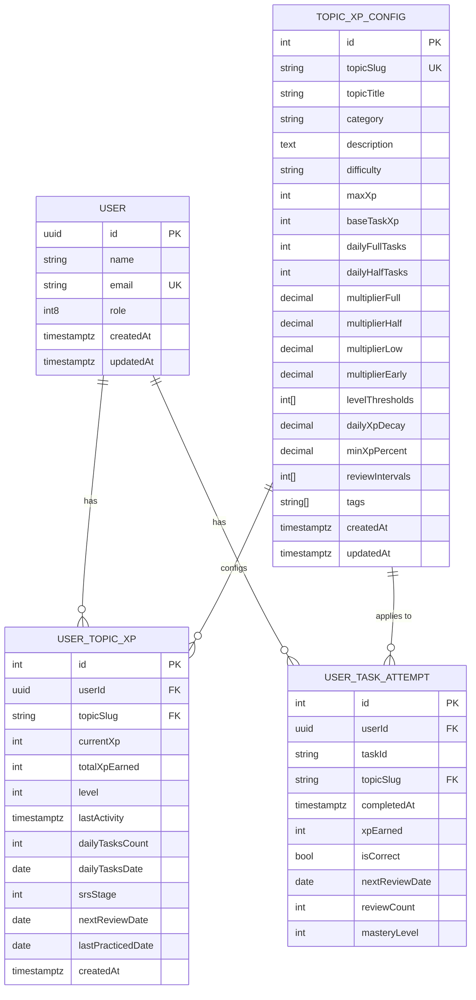
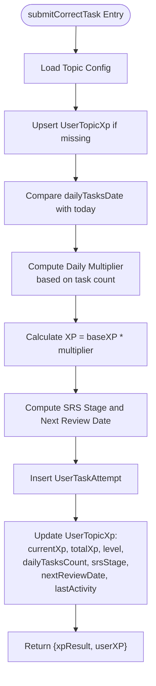
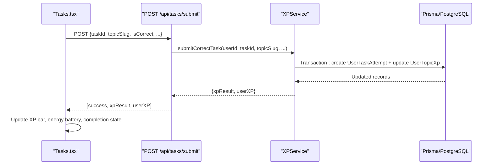
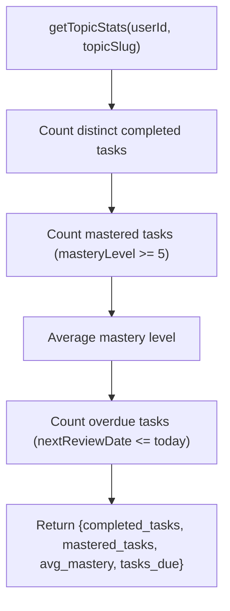
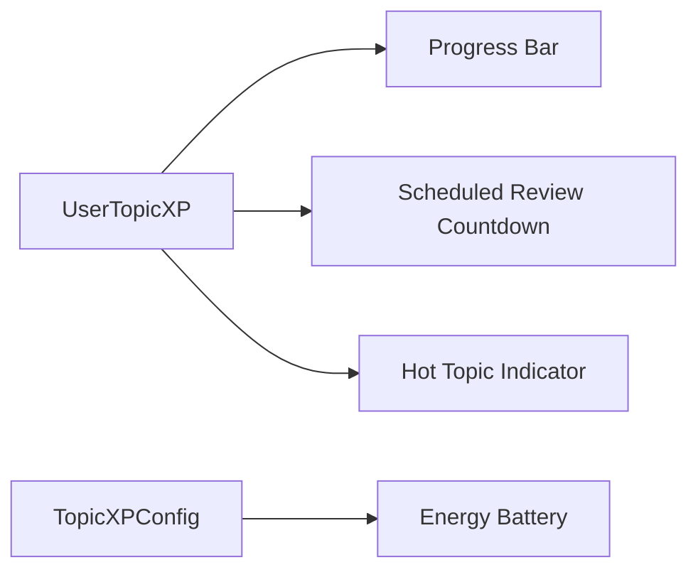
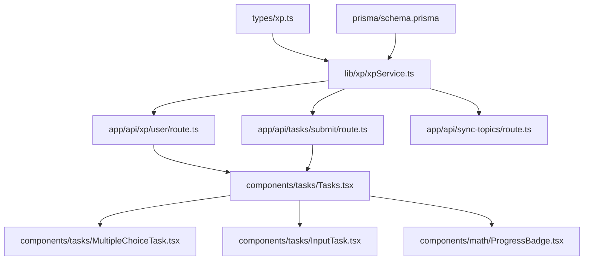

# Progress Tracking & Analytics

<cite>
**Referenced Files in This Document**
- [schema.prisma](file://prisma/schema.prisma)
- [xp.ts](file://types/xp.ts)
- [xpService.ts](file://lib/xp/xpService.ts)
- [syncTopicConfigs.ts](file://lib/xp/syncTopicConfigs.ts)
- [route.ts](file://app/api/xp/user/route.ts)
- [route.ts](file://app/api/tasks/submit/route.ts)
- [route.ts](file://app/api/sync-topics/route.ts)
- [Tasks.tsx](file://components/tasks/Tasks.tsx)
- [MultipleChoiceTask.tsx](file://components/tasks/MultipleChoiceTask.tsx)
- [InputTask.tsx](file://components/tasks/InputTask.tsx)
- [ProgressBadge.tsx](file://components/math/ProgressBadge.tsx)
- [loadTasks.ts](file://lib/loadTasks.ts)
- [loadLesson.ts](file://lib/loadLesson.ts)
- [config.json](file://content/math/addition_and_subtraction_of_fractions/config.json)
</cite>

## Table of Contents
1. [Introduction](#introduction)
2. [Project Structure](#project-structure)
3. [Core Components](#core-components)
4. [Architecture Overview](#architecture-overview)
5. [Detailed Component Analysis](#detailed-component-analysis)
6. [Dependency Analysis](#dependency-analysis)
7. [Performance Considerations](#performance-considerations)
8. [Troubleshooting Guide](#troubleshooting-guide)
9. [Conclusion](#conclusion)
10. [Appendices](#appendices)

## Introduction
This document explains the progress tracking and analytics system that monitors student learning journeys and performance metrics. It covers user progress tracking, topic mastery visualization, performance analytics, streak monitoring, and achievement systems. The system integrates real-time progress updates, SRS-based review scheduling, XP calculations, and dashboard visualization components. Practical examples demonstrate progress reporting, analytics queries, and performance insights generation.

## Project Structure
The progress tracking system spans database modeling, backend services, API endpoints, and frontend components:
- Database models define user progress, topic configurations, and task attempts.
- Backend service encapsulates XP calculation, SRS scheduling, and analytics aggregation.
- API endpoints expose progress retrieval and task submission.
- Frontend components render progress visuals, manage task interactions, and display mastery indicators.

**Diagram sources**
- [schema.prisma](file://prisma/schema.prisma#L19-L142)
- [xpService.ts](file://lib/xp/xpService.ts#L11-L794)
- [route.ts](file://app/api/xp/user/route.ts#L5-L40)
- [route.ts](file://app/api/tasks/submit/route.ts#L6-L58)
- [route.ts](file://app/api/sync-topics/route.ts#L8-L18)
- [Tasks.tsx](file://components/tasks/Tasks.tsx#L12-L441)
- [MultipleChoiceTask.tsx](file://components/tasks/MultipleChoiceTask.tsx#L11-L72)
- [InputTask.tsx](file://components/tasks/InputTask.tsx#L11-L97)
- [ProgressBadge.tsx](file://components/math/ProgressBadge.tsx#L10-L47)

**Section sources**
- [schema.prisma](file://prisma/schema.prisma#L19-L142)
- [xpService.ts](file://lib/xp/xpService.ts#L11-L794)
- [route.ts](file://app/api/xp/user/route.ts#L5-L40)
- [route.ts](file://app/api/tasks/submit/route.ts#L6-L58)
- [route.ts](file://app/api/sync-topics/route.ts#L8-L18)
- [Tasks.tsx](file://components/tasks/Tasks.tsx#L12-L441)

## Core Components
- Database models:
  - TopicXpConfig: Stores per-topic XP configuration, daily limits, multipliers, SRS intervals, and level thresholds.
  - UserTopicXp: Tracks per-user progress, level, XP totals, daily counters, SRS stage, and review dates.
  - UserTaskAttempt: Records per-attempt XP earned, correctness, mastery level, and review scheduling.
- Types:
  - TopicConfig, TopicXPConfig, UserTopicXP, UserTaskAttempt, XPCalculationResult, TaskSubmissionRequest, TaskSubmissionResponse, TaskDueForReview, GETXpUserResponse.
- Services:
  - XPService: Centralized logic for XP calculation, SRS scheduling, daily multipliers, level computation, analytics aggregation, and task history.
  - syncTopicConfigs: Syncs topic configuration files to the database.
- APIs:
  - GET /api/xp/user: Returns user topic XP, topic config, and completed task IDs.
  - POST /api/tasks/submit: Submits task correctness and returns XP result and updated user XP.
  - GET /api/sync-topics: Syncs topic configs from content to database.
- Frontend:
  - Tasks.tsx: Orchestrates task rendering, progress display, XP feedback, and navigation.
  - MultipleChoiceTask.tsx and InputTask.tsx: Renders interactive tasks.
  - ProgressBadge.tsx: Placeholder for section-level progress visualization.

**Section sources**
- [schema.prisma](file://prisma/schema.prisma#L70-L142)
- [xp.ts](file://types/xp.ts#L3-L131)
- [xpService.ts](file://lib/xp/xpService.ts#L11-L794)
- [route.ts](file://app/api/xp/user/route.ts#L5-L40)
- [route.ts](file://app/api/tasks/submit/route.ts#L6-L58)
- [route.ts](file://app/api/sync-topics/route.ts#L8-L18)
- [Tasks.tsx](file://components/tasks/Tasks.tsx#L12-L441)
- [MultipleChoiceTask.tsx](file://components/tasks/MultipleChoiceTask.tsx#L11-L72)
- [InputTask.tsx](file://components/tasks/InputTask.tsx#L11-L97)
- [ProgressBadge.tsx](file://components/math/ProgressBadge.tsx#L10-L47)

## Architecture Overview
The system follows a layered architecture:
- Data layer: Prisma models and PostgreSQL store.
- Service layer: XPService encapsulates business logic.
- API layer: Next.js routes expose read/write endpoints.
- Presentation layer: React components render progress and tasks.

**Diagram sources**
- [route.ts](file://app/api/xp/user/route.ts#L5-L40)
- [route.ts](file://app/api/tasks/submit/route.ts#L6-L58)
- [xpService.ts](file://lib/xp/xpService.ts#L118-L293)
- [Tasks.tsx](file://components/tasks/Tasks.tsx#L47-L122)

**Section sources**
- [route.ts](file://app/api/xp/user/route.ts#L5-L40)
- [route.ts](file://app/api/tasks/submit/route.ts#L6-L58)
- [xpService.ts](file://lib/xp/xpService.ts#L118-L293)
- [Tasks.tsx](file://components/tasks/Tasks.tsx#L47-L122)

## Detailed Component Analysis

### Data Models and Relationships
The schema defines three core models with explicit relations and indexes:
- TopicXpConfig: Per-topic configuration for XP caps, base XP, daily limits, multipliers, decay, minimum XP percent, SRS intervals, and tags.
- UserTopicXp: Per-user progress with current and total XP, level, last activity, daily counters, SRS stage, next review date, and last practiced date.
- UserTaskAttempt: Per-attempt record with XP earned, correctness, mastery level, and review scheduling.

**Diagram sources**
- [schema.prisma](file://prisma/schema.prisma#L19-L142)

**Section sources**
- [schema.prisma](file://prisma/schema.prisma#L70-L142)

### XP Calculation and SRS Logic
XPService implements:
- Daily XP multipliers based on task count within a day (full, half, low).
- SRS scheduling with configurable intervals; advancing stage only during scheduled reviews.
- Level computation from XP thresholds.
- Task history and statistics aggregation.

**Diagram sources**
- [xpService.ts](file://lib/xp/xpService.ts#L118-L293)

**Section sources**
- [xpService.ts](file://lib/xp/xpService.ts#L118-L293)

### Real-Time Progress Updates and UI Feedback
Tasks.tsx orchestrates:
- Fetching user XP and topic config on session change.
- Filtering available tasks based on completed IDs.
- Posting correctness and receiving XP result and updated user XP.
- Rendering XP bar, energy battery, scheduled review reminders, and mastery feedback.

**Diagram sources**
- [route.ts](file://app/api/tasks/submit/route.ts#L6-L58)
- [xpService.ts](file://lib/xp/xpService.ts#L118-L293)
- [Tasks.tsx](file://components/tasks/Tasks.tsx#L64-L122)

**Section sources**
- [Tasks.tsx](file://components/tasks/Tasks.tsx#L47-L122)
- [MultipleChoiceTask.tsx](file://components/tasks/MultipleChoiceTask.tsx#L11-L72)
- [InputTask.tsx](file://components/tasks/InputTask.tsx#L11-L97)

### Analytics Aggregation and Insights
XPService exposes analytics functions:
- getTasksDueForReview: Identifies tasks due for scheduled review.
- getTopicStats: Computes completed tasks, mastered tasks, average mastery, and overdue tasks.
- getTaskHistory: Retrieves attempt history for a given task.
- getCompletedTaskIds: Returns IDs of tasks completed correctly, with hot-topic bypass logic.

**Diagram sources**
- [xpService.ts](file://lib/xp/xpService.ts#L677-L731)

**Section sources**
- [xpService.ts](file://lib/xp/xpService.ts#L608-L794)

### Topic Mastery Visualization
The UI renders:
- XP progress bar between current and next level thresholds.
- Energy battery indicating remaining daily XP capacity.
- Scheduled review countdown and hot-topic indicator.

**Diagram sources**
- [Tasks.tsx](file://components/tasks/Tasks.tsx#L204-L370)
- [xp.ts](file://types/xp.ts#L50-L81)
- [xp.ts](file://types/xp.ts#L26-L48)

**Section sources**
- [Tasks.tsx](file://components/tasks/Tasks.tsx#L204-L370)
- [xp.ts](file://types/xp.ts#L50-L81)
- [xp.ts](file://types/xp.ts#L26-L48)

### Streak Monitoring and Achievement Systems
- Daily task counter and dailyTasksDate enable streak-like tracking within a day.
- SRS stage and nextReviewDate support spaced repetition achievements.
- Level thresholds and total XP earned represent long-term mastery achievements.

**Section sources**
- [schema.prisma](file://prisma/schema.prisma#L99-L122)
- [xpService.ts](file://lib/xp/xpService.ts#L71-L89)

### Practical Examples

#### Progress Reporting
- Endpoint: GET /api/xp/user?topicSlug={slug}
- Returns: userXP, topicConfig, completedTaskIds
- Use case: Initialize topic page with current progress and available tasks.

**Section sources**
- [route.ts](file://app/api/xp/user/route.ts#L5-L40)
- [xp.ts](file://types/xp.ts#L126-L131)

#### Analytics Queries
- Overdue tasks due for review:
  - Query: UserTaskAttempt with nextReviewDate <= today and masteryLevel < 5.
- Topic statistics:
  - Count distinct completed tasks.
  - Count mastered tasks (masteryLevel >= 5).
  - Average mastery level.
  - Count overdue tasks.

**Section sources**
- [xpService.ts](file://lib/xp/xpService.ts#L608-L731)

#### Performance Insights Generation
- Identify low-energy days via energy battery percentage.
- Detect hot topics requiring immediate review.
- Track XP growth trends using totalXpEarned and level progression.

**Section sources**
- [Tasks.tsx](file://components/tasks/Tasks.tsx#L259-L370)
- [xpService.ts](file://lib/xp/xpService.ts#L355-L371)

## Dependency Analysis
The system exhibits clean separation of concerns:
- Types define contracts for service and API layers.
- XPService depends on Prisma models and encapsulates all business logic.
- APIs depend on XPService and enforce authentication/session checks.
- Frontend components depend on API endpoints and types.

**Diagram sources**
- [xp.ts](file://types/xp.ts#L3-L131)
- [xpService.ts](file://lib/xp/xpService.ts#L11-L794)
- [schema.prisma](file://prisma/schema.prisma#L19-L142)
- [route.ts](file://app/api/xp/user/route.ts#L5-L40)
- [route.ts](file://app/api/tasks/submit/route.ts#L6-L58)
- [route.ts](file://app/api/sync-topics/route.ts#L8-L18)
- [Tasks.tsx](file://components/tasks/Tasks.tsx#L12-L441)
- [MultipleChoiceTask.tsx](file://components/tasks/MultipleChoiceTask.tsx#L11-L72)
- [InputTask.tsx](file://components/tasks/InputTask.tsx#L11-L97)
- [ProgressBadge.tsx](file://components/math/ProgressBadge.tsx#L10-L47)

**Section sources**
- [xp.ts](file://types/xp.ts#L3-L131)
- [xpService.ts](file://lib/xp/xpService.ts#L11-L794)
- [schema.prisma](file://prisma/schema.prisma#L19-L142)
- [route.ts](file://app/api/xp/user/route.ts#L5-L40)
- [route.ts](file://app/api/tasks/submit/route.ts#L6-L58)
- [route.ts](file://app/api/sync-topics/route.ts#L8-L18)
- [Tasks.tsx](file://components/tasks/Tasks.tsx#L12-L441)

## Performance Considerations
- Indexes on UserTopicXp and UserTaskAttempt improve query performance for frequent lookups.
- Transactions ensure atomicity for XP updates and attempt logging.
- Aggregation queries leverage groupBy and count to minimize round trips.
- UI updates are incremental to reduce re-renders.

[No sources needed since this section provides general guidance]

## Troubleshooting Guide
Common issues and resolutions:
- Unauthorized access: Ensure session exists before calling XP endpoints.
- Missing required fields: Verify taskId and topicSlug are provided in submissions.
- Topic config not found: Confirm topic config synchronization via GET /api/sync-topics.
- Incorrect task scoring: Validate baseXP and difficulty mapping in task submission.

**Section sources**
- [route.ts](file://app/api/xp/user/route.ts#L9-L21)
- [route.ts](file://app/api/tasks/submit/route.ts#L17-L25)
- [route.ts](file://app/api/sync-topics/route.ts#L8-L18)
- [xpService.ts](file://lib/xp/xpService.ts#L129-L131)

## Conclusion
The progress tracking and analytics system integrates robust data models, a centralized XP service, and a responsive UI to deliver real-time learning insights. It supports mastery visualization, spaced repetition scheduling, daily XP mechanics, and actionable analytics for educators and learners.

[No sources needed since this section summarizes without analyzing specific files]

## Appendices

### Topic Configuration Sync
- Endpoint: GET /api/sync-topics
- Behavior: Scans content/math/*/config.json and upserts TopicXpConfig records.

**Section sources**
- [route.ts](file://app/api/sync-topics/route.ts#L8-L18)
- [syncTopicConfigs.ts](file://lib/xp/syncTopicConfigs.ts#L10-L49)
- [config.json](file://content/math/addition_and_subtraction_of_fractions/config.json#L1-L10)

### Content Loading Utilities
- loadTasks: Loads tasks from a directory.
- LoadLesson: Reads lesson content and frontmatter.

**Section sources**
- [loadTasks.ts](file://lib/loadTasks.ts#L5-L30)
- [loadLesson.ts](file://lib/loadLesson.ts#L6-L16)