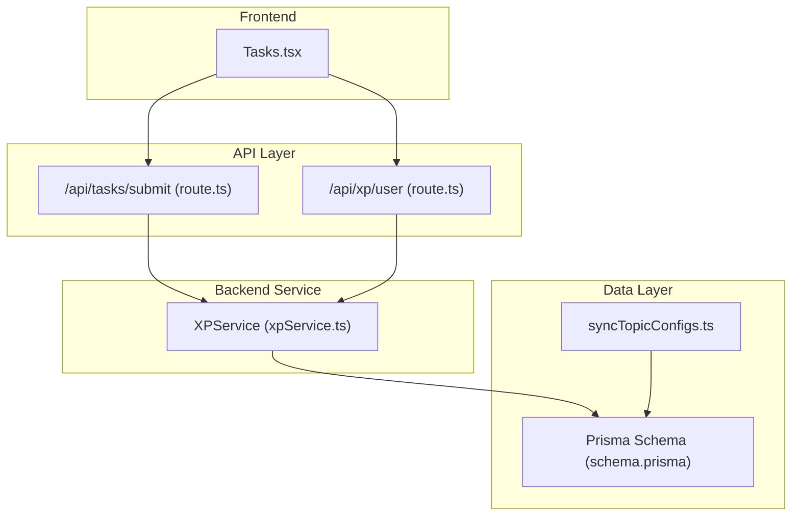
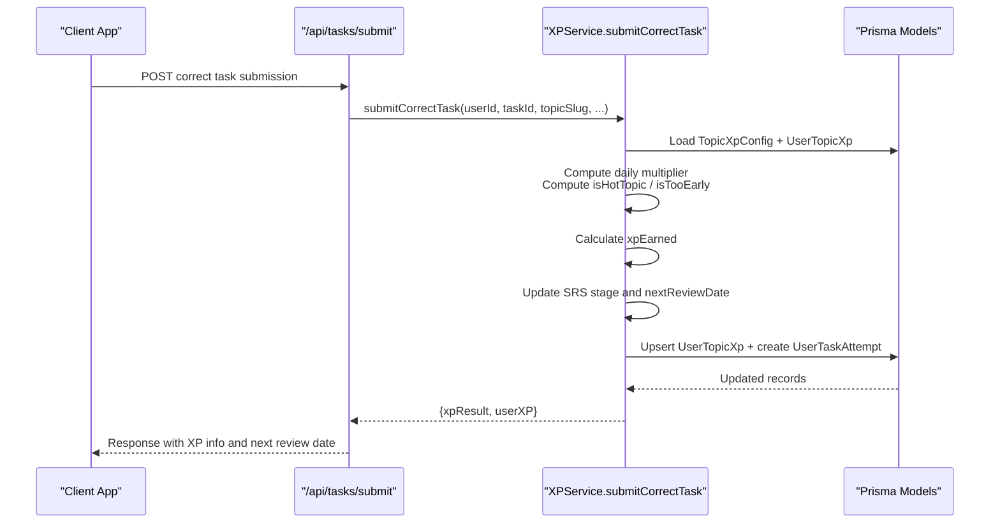
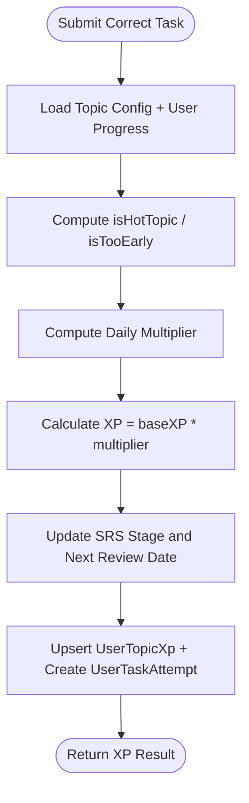
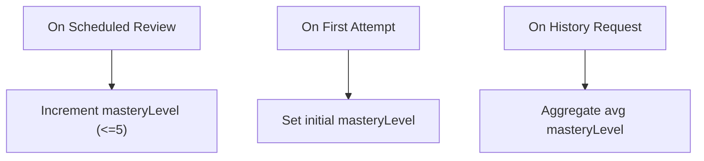
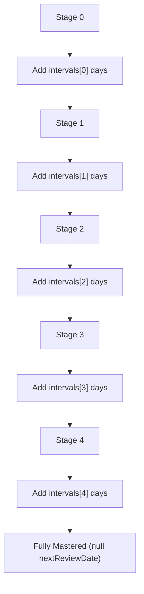
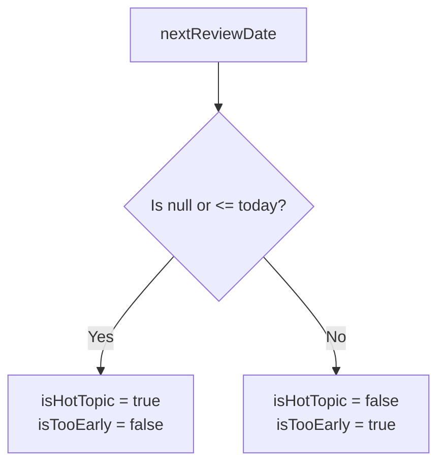
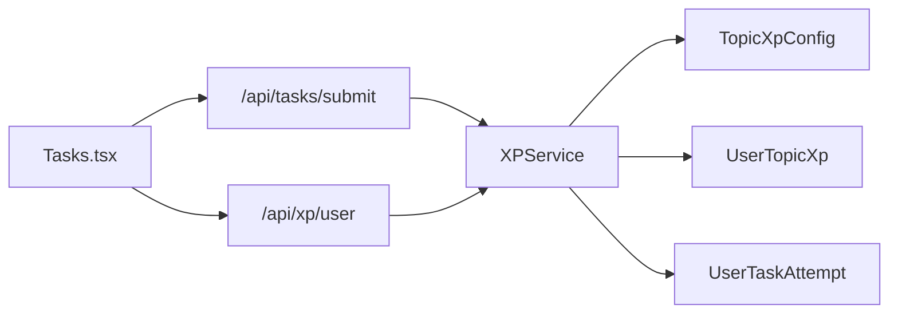
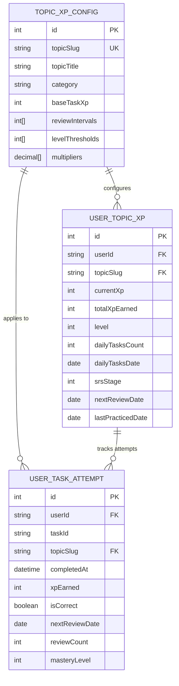

# Spaced Repetition System (SRS)

<cite>
**Referenced Files in This Document**
- [XP_SYSTEM.md](file://XP_SYSTEM.md)
- [XP_SRS_AUDIT.md](file://XP_SRS_AUDIT.md)
- [xpService.ts](file://lib/xp/xpService.ts)
- [types/xp.ts](file://types/xp.ts)
- [schema.prisma](file://prisma/schema.prisma)
- [syncTopicConfigs.ts](file://lib/xp/syncTopicConfigs.ts)
- [route.ts (tasks submit)](file://app/api/tasks/submit/route.ts)
- [route.ts (XP user)](file://app/api/xp/user/route.ts)
- [Tasks.tsx](file://components/tasks/Tasks.tsx)
</cite>

## Table of Contents
1. [Introduction](#introduction)
2. [Project Structure](#project-structure)
3. [Core Components](#core-components)
4. [Architecture Overview](#architecture-overview)
5. [Detailed Component Analysis](#detailed-component-analysis)
6. [Dependency Analysis](#dependency-analysis)
7. [Performance Considerations](#performance-considerations)
8. [Troubleshooting Guide](#troubleshooting-guide)
9. [Conclusion](#conclusion)
10. [Appendices](#appendices)

## Introduction
This document explains the Spaced Repetition System (SRS) that powers long-term retention in the math learning platform. It covers how review scheduling is calculated, how mastery stages are tracked, how hot/cold topic indicators are derived, and how the system adapts to user performance. It also documents the mathematical foundations, formulas, and practical examples for scheduling, mastery progression, and topic prioritization.

## Project Structure
The SRS implementation spans backend services, database models, API routes, and frontend UI components:
- Backend service encapsulates XP and SRS logic
- Database schema defines persistent state for user progress and topic configuration
- API routes expose submission and user-state endpoints
- Frontend components render hot/cold indicators, energy bars, and timers

**Diagram sources**
- [Tasks.tsx](file://components/tasks/Tasks.tsx#L64-L122)
- [route.ts (tasks submit)](file://app/api/tasks/submit/route.ts#L6-L47)
- [route.ts (XP user)](file://app/api/xp/user/route.ts#L5-L32)
- [xpService.ts](file://lib/xp/xpService.ts#L118-L293)
- [schema.prisma](file://prisma/schema.prisma#L70-L142)
- [syncTopicConfigs.ts](file://lib/xp/syncTopicConfigs.ts#L10-L49)

**Section sources**
- [XP_SYSTEM.md](file://XP_SYSTEM.md#L1-L356)
- [schema.prisma](file://prisma/schema.prisma#L70-L142)

## Core Components
- TopicXpConfig: Defines per-topic configuration including base XP, daily task limits, multipliers, level thresholds, and SRS intervals.
- UserTopicXp: Tracks user progress per topic: current XP, total XP, level, daily task counters, SRS stage, next review date, and timestamps.
- UserTaskAttempt: Stores per-attempt history with XP earned, scheduled review date, review count, and mastery level.
- XPService: Central service implementing SRS scheduling, anti-grind fatigue, XP computation, and level progression.
- API routes: Expose submission and user-state endpoints for the frontend.
- Frontend UI: Renders hot/cold topic status, XP progress, energy bar, and timers.

Key runtime behaviors:
- Anti-grind daily multiplier based on task index within a day
- SRS stage increments only on “hot” (scheduled) reviews
- “Too early” reviews reduce XP but do not advance SRS stage
- “Hot” topics trigger full XP with anti-grind and schedule the next review

**Section sources**
- [types/xp.ts](file://types/xp.ts#L26-L81)
- [xpService.ts](file://lib/xp/xpService.ts#L91-L106)
- [xpService.ts](file://lib/xp/xpService.ts#L118-L293)
- [XP_SYSTEM.md](file://XP_SYSTEM.md#L130-L240)

## Architecture Overview
The SRS architecture integrates three pillars:
- Scheduling: Uses ordered review intervals to move users through SRS stages
- Anti-grind: Caps XP growth per day to prevent grinding and encourage spaced practice
- Mastery: Levels up topic mastery and individual task mastery over time

**Diagram sources**
- [route.ts (tasks submit)](file://app/api/tasks/submit/route.ts#L6-L47)
- [xpService.ts](file://lib/xp/xpService.ts#L118-L293)
- [types/xp.ts](file://types/xp.ts#L83-L96)

## Detailed Component Analysis

### SRS Algorithm Implementation
The SRS algorithm advances through ordered stages defined by topic-specific intervals. Each stage corresponds to a fixed-day interval. Advancing requires a “hot” review (on or before the scheduled date). If a review occurs too early, XP is reduced but SRS stage remains unchanged.

- Stage progression:
  - stageAfter = stageBefore + 1 if not too early
  - Otherwise stageAfter = stageBefore
- Next review date:
  - If too early: keep previous nextReviewDate
  - Else: add intervals[stageBefore] days to today
- Completion:
  - When stage exceeds configured intervals length, nextReviewDate becomes null (fully mastered)

**Diagram sources**
- [xpService.ts](file://lib/xp/xpService.ts#L118-L293)
- [XP_SYSTEM.md](file://XP_SYSTEM.md#L197-L240)

**Section sources**
- [XP_SYSTEM.md](file://XP_SYSTEM.md#L197-L240)
- [xpService.ts](file://lib/xp/xpService.ts#L200-L217)

### Mastery Stage Tracking
Mastery is tracked at two levels:
- Topic mastery: integer level computed from cumulative XP against configured thresholds
- Task mastery: stored per attempt as masteryLevel, incremented on scheduled reviews

Topic level computation:
- Count thresholds passed by current XP
- Clamp to [0..5]
- Derive min XP for current level and next level threshold

Task mastery computation:
- Incremented on scheduled reviews
- Upper-bounded at 5

**Diagram sources**
- [xpService.ts](file://lib/xp/xpService.ts#L430-L438)
- [xpService.ts](file://lib/xp/xpService.ts#L71-L88)

**Section sources**
- [XP_SYSTEM.md](file://XP_SYSTEM.md#L79-L127)
- [xpService.ts](file://lib/xp/xpService.ts#L71-L88)
- [xpService.ts](file://lib/xp/xpService.ts#L430-L438)

### Review Interval Management
Review intervals are configured per topic. The service selects the next interval based on the current SRS stage (0-based indexing). When the stage reaches the end of the intervals array, the topic is considered fully mastered.

- Default intervals: [1, 3, 7, 14, 30] days
- Selection: intervals[stageBefore] for advancing to stageAfter = stageBefore + 1
- Completion: null nextReviewDate when stage exceeds intervals length

**Diagram sources**
- [XP_SYSTEM.md](file://XP_SYSTEM.md#L215-L224)
- [xpService.ts](file://lib/xp/xpService.ts#L215-L217)

**Section sources**
- [XP_SYSTEM.md](file://XP_SYSTEM.md#L215-L224)
- [schema.prisma](file://prisma/schema.prisma#L88-L88)

### Hot/Cold Topic Indicators
Hot/cold indicators inform the user when a topic should be reviewed:
- isHotTopic: true if nextReviewDate is null or in the past or today
- isTooEarly: true if nextReviewDate is in the future (before today)

These flags drive UI highlights (e.g., “hot” theme background), messaging (“too early”), and XP multipliers.

**Diagram sources**
- [XP_SYSTEM.md](file://XP_SYSTEM.md#L226-L238)
- [xpService.ts](file://lib/xp/xpService.ts#L171-L173)

**Section sources**
- [XP_SYSTEM.md](file://XP_SYSTEM.md#L226-L238)
- [XP_SRS_AUDIT.md](file://XP_SRS_AUDIT.md#L12-L14)

### Adaptive Scheduling Based on Performance
Adaptation occurs implicitly via:
- SRS stage progression aligning with performance (correct, on-time reviews)
- Anti-grind ensuring spaced practice regardless of early attempts
- Task mastery increasing on scheduled reviews

There is no explicit ease factor adjustment or forgetting curve model in the current implementation. Instead, the system relies on:
- Ordered intervals to space reviews
- Daily task caps to prevent exploitation
- Scheduled vs. early review detection to adjust XP and progression

**Section sources**
- [XP_SYSTEM.md](file://XP_SYSTEM.md#L176-L194)
- [XP_SYSTEM.md](file://XP_SYSTEM.md#L197-L240)

### Mathematical Formulas and Modeling
- XP calculation:
  - XP = floor(baseXP × dailyMultiplier)
  - dailyMultiplier depends on task index within the day (anti-grind)
- Level computation:
  - Count thresholds passed by current XP
  - Level ∈ [0..5], with min XP and next threshold derived accordingly
- SRS scheduling:
  - stageAfter = stageBefore + 1 if not too early
  - nextReviewDate = today + intervals[stageBefore] if advancing
  - Fully mastered when stage exceeds intervals length

Note: There is no explicit ease factor or Wozniak SM-2 formula implementation. The system uses fixed intervals and anti-grind multipliers.

**Section sources**
- [XP_SYSTEM.md](file://XP_SYSTEM.md#L154-L175)
- [XP_SYSTEM.md](file://XP_SYSTEM.md#L197-L240)
- [XP_SYSTEM.md](file://XP_SYSTEM.md#L79-L127)

### Practical Examples

#### Example 1: First Review Becomes a Hot Topic
- Scenario: User opens a topic for the first time; srsStage = 0, nextReviewDate = null
- Action: Completes tasks during the same day
- Outcome:
  - isHotTopic = true
  - srsStage increases to 1
  - nextReviewDate = today + intervals[0]

**Section sources**
- [XP_SYSTEM.md](file://XP_SYSTEM.md#L300-L314)
- [xpService.ts](file://lib/xp/xpService.ts#L208-L217)

#### Example 2: Too Early Review
- Scenario: User returns before nextReviewDate
- Outcome:
  - isTooEarly = true
  - XP reduced to multiplierEarly
  - srsStage and nextReviewDate remain unchanged

**Section sources**
- [XP_SYSTEM.md](file://XP_SYSTEM.md#L316-L323)
- [XP_SYSTEM.md](file://XP_SYSTEM.md#L184-L193)

#### Example 3: Hot Topic Review with Anti-Grind
- Scenario: User returns on or before nextReviewDate and completes daily tasks
- Outcome:
  - XP computed with daily multiplier (full/half/low)
  - srsStage increases and nextReviewDate advances by intervals[stageBefore]

**Section sources**
- [XP_SYSTEM.md](file://XP_SYSTEM.md#L325-L333)
- [XP_SYSTEM.md](file://XP_SYSTEM.md#L188-L198)

#### Example 4: Mastery Progression
- Scenario: Multiple scheduled reviews
- Outcome:
  - Task masteryLevel increments toward 5
  - Topic level updates based on cumulative XP thresholds

**Section sources**
- [XP_SYSTEM.md](file://XP_SYSTEM.md#L422-L438)
- [XP_SYSTEM.md](file://XP_SYSTEM.md#L79-L127)

#### Example 5: Topic Prioritization Based on Retention Probability
- Indicator: nextReviewDate proximity
- Strategy: Prioritize topics whose nextReviewDate is closest to today
- Implementation: UI lists topics sorted by nextReviewDate ascending

Note: The current UI sorts by last activity. Enhancements could sort by nextReviewDate for prioritization.

**Section sources**
- [XP_SYSTEM.md](file://XP_SYSTEM.md#L342-L354)
- [Tasks.tsx](file://components/tasks/Tasks.tsx#L355-L365)

## Dependency Analysis
The SRS depends on:
- TopicXpConfig for base XP, intervals, and thresholds
- UserTopicXp for current XP, stage, and next review date
- UserTaskAttempt for per-attempt history and mastery tracking
- API routes for submission and user-state retrieval
- Frontend UI for rendering hot/cold status and XP progress

**Diagram sources**
- [types/xp.ts](file://types/xp.ts#L26-L81)
- [xpService.ts](file://lib/xp/xpService.ts#L118-L293)
- [route.ts (tasks submit)](file://app/api/tasks/submit/route.ts#L6-L47)
- [route.ts (XP user)](file://app/api/xp/user/route.ts#L5-L32)
- [Tasks.tsx](file://components/tasks/Tasks.tsx#L47-L62)

**Section sources**
- [schema.prisma](file://prisma/schema.prisma#L70-L142)
- [XP_SYSTEM.md](file://XP_SYSTEM.md#L1-L356)

## Performance Considerations
- Database queries are minimal and scoped to topic and user identifiers
- Transactions ensure atomicity for XP updates and attempt creation
- Indexes on nextReviewDate and user/topic keys support efficient lookups
- Frontend computes UI indicators client-side using fetched data

Recommendations:
- Add indexes on user_id and nextReviewDate for frequent SRS queries
- Cache frequently accessed topic configs per session
- Batch UI updates to avoid excessive re-renders

[No sources needed since this section provides general guidance]

## Troubleshooting Guide
Common issues and resolutions:
- “Too early” XP reduction:
  - Expected behavior: XP reduced to multiplierEarly when reviewing before nextReviewDate
  - Verify isTooEarly flag derivation and multiplierEarly usage
- First task stage advancement:
  - Ensure stageAfter increments only on hot reviews
  - Confirm intervals array is properly loaded from TopicXpConfig
- UI not reflecting hot/cold status:
  - Check that isHotTopic and nextReviewDate are rendered in Tasks.tsx
  - Confirm API returns userXP and topicConfig to the UI

**Section sources**
- [XP_SRS_AUDIT.md](file://XP_SRS_AUDIT.md#L27-L97)
- [XP_SYSTEM.md](file://XP_SYSTEM.md#L176-L240)
- [Tasks.tsx](file://components/tasks/Tasks.tsx#L205-L370)

## Conclusion
The SRS implementation provides robust spaced review scheduling, anti-grind fatigue control, and mastery tracking. While it does not implement an explicit ease factor or Wozniak SM-2 model, the fixed-interval approach combined with daily task caps and hot/cold topic indicators yields strong retention outcomes. UI enhancements would further improve user awareness of scheduling and progress.

[No sources needed since this section summarizes without analyzing specific files]

## Appendices

### Appendix A: Data Model Overview

**Diagram sources**
- [schema.prisma](file://prisma/schema.prisma#L70-L142)

### Appendix B: Configuration Sync
Topic configurations are synchronized from content files into the database, enabling dynamic customization of XP, intervals, and thresholds per topic.

**Section sources**
- [syncTopicConfigs.ts](file://lib/xp/syncTopicConfigs.ts#L10-L49)
- [syncTopicConfigs.ts](file://lib/xp/syncTopicConfigs.ts#L54-L130)