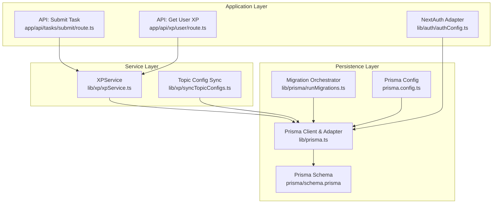
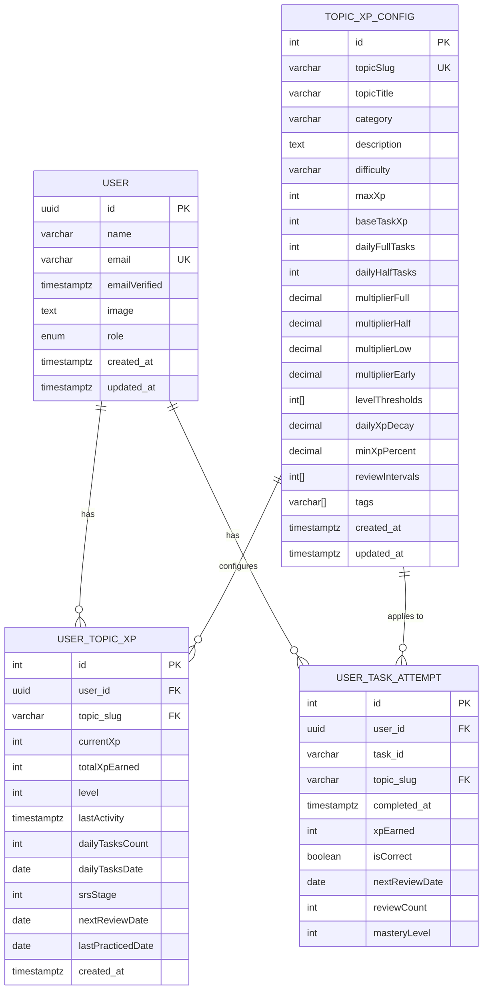
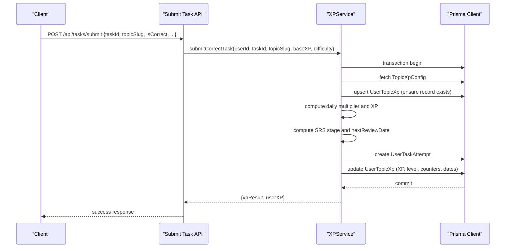
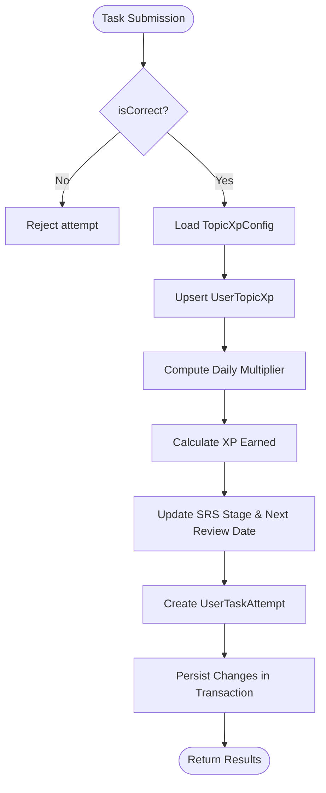
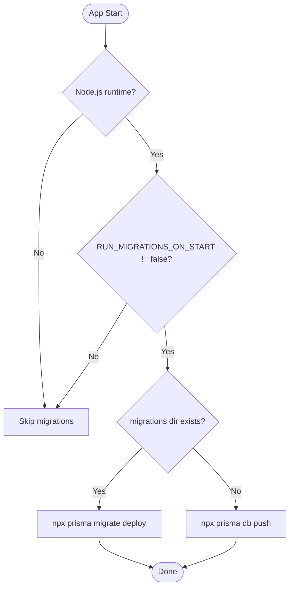
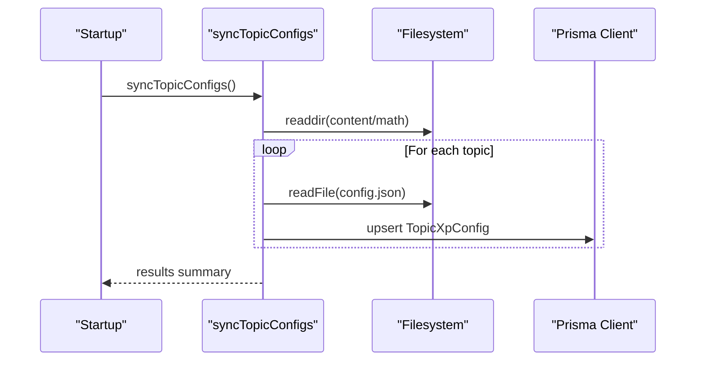
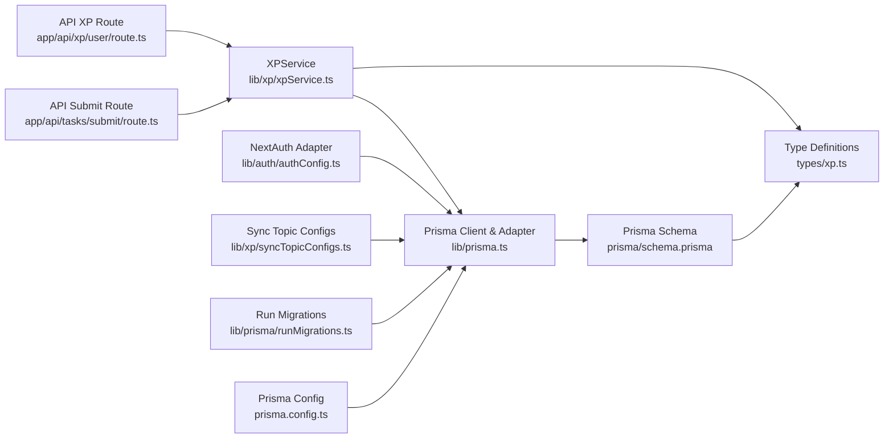

# Database Design

<cite>
**Referenced Files in This Document**
- [schema.prisma](file://prisma/schema.prisma)
- [prisma.ts](file://lib/prisma.ts)
- [runMigrations.ts](file://lib/prisma/runMigrations.ts)
- [prisma.config.ts](file://prisma.config.ts)
- [xpService.ts](file://lib/xp/xpService.ts)
- [xp.ts](file://types/xp.ts)
- [syncTopicConfigs.ts](file://lib/xp/syncTopicConfigs.ts)
- [route.ts](file://app/api/tasks/submit/route.ts)
- [route.ts](file://app/api/xp/user/route.ts)
- [authConfig.ts](file://lib/auth/authConfig.ts)
</cite>

## Table of Contents
1. [Introduction](#introduction)
2. [Project Structure](#project-structure)
3. [Core Components](#core-components)
4. [Architecture Overview](#architecture-overview)
5. [Detailed Component Analysis](#detailed-component-analysis)
6. [Dependency Analysis](#dependency-analysis)
7. [Performance Considerations](#performance-considerations)
8. [Troubleshooting Guide](#troubleshooting-guide)
9. [Conclusion](#conclusion)
10. [Appendices](#appendices)

## Introduction
This document describes the database design for the XP and task tracking system. It covers the Prisma schema, entity relationships, and data models for User, TopicXpConfig, UserTopicXp, and UserTaskAttempt. It also documents the migration strategy, seed/sync mechanism, data integrity rules, XP calculation model, task attempt tracking, progress persistence, indexing strategy, and performance considerations.

## Project Structure
The database layer is defined via Prisma schema and supported by:
- Prisma client configuration and adapter for PostgreSQL
- Migration orchestration on startup
- XP service implementing XP calculations, SRS scheduling, and progress updates
- API routes invoking the XP service
- Authentication integration using NextAuth with Prisma adapter
- Topic configuration synchronization from content files

**Diagram sources**
- [route.ts](file://app/api/tasks/submit/route.ts#L1-L59)
- [route.ts](file://app/api/xp/user/route.ts#L1-L41)
- [authConfig.ts](file://lib/auth/authConfig.ts#L1-L83)
- [xpService.ts](file://lib/xp/xpService.ts#L1-L795)
- [syncTopicConfigs.ts](file://lib/xp/syncTopicConfigs.ts#L1-L174)
- [prisma.ts](file://lib/prisma.ts#L1-L29)
- [schema.prisma](file://prisma/schema.prisma#L1-L143)
- [runMigrations.ts](file://lib/prisma/runMigrations.ts#L1-L69)
- [prisma.config.ts](file://prisma.config.ts#L1-L19)

**Section sources**
- [prisma.ts](file://lib/prisma.ts#L1-L29)
- [prisma.config.ts](file://prisma.config.ts#L1-L19)
- [runMigrations.ts](file://lib/prisma/runMigrations.ts#L1-L69)
- [schema.prisma](file://prisma/schema.prisma#L1-L143)
- [xpService.ts](file://lib/xp/xpService.ts#L1-L795)
- [route.ts](file://app/api/tasks/submit/route.ts#L1-L59)
- [route.ts](file://app/api/xp/user/route.ts#L1-L41)
- [authConfig.ts](file://lib/auth/authConfig.ts#L1-L83)
- [syncTopicConfigs.ts](file://lib/xp/syncTopicConfigs.ts#L1-L174)

## Core Components
This section documents the four primary entities and their relationships, constraints, and mapped fields.

- User
  - Identity and profile attributes with timestamps
  - Relationships: one-to-many with UserTopicXp and UserTaskAttempt
  - Mapped table: users
- TopicXpConfig
  - Per-topic XP configuration including base XP, daily limits, multipliers, level thresholds, SRS intervals, and tags
  - Relationships: one-to-many with UserTopicXp and UserTaskAttempt
  - Unique constraint: topicSlug
  - Mapped table: topic_xp_config
- UserTopicXp
  - Tracks per-user progress per topic: current XP, total earned, level, daily counters, SRS stage, and review dates
  - Relationships: belongs to User and TopicXpConfig
  - Unique composite key: (userId, topicSlug)
  - Indexes: user, topic, nextReviewDate
  - Mapped table: user_topic_xp
- UserTaskAttempt
  - Records each task attempt: correctness, XP earned, SRS scheduling, and mastery level
  - Relationships: belongs to User and TopicXpConfig
  - Indexes: (userId, topicSlug), nextReviewDate
  - Mapped table: user_task_attempts

Key constraints and defaults:
- UUID primary keys for User and foreign keys for relations
- Unique constraints on topicSlug for TopicXpConfig and (userId, topicSlug) for UserTopicXp
- Default values for numeric and decimal fields in TopicXpConfig and UserTopicXp
- Cascade delete for user references in UserTopicXp and UserTaskAttempt

**Section sources**
- [schema.prisma](file://prisma/schema.prisma#L19-L34)
- [schema.prisma](file://prisma/schema.prisma#L70-L97)
- [schema.prisma](file://prisma/schema.prisma#L99-L122)
- [schema.prisma](file://prisma/schema.prisma#L124-L142)

## Architecture Overview
The database architecture centers around three core tables and their relationships. The XPService orchestrates XP calculations, SRS scheduling, and persistence within Prisma transactions. API routes delegate to XPService for task submission and XP retrieval. Authentication integrates with NextAuth using Prisma adapter, persisting sessions and user identities.

**Diagram sources**
- [schema.prisma](file://prisma/schema.prisma#L19-L34)
- [schema.prisma](file://prisma/schema.prisma#L70-L97)
- [schema.prisma](file://prisma/schema.prisma#L99-L122)
- [schema.prisma](file://prisma/schema.prisma#L124-L142)

## Detailed Component Analysis

### Prisma Schema and Mappings
- Provider and datasource: PostgreSQL configured via environment variables
- Enums: AuthRole mapped to database enum
- Models: User, Account, VerificationToken, TopicXpConfig, UserTopicXp, UserTaskAttempt
- Relations: User to UserTopicXp and UserTaskAttempt; TopicXpConfig to UserTopicXp and UserTaskAttempt
- Unique constraints: email on User; topicSlug on TopicXpConfig; composite (userId, topicSlug) on UserTopicXp
- Indexes: explicit indexes on UserTopicXp and UserTaskAttempt for performance-sensitive queries

**Section sources**
- [schema.prisma](file://prisma/schema.prisma#L4-L10)
- [schema.prisma](file://prisma/schema.prisma#L12-L17)
- [schema.prisma](file://prisma/schema.prisma#L19-L34)
- [schema.prisma](file://prisma/schema.prisma#L70-L97)
- [schema.prisma](file://prisma/schema.prisma#L99-L122)
- [schema.prisma](file://prisma/schema.prisma#L124-L142)

### XP Calculation Data Model
The XPService implements the XP calculation and SRS scheduling logic:
- Level computation from thresholds
- Daily XP multiplier based on task count within a day per topic
- SRS stage progression and next review date calculation
- Transactional updates to UserTopicXp and creation of UserTaskAttempt
- Support for task difficulty-based base XP or explicit base XP override

**Diagram sources**
- [route.ts](file://app/api/tasks/submit/route.ts#L1-L59)
- [xpService.ts](file://lib/xp/xpService.ts#L118-L293)

**Section sources**
- [xpService.ts](file://lib/xp/xpService.ts#L71-L106)
- [xpService.ts](file://lib/xp/xpService.ts#L118-L293)
- [xp.ts](file://types/xp.ts#L83-L96)

### Task Attempt Tracking and Progress Persistence
- UserTaskAttempt captures correctness, XP earned, SRS scheduling, and mastery level
- UserTopicXp persists current and total XP, level, daily counters, SRS stage, and review dates
- Both entities are indexed to support frequent queries:
  - UserTopicXp: user, topic, nextReviewDate
  - UserTaskAttempt: (user, topic), nextReviewDate

**Diagram sources**
- [xpService.ts](file://lib/xp/xpService.ts#L118-L293)
- [schema.prisma](file://prisma/schema.prisma#L118-L121)
- [schema.prisma](file://prisma/schema.prisma#L139-L141)

**Section sources**
- [xpService.ts](file://lib/xp/xpService.ts#L255-L286)
- [schema.prisma](file://prisma/schema.prisma#L124-L142)

### Database Migration Strategy
- Production approach: migrate deploy using Prisma migrations directory
- Development approach: db push when migrations directory does not exist
- Startup orchestration: dynamic import to avoid Edge Runtime issues
- Fallback behavior: logs warnings and attempts db push if migrate deploy fails due to connectivity

**Diagram sources**
- [runMigrations.ts](file://lib/prisma/runMigrations.ts#L6-L68)

**Section sources**
- [runMigrations.ts](file://lib/prisma/runMigrations.ts#L1-L69)
- [prisma.config.ts](file://prisma.config.ts#L1-L19)

### Seed Data Management
- Topic configurations are synchronized from content files into TopicXpConfig
- syncTopicConfigs iterates over math topics, reads config.json, and upserts into the database
- loadTopicConfig and loadAllTopicConfigs support loading individual or bulk topic configs

**Diagram sources**
- [syncTopicConfigs.ts](file://lib/xp/syncTopicConfigs.ts#L10-L49)
- [syncTopicConfigs.ts](file://lib/xp/syncTopicConfigs.ts#L54-L130)

**Section sources**
- [syncTopicConfigs.ts](file://lib/xp/syncTopicConfigs.ts#L1-L174)

### Data Integrity Rules
- Foreign key constraints: UserTopicXp and UserTaskAttempt reference User and TopicXpConfig with cascade delete
- Unique constraints: email on User; topicSlug on TopicXpConfig; composite (userId, topicSlug) on UserTopicXp
- Defaults: numeric and decimal defaults in TopicXpConfig and UserTopicXp
- Enum mapping: AuthRole enum mapped to database enum

**Section sources**
- [schema.prisma](file://prisma/schema.prisma#L55-L59)
- [schema.prisma](file://prisma/schema.prisma#L115-L115)
- [schema.prisma](file://prisma/schema.prisma#L137-L137)
- [schema.prisma](file://prisma/schema.prisma#L12-L17)

## Dependency Analysis
The following diagram shows module-level dependencies among the database-related components.

**Diagram sources**
- [schema.prisma](file://prisma/schema.prisma#L1-L143)
- [xp.ts](file://types/xp.ts#L1-L131)
- [prisma.ts](file://lib/prisma.ts#L1-L29)
- [xpService.ts](file://lib/xp/xpService.ts#L1-L795)
- [route.ts](file://app/api/tasks/submit/route.ts#L1-L59)
- [route.ts](file://app/api/xp/user/route.ts#L1-L41)
- [authConfig.ts](file://lib/auth/authConfig.ts#L1-L83)
- [syncTopicConfigs.ts](file://lib/xp/syncTopicConfigs.ts#L1-L174)
- [runMigrations.ts](file://lib/prisma/runMigrations.ts#L1-L69)
- [prisma.config.ts](file://prisma.config.ts#L1-L19)

**Section sources**
- [prisma.ts](file://lib/prisma.ts#L1-L29)
- [prisma.config.ts](file://prisma.config.ts#L1-L19)
- [runMigrations.ts](file://lib/prisma/runMigrations.ts#L1-L69)
- [schema.prisma](file://prisma/schema.prisma#L1-L143)
- [xpService.ts](file://lib/xp/xpService.ts#L1-L795)
- [route.ts](file://app/api/tasks/submit/route.ts#L1-L59)
- [route.ts](file://app/api/xp/user/route.ts#L1-L41)
- [authConfig.ts](file://lib/auth/authConfig.ts#L1-L83)
- [syncTopicConfigs.ts](file://lib/xp/syncTopicConfigs.ts#L1-L174)
- [xp.ts](file://types/xp.ts#L1-L131)

## Performance Considerations
- Indexes
  - UserTopicXp: indexes on userId, topicSlug, and nextReviewDate to accelerate progress queries and SRS scheduling
  - UserTaskAttempt: indexes on (userId, topicSlug) and nextReviewDate to support due-for-review queries and grouping
- Transactions
  - XP updates are performed in a single Prisma transaction to maintain consistency and reduce contention
- Data types
  - Decimal fields for multipliers and decay factors preserve precision
  - Date vs timestamptz: nextReviewDate stored as date; timestamps stored as timestamptz for precise audit trails
- Query patterns
  - Frequent queries include due-for-review tasks, per-topic XP, and per-task history—indexes target these patterns
- Connection pooling
  - PrismaPg adapter uses a Node.js Postgres pool for efficient connection reuse

**Section sources**
- [schema.prisma](file://prisma/schema.prisma#L118-L121)
- [schema.prisma](file://prisma/schema.prisma#L139-L141)
- [prisma.ts](file://lib/prisma.ts#L10-L16)
- [xpService.ts](file://lib/xp/xpService.ts#L118-L293)

## Troubleshooting Guide
- Migrations fail due to database unavailability
  - Behavior: warning logged and fallback to db push attempted in development
  - Resolution: ensure database connectivity or manually run migrations/db push
- Missing migrations directory
  - Behavior: db push used instead of migrate deploy
  - Resolution: initialize migrations or set RUN_MIGRATIONS_ON_START=false to skip
- Topic config synchronization errors
  - Behavior: individual topic sync failures reported; overall operation continues
  - Resolution: inspect content/config.json for malformed JSON or missing fields
- Authentication session issues
  - Behavior: NextAuth Prisma adapter manages sessions; verify adapter configuration and environment variables
  - Resolution: confirm Prisma client initialization and DATABASE_URL

**Section sources**
- [runMigrations.ts](file://lib/prisma/runMigrations.ts#L45-L67)
- [syncTopicConfigs.ts](file://lib/xp/syncTopicConfigs.ts#L28-L34)
- [authConfig.ts](file://lib/auth/authConfig.ts#L14-L14)

## Conclusion
The database design supports a robust XP and SRS-driven learning system with clear entity relationships, enforced constraints, and targeted indexes. The XPService encapsulates the core logic for XP calculation, Anti-Grind, and SRS scheduling, while API routes integrate seamlessly with the service. Migration orchestration and topic configuration synchronization provide operational flexibility across environments.

## Appendices

### API Endpoints and Data Contracts
- POST /api/tasks/submit
  - Request: TaskSubmissionRequest
  - Response: TaskSubmissionResponse
- GET /api/xp/user?topicSlug={slug}
  - Response: GETXpUserResponse

**Section sources**
- [route.ts](file://app/api/tasks/submit/route.ts#L1-L59)
- [route.ts](file://app/api/xp/user/route.ts#L1-L41)
- [xp.ts](file://types/xp.ts#L98-L131)